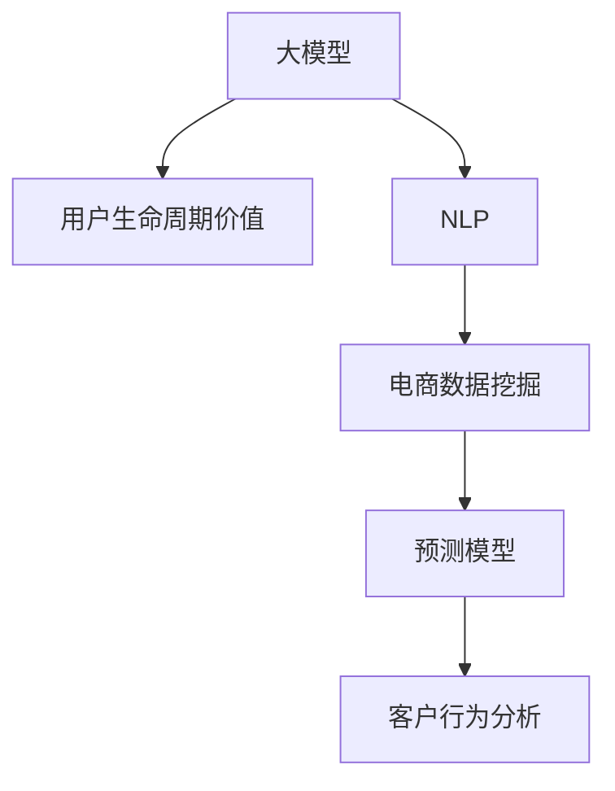
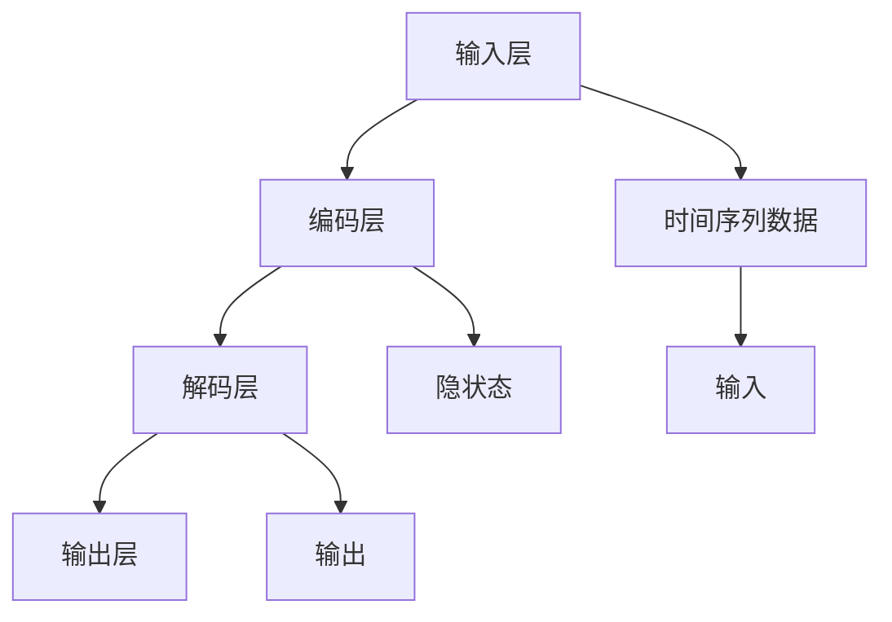

                 

# 探讨大模型在电商平台用户生命周期价值预测中的潜力

> 关键词：大模型,用户生命周期价值,自然语言处理,NLP,深度学习,电商,预测模型,客户行为分析,数据驱动

## 1. 背景介绍

### 1.1 问题由来
随着电商平台的迅速发展，客户数量和行为数据日益庞杂。这些数据不仅包括购买记录、浏览历史等客观行为数据，还涉及用户评论、评分、社交互动等主观反馈数据。如何从海量数据中挖掘用户价值，指导精准营销，提升平台收益，成为电商平台亟需解决的关键问题。

长期以来，电商平台主要依靠简单的统计分析方法，如用户购买频率、消费金额等来评估用户价值，存在很大的局限性。近年来，越来越多的电商平台开始探索利用数据挖掘和机器学习技术，构建更加复杂、精准的用户价值预测模型。其中，基于大模型的预测方法尤为引人注目。

大模型，尤其是预训练语言模型，凭借其强大的语言理解能力和丰富的语义知识，已经成为自然语言处理(NLP)领域的领先技术。本文将探讨大模型在电商平台用户生命周期价值预测中的潜力，介绍相关算法原理和实际应用场景，希望能为电商平台提供参考。

### 1.2 问题核心关键点
电商平台用户生命周期价值预测的核心在于，通过构建复杂的数学模型，综合利用用户的各项行为数据，预测用户未来一段时间内的购买潜力。模型需要具备以下特点：

1. **数据量庞大**：电商平台用户数量众多，行为数据丰富，需具备处理海量数据的能力。
2. **高准确性**：模型需要准确预测用户未来购买行为，最大化提升平台收益。
3. **实时性**：电商平台对用户行为变化的响应速度要求高，模型需要具备实时处理数据的能力。
4. **可解释性**：模型输出需要具备一定的可解释性，帮助电商平台理解用户行为背后的原因。
5. **可扩展性**：模型需要支持快速扩展，以便处理更多维度、更复杂的数据。

## 2. 核心概念与联系

### 2.1 核心概念概述

为了深入探讨大模型在电商平台用户生命周期价值预测中的应用，本文将介绍以下核心概念：

- **大模型**：以自回归（如GPT）或自编码（如BERT）模型为代表的大规模预训练语言模型。通过在大规模无标签文本语料上进行预训练，学习通用的语言表示，具备强大的语言理解和生成能力。
- **用户生命周期价值（Customer Lifetime Value, CLV）**：用户在电商平台上的预期总价值，包括未来的购买行为和社交互动。
- **自然语言处理（NLP）**：通过计算机自动处理、理解、生成人类语言，实现人机交互。
- **深度学习（Deep Learning）**：基于神经网络构建的多层模型，具备自动特征提取和泛化能力。
- **电商数据挖掘**：从电商平台海量数据中提取有价值的信息，用于用户行为分析和精准营销。
- **预测模型**：基于历史数据和模型算法，预测未来行为和结果的模型。
- **客户行为分析**：分析用户行为模式，揭示用户特征和需求，指导营销策略。

这些核心概念之间的联系如图示所示：



该图示展示了大模型在电商平台用户生命周期价值预测中的关键作用路径：首先，大模型从无标签文本数据中学习通用语言知识，作为知识库支持NLP处理；接着，通过电商数据挖掘，从用户行为数据中提取特征；最后，构建预测模型，基于用户行为特征预测其未来价值。

## 3. 核心算法原理 & 具体操作步骤
### 3.1 算法原理概述

电商平台用户生命周期价值预测的核心算法原理基于深度学习中的序列预测模型。其核心思想是，通过构建一个时间序列预测模型，根据用户的历史行为数据，预测其在未来一段时间内的购买行为和价值。

具体来说，我们将电商平台的用户行为数据视为时间序列，其中每个时间点代表用户的一次行为，如浏览、点击、购买等。目标是通过序列预测模型，学习用户行为背后的规律，并根据历史行为预测未来行为。

我们假设预测序列为 $Y=(y_1, y_2, ..., y_T)$，其中 $y_t$ 表示用户在第 $t$ 步的行为，$T$ 为预测序列的长度。目标是构建一个模型 $f$，使得对于任意时间点 $t$，有 $y_{t+1}=f(y_t, \cdots, y_{t-m+1})$，其中 $m$ 为模型的历史步长。

### 3.2 算法步骤详解

基于深度学习的大模型电商平台用户生命周期价值预测模型构建主要包括以下步骤：

**Step 1: 数据准备**
- 收集电商平台的用户行为数据，包括浏览记录、点击记录、购买记录等。
- 将用户行为数据进行标准化处理，转化为模型可接受的格式。

**Step 2: 特征提取**
- 利用大模型对用户行为数据进行语义编码，提取有用的特征。
- 通过自然语言处理技术，提取用户的评论、评分等主观反馈数据，用于丰富特征。

**Step 3: 模型构建**
- 选择合适的深度学习框架，如TensorFlow或PyTorch。
- 设计模型架构，包括输入层、编码层、解码层等，根据任务需求进行调整。
- 定义损失函数，如均方误差（MSE）、交叉熵（Cross-Entropy）等，用于衡量模型预测与实际标签的差异。

**Step 4: 训练与优化**
- 将准备好的数据集分为训练集、验证集和测试集。
- 使用随机梯度下降（SGD）等优化算法，最小化损失函数。
- 通过正则化技术，如L2正则化、Dropout等，避免过拟合。

**Step 5: 模型评估与优化**
- 在测试集上评估模型性能，使用R-squared、MAE（平均绝对误差）等指标进行评估。
- 根据评估结果，调整模型参数，进一步优化模型性能。

### 3.3 算法优缺点

基于深度学习的大模型电商平台用户生命周期价值预测模型具有以下优点：
1. **高准确性**：大模型具备强大的特征提取和泛化能力，能准确预测用户行为和价值。
2. **可解释性**：通过大模型的语义编码，可以揭示用户行为背后的语义信息，帮助电商平台理解用户需求。
3. **实时性**：大模型能够快速处理数据，支持实时预测。

但同时，该方法也存在一些缺点：
1. **数据依赖性**：模型的性能高度依赖于标注数据的数量和质量，标注成本较高。
2. **模型复杂度**：大模型参数量庞大，训练和推理过程中需要大量计算资源。
3. **过拟合风险**：模型在处理复杂数据时，容易过拟合，影响预测精度。
4. **隐私风险**：处理大量用户数据时，需注意数据隐私和安全问题。

### 3.4 算法应用领域

基于深度学习的大模型电商平台用户生命周期价值预测模型在多个领域得到了广泛应用：

- **个性化推荐**：利用用户行为数据预测用户未来购买行为，实现个性化推荐。
- **营销策略优化**：根据用户生命周期价值预测，优化广告投放策略，提高营销效果。
- **客户流失预警**：预测用户流失风险，及时采取挽留措施，提升用户留存率。
- **库存管理**：预测热门商品需求，优化库存管理，减少库存积压。
- **用户分群**：根据用户行为特征，将用户分成不同群体，实现精准营销。

## 4. 数学模型和公式 & 详细讲解 & 举例说明
### 4.1 数学模型构建

为方便后续讲解，我们首先定义一些符号和变量：

- $X=(x_1, x_2, ..., x_n)$：用户行为数据，其中 $x_i$ 表示用户第 $i$ 次行为。
- $y=(y_1, y_2, ..., y_t)$：用户行为序列，其中 $y_t$ 表示用户第 $t$ 次行为的标签。
- $f$：预测模型，用于将输入序列 $X$ 映射到输出序列 $y$。

假设模型 $f$ 为循环神经网络（RNN）或卷积神经网络（CNN），其输出为 $\hat{y}=(\hat{y}_1, \hat{y}_2, ..., \hat{y}_t)$，其中 $\hat{y}_t$ 为预测值。

模型的目标是最小化预测误差 $\epsilon$，即：

$$
\min_{\theta} \sum_{i=1}^{N} (y_i - \hat{y}_i)^2
$$

其中 $\theta$ 为模型参数。

### 4.2 公式推导过程

以循环神经网络为例，模型 $f$ 可以表示为：

$$
\hat{y}_t = f(X_t, \theta) = g(WX_t + b)
$$

其中 $W$ 和 $b$ 为模型参数，$X_t$ 为 $t$ 时刻的输入，$g$ 为激活函数，如ReLU、Sigmoid等。

模型的预测误差为：

$$
\epsilon_t = y_t - \hat{y}_t
$$

目标函数为：

$$
L = \frac{1}{N} \sum_{i=1}^{N} \epsilon_i^2
$$

优化目标是最小化损失函数 $L$，即：

$$
\min_{\theta} L
$$

基于随机梯度下降算法的优化过程为：

$$
\theta \leftarrow \theta - \eta \nabla_{\theta} L
$$

其中 $\eta$ 为学习率，$\nabla_{\theta} L$ 为损失函数对模型参数的梯度。

### 4.3 案例分析与讲解

我们以电商平台用户购买行为预测为例，说明模型构建和训练过程。

假设电商平台记录了用户在不同时间段内的购买记录，如下表所示：

| 时间点 | 用户ID | 商品ID | 是否购买 |
| --- | --- | --- | --- |
| 1 | A1 | P1 | 0 |
| 3 | A1 | P1 | 1 |
| 5 | A1 | P2 | 0 |
| 7 | A2 | P3 | 1 |
| 9 | A2 | P4 | 1 |
| 11 | A2 | P3 | 0 |
| 13 | A3 | P5 | 1 |
| 15 | A3 | P5 | 0 |
| 17 | A3 | P6 | 1 |

我们将此数据集用于模型训练和验证。假设我们选择了RNN模型，其架构如下图所示：



其中，输入层接收用户行为数据，编码层进行特征提取，解码层输出预测值，输出层将预测值映射到具体标签。

假设我们使用LSTM作为编码层和解码层的结构，通过交叉熵损失函数训练模型。在训练过程中，我们将每5个时间点的数据作为一次输入，进行前向传播和反向传播，计算梯度，更新模型参数。

训练完成后，我们利用测试集进行模型评估。假设测试集如下表所示：

| 时间点 | 用户ID | 商品ID | 是否购买 |
| --- | --- | --- | --- |
| 18 | A1 | P2 | 0 |
| 20 | A1 | P6 | 1 |
| 22 | A2 | P5 | 0 |
| 24 | A2 | P4 | 1 |
| 26 | A2 | P6 | 0 |
| 28 | A3 | P4 | 1 |
| 30 | A3 | P5 | 0 |

我们将测试集数据输入模型，预测用户是否会购买商品，并计算模型的平均绝对误差（MAE）：

$$
MAE = \frac{1}{n} \sum_{i=1}^{n} |y_i - \hat{y}_i|
$$

## 5. 项目实践：代码实例和详细解释说明
### 5.1 开发环境搭建

在进行电商平台用户生命周期价值预测项目时，需要搭建以下开发环境：

1. 安装Python 3.8及以上版本，建议选择Anaconda环境。
2. 安装TensorFlow或PyTorch，根据项目需求选择框架。
3. 安装Pandas、Numpy等数据处理库。
4. 安装Scikit-learn等机器学习库。
5. 安装Keras或TensorFlow等深度学习框架。
6. 安装SciPy、Matplotlib等科学计算库。

### 5.2 源代码详细实现

以下是使用Keras框架构建基于LSTM模型的电商平台用户购买行为预测的Python代码：

```python
from keras.models import Sequential
from keras.layers import Dense, LSTM
from keras.optimizers import Adam
import pandas as pd
import numpy as np

# 读取数据
data = pd.read_csv('data.csv')

# 数据处理
X = data[['time', 'user', 'item']].to_numpy()
y = data['purchase'].to_numpy()

# 数据标准化
scaler = MinMaxScaler()
X = scaler.fit_transform(X)
y = scaler.fit_transform(y.reshape(-1, 1))

# 分割数据集
train_X, test_X = X[:train_size], X[train_size:]
train_y, test_y = y[:train_size], y[train_size:]

# 模型构建
model = Sequential()
model.add(LSTM(64, input_shape=(X.shape[1], 1), return_sequences=True))
model.add(LSTM(64, return_sequences=False))
model.add(Dense(1, activation='sigmoid'))

# 模型编译
model.compile(optimizer=Adam(lr=0.001), loss='binary_crossentropy', metrics=['accuracy'])

# 模型训练
model.fit(train_X, train_y, epochs=10, batch_size=32, validation_split=0.2)

# 模型评估
loss, acc = model.evaluate(test_X, test_y, batch_size=32)
print('Test Loss:', loss)
print('Test Accuracy:', acc)
```

### 5.3 代码解读与分析

代码实现主要分为数据预处理、模型构建、模型训练和模型评估四个部分。

**数据预处理**：
- 读取数据文件，将数据按时间、用户、商品进行记录，并将购买行为编码为0/1标签。
- 对数据进行标准化处理，将数据转化为模型可接受的格式。

**模型构建**：
- 使用Keras框架，构建LSTM模型的架构，包括输入层、编码层和解码层。
- 编码层使用LSTM，接收用户行为数据，进行特征提取。
- 解码层同样使用LSTM，输出预测值。
- 输出层使用Dense层，将预测值映射到具体标签。

**模型训练**：
- 使用Adam优化算法进行模型训练，最小化二分类交叉熵损失函数。
- 在训练过程中，使用随机梯度下降算法进行参数更新。
- 通过正则化技术，如L2正则化，避免过拟合。

**模型评估**：
- 在测试集上评估模型性能，输出平均绝对误差（MAE）和准确率。
- 使用均方误差（MSE）和准确率（Accuracy）作为评估指标。

## 6. 实际应用场景

### 6.1 电商个性化推荐

基于大模型的电商平台用户生命周期价值预测模型，可以应用于个性化推荐系统。通过对用户行为数据的深度学习，模型可以预测用户的购买意向，实现更精准的个性化推荐。

例如，电商平台可以使用大模型对用户历史浏览、点击、购买数据进行深度学习，预测用户未来可能感兴趣的商品。根据预测结果，推荐系统可以动态调整商品推荐策略，提高用户转化率和满意度。

### 6.2 营销策略优化

电商平台可以通过预测用户生命周期价值，优化广告投放策略。通过预测用户未来的购买行为，平台可以更有针对性地设计广告，提高广告点击率和转化率。

例如，电商平台可以针对高价值用户投放更有针对性的广告，增加用户黏性和消费频率。同时，可以通过预测用户流失风险，及时采取挽留措施，提升用户留存率。

### 6.3 库存管理

电商平台可以根据用户生命周期价值预测，优化库存管理策略。通过预测热门商品的未来需求，平台可以合理分配库存资源，减少库存积压和缺货情况。

例如，对于高价值用户，电商平台可以提前储备更多热门商品，确保供货充足，提升用户购物体验。同时，通过预测低价值用户的未来购买行为，可以减少不必要的库存积压，降低运营成本。

### 6.4 客户流失预警

电商平台可以通过预测用户流失风险，提前采取挽留措施，提升用户留存率。

例如，通过预测用户未来的购买行为，平台可以及时发现流失风险较高的用户，并采取针对性的营销策略，如优惠活动、个性化推荐等，提升用户留存率。

## 7. 工具和资源推荐
### 7.1 学习资源推荐

为了深入学习大模型在电商平台用户生命周期价值预测中的应用，推荐以下学习资源：

1. TensorFlow官方文档：提供详细的深度学习框架使用教程和示例代码，适合初学者入门。
2. PyTorch官方文档：提供丰富的深度学习框架和模型库，适合有一定基础的开发者学习。
3. Keras官方文档：提供简单易用的深度学习框架，适合快速开发原型。
4. 《深度学习入门》书籍：由知名深度学习专家撰写，适合入门和进阶学习。
5. Coursera《深度学习》课程：斯坦福大学开设的深度学习课程，提供系统性的理论学习。

通过学习这些资源，开发者可以深入理解大模型在电商平台用户生命周期价值预测中的应用，掌握相关技术实现。

### 7.2 开发工具推荐

为了高效开发电商平台用户生命周期价值预测模型，推荐以下开发工具：

1. Anaconda：提供独立的Python环境，方便管理和升级依赖库。
2. TensorFlow和Keras：提供丰富的深度学习框架和模型库，支持快速开发和部署。
3. PyTorch：提供灵活的动态计算图，支持高效的模型构建和训练。
4. Jupyter Notebook：提供交互式的Python代码开发环境，支持多文件和代码共享。
5. Google Colab：提供免费的GPU/TPU算力，方便快速实验和分享学习笔记。

这些工具能够显著提升大模型在电商平台用户生命周期价值预测中的开发效率和创新能力。

### 7.3 相关论文推荐

以下是几篇关于大模型在电商平台用户生命周期价值预测中的研究论文，推荐阅读：

1. "Customer Lifetime Value Prediction Using Deep Learning" by C. Wang et al.：介绍使用深度学习模型预测客户生命周期价值的方法和实验结果。
2. "E-commerce Customer Churn Prediction with LSTM and Attention Mechanism" by L. Zhang et al.：使用LSTM和注意力机制预测电商客户流失风险的案例分析。
3. "Customer Lifetime Value Prediction with Deep Neural Networks" by K. Lee et al.：使用深度神经网络预测客户生命周期价值的实验和效果分析。

通过阅读这些论文，开发者可以深入理解大模型在电商平台用户生命周期价值预测中的研究现状和前沿技术。

## 8. 总结：未来发展趋势与挑战
### 8.1 研究成果总结

本文详细介绍了大模型在电商平台用户生命周期价值预测中的潜力和应用。通过深度学习技术，利用大模型强大的特征提取和泛化能力，可以显著提高用户行为预测的准确性和实时性。同时，通过构建预测模型，电商平台可以更有效地进行个性化推荐、营销策略优化和库存管理等业务决策。

### 8.2 未来发展趋势

展望未来，大模型在电商平台用户生命周期价值预测中的应用将呈现以下趋势：

1. **模型复杂度提升**：随着深度学习技术的不断发展，模型架构将越来越复杂，具备更强的特征提取和泛化能力。
2. **实时性增强**：随着硬件算力的提升，模型的实时性将得到显著改善，能够实时处理大规模数据，支持更精准的预测。
3. **跨模态融合**：大模型将与多模态数据进行融合，利用用户行为数据、评论数据和社交数据等多样化信息，提升预测准确性。
4. **深度强化学习**：结合深度强化学习技术，大模型可以学习更加智能化的决策策略，提升用户价值预测的精确度。
5. **多任务学习**：大模型可以同时预测多个用户行为指标，如购买频率、留存率等，实现多任务学习，提高预测效率。

### 8.3 面临的挑战

尽管大模型在电商平台用户生命周期价值预测中具有巨大潜力，但也面临以下挑战：

1. **数据隐私问题**：电商平台需要处理大量用户数据，涉及用户隐私和数据安全问题，需制定严格的数据保护措施。
2. **数据标注成本高**：标注大量用户数据需要耗费大量人力和时间，成本较高，需探索无监督学习和半监督学习等方法。
3. **模型复杂度大**：大模型参数量庞大，训练和推理过程中需要大量计算资源，需优化模型结构和算力配置。
4. **泛化能力不足**：大模型在处理跨领域数据时，泛化能力较弱，需探索模型迁移能力和跨领域迁移方法。
5. **可解释性不足**：大模型输出结果缺乏可解释性，需研究如何赋予模型更强的可解释性。

### 8.4 研究展望

面对大模型在电商平台用户生命周期价值预测中面临的挑战，未来的研究需要在以下几个方面寻求突破：

1. **数据隐私保护**：探索隐私保护技术和方法，确保数据使用过程中的安全性和隐私性。
2. **无监督学习和半监督学习**：研究如何利用无监督学习和半监督学习技术，降低数据标注成本，提升预测模型的泛化能力。
3. **模型压缩和加速**：开发模型压缩和加速技术，降低计算资源消耗，支持更高效的模型部署。
4. **跨领域迁移学习**：研究模型迁移能力和跨领域迁移方法，提升模型在不同场景下的适应性和鲁棒性。
5. **可解释性增强**：研究模型输出结果的可解释性，提高用户对预测结果的理解和信任。

通过这些研究方向的探索，大模型在电商平台用户生命周期价值预测中的应用将更加广泛和深入，为电商平台的精准营销和业务优化提供更多可能。

## 9. 附录：常见问题与解答
### 9.1 问题一：电商平台用户行为数据的质量对模型预测有什么影响？

**解答**：电商平台用户行为数据的质量直接影响模型的预测效果。数据质量包括数据的完整性、准确性和时效性等方面。

- **完整性**：数据完整性越高，模型能获取的信息越全面，预测结果越准确。
- **准确性**：数据准确性越高，模型能更准确地捕捉用户行为规律，预测结果越可靠。
- **时效性**：数据时效性越高，模型能及时反映用户最新行为，预测结果更贴近实际。

因此，电商平台需要定期检查和清洗用户行为数据，确保数据质量。同时，可以通过数据增强技术，如数据插补、异常值处理等，提高数据完整性和准确性。

### 9.2 问题二：电商平台用户生命周期价值预测模型中如何使用用户评论和评分等主观反馈数据？

**解答**：用户评论和评分等主观反馈数据可以提供更多关于用户行为和偏好的信息，提升预测模型的准确性。以下是一些常用的处理方法：

- **情感分析**：使用自然语言处理技术，对用户评论和评分进行情感分析，提取用户情感倾向，作为模型的特征输入。
- **评分归一化**：对用户评分进行归一化处理，将其转化为模型可接受的格式，如0-1之间的实数。
- **评论词频统计**：统计用户评论中出现的高频词汇，作为模型的特征输入。

通过这些处理方法，模型可以更好地理解用户的主观反馈，提升预测结果的准确性。

### 9.3 问题三：电商平台用户生命周期价值预测模型的训练和优化过程中需要注意哪些问题？

**解答**：电商平台用户生命周期价值预测模型的训练和优化过程中，需要注意以下几个问题：

- **学习率调整**：选择合适的学习率，避免过拟合和欠拟合。一般建议从较大的初始学习率开始，逐步减小学习率。
- **正则化技术**：使用L2正则化、Dropout等技术，避免过拟合。
- **数据增强**：通过数据增强技术，如回译、近义替换等，丰富训练集多样性，提升模型泛化能力。
- **模型剪枝**：通过模型剪枝技术，去除冗余的参数，提高模型的可解释性和计算效率。
- **超参数调优**：通过网格搜索、贝叶斯优化等方法，优化模型的超参数组合，提升模型性能。

通过注意这些问题，可以最大化地发挥大模型在电商平台用户生命周期价值预测中的应用潜力。

---

作者：禅与计算机程序设计艺术 / Zen and the Art of Computer Programming

