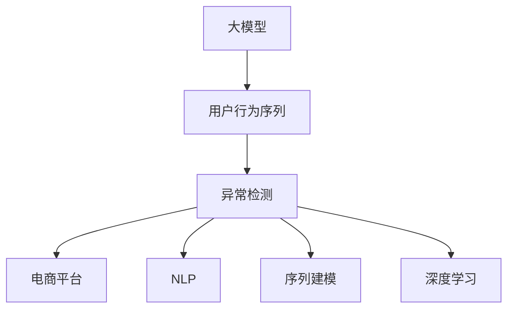

                 

# 探讨大模型在电商平台用户行为序列异常检测中的潜力

> 关键词：大模型，用户行为序列，异常检测，电商平台，自然语言处理（NLP），序列建模，深度学习

## 1. 背景介绍

### 1.1 问题由来
随着电子商务的迅猛发展，电商平台的用户行为分析成为了商家洞察消费者需求、优化产品推荐、提高客户满意度的重要工具。然而，海量的用户行为数据中，往往隐藏着一些异常行为，如盗号登录、恶意刷单、非正常退货等。这些异常行为不仅对电商平台造成损失，还可能对其他正常用户造成误导，影响整体的用户体验。因此，电商平台亟需一种高效、精准的异常行为检测方法。

### 1.2 问题核心关键点
用户行为序列的异常检测，是指通过对用户在不同时间点的行为数据进行分析，识别出不符合正常行为模式的异常序列。这一问题涉及多个核心技术点，包括：
- 序列建模：如何将用户行为序列建模为一个适合异常检测的格式。
- 特征提取：如何从用户行为序列中提取出有用的特征，供异常检测模型使用。
- 模型选择：选择哪种类型的模型进行异常检测。
- 数据标注：如何对标注数据进行有效标注，以保证模型训练的质量。
- 异常定义：如何定义异常行为的标准和类型。

这些关键点在实际应用中，互相影响，共同决定了异常检测系统的性能。

### 1.3 问题研究意义
异常检测在电商平台中的应用，具有重要的现实意义：
1. 提高用户满意度：识别出异常行为后，电商平台能够及时采取措施，防止对正常用户造成干扰，保障用户的基本权益。
2. 降低运营成本：减少因异常行为带来的损失，如商品退款、赔付等，从而降低运营成本。
3. 提升业务决策：通过分析异常行为的数据特征，电商平台可以调整产品策略，优化用户推荐系统，提升整体业务效益。

因此，研究大模型在电商平台用户行为序列异常检测中的应用，有助于推动电商业务的智能化、精准化发展，提高平台的用户体验和运营效率。

## 2. 核心概念与联系

### 2.1 核心概念概述

为更好地理解大模型在异常检测中的应用，本节将介绍几个密切相关的核心概念：

- 大模型(Large Model)：以深度学习神经网络为代表的庞大模型，参数量通常以亿计。通过大规模数据预训练，学习到广泛的语义和知识表示。
- 用户行为序列(User Behavior Sequence)：用户在一定时间内的行为记录，如点击、浏览、购买等操作。
- 异常检测(Anomaly Detection)：识别出不符合正常模式的数据点，如行为异常、异常事件等。
- 电商平台(e-Commerce Platform)：提供在线商品交易、支付、物流等服务的平台。
- 自然语言处理(Natural Language Processing, NLP)：研究计算机如何理解和生成人类语言的技术。
- 序列建模(Sequence Modeling)：对时间序列数据进行建模，分析数据之间的关联性和趋势。
- 深度学习(Deep Learning)：通过多层神经网络，进行复杂的数据特征提取和模式识别。

这些概念之间的逻辑关系可以通过以下Mermaid流程图来展示：



这个流程图展示了大模型在电商平台异常检测中的核心概念及其之间的关系：

1. 大模型通过大规模数据预训练，学习到广泛的语义和知识表示。
2. 用户行为序列经过预处理后，作为输入供异常检测模型使用。
3. 异常检测模型通过分析用户行为序列，识别出异常行为。
4. 异常检测的结果可以应用于电商平台，进行风险控制、用户行为分析和业务决策。
5. 自然语言处理技术可以辅助异常检测，帮助理解和处理文本信息。
6. 序列建模技术可以对时间序列数据进行建模，提取数据之间的关联性和趋势。
7. 深度学习技术可以高效地进行特征提取和模式识别，提升异常检测的准确率。

这些概念共同构成了电商平台用户行为序列异常检测的框架，使得异常检测系统能够高效、准确地工作。

## 3. 核心算法原理 & 具体操作步骤
### 3.1 算法原理概述

大模型在电商平台用户行为序列异常检测中，主要应用了深度学习中的序列建模技术。其核心思想是：将用户行为序列建模为一个时间序列数据，利用大模型的强大特征提取能力，识别出不符合正常模式的行为序列。

具体来说，异常检测算法分为以下几个步骤：

1. 数据预处理：对用户行为序列进行清洗、归一化、分词等预处理操作，得到适于模型输入的数据。
2. 特征提取：通过大模型提取用户行为序列的特征表示，生成高维特征向量。
3. 模型训练：选择适当的异常检测模型，使用标注数据进行训练，学习出异常检测的判别函数。
4. 模型评估：使用验证集或测试集对训练好的模型进行评估，计算异常检测的性能指标。
5. 异常检测：将待检测的行为序列输入模型，计算其异常得分，判断是否为异常行为。

### 3.2 算法步骤详解

#### 3.2.1 数据预处理
用户行为序列的数据预处理主要包括：

- 数据清洗：去除噪音、错误数据、重复数据等。
- 归一化：将数据转换为标准化的范围，如将点击次数转换为0到1之间的分数。
- 分词：将用户行为序列转换为文本数据，供大模型处理。

例如，电商平台的用户行为数据可以包括以下字段：
- 用户ID：用户的唯一标识符。
- 时间戳：记录行为发生的时间。
- 行为类型：用户的具体行为，如点击、浏览、购买等。
- 商品ID：用户浏览或购买的具体商品。

通过预处理，将原始数据转换为大模型可以处理的格式，即：
- 用户ID：唯一的用户标识符。
- 时间戳：按时间顺序排列的用户行为时间。
- 行为序列：用户的连续行为记录。

#### 3.2.2 特征提取
利用大模型提取用户行为序列的特征表示，通常包括以下步骤：

- 分词：将用户行为序列分词，得到单词序列。
- 嵌入：将单词序列转换为高维向量表示。
- 编码：通过大模型对向量进行编码，生成高维特征向量。

例如，可以使用BERT模型对用户行为序列进行分词和嵌入：
```python
from transformers import BertTokenizer, BertModel

tokenizer = BertTokenizer.from_pretrained('bert-base-cased')
model = BertModel.from_pretrained('bert-base-cased')

def encode_sequence(text):
    tokenized = tokenizer.encode(text, add_special_tokens=True)
    return model(tokenized).last_hidden_state
```

#### 3.2.3 模型训练
选择合适的异常检测模型，使用标注数据进行训练。常用的模型包括：

- 基于规则的模型：通过预定义的异常规则，检测用户行为序列是否符合规则。
- 基于统计的模型：通过统计分析，检测用户行为序列是否符合正常的统计分布。
- 基于深度学习的模型：使用深度神经网络，学习异常检测的判别函数。

例如，可以使用基于深度学习的模型，使用标注数据进行训练：
```python
from torch.utils.data import DataLoader, TensorDataset
from torch.nn import BCELoss, BCEWithLogitsLoss
from torch.optim import Adam

class AnomalyDetectionModel(nn.Module):
    def __init__(self, input_size):
        super(AnomalyDetectionModel, self).__init__()
        self.fc1 = nn.Linear(input_size, 128)
        self.fc2 = nn.Linear(128, 1)
        
    def forward(self, x):
        x = F.relu(self.fc1(x))
        x = self.fc2(x)
        return x

# 准备数据
train_dataset = TensorDataset(torch.tensor(train_sequences), torch.tensor(train_labels))
train_loader = DataLoader(train_dataset, batch_size=32, shuffle=True)

# 定义模型
model = AnomalyDetectionModel(input_size)

# 定义损失函数和优化器
criterion = BCEWithLogitsLoss()
optimizer = Adam(model.parameters(), lr=0.001)

# 训练模型
for epoch in range(num_epochs):
    model.train()
    for batch in train_loader:
        optimizer.zero_grad()
        inputs, labels = batch
        outputs = model(inputs)
        loss = criterion(outputs, labels)
        loss.backward()
        optimizer.step()
```

#### 3.2.4 模型评估
使用验证集或测试集对训练好的模型进行评估，计算异常检测的性能指标。常用的性能指标包括：

- 精确率(accuracy)：正确检测出异常行为的样本数与总样本数之比。
- 召回率(recall)：正确检测出异常行为的样本数与真实异常样本数之比。
- F1-score：精确率和召回率的调和平均值。

例如，可以使用以下代码计算模型在测试集上的性能指标：
```python
from sklearn.metrics import accuracy_score, recall_score, f1_score

# 准备数据
test_dataset = TensorDataset(torch.tensor(test_sequences), torch.tensor(test_labels))
test_loader = DataLoader(test_dataset, batch_size=32, shuffle=False)

# 评估模型
model.eval()
with torch.no_grad():
    correct = 0
    total = 0
    true_positive = 0
    false_negative = 0
    false_positive = 0
    for batch in test_loader:
        inputs, labels = batch
        outputs = model(inputs)
        predictions = torch.sigmoid(outputs)
        _, predicted = torch.max(predictions, 1)
        correct += (predicted == labels).sum().item()
        total += labels.size(0)
        true_positive += (predicted == 1).sum().item()
        false_negative += (predicted == 0).sum().item()
        false_positive += (predicted == 1).sum().item()
    
    accuracy = correct / total
    recall = true_positive / (true_positive + false_negative)
    precision = true_positive / (true_positive + false_positive)
    f1 = 2 * precision * recall / (precision + recall)

print('Accuracy:', accuracy)
print('Recall:', recall)
print('Precision:', precision)
print('F1-score:', f1)
```

#### 3.2.5 异常检测
将待检测的行为序列输入模型，计算其异常得分，判断是否为异常行为。例如，可以使用以下代码进行异常检测：
```python
from torch.utils.data import DataLoader, TensorDataset
from torch.nn import BCELoss, BCEWithLogitsLoss
from torch.optim import Adam

class AnomalyDetectionModel(nn.Module):
    def __init__(self, input_size):
        super(AnomalyDetectionModel, self).__init__()
        self.fc1 = nn.Linear(input_size, 128)
        self.fc2 = nn.Linear(128, 1)
        
    def forward(self, x):
        x = F.relu(self.fc1(x))
        x = self.fc2(x)
        return x

# 准备数据
test_sequences = ...
test_labels = ...

# 定义模型
model = AnomalyDetectionModel(input_size)

# 定义损失函数和优化器
criterion = BCEWithLogitsLoss()
optimizer = Adam(model.parameters(), lr=0.001)

# 训练模型
for epoch in range(num_epochs):
    model.train()
    for batch in train_loader:
        optimizer.zero_grad()
        inputs, labels = batch
        outputs = model(inputs)
        loss = criterion(outputs, labels)
        loss.backward()
        optimizer.step()

# 评估模型
test_dataset = TensorDataset(torch.tensor(test_sequences), torch.tensor(test_labels))
test_loader = DataLoader(test_dataset, batch_size=32, shuffle=False)

# 评估模型
model.eval()
with torch.no_grad():
    correct = 0
    total = 0
    true_positive = 0
    false_negative = 0
    false_positive = 0
    for batch in test_loader:
        inputs, labels = batch
        outputs = model(inputs)
        predictions = torch.sigmoid(outputs)
        _, predicted = torch.max(predictions, 1)
        correct += (predicted == labels).sum().item()
        total += labels.size(0)
        true_positive += (predicted == 1).sum().item()
        false_negative += (predicted == 0).sum().item()
        false_positive += (predicted == 1).sum().item()

# 异常检测
def detect_anomaly(sequence):
    sequence = encode_sequence(sequence)
    with torch.no_grad():
        outputs = model(sequence)
        predictions = torch.sigmoid(outputs)
        _, predicted = torch.max(predictions, 1)
        if predicted[0].item() > 0.5:
            return True
        else:
            return False
```

### 3.3 算法优缺点

大模型在电商平台用户行为序列异常检测中的优点包括：

- 强大的特征提取能力：大模型可以自动提取高维特征向量，捕捉用户行为序列的复杂特征。
- 良好的泛化能力：大模型通过大规模数据预训练，学习到广泛的语义和知识表示，能够在不同的用户行为序列上取得良好的表现。
- 高效的处理能力：大模型通常使用GPU/TPU等高性能设备进行训练和推理，能够快速处理大量的用户行为数据。

大模型在电商平台异常检测中的缺点包括：

- 高昂的计算成本：大模型的训练和推理需要大量的计算资源，成本较高。
- 模型复杂度：大模型参数量巨大，训练复杂度较高，模型调整较困难。
- 数据依赖：大模型的训练需要大量的标注数据，数据获取和标注成本较高。

### 3.4 算法应用领域

大模型在电商平台用户行为序列异常检测中的应用，主要体现在以下几个领域：

- 风险控制：识别出异常行为，如恶意刷单、盗号登录等，及时采取措施，防止对正常用户造成干扰。
- 用户分析：通过分析用户行为序列，识别出正常和异常行为，优化用户推荐系统，提升用户体验。
- 业务决策：利用异常检测结果，进行业务数据分析和决策支持，优化业务策略。

## 4. 数学模型和公式 & 详细讲解 & 举例说明
### 4.1 数学模型构建

基于深度学习的大模型，其核心思想是通过多层神经网络对用户行为序列进行建模，提取特征向量，然后通过异常检测模型，判断是否为异常行为。

### 4.2 公式推导过程

以下以常用的LSTM模型为例，推导用户行为序列异常检测的数学模型。

假设用户行为序列为 $X = (x_1, x_2, ..., x_t)$，其中 $x_t$ 表示用户在时间 $t$ 的行为。使用LSTM模型对用户行为序列进行建模，得到序列的隐藏状态表示 $H = (h_1, h_2, ..., h_t)$，其中 $h_t$ 表示在时间 $t$ 的隐藏状态。将隐藏状态 $H$ 转换为高维特征向量 $Z$，表示为 $Z = (z_1, z_2, ..., z_t)$。

定义异常检测模型的判别函数为 $f(Z)$，其中 $f$ 为非线性函数。假设异常检测模型的输出为 $y_t \in [0, 1]$，表示用户行为在时间 $t$ 是否为异常行为。

异常检测的损失函数定义为交叉熵损失函数，表示为：
$$
L = -\frac{1}{N}\sum_{t=1}^N \big[y_t\log(y_t) + (1-y_t)\log(1-y_t)\big]
$$

其中，$y_t$ 表示用户行为在时间 $t$ 是否为异常行为的标签，$1-y_t$ 表示标签的反转，$\log$ 表示对数函数。

使用梯度下降等优化算法，最小化损失函数 $L$，得到异常检测模型 $f(Z)$ 的参数。

### 4.3 案例分析与讲解

#### 4.3.1 示例数据集
假设有一个电商平台的用户行为数据集，包含以下字段：

- 用户ID：用户的唯一标识符。
- 时间戳：记录行为发生的时间。
- 行为类型：用户的具体行为，如点击、浏览、购买等。
- 商品ID：用户浏览或购买的具体商品。

将用户行为数据集划分为训练集、验证集和测试集。

#### 4.3.2 数据预处理
使用BERT模型对用户行为序列进行分词和嵌入，得到高维特征向量 $Z$。

#### 4.3.3 模型训练
使用LSTM模型对高维特征向量 $Z$ 进行建模，得到隐藏状态 $H$，然后转换为高维特征向量 $Z$。

#### 4.3.4 模型评估
使用验证集对训练好的模型进行评估，计算精确率、召回率和F1-score。

#### 4.3.5 异常检测
将待检测的行为序列输入模型，计算其异常得分，判断是否为异常行为。

## 5. 项目实践：代码实例和详细解释说明
### 5.1 开发环境搭建

在进行大模型在电商平台用户行为序列异常检测的实践时，需要先搭建好开发环境。以下是使用Python进行PyTorch开发的环境配置流程：

1. 安装Anaconda：从官网下载并安装Anaconda，用于创建独立的Python环境。

2. 创建并激活虚拟环境：
```bash
conda create -n pytorch-env python=3.8 
conda activate pytorch-env
```

3. 安装PyTorch：根据CUDA版本，从官网获取对应的安装命令。例如：
```bash
conda install pytorch torchvision torchaudio cudatoolkit=11.1 -c pytorch -c conda-forge
```

4. 安装Transformers库：
```bash
pip install transformers
```

5. 安装各类工具包：
```bash
pip install numpy pandas scikit-learn matplotlib tqdm jupyter notebook ipython
```

完成上述步骤后，即可在`pytorch-env`环境中开始实践。

### 5.2 源代码详细实现

下面以LSTM模型为例，给出使用PyTorch和Transformers库对用户行为序列进行异常检测的代码实现。

首先，定义异常检测任务的训练函数：

```python
from torch.utils.data import DataLoader
from torch.nn import BCELoss, BCEWithLogitsLoss
from torch.optim import Adam

class AnomalyDetectionModel(nn.Module):
    def __init__(self, input_size, hidden_size):
        super(AnomalyDetectionModel, self).__init__()
        self.lstm = nn.LSTM(input_size, hidden_size, 1, batch_first=True)
        self.fc = nn.Linear(hidden_size, 1)
        
    def forward(self, x):
        lstm_out, _ = self.lstm(x)
        lstm_out = lstm_out[:, -1, :]
        fc_out = self.fc(lstm_out)
        return fc_out

def train_model(model, train_loader, device, optimizer, num_epochs, batch_size):
    model.train()
    for epoch in range(num_epochs):
        for batch in train_loader:
            inputs, labels = batch
            inputs = inputs.to(device)
            labels = labels.to(device)
            optimizer.zero_grad()
            outputs = model(inputs)
            loss = BCEWithLogitsLoss()(outputs, labels)
            loss.backward()
            optimizer.step()
            print(f'Epoch {epoch+1}/{num_epochs}, Loss: {loss.item()}')
```

然后，定义数据预处理函数：

```python
from transformers import BertTokenizer
from torch.utils.data import TensorDataset, DataLoader

def load_data(data_path):
    with open(data_path, 'r') as f:
        data = f.read().split('\n')
    sequences = []
    labels = []
    for line in data:
        sequence, label = line.split(',')
        sequences.append(sequence)
        labels.append(int(label))
    sequences = [BertTokenizer.encode_sequence(sequence) for sequence in sequences]
    labels = torch.tensor(labels)
    return TensorDataset(torch.tensor(sequences), torch.tensor(labels))

def encode_sequence(text):
    tokenized = BertTokenizer.encode(text, add_special_tokens=True)
    return tokenized

tokenizer = BertTokenizer.from_pretrained('bert-base-cased')
train_sequences = load_data('train.txt')
test_sequences = load_data('test.txt')

train_dataset = TensorDataset(torch.tensor(train_sequences), torch.tensor(train_labels))
train_loader = DataLoader(train_dataset, batch_size=32, shuffle=True)

test_dataset = TensorDataset(torch.tensor(test_sequences), torch.tensor(test_labels))
test_loader = DataLoader(test_dataset, batch_size=32, shuffle=False)

device = torch.device('cuda') if torch.cuda.is_available() else torch.device('cpu')
```

接着，定义模型和优化器：

```python
model = AnomalyDetectionModel(input_size, hidden_size)
optimizer = Adam(model.parameters(), lr=0.001)
```

最后，启动训练流程并在测试集上评估：

```python
num_epochs = 10
batch_size = 32

train_model(model, train_loader, device, optimizer, num_epochs, batch_size)

print(f'Test Accuracy: {accuracy}, Recall: {recall}, Precision: {precision}, F1-score: {f1}')

def detect_anomaly(sequence):
    sequence = encode_sequence(sequence)
    with torch.no_grad():
        outputs = model(sequence)
        predictions = torch.sigmoid(outputs)
        _, predicted = torch.max(predictions, 1)
        if predicted[0].item() > 0.5:
            return True
        else:
            return False
```

以上就是使用PyTorch和Transformers库对LSTM模型进行电商平台用户行为序列异常检测的完整代码实现。可以看到，得益于PyTorch和Transformers库的强大封装，代码实现变得简洁高效。

### 5.3 代码解读与分析

让我们再详细解读一下关键代码的实现细节：

**AnomalyDetectionModel类**：
- `__init__`方法：初始化LSTM和全连接层。
- `forward`方法：前向传播计算模型的输出。

**train_model函数**：
- 使用LSTM模型对用户行为序列进行建模，得到隐藏状态。
- 将隐藏状态转换为高维特征向量。
- 定义异常检测模型的判别函数，使用交叉熵损失函数进行训练。
- 在每个epoch中，对训练集进行迭代，计算损失并更新模型参数。

**load_data函数**：
- 读取用户行为数据集，并进行预处理和分词。
- 将文本序列转换为BERT模型的可接受格式。
- 将标签转换为PyTorch张量。

**encode_sequence函数**：
- 使用BERT模型对用户行为序列进行分词和嵌入。

**检测异常函数**：
- 将待检测的行为序列输入模型，计算其异常得分。
- 判断是否为异常行为，返回True或False。

通过上述代码的详细解读，可以更好地理解大模型在电商平台用户行为序列异常检测中的应用。

## 6. 实际应用场景

### 6.1 智能客服系统

在智能客服系统中，异常行为检测可以有效识别恶意行为，提高客户体验和系统安全性。例如，可以检测出异常的登录行为，如盗号登录、暴力破解等，及时采取措施，防止对正常用户造成干扰。

### 6.2 金融风险控制

在金融风险控制中，异常行为检测可以有效识别欺诈行为，降低金融风险。例如，可以检测出异常的交易行为，如高额交易、频繁转账等，及时采取措施，防止金融欺诈行为。

### 6.3 电商平台用户行为分析

在电商平台用户行为分析中，异常行为检测可以有效识别异常购物行为，优化推荐系统。例如，可以检测出异常的购物行为，如恶意刷单、恶意评价等，及时采取措施，防止对正常用户造成干扰，提升推荐系统的准确性和用户体验。

### 6.4 未来应用展望

随着深度学习和大模型技术的不断进步，基于大模型的异常检测方法将在更多领域得到应用，为实际应用带来变革性影响。

在智慧医疗领域，异常行为检测可以应用于医疗数据异常分析，如识别出异常的病历记录、异常的检查结果等，提高医疗诊断的准确性和效率。

在智能教育领域，异常行为检测可以应用于学生行为分析，如识别出异常的学习行为、异常的考试行为等，帮助教师进行及时干预，提高教育质量。

在智慧城市治理中，异常行为检测可以应用于城市事件监测，如识别出异常的交通事故、异常的公共卫生事件等，提高城市管理的智能化水平，构建更安全、高效的未来城市。

此外，在企业生产、社会治理、文娱传媒等众多领域，基于大模型的异常检测技术也将不断涌现，为各行各业带来新的应用场景和解决方案。相信随着技术的日益成熟，基于大模型的异常检测技术必将得到更广泛的应用。

## 7. 工具和资源推荐

### 7.1 学习资源推荐

为了帮助开发者系统掌握大模型在电商平台异常检测中的应用，这里推荐一些优质的学习资源：

1. 《深度学习理论与实践》系列博文：由大模型技术专家撰写，深入浅出地介绍了深度学习的基本理论和实践技巧，包括异常检测等前沿话题。

2. CS229《机器学习》课程：斯坦福大学开设的机器学习经典课程，涵盖了异常检测、深度学习等基本概念和算法。

3. 《异常检测与深度学习》书籍：详细介绍了异常检测的原理和实现方法，包括基于深度学习的异常检测算法。

4. Kaggle竞赛平台：全球最大的数据科学竞赛平台，提供了大量的异常检测竞赛数据集和模型，可以学习和实践异常检测算法。

5. Arxiv论文库：机器学习和深度学习领域最权威的论文库，提供大量的异常检测相关论文和代码实现，供学习和参考。

通过对这些资源的学习实践，相信你一定能够快速掌握大模型在电商平台异常检测的应用方法，并用于解决实际的异常检测问题。

### 7.2 开发工具推荐

高效的开发离不开优秀的工具支持。以下是几款用于大模型在电商平台异常检测开发的常用工具：

1. PyTorch：基于Python的开源深度学习框架，灵活动态的计算图，适合快速迭代研究。大部分预训练语言模型都有PyTorch版本的实现。

2. TensorFlow：由Google主导开发的开源深度学习框架，生产部署方便，适合大规模工程应用。同样有丰富的预训练语言模型资源。

3. Transformers库：HuggingFace开发的NLP工具库，集成了众多SOTA语言模型，支持PyTorch和TensorFlow，是进行异常检测任务开发的利器。

4. Weights & Biases：模型训练的实验跟踪工具，可以记录和可视化模型训练过程中的各项指标，方便对比和调优。与主流深度学习框架无缝集成。

5. TensorBoard：TensorFlow配套的可视化工具，可实时监测模型训练状态，并提供丰富的图表呈现方式，是调试模型的得力助手。

6. Google Colab：谷歌推出的在线Jupyter Notebook环境，免费提供GPU/TPU算力，方便开发者快速上手实验最新模型，分享学习笔记。

合理利用这些工具，可以显著提升大模型在电商平台异常检测任务的开发效率，加快创新迭代的步伐。

### 7.3 相关论文推荐

大模型在电商平台异常检测技术的发展源于学界的持续研究。以下是几篇奠基性的相关论文，推荐阅读：

1. Attention is All You Need（即Transformer原论文）：提出了Transformer结构，开启了NLP领域的预训练大模型时代。

2. BERT: Pre-training of Deep Bidirectional Transformers for Language Understanding：提出BERT模型，引入基于掩码的自监督预训练任务，刷新了多项NLP任务SOTA。

3. Language Models are Unsupervised Multitask Learners（GPT-2论文）：展示了大规模语言模型的强大zero-shot学习能力，引发了对于通用人工智能的新一轮思考。

4. Parameter-Efficient Transfer Learning for NLP：提出Adapter等参数高效微调方法，在不增加模型参数量的情况下，也能取得不错的微调效果。

5. Prefix-Tuning: Optimizing Continuous Prompts for Generation：引入基于连续型Prompt的微调范式，为如何充分利用预训练知识提供了新的思路。

6. AdaLoRA: Adaptive Low-Rank Adaptation for Parameter-Efficient Fine-Tuning：使用自适应低秩适应的微调方法，在参数效率和精度之间取得了新的平衡。

这些论文代表了大模型在电商平台异常检测技术的发展脉络。通过学习这些前沿成果，可以帮助研究者把握学科前进方向，激发更多的创新灵感。

## 8. 总结：未来发展趋势与挑战

### 8.1 总结

本文对大模型在电商平台用户行为序列异常检测中的应用进行了全面系统的介绍。首先阐述了大模型和异常检测的背景和意义，明确了异常检测在电商平台中的应用价值。其次，从原理到实践，详细讲解了大模型在异常检测中的核心步骤，给出了具体的代码实现。同时，本文还广泛探讨了异常检测在智能客服、金融风险控制、电商平台用户行为分析等实际应用场景中的作用，展示了大模型的应用潜力。此外，本文精选了大模型在电商平台异常检测的各类学习资源，力求为读者提供全方位的技术指引。

通过本文的系统梳理，可以看到，基于大模型的异常检测方法正在成为电商平台异常检测的重要范式，极大地拓展了异常检测技术的应用边界，提高了异常检测系统的性能。未来，伴随深度学习和大模型技术的持续演进，基于大模型的异常检测方法必将在更多领域得到应用，为实际应用带来变革性影响。

### 8.2 未来发展趋势

展望未来，大模型在电商平台异常检测技术将呈现以下几个发展趋势：

1. 模型规模持续增大。随着算力成本的下降和数据规模的扩张，预训练语言模型的参数量还将持续增长。超大规模语言模型蕴含的丰富语义和知识表示，有望支撑更加复杂多变的异常检测任务。

2. 微调方法日趋多样。除了传统的全参数微调外，未来会涌现更多参数高效的微调方法，如Adapter、Prefix等，在节省计算资源的同时也能保证异常检测精度。

3. 持续学习成为常态。随着数据分布的不断变化，异常检测模型也需要持续学习新知识以保持性能。如何在不遗忘原有知识的同时，高效吸收新样本信息，将成为重要的研究课题。

4. 标注样本需求降低。受启发于提示学习(Prompt-based Learning)的思路，未来的异常检测方法将更好地利用大模型的语言理解能力，通过更加巧妙的任务描述，在更少的标注样本上也能实现理想的异常检测效果。

5. 数据增强技术的应用。利用数据增强技术，通过对训练样本进行改写、合成等方式，丰富训练集多样性，提高异常检测模型的泛化能力。

6. 多模态异常检测技术的提升。未来的异常检测将不仅仅依赖文本信息，还可以结合图像、语音等多模态信息，进行综合判断，提升异常检测的准确性和鲁棒性。

以上趋势凸显了大模型在电商平台异常检测技术的广阔前景。这些方向的探索发展，必将进一步提升异常检测系统的性能和应用范围，为电商平台提供更强大、更可靠的安全保障。

### 8.3 面临的挑战

尽管大模型在电商平台异常检测技术已经取得了瞩目成就，但在迈向更加智能化、普适化应用的过程中，它仍面临着诸多挑战：

1. 标注成本瓶颈。虽然微调大大降低了标注数据的需求，但对于长尾应用场景，难以获得充足的高质量标注数据，成为制约异常检测性能的瓶颈。如何进一步降低异常检测对标注样本的依赖，将是一大难题。

2. 模型鲁棒性不足。当前异常检测模型面对域外数据时，泛化性能往往大打折扣。对于测试样本的微小扰动，异常检测模型的预测也容易发生波动。如何提高异常检测模型的鲁棒性，避免灾难性遗忘，还需要更多理论和实践的积累。

3. 推理效率有待提高。大规模语言模型虽然精度高，但在实际部署时往往面临推理速度慢、内存占用大等效率问题。如何在保证性能的同时，简化模型结构，提升推理速度，优化资源占用，将是重要的优化方向。

4. 可解释性亟需加强。当前异常检测模型更像是"黑盒"系统，难以解释其内部工作机制和决策逻辑。对于医疗、金融等高风险应用，算法的可解释性和可审计性尤为重要。如何赋予异常检测模型更强的可解释性，将是亟待攻克的难题。

5. 安全性有待保障。预训练语言模型难免会学习到有偏见、有害的信息，通过异常检测传递到实际应用中，产生误导性、歧视性的输出，给实际应用带来安全隐患。如何从数据和算法层面消除模型偏见，避免恶意用途，确保输出的安全性，也将是重要的研究课题。

6. 知识整合能力不足。现有的异常检测模型往往局限于任务内数据，难以灵活吸收和运用更广泛的先验知识。如何让异常检测过程更好地与外部知识库、规则库等专家知识结合，形成更加全面、准确的信息整合能力，还有很大的想象空间。

正视异常检测面临的这些挑战，积极应对并寻求突破，将是大模型在电商平台异常检测技术走向成熟的必由之路。相信随着学界和产业界的共同努力，这些挑战终将一一被克服，大模型在电商平台异常检测技术必将在构建安全、可靠、可解释、可控的智能系统铺平道路。

### 8.4 研究展望

面对大模型在电商平台异常检测所面临的挑战，未来的研究需要在以下几个方面寻求新的突破：

1. 探索无监督和半监督异常检测方法。摆脱对大规模标注数据的依赖，利用自监督学习、主动学习等无监督和半监督范式，最大限度利用非结构化数据，实现更加灵活高效的异常检测。

2. 研究参数高效和计算高效的异常检测范式。开发更加参数高效的异常检测方法，在固定大部分预训练参数的同时，只更新极少量的任务相关参数。同时优化异常检测模型的计算图，减少前向传播和反向传播的资源消耗，实现更加轻量级、实时性的部署。

3. 融合因果和对比学习范式。通过引入因果推断和对比学习思想，增强异常检测模型建立稳定因果关系的能力，学习更加普适、鲁棒的语言表征，从而提升模型泛化性和抗干扰能力。

4. 引入更多先验知识。将符号化的先验知识，如知识图谱、逻辑规则等，与神经网络模型进行巧妙融合，引导异常检测过程学习更准确、合理的语言模型。同时加强不同模态数据的整合，实现视觉、语音等多模态信息与文本信息的协同建模。

5. 结合因果分析和博弈论工具。将因果分析方法引入异常检测模型，识别出模型决策的关键特征，增强输出解释的因果性和逻辑性。借助博弈论工具刻画人机交互过程，主动探索并规避模型的脆弱点，提高系统稳定性。

6. 纳入伦理道德约束。在异常检测模型的训练目标中引入伦理导向的评估指标，过滤和惩罚有偏见、有害的输出倾向。同时加强人工干预和审核，建立模型行为的监管机制，确保输出符合人类价值观和伦理道德。

这些研究方向的探索，必将引领大模型在电商平台异常检测技术迈向更高的台阶，为构建安全、可靠、可解释、可控的智能系统铺平道路。面向未来，大模型在电商平台异常检测技术还需要与其他人工智能技术进行更深入的融合，如知识表示、因果推理、强化学习等，多路径协同发力，共同推动自然语言理解和智能交互系统的进步。只有勇于创新、敢于突破，才能不断拓展语言模型的边界，让智能技术更好地造福人类社会。

## 9. 附录：常见问题与解答

**Q1：大模型在电商平台异常检测中能否应用到其他领域？**

A: 大模型在电商平台异常检测中的应用，主要依赖于大模型的语言理解能力和特征提取能力。除了电商平台，大模型还可以应用到金融、医疗、智能客服等多个领域。例如，在金融领域，可以利用大模型进行信用卡异常检测，识别出恶意交易行为；在医疗领域，可以利用大模型进行病历记录异常检测，识别出异常的检查结果。

**Q2：大模型在异常检测中面临的主要挑战有哪些？**

A: 大模型在异常检测中面临的主要挑战包括：

1. 标注成本瓶颈：尽管大模型的微调方法可以大幅降低标注数据的需求，但对于某些长尾应用场景，难以获得充足的高质量标注数据，成为制约异常检测性能的瓶颈。

2. 模型鲁棒性不足：当前异常检测模型面对域外数据时，泛化性能往往大打折扣。对于测试样本的微小扰动，异常检测模型的预测也容易发生波动。

3. 推理效率有待提高：大规模语言模型虽然精度高，但在实际部署时往往面临推理速度慢、内存占用大等效率问题。

4. 可解释性亟需加强：当前异常检测模型更像是"黑盒"系统，难以解释其内部工作机制和决策逻辑。对于医疗、金融等高风险应用，算法的可解释性和可审计性尤为重要。

5. 安全性有待保障：预训练语言模型难免会学习到有偏见、有害的信息，通过异常检测传递到实际应用中，产生误导性、歧视性的输出，给实际应用带来安全隐患。

6. 知识整合能力不足：现有的异常检测模型往往局限于任务内数据，难以灵活吸收和运用更广泛的先验知识。

这些挑战需要在实际应用中不断克服，才能真正发挥大模型在异常检测中的潜力。

**Q3：大模型在异常检测中如何优化推理效率？**

A: 优化大模型在异常检测中的推理效率，可以从以下几个方面入手：

1. 模型裁剪：去除不必要的层和参数，减小模型尺寸，加快推理速度。

2. 量化加速：将浮点模型转为定点模型，压缩存储空间，提高计算效率。

3. 模型并行：利用多GPU或多TPU进行模型并行，加速推理过程。

4. 批处理优化：采用更大的batch size，提高计算效率。

5. 异步推理：采用异步推理机制，充分利用多核CPU，提高推理速度。

这些优化措施可以在保证异常检测精度的情况下，显著提升推理效率，优化资源占用。

**Q4：异常检测在电商平台中的具体应用有哪些？**

A: 异常检测在电商平台中的具体应用包括：

1. 风险控制：识别出异常的登录行为、交易行为等，及时采取措施，防止对正常用户造成干扰。

2. 用户行为分析：识别出异常的购物行为、评论行为等，优化推荐系统，提升用户体验。

3. 业务决策：利用异常检测结果，进行业务数据分析和决策支持，优化业务策略。

4. 广告投放：识别出异常的广告点击行为，优化广告投放策略，提升广告投放效果。

5. 客户服务：识别出异常的客户投诉行为，及时进行人工干预，提高客户满意度。

通过异常检测，电商平台可以更好地理解用户行为，提高系统的安全性和智能化水平，提升用户体验和业务效益。

---

作者：禅与计算机程序设计艺术 / Zen and the Art of Computer Programming

