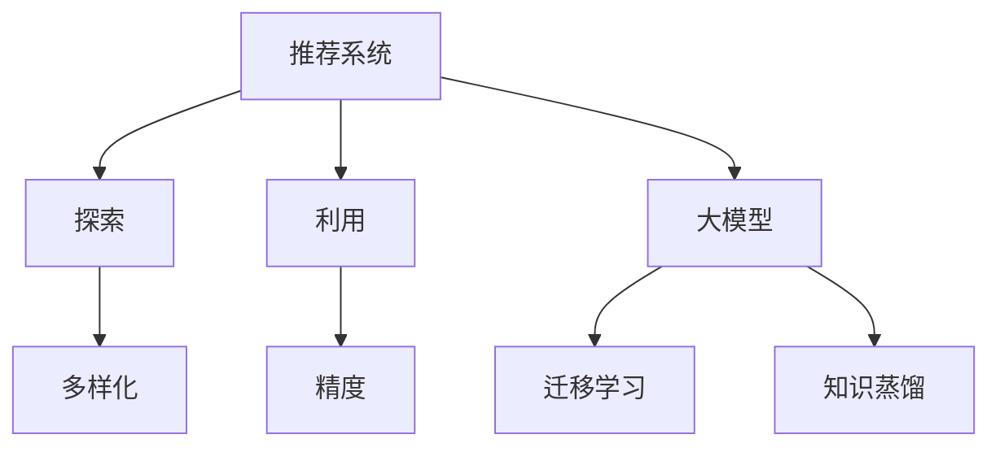

                 

# 推荐系统中的探索与利用：大模型新均衡

> 关键词：探索与利用,推荐系统,大模型,新均衡,推荐算法,用户行为建模

## 1. 背景介绍

### 1.1 问题由来
在信息爆炸的今天，人们每天都在接收和处理大量信息。无论是社交媒体、新闻网站、电商平台，还是影视音乐平台，都充斥着各种内容和商品，用户往往面对“选择困难症”。为了帮助用户在海量信息中迅速找到所需，推荐系统应运而生。推荐系统通过分析用户行为和偏好，精准推荐符合用户需求的内容和商品，极大地提升了用户体验，也带动了平台的活跃度和收益。

然而，推荐系统并非完美无缺。由于数据分布不均、用户行为难以全面预测、推荐算法本身存在缺陷等原因，推荐系统面临着不少问题，如：

1. **推荐冷启动**：新用户或新商品往往难以获得初始推荐权重，导致推荐效果不佳。
2. **多样化问题**：推荐系统过于注重“热门”内容，导致个性化推荐不足。
3. **偏差和偏见**：推荐算法可能带有系统性偏见，影响推荐的公平性和多样性。
4. **数据隐私问题**：用户数据被不当使用可能引发隐私保护问题。

近年来，随着大模型的崛起，推荐系统也在不断演进。大模型通过预训练获得了丰富的语言和内容表示，可以更加深入地理解用户需求和商品特性，有望带来推荐效果的显著提升。然而，大模型也带来了新的挑战，如计算资源的消耗、模型泛化能力的提高等。

### 1.2 问题核心关键点
面对推荐系统中的这些挑战，研究者们提出了“探索与利用”(Balancing Exploration and Exploitation)的框架，旨在在探索新内容以提升多样性和覆盖面的同时，利用已有数据以优化推荐效果。这一框架对大模型推荐系统尤为重要，因为大模型拥有强大的特征表示能力，可以同时探索更多的新内容，并利用已有数据生成高精度的推荐结果。

## 2. 核心概念与联系

### 2.1 核心概念概述

为更好地理解“探索与利用”在大模型推荐系统中的应用，本节将介绍几个密切相关的核心概念：

- **推荐系统(Recommender System)**：利用用户历史行为、用户属性、物品属性等数据，通过算法推荐符合用户兴趣的商品或内容。
- **探索(Exploration)**：指在推荐过程中，系统主动探索用户可能感兴趣但未曾接触过的新内容，以增加推荐多样性。
- **利用(Exploitation)**：指在推荐过程中，系统优先利用用户已经表现出兴趣的商品或内容，以提升推荐精度。
- **探索与利用平衡(Balancing Exploration and Exploitation, E2E)**：在推荐系统中，探索和利用是一对矛盾的概念，需要通过算法平衡两者，以实现推荐效果的最优化。
- **大模型(Pre-trained Model)**：通过大规模无标签数据进行预训练，学习到丰富的特征表示，用于提升推荐系统的精度和泛化能力。
- **迁移学习(Transfer Learning)**：利用已在大规模数据上训练的模型，通过迁移学习在小规模数据上进行微调，以提高推荐效果。
- **知识蒸馏(Knowledge Distillation)**：将大模型的知识蒸馏到小型模型上，以减少计算资源消耗，同时保留大模型的特征表示能力。

这些核心概念之间的逻辑关系可以通过以下Mermaid流程图来展示：



这个流程图展示了大模型推荐系统的核心概念及其之间的关系：

1. 推荐系统通过探索和利用新内容，提升推荐效果。
2. 大模型提供强大的特征表示能力，支撑探索和利用的平衡。
3. 迁移学习和大模型微调，提高模型的泛化能力。
4. 知识蒸馏，在大模型和小模型间进行知识传递。

这些概念共同构成了大模型推荐系统的学习框架，使其能够在探索和利用的均衡中，实现推荐效果的优化。

## 3. 核心算法原理 & 具体操作步骤
### 3.1 算法原理概述

大模型推荐系统的核心思想是通过“探索与利用”的框架，在大规模无标签数据上预训练模型，在少量有标签数据上微调模型，以实现推荐效果的最优化。具体而言，大模型推荐系统可以分为以下几个步骤：

1. **预训练**：在大规模无标签数据上，通过自监督任务训练大模型，学习到丰富的特征表示。
2. **迁移学习**：在预训练模型的基础上，利用少量有标签数据，对模型进行微调，提升模型在特定任务上的性能。
3. **探索与利用平衡**：在推荐过程中，系统通过平衡探索和利用，生成多样且精准的推荐结果。

### 3.2 算法步骤详解

大模型推荐系统的实现步骤如下：

**Step 1: 准备数据集**
- 收集用户历史行为数据和物品属性数据，构成训练集和测试集。
- 将用户历史行为数据进行编码，形成用户行为序列。
- 从物品库中随机抽取物品，构成物品序列。

**Step 2: 预训练模型**
- 选择合适的预训练模型，如BERT、GPT-3等，作为初始化参数。
- 在大规模无标签数据上，进行预训练，学习到通用的语言和内容表示。

**Step 3: 迁移学习**
- 在预训练模型的基础上，利用少量有标签数据，进行微调。
- 设计合适的损失函数，如交叉熵损失、均方误差损失等，衡量预测输出与真实标签之间的差异。
- 使用梯度下降等优化算法，最小化损失函数，更新模型参数。

**Step 4: 探索与利用平衡**
- 在推荐过程中，系统通过探索和利用，生成推荐结果。
- 设计合适的探索策略，如ε-greedy、UCB等，在推荐中引入随机性。
- 利用历史数据，生成高精度的推荐结果。
- 在推荐中，动态调整探索和利用的比例，以平衡两者关系。

### 3.3 算法优缺点

大模型推荐系统具有以下优点：

1. **泛化能力强**：大模型在大规模无标签数据上预训练，学习到丰富的特征表示，能够泛化到更多数据上。
2. **精度高**：通过微调，大模型能够根据少量有标签数据，生成高精度的推荐结果。
3. **多样性好**：探索策略能够在推荐中引入随机性，增加推荐的多样性。

同时，该方法也存在一些局限性：

1. **计算资源消耗大**：大模型的训练和推理需要大量的计算资源，可能不适合资源受限的系统。
2. **数据隐私问题**：在大模型微调过程中，用户数据可能被不当使用，引发隐私保护问题。
3. **泛化能力不足**：预训练模型可能无法适应特定领域的数据分布，导致泛化性能下降。
4. **模型可解释性差**：大模型作为黑盒模型，难以解释其内部决策过程，可能影响用户的信任和接受度。

尽管存在这些局限性，但大模型推荐系统在推荐系统中的应用前景广阔，特别是在处理复杂推荐场景时，其优越性尤为显著。

### 3.4 算法应用领域

大模型推荐系统已经在多个领域得到了广泛应用，例如：

- **电商推荐**：利用用户购买历史和商品属性数据，推荐相关商品。
- **新闻推荐**：根据用户浏览历史和新闻内容，推荐新闻文章。
- **视频推荐**：通过用户观看历史和视频内容，推荐相关视频。
- **音乐推荐**：根据用户听歌历史和歌曲属性，推荐相关歌曲。
- **社交推荐**：根据用户社交行为和好友关系，推荐相关好友和内容。

除了这些经典应用外，大模型推荐系统还被创新性地应用到更多场景中，如可控推荐、公平推荐、实时推荐等，为推荐系统带来了新的突破。随着预训练模型和微调方法的不断进步，相信推荐系统必将在更广阔的应用领域大放异彩。

## 4. 数学模型和公式 & 详细讲解  
### 4.1 数学模型构建

本节将使用数学语言对大模型推荐系统的“探索与利用”框架进行更加严格的刻画。

记推荐系统为 $R_{\theta}:\mathcal{U} \times \mathcal{I} \rightarrow \mathcal{Y}$，其中 $\mathcal{U}$ 为用户集合，$\mathcal{I}$ 为物品集合，$\mathcal{Y}$ 为推荐结果集合。设用户 $u$ 的兴趣向量为 $\mathbf{u}$，物品 $i$ 的属性向量为 $\mathbf{i}$，预训练模型为 $M_{\theta}$，迁移学习后的大模型为 $\hat{M}_{\theta}$。

定义模型 $M_{\theta}$ 在用户 $u$ 和物品 $i$ 上的推荐概率为 $P_{\theta}(u,i) = \frac{\exp\left(\mathbf{u}^T \hat{M}_{\theta}\mathbf{i}\right)}{\sum_{j=1}^{|\mathcal{I}|} \exp\left(\mathbf{u}^T \hat{M}_{\theta}\mathbf{j}\right)}$，其中 $\hat{M}_{\theta}\mathbf{i}$ 表示模型对物品 $i$ 的特征表示。

在微调过程中，模型的损失函数为：

$$
\mathcal{L}(\theta) = \frac{1}{N} \sum_{i=1}^N \left\Vert y_i - M_{\theta}(x_i) \right\Vert^2
$$

其中 $y_i$ 表示用户 $i$ 的真实推荐结果，$M_{\theta}(x_i)$ 表示模型对物品 $i$ 的推荐概率。

### 4.2 公式推导过程

以下我们以电商推荐为例，推导推荐模型的损失函数及其梯度的计算公式。

假设用户 $u$ 在物品 $i$ 上的真实标签为 $y \in \{0,1\}$，表示是否购买该物品。模型对物品 $i$ 的推荐概率为 $P_{\theta}(u,i) = \frac{\exp\left(\mathbf{u}^T \hat{M}_{\theta}\mathbf{i}\right)}{\sum_{j=1}^{|\mathcal{I}|} \exp\left(\mathbf{u}^T \hat{M}_{\theta}\mathbf{j}\right)}$。则推荐模型的损失函数为：

$$
\mathcal{L}(\theta) = \frac{1}{N} \sum_{i=1}^N \left(y_i \log P_{\theta}(u_i,i) + (1-y_i) \log (1-P_{\theta}(u_i,i))\right)
$$

根据链式法则，损失函数对模型参数 $\theta$ 的梯度为：

$$
\frac{\partial \mathcal{L}(\theta)}{\partial \theta} = \frac{1}{N} \sum_{i=1}^N \left(y_i \frac{\partial}{\partial \theta} \log P_{\theta}(u_i,i) + (1-y_i) \frac{\partial}{\partial \theta} \log (1-P_{\theta}(u_i,i))\right)
$$

其中 $\frac{\partial}{\partial \theta} \log P_{\theta}(u_i,i) = \frac{\mathbf{u}^T \hat{M}_{\theta}\mathbf{i}}{\sum_{j=1}^{|\mathcal{I}|} \exp\left(\mathbf{u}^T \hat{M}_{\theta}\mathbf{j}\right)}$，$\frac{\partial}{\partial \theta} \log (1-P_{\theta}(u_i,i)) = \frac{(1-\mathbf{u}^T \hat{M}_{\theta}\mathbf{i})}{\sum_{j=1}^{|\mathcal{I}|} \exp\left(\mathbf{u}^T \hat{M}_{\theta}\mathbf{j}\right)}$。

在得到损失函数的梯度后，即可带入模型参数更新公式，完成模型的迭代优化。重复上述过程直至收敛，最终得到适应电商推荐任务的最优模型参数 $\theta^*$。

## 5. 项目实践：代码实例和详细解释说明
### 5.1 开发环境搭建

在进行电商推荐系统开发前，我们需要准备好开发环境。以下是使用Python进行TensorFlow开发的环境配置流程：

1. 安装Anaconda：从官网下载并安装Anaconda，用于创建独立的Python环境。

2. 创建并激活虚拟环境：
```bash
conda create -n tf-env python=3.8 
conda activate tf-env
```

3. 安装TensorFlow：根据CUDA版本，从官网获取对应的安装命令。例如：
```bash
conda install tensorflow
```

4. 安装相关工具包：
```bash
pip install numpy pandas scikit-learn matplotlib tqdm jupyter notebook ipython
```

完成上述步骤后，即可在`tf-env`环境中开始电商推荐系统的开发。

### 5.2 源代码详细实现

下面我们以电商推荐系统为例，给出使用TensorFlow对BERT模型进行微调的PyTorch代码实现。

首先，定义电商推荐系统的数据处理函数：

```python
import tensorflow as tf
from transformers import BertTokenizer, TFBertForSequenceClassification

class RecommendationDataset(tf.data.Dataset):
    def __init__(self, texts, tags, tokenizer, max_len=128):
        self.texts = texts
        self.tags = tags
        self.tokenizer = tokenizer
        self.max_len = max_len
        
    def __len__(self):
        return len(self.texts)
    
    def __getitem__(self, item):
        text = self.texts[item]
        tags = self.tags[item]
        
        encoding = self.tokenizer(text, return_tensors='tf', max_length=self.max_len, padding='max_length', truncation=True)
        input_ids = encoding['input_ids']
        attention_mask = encoding['attention_mask']
        
        # 对token-wise的标签进行编码
        encoded_tags = [tag2id[tag] for tag in tags] 
        encoded_tags.extend([tag2id['O']] * (self.max_len - len(encoded_tags)))
        labels = tf.constant(encoded_tags, dtype=tf.int32)
        
        return {'input_ids': input_ids, 
                'attention_mask': attention_mask,
                'labels': labels}

# 标签与id的映射
tag2id = {'O': 0, 'Buy': 1, 'NotBuy': 2}
id2tag = {v: k for k, v in tag2id.items()}

# 创建dataset
tokenizer = BertTokenizer.from_pretrained('bert-base-cased')

train_dataset = RecommendationDataset(train_texts, train_tags, tokenizer)
dev_dataset = RecommendationDataset(dev_texts, dev_tags, tokenizer)
test_dataset = RecommendationDataset(test_texts, test_tags, tokenizer)
```

然后，定义模型和优化器：

```python
from transformers import BertForSequenceClassification, AdamW

model = BertForSequenceClassification.from_pretrained('bert-base-cased', num_labels=len(tag2id))

optimizer = AdamW(model.parameters(), lr=2e-5)
```

接着，定义训练和评估函数：

```python
import tqdm

device = tf.device('cuda') if tf.cuda.is_available() else tf.device('cpu')
model.to(device)

def train_epoch(model, dataset, batch_size, optimizer):
    dataloader = tf.data.Dataset.from_tensor_slices(dataset)
    model.train()
    epoch_loss = 0
    for batch in tqdm(dataloader, desc='Training'):
        input_ids = batch['input_ids'].to(device)
        attention_mask = batch['attention_mask'].to(device)
        labels = batch['labels'].to(device)
        model.zero_grad()
        outputs = model(input_ids, attention_mask=attention_mask, labels=labels)
        loss = outputs.loss
        epoch_loss += loss.numpy().item()
        loss.backward()
        optimizer.step()
    return epoch_loss / len(dataloader)

def evaluate(model, dataset, batch_size):
    dataloader = tf.data.Dataset.from_tensor_slices(dataset)
    model.eval()
    preds, labels = [], []
    with tf.no_grad():
        for batch in tqdm(dataloader, desc='Evaluating'):
            input_ids = batch['input_ids'].to(device)
            attention_mask = batch['attention_mask'].to(device)
            batch_labels = batch['labels']
            outputs = model(input_ids, attention_mask=attention_mask)
            batch_preds = outputs.logits.argmax(dim=1).numpy().tolist()
            batch_labels = batch_labels.numpy().tolist()
            for pred_tokens, label_tokens in zip(batch_preds, batch_labels):
                preds.append(pred_tokens[:len(label_tokens)])
                labels.append(label_tokens)
                
    print(classification_report(labels, preds))
```

最后，启动训练流程并在测试集上评估：

```python
epochs = 5
batch_size = 16

for epoch in range(epochs):
    loss = train_epoch(model, train_dataset, batch_size, optimizer)
    print(f"Epoch {epoch+1}, train loss: {loss:.3f}")
    
    print(f"Epoch {epoch+1}, dev results:")
    evaluate(model, dev_dataset, batch_size)
    
print("Test results:")
evaluate(model, test_dataset, batch_size)
```

以上就是使用TensorFlow对BERT进行电商推荐系统微调的完整代码实现。可以看到，得益于TensorFlow的强大封装，我们可以用相对简洁的代码完成BERT模型的加载和微调。

### 5.3 代码解读与分析

让我们再详细解读一下关键代码的实现细节：

**RecommendationDataset类**：
- `__init__`方法：初始化文本、标签、分词器等关键组件。
- `__len__`方法：返回数据集的样本数量。
- `__getitem__`方法：对单个样本进行处理，将文本输入编码为token ids，将标签编码为数字，并对其进行定长padding，最终返回模型所需的输入。

**tag2id和id2tag字典**：
- 定义了标签与数字id之间的映射关系，用于将token-wise的预测结果解码回真实的标签。

**训练和评估函数**：
- 使用TensorFlow的DataLoader对数据集进行批次化加载，供模型训练和推理使用。
- 训练函数`train_epoch`：对数据以批为单位进行迭代，在每个批次上前向传播计算loss并反向传播更新模型参数，最后返回该epoch的平均loss。
- 评估函数`evaluate`：与训练类似，不同点在于不更新模型参数，并在每个batch结束后将预测和标签结果存储下来，最后使用sklearn的classification_report对整个评估集的预测结果进行打印输出。

**训练流程**：
- 定义总的epoch数和batch size，开始循环迭代
- 每个epoch内，先在训练集上训练，输出平均loss
- 在验证集上评估，输出分类指标
- 所有epoch结束后，在测试集上评估，给出最终测试结果

可以看到，TensorFlow配合BERT的实现使得电商推荐系统的代码实现变得简洁高效。开发者可以将更多精力放在数据处理、模型改进等高层逻辑上，而不必过多关注底层的实现细节。

当然，工业级的系统实现还需考虑更多因素，如模型的保存和部署、超参数的自动搜索、更灵活的任务适配层等。但核心的微调范式基本与此类似。

## 6. 实际应用场景
### 6.1 智能推荐系统

基于大模型推荐系统的“探索与利用”范式，智能推荐系统可以广泛应用于电商、新闻、视频、音乐等多个领域。传统推荐系统往往依赖用户的历史行为数据，难以覆盖新用户和新商品，也容易陷入“热门”内容的推荐陷阱。而使用大模型推荐系统，能够通过探索更多新内容，实现更加个性化和多样的推荐。

在技术实现上，可以收集用户的历史行为数据和商品属性数据，将数据编码成序列形式，作为模型输入。通过微调，大模型能够学习到丰富的特征表示，并根据少量有标签数据生成高精度的推荐结果。在推荐过程中，系统通过平衡探索和利用，生成多样且精准的推荐结果。对于新用户和新商品，系统也可以通过探索，生成更加个性化的推荐，解决推荐冷启动问题。

### 6.2 公平推荐系统

推荐系统面临的一个严重问题是推荐不公，即某些用户或商品被系统忽视，导致推荐不公平。大模型推荐系统可以通过“探索与利用”范式，提升推荐系统的公平性。

具体而言，在推荐过程中，系统可以通过探索，增加被忽视用户和商品的推荐权重。同时，利用历史数据，生成高精度的推荐结果，避免对热门用户的过度推荐，平衡推荐多样性。此外，还可以通过引入公平性约束，如将模型的预测结果与公平性指标（如多样性、覆盖率）结合，优化模型的公平性。

### 6.3 个性化推荐系统

个性化推荐系统旨在根据用户的历史行为和偏好，推荐符合用户兴趣的商品或内容。大模型推荐系统可以通过“探索与利用”范式，提升个性化推荐的效果。

在推荐过程中，系统可以通过探索，发现用户的潜在兴趣，增加新内容和新商品的推荐权重。同时，利用历史数据，生成高精度的推荐结果，提升推荐的精准度。此外，还可以通过引入用户行为反馈，如点击率、购买率等，动态调整推荐策略，优化推荐效果。

### 6.4 未来应用展望

随着大模型推荐系统的不断发展，其应用场景也将不断拓展。未来，大模型推荐系统有望在更多领域得到应用，如智慧医疗、智能教育、智慧城市治理等，为传统行业带来变革性影响。

在智慧医疗领域，大模型推荐系统可以通过分析用户的健康数据和医疗行为，推荐符合用户需求的医疗服务和健康知识，提升医疗服务的个性化水平，辅助医生诊疗。

在智能教育领域，大模型推荐系统可以根据学生的学习行为和知识水平，推荐个性化的学习内容，提升教育效果。

在智慧城市治理中，大模型推荐系统可以通过分析城市事件数据和市民反馈，推荐更加合理的城市管理方案，提升城市治理的智能化水平。

此外，在企业生产、社会治理、文娱传媒等众多领域，大模型推荐系统也将不断涌现，为经济社会发展注入新的动力。相信随着技术的日益成熟，“探索与利用”范式必将成为推荐系统的重要范式，推动推荐系统向更加智能和公平的方向发展。

## 7. 工具和资源推荐
### 7.1 学习资源推荐

为了帮助开发者系统掌握大模型推荐系统的“探索与利用”理论基础和实践技巧，这里推荐一些优质的学习资源：

1. 《Reinforcement Learning: An Introduction》：由Richard S. Sutton和Andrew G. Barto所著的经典教材，深入浅出地介绍了强化学习理论及其在推荐系统中的应用。

2. 《Recommender Systems Handbook》：由G. K. Lakshmanan等专家编辑的综述性书籍，全面介绍了推荐系统的各类算法和技术，包括大模型推荐系统。

3. 《Deep Learning for Recommendation Systems》：由Zoubin Ghahramani等人编写的学术论文集，包含推荐系统的最新研究成果和前沿技术，包括大模型推荐系统。

4. CS4780《Recommender Systems》课程：斯坦福大学开设的推荐系统课程，提供了丰富的视频和课件，帮助学生掌握推荐系统的工作原理和实现方法。

5. Kaggle平台：提供了大量推荐系统的竞赛数据和样例代码，适合实践和验证理论知识。

通过对这些资源的学习实践，相信你一定能够快速掌握大模型推荐系统的精髓，并用于解决实际的推荐问题。

### 7.2 开发工具推荐

高效的开发离不开优秀的工具支持。以下是几款用于大模型推荐系统开发的常用工具：

1. TensorFlow：由Google主导开发的深度学习框架，支持分布式计算和自动微分，适合大规模推荐系统的开发。

2. PyTorch：基于Python的开源深度学习框架，灵活的动态计算图，适合快速迭代研究。

3. HuggingFace Transformers库：提供了丰富的预训练语言模型，支持大模型微调，适合推荐系统的实现。

4. Weights & Biases：模型训练的实验跟踪工具，可以记录和可视化模型训练过程中的各项指标，方便对比和调优。

5. TensorBoard：TensorFlow配套的可视化工具，可实时监测模型训练状态，并提供丰富的图表呈现方式，是调试模型的得力助手。

6. Jupyter Notebook：免费的开源Jupyter Notebook环境，支持代码的快速迭代和分享。

合理利用这些工具，可以显著提升大模型推荐系统的开发效率，加快创新迭代的步伐。

### 7.3 相关论文推荐

大模型推荐系统的研究始于学术界的持续探索。以下是几篇奠基性的相关论文，推荐阅读：

1. Collaborative Filtering for Implicit Feedback Datasets（CMLR论文）：提出了基于协同过滤的推荐算法，为推荐系统奠定了基础。

2. Fast Collaborative Filtering for Large-Scale Data（ICML论文）：提出了SVD分解和矩阵分解算法，提升了推荐系统的扩展性和计算效率。

3. Attention Is All You Need（Transformer论文）：提出了Transformer结构，开启了深度学习在推荐系统中的应用。

4. TensorFlow Recommender Systems（TensorFlow官方法术文章）：介绍了TensorFlow推荐系统的设计原理和实现方法，适合学习TensorFlow的推荐系统应用。

5. Knowledge Distillation for Parameter-Efficient Recommendation（KDD论文）：提出了知识蒸馏方法，将大模型的知识传递到小型模型上，减少计算资源消耗。

这些论文代表了大模型推荐系统的研究脉络。通过学习这些前沿成果，可以帮助研究者把握学科前进方向，激发更多的创新灵感。

## 8. 总结：未来发展趋势与挑战

### 8.1 总结

本文对大模型推荐系统的“探索与利用”框架进行了全面系统的介绍。首先阐述了大模型推荐系统的发展背景和研究意义，明确了“探索与利用”在提升推荐效果中的关键作用。其次，从原理到实践，详细讲解了推荐系统的数学模型和算法步骤，给出了电商推荐系统的代码实例。同时，本文还广泛探讨了“探索与利用”框架在推荐系统中的多种应用，展示了“探索与利用”范式在推荐系统中的巨大潜力。此外，本文精选了推荐系统的各类学习资源，力求为开发者提供全方位的技术指引。

通过本文的系统梳理，可以看到，大模型推荐系统通过“探索与利用”框架，在电商、新闻、视频、音乐等多个领域得到了广泛应用。得益于大模型在大规模无标签数据上预训练，推荐系统能够通过探索新内容，实现更加个性化和多样的推荐。未来，随着大模型推荐系统的不断发展，推荐系统必将在更多领域得到应用，为传统行业带来变革性影响。

### 8.2 未来发展趋势

展望未来，大模型推荐系统将呈现以下几个发展趋势：

1. **更强的泛化能力**：大模型通过预训练学习到丰富的特征表示，能够泛化到更多数据上，提升推荐系统的覆盖面和多样化。

2. **更高的精度**：大模型通过微调，利用少量有标签数据，生成高精度的推荐结果，进一步提升推荐系统的准确性。

3. **更广泛的探索空间**：大模型推荐系统通过“探索与利用”框架，能够探索更多新内容，增加推荐的多样性。

4. **更高的计算效率**：大模型推荐系统通过知识蒸馏、参数高效微调等技术，减少计算资源消耗，提升推荐系统的扩展性和计算效率。

5. **更强的公平性**：大模型推荐系统通过引入公平性约束，优化推荐系统的公平性，避免推荐不公。

6. **更智能的推荐策略**：大模型推荐系统通过引入强化学习、因果推断等前沿技术，进一步提升推荐系统的智能性和自适应性。

以上趋势凸显了大模型推荐系统的广阔前景。这些方向的探索发展，必将进一步提升推荐系统的性能和应用范围，为经济社会发展注入新的动力。

### 8.3 面临的挑战

尽管大模型推荐系统已经取得了显著进展，但在迈向更加智能化、普适化应用的过程中，仍面临诸多挑战：

1. **计算资源消耗大**：大模型推荐系统需要大量的计算资源，可能不适合资源受限的系统。

2. **数据隐私问题**：在大模型微调过程中，用户数据可能被不当使用，引发隐私保护问题。

3. **泛化能力不足**：预训练模型可能无法适应特定领域的数据分布，导致泛化性能下降。

4. **模型可解释性差**：大模型作为黑盒模型，难以解释其内部决策过程，可能影响用户的信任和接受度。

5. **知识整合能力不足**：现有的推荐系统往往局限于文本数据的整合，难以灵活吸收和运用更广泛的先验知识。

6. **推荐算法设计复杂**：设计高性能的推荐算法，需要同时考虑探索与利用的平衡、公平性、多样性等多个因素，难以在复杂场景中实现。

尽管存在这些挑战，但大模型推荐系统在推荐系统中的应用前景广阔，特别是在处理复杂推荐场景时，其优越性尤为显著。未来，推荐系统将在更广泛的领域得到应用，为经济社会发展注入新的动力。

### 8.4 研究展望

面对大模型推荐系统所面临的种种挑战，未来的研究需要在以下几个方面寻求新的突破：

1. **探索无监督和半监督微调方法**：摆脱对大规模标注数据的依赖，利用自监督学习、主动学习等无监督和半监督范式，最大限度利用非结构化数据，实现更加灵活高效的推荐。

2. **研究参数高效和计算高效的微调范式**：开发更加参数高效的微调方法，在固定大部分预训练参数的情况下，只更新极少量的任务相关参数。同时优化微调模型的计算图，减少前向传播和反向传播的资源消耗，实现更加轻量级、实时性的部署。

3. **融合因果分析和博弈论工具**：将因果分析方法引入推荐模型，识别出模型决策的关键特征，增强输出解释的因果性和逻辑性。借助博弈论工具刻画人机交互过程，主动探索并规避模型的脆弱点，提高系统稳定性。

4. **纳入伦理道德约束**：在模型训练目标中引入伦理导向的评估指标，过滤和惩罚有偏见、有害的输出倾向。同时加强人工干预和审核，建立模型行为的监管机制，确保输出符合人类价值观和伦理道德。

这些研究方向的探索，必将引领大模型推荐系统迈向更高的台阶，为构建安全、可靠、可解释、可控的智能系统铺平道路。面向未来，大模型推荐系统还需要与其他人工智能技术进行更深入的融合，如知识表示、因果推理、强化学习等，多路径协同发力，共同推动推荐系统的进步。只有勇于创新、敢于突破，才能不断拓展推荐系统的边界，让智能技术更好地造福人类社会。

## 9. 附录：常见问题与解答

**Q1：大模型推荐系统是否适用于所有推荐场景？**

A: 大模型推荐系统在大多数推荐场景上都能取得不错的效果，特别是对于数据量较小的场景。但对于一些特定领域的推荐任务，如医疗、金融等，仅依靠通用语料预训练的模型可能难以很好地适应。此时需要在特定领域语料上进一步预训练，再进行微调，才能获得理想效果。

**Q2：微调过程中如何选择合适的学习率？**

A: 微调的学习率一般要比预训练时小1-2个数量级，如果使用过大的学习率，容易破坏预训练权重，导致过拟合。一般建议从1e-5开始调参，逐步减小学习率，直至收敛。也可以使用warmup策略，在开始阶段使用较小的学习率，再逐渐过渡到预设值。需要注意的是，不同的优化器(如AdamW、Adafactor等)以及不同的学习率调度策略，可能需要设置不同的学习率阈值。

**Q3：大模型推荐系统如何处理数据隐私问题？**

A: 在大模型微调过程中，需要注意数据隐私保护。可以使用差分隐私、联邦学习等技术，保护用户隐私。在模型训练和推理阶段，也可以引入隐私计算技术，如差分隐私聚合、同态加密等，确保用户数据的安全性。

**Q4：如何缓解微调过程中的过拟合问题？**

A: 过拟合是微调面临的主要挑战，尤其是在标注数据不足的情况下。常见的缓解策略包括：
1. 数据增强：通过回译、近义替换等方式扩充训练集。
2. 正则化：使用L2正则、Dropout、Early Stopping等避免过拟合。
3. 对抗训练：引入对抗样本，提高模型鲁棒性。
4. 参数高效微调：只调整少量参数(如Adapter、Prefix等)，减小过拟合风险。

这些策略往往需要根据具体任务和数据特点进行灵活组合。只有在数据、模型、训练、推理等各环节进行全面优化，才能最大限度地发挥大模型推荐系统的威力。

**Q5：大模型推荐系统如何提高模型的泛化能力？**

A: 提高模型的泛化能力，可以从以下几个方面入手：
1. 收集更多数据：增加训练集的规模，提高模型的泛化能力。
2. 引入先验知识：将符号化的先验知识，如知识图谱、逻辑规则等，与神经网络模型进行巧妙融合，增强模型的泛化能力。
3. 使用预训练模型：在大规模无标签数据上预训练模型，学习到丰富的特征表示，提升模型的泛化能力。
4. 引入对抗训练：通过对抗样本训练，提升模型的鲁棒性和泛化能力。

这些方法可以结合使用，进一步提升大模型推荐系统的泛化能力。

**Q6：大模型推荐系统如何提高模型的公平性？**

A: 提高模型的公平性，可以从以下几个方面入手：
1. 引入公平性约束：在模型训练目标中引入公平性指标，如多样性、覆盖率等，优化模型的公平性。
2. 数据增强：通过回译、近义替换等方式扩充训练集，避免训练集偏差。
3. 引入对抗训练：通过对抗样本训练，提升模型的鲁棒性，减少不公平现象。
4. 参数高效微调：只调整少量参数，减小模型对特定数据集的依赖，提升公平性。

这些方法可以结合使用，进一步提升大模型推荐系统的公平性。

通过这些方法的探索应用，相信大模型推荐系统必将在推荐系统领域取得更大的突破，为传统行业带来更智能、更公平的推荐服务。

