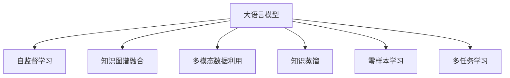

                 

# 推荐系统中的跨域知识迁移：大模型技术

> 关键词：推荐系统,跨域知识迁移,大模型,自监督学习,知识图谱,多模态数据,知识蒸馏,深度学习

## 1. 背景介绍

### 1.1 问题由来
推荐系统在电商、新闻、社交等众多领域得到广泛应用。传统推荐算法如协同过滤、基于内容的推荐等，主要依赖用户行为数据和物品特征，容易陷入冷启动、稀疏性等问题。随着深度学习和大规模预训练语言模型的发展，推荐系统进入深度学习时代，基于矩阵分解、神经网络等方法，可以更高效地利用用户行为数据，挖掘推荐信息。然而，深度学习推荐系统也面临数据稀缺、模型复杂、计算资源消耗大等问题。

近年来，大语言模型（如BERT、GPT等）在自然语言处理（NLP）领域取得了巨大突破。通过大规模预训练，模型具备了丰富的语言知识和常识，可以用于下游NLP任务。受到其启发，大模型也被引入推荐系统，进一步推动了推荐技术的发展。大模型在推荐系统中的应用，主要集中在跨域知识迁移上，通过将不同领域、不同模态的知识进行整合，使得模型具备更广泛的语义理解和推理能力，从而提升推荐系统的表现。

### 1.2 问题核心关键点
跨域知识迁移的核心在于如何将不同领域、不同模态的知识，有效地传递到目标任务中，以提升推荐系统的精度和泛化能力。以下是核心关键点：

1. 自监督学习：利用无标签数据进行预训练，学习通用的语言表示和知识结构。
2. 知识图谱融合：将知识图谱中的关系和实体信息，与预训练模型进行融合，引入领域知识。
3. 多模态数据利用：结合文本、图像、语音等多种模态数据，增强模型的表征能力。
4. 知识蒸馏：通过知识蒸馏技术，将大模型的知识传递给小型模型，实现知识迁移。
5. 零样本学习：在不进行标注的情况下，利用大模型的语言理解能力，进行跨域知识迁移。
6. 多任务学习：通过设计多任务学习目标，同时训练多个相关任务，实现跨域知识迁移。

这些关键点共同构成了跨域知识迁移的主要范式，通过引入外部知识，扩展了深度学习推荐系统的表现力和泛化能力。

## 2. 核心概念与联系

### 2.1 核心概念概述

为了更好地理解跨域知识迁移的大模型技术，本节将介绍几个密切相关的核心概念：

- 大语言模型(Large Language Model, LLM)：以自回归(如GPT)或自编码(如BERT)模型为代表的大规模预训练语言模型。通过在大规模无标签文本语料上进行预训练，学习通用的语言知识和常识，具备强大的语言理解和生成能力。

- 自监督学习(Self-Supervised Learning)：利用无标签数据进行预训练，学习模型的通用表示，减少对标注数据的依赖。常见的自监督学习任务包括掩码语言模型、句子模拟等。

- 知识图谱(Knowledge Graph)：以图结构形式表示实体、关系和属性的知识库，用于描述现实世界的信息。

- 多模态数据(Multimodal Data)：结合文本、图像、语音、视频等多种信息形式的数据。多模态数据的融合，可以提升模型的表征能力。

- 知识蒸馏(Knowledge Distillation)：通过将大模型的知识传递给小型模型，提高小型模型的性能。知识蒸馏常用于知识迁移和模型压缩。

- 零样本学习(Zero-shot Learning)：指模型在没有见过特定任务的训练样本的情况下，仅凭任务描述就能够执行新任务的能力。

- 多任务学习(Multi-task Learning)：通过设计多个相关的学习任务，共同训练一个模型，提升模型的泛化能力和迁移能力。

这些核心概念之间的逻辑关系可以通过以下Mermaid流程图来展示：



这个流程图展示了大语言模型与各核心概念的联系，强调了自监督学习、知识图谱、多模态数据、知识蒸馏等技术在跨域知识迁移中的应用。

## 3. 核心算法原理 & 具体操作步骤
### 3.1 算法原理概述

跨域知识迁移的大模型技术，其核心思想是通过将不同领域、不同模态的知识，整合到预训练语言模型中，提升模型的泛化能力和推荐性能。具体来说，大模型在预训练阶段，通过自监督学习任务，学习通用的语言表示和知识结构。在微调阶段，利用知识图谱、多模态数据等外部知识，进一步增强模型的表现力。最终，通过知识蒸馏、多任务学习等技术，将大模型的知识传递给小型推荐模型，实现知识的迁移和泛化。

### 3.2 算法步骤详解

跨域知识迁移的大模型技术，一般包括以下几个关键步骤：

**Step 1: 准备预训练模型和数据集**
- 选择合适的预训练语言模型，如BERT、GPT等，作为初始化参数。
- 收集不同领域、不同模态的数据集，包括文本、图像、视频等。
- 将数据集划分为训练集、验证集和测试集。

**Step 2: 添加任务适配层**
- 根据推荐任务，设计合适的输出层和损失函数。
- 对于排序任务，通常使用交叉熵损失函数。
- 对于推荐任务，通常使用Mean Squared Error (MSE)损失函数。

**Step 3: 设置微调超参数**
- 选择合适的优化算法及其参数，如AdamW、SGD等，设置学习率、批大小、迭代轮数等。
- 设置正则化技术及强度，包括权重衰减、Dropout、Early Stopping等。
- 确定冻结预训练参数的策略，如仅微调顶层，或全部参数都参与微调。

**Step 4: 执行梯度训练**
- 将训练集数据分批次输入模型，前向传播计算损失函数。
- 反向传播计算参数梯度，根据设定的优化算法和学习率更新模型参数。
- 周期性在验证集上评估模型性能，根据性能指标决定是否触发Early Stopping。
- 重复上述步骤直到满足预设的迭代轮数或Early Stopping条件。

**Step 5: 测试和部署**
- 在测试集上评估微调后模型，对比微调前后的精度提升。
- 使用微调后的模型对新样本进行推理预测，集成到实际的应用系统中。
- 持续收集新的数据，定期重新微调模型，以适应数据分布的变化。

以上是跨域知识迁移的大模型技术的一般流程。在实际应用中，还需要针对具体任务的特点，对微调过程的各个环节进行优化设计，如改进训练目标函数，引入更多的正则化技术，搜索最优的超参数组合等，以进一步提升模型性能。

### 3.3 算法优缺点

跨域知识迁移的大模型技术具有以下优点：
1. 泛化能力强。引入外部知识后，模型可以更好地泛化到不同领域和任务，提升推荐精度。
2. 知识迁移效果好。通过知识蒸馏等技术，可以高效传递大模型的知识，避免从头训练所需的大量数据和计算资源。
3. 多模态数据利用。结合文本、图像、语音等多种模态数据，提升模型的表征能力和推荐效果。
4. 可解释性强。大模型通常具备较强的可解释性，可以更好地理解用户需求和推荐逻辑。

同时，该技术也存在一定的局限性：
1. 数据依赖性强。不同领域的数据分布可能差异较大，如何处理数据不平衡问题是关键。
2. 模型复杂度高。引入多模态数据和外部知识后，模型的复杂度会显著增加，需要更多的计算资源。
3. 训练时间长。模型参数量增大，训练过程可能耗时更长，需要更高的算力支持。
4. 知识对齐难。不同领域和模态的知识如何有效对齐，是一个挑战。

尽管存在这些局限性，但就目前而言，跨域知识迁移的大模型技术仍是大模型在推荐系统应用中的重要范式。未来相关研究的重点在于如何进一步降低数据依赖，提高模型的跨领域迁移能力，同时兼顾可解释性和计算效率。

### 3.4 算法应用领域

跨域知识迁移的大模型技术，已经在多个推荐系统任务上取得了优异的效果，如商品推荐、新闻推荐、视频推荐等。以下是几个典型的应用场景：

**电商推荐系统**：在电商领域，大模型可以利用用户评论、商品描述、用户行为等多种信息，进行多模态融合和跨领域知识迁移，提升推荐的个性化和多样性。

**新闻推荐系统**：新闻推荐系统需要从海量文章中推荐优质内容，大模型可以利用知识图谱和文章标题、摘要等文本信息，提升推荐的准确性和相关性。

**视频推荐系统**：视频推荐系统需要从用户行为和视频内容中提取特征，进行推荐。大模型可以通过多模态数据融合和跨领域知识迁移，提升推荐的性能。

**音乐推荐系统**：音乐推荐系统需要从歌曲文本、标签、用户行为等多种信息中提取特征，进行推荐。大模型可以利用多模态数据和跨领域知识，提升推荐的效果。

除了这些经典任务外，大模型在社交、旅游、金融等诸多领域也有应用前景，为推荐系统带来了新的突破。随着预训练模型和跨域知识迁移技术的发展，相信推荐系统必将在更广阔的应用领域发挥重要作用。

## 4. 数学模型和公式 & 详细讲解  
### 4.1 数学模型构建

本节将使用数学语言对跨域知识迁移的大模型技术进行更加严格的刻画。

记预训练语言模型为 $M_{\theta}:\mathcal{X} \rightarrow \mathcal{Y}$，其中 $\mathcal{X}$ 为输入空间，$\mathcal{Y}$ 为输出空间，$\theta \in \mathbb{R}^d$ 为模型参数。假设推荐任务的数据集为 $D=\{(x_i,y_i)\}_{i=1}^N, x_i \in \mathcal{X}, y_i \in \mathcal{Y}$。

定义模型 $M_{\theta}$ 在数据样本 $(x,y)$ 上的损失函数为 $\ell(M_{\theta}(x),y)$，则在数据集 $D$ 上的经验风险为：

$$
\mathcal{L}(\theta) = \frac{1}{N} \sum_{i=1}^N \ell(M_{\theta}(x_i),y_i)
$$

微调的优化目标是最小化经验风险，即找到最优参数：

$$
\theta^* = \mathop{\arg\min}_{\theta} \mathcal{L}(\theta)
$$

在实践中，我们通常使用基于梯度的优化算法（如SGD、Adam等）来近似求解上述最优化问题。设 $\eta$ 为学习率，$\lambda$ 为正则化系数，则参数的更新公式为：

$$
\theta \leftarrow \theta - \eta \nabla_{\theta}\mathcal{L}(\theta) - \eta\lambda\theta
$$

其中 $\nabla_{\theta}\mathcal{L}(\theta)$ 为损失函数对参数 $\theta$ 的梯度，可通过反向传播算法高效计算。

### 4.2 公式推导过程

以下我们以电商推荐任务为例，推导交叉熵损失函数及其梯度的计算公式。

假设模型 $M_{\theta}$ 在输入 $x$ 上的输出为 $\hat{y}=M_{\theta}(x) \in [0,1]$，表示物品被推荐到用户列表中的概率。真实标签 $y \in \{1,0\}$。则二分类交叉熵损失函数定义为：

$$
\ell(M_{\theta}(x),y) = -[y\log \hat{y} + (1-y)\log (1-\hat{y})]
$$

将其代入经验风险公式，得：

$$
\mathcal{L}(\theta) = -\frac{1}{N}\sum_{i=1}^N [y_i\log M_{\theta}(x_i)+(1-y_i)\log(1-M_{\theta}(x_i))]
$$

根据链式法则，损失函数对参数 $\theta_k$ 的梯度为：

$$
\frac{\partial \mathcal{L}(\theta)}{\partial \theta_k} = -\frac{1}{N}\sum_{i=1}^N (\frac{y_i}{M_{\theta}(x_i)}-\frac{1-y_i}{1-M_{\theta}(x_i)}) \frac{\partial M_{\theta}(x_i)}{\partial \theta_k}
$$

其中 $\frac{\partial M_{\theta}(x_i)}{\partial \theta_k}$ 可进一步递归展开，利用自动微分技术完成计算。

在得到损失函数的梯度后，即可带入参数更新公式，完成模型的迭代优化。重复上述过程直至收敛，最终得到适应推荐任务的最优模型参数 $\theta^*$。

## 5. 项目实践：代码实例和详细解释说明
### 5.1 开发环境搭建

在进行跨域知识迁移的大模型微调实践前，我们需要准备好开发环境。以下是使用Python进行PyTorch开发的环境配置流程：

1. 安装Anaconda：从官网下载并安装Anaconda，用于创建独立的Python环境。

2. 创建并激活虚拟环境：
```bash
conda create -n pytorch-env python=3.8 
conda activate pytorch-env
```

3. 安装PyTorch：根据CUDA版本，从官网获取对应的安装命令。例如：
```bash
conda install pytorch torchvision torchaudio cudatoolkit=11.1 -c pytorch -c conda-forge
```

4. 安装Transformers库：
```bash
pip install transformers
```

5. 安装各类工具包：
```bash
pip install numpy pandas scikit-learn matplotlib tqdm jupyter notebook ipython
```

完成上述步骤后，即可在`pytorch-env`环境中开始跨域知识迁移的大模型微调实践。

### 5.2 源代码详细实现

下面我以电商推荐任务为例，给出使用Transformers库对BERT模型进行跨域知识迁移的PyTorch代码实现。

首先，定义电商推荐任务的数据处理函数：

```python
from transformers import BertTokenizer
from torch.utils.data import Dataset
import torch

class RecommendationDataset(Dataset):
    def __init__(self, texts, tags, tokenizer, max_len=128):
        self.texts = texts
        self.tags = tags
        self.tokenizer = tokenizer
        self.max_len = max_len
        
    def __len__(self):
        return len(self.texts)
    
    def __getitem__(self, item):
        text = self.texts[item]
        tags = self.tags[item]
        
        encoding = self.tokenizer(text, return_tensors='pt', max_length=self.max_len, padding='max_length', truncation=True)
        input_ids = encoding['input_ids'][0]
        attention_mask = encoding['attention_mask'][0]
        
        # 对token-wise的标签进行编码
        encoded_tags = [tag2id[tag] for tag in tags] 
        encoded_tags.extend([tag2id['O']] * (self.max_len - len(encoded_tags)))
        labels = torch.tensor(encoded_tags, dtype=torch.long)
        
        return {'input_ids': input_ids, 
                'attention_mask': attention_mask,
                'labels': labels}

# 标签与id的映射
tag2id = {'O': 0, 'Buy': 1, 'Ignore': 2, 'Wish': 3}
id2tag = {v: k for k, v in tag2id.items()}

# 创建dataset
tokenizer = BertTokenizer.from_pretrained('bert-base-cased')

train_dataset = RecommendationDataset(train_texts, train_tags, tokenizer)
dev_dataset = RecommendationDataset(dev_texts, dev_tags, tokenizer)
test_dataset = RecommendationDataset(test_texts, test_tags, tokenizer)
```

然后，定义模型和优化器：

```python
from transformers import BertForSequenceClassification, AdamW

model = BertForSequenceClassification.from_pretrained('bert-base-cased', num_labels=len(tag2id))

optimizer = AdamW(model.parameters(), lr=2e-5)
```

接着，定义训练和评估函数：

```python
from torch.utils.data import DataLoader
from tqdm import tqdm
from sklearn.metrics import classification_report

device = torch.device('cuda') if torch.cuda.is_available() else torch.device('cpu')
model.to(device)

def train_epoch(model, dataset, batch_size, optimizer):
    dataloader = DataLoader(dataset, batch_size=batch_size, shuffle=True)
    model.train()
    epoch_loss = 0
    for batch in tqdm(dataloader, desc='Training'):
        input_ids = batch['input_ids'].to(device)
        attention_mask = batch['attention_mask'].to(device)
        labels = batch['labels'].to(device)
        model.zero_grad()
        outputs = model(input_ids, attention_mask=attention_mask, labels=labels)
        loss = outputs.loss
        epoch_loss += loss.item()
        loss.backward()
        optimizer.step()
    return epoch_loss / len(dataloader)

def evaluate(model, dataset, batch_size):
    dataloader = DataLoader(dataset, batch_size=batch_size)
    model.eval()
    preds, labels = [], []
    with torch.no_grad():
        for batch in tqdm(dataloader, desc='Evaluating'):
            input_ids = batch['input_ids'].to(device)
            attention_mask = batch['attention_mask'].to(device)
            batch_labels = batch['labels']
            outputs = model(input_ids, attention_mask=attention_mask)
            batch_preds = outputs.logits.argmax(dim=2).to('cpu').tolist()
            batch_labels = batch_labels.to('cpu').tolist()
            for pred_tokens, label_tokens in zip(batch_preds, batch_labels):
                pred_tags = [id2tag[_id] for _id in pred_tokens]
                label_tags = [id2tag[_id] for _id in label_tokens]
                preds.append(pred_tags[:len(label_tags)])
                labels.append(label_tags)
                
    print(classification_report(labels, preds))
```

最后，启动训练流程并在测试集上评估：

```python
epochs = 5
batch_size = 16

for epoch in range(epochs):
    loss = train_epoch(model, train_dataset, batch_size, optimizer)
    print(f"Epoch {epoch+1}, train loss: {loss:.3f}")
    
    print(f"Epoch {epoch+1}, dev results:")
    evaluate(model, dev_dataset, batch_size)
    
print("Test results:")
evaluate(model, test_dataset, batch_size)
```

以上就是使用PyTorch对BERT进行跨域知识迁移的电商推荐任务微调的完整代码实现。可以看到，得益于Transformers库的强大封装，我们可以用相对简洁的代码完成BERT模型的加载和微调。

### 5.3 代码解读与分析

让我们再详细解读一下关键代码的实现细节：

**RecommendationDataset类**：
- `__init__`方法：初始化文本、标签、分词器等关键组件。
- `__len__`方法：返回数据集的样本数量。
- `__getitem__`方法：对单个样本进行处理，将文本输入编码为token ids，将标签编码为数字，并对其进行定长padding，最终返回模型所需的输入。

**tag2id和id2tag字典**：
- 定义了标签与数字id之间的映射关系，用于将token-wise的预测结果解码回真实的标签。

**训练和评估函数**：
- 使用PyTorch的DataLoader对数据集进行批次化加载，供模型训练和推理使用。
- 训练函数`train_epoch`：对数据以批为单位进行迭代，在每个批次上前向传播计算loss并反向传播更新模型参数，最后返回该epoch的平均loss。
- 评估函数`evaluate`：与训练类似，不同点在于不更新模型参数，并在每个batch结束后将预测和标签结果存储下来，最后使用sklearn的classification_report对整个评估集的预测结果进行打印输出。

**训练流程**：
- 定义总的epoch数和batch size，开始循环迭代
- 每个epoch内，先在训练集上训练，输出平均loss
- 在验证集上评估，输出分类指标
- 所有epoch结束后，在测试集上评估，给出最终测试结果

可以看到，PyTorch配合Transformers库使得BERT微调的代码实现变得简洁高效。开发者可以将更多精力放在数据处理、模型改进等高层逻辑上，而不必过多关注底层的实现细节。

当然，工业级的系统实现还需考虑更多因素，如模型的保存和部署、超参数的自动搜索、更灵活的任务适配层等。但核心的微调范式基本与此类似。

## 6. 实际应用场景
### 6.1 电商推荐系统

基于跨域知识迁移的大模型技术，可以应用于电商推荐系统的构建。传统推荐算法如协同过滤、基于内容的推荐等，主要依赖用户行为数据和物品特征，容易陷入冷启动、稀疏性等问题。而大模型可以通过预训练学习通用的语言表示和知识结构，结合电商领域的语料，进一步提升推荐性能。

在技术实现上，可以收集电商领域的商品描述、用户评论、用户行为等文本数据，以及商品图片、标签等信息，构建跨模态数据集。在此基础上对预训练模型进行微调，使其能够适应电商推荐任务。微调后的模型可以结合商品标题、描述、图片等多元信息，进行精准推荐。对于用户提出的新商品或新行为，模型还可以进行实时推理和预测，推荐相关商品或内容，提升用户体验。

### 6.2 新闻推荐系统

新闻推荐系统需要从海量文章中推荐优质内容，大模型可以通过预训练学习通用的语言表示和知识结构，结合新闻领域的语料，提升推荐精度。具体而言，可以收集新闻网站的文章标题、摘要、评论等文本数据，以及文章的访问量、点赞数、评论数等信息，构建多模态数据集。在此基础上对预训练模型进行微调，使其能够适应新闻推荐任务。微调后的模型可以结合文章标题、摘要、图片等多元信息，进行精准推荐。对于用户提出的新文章或新评论，模型还可以进行实时推理和预测，推荐相关文章或内容，提升用户阅读体验。

### 6.3 视频推荐系统

视频推荐系统需要从用户行为和视频内容中提取特征，进行推荐。大模型可以通过预训练学习通用的语言表示和知识结构，结合视频领域的语料，提升推荐性能。具体而言，可以收集视频标题、描述、标签等文本数据，以及视频的观看时长、点赞数、评论数等信息，构建多模态数据集。在此基础上对预训练模型进行微调，使其能够适应视频推荐任务。微调后的模型可以结合视频标题、描述、图片等多元信息，进行精准推荐。对于用户提出的新视频或新评论，模型还可以进行实时推理和预测，推荐相关视频或内容，提升用户观看体验。

### 6.4 音乐推荐系统

音乐推荐系统需要从歌曲文本、标签、用户行为等多种信息中提取特征，进行推荐。大模型可以通过预训练学习通用的语言表示和知识结构，结合音乐领域的语料，提升推荐效果。具体而言，可以收集歌曲标题、歌词、艺术家等文本数据，以及歌曲的播放量、点赞数、评论数等信息，构建多模态数据集。在此基础上对预训练模型进行微调，使其能够适应音乐推荐任务。微调后的模型可以结合歌曲标题、歌词、图片等多元信息，进行精准推荐。对于用户提出的新歌曲或新评论，模型还可以进行实时推理和预测，推荐相关歌曲或内容，提升用户听歌体验。

除了这些经典任务外，大模型在社交、旅游、金融等诸多领域也有应用前景，为推荐系统带来了新的突破。随着预训练模型和跨域知识迁移技术的发展，相信推荐系统必将在更广阔的应用领域发挥重要作用。

### 6.5 未来应用展望

随着大模型和跨域知识迁移技术的不断进步，基于微调的方法将在更多领域得到应用，为推荐系统带来变革性影响。

在智慧医疗领域，基于大模型的推荐系统可以推荐医学文献、最新研究成果等，辅助医生诊疗，提升医疗服务智能化水平。

在智能教育领域，推荐系统可以根据学生的学习行为和知识结构，推荐个性化课程和资源，促进教育公平，提高教学质量。

在智慧城市治理中，推荐系统可以推荐旅游、娱乐、交通等相关信息，提升市民的生活质量和幸福感。

此外，在企业生产、社会治理、文娱传媒等众多领域，基于大模型的推荐系统也将不断涌现，为经济社会发展注入新的动力。相信随着技术的日益成熟，跨域知识迁移方法将成为推荐系统的重要范式，推动推荐技术向更广阔的领域加速渗透。

## 7. 工具和资源推荐
### 7.1 学习资源推荐

为了帮助开发者系统掌握跨域知识迁移的大模型技术，这里推荐一些优质的学习资源：

1. 《Transformers from Zero to Hero》系列博文：由Transformers库作者撰写，介绍了大模型和跨域知识迁移的基本原理和实践方法。

2. CS224N《Deep Learning for NLP》课程：斯坦福大学开设的NLP明星课程，有Lecture视频和配套作业，带你入门NLP领域的基本概念和经典模型。

3. 《Natural Language Processing with Transformers》书籍：Transformers库的作者所著，全面介绍了如何使用Transformers库进行NLP任务开发，包括跨域知识迁移在内的诸多范式。

4. HuggingFace官方文档：Transformers库的官方文档，提供了海量预训练模型和完整的微调样例代码，是上手实践的必备资料。

5. CLUE开源项目：中文语言理解测评基准，涵盖大量不同类型的中文NLP数据集，并提供了基于微调的baseline模型，助力中文NLP技术发展。

通过对这些资源的学习实践，相信你一定能够快速掌握跨域知识迁移的大模型技术，并用于解决实际的推荐问题。
### 7.2 开发工具推荐

高效的开发离不开优秀的工具支持。以下是几款用于大模型微调开发的常用工具：

1. PyTorch：基于Python的开源深度学习框架，灵活动态的计算图，适合快速迭代研究。大部分预训练语言模型都有PyTorch版本的实现。

2. TensorFlow：由Google主导开发的开源深度学习框架，生产部署方便，适合大规模工程应用。同样有丰富的预训练语言模型资源。

3. Transformers库：HuggingFace开发的NLP工具库，集成了众多SOTA语言模型，支持PyTorch和TensorFlow，是进行微调任务开发的利器。

4. Weights & Biases：模型训练的实验跟踪工具，可以记录和可视化模型训练过程中的各项指标，方便对比和调优。与主流深度学习框架无缝集成。

5. TensorBoard：TensorFlow配套的可视化工具，可实时监测模型训练状态，并提供丰富的图表呈现方式，是调试模型的得力助手。

6. Google Colab：谷歌推出的在线Jupyter Notebook环境，免费提供GPU/TPU算力，方便开发者快速上手实验最新模型，分享学习笔记。

合理利用这些工具，可以显著提升跨域知识迁移的大模型微调任务的开发效率，加快创新迭代的步伐。

### 7.3 相关论文推荐

大语言模型和跨域知识迁移技术的发展源于学界的持续研究。以下是几篇奠基性的相关论文，推荐阅读：

1. Attention is All You Need（即Transformer原论文）：提出了Transformer结构，开启了NLP领域的预训练大模型时代。

2. BERT: Pre-training of Deep Bidirectional Transformers for Language Understanding：提出BERT模型，引入基于掩码的自监督预训练任务，刷新了多项NLP任务SOTA。

3. Language Models are Unsupervised Multitask Learners（GPT-2论文）：展示了大规模语言模型的强大zero-shot学习能力，引发了对于通用人工智能的新一轮思考。

4. Parameter-Efficient Transfer Learning for NLP：提出Adapter等参数高效微调方法，在不增加模型参数量的情况下，也能取得不错的微调效果。

5. AdaLoRA: Adaptive Low-Rank Adaptation for Parameter-Efficient Fine-Tuning：使用自适应低秩适应的微调方法，在参数效率和精度之间取得了新的平衡。

6. Knowledge Distillation: A New Framework for Deep Learning：提出知识蒸馏技术，通过将大模型的知识传递给小型模型，提高小型模型的性能。

这些论文代表了大模型和跨域知识迁移技术的发展脉络。通过学习这些前沿成果，可以帮助研究者把握学科前进方向，激发更多的创新灵感。

## 8. 总结：未来发展趋势与挑战

### 8.1 总结

本文对跨域知识迁移的大模型技术进行了全面系统的介绍。首先阐述了推荐系统和大模型在推荐任务中的应用背景和意义，明确了跨域知识迁移在提升推荐系统性能方面的独特价值。其次，从原理到实践，详细讲解了跨域知识迁移的大模型技术的基本范式和关键步骤，给出了微调任务开发的完整代码实例。同时，本文还广泛探讨了跨域知识迁移技术在多个推荐系统任务中的应用前景，展示了其广阔的应用潜力。此外，本文精选了跨域知识迁移技术的各类学习资源，力求为读者提供全方位的技术指引。

通过本文的系统梳理，可以看到，跨域知识迁移的大模型技术正在成为推荐系统的重要范式，极大地拓展了深度学习推荐系统的应用边界，带来了推荐系统的巨大进步。未来，伴随预训练语言模型和跨域知识迁移技术的不断演进，相信推荐系统必将在更广阔的应用领域发挥重要作用。

### 8.2 未来发展趋势

展望未来，跨域知识迁移的大模型技术将呈现以下几个发展趋势：

1. 模型规模持续增大。随着算力成本的下降和数据规模的扩张，预训练语言模型的参数量还将持续增长。超大规模语言模型蕴含的丰富语言知识，有望支撑更加复杂多变的推荐任务。

2. 多模态数据融合效果好。结合文本、图像、语音等多种模态数据，大模型可以更全面地表示用户需求和物品属性，提升推荐的准确性和相关性。

3. 跨领域知识迁移能力强。通过知识蒸馏、多任务学习等技术，大模型可以高效地将不同领域、不同模态的知识进行迁移，提升模型的泛化能力和推荐性能。

4. 模型可解释性强。大模型通常具备较强的可解释性，可以更好地理解用户需求和推荐逻辑，提升用户满意度。

5. 技术不断优化。未来的推荐系统将结合更多最新的技术进展，如知识图谱融合、因果推理、对抗训练等，提升推荐系统的表现力。

以上趋势凸显了大模型在推荐系统中的巨大潜力。这些方向的探索发展，必将进一步提升推荐系统的性能和应用范围，为推荐系统带来更多的突破。

### 8.3 面临的挑战

尽管跨域知识迁移的大模型技术已经取得了瞩目成就，但在迈向更加智能化、普适化应用的过程中，它仍面临诸多挑战：

1. 数据依赖性强。不同领域的数据分布可能差异较大，如何处理数据不平衡问题是关键。

2. 模型复杂度高。引入多模态数据和外部知识后，模型的复杂度会显著增加，需要更多的计算资源。

3. 训练时间长。模型参数量增大，训练过程可能耗时更长，需要更高的算力支持。

4. 知识对齐难。不同领域和模态的知识如何有效对齐，是一个挑战。

尽管存在这些局限性，但就目前而言，跨域知识迁移的大模型技术仍是大模型在推荐系统应用中的重要范式。未来相关研究的重点在于如何进一步降低数据依赖，提高模型的跨领域迁移能力，同时兼顾可解释性和计算效率。

### 8.4 研究展望

面对跨域知识迁移大模型面临的种种挑战，未来的研究需要在以下几个方面寻求新的突破：

1. 探索无监督和半监督微调方法。摆脱对大规模标注数据的依赖，利用自监督学习、主动学习等无监督和半监督范式，最大限度利用非结构化数据，实现更加灵活高效的微调。

2. 研究参数高效和计算高效的微调范式。开发更加参数高效的微调方法，在固定大部分预训练参数的同时，只更新极少量的任务相关参数。同时优化微调模型的计算图，减少前向传播和反向传播的资源消耗，实现更加轻量级、实时性的部署。

3. 引入更多先验知识。将符号化的先验知识，如知识图谱、逻辑规则等，与神经网络模型进行巧妙融合，引导微调过程学习更准确、合理的语言模型。同时加强不同模态数据的整合，实现视觉、语音等多模态信息与文本信息的协同建模。

4. 结合因果分析和博弈论工具。将因果分析方法引入微调模型，识别出模型决策的关键特征，增强输出解释的因果性和逻辑性。借助博弈论工具刻画人机交互过程，主动探索并规避模型的脆弱点，提高系统稳定性。

5. 纳入伦理道德约束。在模型训练目标中引入伦理导向的评估指标，过滤和惩罚有偏见、有害的输出倾向。同时加强人工干预和审核，建立模型行为的监管机制，确保输出符合人类价值观和伦理道德。

这些研究方向的探索，必将引领跨域知识迁移大模型技术迈向更高的台阶，为构建安全、可靠、可解释、可控的智能推荐系统铺平道路。面向未来，跨域知识迁移大模型技术还需要与其他人工智能技术进行更深入的融合，如知识表示、因果推理、强化学习等，多路径协同发力，共同推动推荐系统技术的进步。只有勇于创新、敢于突破，才能不断拓展推荐系统的边界，让智能技术更好地造福人类社会。

## 9. 附录：常见问题与解答

**Q1：大模型微调是否适用于所有推荐任务？**

A: 大模型微调在大多数推荐任务上都能取得不错的效果，特别是对于数据量较小的任务。但对于一些特定领域的任务，如医学、法律等，仅仅依靠通用语料预训练的模型可能难以很好地适应。此时需要在特定领域语料上进一步预训练，再进行微调，才能获得理想效果。此外，对于一些需要时效性、个性化很强的任务，如对话、推荐等，微调方法也需要针对性的改进优化。

**Q2：微调过程中如何选择合适的学习率？**

A: 微调的学习率一般要比预训练时小1-2个数量级，如果使用过大的学习率，容易破坏预训练权重，导致过拟合。一般建议从1e-5开始调参，逐步减小学习率，直至收敛。也可以使用warmup策略，在开始阶段使用较小的学习率，再逐渐过渡到预设值。需要注意的是，不同的优化器(如AdamW、Adafactor等)以及不同的学习率调度策略，可能需要设置不同的学习率阈值。

**Q3：采用大模型微调时会面临哪些资源瓶颈？**

A: 目前主流的预训练大模型动辄以亿计的参数规模，对算力、内存、存储都提出了很高的要求。GPU/TPU等高性能设备是必不可少的，但即便如此，超大批次的训练和推理也可能遇到显存不足的问题。因此需要采用一些资源优化技术，如梯度积累、混合精度训练、模型并行等，来突破硬件瓶颈。同时，模型的存储和读取也可能占用大量时间和空间，需要采用模型压缩、稀疏化存储等方法进行优化。

**Q4：如何缓解微调过程中的过拟合问题？**

A: 过拟合是微调面临的主要挑战，尤其是在标注数据不足的情况下。常见的缓解策略包括：
1. 数据增强：通过回译、近义替换等方式扩充训练集
2. 正则化：使用L2正则、Dropout、Early Stopping等避免过拟合
3. 对抗训练：引入对抗样本，提高模型鲁棒性
4. 参数高效微调：只调整少量参数(如Adapter、Prefix等)，减小过拟合风险
5. 多模型集成：训练多个微调模型，取平均输出，抑制过拟合

这些策略往往需要根据具体任务和数据特点进行灵活组合。只有在数据、模型、训练、推理等各环节进行全面优化，才能最大限度地发挥大模型微调的威力。

**Q5：微调模型在落地部署时需要注意哪些问题？**

A: 将微调模型转化为实际应用，还需要考虑以下因素：
1. 模型裁剪：去除不必要的层和参数，减小模型尺寸，加快推理速度
2. 量化加速：将浮点模型转为定点模型，压缩存储空间，提高计算效率
3. 服务化封装：将模型封装为标准化服务接口，便于集成调用
4. 弹性伸缩：根据请求流量动态调整资源配置，平衡服务质量和成本
5. 监控告警：实时采集系统指标，设置异常告警阈值，确保服务稳定性
6. 安全防护：采用访问鉴权、数据脱敏等措施，保障数据和模型安全

大模型微调为推荐系统开启了广阔的想象空间，但如何将强大的性能转化为稳定、高效、安全的业务价值，还需要工程实践的不断打磨。唯有从数据、算法、工程、业务等多个维度协同发力，才能真正实现人工智能技术在推荐系统中的规模化落地。总之，微调需要开发者根据具体任务，不断迭代和优化模型、数据和算法，方能得到理想的效果。

---

作者：禅与计算机程序设计艺术 / Zen and the Art of Computer Programming

