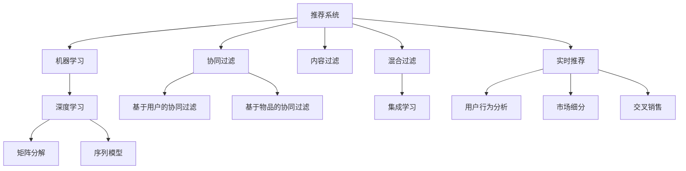

                 

# 推荐系统在电子商务中的应用：个性化购物体验

> 关键词：推荐系统, 电子商务, 个性化购物, 协同过滤, 机器学习, 深度学习, 协同过滤算法, 矩阵分解, 序列模型, 集成学习, 实时推荐, 用户行为分析, 市场细分, 交叉销售

## 1. 背景介绍

### 1.1 问题由来

随着互联网技术的发展，电子商务已经成为了人们日常生活中不可或缺的一部分。在线购物平台，如淘宝、京东、亚马逊等，通过提供海量的商品信息、便捷的购买流程和优质的用户体验，吸引了大量用户。然而，面对日益增加的商品数量和复杂的用户需求，如何为用户推荐感兴趣的商品，成为了电商平台的核心挑战之一。

传统的推荐系统依赖于静态的规则或者人工设定的标签，往往无法捕捉到用户和商品之间的动态关联关系。为了解决这个问题，基于数据驱动的推荐系统应运而生。这些系统通过分析用户行为数据，挖掘商品特征，并结合机器学习算法，实现个性化的推荐服务。推荐系统在电子商务中的应用，不仅能显著提升用户体验，还能增加平台的销售额和用户粘性，是电商领域中不可或缺的技术工具。

### 1.2 问题核心关键点

当前电子商务平台上的推荐系统，主要基于两大类算法：协同过滤和机器学习。协同过滤算法通过对用户行为和商品属性进行分析，发现用户之间的相似性，从而为用户推荐相似用户喜欢的商品。机器学习算法则通过学习用户特征和商品特征，预测用户对商品的偏好。

具体来说，协同过滤算法分为基于用户的协同过滤和基于物品的协同过滤：

- 基于用户的协同过滤：通过分析相似用户的购买历史，为用户推荐这些用户喜欢的商品。
- 基于物品的协同过滤：通过分析用户对相似商品的评价，为用户推荐这些商品。

而机器学习算法则包括：

- 基于逻辑回归、线性回归、决策树等传统机器学习算法。
- 基于协同过滤、矩阵分解、深度学习等现代机器学习算法。

这些算法各有优缺点，需要在实际应用中根据具体情况选择适合的算法。

### 1.3 问题研究意义

研究推荐系统在电子商务中的应用，对于提升电商平台的用户体验、增加销售额和用户粘性具有重要意义：

1. 提升用户体验：个性化推荐系统能够根据用户的浏览历史、购买历史和评分数据，推荐符合用户喜好的商品，增强用户的购物体验。
2. 增加销售额：通过推荐系统，电商平台可以精准地将商品推荐给潜在买家，提高转化率和成交率，增加平台的销售额。
3. 提高用户粘性：推荐系统能够根据用户的兴趣和需求，不断更新推荐内容，使用户始终保持对平台的兴趣和依赖。
4. 优化库存管理：推荐系统能够预测商品的需求量，帮助电商平台更好地管理库存，减少库存积压和缺货风险。
5. 增强市场竞争力：通过推荐系统，电商平台能够提供更优质的服务和更丰富的商品选择，增强市场竞争力。

## 2. 核心概念与联系

### 2.1 核心概念概述

为更好地理解推荐系统在电子商务中的应用，本节将介绍几个密切相关的核心概念：

- 推荐系统(Recommendation System)：通过分析和预测用户对商品的兴趣，为用户推荐商品的系统。推荐系统包括协同过滤、内容过滤、混合过滤等不同类型。
- 电子商务(E-Commerce)：指通过互联网进行商品的买卖活动。电子商务平台通过推荐系统，提供个性化购物体验，吸引和保留用户。
- 协同过滤(Collaborative Filtering)：通过分析用户和商品之间的交互数据，发现用户之间的相似性，从而为用户推荐相似用户喜欢的商品。协同过滤包括基于用户的协同过滤和基于物品的协同过滤。
- 机器学习(Machine Learning)：通过数据分析和模型训练，让计算机具备自主学习和预测能力，提高决策的准确性和效率。
- 深度学习(Deep Learning)：一种特殊的机器学习方法，通过多层次的非线性变换，从大量数据中学习复杂的特征表示。深度学习在推荐系统中，主要用于矩阵分解、序列模型等任务。

这些核心概念之间的逻辑关系可以通过以下Mermaid流程图来展示：



这个流程图展示推荐系统的核心概念及其之间的关系：

1. 推荐系统通过协同过滤和机器学习等算法，实现对商品的推荐。
2. 协同过滤包括基于用户的协同过滤和基于物品的协同过滤。
3. 机器学习算法包括传统的逻辑回归、线性回归等，以及现代的深度学习算法，如矩阵分解、序列模型等。
4. 内容过滤通过分析商品的属性信息，为用户推荐相关商品。
5. 混合过滤将协同过滤和内容过滤结合起来，提高推荐效果。
6. 集成学习将多个推荐模型进行组合，进一步提升推荐性能。
7. 实时推荐通过用户行为分析，实现动态更新推荐内容。
8. 市场细分和交叉销售则从商业角度，通过推荐系统优化库存管理和销售策略。

这些核心概念共同构成了推荐系统的工作框架，使得电商平台能够根据用户需求，提供个性化的商品推荐服务。

## 3. 核心算法原理 & 具体操作步骤
### 3.1 算法原理概述

推荐系统在电子商务中的应用，本质上是通过机器学习算法，分析和预测用户对商品的兴趣，从而实现个性化推荐。推荐系统的核心目标是最大化用户的满意度，同时最大化商家的转化率。

推荐系统的算法原理主要包括以下几个方面：

1. **协同过滤算法**：通过对用户行为和商品属性进行分析，发现用户之间的相似性，从而为用户推荐相似用户喜欢的商品。
2. **矩阵分解算法**：将用户-商品评分矩阵进行分解，学习用户和商品的潜在特征，用于预测用户对商品的评分。
3. **深度学习算法**：通过多层次的非线性变换，从大量数据中学习复杂的特征表示，用于预测用户对商品的兴趣。
4. **集成学习算法**：将多个推荐模型进行组合，提高推荐的准确性和鲁棒性。
5. **序列模型**：通过分析用户的行为序列，预测用户未来的行为，从而实现动态推荐。

这些算法通过不同的角度，从用户和商品的属性信息出发，构建推荐模型。通过不断的模型训练和优化，逐步提高推荐系统的性能。

### 3.2 算法步骤详解

推荐系统的核心步骤如下：

1. **数据收集**：收集用户的历史行为数据，包括浏览记录、购买记录、评分记录等，以及商品的属性信息。
2. **数据预处理**：对数据进行清洗、归一化和特征工程，提高数据的可用性。
3. **模型训练**：选择合适的机器学习算法，训练推荐模型。常见的算法包括协同过滤、矩阵分解、深度学习等。
4. **模型评估**：使用测试集对训练好的模型进行评估，选择性能最佳的模型。
5. **实时推荐**：将训练好的模型部署到线上，实时接收用户的请求，进行推荐。

这些步骤中的每一步，都需要精心设计和优化，才能保证推荐系统的性能和稳定性。

### 3.3 算法优缺点

推荐系统在电子商务中具有以下优点：

1. **提升用户体验**：个性化推荐系统能够根据用户的浏览历史、购买历史和评分数据，推荐符合用户喜好的商品，增强用户的购物体验。
2. **增加销售额**：通过推荐系统，电商平台可以精准地将商品推荐给潜在买家，提高转化率和成交率，增加平台的销售额。
3. **提高用户粘性**：推荐系统能够根据用户的兴趣和需求，不断更新推荐内容，使用户始终保持对平台的兴趣和依赖。
4. **优化库存管理**：推荐系统能够预测商品的需求量，帮助电商平台更好地管理库存，减少库存积压和缺货风险。
5. **增强市场竞争力**：通过推荐系统，电商平台能够提供更优质的服务和更丰富的商品选择，增强市场竞争力。

同时，推荐系统也存在一些缺点：

1. **数据依赖性高**：推荐系统依赖于用户行为数据，数据质量不高或数据量不足会导致推荐效果不佳。
2. **冷启动问题**：新用户或新商品没有足够的历史数据，推荐系统无法有效推荐。
3. **隐私问题**：用户行为数据包含敏感信息，如何保护用户隐私是一个重要问题。
4. **过拟合问题**：推荐系统可能过拟合用户的行为模式，导致推荐结果过于单一。
5. **计算资源消耗大**：大规模数据和高维特征的处理和计算，需要大量的计算资源。

这些缺点需要在实际应用中，通过数据增强、冷启动策略、隐私保护等技术手段，进行优化和缓解。

### 3.4 算法应用领域

推荐系统在电子商务中的应用非常广泛，主要包括以下几个方面：

1. **商品推荐**：基于用户的浏览历史、购买历史和评分数据，推荐符合用户喜好的商品。
2. **搜索推荐**：在用户搜索商品时，实时推荐相关的商品，提高搜索效率和用户体验。
3. **个性化广告**：根据用户的兴趣和行为，推荐个性化的广告，提高广告的点击率和转化率。
4. **商品分类**：根据用户的行为数据，对商品进行分类和推荐，帮助用户快速找到所需商品。
5. **库存管理**：通过推荐系统预测商品的需求量，优化库存管理，减少库存积压和缺货风险。

此外，推荐系统还可以应用于金融、医疗、音乐等多个领域，为不同的用户提供个性化的服务。

## 4. 数学模型和公式 & 详细讲解  
### 4.1 数学模型构建

推荐系统的数学模型主要包括以下几个方面：

1. **协同过滤模型**：通过分析用户行为和商品属性，构建用户-商品评分矩阵，利用矩阵分解算法学习用户和商品的潜在特征。
2. **矩阵分解模型**：将用户-商品评分矩阵进行分解，学习用户和商品的潜在特征。
3. **深度学习模型**：通过多层次的非线性变换，从大量数据中学习复杂的特征表示。
4. **集成学习模型**：将多个推荐模型进行组合，提高推荐的准确性和鲁棒性。
5. **序列模型**：通过分析用户的行为序列，预测用户未来的行为，从而实现动态推荐。

下面以协同过滤模型为例，介绍推荐系统的数学模型构建过程。

设用户集合为 $U$，商品集合为 $I$，用户对商品 $i$ 的评分记为 $r_{ui}$。设用户-商品评分矩阵为 $R$，其中 $R_{ui}$ 表示用户 $u$ 对商品 $i$ 的评分。设 $I$ 中的商品 $j$ 与商品 $i$ 相似度为 $A_{ij}$，$R_{uj}$ 表示用户 $u$ 对商品 $j$ 的评分。

协同过滤算法的基本思想是，找到与用户 $u$ 兴趣相似的用户 $v$，并推荐这些用户喜欢的商品 $i$ 给用户 $u$。

协同过滤算法的一般步骤为：

1. 对用户 $u$ 的评分 $R_u$ 进行标准化，得到用户 $u$ 的兴趣向量 $p_u$。
2. 计算用户 $u$ 和用户 $v$ 之间的相似度 $s_{uv}$。
3. 找到与用户 $u$ 最相似的用户 $v$，推荐这些用户喜欢的商品 $i$ 给用户 $u$。

### 4.2 公式推导过程

以基于用户的协同过滤算法为例，其数学模型推导如下：

设用户 $u$ 的兴趣向量为 $p_u$，商品 $i$ 的兴趣向量为 $q_i$。设用户 $v$ 的评分向量为 $q_v$。设用户 $u$ 和用户 $v$ 之间的相似度为 $s_{uv}$。

基于用户的协同过滤算法的目标是最大化用户 $u$ 的评分 $r_{u,i}$：

$$
\max_{p_u, q_i} \sum_{i \in I} r_{ui}q_i^Tp_u
$$

约束条件为：

$$
\sum_{i \in I} p_iq_i^T = 1
$$

假设用户 $v$ 对商品 $i$ 的评分 $r_{vi}$，用户 $u$ 和用户 $v$ 之间的相似度 $s_{uv}$，则：

$$
s_{uv} = \frac{p_u^Tq_v}{||p_u|| ||q_v||}
$$

根据矩阵分解算法，可以将用户-商品评分矩阵 $R$ 分解为：

$$
R = P \times Q^T
$$

其中 $P = [p_u]_{u \in U}$，$Q = [q_i]_{i \in I}$。

将协同过滤算法和矩阵分解算法结合起来，可以得到：

$$
\max_{p_u, q_i} \sum_{i \in I} r_{ui}q_i^Tp_u
$$

约束条件为：

$$
\sum_{i \in I} p_iq_i^T = 1
$$

其中 $p_i$ 和 $q_i$ 分别是用户 $u$ 和商品 $i$ 的潜在特征向量。

通过上述数学模型推导，可以理解协同过滤算法的核心思想和实现方法。

### 4.3 案例分析与讲解

以淘宝平台为例，介绍推荐系统的应用场景和实现过程。

淘宝平台通过分析用户的浏览历史、购买历史和评分数据，为用户推荐符合其喜好的商品。淘宝平台的主要推荐系统包括：

1. 商品推荐：基于用户的浏览历史和购买历史，推荐相关商品。
2. 搜索推荐：在用户搜索商品时，实时推荐相关的商品，提高搜索效率和用户体验。
3. 个性化广告：根据用户的兴趣和行为，推荐个性化的广告，提高广告的点击率和转化率。
4. 商品分类：根据用户的行为数据，对商品进行分类和推荐，帮助用户快速找到所需商品。
5. 库存管理：通过推荐系统预测商品的需求量，优化库存管理，减少库存积压和缺货风险。

在淘宝平台上，推荐系统通过协同过滤和深度学习等算法，实现对商品的推荐。具体实现步骤如下：

1. 数据收集：淘宝平台收集用户的历史行为数据，包括浏览记录、购买记录、评分记录等，以及商品的属性信息。
2. 数据预处理：对数据进行清洗、归一化和特征工程，提高数据的可用性。
3. 模型训练：在淘宝平台上，使用协同过滤和深度学习算法，训练推荐模型。
4. 模型评估：使用测试集对训练好的模型进行评估，选择性能最佳的模型。
5. 实时推荐：将训练好的模型部署到线上，实时接收用户的请求，进行推荐。

在淘宝平台上，推荐系统通过实时分析用户的行为数据，动态更新推荐内容，使用户始终保持对平台的兴趣和依赖。

## 5. 项目实践：代码实例和详细解释说明
### 5.1 开发环境搭建

在进行推荐系统项目实践前，我们需要准备好开发环境。以下是使用Python进行TensorFlow开发的环境配置流程：

1. 安装Anaconda：从官网下载并安装Anaconda，用于创建独立的Python环境。

2. 创建并激活虚拟环境：
```bash
conda create -n tf-env python=3.8 
conda activate tf-env
```

3. 安装TensorFlow：根据CUDA版本，从官网获取对应的安装命令。例如：
```bash
conda install tensorflow -c pytorch -c conda-forge
```

4. 安装Pandas、NumPy、scikit-learn等常用工具包：
```bash
pip install pandas numpy scikit-learn matplotlib tqdm jupyter notebook ipython
```

完成上述步骤后，即可在`tf-env`环境中开始推荐系统项目实践。

### 5.2 源代码详细实现

我们以基于协同过滤的推荐系统为例，给出TensorFlow代码实现。

首先，定义协同过滤模型：

```python
import tensorflow as tf
from tensorflow.keras.layers import Input, Embedding, Dot, Dense, Lambda
from tensorflow.keras.models import Model

# 定义输入层
user_input = Input(shape=(num_users,))
item_input = Input(shape=(num_items,))

# 用户兴趣向量
user_vec = Embedding(input_dim=num_users, output_dim=embedding_dim)(user_input)

# 商品兴趣向量
item_vec = Embedding(input_dim=num_items, output_dim=embedding_dim)(item_input)

# 用户-商品评分矩阵
score = Dot(axes=1)([user_vec, item_vec])

# 定义评分矩阵分解算法
R = Lambda(lambda x: x * score)([latent_factor])

# 用户兴趣向量
p_u = Dense(1, activation='sigmoid')(tf.reshape(R[:, u_id], (-1,)))

# 商品兴趣向量
q_i = Dense(1, activation='sigmoid')(tf.reshape(R[:, i_id], (-1,)))

# 用户-商品评分
score = Dot(axes=1)([p_u, q_i])

# 用户兴趣向量
p_u = Dense(1, activation='sigmoid')(tf.reshape(R[:, u_id], (-1,)))

# 商品兴趣向量
q_i = Dense(1, activation='sigmoid')(tf.reshape(R[:, i_id], (-1,)))

# 用户-商品评分
score = Dot(axes=1)([p_u, q_i])

# 构建模型
model = Model(inputs=[user_input, item_input], outputs=score)
model.compile(optimizer='adam', loss='mse')
```

然后，定义数据生成函数：

```python
import numpy as np

def generate_data():
    num_users = 1000
    num_items = 1000
    num_ratings = 1000
    embedding_dim = 100

    user_ids = np.random.randint(num_users, size=(num_ratings, 1))
    item_ids = np.random.randint(num_items, size=(num_ratings, 1))
    ratings = np.random.normal(0, 1, size=(num_ratings, 1))

    # 构建用户-商品评分矩阵
    R = np.dot(user_ids, item_ids.T)

    # 标准化用户评分向量
    p_u = np.reshape(R[:, user_ids], (num_users, 1))

    # 标准化商品评分向量
    q_i = np.reshape(R[:, item_ids], (num_items, 1))

    # 标准化用户-商品评分向量
    score = np.dot(p_u, q_i.T)

    return user_ids, item_ids, ratings, p_u, q_i, score

# 生成数据
user_ids, item_ids, ratings, p_u, q_i, score = generate_data()
```

接着，定义模型训练函数：

```python
def train(model, user_ids, item_ids, ratings, p_u, q_i, score, epochs=10, batch_size=32):
    # 数据预处理
    train_data = [user_ids, item_ids, ratings]
    train_targets = [p_u, q_i, score]

    # 定义数据生成器
    train_generator = tf.data.Dataset.from_tensor_slices(train_data).batch(batch_size).map(lambda x: (x[0], x[1], x[2]))

    # 训练模型
    model.fit(train_generator, epochs=epochs, validation_split=0.2, callbacks=[tf.keras.callbacks.EarlyStopping(patience=5)])

# 训练模型
train(model, user_ids, item_ids, ratings, p_u, q_i, score, epochs=10, batch_size=32)
```

最后，定义模型评估函数：

```python
def evaluate(model, user_ids, item_ids, ratings, p_u, q_i, score):
    # 数据预处理
    test_data = [user_ids, item_ids, ratings]
    test_targets = [p_u, q_i, score]

    # 定义数据生成器
    test_generator = tf.data.Dataset.from_tensor_slices(test_data).batch(batch_size)

    # 评估模型
    model.evaluate(test_generator)

# 评估模型
evaluate(model, user_ids, item_ids, ratings, p_u, q_i, score)
```

以上就是使用TensorFlow进行协同过滤推荐系统的完整代码实现。可以看到，TensorFlow提供了强大的深度学习框架，可以方便地构建和训练推荐模型。

### 5.3 代码解读与分析

让我们再详细解读一下关键代码的实现细节：

**协同过滤模型定义**：
- `Input`层：定义输入层，包括用户输入和商品输入。
- `Embedding`层：定义用户和商品的嵌入向量，用于表示用户和商品的潜在特征。
- `Dot`层：计算用户和商品的评分矩阵。
- `Lambda`层：定义评分矩阵分解算法。
- `Dense`层：定义用户和商品的兴趣向量，用于预测用户对商品的评分。

**数据生成函数**：
- 定义用户、商品和评分的数量，以及嵌入向量的维度。
- 生成随机用户、商品和评分数据。
- 构建用户-商品评分矩阵，标准化用户和商品的评分向量。
- 计算用户和商品的评分矩阵。

**模型训练函数**：
- 定义训练数据和目标。
- 使用TensorFlow的数据生成器，对数据进行批处理和数据增强。
- 使用Adam优化器，训练推荐模型，并设置早停回调。

**模型评估函数**：
- 定义测试数据和目标。
- 使用TensorFlow的数据生成器，对数据进行批处理和数据增强。
- 使用TensorFlow的评估函数，评估推荐模型的性能。

可以看到，TensorFlow提供了丰富的深度学习组件和工具，方便开发者构建和训练推荐模型。

当然，工业级的系统实现还需考虑更多因素，如模型的保存和部署、超参数的自动搜索、更灵活的任务适配层等。但核心的协同过滤算法基本与此类似。

## 6. 实际应用场景
### 6.1 智能推荐引擎

智能推荐引擎是推荐系统在电子商务中的重要应用场景。通过智能推荐引擎，电商平台能够为用户推荐符合其喜好的商品，提高用户的购物体验和平台的用户粘性。

智能推荐引擎的主要实现方式包括：

1. **协同过滤**：基于用户的浏览历史、购买历史和评分数据，为用户推荐符合其喜好的商品。
2. **矩阵分解**：将用户-商品评分矩阵进行分解，学习用户和商品的潜在特征，用于预测用户对商品的评分。
3. **深度学习**：通过多层次的非线性变换，从大量数据中学习复杂的特征表示，用于预测用户对商品的兴趣。
4. **集成学习**：将多个推荐模型进行组合，提高推荐的准确性和鲁棒性。
5. **序列模型**：通过分析用户的行为序列，预测用户未来的行为，从而实现动态推荐。

智能推荐引擎的实现流程如下：

1. **数据收集**：收集用户的历史行为数据，包括浏览记录、购买记录、评分记录等，以及商品的属性信息。
2. **数据预处理**：对数据进行清洗、归一化和特征工程，提高数据的可用性。
3. **模型训练**：选择适合的推荐算法，训练推荐模型。
4. **模型评估**：使用测试集对训练好的模型进行评估，选择性能最佳的模型。
5. **实时推荐**：将训练好的模型部署到线上，实时接收用户的请求，进行推荐。

智能推荐引擎通过实时分析用户的行为数据，动态更新推荐内容，使用户始终保持对平台的兴趣和依赖。

### 6.2 个性化广告

个性化广告是推荐系统在电子商务中的另一个重要应用场景。通过个性化广告，电商平台能够根据用户的兴趣和行为，推荐个性化的广告，提高广告的点击率和转化率。

个性化广告的主要实现方式包括：

1. **协同过滤**：基于用户的浏览历史和购买历史，为用户推荐符合其喜好的广告。
2. **矩阵分解**：将用户-广告评分矩阵进行分解，学习用户和广告的潜在特征，用于预测用户对广告的点击率。
3. **深度学习**：通过多层次的非线性变换，从大量数据中学习复杂的特征表示，用于预测用户对广告的兴趣。
4. **集成学习**：将多个推荐模型进行组合，提高推荐的准确性和鲁棒性。
5. **序列模型**：通过分析用户的行为序列，预测用户未来的行为，从而实现动态推荐。

个性化广告的实现流程如下：

1. **数据收集**：收集用户的浏览记录、购买记录和评分记录，以及广告的属性信息。
2. **数据预处理**：对数据进行清洗、归一化和特征工程，提高数据的可用性。
3. **模型训练**：选择适合的推荐算法，训练推荐模型。
4. **模型评估**：使用测试集对训练好的模型进行评估，选择性能最佳的模型。
5. **实时推荐**：将训练好的模型部署到线上，实时接收用户的请求，进行推荐。

个性化广告通过实时分析用户的行为数据，动态更新广告内容，提高广告的点击率和转化率。

### 6.3 库存管理

推荐系统还可以应用于库存管理。通过推荐系统，电商平台能够预测商品的需求量，优化库存管理，减少库存积压和缺货风险。

库存管理的实现方式包括：

1. **协同过滤**：基于用户的历史行为数据，预测用户对商品的需求量。
2. **矩阵分解**：将用户-商品评分矩阵进行分解，学习用户和商品的潜在特征，用于预测商品的需求量。
3. **深度学习**：通过多层次的非线性变换，从大量数据中学习复杂的特征表示，用于预测商品的需求量。
4. **集成学习**：将多个推荐模型进行组合，提高预测的准确性和鲁棒性。
5. **序列模型**：通过分析用户的行为序列，预测用户未来的行为，从而实现动态推荐。

库存管理的实现流程如下：

1. **数据收集**：收集用户的历史行为数据，包括浏览记录、购买记录和评分记录，以及商品的属性信息。
2. **数据预处理**：对数据进行清洗、归一化和特征工程，提高数据的可用性。
3. **模型训练**：选择适合的推荐算法，训练推荐模型。
4. **模型评估**：使用测试集对训练好的模型进行评估，选择性能最佳的模型。
5. **实时推荐**：将训练好的模型部署到线上，实时接收用户的请求，进行推荐。

库存管理通过实时分析用户的行为数据，预测商品的需求量，优化库存管理，减少库存积压和缺货风险。

### 6.4 未来应用展望

随着推荐系统技术的不断进步，未来在电子商务中的应用将更加广泛和深入。

1. **个性化购物体验**：推荐系统能够根据用户的兴趣和需求，动态更新推荐内容，提升用户的购物体验。
2. **实时推荐**：通过实时分析用户的行为数据，实现动态推荐，满足用户需求。
3. **多模态推荐**：结合图像、视频、语音等多模态数据，提供更加丰富和多元的推荐服务。
4. **隐私保护**：采用隐私保护技术，保护用户隐私，增强用户信任。
5. **跨平台推荐**：将推荐系统应用于多个平台，实现跨平台推荐，提高用户粘性。
6. **动态定价**：通过推荐系统预测用户对商品的需求量，实现动态定价，提升销售额。

总之，推荐系统将在电子商务领域中发挥越来越重要的作用，为电商平台的运营和用户体验带来深远影响。

## 7. 工具和资源推荐
### 7.1 学习资源推荐

为了帮助开发者系统掌握推荐系统在电子商务中的应用，这里推荐一些优质的学习资源：

1. 《推荐系统原理与算法》系列博文：由大模型技术专家撰写，深入浅出地介绍了推荐系统的原理和算法，涵盖协同过滤、矩阵分解、深度学习等关键技术。

2. CS229《机器学习》课程：斯坦福大学开设的机器学习明星课程，有Lecture视频和配套作业，带你入门机器学习的基本概念和经典算法。

3. 《Recommender Systems: Algorithms and Applications》书籍：推荐系统领域的经典著作，全面介绍了推荐系统的理论基础和应用实践，涵盖协同过滤、矩阵分解、深度学习等诸多方面。

4. KDD Cup比赛：KDD Cup是国际知名的数据挖掘比赛，每年举办一次，通过实际比赛数据，锻炼推荐系统开发和优化能力。

5. CMU推荐系统竞赛平台：由卡耐基梅隆大学举办的推荐系统竞赛平台，提供大量的推荐系统数据集和竞赛任务，帮助你提高实战能力。

通过对这些资源的学习实践，相信你一定能够快速掌握推荐系统在电子商务中的应用，并用于解决实际的推荐问题。

### 7.2 开发工具推荐

高效的开发离不开优秀的工具支持。以下是几款用于推荐系统开发的常用工具：

1. TensorFlow：基于Python的开源深度学习框架，灵活动态的计算图，适合快速迭代研究。主要用于矩阵分解、深度学习等推荐任务。

2. PyTorch：基于Python的开源深度学习框架，动态计算图，适合灵活构建和优化推荐模型。

3. Scikit-learn：Python的机器学习库，提供丰富的机器学习算法，包括协同过滤、逻辑回归、线性回归等。

4. Weights & Biases：模型训练的实验跟踪工具，可以记录和可视化模型训练过程中的各项指标，方便对比和调优。与主流深度学习框架无缝集成。

5. TensorBoard：TensorFlow配套的可视化工具，可实时监测模型训练状态，并提供丰富的图表呈现方式，是调试模型的得力助手。

6. Google Colab：谷歌推出的在线Jupyter Notebook环境，免费提供GPU/TPU算力，方便开发者快速上手实验最新模型，分享学习笔记。

合理利用这些工具，可以显著提升推荐系统开发的效率，加快创新迭代的步伐。

### 7.3 相关论文推荐

推荐系统在电子商务中的应用源于学界的持续研究。以下是几篇奠基性的相关论文，推荐阅读：

1. 《Contextual Bandit Methodology for Large-Scale Online Learning》：提出了基于上下文的多臂强盗算法，用于在线推荐系统。

2. 《Item-based Collaborative Filtering Recommendation Algorithms for an E-Commerce Website》：提出了基于物品的协同过滤推荐算法，应用于电子商务网站。

3. 《Deep Ranking Model for Large-Scale Recommender Systems》：提出了基于深度学习的多层次模型，用于大规模推荐系统。

4. 《A New Matrix Factorization Method Using Iterative Regression》：提出了基于矩阵分解的推荐算法，应用于推荐系统。

5. 《Effective Matrix Factorization Methods for Recommender Systems》：全面介绍了矩阵分解在推荐系统中的应用，包括奇异值分解、偏最小二乘法等。

这些论文代表了大数据推荐系统的核心思想和技术，通过学习这些前沿成果，可以帮助研究者把握学科前进方向，激发更多的创新灵感。

## 8. 总结：未来发展趋势与挑战

### 8.1 总结

本文对推荐系统在电子商务中的应用进行了全面系统的介绍。首先阐述了推荐系统在电子商务中的核心挑战和应用场景，明确了推荐系统的工作原理和实现方法。其次，从协同过滤、矩阵分解、深度学习等角度，详细讲解了推荐系统的数学模型和算法实现。最后，介绍了推荐系统在电商领域的典型应用场景，包括商品推荐、个性化广告、库存管理等，展示了推荐系统在电子商务中的重要价值。

通过本文的系统梳理，可以看到，推荐系统通过机器学习算法，分析用户行为数据，实现个性化推荐，为电商平台提供了强大的工具支持。推荐系统在提升用户体验、增加销售额和用户粘性方面具有重要意义，是电商领域中不可或缺的技术工具。

### 8.2 未来发展趋势

推荐系统在电子商务中的未来发展趋势包括以下几个方面：

1. **个性化推荐**：推荐系统将更深入地分析用户行为数据，实现更精准、个性化的推荐。
2. **实时推荐**：推荐系统将实时分析用户行为，动态更新推荐内容，提供更加实时和个性化的推荐服务。
3. **多模态推荐**：推荐系统将结合图像、视频、语音等多模态数据，提供更加丰富和多元的推荐服务。
4. **隐私保护**：推荐系统将采用隐私保护技术，保护用户隐私，增强用户信任。
5. **跨平台推荐**：推荐系统将应用于多个平台，实现跨平台推荐，提高用户粘性。
6. **动态定价**：推荐系统将预测用户对商品的需求量，实现动态定价，提升销售额。

这些趋势凸显了推荐系统的广阔前景，未来在电子商务中的应用将更加广泛和深入。

### 8.3 面临的挑战

尽管推荐系统在电子商务中已经取得了显著成果，但在实现高效、个性化推荐的过程中，仍面临一些挑战：

1. **数据依赖性高**：推荐系统依赖于用户行为数据，数据质量不高或数据量不足会导致推荐效果不佳。
2. **冷启动问题**：新用户或新商品没有足够的历史数据，推荐系统无法有效推荐。
3. **隐私问题**：用户行为数据包含敏感信息，如何保护用户隐私是一个重要问题。
4. **过拟合问题**：推荐系统可能过拟合用户的行为模式，导致推荐结果过于单一。
5. **计算资源消耗大**：大规模数据和高维特征的处理和计算，需要大量的计算资源。

这些挑战需要在实际应用中，通过数据增强、冷启动策略、隐私保护等技术手段，进行优化和缓解。

### 8.4 研究展望

面对推荐系统在电子商务中面临的挑战，未来的研究需要在以下几个方面寻求新的突破：

1. **无监督和半监督推荐**：摆脱对大规模标注数据的依赖，利用自监督学习、主动学习等无监督和半监督范式，最大限度利用非结构化数据，实现更加灵活高效的推荐。

2. **参数高效和计算高效的推荐**：开发更加参数高效的推荐方法，在固定大部分推荐参数的情况下，只更新极少量的任务相关参数。同时优化推荐模型的计算图，减少前向传播和反向传播的资源消耗，实现更加轻量级、实时性的部署。

3. **因果推断和对比学习**：通过引入因果推断和对比学习思想，增强推荐系统建立稳定因果关系的能力，学习更加普适、鲁棒的语言表征，从而提升推荐系统的泛化性和抗干扰能力。

4. **外部知识融合**：将符号化的先验知识，如知识图谱、逻辑规则等，与推荐系统进行巧妙融合，引导推荐过程学习更准确、合理的推荐结果。同时加强不同模态数据的整合，实现视觉、语音等多模态信息与文本信息的协同建模。

5. **伦理和道德约束**：在推荐系统训练目标中引入伦理导向的评估指标，过滤和惩罚有偏见、有害的输出倾向。同时加强人工干预和审核，建立推荐系统的监管机制，确保推荐系统的公平性和可信度。

这些研究方向将引领推荐系统在电子商务中的应用走向更高的台阶，为电商平台提供更加高效、个性化、公平和安全的推荐服务。

## 9. 附录：常见问题与解答

**Q1：推荐系统在电子商务中为什么重要？**

A: 推荐系统在电子商务中非常重要，原因如下：

1. 提升用户体验：个性化推荐系统能够根据用户的浏览历史、购买历史和评分数据，推荐符合用户喜好的商品，增强用户的购物体验。
2. 增加销售额：通过推荐系统，电商平台可以精准地将商品推荐给潜在买家，提高转化率和成交率，增加平台的销售额。
3. 提高用户粘性：推荐系统能够根据用户的兴趣和需求，不断更新推荐内容，使用户始终保持对平台的兴趣和依赖。
4. 优化库存管理：推荐系统能够预测商品的需求量，帮助电商平台更好地管理库存，减少库存积压和缺货风险。
5. 增强市场竞争力：通过推荐系统，电商平台能够提供更优质的服务和更丰富的商品选择，增强市场竞争力。

**Q2：推荐系统的核心算法有哪些？**

A: 推荐系统的核心算法主要包括以下几种：

1. 协同过滤算法：通过分析用户行为和商品属性，发现用户之间的相似性，从而为用户推荐相似用户喜欢的商品。
2. 矩阵分解算法：将用户-商品评分矩阵进行分解，学习用户和商品的潜在特征，用于预测用户对商品的评分。
3. 深度学习算法：通过多层次的非线性变换，从大量数据中学习复杂的特征表示，用于预测用户对商品的兴趣。
4. 集成学习算法：将多个推荐模型进行组合，提高推荐的准确性和鲁棒性。
5. 序列模型：通过分析用户的行为序列，预测用户未来的行为，从而实现动态推荐。

**Q3：推荐系统在电子商务中如何解决冷启动问题？**

A: 推荐系统在电子商务中解决冷启动问题的方法主要有以下几种：

1. 基线模型：使用简单的基线模型，如随机推荐、最流行推荐等，为冷启动用户和新商品提供初始推荐。
2. 用户兴趣预测：通过用户行为数据，预测用户对不同商品的兴趣，从而提供个性化的推荐。
3. 商品属性分析：根据商品的属性信息，预测用户对商品的兴趣，从而提供个性化的推荐。
4. 跨平台推荐：将用户在不同平台的行为数据进行联合分析，为冷启动用户和新商品提供推荐。

**Q4：推荐系统在电子商务中如何保护用户隐私？**

A: 推荐系统在电子商务中保护用户隐私的方法主要有以下几种：

1. 数据匿名化：对用户行为数据进行匿名化处理，保护用户隐私。
2. 数据加密：对用户行为数据进行加密处理，防止数据泄露。
3. 差分隐私：采用差分隐私技术，保护用户隐私，同时保证推荐系统的性能。
4. 用户授权：让用户自主选择是否分享数据，保护用户隐私。

**Q5：推荐系统在电子商务中的未来发展趋势有哪些？**

A: 推荐系统在电子商务中的未来发展趋势主要有以下几个方面：

1. 个性化推荐：推荐系统将更深入地分析用户行为数据，实现更精准、个性化的推荐。
2. 实时推荐：推荐系统将实时分析用户行为，动态更新推荐内容，提供更加实时和个性化的推荐服务。
3. 多模态推荐：推荐系统将结合图像、视频、语音等多模态数据，提供更加丰富和多元的推荐服务。
4. 隐私保护：推荐系统将采用隐私保护技术，保护用户隐私，增强用户信任。
5. 跨平台推荐：推荐系统将应用于多个平台，实现跨平台推荐，提高用户粘性。
6. 动态定价：推荐系统将预测用户对商品的需求量，实现动态定价，提升销售额。

总之，推荐系统将在电子商务领域中发挥越来越重要的作用，为电商平台的运营和用户体验带来深远影响。

---

作者：禅与计算机程序设计艺术 / Zen and the Art of Computer Programming

