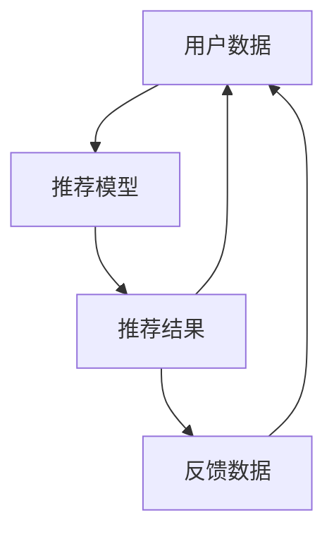

                 

# 推荐系统的公平性与多样性：AI大模型的伦理约束与优化

## 1. 背景介绍

在过去十年中，人工智能技术已经广泛应用于推荐系统，为人们提供了个性化的服务。然而，尽管推荐系统极大地提高了用户满意度，但其背后的伦理问题也逐渐成为公众关注的焦点。

推荐系统在实际应用中面临着许多挑战，如公平性、多样性、透明性、隐私保护等。这些伦理问题不仅会影响用户的使用体验，还可能引发一系列社会问题，如信息泡沫、算法歧视等。

## 2. 核心概念与联系

### 2.1 核心概念概述

推荐系统（Recommendation Systems）是一种基于用户历史行为、兴趣偏好、社会关系等信息的智能系统，通过机器学习算法为用户推荐感兴趣的产品或服务。

公平性（Fairness）是指推荐系统在处理数据、算法设计、模型训练等环节中，不偏向某一特定群体，确保不同背景的用户都能获得公正的待遇。

多样性（Diversity）是指推荐系统能够为用户推荐多样化的内容，避免过度集中于某一特定领域，使用户能够接触到更广泛的知识和观点。

AI大模型（AI Large Models）指基于深度学习原理构建的大规模神经网络模型，具有强大的表示学习能力，能够处理复杂的输入数据和任务。

### 2.2 核心概念原理和架构的 Mermaid 流程图



此流程图展示了推荐系统的基本工作流程，用户数据输入到推荐模型中，经过处理后得到推荐结果，用户根据反馈调整输入数据，形成迭代循环。

## 3. 核心算法原理 & 具体操作步骤

### 3.1 算法原理概述

基于深度学习的推荐系统主要分为两大类：协同过滤（Collaborative Filtering）和基于内容的推荐（Content-based Recommendation）。

协同过滤通过分析用户历史行为和相似用户的行为，预测用户可能感兴趣的商品。基于内容的推荐则根据商品的属性和用户的历史偏好，推荐与用户过去喜欢的商品相似的商品。

AI大模型在推荐系统中主要起到特征提取和表示学习的作用，通过大规模预训练学习到丰富的语义表示，能够更好地理解用户需求和商品属性。

### 3.2 算法步骤详解

以下是基于深度学习的推荐系统在AI大模型上的具体操作步骤：

1. **数据预处理**：收集用户历史行为数据和商品属性数据，并进行清洗和标准化处理。
2. **特征工程**：设计特征提取器，将用户行为和商品属性映射为模型可处理的特征向量。
3. **模型训练**：使用AI大模型进行特征表示学习，训练推荐模型。
4. **模型评估**：在验证集上评估推荐模型的性能，调整超参数。
5. **部署上线**：将训练好的模型部署到生产环境，为实际用户提供推荐服务。

### 3.3 算法优缺点

#### 优点：

- **准确性高**：AI大模型能够学习到复杂的语义表示，在推荐任务上表现优异。
- **可扩展性强**：模型可以灵活地嵌入到不同的推荐系统中，适用于多种场景。
- **通用性强**：AI大模型适用于多种类型的推荐任务，如商品推荐、新闻推荐、广告推荐等。

#### 缺点：

- **资源需求大**：大规模模型的训练和推理需要大量的计算资源。
- **可解释性差**：模型的复杂性导致其决策过程难以解释。
- **公平性问题**：大规模模型可能会继承训练数据的偏见，导致算法歧视。

### 3.4 算法应用领域

AI大模型在推荐系统中的应用领域包括但不限于：

- **商品推荐**：电商、娱乐、旅游等行业。
- **新闻推荐**：新闻、社交媒体平台。
- **广告推荐**：在线广告、视频网站。
- **智能客服**：客户服务平台。

## 4. 数学模型和公式 & 详细讲解 & 举例说明

### 4.1 数学模型构建

推荐系统通常采用以下两种数学模型进行建模：

1. 矩阵分解模型（Matrix Factorization）：将用户和商品表示为低维向量，通过矩阵分解求解用户对商品的评分。
2. 神经网络模型（Neural Networks）：使用多层神经网络对用户行为和商品属性进行建模，预测用户可能感兴趣的商品。

以神经网络模型为例，假设用户 $u$ 对商品 $i$ 的评分可以用向量 $u$ 和 $i$ 的线性组合表示：

$$
r_{ui} = w_u^T \cdot h(i) + b_u
$$

其中 $w_u$ 为用户 $u$ 的向量表示，$h(i)$ 为商品 $i$ 的表示，$b_u$ 为偏置项。

### 4.2 公式推导过程

对于神经网络模型，通过反向传播算法求取损失函数对模型参数的梯度，并使用优化算法更新模型参数。常见的优化算法包括随机梯度下降（SGD）、Adam等。

以SGD算法为例，其更新公式为：

$$
w_u \leftarrow w_u - \alpha \nabla_{w_u} \ell(r_{ui}, y_{ui})
$$

其中 $\alpha$ 为学习率，$\ell$ 为损失函数，$y_{ui}$ 为真实评分，$\nabla_{w_u}$ 为梯度。

### 4.3 案例分析与讲解

假设有一个电商平台的商品推荐系统，使用基于内容的推荐方式。平台收集了用户 $u$ 对商品 $i$ 的评分 $y_{ui}$，以及商品的属性 $a_i$。

1. **数据预处理**：将用户行为数据和商品属性数据进行标准化处理。
2. **特征工程**：设计商品属性特征提取器，将属性映射为模型可处理的特征向量。
3. **模型训练**：使用基于内容的推荐模型，对用户行为和商品属性进行建模，预测用户可能感兴趣的商品。
4. **模型评估**：在验证集上评估模型性能，调整超参数。
5. **部署上线**：将训练好的模型部署到生产环境，为实际用户提供推荐服务。

## 5. 项目实践：代码实例和详细解释说明

### 5.1 开发环境搭建

在进行推荐系统开发前，需要准备以下开发环境：

1. **安装Python**：在服务器或本地电脑上安装Python。
2. **安装依赖库**：使用pip安装推荐系统相关的依赖库，如TensorFlow、Keras等。
3. **配置数据集**：收集和处理用户行为数据和商品属性数据，准备好数据集。

### 5.2 源代码详细实现

以下是基于内容的推荐系统在TensorFlow上的代码实现：

```python
import tensorflow as tf
from tensorflow.keras.layers import Input, Embedding, Dot, Dense

# 定义用户和商品的输入层
user_input = Input(shape=(1,), name='user_input')
item_input = Input(shape=(1,), name='item_input')

# 定义用户和商品的嵌入层
user_embedding = Embedding(input_dim=num_users, output_dim=embedding_dim)(user_input)
item_embedding = Embedding(input_dim=num_items, output_dim=embedding_dim)(item_input)

# 定义点积层
dot_product = Dot(axes=1)([user_embedding, item_embedding])

# 定义输出层
output = Dense(1, activation='sigmoid')(dot_product)

# 定义模型
model = tf.keras.Model(inputs=[user_input, item_input], outputs=output)

# 编译模型
model.compile(optimizer='adam', loss='binary_crossentropy', metrics=['accuracy'])

# 训练模型
model.fit([user_data, item_data], ratings, epochs=num_epochs, batch_size=batch_size, validation_split=0.2)
```

### 5.3 代码解读与分析

- **用户和商品的输入层**：使用`Input`层定义用户和商品的输入，其中`num_users`和`num_items`为用户和商品的总数。
- **嵌入层**：使用`Embedding`层将用户和商品映射为低维向量。
- **点积层**：使用`Dot`层计算用户和商品的向量点积，得到用户对商品的评分预测。
- **输出层**：使用`Dense`层将预测评分转换为二分类概率。
- **模型编译**：使用`compile`方法编译模型，指定优化器、损失函数和评价指标。
- **模型训练**：使用`fit`方法训练模型，指定训练数据、训练轮数和批次大小。

### 5.4 运行结果展示

```python
# 训练后的模型保存为'helloworld.h5'文件
model.save('helloworld.h5')

# 加载保存的模型
loaded_model = tf.keras.models.load_model('helloworld.h5')

# 使用加载的模型进行预测
predictions = loaded_model.predict([user_data, item_data])
```

## 6. 实际应用场景

### 6.1 推荐系统的公平性与多样性问题

推荐系统的公平性问题主要体现在以下两个方面：

1. **数据偏见**：推荐系统可能会继承训练数据中的偏见，导致某些用户群体被忽视。例如，对某些商品的使用率低，导致其在推荐中出现的频率低。
2. **算法歧视**：推荐系统可能会基于用户的属性（如性别、年龄、地区等）进行歧视性推荐。

多样性问题主要体现在以下两个方面：

1. **信息泡沫**：用户只接触到自己感兴趣的推荐内容，导致视野狭窄，缺乏多样化的信息。
2. **同质化推荐**：推荐系统往往倾向于推荐用户过去喜欢的内容，导致推荐内容同质化。

### 6.2 未来应用展望

未来，推荐系统的公平性和多样性问题将得到更多的关注。以下是一些可能的解决方案：

1. **公平性优化**：通过引入公平性约束和优化算法，如公平性约简（Fairness Preserving）算法，减少推荐系统中的偏见。
2. **多样性提升**：设计多样性增强算法，如多臂赌博机（Multi-Armed Bandit）算法，提升推荐内容的多样性。
3. **透明性提升**：提供推荐系统的透明度，让用户了解推荐算法的依据和决策过程。
4. **隐私保护**：采用差分隐私（Differential Privacy）等技术，保护用户隐私。

## 7. 工具和资源推荐

### 7.1 学习资源推荐

1. **《推荐系统理论与实践》**：该书介绍了推荐系统的发展历史、基本原理、算法实现等，适合初学者和高级开发者阅读。
2. **《Deep Learning for Recommendation Systems》**：由DeepLearning.ai提供，介绍了深度学习在推荐系统中的应用。
3. **Coursera推荐系统课程**：Coursera平台提供的推荐系统课程，包含推荐系统的前沿技术和应用案例。

### 7.2 开发工具推荐

1. **TensorFlow**：Google开源的深度学习框架，适合进行大规模推荐系统的开发。
2. **PyTorch**：Facebook开源的深度学习框架，适合进行灵活的神经网络模型构建。
3. **Keras**：高层次的神经网络API，适合快速原型设计和实验。

### 7.3 相关论文推荐

1. **Fairness in Recommendation Systems: A Survey**：该论文综述了推荐系统中的公平性问题，提供了一些常见的公平性优化算法。
2. **Diversity and Novelty in Recommender Systems**：该论文探讨了推荐系统中的多样性问题，提出了一些多样性增强算法。

## 8. 总结：未来发展趋势与挑战

### 8.1 研究成果总结

本文介绍了基于深度学习的推荐系统的公平性和多样性问题，并探讨了AI大模型在推荐系统中的应用。通过深入分析推荐系统中的伦理问题，提出了一些可能的解决方案。

### 8.2 未来发展趋势

未来的推荐系统将更加关注公平性和多样性问题，设计更多的优化算法和评价指标。同时，AI大模型在推荐系统中的应用也将更加广泛，提升推荐系统的性能和效率。

### 8.3 面临的挑战

尽管推荐系统已经取得了一定的进展，但仍面临以下挑战：

1. **计算资源需求大**：大规模模型需要大量的计算资源，限制了其在实际应用中的部署。
2. **模型复杂度高**：深度学习模型的复杂性导致其难以解释，难以理解推荐系统的决策过程。
3. **数据偏见问题**：训练数据中的偏见可能导致推荐系统中的歧视性问题。
4. **隐私保护问题**：推荐系统需要收集大量的用户数据，存在隐私泄露的风险。

### 8.4 研究展望

未来的推荐系统研究将更加注重公平性和多样性问题，结合伦理约束和优化算法，提升推荐系统的性能和可信度。同时，结合AI大模型和新兴技术，如因果推理、多模态融合等，进一步推动推荐系统的应用发展。

## 9. 附录：常见问题与解答

**Q1：推荐系统中的公平性问题如何解决？**

A: 推荐系统中的公平性问题可以通过以下方法解决：

1. **数据清洗**：对训练数据进行清洗，去除偏见数据。
2. **算法优化**：引入公平性约束和优化算法，如公平性约简算法。
3. **用户反馈**：收集用户反馈，及时调整推荐策略。

**Q2：推荐系统中的多样性问题如何解决？**

A: 推荐系统中的多样性问题可以通过以下方法解决：

1. **多样性增强**：设计多样性增强算法，如多臂赌博机算法。
2. **多任务学习**：结合多个推荐任务，提升推荐内容的多样性。
3. **用户反馈**：收集用户反馈，调整推荐策略。

**Q3：AI大模型在推荐系统中的应用需要注意哪些问题？**

A: AI大模型在推荐系统中的应用需要注意以下问题：

1. **计算资源需求**：大规模模型的训练和推理需要大量的计算资源。
2. **模型复杂度**：深度学习模型的复杂性导致其难以解释，难以理解推荐系统的决策过程。
3. **数据偏见**：训练数据中的偏见可能导致推荐系统中的歧视性问题。
4. **隐私保护**：推荐系统需要收集大量的用户数据，存在隐私泄露的风险。

---

作者：禅与计算机程序设计艺术 / Zen and the Art of Computer Programming

