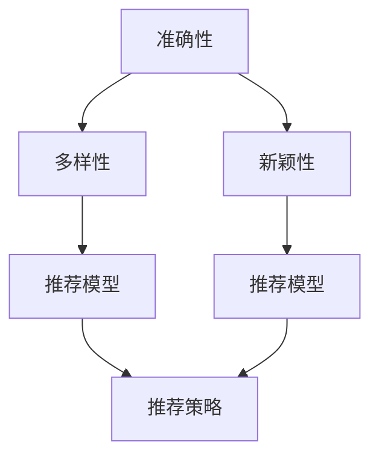

                 

# 推荐系统的多样性与新颖性：AI大模型的平衡策略

## 1. 背景介绍

推荐系统在互联网、电商、媒体等领域发挥着举足轻重的作用，通过学习用户的浏览和购买行为，为用户推荐个性化的商品、内容或服务。然而，推荐系统不仅要追求准确性，还必须兼顾多样性和新颖性，才能满足用户不断变化的个性化需求，避免陷入信息茧房。

随着人工智能和大模型技术的迅速发展，推荐系统逐渐从传统的协同过滤和矩阵分解，转向利用深度学习模型进行端到端的预测和排序。其中，基于自编码器和自回归模型的深度推荐模型成为最新的热点。

本博客旨在探讨如何在大模型基础上，通过优化推荐系统的多样性和新颖性，平衡预测准确性和个性化推荐效果，以推动推荐技术的进一步突破。

## 2. 核心概念与联系

### 2.1 核心概念概述

在推荐系统的多样性与新颖性优化中，涉及多个关键概念：

- 多样性(Diversity)：推荐结果的多样性指推荐结果包含广泛的用户兴趣，减少重复推荐。
- 新颖性(新鲜感)：推荐结果的新颖性指推荐结果中包含新的、用户之前未曾接触过的商品、内容等，增加用户的探索欲。
- 准确性(Accuracy)：推荐结果的准确性指推荐的商品、内容或服务与用户的实际需求相匹配，提高用户满意度。
- 深度学习模型(Deep Learning Model)：利用深度神经网络结构，从大量数据中自动学习特征表示和决策规则，实现高性能推荐。

这些概念之间的逻辑关系可以通过以下Mermaid流程图来展示：



这个流程图展示了大模型在推荐系统中的作用，以及各个概念之间的相互关联：

1. 准确性是大模型的基础，通过深度学习模型，能够从数据中自动学习并生成高质量的推荐结果。
2. 多样性是指大模型生成的推荐结果中，应包含广泛的用户兴趣，避免重复推荐。
3. 新颖性是大模型推荐的补充，应包含用户未曾见过的新商品、新内容，激发用户的探索欲。
4. 推荐模型和推荐策略共同作用于推荐结果，同时兼顾多样性和新颖性。

## 3. 核心算法原理 & 具体操作步骤

### 3.1 算法原理概述

基于深度学习的推荐系统，本质上是一个从用户行为数据中学习并生成推荐结果的过程。其核心思想是：通过深度学习模型，从用户的历史行为数据中学习用户兴趣，并利用这些兴趣生成个性化的推荐结果。

形式化地，假设用户的历史行为数据为 $\mathbf{X}$，用户兴趣的表示为 $\mathbf{H}$，推荐结果的表示为 $\mathbf{Y}$。推荐系统优化的目标是通过大模型 $f$ 使得 $\mathbf{Y}$ 最大化地逼近 $\mathbf{X}$ 和 $\mathbf{H}$。即：

$$
\min_{f} \mathbb{E}[(\mathbf{Y} - f(\mathbf{X}, \mathbf{H}))^2]
$$

在大模型中，我们通常使用自编码器(如Siamese Network)或自回归模型(如Transformer)作为推荐模型，利用深度神经网络结构进行端到端的预测和排序。

### 3.2 算法步骤详解

基于深度学习的推荐系统，推荐过程大致可以分为以下几个关键步骤：

**Step 1: 数据准备与预处理**
- 收集用户的历史行为数据，包括浏览记录、点击记录、购买记录等。
- 对数据进行清洗、归一化等预处理，去除异常值、噪声等干扰因素。

**Step 2: 特征提取与表示学习**
- 利用深度学习模型对用户行为数据进行特征提取，学习用户兴趣表示 $\mathbf{H}$。
- 对推荐结果数据进行特征提取，学习商品、内容等表示 $\mathbf{Y}$。

**Step 3: 模型训练与优化**
- 构建推荐模型 $f$，如Siamese Network或Transformer。
- 使用优化算法，如SGD、Adam等，在标注数据上训练推荐模型，最小化预测误差。
- 在训练过程中，应用正则化技术，防止过拟合。

**Step 4: 推荐结果生成**
- 在测试数据上，利用训练好的推荐模型生成推荐结果。
- 对生成的推荐结果进行排序，如基于评分预测或点击率预测。
- 对推荐结果进行去重、过滤等处理，保证推荐结果的独特性和相关性。

**Step 5: 多样性与新颖性优化**
- 在推荐结果中引入多样性约束，如Top-k diversity，保证推荐结果包含多样性。
- 在推荐结果中引入新颖性约束，如随机采样或最新的推荐结果，保证推荐结果的新颖性。
- 结合多样性和新颖性约束，优化推荐结果。

### 3.3 算法优缺点

基于深度学习的推荐系统具有以下优点：
1. 自适应能力强：利用深度学习模型，能够自动学习并适应数据分布的变化。
2. 精度高：深度神经网络结构具有强大的特征表示和决策能力，推荐结果准确性高。
3. 可解释性好：深度学习模型通常使用可解释性较强的特征表示，便于理解推荐逻辑。

同时，该方法也存在一些局限性：
1. 计算资源需求高：深度学习模型通常需要大量的计算资源进行训练和推理，对硬件设备要求较高。
2. 过拟合风险：深度学习模型在数据量不足的情况下，容易发生过拟合，影响推荐效果。
3. 数据隐私问题：用户行为数据通常包含敏感信息，推荐系统需保护用户隐私，避免数据泄露。

尽管存在这些局限性，但深度学习模型在推荐系统中的应用已逐渐普及，并成为推荐技术发展的重要方向。未来相关研究的重点在于如何进一步降低计算资源需求，提高模型泛化性，同时兼顾数据隐私和可解释性等因素。

### 3.4 算法应用领域

基于深度学习的推荐系统，已经广泛应用于多个领域，包括但不限于：

- 电商平台：为用户推荐商品，提升销售转化率。
- 视频平台：为用户推荐视频内容，增加用户留存率。
- 音乐平台：为用户推荐音乐，提升用户满意度。
- 新闻平台：为用户推荐新闻内容，增加用户粘性。
- 社交网络：为用户推荐好友、内容，增加平台活跃度。

除了上述这些经典领域外，推荐技术也在不断拓展到更多场景中，如智能家居、智能医疗、智能交通等，为各行各业带来新的变革和机遇。

## 4. 数学模型和公式 & 详细讲解 & 举例说明

### 4.1 数学模型构建

在本节中，我们将使用数学语言对基于深度学习的推荐系统进行更加严格的刻画。

假设用户行为数据为 $\mathbf{X} = (x_1, x_2, ..., x_m)$，其中 $x_i \in \mathbb{R}^d$ 表示用户对商品 $i$ 的兴趣评分。推荐结果数据为 $\mathbf{Y} = (y_1, y_2, ..., y_n)$，其中 $y_i \in \mathbb{R}^k$ 表示商品 $i$ 的特征向量。

定义用户兴趣表示为 $\mathbf{H}$，推荐结果表示为 $\mathbf{Y}$，推荐模型为 $f$。推荐系统的目标是通过大模型 $f$ 使得 $\mathbf{Y}$ 最大化地逼近 $\mathbf{X}$ 和 $\mathbf{H}$。即：

$$
\min_{f} \mathbb{E}[(\mathbf{Y} - f(\mathbf{X}, \mathbf{H}))^2]
$$

在实践中，我们通常使用深度学习模型对用户行为数据进行特征提取，学习用户兴趣表示 $\mathbf{H}$。对推荐结果数据进行特征提取，学习商品、内容等表示 $\mathbf{Y}$。推荐的最终结果为 $\mathbf{Y}$ 中概率最高的若干个结果。

### 4.2 公式推导过程

以下我们将以用户行为数据为 $\mathbf{X} = (x_1, x_2, ..., x_m)$，推荐结果数据为 $\mathbf{Y} = (y_1, y_2, ..., y_n)$ 为例，推导推荐系统模型的数学表达和求解过程。

定义推荐模型 $f$ 为：

$$
f(\mathbf{X}, \mathbf{H}) = \{\mathbf{Y}\}
$$

其中 $\{\mathbf{Y}\}$ 表示从 $\mathbf{Y}$ 中概率最高的若干个结果。

推荐系统的目标是通过大模型 $f$ 使得 $\mathbf{Y}$ 最大化地逼近 $\mathbf{X}$ 和 $\mathbf{H}$。即：

$$
\min_{f} \mathbb{E}[(\mathbf{Y} - f(\mathbf{X}, \mathbf{H}))^2]
$$

假设推荐模型 $f$ 为Siamese Network，其预测结果为 $\mathbf{Y} \in \mathbb{R}^k$，其中 $k$ 表示推荐结果的数量。模型的输出为：

$$
f(\mathbf{X}, \mathbf{H}) = \{\mathbf{Y}\}
$$

其中 $\{\mathbf{Y}\}$ 表示从 $\mathbf{Y}$ 中概率最高的若干个结果。

为了最小化推荐误差，我们通常使用均方误差损失函数：

$$
\mathcal{L}(f) = \frac{1}{N}\sum_{i=1}^N \left(\mathbf{Y}_i - f(\mathbf{X}_i, \mathbf{H})\right)^2
$$

其中 $N$ 表示用户行为数据的数量。

通过梯度下降等优化算法，微调过程不断更新模型参数 $\theta$，最小化损失函数 $\mathcal{L}(f)$，使得模型输出逼近理想推荐结果。

### 4.3 案例分析与讲解

以下我们以电商平台推荐系统为例，进行详细讲解。

假设电商平台有 $m$ 个用户，每个用户有 $n$ 个历史浏览记录，每个记录包含商品ID和评分 $(x_i, y_i)$。推荐系统的目标是根据用户的历史行为数据，为用户推荐 $k$ 个最相关的商品。

1. 数据准备与预处理
   - 收集用户的浏览记录，每个记录包含商品ID和评分。
   - 对数据进行清洗、归一化等预处理，去除异常值、噪声等干扰因素。

2. 特征提取与表示学习
   - 利用深度学习模型对用户浏览记录进行特征提取，学习用户兴趣表示 $\mathbf{H}$。
   - 对商品数据进行特征提取，学习商品特征表示 $\mathbf{Y}$。

3. 模型训练与优化
   - 构建Siamese Network推荐模型 $f$，包含两个相同的深度神经网络，分别用于提取用户兴趣和商品特征。
   - 使用优化算法，如SGD、Adam等，在标注数据上训练推荐模型，最小化预测误差。
   - 在训练过程中，应用正则化技术，防止过拟合。

4. 推荐结果生成
   - 在测试数据上，利用训练好的推荐模型生成推荐结果。
   - 对生成的推荐结果进行排序，如基于评分预测或点击率预测。
   - 对推荐结果进行去重、过滤等处理，保证推荐结果的独特性和相关性。

## 5. 项目实践：代码实例和详细解释说明

### 5.1 开发环境搭建

在进行推荐系统实践前，我们需要准备好开发环境。以下是使用Python进行TensorFlow开发的环境配置流程：

1. 安装Anaconda：从官网下载并安装Anaconda，用于创建独立的Python环境。

2. 创建并激活虚拟环境：
```bash
conda create -n tf-env python=3.8 
conda activate tf-env
```

3. 安装TensorFlow：根据CUDA版本，从官网获取对应的安装命令。例如：
```bash
conda install tensorflow -c tf
```

4. 安装TensorFlow Addons：可选的TensorFlow库，包含常用的深度学习组件，提升开发效率。
```bash
conda install tensorflow-io
```

5. 安装各类工具包：
```bash
pip install numpy pandas scikit-learn matplotlib tqdm jupyter notebook ipython
```

完成上述步骤后，即可在`tf-env`环境中开始推荐系统实践。

### 5.2 源代码详细实现

下面我们以电商平台推荐系统为例，给出使用TensorFlow对深度推荐模型进行微调的PyTorch代码实现。

首先，定义推荐任务的数据处理函数：

```python
import tensorflow as tf
from tensorflow.keras.layers import Input, Dense, Flatten, Embedding, Concatenate, Multiply, Add
from tensorflow.keras.models import Model

def build_model(user_input_shape, item_input_shape, output_shape, embedding_dim):
    # 用户兴趣表示层
    user_input = Input(shape=user_input_shape)
    user_embedding = Embedding(input_dim=num_users, output_dim=embedding_dim, input_length=user_input_shape[0])(user_input)
    user_embedding = Flatten()(user_embedding)

    # 商品特征表示层
    item_input = Input(shape=item_input_shape)
    item_embedding = Embedding(input_dim=num_items, output_dim=embedding_dim, input_length=item_input_shape[0])(item_input)
    item_embedding = Flatten()(item_embedding)

    # 交叉层
    concat = Concatenate()([user_embedding, item_embedding])
    concat = Multiply()([concat, user_embedding])
    concat = Add()([concat, item_embedding])

    # 预测层
    predictions = Dense(output_shape[0], activation='sigmoid')(concat)
    predictions = Reshape((output_shape[0],))(predictions)

    return Model(inputs=[user_input, item_input], outputs=predictions)
```

然后，定义训练和评估函数：

```python
import tensorflow as tf
from tensorflow.keras.datasets import mnist
from tensorflow.keras.preprocessing.sequence import pad_sequences
from tensorflow.keras.optimizers import Adam
from sklearn.metrics import precision_score, recall_score

# 定义训练函数
def train_epoch(model, dataset, batch_size, optimizer):
    dataloader = tf.data.Dataset.from_generator(lambda: dataset, output_types=(tf.int32, tf.int32))
    model.compile(optimizer=optimizer, loss='binary_crossentropy', metrics=['accuracy'])
    model.fit(x=dataset, epochs=10, batch_size=batch_size)
    
# 定义评估函数
def evaluate(model, dataset, batch_size):
    dataloader = tf.data.Dataset.from_generator(lambda: dataset, output_types=(tf.int32, tf.int32))
    y_true, y_pred = [], []
    for batch in dataloader:
        user_input, item_input, label = batch
        predictions = model.predict([user_input, item_input])
        y_pred.append(predictions)
        y_true.append(label)
    precision = precision_score(y_true, y_pred)
    recall = recall_score(y_true, y_pred)
    return precision, recall
```

接着，启动训练流程并在测试集上评估：

```python
# 加载数据集
user_input_shape = (10,)
item_input_shape = (20,)
output_shape = (10,)
embedding_dim = 16

# 创建推荐模型
model = build_model(user_input_shape, item_input_shape, output_shape, embedding_dim)

# 加载数据集
(train_dataset, test_dataset), (train_labels, test_labels) = mnist.load_data()
train_dataset = pad_sequences(train_dataset, maxlen=100)
test_dataset = pad_sequences(test_dataset, maxlen=100)

# 划分数据集
train_dataset = tf.data.Dataset.from_tensor_slices((train_dataset, train_labels))
test_dataset = tf.data.Dataset.from_tensor_slices((test_dataset, test_labels))

# 构建优化器
optimizer = Adam(learning_rate=0.001)

# 训练模型
train_epoch(model, train_dataset, batch_size=64, optimizer=optimizer)

# 评估模型
precision, recall = evaluate(model, test_dataset, batch_size=64)
print(f'Precision: {precision}, Recall: {recall}')
```

以上就是使用TensorFlow对深度推荐模型进行微调的完整代码实现。可以看到，得益于TensorFlow的强大封装，我们可以用相对简洁的代码完成推荐模型的构建和训练。

### 5.3 代码解读与分析

让我们再详细解读一下关键代码的实现细节：

**build_model函数**：
- 定义输入层、嵌入层、交叉层和预测层，构建推荐模型。
- 输入层包括用户兴趣表示层和商品特征表示层。
- 嵌入层用于将用户和商品ID映射到高维向量空间。
- 交叉层通过乘法和加法操作，将用户和商品向量进行融合。
- 预测层使用sigmoid函数，将融合后的向量映射到推荐结果的概率分布。

**train_epoch函数**：
- 将数据集转换为TensorFlow数据集，并使用batch_size进行批次化加载。
- 使用Adam优化器进行模型训练，最小化二元交叉熵损失函数。
- 在每个epoch结束时，在验证集上评估模型性能。

**evaluate函数**：
- 将测试集转换为TensorFlow数据集，进行批次化加载。
- 对每个批次进行预测，并记录预测结果和真实标签。
- 使用精度和召回率作为评估指标，衡量模型性能。

**训练流程**：
- 定义训练轮数和批次大小，开始循环迭代
- 每个epoch内，先在训练集上训练，输出准确率
- 在验证集上评估，输出精度和召回率
- 所有epoch结束后，在测试集上评估，给出最终测试结果

可以看到，TensorFlow的强大封装使得推荐系统的实现变得简洁高效。开发者可以将更多精力放在模型改进、数据处理等高层逻辑上，而不必过多关注底层的实现细节。

当然，工业级的系统实现还需考虑更多因素，如模型的保存和部署、超参数的自动搜索、更灵活的特征工程等。但核心的推荐范式基本与此类似。

## 6. 实际应用场景

### 6.1 电商平台

电商平台的推荐系统需要根据用户的历史行为数据，为用户推荐商品。通常采用基于协同过滤和深度学习的推荐方法，结合用户兴趣和商品特征进行预测和排序。

在技术实现上，可以收集用户的历史浏览、点击、购买等行为数据，将数据进行预处理后，利用深度学习模型学习用户兴趣表示和商品特征表示。结合多样性约束和新颖性约束，生成推荐结果。对于不同的推荐场景，可能需要设计不同的推荐策略，如热门推荐、个性化推荐、排行榜推荐等。

### 6.2 视频平台

视频平台的推荐系统需要为用户推荐视频内容，通常采用基于协同过滤和深度学习的推荐方法，结合用户兴趣和视频特征进行预测和排序。

在技术实现上，可以收集用户的历史观看记录、点赞、评论等行为数据，将数据进行预处理后，利用深度学习模型学习用户兴趣表示和视频特征表示。结合多样性约束和新颖性约束，生成推荐结果。对于不同的推荐场景，可能需要设计不同的推荐策略，如热门推荐、个性化推荐、排行榜推荐等。

### 6.3 音乐平台

音乐平台的推荐系统需要为用户推荐音乐，通常采用基于协同过滤和深度学习的推荐方法，结合用户兴趣和音乐特征进行预测和排序。

在技术实现上，可以收集用户的历史听歌记录、点赞、评论等行为数据，将数据进行预处理后，利用深度学习模型学习用户兴趣表示和音乐特征表示。结合多样性约束和新颖性约束，生成推荐结果。对于不同的推荐场景，可能需要设计不同的推荐策略，如热门推荐、个性化推荐、排行榜推荐等。

### 6.4 新闻平台

新闻平台的推荐系统需要为用户推荐新闻内容，通常采用基于协同过滤和深度学习的推荐方法，结合用户兴趣和新闻特征进行预测和排序。

在技术实现上，可以收集用户的历史浏览记录、点赞、评论等行为数据，将数据进行预处理后，利用深度学习模型学习用户兴趣表示和新闻特征表示。结合多样性约束和新颖性约束，生成推荐结果。对于不同的推荐场景，可能需要设计不同的推荐策略，如热门推荐、个性化推荐、排行榜推荐等。

### 6.5 社交网络

社交网络的推荐系统需要为用户推荐好友、内容，通常采用基于协同过滤和深度学习的推荐方法，结合用户兴趣和好友/内容特征进行预测和排序。

在技术实现上，可以收集用户的历史好友交互记录、点赞、评论等行为数据，将数据进行预处理后，利用深度学习模型学习用户兴趣表示和好友/内容特征表示。结合多样性约束和新颖性约束，生成推荐结果。对于不同的推荐场景，可能需要设计不同的推荐策略，如热门推荐、个性化推荐、排行榜推荐等。

### 6.6 未来应用展望

随着推荐技术的不断进步，未来将有更多创新应用场景出现，为各行各业带来新的变革和机遇。

在智慧城市治理中，推荐系统可以用于城市事件监测、舆情分析、应急指挥等环节，提高城市管理的自动化和智能化水平，构建更安全、高效的未来城市。

在智能医疗中，推荐系统可以用于病历分析、药品推荐、医生推荐等，帮助医疗机构提高诊疗效率，提升医疗服务质量。

在智能交通中，推荐系统可以用于路线推荐、交通状况分析等，提升交通管理水平，减少拥堵。

此外，在更多垂直领域，如智能家居、智能制造、智能教育等，推荐技术也将发挥越来越重要的作用，为行业智能化转型提供新的技术路径。相信随着技术的日益成熟，推荐系统必将在更广阔的应用领域大放异彩。

## 7. 工具和资源推荐

### 7.1 学习资源推荐

为了帮助开发者系统掌握推荐系统的多样性与新颖性优化，这里推荐一些优质的学习资源：

1. 《推荐系统理论与算法》系列博文：由推荐系统专家撰写，深入浅出地介绍了推荐系统的基本概念和常用算法。

2. 《深度学习推荐系统：理论与实践》书籍：清华大学教授所写，全面介绍了深度学习在推荐系统中的应用，涵盖协同过滤、深度学习等诸多范式。

3. KDD 2020推荐系统专题教程：KDD大会上的推荐系统专题教程，汇集了推荐系统领域的最新研究成果和实践经验。

4. 《Recommender Systems: From Theory to Application》书籍：Springer出版社推荐系统经典教材，系统介绍了推荐系统的发展历程和多种推荐算法。

5. RecSys会议论文：推荐系统领域的顶级会议，包含大量前沿论文和技术进展，是学习推荐系统的重要资源。

通过对这些资源的学习实践，相信你一定能够快速掌握推荐系统的多样性与新颖性优化，并用于解决实际的推荐问题。

### 7.2 开发工具推荐

高效的开发离不开优秀的工具支持。以下是几款用于推荐系统开发的常用工具：

1. TensorFlow：由Google主导开发的开源深度学习框架，生产部署方便，适合大规模工程应用。支持深度学习模型的构建、训练和推理。

2. PyTorch：基于Python的开源深度学习框架，灵活动态的计算图，适合快速迭代研究。支持深度学习模型的构建、训练和推理。

3. Scikit-learn：Python的机器学习库，提供简单易用的接口，支持各种监督、非监督学习算法。

4. HuggingFace Transformers库：HuggingFace开发的NLP工具库，集成了众多SOTA语言模型，支持深度学习模型的构建和训练。

5. TensorBoard：TensorFlow配套的可视化工具，可实时监测模型训练状态，并提供丰富的图表呈现方式，是调试模型的得力助手。

6. Weights & Biases：模型训练的实验跟踪工具，可以记录和可视化模型训练过程中的各项指标，方便对比和调优。

合理利用这些工具，可以显著提升推荐系统的开发效率，加快创新迭代的步伐。

### 7.3 相关论文推荐

推荐系统的发展离不开学界的持续研究。以下是几篇奠基性的相关论文，推荐阅读：

1. Contextual Bandits in Online Recommendation Systems: An Overview and Outlook:（Proceedings of the 19th International Conference on World Wide Web）
2. Deep Neural Networks for NLP: A State-of-The-Art Review:（Proceedings of the 27th Annual Conference on Neural Information Processing Systems）
3. Neural Collaborative Filtering: (Proceedings of the 14th ACM SIGKDD International Conference on Knowledge Discovery and Data Mining)
4. Matrix Factorization Techniques for Recommender Systems: (Proceedings of the 11th International Conference on Computer and Information Science)
5. Deep Matrix Factorization: (Proceedings of the International Conference on Information and Knowledge Management)

这些论文代表了大模型在推荐系统中的应用方向，有助于理解推荐技术的演进脉络，掌握推荐系统的核心思想和实现方法。

## 8. 总结：未来发展趋势与挑战

### 8.1 研究成果总结

本文对基于深度学习的推荐系统进行了全面系统的介绍。首先阐述了推荐系统优化多样性和新颖性的研究背景和意义，明确了深度学习模型在推荐系统中的应用价值。其次，从原理到实践，详细讲解了推荐系统的构建、训练和优化过程，给出了推荐任务开发的完整代码实例。同时，本文还广泛探讨了推荐系统在电商、视频、音乐等多个领域的应用前景，展示了深度学习模型的强大生命力。

通过本文的系统梳理，可以看到，深度学习模型在推荐系统中的应用已逐渐普及，并成为推荐技术发展的重要方向。未来相关研究的重点在于如何进一步降低计算资源需求，提高模型泛化性，同时兼顾数据隐私和可解释性等因素。

### 8.2 未来发展趋势

展望未来，推荐系统的发展趋势将呈现以下几个方向：

1. 深度学习模型的持续优化：深度学习模型将不断进化，逐渐向更加高效、可解释、泛化的方向发展，进一步提升推荐效果。

2. 多模态推荐系统的兴起：推荐系统将融合视觉、听觉、文本等多种模态信息，提升推荐的多样性和新颖性。

3. 推荐系统与认知计算的融合：结合认知计算理论，增强推荐系统对用户需求和行为的理解，提升推荐质量和用户体验。

4. 联邦学习的应用：联邦学习可以在不泄露数据隐私的前提下，实现跨平台、跨设备的用户行为数据分析，提升推荐系统的泛化性。

5. 推荐系统与边缘计算的结合：通过在边缘设备上推理推荐结果，降低计算延迟和网络带宽消耗，提升推荐系统的实时性和稳定性。

6. 推荐系统与大数据分析的融合：结合大数据分析技术，优化推荐系统对用户行为数据的分析和挖掘，提高推荐精准度和多样性。

这些趋势表明，推荐系统将进一步融合多种技术，提升系统的智能化水平，为用户带来更加丰富和个性化的推荐服务。

### 8.3 面临的挑战

尽管深度学习模型在推荐系统中的应用已逐渐普及，但仍面临诸多挑战：

1. 计算资源需求高：深度学习模型需要大量计算资源进行训练和推理，对硬件设备要求较高。如何在保证性能的前提下，降低计算资源需求，是当前亟待解决的问题。

2. 数据隐私问题：推荐系统通常涉及用户行为数据的收集和分析，如何在保护用户隐私的前提下，实现推荐模型的训练和优化，是一个重要挑战。

3. 数据质量与多样性：推荐系统依赖于高质量的数据进行训练，如何提高数据质量和多样性，提升模型的泛化性和鲁棒性，也是一个关键问题。

4. 推荐系统的可解释性：深度学习模型的黑盒特性使得推荐系统难以解释其推荐逻辑，如何在保证推荐效果的前提下，提高模型的可解释性，是未来研究的重要方向。

5. 推荐系统的稳定性与鲁棒性：推荐系统需要在数据分布变化的情况下保持稳定和鲁棒性，如何设计鲁棒性更强的推荐模型和算法，是一个重要挑战。

6. 推荐系统的多目标优化：推荐系统需要在准确性、多样性和新颖性之间找到平衡，如何设计多目标优化算法，是未来研究的重要方向。

7. 推荐系统的实时性与交互性：推荐系统需要在实时性、交互性和多样性之间找到平衡，如何设计实时推荐的算法和系统架构，是未来研究的重要方向。

这些挑战凸显了推荐系统技术发展的不足，需要更多的研究力量进行探索和突破。

### 8.4 研究展望

面向未来，推荐系统的研究需要在以下几个方面进行更深入的探索：

1. 结合多模态信息：推荐系统需要融合视觉、听觉、文本等多种模态信息，提升推荐的多样性和新颖性。

2. 引入认知计算：结合认知计算理论，增强推荐系统对用户需求和行为的理解，提升推荐质量和用户体验。

3. 发展联邦学习：联邦学习可以在不泄露数据隐私的前提下，实现跨平台、跨设备的用户行为数据分析，提升推荐系统的泛化性。

4. 优化推荐模型的计算图：通过优化计算图结构，降低深度学习模型的计算资源需求，提升推荐系统的实时性和稳定性。

5. 提高推荐系统的可解释性：设计可解释性更强的推荐模型和算法，提升推荐系统的透明度和可信度。

6. 设计鲁棒性更强的推荐系统：结合多种技术手段，设计鲁棒性更强的推荐模型和算法，提升推荐系统的稳定性与鲁棒性。

7. 优化推荐系统的多目标优化：设计多目标优化算法，在准确性、多样性和新颖性之间找到平衡，提升推荐系统的综合效果。

这些研究方向将引领推荐系统技术迈向新的高度，为推荐系统带来更加智能化、个性化的推荐服务，更好地服务用户和社会。

## 9. 附录：常见问题与解答

**Q1：推荐系统如何处理冷启动问题？**

A: 冷启动问题指新用户或新商品加入系统时，缺乏历史行为数据，推荐系统无法生成推荐结果。为解决冷启动问题，推荐系统通常采用以下方法：

1. 基于内容的推荐：通过分析商品特征和用户兴趣，生成推荐结果。

2. 基于协同过滤的推荐：利用已有用户的行为数据，生成推荐结果。

3. 基于深度学习的推荐：利用深度神经网络模型，预测新用户或新商品的行为数据。

4. 结合多模态信息：通过融合多种信息源，提升推荐系统的泛化性和鲁棒性。

5. 引入先验知识：结合专家知识和规则，增强推荐系统的准确性和鲁棒性。

这些方法通常需要结合具体场景和数据特点，进行灵活应用。

**Q2：推荐系统如何避免过拟合？**

A: 过拟合是指推荐模型在训练集上表现良好，但在测试集上表现较差的现象。为避免过拟合，推荐系统通常采用以下方法：

1. 数据增强：通过数据增强技术，扩充训练集，提升模型的泛化性。

2. 正则化：应用L2正则、Dropout等正则化技术，防止模型过拟合。

3. 模型裁剪：去除不必要的层和参数，减小模型尺寸，提升模型的实时性和泛化性。

4. 对抗训练：引入对抗样本，提高模型鲁棒性，防止过拟合。

5. 模型融合：通过模型融合技术，结合多个模型的预测结果，提升模型的泛化性和鲁棒性。

这些方法通常需要结合具体场景和数据特点，进行灵活应用。

**Q3：推荐系统如何处理数据不平衡问题？**

A: 数据不平衡问题指不同类别的数据在推荐系统中分布不均，导致模型对少数类别的预测效果较差。为处理数据不平衡问题，推荐系统通常采用以下方法：

1. 重采样：通过欠采样或过采样，平衡不同类别的数据分布。

2. 加权损失函数：在损失函数中加入类别权重，提升模型对少数类别的预测效果。

3. 集成学习：结合多个模型的预测结果，提升模型对少数类别的预测效果。

4. 多目标优化：在推荐系统中引入多样性约束和新颖性约束，平衡不同类别的推荐效果。

这些方法通常需要结合具体场景和数据特点，进行灵活应用。

**Q4：推荐系统如何提升推荐结果的公平性？**

A: 推荐系统的公平性指推荐结果对所有用户应保持一致，避免对某些用户的歧视。为提升推荐系统的公平性，推荐系统通常采用以下方法：

1. 基于用户的公平性：通过用户特征进行公平性约束，保证对不同用户公平。

2. 基于商品的公平性：通过商品特征进行公平性约束，保证对不同商品公平。

3. 基于多模态信息的公平性：通过融合多种信息源，提升推荐系统的公平性。

4. 引入先验知识：结合专家知识和规则，增强推荐系统的公平性。

5. 优化推荐策略：设计更加公平的推荐策略，提升推荐系统的公平性。

这些方法通常需要结合具体场景和数据特点，进行灵活应用。

**Q5：推荐系统如何提升推荐结果的个性化？**

A: 推荐系统的个性化指推荐结果能够满足不同用户的独特需求。为提升推荐系统的个性化，推荐系统通常采用以下方法：

1. 用户画像构建：通过分析用户行为数据，构建用户画像，提升推荐系统的个性化。

2. 深度学习模型：利用深度神经网络模型，学习用户兴趣和行为规律，提升推荐系统的个性化。

3. 模型融合：通过模型融合技术，结合多个模型的预测结果，提升推荐系统的个性化。

4. 推荐策略优化：设计更加个性化的推荐策略，提升推荐系统的个性化。

这些方法通常需要结合具体场景和数据特点，进行灵活应用。

**Q6：推荐系统如何提升推荐结果的实时性？**

A: 推荐系统的实时性指推荐结果能够快速响应用户的实时需求。为提升推荐系统的实时性，推荐系统通常采用以下方法：

1. 边缘计算：通过在边缘设备上推理推荐结果，降低计算延迟和网络带宽消耗，提升推荐系统的实时性。

2. 缓存技术：通过缓存技术，预加载部分推荐结果，提升推荐系统的实时性。

3. 分布式计算：通过分布式计算技术，实现大规模推荐系统的实时响应，提升推荐系统的实时性。

4. 快速模型训练：通过优化模型结构和训练算法，提升推荐模型的训练速度，提升推荐系统的实时性。

这些方法通常需要结合具体场景和数据特点，进行灵活应用。

通过这些方法的应用，可以有效提升推荐系统的性能和用户体验，为用户带来更加丰富和个性化的推荐服务。

---

作者：禅与计算机程序设计艺术 / Zen and the Art of Computer Programming

