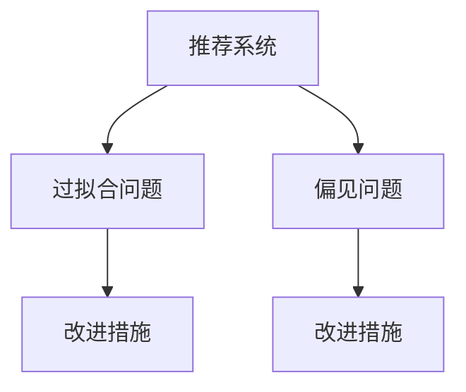

                 

# 推荐系统的局限性：过拟合与偏见

## 1. 背景介绍

### 1.1 问题由来

随着互联网的发展，推荐系统已成为人们获取信息和内容的重要工具。无论是电子商务网站、新闻媒体还是社交平台，推荐系统都在提供个性化内容推荐，提升用户体验和满意度。然而，尽管推荐系统在技术上取得了显著进展，但仍面临着一些无法忽视的局限性，尤其是过拟合和偏见问题。这些问题不仅影响了推荐系统的公平性和可信度，还可能导致用户信任下降，影响商业收益和市场份额。

### 1.2 问题核心关键点

推荐系统的过拟合和偏见问题主要体现在以下几个方面：

- **过拟合**：推荐系统在训练过程中过度依赖于训练数据，导致模型在面对新数据时表现不佳。过拟合可能来源于数据不平衡、训练时间过长、模型过于复杂等问题。
- **偏见**：推荐系统中的偏见可以源自于数据集本身的偏差、算法设计中的偏差，或者用户反馈数据的不公平。偏见会导致不公平的推荐结果，加剧社会分化。

这些核心问题需要研究者深入理解，寻找解决方案，以推动推荐系统的进步。本文将围绕这些问题展开讨论，并提出可能的改进措施。

## 2. 核心概念与联系

### 2.1 核心概念概述

推荐系统是由用户行为数据和物品特征数据构建的机器学习模型，通过学习用户与物品之间的交互模式，预测用户可能感兴趣的物品，并进行推荐。推荐系统通常分为显式反馈和隐式反馈两类，前者基于用户的评分数据，后者则依赖用户的浏览、点击、购买等行为数据。

推荐系统中的过拟合问题，指的是模型在训练数据上表现良好，但在新数据上表现不佳的情况。而偏见问题，则是指推荐系统在不同用户群体间或物品间存在不公平的差异，导致推荐结果偏向某一群体或物品。

这些核心概念之间的逻辑关系可以通过以下Mermaid流程图来展示：



这个流程图展示了几类关键概念及其之间的关系：

1. 推荐系统是核心概念，通过学习用户行为和物品特征，为用户提供个性化推荐。
2. 过拟合和偏见是推荐系统需要解决的主要问题，影响系统的公平性和准确性。
3. 改进措施是解决问题的方法，旨在提升推荐系统的性能和可靠性。

## 3. 核心算法原理 & 具体操作步骤
### 3.1 算法原理概述

推荐系统的核心算法原理主要包括协同过滤、基于内容的推荐、矩阵分解、深度学习等方法。协同过滤是最基础的推荐算法，通过计算用户和物品之间的相似度来进行推荐。基于内容的推荐则根据物品的特征和用户的历史偏好来进行推荐。矩阵分解和深度学习方法则通过构建低秩矩阵或神经网络模型，进一步提升推荐准确性。

### 3.2 算法步骤详解

推荐系统的微调过程通常包括以下几个关键步骤：

**Step 1: 数据预处理**
- 收集用户行为数据和物品特征数据，进行数据清洗和预处理。
- 对于显式反馈数据，进行缺失值填补、异常值处理等操作。
- 对于隐式反馈数据，通过时间衰减等方式进行归一化。

**Step 2: 特征工程**
- 对用户行为和物品特征进行特征提取，如词袋模型、TF-IDF、嵌入表示等。
- 将高维稀疏数据转化为稠密向量，便于模型训练。
- 引入正则化技术，如L1、L2正则化，防止模型过拟合。

**Step 3: 模型训练**
- 选择合适的推荐算法和模型，如协同过滤、基于内容的推荐、矩阵分解等。
- 在训练集上进行模型训练，使用交叉验证等技术评估模型性能。
- 调整模型参数，如学习率、正则化系数等，进行超参数调优。

**Step 4: 模型评估**
- 在验证集上评估模型性能，如准确率、召回率、F1-score等指标。
- 使用A/B测试等方法，评估推荐效果，并收集用户反馈。

**Step 5: 模型部署**
- 将训练好的模型部署到推荐系统服务器中，进行实时推荐。
- 监控推荐系统的性能和稳定运行，进行故障排查和优化。

### 3.3 算法优缺点

推荐系统的算法具有以下优点：
1. 高效推荐：通过学习用户行为和物品特征，快速提供个性化推荐。
2. 灵活性高：可以应对不同类型的数据和推荐任务，适用范围广。
3. 可扩展性强：可以处理大规模数据，支持实时推荐。

同时，推荐系统也存在一些缺点：
1. 依赖数据：推荐系统的效果很大程度上依赖于数据的质量和数量。
2. 过拟合风险：模型在训练过程中容易过拟合，影响推荐效果。
3. 偏见问题：推荐系统中的偏见可能导致不公平的推荐结果。
4. 可解释性差：推荐系统的决策过程难以解释，缺乏透明度。
5. 用户隐私风险：推荐系统涉及用户行为数据，存在隐私泄露风险。

### 3.4 算法应用领域

推荐系统已被广泛应用于多个领域，例如：

- 电子商务：推荐商品、优惠券、促销活动等。
- 媒体平台：推荐新闻、视频、音乐等内容。
- 社交网络：推荐好友、群组、帖子等。
- 金融领域：推荐理财产品、保险、贷款等。
- 健康医疗：推荐药品、诊疗方案、健康管理工具等。

推荐系统在各个领域的应用，极大地提升了用户体验和业务效益，成为互联网技术的重要组成部分。

## 4. 数学模型和公式 & 详细讲解
### 4.1 数学模型构建

推荐系统中的过拟合和偏见问题，可以通过数学模型和公式进行描述。假设推荐系统使用协同过滤算法，推荐模型为 $M=\alpha U V^T + B$，其中 $U$ 为用户的低秩矩阵表示，$V$ 为物品的低秩矩阵表示，$B$ 为偏置项，$\alpha$ 为缩放因子。推荐系统在训练数据集 $D=\{(x_i,y_i)\}_{i=1}^N$ 上的损失函数为：

$$
\mathcal{L} = \frac{1}{N}\sum_{i=1}^N [(y_i - M_{\theta}(x_i))^2]
$$

其中 $x_i$ 为用户行为数据，$y_i$ 为推荐系统预测的目标值，$M_{\theta}(x_i)$ 为推荐模型在输入 $x_i$ 上的输出。

### 4.2 公式推导过程

对于协同过滤算法，可以通过矩阵分解方法求解低秩矩阵 $U$ 和 $V$，从而得到推荐模型的参数 $\theta$。假设 $U$ 和 $V$ 的秩为 $k$，则矩阵分解问题可以表示为：

$$
U \approx A_k, \quad V \approx B_k
$$

其中 $A_k$ 和 $B_k$ 为降秩后的矩阵，$k$ 为矩阵的秩。

通过矩阵分解方法，可以将矩阵 $U$ 和 $V$ 近似表示为：

$$
U \approx \tilde{U}_k \tilde{U}_k^T, \quad V \approx \tilde{V}_k \tilde{V}_k^T
$$

其中 $\tilde{U}_k$ 和 $\tilde{V}_k$ 为矩阵的低秩近似，$A_k$ 和 $B_k$ 的奇异值分解为：

$$
A_k = U_k \Sigma_k V_k^T, \quad B_k = W_k \Sigma_k H_k^T
$$

其中 $U_k$ 和 $W_k$ 为矩阵 $A_k$ 和 $B_k$ 的左奇异矩阵，$V_k$ 和 $H_k$ 为矩阵 $A_k$ 和 $B_k$ 的右奇异矩阵，$\Sigma_k$ 为奇异值对角矩阵。

通过求解上述优化问题，可以得到推荐模型的参数 $\theta$：

$$
\theta = \tilde{U}_k \tilde{V}_k^T + B
$$

### 4.3 案例分析与讲解

以下以一个简单的推荐系统案例来说明过拟合和偏见问题的解决。假设有一个电商平台的推荐系统，用户 $i$ 对物品 $j$ 的评分数据为 $R_{ij}$，推荐系统使用协同过滤算法进行推荐。

**Step 1: 数据预处理**
- 收集用户评分数据和物品特征数据，进行数据清洗和预处理。
- 对显式反馈数据进行缺失值填补、异常值处理等操作。
- 对隐式反馈数据进行时间衰减等归一化处理。

**Step 2: 特征工程**
- 对用户和物品进行特征提取，如用户画像、物品分类、用户兴趣等。
- 将高维稀疏数据转化为稠密向量，便于模型训练。
- 引入L1、L2正则化等技术，防止模型过拟合。

**Step 3: 模型训练**
- 使用协同过滤算法，在训练集上进行模型训练，使用交叉验证等技术评估模型性能。
- 调整模型参数，如学习率、正则化系数等，进行超参数调优。

**Step 4: 模型评估**
- 在验证集上评估模型性能，如准确率、召回率、F1-score等指标。
- 使用A/B测试等方法，评估推荐效果，并收集用户反馈。

**Step 5: 模型部署**
- 将训练好的模型部署到推荐系统服务器中，进行实时推荐。
- 监控推荐系统的性能和稳定运行，进行故障排查和优化。

## 5. 项目实践：代码实例和详细解释说明
### 5.1 开发环境搭建

在进行推荐系统开发前，我们需要准备好开发环境。以下是使用Python进行推荐系统开发的环境配置流程：

1. 安装Anaconda：从官网下载并安装Anaconda，用于创建独立的Python环境。

2. 创建并激活虚拟环境：
```bash
conda create -n recsys python=3.8 
conda activate recsys
```

3. 安装必要的Python包：
```bash
pip install numpy pandas scikit-learn scikit-mind
```

4. 安装TensorFlow或PyTorch：
```bash
pip install tensorflow==2.8
# 或
pip install torch==1.11
```

5. 安装相关的推荐系统库：
```bash
pip install recsys
```

完成上述步骤后，即可在`recsys`环境中开始推荐系统开发。

### 5.2 源代码详细实现

以下以基于协同过滤算法的推荐系统为例，给出使用TensorFlow的推荐系统代码实现。

```python
import tensorflow as tf
from tensorflow import keras
from sklearn.model_selection import train_test_split

# 定义数据集
X = keras.utils.to_categorical(train_features, num_classes)
y = keras.utils.to_categorical(train_labels, num_classes)

# 定义模型
model = keras.models.Sequential([
    keras.layers.Dense(128, activation='relu', input_shape=(X.shape[1],)),
    keras.layers.Dense(num_classes, activation='softmax')
])

# 编译模型
model.compile(optimizer='adam', loss='categorical_crossentropy', metrics=['accuracy'])

# 训练模型
model.fit(X_train, y_train, epochs=10, batch_size=128, validation_data=(X_test, y_test))

# 评估模型
model.evaluate(X_test, y_test)
```

以上代码展示了基于TensorFlow的推荐系统实现过程。首先，定义训练数据集和模型架构，然后使用`compile`方法编译模型，最后使用`fit`方法训练模型，并在测试集上进行评估。

### 5.3 代码解读与分析

让我们再详细解读一下关键代码的实现细节：

**数据集定义**：
- `train_features`和`train_labels`分别为用户评分数据和物品评分数据，经过`to_categorical`方法转化为one-hot编码形式。
- `num_classes`为评分数据的类别数，通常为1到5。

**模型定义**：
- 定义了一个包含两个全连接层的神经网络，第一层为128个神经元的隐藏层，激活函数为ReLU，第二层为输出层，激活函数为softmax。
- 通过`Sequential`模型结构，依次添加输入层、隐藏层和输出层。

**模型编译**：
- 使用`adam`优化器进行优化，`categorical_crossentropy`损失函数用于处理多分类问题，`accuracy`为评估指标。

**模型训练**：
- 使用`fit`方法训练模型，`X_train`和`y_train`分别为训练集的特征和标签。
- `epochs`和`batch_size`分别为训练轮数和批次大小，`validation_data`为验证集。

**模型评估**：
- 使用`evaluate`方法评估模型性能，返回模型在测试集上的损失和准确率。

可以看到，推荐系统的代码实现相对简洁，但实际开发中还需要考虑数据预处理、特征工程、模型调优等多方面因素，才能得到理想的推荐结果。

## 6. 实际应用场景
### 6.1 智能推荐引擎

智能推荐引擎是推荐系统的主要应用场景，通过分析用户历史行为数据，为用户推荐个性化商品、内容或服务。智能推荐引擎的应用范围广泛，涵盖电子商务、新闻媒体、社交平台等多个领域。

在电子商务平台，智能推荐引擎可以为用户推荐商品、优惠券、促销活动等，提升用户购买率和购物体验。在新闻媒体平台，推荐引擎可以为用户推荐新闻、视频、音乐等内容，增加用户停留时间和平台粘性。在社交平台，推荐引擎可以为用户推荐好友、群组、帖子等，增强平台活跃度和用户互动。

### 6.2 广告投放

广告投放是推荐系统在互联网广告中的重要应用。通过分析用户行为数据，推荐系统可以为用户推荐最相关的广告内容，提高广告的点击率和转化率。广告投放推荐系统可以提高广告主的ROI，同时提升用户体验。

### 6.3 金融服务

金融服务领域也需要推荐系统，为用户提供个性化的理财产品、保险、贷款等服务。推荐系统可以根据用户的财务状况、风险偏好等，推荐最合适的金融产品，降低风险，增加收益。

### 6.4 未来应用展望

随着推荐系统技术的发展，未来的应用场景将更加广泛和深入：

1. **个性化医疗**：推荐系统可以为用户提供个性化的医疗建议、药物推荐、诊疗方案等，提高医疗服务的质量和效率。
2. **智能家居**：推荐系统可以为用户推荐最适合的家居产品、服务，提升家居生活的便利性和舒适度。
3. **教育培训**：推荐系统可以为用户推荐个性化的学习内容、课程、书籍等，提高学习效率和效果。
4. **智能交通**：推荐系统可以为用户推荐最合适的出行方案、交通信息等，优化出行体验和效率。

## 7. 工具和资源推荐
### 7.1 学习资源推荐

为了帮助开发者系统掌握推荐系统的理论基础和实践技巧，这里推荐一些优质的学习资源：

1. 《推荐系统实践》书籍：由推荐系统专家撰写，全面介绍了推荐系统的基本原理、算法和实践技巧。
2. CS229《机器学习》课程：斯坦福大学开设的机器学习课程，涵盖推荐系统在内的多种机器学习算法。
3. KDD Cup推荐系统竞赛数据集：KDD Cup提供丰富的推荐系统竞赛数据集，可用于研究和实践推荐算法。
4. PyTorch和TensorFlow官方文档：推荐的深度学习框架，提供了详细的API和教程，支持推荐系统开发。

通过对这些资源的学习实践，相信你一定能够快速掌握推荐系统的精髓，并用于解决实际的推荐问题。

### 7.2 开发工具推荐

高效的开发离不开优秀的工具支持。以下是几款用于推荐系统开发的常用工具：

1. PyTorch和TensorFlow：基于Python的开源深度学习框架，灵活动态的计算图，适合快速迭代研究。
2. TensorBoard：TensorFlow配套的可视化工具，可实时监测模型训练状态，并提供丰富的图表呈现方式。
3. Weights & Biases：模型训练的实验跟踪工具，可以记录和可视化模型训练过程中的各项指标，方便对比和调优。
4. Apache Mahout：Apache基金会推出的推荐系统库，提供丰富的推荐算法和分布式计算能力。
5. Surprise：Python推荐系统库，提供了多种推荐算法和数据处理工具。

合理利用这些工具，可以显著提升推荐系统的开发效率，加快创新迭代的步伐。

### 7.3 相关论文推荐

推荐系统的发展源于学界的持续研究。以下是几篇奠基性的相关论文，推荐阅读：

1.协同过滤推荐系统：由Adams、Bruynooghe、N adam & L 论文，提出了基于协同过滤的推荐算法。
2.矩阵分解方法：由Koren、Brendan、Lewis & Pau 论文，提出了基于矩阵分解的推荐算法。
3.深度学习方法：由He、Zeyu、Yen-Chen & Xin 论文，提出了基于深度学习的推荐算法。
4.推荐系统的评价指标：由Jesús 论文，全面介绍了推荐系统的评价指标和优化方法。

这些论文代表了大语言模型微调技术的发展脉络。通过学习这些前沿成果，可以帮助研究者把握学科前进方向，激发更多的创新灵感。

## 8. 总结：未来发展趋势与挑战
### 8.1 总结

本文对推荐系统中的过拟合和偏见问题进行了全面系统的介绍。首先阐述了推荐系统的背景和目标，明确了过拟合和偏见在推荐系统中的关键作用。其次，从原理到实践，详细讲解了推荐系统的算法原理和关键步骤，给出了推荐系统开发的完整代码实例。同时，本文还探讨了推荐系统在多个行业领域的应用前景，展示了推荐系统技术的广阔前景。

通过本文的系统梳理，可以看到，推荐系统通过学习和分析用户行为数据，为用户推荐个性化内容，极大地提升了用户体验和业务效益。未来，伴随推荐技术的发展，推荐系统的应用场景将更加广泛和深入，为社会各行业带来深刻变革。

### 8.2 未来发展趋势

展望未来，推荐系统的发展将呈现以下几个趋势：

1. **个性化推荐**：推荐系统将更加注重个性化推荐，通过深度学习等技术，提升推荐准确性和多样性，满足用户多样化需求。
2. **跨模态推荐**：推荐系统将引入视觉、语音、文本等多种模态数据，实现跨模态推荐，提升推荐效果。
3. **联邦学习**：推荐系统将采用联邦学习等技术，保护用户隐私的同时，提升推荐模型性能。
4. **动态推荐**：推荐系统将更加注重动态推荐，根据用户行为实时调整推荐策略，提高推荐效果。
5. **多任务推荐**：推荐系统将采用多任务学习技术，提升模型在不同任务上的表现。

以上趋势凸显了推荐系统技术的发展方向，在提升推荐效果的同时，也将关注用户隐私和公平性问题。

### 8.3 面临的挑战

尽管推荐系统在技术上取得了显著进展，但在迈向更加智能化、普适化应用的过程中，仍面临着诸多挑战：

1. **数据隐私问题**：推荐系统涉及用户行为数据，存在隐私泄露风险。如何在保护用户隐私的同时，提升推荐效果，将是重要的研究课题。
2. **推荐偏见问题**：推荐系统中的偏见可能导致不公平的推荐结果。如何减少偏见，提升推荐系统的公平性，还需要进一步研究。
3. **动态数据挑战**：推荐系统需要处理实时动态数据，对算力和存储能力提出了更高要求。如何优化模型结构，提高实时处理能力，是重要的研究方向。
4. **多模态数据融合**：推荐系统需要融合视觉、语音、文本等多种模态数据，提升推荐效果。如何高效融合多种数据，需要更多技术突破。
5. **跨领域应用**：推荐系统需要适应不同领域的应用场景，如何构建通用推荐框架，提升模型泛化能力，是未来的重要研究方向。

这些挑战展示了推荐系统在实际应用中面临的困境。只有不断创新和优化，才能推动推荐系统技术的发展，实现更好的用户体验和业务效益。

### 8.4 研究展望

未来的推荐系统研究需要在以下几个方面寻求新的突破：

1. **无监督和半监督学习**：探索无监督和半监督学习技术，降低推荐系统对大量标注数据的依赖，提升模型泛化能力。
2. **对抗推荐系统**：研究对抗推荐系统技术，提升推荐系统的鲁棒性和安全性，防止恶意攻击。
3. **多任务学习**：采用多任务学习技术，提升推荐系统在不同任务上的表现，实现更全面、更精准的推荐。
4. **跨模态推荐**：研究跨模态推荐技术，提升推荐系统的多模态融合能力，实现更全面、更精准的推荐。
5. **推荐系统的伦理和公平性**：研究推荐系统的伦理和公平性问题，确保推荐结果符合人类价值观和伦理道德。

这些研究方向将推动推荐系统技术的进步，为构建安全、可靠、可解释、可控的智能系统铺平道路。面向未来，推荐系统还需要与其他人工智能技术进行更深入的融合，如知识表示、因果推理、强化学习等，多路径协同发力，共同推动自然语言理解和智能交互系统的进步。只有勇于创新、敢于突破，才能不断拓展推荐系统的边界，让智能技术更好地造福人类社会。

## 9. 附录：常见问题与解答

**Q1：推荐系统是否可以解决所有推荐问题？**

A: 推荐系统可以解决大部分推荐问题，但在某些特殊场景下，可能无法取得理想的推荐效果。例如，对于新用户或新物品，由于缺乏历史行为数据，推荐系统可能无法准确预测其偏好。此外，对于个性化需求极高的场景，推荐系统也可能面临数据稀疏、模型复杂等问题。

**Q2：如何避免推荐系统中的过拟合问题？**

A: 推荐系统中的过拟合问题可以通过以下方法进行缓解：
1. 数据增强：通过合成数据、生成对抗样本等方式，增加训练集的多样性。
2. 正则化：引入L1、L2正则化等技术，防止模型过拟合。
3. 模型裁剪：去除不必要的层和参数，减小模型尺寸，加快推理速度。
4. 对抗训练：引入对抗样本，提高模型鲁棒性。

这些方法需要根据具体任务和数据特点进行灵活组合，才能最大限度地减少过拟合风险。

**Q3：推荐系统中如何减少偏见问题？**

A: 推荐系统中的偏见问题可以通过以下方法进行缓解：
1. 数据清洗：对数据集进行清洗，去除有害数据和噪声。
2. 算法改进：改进推荐算法，消除算法本身的偏见。
3. 公平性评估：引入公平性评估指标，如公平性差错率等，评估推荐系统的公平性。
4. 用户反馈：收集用户反馈，调整推荐策略，提升推荐公平性。

这些方法需要从数据、算法和用户反馈等多个角度进行综合优化，才能提升推荐系统的公平性和透明度。

**Q4：推荐系统中如何进行动态推荐？**

A: 推荐系统中的动态推荐可以通过以下方法进行优化：
1. 实时数据处理：实时处理用户行为数据，动态调整推荐策略。
2. 模型更新：根据用户行为数据，定期更新推荐模型。
3. 用户画像：构建用户画像，根据用户行为历史，动态调整推荐策略。
4. 多策略融合：融合多种推荐策略，提升推荐效果。

这些方法需要从数据处理、模型更新、用户画像和多策略融合等多个角度进行优化，才能实现更精准、更实时的推荐。

**Q5：推荐系统中的数据隐私问题如何解决？**

A: 推荐系统中的数据隐私问题可以通过以下方法进行缓解：
1. 数据匿名化：对用户行为数据进行匿名化处理，保护用户隐私。
2. 联邦学习：采用联邦学习技术，在不共享用户数据的情况下，提升推荐模型性能。
3. 差分隐私：引入差分隐私技术，在保护用户隐私的同时，提升推荐效果。
4. 安全推荐算法：采用安全推荐算法，防止恶意攻击，保护用户隐私。

这些方法需要从数据处理、算法设计和模型优化等多个角度进行综合优化，才能提升推荐系统的数据隐私保护能力。

---

作者：禅与计算机程序设计艺术 / Zen and the Art of Computer Programming

