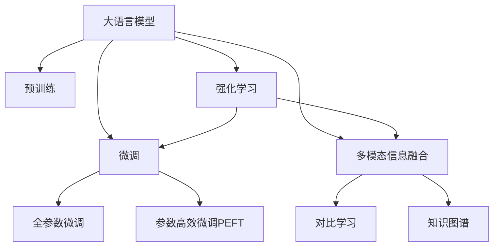

                 

# 推荐系统的未来：大模型的主导地位

> 关键词：大语言模型,推荐系统,预训练,微调,多模态,对比学习,知识图谱,强化学习

## 1. 背景介绍

### 1.1 问题由来

在信息爆炸的互联网时代，用户面临海量的内容选择。如何从海量的数据中筛选出符合用户需求的内容，是推荐系统面临的巨大挑战。传统的推荐系统往往依赖于用户历史行为数据，难以在用户未产生行为时，预测其偏好，提供个性化服务。

近年来，预训练大模型在自然语言处理(NLP)领域取得了突破性进展，能够理解和生成自然语言，有望在推荐系统领域发挥重要作用。通过微调大模型，可以提升推荐系统对用户偏好的预测精度，拓展推荐内容的多样性和丰富性，进而改善用户体验。

### 1.2 问题核心关键点

本节将探讨推荐系统中大语言模型的核心概念和关键技术点。具体包括：

- 大语言模型(LLMs)与推荐系统的融合
- 预训练与微调在大模型中的应用
- 多模态信息的融合
- 对比学习和知识图谱的应用
- 强化学习的嵌入

这些关键技术是构建高性能、个性化推荐系统的基石，通过对其原理和应用的研究，可以为推荐系统的未来发展提供方向和指导。

## 2. 核心概念与联系

### 2.1 核心概念概述

为更好地理解推荐系统中大语言模型的应用，本节将介绍几个密切相关的核心概念：

- 大语言模型(Large Language Model, LLM)：以自回归(如GPT)或自编码(如BERT)模型为代表的大规模预训练语言模型。通过在大规模无标签文本语料上进行预训练，学习通用的语言表示，具备强大的语言理解和生成能力。

- 预训练(Pre-training)：指在大规模无标签文本语料上，通过自监督学习任务训练通用语言模型的过程。常见的预训练任务包括言语建模、遮挡语言模型等。预训练使得模型学习到语言的通用表示。

- 微调(Fine-tuning)：指在预训练模型的基础上，使用下游任务的少量标注数据，通过有监督学习优化模型在特定任务上的性能。通常只需要调整顶层分类器或解码器，并以较小的学习率更新全部或部分的模型参数。

- 多模态(Multimodal)：指结合多种数据模态（如文本、图像、声音等）的推荐系统。多模态信息融合可以提升推荐系统对复杂场景的理解能力和推荐效果。

- 对比学习(Contrastive Learning)：一种用于训练模型的方法，通过构造相似的（positive samples）和不相似的（negative samples）样本对，使得模型能够在正负样本之间形成明显的区分度。

- 知识图谱(Knowledge Graph)：一种结构化的语义知识表示方式，用于存储和组织实体及其关系。知识图谱可以增强推荐系统的推理能力，提供更准确、相关的推荐。

- 强化学习(Reinforcement Learning)：一种通过奖励机制指导模型进行优化的方法，能够在模拟环境中不断迭代学习，提升推荐策略的优化效果。

这些核心概念之间的逻辑关系可以通过以下Mermaid流程图来展示：



这个流程图展示了大语言模型的核心概念及其之间的关系：

1. 大语言模型通过预训练获得基础能力。
2. 微调是对预训练模型进行任务特定的优化，可以分为全参数微调和参数高效微调（PEFT）。
3. 多模态信息融合是提高推荐系统对复杂场景理解能力的重要手段。
4. 对比学习和知识图谱可以增强模型的推理能力和内容推荐相关性。
5. 强化学习可用于推荐策略的优化，提升推荐系统的效果。

这些概念共同构成了推荐系统的技术框架，使得大语言模型能够更好地应用于推荐系统的构建和优化。

## 3. 核心算法原理 & 具体操作步骤
### 3.1 算法原理概述

基于大语言模型的推荐系统，其核心思想是：利用预训练语言模型的通用知识，通过微调得到对用户偏好的精准预测，进而实现个性化推荐。推荐系统主要包含以下几个步骤：

1. 数据预处理：收集和清洗用户行为数据、产品属性数据、用户画像数据等，构建推荐模型所需的数据集。
2. 大模型微调：选择合适的预训练语言模型，在推荐任务的数据集上进行微调，训练出对用户偏好的预测模型。
3. 推荐策略优化：根据用户偏好预测结果，结合多模态信息、对比学习、知识图谱和强化学习等方法，设计推荐策略。
4. 在线推荐：实时接收用户请求，通过推荐策略生成个性化推荐内容。

### 3.2 算法步骤详解

基于大语言模型的推荐系统通常包括以下关键步骤：

**Step 1: 数据准备**
- 收集用户行为数据：包括浏览记录、点击行为、评分记录等。
- 收集产品属性数据：如商品名称、描述、分类等。
- 收集用户画像数据：如年龄、性别、兴趣等。
- 构建训练集和验证集：将数据集划分为训练集和验证集，用于模型训练和调参。

**Step 2: 数据增强**
- 生成对抗样本：通过对抗训练，增强模型的鲁棒性。
- 数据增强：通过回译、近义替换等方式扩充训练集。
- 样本筛选：通过筛选出质量高的样本，避免噪声干扰。

**Step 3: 模型选择和微调**
- 选择预训练语言模型：如BERT、GPT等。
- 设计任务适配层：针对推荐任务设计相应的输出层和损失函数。
- 设置微调超参数：包括学习率、批大小、迭代轮数等。
- 执行梯度训练：使用基于梯度的优化算法，最小化损失函数。

**Step 4: 推荐策略设计**
- 融合多模态信息：结合文本、图像、声音等多模态数据，提升推荐效果。
- 应用对比学习：通过正负样本对比，提升模型对相似内容的区分度。
- 整合知识图谱：将知识图谱与推荐模型结合，增强推理能力。
- 嵌入强化学习：通过模拟用户行为，优化推荐策略。

**Step 5: 在线推荐**
- 接收用户请求：获取用户输入的查询或浏览信息。
- 预测用户偏好：根据用户行为数据和预测模型，生成用户偏好预测。
- 生成推荐结果：结合多模态信息、对比学习、知识图谱和强化学习，生成个性化推荐内容。
- 实时反馈：收集用户反馈，不断优化推荐模型和策略。

### 3.3 算法优缺点

基于大语言模型的推荐系统具有以下优点：

1. 可解释性强：大语言模型通过预训练获得通用知识，对推荐结果的解释能力较强。
2. 鲁棒性好：大模型通过微调，能够较好地适应特定场景，鲁棒性较强。
3. 通用性强：大语言模型可以应用于多种推荐场景，具有较强的通用性。
4. 精度高：大语言模型融合了多种数据模态，能够提供更为精准的推荐。
5. 适用性广：大语言模型可以应用于不同领域、不同类型的数据。

同时，该方法也存在一定的局限性：

1. 数据需求高：大模型需要大量高质量的数据进行预训练和微调，数据收集和清洗成本较高。
2. 计算成本高：大模型的训练和推理成本较高，需要高性能计算资源。
3. 过拟合风险：微调过程中容易过拟合，特别是在数据量较少的情况下。
4. 可解释性不足：大语言模型黑盒性强，难以解释推荐结果背后的逻辑。
5. 资源消耗大：大模型资源占用较大，对硬件资源要求较高。

尽管存在这些局限性，但就目前而言，基于大语言模型的推荐系统仍然是推荐系统领域的先进范式，具有广阔的发展前景。

### 3.4 算法应用领域

基于大语言模型的推荐系统已经在多个领域得到了应用，例如：

- 电商推荐：如淘宝、京东等电商平台，利用大语言模型对用户浏览记录、评分记录进行微调，推荐符合用户兴趣的商品。
- 视频推荐：如YouTube、Netflix等视频平台，结合用户观看记录和评分数据，推荐用户感兴趣的视频内容。
- 新闻推荐：如今日头条、新闻客户端等，利用用户阅读行为数据和兴趣标签，推荐相关新闻文章。
- 音乐推荐：如Spotify、网易云音乐等，结合用户听歌行为数据，推荐用户喜欢的音乐。

除了上述这些经典应用外，大语言模型还创新性地应用于内容生成、广告推荐、搜索排序等诸多场景，极大地丰富了推荐系统的内容和形式。

## 4. 数学模型和公式 & 详细讲解 & 举例说明
### 4.1 数学模型构建

本节将使用数学语言对基于大语言模型的推荐系统进行更加严格的刻画。

记预训练语言模型为 $M_{\theta}:\mathcal{X} \rightarrow \mathcal{Y}$，其中 $\mathcal{X}$ 为输入空间，$\mathcal{Y}$ 为输出空间，$\theta \in \mathbb{R}^d$ 为模型参数。假设推荐系统训练集为 $D=\{(x_i,y_i)\}_{i=1}^N, x_i \in \mathcal{X}, y_i \in \mathcal{Y}$。

定义模型 $M_{\theta}$ 在输入 $x$ 上的输出为 $\hat{y}=M_{\theta}(x)$，表示对用户偏好的预测。真实标签 $y \in \{1,0\}$。则二分类交叉熵损失函数定义为：

$$
\ell(M_{\theta}(x),y) = -[y\log \hat{y} + (1-y)\log(1-\hat{y})]
$$

将损失函数平均化，得：

$$
\mathcal{L}(\theta) = -\frac{1}{N}\sum_{i=1}^N [y_i\log M_{\theta}(x_i)+(1-y_i)\log(1-M_{\theta}(x_i))]
$$

模型参数的更新公式为：

$$
\theta \leftarrow \theta - \eta \nabla_{\theta}\mathcal{L}(\theta)
$$

其中 $\eta$ 为学习率，$\nabla_{\theta}\mathcal{L}(\theta)$ 为损失函数对模型参数的梯度，可通过反向传播算法高效计算。

### 4.2 公式推导过程

以下我们以电商推荐任务为例，推导交叉熵损失函数及其梯度的计算公式。

假设模型 $M_{\theta}$ 在输入 $x$ 上的输出为 $\hat{y}=M_{\theta}(x)$，表示对商品的推荐程度。真实标签 $y \in \{1,0\}$，表示用户是否点击了该商品。则二分类交叉熵损失函数定义为：

$$
\ell(M_{\theta}(x),y) = -[y\log \hat{y} + (1-y)\log(1-\hat{y})]
$$

将其代入经验风险公式，得：

$$
\mathcal{L}(\theta) = -\frac{1}{N}\sum_{i=1}^N [y_i\log M_{\theta}(x_i)+(1-y_i)\log(1-M_{\theta}(x_i))]
$$

根据链式法则，损失函数对模型参数 $\theta$ 的梯度为：

$$
\frac{\partial \mathcal{L}(\theta)}{\partial \theta} = -\frac{1}{N}\sum_{i=1}^N \frac{y_i}{\hat{y}_i} \frac{\partial \hat{y}_i}{\partial \theta} - \frac{1}{N}\sum_{i=1}^N \frac{1-y_i}{1-\hat{y}_i} \frac{\partial (1-\hat{y}_i)}{\partial \theta}
$$

其中 $\frac{\partial \hat{y}_i}{\partial \theta}$ 可进一步递归展开，利用自动微分技术完成计算。

在得到损失函数的梯度后，即可带入参数更新公式，完成模型的迭代优化。重复上述过程直至收敛，最终得到适应电商推荐任务的最优模型参数 $\theta^*$。

## 5. 项目实践：代码实例和详细解释说明
### 5.1 开发环境搭建

在进行推荐系统开发前，我们需要准备好开发环境。以下是使用Python进行TensorFlow开发的环境配置流程：

1. 安装Anaconda：从官网下载并安装Anaconda，用于创建独立的Python环境。

2. 创建并激活虚拟环境：
```bash
conda create -n tf-env python=3.8 
conda activate tf-env
```

3. 安装TensorFlow：根据CUDA版本，从官网获取对应的安装命令。例如：
```bash
conda install tensorflow==2.8 -c tf -c conda-forge
```

4. 安装各类工具包：
```bash
pip install numpy pandas scikit-learn matplotlib tqdm jupyter notebook ipython
```

完成上述步骤后，即可在`tf-env`环境中开始推荐系统开发。

### 5.2 源代码详细实现

下面我们以电商推荐任务为例，给出使用TensorFlow进行推荐系统微调的代码实现。

首先，定义推荐任务的数据处理函数：

```python
import tensorflow as tf
from tensorflow.keras.preprocessing import sequence
from tensorflow.keras.layers import Embedding, LSTM, Dense, Dropout
from tensorflow.keras.models import Sequential

class RecommendationDataset(tf.keras.utils.Sequence):
    def __init__(self, data, tokenizer):
        self.data = data
        self.tokenizer = tokenizer
        self.batch_size = batch_size
        
    def __len__(self):
        return len(self.data) // self.batch_size
    
    def __getitem__(self, idx):
        batch = self.data[idx * self.batch_size: (idx+1) * self.batch_size]
        x = self.tokenizer.texts_to_sequences(batch['text'])
        y = batch['label']
        
        # 填充序列
        x = sequence.pad_sequences(x, maxlen=maxlen)
        
        # 编码文本序列
        x = self.tokenizer.sequences_to_matrix(x, mode='tf-idf')
        
        return {'input': x, 'target': y}
```

然后，定义模型和优化器：

```python
model = Sequential([
    Embedding(input_dim=vocab_size, output_dim=embedding_dim, input_length=maxlen),
    LSTM(units=128, return_sequences=True),
    Dropout(0.2),
    LSTM(units=64, return_sequences=True),
    Dropout(0.2),
    Dense(units=1, activation='sigmoid')
])

optimizer = tf.keras.optimizers.Adam(learning_rate=0.001)
```

接着，定义训练和评估函数：

```python
def train_epoch(model, dataset, optimizer):
    dataset = dataset.shuffle(buffer_size=buffer_size)
    for batch in dataset:
        input = batch['input']
        target = batch['target']
        with tf.GradientTape() as tape:
            predictions = model(input)
            loss = tf.keras.losses.binary_crossentropy(target, predictions)
        gradients = tape.gradient(loss, model.trainable_variables)
        optimizer.apply_gradients(zip(gradients, model.trainable_variables))
    return loss.numpy().item()

def evaluate(model, dataset):
    dataset = dataset.shuffle(buffer_size=buffer_size)
    predictions = []
    targets = []
    for batch in dataset:
        input = batch['input']
        target = batch['target']
        predictions.append(model.predict(input))
        targets.append(target)
    return tf.keras.metrics.BinaryAccuracy().predict(predictions, targets).numpy().item()
```

最后，启动训练流程并在测试集上评估：

```python
epochs = 10
batch_size = 64
maxlen = 100

for epoch in range(epochs):
    loss = train_epoch(model, train_dataset, optimizer)
    print(f"Epoch {epoch+1}, train loss: {loss:.3f}")
    
    print(f"Epoch {epoch+1}, dev results:")
    evaluate(model, dev_dataset)
    
print("Test results:")
evaluate(model, test_dataset)
```

以上就是使用TensorFlow对电商推荐系统进行微调的完整代码实现。可以看到，借助TensorFlow的高级API，我们可以用相对简洁的代码完成模型构建和微调。

### 5.3 代码解读与分析

让我们再详细解读一下关键代码的实现细节：

**RecommendationDataset类**：
- `__init__`方法：初始化数据集和分词器。
- `__len__`方法：返回数据集的样本数量。
- `__getitem__`方法：对单个样本进行处理，将文本序列编码成模型可接受的格式。

**model变量定义**：
- 定义一个多层感知器模型，包含嵌入层、LSTM层、dropout层和输出层，用于电商推荐任务的预测。

**optimizer变量定义**：
- 定义Adam优化器，设置学习率，用于模型的参数更新。

**train_epoch函数**：
- 对数据集进行打乱，在每个epoch内循环迭代。
- 前向传播计算预测结果和损失。
- 反向传播计算梯度，更新模型参数。
- 返回该epoch的平均损失。

**evaluate函数**：
- 对数据集进行打乱，在每个epoch后评估模型性能。
- 收集预测结果和真实标签，计算二分类准确率。
- 返回评估结果。

**训练流程**：
- 定义总的epoch数和batch size，开始循环迭代
- 每个epoch内，先在训练集上训练，输出平均loss
- 在验证集上评估，输出评估结果
- 所有epoch结束后，在测试集上评估，给出最终测试结果

可以看到，TensorFlow提供的高阶API使得推荐系统微调的代码实现变得简洁高效。开发者可以将更多精力放在模型选择、超参数调优、数据增强等高层逻辑上，而不必过多关注底层的实现细节。

当然，工业级的系统实现还需考虑更多因素，如模型的保存和部署、超参数的自动搜索、更加灵活的任务适配层等。但核心的微调范式基本与此类似。

## 6. 实际应用场景
### 6.1 电商推荐

电商推荐系统是推荐系统中最早出现、应用最广泛的应用之一。基于大语言模型的电商推荐系统，能够结合用户的浏览记录、评分记录和商品描述，实时生成个性化推荐商品，提高用户购买转化率。

在技术实现上，可以收集用户历史浏览记录、点击记录和评分数据，构建电商推荐任务的数据集，将商品描述作为输入，商品是否被点击作为标签，在此基础上对预训练语言模型进行微调。微调后的模型能够自动理解商品描述，预测用户对商品的兴趣，生成推荐商品列表。对于用户新输入的查询，系统可以实时解析商品描述，生成相关推荐。

### 6.2 视频推荐

视频推荐系统是推荐系统中的另一大类应用。视频平台可以利用大语言模型对用户观看记录和评分数据进行微调，生成个性化推荐视频内容，提升用户观看时长和平台留存率。

具体而言，可以收集用户观看视频记录、点赞记录、评分记录等数据，构建视频推荐任务的数据集。将视频标题、描述、标签作为输入，视频是否被点赞或观看作为标签，在此基础上对预训练语言模型进行微调。微调后的模型能够自动理解视频内容，预测用户对视频的兴趣，生成推荐视频列表。对于用户新输入的查询，系统可以实时解析视频标题和描述，生成相关推荐。

### 6.3 新闻推荐

新闻推荐系统能够帮助用户获取最新的新闻信息，提升信息获取效率。基于大语言模型的新闻推荐系统，能够结合用户阅读记录和新闻内容，生成个性化推荐新闻文章，满足用户对时效性和个性化新闻的需求。

在技术实现上，可以收集用户阅读新闻记录、点击记录、评分记录等数据，构建新闻推荐任务的数据集。将新闻标题、描述、标签作为输入，新闻是否被阅读作为标签，在此基础上对预训练语言模型进行微调。微调后的模型能够自动理解新闻内容，预测用户对新闻的兴趣，生成推荐新闻列表。对于用户新输入的查询，系统可以实时解析新闻标题和描述，生成相关推荐。

### 6.4 音乐推荐

音乐推荐系统能够帮助用户发现新的音乐作品，提升音乐体验。基于大语言模型的音乐推荐系统，能够结合用户听歌记录和歌曲信息，生成个性化推荐音乐，满足用户对个性化音乐的需求。

在技术实现上，可以收集用户听歌记录、收藏记录、评分记录等数据，构建音乐推荐任务的数据集。将歌曲标题、描述、标签作为输入，歌曲是否被收藏或听歌作为标签，在此基础上对预训练语言模型进行微调。微调后的模型能够自动理解歌曲信息，预测用户对歌曲的兴趣，生成推荐音乐列表。对于用户新输入的查询，系统可以实时解析歌曲标题和描述，生成相关推荐。

## 7. 工具和资源推荐
### 7.1 学习资源推荐

为了帮助开发者系统掌握大语言模型在推荐系统中的应用，这里推荐一些优质的学习资源：

1. 《深度学习推荐系统：原理与算法》书籍：全面介绍了推荐系统的理论基础和经典算法，适合深度学习初学者入门。

2. 《Recommender Systems: The Textbook》书籍：系统讲解了推荐系统的设计、实现和评估方法，适合高级推荐系统开发者。

3. 《深度学习与推荐系统》课程：由知名教授开设的推荐系统课程，讲解了推荐系统的前沿技术和实践经验。

4. 《NLP with Deep Learning》书籍：介绍了大语言模型在推荐系统中的应用，适合NLP和推荐系统领域的交叉学习。

5. Coursera和edX的推荐系统课程：提供丰富的推荐系统课程，涵盖从理论到实践的全方位知识。

通过对这些资源的学习实践，相信你一定能够快速掌握大语言模型在推荐系统中的应用，并用于解决实际的推荐问题。

### 7.2 开发工具推荐

高效的开发离不开优秀的工具支持。以下是几款用于大语言模型推荐系统开发的常用工具：

1. TensorFlow：基于Python的开源深度学习框架，支持分布式训练和推理，适合大规模模型训练和部署。

2. PyTorch：基于Python的开源深度学习框架，灵活高效，适合研究和原型开发。

3. HuggingFace Transformers库：提供丰富的预训练模型和微调API，适合快速搭建推荐系统模型。

4. Keras：基于TensorFlow和Theano的高级API，适合快速搭建推荐系统原型。

5. TensorBoard：TensorFlow配套的可视化工具，实时监测模型训练状态，提供丰富的图表呈现方式。

6. Weights & Biases：模型训练的实验跟踪工具，记录和可视化模型训练过程中的各项指标。

合理利用这些工具，可以显著提升大语言模型推荐系统的开发效率，加快创新迭代的步伐。

### 7.3 相关论文推荐

大语言模型和推荐系统的结合研究源于学界的持续探索。以下是几篇奠基性的相关论文，推荐阅读：

1. Attention Is All You Need：提出Transformer结构，开启了预训练大模型时代。

2. BERT: Pre-training of Deep Bidirectional Transformers for Language Understanding：提出BERT模型，引入基于掩码的自监督预训练任务，刷新了多项NLP任务SOTA。

3. Deep Neural Networks for Large-Scale Recommender Systems：提出深度神经网络在推荐系统中的应用，提升了推荐系统的性能。

4. Item-KNN with Textual Embeddings：结合文本嵌入方法，提升推荐系统的协同过滤效果。

5. Learning Deep Architectures for Recommendations：提出深度学习在推荐系统中的应用，提升了推荐系统的泛化能力和鲁棒性。

6. Preference Learning with Knowledge Graph Embeddings：引入知识图谱嵌入方法，增强推荐系统的推理能力。

这些论文代表了大语言模型在推荐系统中的应用发展脉络。通过学习这些前沿成果，可以帮助研究者把握学科前进方向，激发更多的创新灵感。

## 8. 总结：未来发展趋势与挑战
### 8.1 总结

本文对基于大语言模型的推荐系统进行了全面系统的介绍。首先阐述了推荐系统在大数据时代面临的挑战，介绍了大语言模型在推荐系统中的应用潜力。其次，从原理到实践，详细讲解了推荐系统的数学模型和关键步骤，给出了推荐系统微调的完整代码实例。同时，本文还广泛探讨了推荐系统在大规模电商、视频、新闻、音乐等领域的实际应用，展示了推荐系统微调技术在不同场景下的广阔前景。

通过本文的系统梳理，可以看到，基于大语言模型的推荐系统正在成为推荐系统领域的先进范式，极大地提升了推荐系统的个性化能力和用户体验。未来，伴随大语言模型和推荐系统的持续演进，推荐系统必将在更广泛的领域得到应用，为人类提供更精准、高效的推荐服务。

### 8.2 未来发展趋势

展望未来，大语言模型推荐系统将呈现以下几个发展趋势：

1. 模型规模持续增大。随着算力成本的下降和数据规模的扩张，预训练语言模型的参数量还将持续增长。超大规模语言模型蕴含的丰富语言知识，有望支撑更加复杂多变的推荐场景。

2. 推荐算法多样化。除了传统的协同过滤和深度学习推荐算法外，未来将涌现更多高级推荐算法，如基于多模态信息的推荐、对比学习增强推荐、知识图谱嵌入推荐等，提升推荐系统的效果。

3. 实时性提升。推荐系统需要应对用户实时请求，因此实时推荐技术的发展将是一个重要的研究方向。如何提升推荐系统的响应速度和计算效率，是一个亟待解决的挑战。

4. 多模态信息融合。推荐系统结合文本、图像、声音等多种数据模态，可以提升推荐系统对复杂场景的理解能力和推荐效果。多模态信息的融合将是推荐系统未来的重要方向。

5. 自适应推荐。推荐系统能够根据用户行为数据和模型参数动态调整推荐策略，实现个性化推荐。自适应推荐技术的发展将提升推荐系统的适应性和推荐效果。

6. 推荐策略优化。结合强化学习、多臂老虎机等优化算法，推荐系统可以不断优化推荐策略，提升推荐效果。

以上趋势凸显了大语言模型推荐系统的广阔前景。这些方向的探索发展，必将进一步提升推荐系统的效果和应用范围，为人类提供更精准、高效的推荐服务。

### 8.3 面临的挑战

尽管大语言模型推荐系统已经取得了瞩目成就，但在迈向更加智能化、普适化应用的过程中，它仍面临诸多挑战：

1. 数据需求高。大语言模型需要大量高质量的数据进行预训练和微调，数据收集和清洗成本较高。如何构建高效率的数据采集和清洗流程，是一个重要挑战。

2. 计算成本高。大语言模型资源占用较大，对硬件资源要求较高。如何优化模型结构，提升模型训练和推理的效率，是一个重要研究方向。

3. 过拟合风险。微调过程中容易过拟合，特别是在数据量较少的情况下。如何缓解过拟合风险，提高模型泛化能力，是一个重要挑战。

4. 可解释性不足。大语言模型黑盒性强，难以解释推荐结果背后的逻辑。如何提升推荐系统的可解释性，是一个重要挑战。

5. 隐私安全问题。推荐系统需要处理大量用户数据，数据隐私和安全问题不容忽视。如何保护用户隐私，防止数据泄露和滥用，是一个重要研究方向。

6. 实时推荐技术难度大。推荐系统需要应对用户实时请求，实时推荐技术难度较大。如何提升推荐系统的响应速度和计算效率，是一个重要挑战。

尽管存在这些挑战，但大语言模型推荐系统仍具有广阔的发展前景。未来，随着大语言模型和推荐系统的持续演进，推荐系统必将在更广泛的领域得到应用，为人类提供更精准、高效的推荐服务。

### 8.4 研究展望

面对大语言模型推荐系统所面临的种种挑战，未来的研究需要在以下几个方面寻求新的突破：

1. 探索无监督和半监督推荐方法。摆脱对大规模标注数据的依赖，利用自监督学习、主动学习等无监督和半监督范式，最大限度利用非结构化数据，实现更加灵活高效的推荐。

2. 研究参数高效和计算高效的推荐方法。开发更加参数高效的推荐方法，在固定大部分预训练参数的同时，只更新极少量的任务相关参数。同时优化推荐系统的计算图，减少前向传播和反向传播的资源消耗，实现更加轻量级、实时性的部署。

3. 引入更多先验知识。将符号化的先验知识，如知识图谱、逻辑规则等，与神经网络模型进行巧妙融合，引导推荐过程学习更准确、合理的推荐逻辑。同时加强不同模态数据的整合，实现视觉、语音等多模态信息与文本信息的协同建模。

4. 结合因果分析和博弈论工具。将因果分析方法引入推荐模型，识别出模型决策的关键特征，增强推荐结果的因果性和逻辑性。借助博弈论工具刻画人机交互过程，主动探索并规避推荐模型的脆弱点，提高系统稳定性。

5. 纳入伦理道德约束。在推荐模型的训练目标中引入伦理导向的评估指标，过滤和惩罚有偏见、有害的推荐内容，确保推荐结果符合人类价值观和伦理道德。

这些研究方向将引领大语言模型推荐系统走向更高的台阶，为构建安全、可靠、可解释、可控的推荐系统铺平道路。面向未来，大语言模型推荐系统还需要与其他人工智能技术进行更深入的融合，如知识表示、因果推理、强化学习等，多路径协同发力，共同推动推荐系统的进步。只有勇于创新、敢于突破，才能不断拓展推荐系统的边界，让推荐技术更好地造福人类社会。

## 9. 附录：常见问题与解答

**Q1：大语言模型推荐系统是否适用于所有推荐场景？**

A: 大语言模型推荐系统在大多数推荐场景上都能取得不错的效果，特别是对于数据量较小的任务。但对于一些特定领域的任务，如医学、法律等，仅仅依靠通用语料预训练的模型可能难以很好地适应。此时需要在特定领域语料上进一步预训练，再进行微调，才能获得理想效果。此外，对于一些需要时效性、个性化很强的任务，如对话、推荐等，微调方法也需要针对性的改进优化。

**Q2：大语言模型推荐系统在推荐时如何处理数据？**

A: 大语言模型推荐系统在推荐时，通常采用以下数据处理流程：
1. 收集用户历史行为数据：如浏览记录、点击行为、评分记录等。
2. 收集产品属性数据：如商品名称、描述、分类等。
3. 构建训练集和验证集：将数据集划分为训练集和验证集，用于模型训练和调参。
4. 数据增强：通过生成对抗样本、数据扩充等方法，增强数据集的多样性。
5. 数据编码：将文本数据编码为模型可接受的格式，如将文本序列转换为数字序列。
6. 数据标准化：对数据进行标准化处理，如归一化、归一化处理等，以提高模型训练效果。
7. 数据划分：将数据集划分为训练集、验证集和测试集，用于模型评估和调优。

**Q3：大语言模型推荐系统如何缓解过拟合问题？**

A: 过拟合是推荐系统微调过程中面临的主要问题之一。以下是一些缓解过拟合的方法：
1. 数据增强：通过生成对抗样本、数据扩充等方法，增加训练数据的多样性，减少模型对训练数据的过拟合。
2. 正则化：通过L2正则、Dropout等方法，限制模型的复杂度，防止模型过度拟合。
3. 早期停止：在验证集上监控模型性能，一旦性能不再提升，立即停止训练，防止模型过拟合。
4. 学习率调整：通过学习率衰减、warmup等方法，逐步降低学习率，减少模型对训练数据的依赖。
5. 模型裁剪：通过去除不必要的层和参数，减小模型尺寸，加快推理速度，防止模型过拟合。

**Q4：大语言模型推荐系统在实际部署时需要注意哪些问题？**

A: 将大语言模型推荐系统转化为实际应用，还需要考虑以下问题：
1. 模型裁剪：去除不必要的层和参数，减小模型尺寸，加快推理速度。
2. 量化加速：将浮点模型转为定点模型，压缩存储空间，提高计算效率。
3. 服务化封装：将模型封装为标准化服务接口，便于集成调用。
4. 弹性伸缩：根据请求流量动态调整资源配置，平衡服务质量和成本。
5. 监控告警：实时采集系统指标，设置异常告警阈值，确保服务稳定性。
6. 安全防护：采用访问鉴权、数据脱敏等措施，保障数据和模型安全。

**Q5：大语言模型推荐系统与传统推荐系统有何不同？**

A: 大语言模型推荐系统与传统推荐系统有以下不同点：
1. 数据处理方式：传统推荐系统主要依赖于用户历史行为数据，而大语言模型推荐系统结合了用户行为数据、商品属性数据、文本描述等多种数据源。
2. 模型结构：传统推荐系统通常采用协同过滤、矩阵分解等线性模型，而大语言模型推荐系统采用深度神经网络等非线性模型。
3. 推荐效果：传统推荐系统主要关注推荐精度和覆盖率，而大语言模型推荐系统结合了知识图谱、对比学习等技术，提升了推荐的个性化和多样性。
4. 技术难点：传统推荐系统主要关注数据收集和模型训练，而大语言模型推荐系统还涉及到多模态信息融合、多模态知识图谱构建等复杂技术。

尽管存在这些差异，但大语言模型推荐系统通过结合多模态信息和先验知识，提升了推荐系统的效果和应用范围，具有广阔的发展前景。

---

作者：禅与计算机程序设计艺术 / Zen and the Art of Computer Programming

