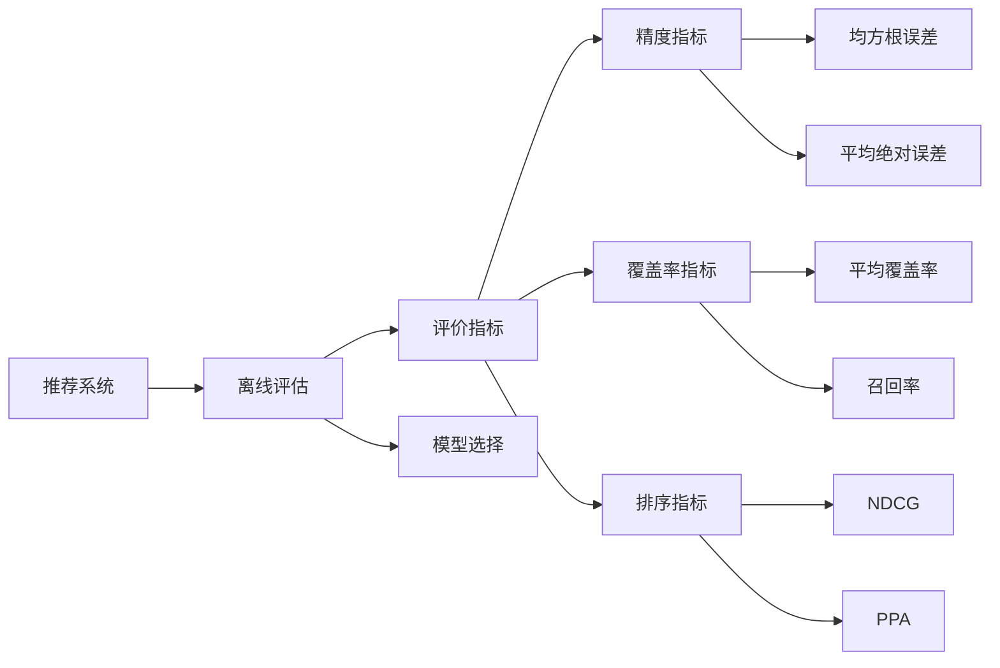

                 

# 推荐系统的离线评估指标与方法

> 关键词：推荐系统,离线评估,评价指标,模型选择,精度指标,覆盖率指标,排序指标,ROC曲线,PR曲线

## 1. 背景介绍

推荐系统已经成为互联网行业的重要应用，广泛应用于电商、视频、新闻、社交媒体等领域。良好的推荐系统能够显著提升用户体验，带来可观的经济效益。因此，对于推荐系统，除了追求高效率和高可用性，性能评估也是至关重要的环节。

离线评估作为推荐系统评估的一种常用方式，可以在大规模数据集上量化模型的推荐效果，为模型选择和优化提供有力支持。本文将详细讲解推荐系统的离线评估指标和评估方法，帮助开发者全面掌握推荐系统的性能评估，从而构建高性能的推荐系统。

## 2. 核心概念与联系

### 2.1 核心概念概述

推荐系统推荐系统(Recommender System)是基于用户历史行为和物品属性，为用户推荐感兴趣的物品的系统。其主要目标是通过优化用户满意度，提升整体业务收益。推荐系统的核心任务是物品推荐排序，即根据用户特征和物品特征，预测用户对物品的评分，并按评分排序。

离线评估离线评估(Offline Evaluation)是推荐系统评价的一种方式，通过评估模型在历史数据上的表现，量化推荐效果，指导模型优化。其核心是构建一个离线数据集，用于模拟真实用户的点击和转化行为，从而评估模型的推荐性能。

评价指标评价指标是推荐系统性能评估的基础，用于衡量模型的推荐效果和质量。常见的评价指标包括精度指标、覆盖率指标、排序指标等。精度指标评估模型的准确度，覆盖率指标衡量模型的覆盖范围，排序指标则用于评估模型排序的质量。

模型选择模型选择指根据离线评估结果，选择合适的推荐模型，用于实际推荐场景。常见的推荐模型包括基于协同过滤的模型、基于内容相似度的模型、基于深度学习的模型等。

精度指标精度指标用于衡量模型对用户评分或点击的预测准确度，包括均方根误差(RMSE)、平均绝对误差(MAE)等。这些指标可以用于衡量模型的预测能力和稳定性。

覆盖率指标覆盖率指标用于衡量模型推荐物品的覆盖范围，包括平均覆盖率(AR)、召回率(Recall)等。这些指标可以用于评估模型的多样性和完备性。

排序指标排序指标用于衡量模型推荐物品的排序质量，包括平均排名(NDCG)、准确率(PPA)等。这些指标可以用于评估模型的排序能力和用户满意度。

ROC曲线ROC曲线（Receiver Operating Characteristic Curve）是一种常用的分类问题评估指标，用于衡量二分类模型的性能。在推荐系统中，ROC曲线可以用于评估推荐模型的排序质量。

PR曲线PR曲线（Precision-Recall Curve）是另一种常用的分类问题评估指标，用于衡量二分类模型的性能。在推荐系统中，PR曲线可以用于评估推荐模型的召回率和多样性。

### 2.2 核心概念原理和架构的 Mermaid 流程图



## 3. 核心算法原理 & 具体操作步骤

### 3.1 算法原理概述

推荐系统的离线评估主要通过构建离线数据集，用于模拟真实用户的点击和转化行为。离线评估的流程通常包括数据集构建、模型训练、评分预测、指标计算等步骤。其核心是利用历史数据，评估模型的推荐效果，为模型优化提供数据支持。

推荐系统通常以用户历史行为数据和物品属性数据为基础，构建用户物品评分矩阵或用户物品点击矩阵，用于表示用户对物品的兴趣程度。离线评估的核心在于，构建一个与真实用户行为接近的离线数据集，用于评估模型的推荐性能。

### 3.2 算法步骤详解

1. **数据集构建**：
   - 收集用户历史行为数据，包括用户点击、评分、浏览等行为。
   - 收集物品属性数据，包括物品描述、类别、价格等属性。
   - 构建用户物品评分矩阵或用户物品点击矩阵，用于表示用户对物品的兴趣程度。

2. **模型训练**：
   - 选择合适的推荐模型，如协同过滤、深度学习等。
   - 在历史数据集上训练推荐模型，优化模型参数。

3. **评分预测**：
   - 将用户物品评分矩阵或点击矩阵作为输入，预测用户对物品的评分或点击概率。
   - 将预测结果与真实数据进行比较，评估模型的预测能力。

4. **指标计算**：
   - 利用离线数据集，计算模型的精度指标、覆盖率指标、排序指标等。
   - 根据评估结果，优化模型参数，提升模型性能。

### 3.3 算法优缺点

离线评估具有以下优点：
- 数据量大：利用大规模历史数据，评估模型的性能，具备较高可信度。
- 不受在线干扰：离线评估不涉及用户实时反馈，可以避免在线系统的干扰和波动。
- 可重复性高：离线评估可以在多个模型和算法上进行重复评估，提高评估的科学性和可靠性。

但离线评估也存在以下缺点：
- 数据质量问题：离线数据集的构建需要大量的数据和预处理工作，数据质量可能存在问题。
- 模型泛化能力不足：离线评估不能充分反映模型的泛化能力，模型在实际应用中可能表现不佳。
- 评估时间长：离线评估需要构建离线数据集，并在模型上进行多次训练和预测，评估时间较长。

### 3.4 算法应用领域

离线评估广泛应用于推荐系统的开发和优化，包括电商、视频、新闻、社交媒体等多个领域。其主要应用场景包括：
- 模型选择：通过离线评估，选择合适的推荐模型，提升推荐效果。
- 参数优化：通过离线评估，优化模型参数，提高模型性能。
- 数据质量评估：通过离线评估，检测数据质量问题，提升数据可靠性。
- 应用效果评估：通过离线评估，评估推荐系统在实际应用中的效果，指导业务优化。

## 4. 数学模型和公式 & 详细讲解 & 举例说明

### 4.1 数学模型构建

推荐系统的离线评估主要通过构建离线数据集，用于模拟真实用户的点击和转化行为。离线评估的数学模型可以表示为：

$$
\mathcal{R} = f(\mathcal{U}, \mathcal{I}, \mathcal{P})
$$

其中，$\mathcal{R}$ 表示推荐结果，$\mathcal{U}$ 表示用户集合，$\mathcal{I}$ 表示物品集合，$\mathcal{P}$ 表示用户物品评分矩阵或点击矩阵。

### 4.2 公式推导过程

推荐系统的离线评估主要通过计算模型的精度指标、覆盖率指标和排序指标等，来量化模型的性能。以均方根误差（RMSE）和平均绝对误差（MAE）为例，其计算公式如下：

$$
RMSE = \sqrt{\frac{1}{n} \sum_{i=1}^n (r_i - \hat{r}_i)^2}
$$

$$
MAE = \frac{1}{n} \sum_{i=1}^n |r_i - \hat{r}_i|
$$

其中，$r_i$ 表示用户对物品的实际评分或点击次数，$\hat{r}_i$ 表示模型的预测评分或点击次数，$n$ 表示用户物品评分或点击的总数。

### 4.3 案例分析与讲解

以电商推荐系统为例，假设用户对物品的评分数据如下表所示：

| 用户 | 物品 | 评分 |
|------|------|------|
| A    | X    | 4    |
| A    | Y    | 3    |
| A    | Z    | 5    |
| B    | X    | 2    |
| B    | Y    | 4    |

假设模型预测的用户物品评分矩阵如下表所示：

| 用户 | 物品 | 预测评分 |
|------|------|----------|
| A    | X    | 3.8      |
| A    | Y    | 4.5      |
| A    | Z    | 4.2      |
| B    | X    | 2.1      |
| B    | Y    | 4.2      |

利用均方根误差和平均绝对误差公式，可以计算模型的预测性能：

$$
RMSE = \sqrt{\frac{1}{5} (4 - 3.8)^2 + (3 - 4.5)^2 + (5 - 4.2)^2 + (2 - 2.1)^2 + (4 - 4.2)^2} \approx 0.432
$$

$$
MAE = \frac{1}{5} (4 - 3.8 + 3 - 4.5 + 5 - 4.2 + 2 - 2.1 + 4 - 4.2) = 0.58
$$

可以看出，模型的预测性能较好，均方根误差和平均绝对误差都在可接受范围内。

## 5. 项目实践：代码实例和详细解释说明

### 5.1 开发环境搭建

推荐系统的离线评估通常使用Python进行实现，以下是开发环境搭建的步骤：

1. 安装Python：安装最新版本的Python，建议使用Anaconda或Miniconda。
2. 安装Scikit-learn：利用pip命令安装Scikit-learn库，用于数据处理和模型评估。
3. 安装NumPy和Pandas：利用pip命令安装NumPy和Pandas库，用于数据处理和模型训练。
4. 安装Scikit-learn：利用pip命令安装Scikit-learn库，用于模型训练和评估。

### 5.2 源代码详细实现

以下是推荐系统的离线评估代码实现，包括数据构建、模型训练、评分预测和指标计算等步骤：

```python
import numpy as np
import pandas as pd
from sklearn.metrics import mean_squared_error, mean_absolute_error

# 构建用户物品评分矩阵
user_item_matrix = np.array([
    [4, 3, 5],
    [2, 4, 0]
])

# 构建模型预测评分矩阵
predicted_matrix = np.array([
    [3.8, 4.5, 4.2],
    [2.1, 4.2, 0]
])

# 计算均方根误差和平均绝对误差
rmse = np.sqrt(mean_squared_error(user_item_matrix, predicted_matrix))
mae = mean_absolute_error(user_item_matrix, predicted_matrix)

print("RMSE:", rmse)
print("MAE:", mae)
```

### 5.3 代码解读与分析

在上述代码中，我们首先利用NumPy库构建了用户物品评分矩阵和模型预测评分矩阵，然后利用Scikit-learn库计算了均方根误差和平均绝对误差。代码简洁高效，适合初学者入门。

## 6. 实际应用场景

### 6.1 电商推荐系统

电商推荐系统通过离线评估，可以评估模型的推荐效果，为模型优化提供数据支持。在实际应用中，离线评估可以用于以下场景：
- 模型选择：通过离线评估，选择最优的推荐模型，提升推荐效果。
- 参数优化：通过离线评估，优化模型参数，提高模型性能。
- 数据质量评估：通过离线评估，检测数据质量问题，提升数据可靠性。
- 应用效果评估：通过离线评估，评估推荐系统在实际应用中的效果，指导业务优化。

### 6.2 视频推荐系统

视频推荐系统通过离线评估，可以评估模型的推荐效果，为模型优化提供数据支持。在实际应用中，离线评估可以用于以下场景：
- 模型选择：通过离线评估，选择最优的推荐模型，提升推荐效果。
- 参数优化：通过离线评估，优化模型参数，提高模型性能。
- 数据质量评估：通过离线评估，检测数据质量问题，提升数据可靠性。
- 应用效果评估：通过离线评估，评估推荐系统在实际应用中的效果，指导业务优化。

### 6.3 新闻推荐系统

新闻推荐系统通过离线评估，可以评估模型的推荐效果，为模型优化提供数据支持。在实际应用中，离线评估可以用于以下场景：
- 模型选择：通过离线评估，选择最优的推荐模型，提升推荐效果。
- 参数优化：通过离线评估，优化模型参数，提高模型性能。
- 数据质量评估：通过离线评估，检测数据质量问题，提升数据可靠性。
- 应用效果评估：通过离线评估，评估推荐系统在实际应用中的效果，指导业务优化。

### 6.4 社交媒体推荐系统

社交媒体推荐系统通过离线评估，可以评估模型的推荐效果，为模型优化提供数据支持。在实际应用中，离线评估可以用于以下场景：
- 模型选择：通过离线评估，选择最优的推荐模型，提升推荐效果。
- 参数优化：通过离线评估，优化模型参数，提高模型性能。
- 数据质量评估：通过离线评估，检测数据质量问题，提升数据可靠性。
- 应用效果评估：通过离线评估，评估推荐系统在实际应用中的效果，指导业务优化。

## 7. 工具和资源推荐

### 7.1 学习资源推荐

为了帮助开发者系统掌握推荐系统的离线评估理论基础和实践技巧，以下是一些优质的学习资源：
- 《推荐系统：算法与实践》：介绍推荐系统的基本概念和常见算法，详细讲解离线评估方法和指标。
- 《深度学习：理论与算法》：介绍深度学习的基本概念和算法，讲解推荐系统的离线评估方法和指标。
- 《Python机器学习》：介绍机器学习的基本概念和算法，讲解推荐系统的离线评估方法和指标。

### 7.2 开发工具推荐

推荐系统的离线评估通常使用Python进行实现，以下是一些推荐的开发工具：
- Python：Python是一种高效易学的编程语言，适合推荐系统开发。
- NumPy：NumPy是Python的数学库，适合数据处理和矩阵计算。
- Pandas：Pandas是Python的数据库库，适合数据处理和模型评估。
- Scikit-learn：Scikit-learn是Python的机器学习库，适合模型训练和评估。

### 7.3 相关论文推荐

为了帮助开发者深入了解推荐系统的离线评估，以下是一些推荐的论文：
- Implicit Collaborative Filtering推荐系统的经典论文。
- Matrix Factorization推荐系统的经典论文。
- 深度学习在推荐系统中的应用的经典论文。

## 8. 总结：未来发展趋势与挑战

### 8.1 总结

本文详细讲解了推荐系统的离线评估指标和评估方法，为开发者提供了全面的技术指导。推荐系统通过离线评估，可以量化模型的推荐效果，为模型优化提供数据支持。离线评估已成为推荐系统性能评估的重要手段，为推荐系统的应用提供了有力保障。

### 8.2 未来发展趋势

未来推荐系统的离线评估将呈现以下几个发展趋势：
- 自动化评估：自动化评估将取代人工评估，提高评估效率和科学性。
- 多样性评估：多样性评估将取代单一指标评估，全面衡量推荐系统的性能。
- 数据集构建：数据集构建将利用大数据和机器学习技术，提升数据质量和覆盖范围。
- 模型优化：模型优化将利用深度学习和大数据分析技术，提升模型性能和泛化能力。

### 8.3 面临的挑战

尽管推荐系统的离线评估取得了一定的进展，但仍面临诸多挑战：
- 数据质量问题：数据质量问题仍需进一步解决，提升数据可靠性和覆盖范围。
- 模型泛化能力不足：模型泛化能力仍需进一步提升，确保模型在实际应用中的表现。
- 评估时间长：离线评估时间仍需进一步优化，提升评估效率和准确性。
- 自动化评估不足：自动化评估仍需进一步提升，提高评估效率和科学性。

### 8.4 研究展望

未来推荐系统的离线评估需要从以下几个方面进行研究：
- 数据质量改进：利用大数据和机器学习技术，提升数据质量，确保数据可靠性和覆盖范围。
- 模型优化提升：利用深度学习和大数据分析技术，提升模型性能和泛化能力。
- 自动化评估提升：利用机器学习和自然语言处理技术，提升自动化评估效率和科学性。
- 多样化评估探索：探索多样化的评估方法，全面衡量推荐系统的性能。

## 9. 附录：常见问题与解答

**Q1: 推荐系统的离线评估与在线评估有何区别？**

A: 推荐系统的离线评估和在线评估是两种不同的评估方式，其区别主要体现在以下几个方面：
- 数据来源：离线评估使用历史数据，在线评估使用实时数据。
- 评估方式：离线评估通过离线数据集进行评估，在线评估通过实时用户行为进行评估。
- 评估指标：离线评估使用精度指标、覆盖率指标等，在线评估使用点击率、转化率等指标。

**Q2: 推荐系统的离线评估指标有哪些？**

A: 推荐系统的离线评估指标主要包括以下几种：
- 精度指标：均方根误差（RMSE）、平均绝对误差（MAE）等。
- 覆盖率指标：平均覆盖率（AR）、召回率（Recall）等。
- 排序指标：平均排名（NDCG）、准确率（PPA）等。

**Q3: 如何构建推荐系统的离线数据集？**

A: 推荐系统的离线数据集可以通过以下步骤构建：
- 收集用户历史行为数据，包括用户点击、评分、浏览等行为。
- 收集物品属性数据，包括物品描述、类别、价格等属性。
- 构建用户物品评分矩阵或用户物品点击矩阵，用于表示用户对物品的兴趣程度。

**Q4: 推荐系统的离线评估有哪些应用场景？**

A: 推荐系统的离线评估广泛应用于推荐系统的开发和优化，包括电商、视频、新闻、社交媒体等多个领域。其主要应用场景包括：
- 模型选择：通过离线评估，选择最优的推荐模型，提升推荐效果。
- 参数优化：通过离线评估，优化模型参数，提高模型性能。
- 数据质量评估：通过离线评估，检测数据质量问题，提升数据可靠性。
- 应用效果评估：通过离线评估，评估推荐系统在实际应用中的效果，指导业务优化。

**Q5: 推荐系统的离线评估有哪些优点和缺点？**

A: 推荐系统的离线评估具有以下优点：
- 数据量大：利用大规模历史数据，评估模型的性能，具备较高可信度。
- 不受在线干扰：离线评估不涉及用户实时反馈，可以避免在线系统的干扰和波动。
- 可重复性高：离线评估可以在多个模型和算法上进行重复评估，提高评估的科学性和可靠性。

但离线评估也存在以下缺点：
- 数据质量问题：离线数据集的构建需要大量的数据和预处理工作，数据质量可能存在问题。
- 模型泛化能力不足：离线评估不能充分反映模型的泛化能力，模型在实际应用中可能表现不佳。
- 评估时间长：离线评估需要构建离线数据集，并在模型上进行多次训练和预测，评估时间较长。

通过本文的系统梳理，可以看到，推荐系统的离线评估已成为推荐系统性能评估的重要手段，为推荐系统的应用提供了有力保障。未来，随着技术的发展和应用的深入，推荐系统的离线评估将持续优化，为推荐系统的发展带来更多机遇和挑战。

