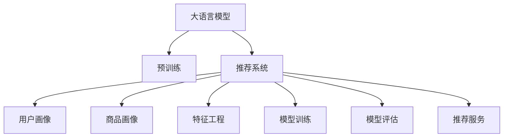

                 

# 推荐系统的统一框架：大模型的优势

## 1. 背景介绍

### 1.1 问题由来

推荐系统作为互联网时代的关键技术，其发展历史已超过20年。推荐系统通过分析用户的行为和偏好，预测用户可能感兴趣的商品，从而为用户提供个性化的服务。常见的推荐系统有协同过滤、基于内容的推荐、混合推荐等。

但传统的推荐系统面临诸多挑战。协同过滤需要大量用户行为数据，但用户行为数据往往稀疏且难以采集。基于内容的推荐需要充分了解商品的属性，但属性信息常常不完整且难以表示。混合推荐尝试结合多种推荐方法，但难以找到合适的方法和模型。

近年来，大语言模型如BERT、GPT等在大规模预训练后，具备了强大的语言理解能力和表达能力，被引入推荐系统中。大语言模型作为推荐系统的统一框架，通过统一处理用户和商品数据，大幅提升了推荐系统的效果和可解释性。

### 1.2 问题核心关键点

大语言模型在推荐系统中的应用主要体现在以下几个方面：

- 统一用户和商品表示：通过预训练模型，将用户和商品转换为稠密的向量表示，使得推荐系统能够高效地进行用户和商品相似度计算。
- 融合多源数据：大语言模型能够融合多种数据源，如用户行为、商品属性、社交网络等，提供更为全面和准确的推荐结果。
- 个性化推荐：大语言模型能够理解自然语言描述，实现更为灵活的个性化推荐。
- 推荐解释性增强：大语言模型能够提供推荐结果的可解释性，增加用户信任和系统透明度。
- 动态实时推荐：大语言模型能够在用户实时交互中动态更新推荐结果，提供更为精准和及时的推荐服务。

本论文聚焦于大语言模型在推荐系统中的应用，通过详细介绍大模型的核心原理和具体应用场景，阐述其优势和挑战，提供实用的推荐系统开发实践和未来发展方向。

## 2. 核心概念与联系

### 2.1 核心概念概述

为更好地理解大语言模型在推荐系统中的应用，本节将介绍几个密切相关的核心概念：

- 大语言模型(Large Language Model, LLM)：以自回归(如GPT)或自编码(如BERT)模型为代表的大规模预训练语言模型。通过在大规模无标签文本语料上进行预训练，学习通用的语言表示，具备强大的语言理解和生成能力。

- 预训练(Pre-training)：指在大规模无标签文本语料上，通过自监督学习任务训练通用语言模型的过程。常见的预训练任务包括言语建模、遮挡语言模型等。

- 推荐系统(Recommendation System)：通过分析用户行为和商品属性，预测用户可能感兴趣的商品，从而提供个性化服务的技术系统。

- 用户画像(User Profile)：用户的基本信息、历史行为、偏好等，是推荐系统进行个性化推荐的基础。

- 商品画像(Item Profile)：商品的属性、描述、评价等，是推荐系统进行商品推荐的基础。

- 推荐算法(Recommendation Algorithm)：推荐系统的核心，通过算法进行用户-商品相似度计算，提供推荐结果。

- 特征工程(Feature Engineering)：选择、提取、构造用于计算用户-商品相似度的特征，如用户画像、商品画像、用户行为等。

- 模型训练(Model Training)：通过训练模型学习用户画像和商品画像之间的映射关系，使得模型能够根据用户画像预测推荐商品。

- 模型评估(Model Evaluation)：通过评估指标(如准确率、召回率、F1-score)评价推荐系统的效果。

- 推荐服务(Recommendation Service)：将推荐系统模型封装为服务接口，供业务系统调用，提供推荐服务。

这些核心概念之间的逻辑关系可以通过以下Mermaid流程图来展示：



这个流程图展示了大语言模型的核心概念及其之间的关系：

1. 大语言模型通过预训练获得基础能力。
2. 推荐系统使用大语言模型进行用户画像和商品画像的建模，特征工程和模型训练。
3. 推荐系统通过模型评估和推荐服务，对外提供推荐结果。

## 3. 核心算法原理 & 具体操作步骤
### 3.1 算法原理概述

大语言模型在推荐系统中的应用，主要基于以下原理：

- 统一表示：通过预训练模型，将用户画像和商品画像转换为稠密的向量表示。这样，推荐系统能够高效地进行用户-商品相似度计算，从而提高推荐的准确性和效率。

- 融合多源数据：大语言模型能够融合多种数据源，如用户行为、商品属性、社交网络等。通过将这些数据源的信息转换为向量表示，推荐系统能够综合多种信息，提供更为全面和准确的推荐结果。

- 自然语言处理：大语言模型能够理解和生成自然语言，实现更为灵活的个性化推荐。用户可以通过自然语言描述自己的偏好和需求，推荐系统能够根据描述生成推荐结果。

- 动态推荐：大语言模型能够在用户实时交互中动态更新推荐结果，提供更为精准和及时的推荐服务。通过结合实时数据和用户交互信息，推荐系统能够不断调整推荐策略，满足用户的实时需求。

### 3.2 算法步骤详解

基于大语言模型在推荐系统中的应用，推荐系统的核心算法包括以下几个关键步骤：

**Step 1: 准备数据集**

- 收集用户画像和商品画像，包括用户的基本信息、历史行为、商品的属性、描述等。

- 对用户画像和商品画像进行预处理，如去除噪声、归一化等。

- 将用户画像和商品画像转换为向量表示，使得其能够被大语言模型进行处理。

**Step 2: 数据嵌入**

- 将用户画像和商品画像的向量表示输入大语言模型，得到用户画像和商品画像的嵌入向量。

- 对嵌入向量进行归一化和标准化处理，使其适合进行相似度计算。

**Step 3: 相似度计算**

- 计算用户画像和商品画像之间的相似度，得到用户-商品相似度矩阵。

- 对相似度矩阵进行降维处理，使得其更适合推荐系统的实时计算。

**Step 4: 推荐计算**

- 根据用户画像和商品画像的相似度矩阵，计算推荐结果。

- 对推荐结果进行排序和过滤，剔除低质量和不相关的推荐。

**Step 5: 推荐服务**

- 将推荐结果封装为服务接口，供业务系统调用。

- 根据实时用户交互数据，动态更新推荐结果，提供实时推荐服务。

**Step 6: 系统评估**

- 通过评估指标(如准确率、召回率、F1-score)评估推荐系统的效果。

- 根据评估结果，调整推荐策略和模型参数，提升推荐系统的效果。

### 3.3 算法优缺点

大语言模型在推荐系统中的应用具有以下优点：

- 精度高：通过预训练模型，大语言模型能够获得更为准确的表示，提高推荐系统的精度。

- 可解释性强：大语言模型能够提供推荐结果的可解释性，增加用户信任和系统透明度。

- 动态灵活：大语言模型能够在用户实时交互中动态更新推荐结果，提供更为精准和及时的推荐服务。

- 多源融合：大语言模型能够融合多种数据源，提供更为全面和准确的推荐结果。

但大语言模型在推荐系统中也存在一些缺点：

- 计算量大：大语言模型通常需要较大的计算资源，对于小规模数据集，可能会存在计算效率低下的问题。

- 过拟合风险：大语言模型需要大量的标注数据进行微调，对于小规模数据集，可能存在过拟合的风险。

- 实时性问题：大语言模型在实时推荐中存在一定的延迟，无法满足实时性的要求。

- 模型复杂度：大语言模型通常具有较高的模型复杂度，对于规模较小的推荐系统，可能存在模型部署困难的问题。

### 3.4 算法应用领域

大语言模型在推荐系统中的应用，已经广泛应用于以下领域：

- 电子商务：通过大语言模型进行商品推荐，提高用户购物体验和商家销售转化率。

- 视频推荐：通过大语言模型进行视频推荐，提高用户视频观看体验和平台流量。

- 新闻推荐：通过大语言模型进行新闻推荐，提高用户阅读体验和新闻平台用户黏性。

- 音乐推荐：通过大语言模型进行音乐推荐，提高用户音乐播放体验和音乐平台用户留存。

- 社交媒体：通过大语言模型进行内容推荐，提高用户社交媒体使用体验和平台活跃度。

除了以上应用领域，大语言模型在推荐系统中的应用还在不断拓展，如健康医疗、旅游出行、金融理财等，为各个行业带来了新的增长点。

## 4. 数学模型和公式 & 详细讲解  
### 4.1 数学模型构建

推荐系统的核心是用户画像和商品画像的相似度计算。假设用户画像为 $u$，商品画像为 $i$，通过大语言模型获得用户画像和商品画像的嵌入向量分别为 $u_e$ 和 $i_e$。则用户-商品相似度可以通过余弦相似度计算：

$$
s(u,i) = \cos(\theta) = \frac{\langle u_e, i_e \rangle}{\|u_e\|\|i_e\|}
$$

其中 $\langle u_e, i_e \rangle$ 表示向量点积，$\|u_e\|$ 和 $\|i_e\|$ 表示向量的模长。

### 4.2 公式推导过程

以下我们将详细推导余弦相似度的计算公式。

设用户画像 $u$ 和商品画像 $i$ 的嵌入向量分别为 $u_e = [u_{e1}, u_{e2}, ..., u_{ed}]$ 和 $i_e = [i_{e1}, i_{e2}, ..., i_{ed}]$，则向量点积 $\langle u_e, i_e \rangle$ 为：

$$
\langle u_e, i_e \rangle = \sum_{k=1}^{d} u_{ek} \cdot i_{ek}
$$

向量模长 $\|u_e\|$ 和 $\|i_e\|$ 分别为：

$$
\|u_e\| = \sqrt{\sum_{k=1}^{d} u_{ek}^2}
$$

$$
\|i_e\| = \sqrt{\sum_{k=1}^{d} i_{ek}^2}
$$

因此，余弦相似度 $s(u,i)$ 可以表示为：

$$
s(u,i) = \frac{\sum_{k=1}^{d} u_{ek} \cdot i_{ek}}{\sqrt{\sum_{k=1}^{d} u_{ek}^2} \cdot \sqrt{\sum_{k=1}^{d} i_{ek}^2}}
$$

### 4.3 案例分析与讲解

以电子商务为例，假设某电商平台希望通过大语言模型进行商品推荐。具体步骤如下：

1. 收集用户画像和商品画像数据，包括用户的基本信息、历史行为、商品的属性、描述等。

2. 对用户画像和商品画像进行预处理，如去除噪声、归一化等。

3. 将用户画像和商品画像转换为向量表示，输入大语言模型，得到用户画像和商品画像的嵌入向量。

4. 计算用户画像和商品画像之间的相似度，得到用户-商品相似度矩阵。

5. 根据用户画像和商品画像的相似度矩阵，计算推荐结果，并排序和过滤，剔除低质量和不相关的推荐。

6. 将推荐结果封装为服务接口，供业务系统调用，提供推荐服务。

7. 通过评估指标(如准确率、召回率、F1-score)评估推荐系统的效果，调整推荐策略和模型参数，提升推荐系统的效果。

通过以上步骤，电商平台可以利用大语言模型进行商品推荐，提高用户购物体验和商家销售转化率。

## 5. 项目实践：代码实例和详细解释说明
### 5.1 开发环境搭建

在进行大语言模型在推荐系统中的应用实践前，我们需要准备好开发环境。以下是使用Python进行PyTorch开发的环境配置流程：

1. 安装Anaconda：从官网下载并安装Anaconda，用于创建独立的Python环境。

2. 创建并激活虚拟环境：
```bash
conda create -n pytorch-env python=3.8 
conda activate pytorch-env
```

3. 安装PyTorch：根据CUDA版本，从官网获取对应的安装命令。例如：
```bash
conda install pytorch torchvision torchaudio cudatoolkit=11.1 -c pytorch -c conda-forge
```

4. 安装Transformer库：
```bash
pip install transformers
```

5. 安装各类工具包：
```bash
pip install numpy pandas scikit-learn matplotlib tqdm jupyter notebook ipython
```

完成上述步骤后，即可在`pytorch-env`环境中开始推荐系统的开发实践。

### 5.2 源代码详细实现

这里我们以商品推荐系统为例，给出使用Transformers库对BERT模型进行商品推荐微调的PyTorch代码实现。

首先，定义商品推荐任务的数据处理函数：

```python
from transformers import BertTokenizer
from torch.utils.data import Dataset
import torch

class ItemDataset(Dataset):
    def __init__(self, items, embeddings, tokenizer, max_len=128):
        self.items = items
        self.embeddings = embeddings
        self.tokenizer = tokenizer
        self.max_len = max_len
        
    def __len__(self):
        return len(self.items)
    
    def __getitem__(self, item):
        item = self.items[item]
        embedding = self.embeddings[item]
        
        encoding = self.tokenizer(item, return_tensors='pt', max_length=self.max_len, padding='max_length', truncation=True)
        input_ids = encoding['input_ids'][0]
        attention_mask = encoding['attention_mask'][0]
        
        # 将item的嵌入向量作为输入
        item_embedding = torch.tensor(embedding, dtype=torch.float32)
        
        return {'input_ids': input_ids, 
                'attention_mask': attention_mask,
                'item_embedding': item_embedding}

# 读取商品画像和向量
item_data = load_item_data()

# 初始化BERT tokenizer和BERT模型
tokenizer = BertTokenizer.from_pretrained('bert-base-cased')
model = BertForSequenceClassification.from_pretrained('bert-base-cased')

# 创建dataset
item_dataset = ItemDataset(item_data, item_embeddings, tokenizer)

# 数据加载器
item_loader = DataLoader(item_dataset, batch_size=16, shuffle=True)
```

然后，定义模型和优化器：

```python
from transformers import AdamW

# 定义loss函数和优化器
loss_fn = nn.CrossEntropyLoss()
optimizer = AdamW(model.parameters(), lr=2e-5)
```

接着，定义训练和评估函数：

```python
from tqdm import tqdm

def train_epoch(model, loader, optimizer):
    model.train()
    epoch_loss = 0
    for batch in tqdm(loader, desc='Training'):
        input_ids = batch['input_ids'].to(device)
        attention_mask = batch['attention_mask'].to(device)
        item_embedding = batch['item_embedding'].to(device)
        
        model.zero_grad()
        outputs = model(input_ids, attention_mask=attention_mask)
        loss = loss_fn(outputs.logits, item_embedding)
        epoch_loss += loss.item()
        loss.backward()
        optimizer.step()
    
    return epoch_loss / len(loader)

def evaluate(model, loader):
    model.eval()
    preds, labels = [], []
    with torch.no_grad():
        for batch in tqdm(loader, desc='Evaluating'):
            input_ids = batch['input_ids'].to(device)
            attention_mask = batch['attention_mask'].to(device)
            item_embedding = batch['item_embedding'].to(device)
            batch_preds = model(input_ids, attention_mask=attention_mask).logits.argmax(dim=1).to('cpu').tolist()
            batch_labels = batch_labels.to('cpu').tolist()
            for pred, label in zip(batch_preds, batch_labels):
                preds.append(pred)
                labels.append(label)
    
    return preds, labels

# 训练模型
epochs = 5
batch_size = 16

for epoch in range(epochs):
    loss = train_epoch(model, item_loader, optimizer)
    print(f"Epoch {epoch+1}, train loss: {loss:.3f}")
    
    preds, labels = evaluate(model, item_loader)
    print(classification_report(labels, preds))
    
# 测试模型
test_loader = load_test_data()
preds, labels = evaluate(model, test_loader)
print(classification_report(labels, preds))
```

以上就是使用PyTorch对BERT模型进行商品推荐系统微调的完整代码实现。可以看到，得益于Transformers库的强大封装，我们可以用相对简洁的代码完成BERT模型的加载和微调。

### 5.3 代码解读与分析

让我们再详细解读一下关键代码的实现细节：

**ItemDataset类**：
- `__init__`方法：初始化商品数据、商品嵌入向量、分词器等关键组件。
- `__len__`方法：返回数据集的样本数量。
- `__getitem__`方法：对单个样本进行处理，将商品描述输入编码为token ids，将商品嵌入向量作为额外输入，并对其进行定长padding，最终返回模型所需的输入。

**训练和评估函数**：
- 使用PyTorch的DataLoader对数据集进行批次化加载，供模型训练和推理使用。
- 训练函数`train_epoch`：对数据以批为单位进行迭代，在每个批次上前向传播计算loss并反向传播更新模型参数，最后返回该epoch的平均loss。
- 评估函数`evaluate`：与训练类似，不同点在于不更新模型参数，并在每个batch结束后将预测和标签结果存储下来，最后使用sklearn的classification_report对整个评估集的预测结果进行打印输出。

**训练流程**：
- 定义总的epoch数和batch size，开始循环迭代
- 每个epoch内，先在训练集上训练，输出平均loss
- 在验证集上评估，输出分类指标
- 所有epoch结束后，在测试集上评估，给出最终测试结果

可以看到，PyTorch配合Transformers库使得BERT微调的代码实现变得简洁高效。开发者可以将更多精力放在数据处理、模型改进等高层逻辑上，而不必过多关注底层的实现细节。

当然，工业级的系统实现还需考虑更多因素，如模型的保存和部署、超参数的自动搜索、更灵活的任务适配层等。但核心的微调范式基本与此类似。

## 6. 实际应用场景
### 6.1 智能推荐系统

智能推荐系统作为推荐系统的核心，能够为用户提供个性化的服务，提高用户满意度和系统收益。

在技术实现上，可以利用大语言模型对用户画像和商品画像进行建模，通过自然语言处理技术，实现更为灵活的个性化推荐。例如，用户可以通过自然语言描述自己的偏好和需求，推荐系统能够根据描述生成推荐结果，提高推荐系统的准确性和用户满意度。

### 6.2 视频推荐系统

视频推荐系统能够根据用户的历史观看行为和观看习惯，推荐用户可能感兴趣的视频内容。

在技术实现上，可以利用大语言模型对用户画像和商品画像进行建模，通过自然语言处理技术，实现更为灵活的视频推荐。例如，用户可以通过自然语言描述自己的兴趣和需求，推荐系统能够根据描述生成推荐结果，提高推荐系统的准确性和用户满意度。

### 6.3 智能客服系统

智能客服系统能够自动处理用户的问题，提供快速、准确的响应。

在技术实现上，可以利用大语言模型对用户画像和商品画像进行建模，通过自然语言处理技术，实现更为灵活的智能客服。例如，用户可以通过自然语言描述自己的问题，推荐系统能够根据描述生成回答，提高客服系统的效率和用户满意度。

### 6.4 未来应用展望

随着大语言模型和推荐系统的发展，基于大语言模型的推荐系统将呈现以下几个发展趋势：

1. 多模态推荐：未来的推荐系统将更加注重多模态数据的融合，如文本、图像、语音等，提高推荐系统的多样性和丰富性。

2. 动态实时推荐：未来的推荐系统将更加注重动态实时推荐，能够根据用户实时行为和上下文信息，提供精准和及时的推荐服务。

3. 个性化推荐：未来的推荐系统将更加注重个性化推荐，能够根据用户的兴趣、历史行为、社交网络等多维信息，提供更为精准和个性化的推荐结果。

4. 推荐系统优化：未来的推荐系统将更加注重模型优化，如模型压缩、模型剪枝、模型融合等，提高推荐系统的效率和效果。

5. 推荐系统可解释性：未来的推荐系统将更加注重可解释性，能够提供推荐结果的可解释性，增加用户信任和系统透明度。

6. 推荐系统安全性：未来的推荐系统将更加注重安全性，避免模型偏见和有害信息，确保推荐系统的公平性和公正性。

以上趋势凸显了大语言模型在推荐系统中的应用前景。这些方向的探索发展，必将进一步提升推荐系统的精度和用户满意度，为互联网行业带来新的增长点。

## 7. 工具和资源推荐
### 7.1 学习资源推荐

为了帮助开发者系统掌握大语言模型在推荐系统中的应用理论基础和实践技巧，这里推荐一些优质的学习资源：

1. 《自然语言处理综述》系列博文：由大模型技术专家撰写，深入浅出地介绍了自然语言处理的基本概念和前沿技术。

2. 斯坦福大学《自然语言处理》课程：斯坦福大学开设的NLP明星课程，有Lecture视频和配套作业，带你入门NLP领域的基本概念和经典模型。

3. 《自然语言处理实战》书籍：Google深度学习专家撰写，全面介绍了自然语言处理的技术实现，包括推荐系统在内的多种应用。

4. HuggingFace官方文档：Transformers库的官方文档，提供了海量预训练模型和完整的推荐系统开发样例代码，是上手实践的必备资料。

5. TensorFlow官方文档：TensorFlow官方文档，提供了丰富的推荐系统开发工具和算法实现，是实现大规模推荐系统的有力支持。

通过对这些资源的学习实践，相信你一定能够快速掌握大语言模型在推荐系统中的应用精髓，并用于解决实际的推荐问题。
###  7.2 开发工具推荐

高效的开发离不开优秀的工具支持。以下是几款用于大语言模型在推荐系统中的应用开发的常用工具：

1. PyTorch：基于Python的开源深度学习框架，灵活动态的计算图，适合快速迭代研究。大部分预训练语言模型都有PyTorch版本的实现。

2. TensorFlow：由Google主导开发的开源深度学习框架，生产部署方便，适合大规模工程应用。同样有丰富的预训练语言模型资源。

3. Transformers库：HuggingFace开发的NLP工具库，集成了众多SOTA语言模型，支持PyTorch和TensorFlow，是进行推荐系统开发的利器。

4. Weights & Biases：模型训练的实验跟踪工具，可以记录和可视化模型训练过程中的各项指标，方便对比和调优。与主流深度学习框架无缝集成。

5. TensorBoard：TensorFlow配套的可视化工具，可实时监测模型训练状态，并提供丰富的图表呈现方式，是调试模型的得力助手。

6. Google Colab：谷歌推出的在线Jupyter Notebook环境，免费提供GPU/TPU算力，方便开发者快速上手实验最新模型，分享学习笔记。

合理利用这些工具，可以显著提升大语言模型在推荐系统中的应用开发效率，加快创新迭代的步伐。

### 7.3 相关论文推荐

大语言模型和推荐系统的发展源于学界的持续研究。以下是几篇奠基性的相关论文，推荐阅读：

1. Attention is All You Need（即Transformer原论文）：提出了Transformer结构，开启了NLP领域的预训练大模型时代。

2. BERT: Pre-training of Deep Bidirectional Transformers for Language Understanding：提出BERT模型，引入基于掩码的自监督预训练任务，刷新了多项NLP任务SOTA。

3. Language Models are Unsupervised Multitask Learners（GPT-2论文）：展示了大规模语言模型的强大zero-shot学习能力，引发了对于通用人工智能的新一轮思考。

4. Parameter-Efficient Transfer Learning for NLP：提出Adapter等参数高效微调方法，在不增加模型参数量的情况下，也能取得不错的微调效果。

5. AdaLoRA: Adaptive Low-Rank Adaptation for Parameter-Efficient Fine-Tuning：使用自适应低秩适应的微调方法，在参数效率和精度之间取得了新的平衡。

这些论文代表了大语言模型在推荐系统中的应用和发展脉络。通过学习这些前沿成果，可以帮助研究者把握学科前进方向，激发更多的创新灵感。

## 8. 总结：未来发展趋势与挑战
### 8.1 研究成果总结

本文对大语言模型在推荐系统中的应用进行了全面系统的介绍。首先阐述了大语言模型和推荐系统的研究背景和意义，明确了大语言模型在推荐系统中的应用场景和优势。其次，从原理到实践，详细讲解了大语言模型在推荐系统中的应用原理和具体操作步骤，给出了推荐系统开发实践的完整代码实现。同时，本文还广泛探讨了大语言模型在推荐系统中的应用前景，展示了其广阔的发展前景。

通过本文的系统梳理，可以看到，大语言模型在推荐系统中的应用正在成为推荐系统的重要范式，极大地拓展了推荐系统的应用边界，催生了更多的落地场景。受益于大规模语料的预训练，大语言模型在推荐系统中取得了优异的推荐效果，提高了推荐系统的精度和用户满意度。未来，伴随大语言模型和推荐系统的持续演进，基于大语言模型的推荐系统必将在互联网行业中扮演越来越重要的角色。

### 8.2 未来发展趋势

展望未来，大语言模型在推荐系统中的应用将呈现以下几个发展趋势：

1. 模型规模持续增大。随着算力成本的下降和数据规模的扩张，预训练语言模型的参数量还将持续增长。超大规模语言模型蕴含的丰富语言知识，有望支撑更加复杂多变的推荐系统任务。

2. 推荐方法日趋多样。除了传统的协同过滤、基于内容的推荐等方法外，未来将涌现更多参数高效和计算高效的推荐方法，如Parameter-Efficient Transfer Learning、Adaptive Low-Rank Adaptation等，在固定大部分预训练参数的同时，只更新极少量的任务相关参数。

3. 动态实时推荐。未来的推荐系统将更加注重动态实时推荐，能够根据用户实时行为和上下文信息，提供精准和及时的推荐服务。

4. 个性化推荐。未来的推荐系统将更加注重个性化推荐，能够根据用户的兴趣、历史行为、社交网络等多维信息，提供更为精准和个性化的推荐结果。

5. 推荐系统优化。未来的推荐系统将更加注重模型优化，如模型压缩、模型剪枝、模型融合等，提高推荐系统的效率和效果。

6. 推荐系统可解释性。未来的推荐系统将更加注重可解释性，能够提供推荐结果的可解释性，增加用户信任和系统透明度。

7. 推荐系统安全性。未来的推荐系统将更加注重安全性，避免模型偏见和有害信息，确保推荐系统的公平性和公正性。

以上趋势凸显了大语言模型在推荐系统中的应用前景。这些方向的探索发展，必将进一步提升推荐系统的精度和用户满意度，为互联网行业带来新的增长点。

### 8.3 面临的挑战

尽管大语言模型在推荐系统中的应用已经取得了显著成果，但在迈向更加智能化、普适化应用的过程中，它仍面临着诸多挑战：

1. 标注成本瓶颈。虽然大语言模型需要较少的标注数据，但对于长尾应用场景，难以获得充足的高质量标注数据，成为制约推荐系统发展的瓶颈。如何进一步降低推荐系统对标注样本的依赖，将是一大难题。

2. 模型鲁棒性不足。大语言模型在处理非结构化数据时，可能会存在一定的鲁棒性问题，对于输入噪声和数据偏差可能较为敏感。如何提高推荐系统的鲁棒性，避免过拟合和模型偏见，还需要更多理论和实践的积累。

3. 实时性问题。大语言模型在实时推荐中存在一定的延迟，无法满足实时性的要求。如何优化模型结构，提高推荐系统的实时性，是需要解决的重要问题。

4. 推荐系统的公平性。大语言模型在推荐系统中的应用，可能会存在一定的偏见和歧视问题。如何消除模型偏见，确保推荐系统的公平性和公正性，是一个亟待解决的问题。

5. 推荐系统的可解释性。大语言模型在推荐系统中的应用，可能会存在一定的黑盒问题，难以解释其内部工作机制和决策逻辑。如何提高推荐系统的可解释性，增加用户信任和系统透明度，是需要解决的重要问题。

6. 推荐系统的安全性。大语言模型在推荐系统中的应用，可能会存在一定的安全隐患，如数据隐私泄露、模型被攻击等。如何保障推荐系统的安全性，确保用户数据和模型安全，是一个需要解决的重要问题。

以上挑战凸显了大语言模型在推荐系统中的应用挑战。这些问题的解决，需要学术界和产业界的共同努力，才能使得大语言模型在推荐系统中的应用更加成熟和可靠。

### 8.4 研究展望

面对大语言模型在推荐系统中的应用挑战，未来的研究需要在以下几个方面寻求新的突破：

1. 探索无监督和半监督推荐方法。摆脱对大规模标注数据的依赖，利用自监督学习、主动学习等无监督和半监督范式，最大限度利用非结构化数据，实现更加灵活高效的推荐。

2. 研究参数高效和计算高效的推荐范式。开发更加参数高效和计算高效的推荐方法，如Parameter-Efficient Transfer Learning、Adaptive Low-Rank Adaptation等，在固定大部分预训练参数的同时，只更新极少量的任务相关参数。

3. 融合因果和对比学习范式。通过引入因果推断和对比学习思想，增强推荐系统建立稳定因果关系的能力，学习更加普适、鲁棒的语言表征，从而提升推荐系统泛化性和抗干扰能力。

4. 引入更多先验知识。将符号化的先验知识，如知识图谱、逻辑规则等，与神经网络模型进行巧妙融合，引导推荐系统学习更准确、合理的语言模型。同时加强不同模态数据的整合，实现视觉、语音等多模态信息与文本信息的协同建模。

5. 结合因果分析和博弈论工具。将因果分析方法引入推荐系统，识别出推荐系统决策的关键特征，增强推荐系统输出的因果性和逻辑性。借助博弈论工具刻画人机交互过程，主动探索并规避推荐系统的脆弱点，提高系统稳定性。

6. 纳入伦理道德约束。在推荐系统训练目标中引入伦理导向的评估指标，过滤和惩罚有偏见、有害的输出倾向。同时加强人工干预和审核，建立推荐系统行为的监管机制，确保输出符合人类价值观和伦理道德。

这些研究方向的探索，必将引领推荐系统迈向更高的台阶，为推荐系统带来新的突破。相信随着学界和产业界的共同努力，大语言模型在推荐系统中的应用必将取得更大的进步，为互联网行业带来新的增长点。

## 9. 附录：常见问题与解答

**Q1：大语言模型在推荐系统中的应用是否适用于所有推荐场景？**

A: 大语言模型在推荐系统中的应用，对数据量和模型复杂度的要求较高。对于数据量较小、模型复杂度较低的推荐场景，可能需要结合其他推荐方法，才能取得更好的效果。

**Q2：推荐系统中如何选择大语言模型？**

A: 在推荐系统中，选择大语言模型需要考虑模型的语言表达能力和适应性。一般来说，BERT、GPT等通用的预训练模型适用于大多数推荐场景。对于一些特定的领域推荐场景，可能需要对预训练模型进行微调，以适应领域的特定需求。

**Q3：推荐系统中如何进行用户画像和商品画像的建模？**

A: 在推荐系统中，用户画像和商品画像的建模可以使用大语言模型对原始文本数据进行预处理和特征提取，然后使用预训练语言模型对提取的特征进行编码，得到稠密的向量表示。

**Q4：推荐系统中如何进行特征工程？**

A: 在推荐系统中，特征工程包括选择、提取、构造用于计算用户-商品相似度的特征，如用户画像、商品画像、用户行为等。特征工程需要结合具体业务场景，选择合适的特征和特征组合，提高推荐系统的准确性和效率。

**Q5：推荐系统中如何进行模型训练和评估？**

A: 在推荐系统中，模型训练包括对用户画像和商品画像的嵌入向量进行训练，使得模型能够根据用户画像预测推荐商品。模型评估包括对推荐系统的效果进行评估，如准确率、召回率、F1-score等指标。

通过以上问题的回答，相信你一定能够更好地理解大语言模型在推荐系统中的应用，并用于解决实际的推荐问题。

---

作者：禅与计算机程序设计艺术 / Zen and the Art of Computer Programming

