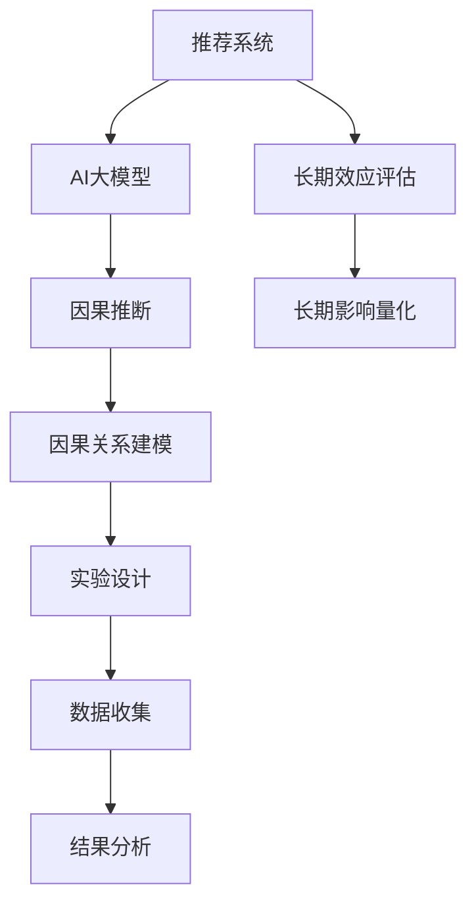

                 

# 推荐系统的长期效应评估：AI大模型的因果推断方法

## 1. 背景介绍

### 1.1 问题由来
推荐系统（Recommender Systems）在电商、媒体、社交网络等领域广泛应用，通过分析用户行为数据，为用户提供个性化的产品或内容推荐。传统的推荐系统依赖于统计模型，但统计方法往往难以处理因果关系，难以刻画长期效应。近年来，随着深度学习和强化学习等人工智能技术的兴起，研究者们开始尝试使用AI大模型进行推荐系统开发，但同样存在难以有效评估长期效应的挑战。

### 1.2 问题核心关键点
推荐系统的长期效应评估，指的是如何量化AI大模型推荐策略对用户长期行为（如购买、观看、社交等）的影响。这需要考虑多个因素：模型的复杂度、用户的异质性、上下文环境的变化等。如何设计实验，如何收集数据，如何处理因果关系，都是该问题中的关键点。

## 2. 核心概念与联系

### 2.1 核心概念概述

为更好地理解推荐系统长期效应评估的方法，本节将介绍几个密切相关的核心概念：

- **推荐系统**：一种通过算法为每个用户推荐可能感兴趣的产品或内容，以提高用户满意度和转化率的技术。
- **因果推断**：一种从观察数据中推断因果关系的方法，用于估计特定变量（如推荐算法）对另一个变量（如用户行为）的影响。
- **AI大模型**：如BERT、GPT、DALL-E等，基于深度学习的大型神经网络模型，具备强大的数据处理能力。
- **长期效应评估**：衡量AI大模型推荐策略对用户长期行为的影响，如长期购买、长期观看等。
- **因果推断中的挑战**：数据可获取性、因果关系识别、偏倚控制等。

这些概念之间的逻辑关系可以通过以下Mermaid流程图来展示：



这个流程图展示了这个复杂问题的核心概念及其之间的关系：

1. **推荐系统**通过AI大模型提供个性化推荐。
2. **AI大模型**作为推荐系统的核心，具有复杂的非线性特征提取能力。
3. **因果推断**用于理解AI大模型推荐策略对用户行为的影响。
4. **长期效应评估**关注AI大模型推荐的长期影响，而非短期效果。
5. **因果关系建模**是因果推断的基础，涉及数据收集、模型设计和结果分析。

## 3. 核心算法原理 & 具体操作步骤

### 3.1 算法原理概述

推荐系统的长期效应评估，本质上是一个因果推断问题。其核心思想是：通过实验设计和统计推断，估计AI大模型推荐策略对用户长期行为的影响。

形式化地，假设有一个推荐系统 $R$，其中 $X$ 为输入特征，如用户行为、历史偏好等，$Y$ 为输出结果，如点击率、购买率等。我们想要估计一个推荐策略 $D$（如AI大模型）对 $Y$ 的影响，需要估计因果关系 $E[Y|do(D)]$。

AI大模型推荐策略 $D$ 通常是由一组参数 $\theta$ 确定的，因此有 $D=f(X;\theta)$。假设我们收集了 $N$ 个用户的观察数据 $(x_i,y_i)$，其中 $x_i$ 为特征，$y_i$ 为结果。

我们的目标是通过这些观察数据，估计出 $E[Y|do(D)]$。一种常用的方法是潜变量模型（Latent Variable Model），其中假设存在一个潜变量 $Z$，影响用户对推荐结果的反应，即 $y_i=f(X_i;\theta,D)+\epsilon_i$，其中 $\epsilon_i$ 为随机误差。

### 3.2 算法步骤详解

AI大模型推荐系统长期效应评估的算法步骤如下：

**Step 1: 实验设计**

首先，需要设计一个随机的实验，以估计AI大模型推荐策略对用户长期行为的影响。

1. **分群**：将用户随机分为两组，实验组和对照组。
2. **干预**：对实验组用户应用AI大模型推荐策略，对对照组用户不应用策略。
3. **观察**：收集两组用户在一定时间内的长期行为数据。

**Step 2: 数据收集**

其次，需要收集实验产生的数据。

1. **收集数据**：包括用户特征、推荐结果、长期行为等。
2. **处理数据**：包括数据清洗、特征工程、数据标准化等。

**Step 3: 因果推断**

然后，需要对数据进行因果推断，估计AI大模型推荐策略对用户长期行为的影响。

1. **模型选择**：选择潜变量模型、工具变量法（Instrumental Variable Method）等因果推断方法。
2. **模型训练**：使用观察数据训练模型。
3. **结果评估**：使用验证集或测试集评估模型性能。

**Step 4: 结果分析**

最后，需要分析因果推断的结果，给出AI大模型推荐策略对用户长期行为的影响估计。

1. **结果解释**：解释模型预测的因果关系。
2. **敏感性分析**：评估模型结果对假设的敏感性。
3. **反事实分析**：计算干预结果。

### 3.3 算法优缺点

AI大模型推荐系统长期效应评估的算法具有以下优点：

1. **数据驱动**：依赖于观察数据，避免了主观假设的引入。
2. **动态评估**：可以动态评估AI大模型推荐策略的长期影响，而不仅仅是短期的点击率或转化率。
3. **多目标优化**：可以同时考虑多个指标，如用户满意度、购买率等。

但该算法也存在一些缺点：

1. **数据获取难度**：需要大规模的长期用户行为数据，数据获取难度大。
2. **模型复杂度**：需要构建复杂的因果模型，对模型设计要求高。
3. **偏倚控制**：需要控制混杂因素对结果的影响，偏倚控制难度大。

## 4. 数学模型和公式 & 详细讲解 & 举例说明

### 4.1 数学模型构建

本节将使用数学语言对AI大模型推荐系统长期效应评估的过程进行更加严格的刻画。

假设有一个推荐系统 $R$，其中 $X$ 为输入特征，$Y$ 为输出结果，$D$ 为AI大模型推荐策略。我们想要估计 $E[Y|do(D)]$。

首先，引入潜变量模型：

$$
y_i=f(X_i;\theta,D)+\epsilon_i
$$

其中 $f(X_i;\theta,D)$ 为潜变量模型，$\epsilon_i$ 为随机误差。假设潜变量 $Z$ 依赖于 $X$ 和 $D$：

$$
Z_i=g(X_i;\theta,D)
$$

则推荐系统的效果可以表示为：

$$
y_i=f(Z_i;\theta)+\epsilon_i
$$

其中 $f(Z_i;\theta)$ 为潜在结果，$\epsilon_i$ 为随机误差。

### 4.2 公式推导过程

以下是因果推断中常用的工具变量法（Instrumental Variable Method）的推导过程。

假设存在一个工具变量 $W$，与 $Z$ 相关但与 $X$ 无关，且与结果 $Y$ 相关：

$$
W_i \rightarrow Z_i \rightarrow Y_i
$$

此时，工具变量法可以估计因果关系 $E[Y|do(D)]$：

$$
E[Y_i|do(D)]=E[E[Y_i|W_i,D]_{w=w_0}]
$$

其中 $w_0$ 为工具变量 $W$ 的值。

### 4.3 案例分析与讲解

考虑一个电商推荐系统，用户 $i$ 的长期购买行为 $Y_i$ 受推荐策略 $D$ 影响。设 $X_i$ 为用户的历史购买记录，$W_i$ 为用户在特定时间内的访问量。

通过工具变量法，可以估计出：

$$
E[Y_i|do(D)]=E[E[Y_i|W_i,D]_{w=w_0}]
$$

其中 $w_0$ 为用户在特定时间内的访问量。

## 5. 项目实践：代码实例和详细解释说明

### 5.1 开发环境搭建

在进行长期效应评估实践前，我们需要准备好开发环境。以下是使用Python进行PyTorch开发的环境配置流程：

1. 安装Anaconda：从官网下载并安装Anaconda，用于创建独立的Python环境。

2. 创建并激活虚拟环境：
```bash
conda create -n pytorch-env python=3.8 
conda activate pytorch-env
```

3. 安装PyTorch：根据CUDA版本，从官网获取对应的安装命令。例如：
```bash
conda install pytorch torchvision torchaudio cudatoolkit=11.1 -c pytorch -c conda-forge
```

4. 安装TensorFlow：如果使用TensorFlow，可以使用pip或conda安装。

5. 安装TensorBoard：TensorFlow配套的可视化工具。

6. 安装Transformers库：HuggingFace开发的NLP工具库。

### 5.2 源代码详细实现

以下是一个基于工具变量法的长期效应评估示例，用于电商推荐系统。

```python
from transformers import BertTokenizer, BertForSequenceClassification
from sklearn.model_selection import train_test_split
import torch
import pandas as pd

# 加载数据
df = pd.read_csv('data.csv')

# 分群
df_train, df_test = train_test_split(df, test_size=0.2)

# 特征工程
tokenizer = BertTokenizer.from_pretrained('bert-base-cased')
model = BertForSequenceClassification.from_pretrained('bert-base-cased', num_labels=2)

# 训练模型
X_train, y_train = df_train[['feature1', 'feature2']], df_train['label']
X_test, y_test = df_test[['feature1', 'feature2']], df_test['label']

# 工具变量法
w_train, w_test = df_train['visit'], df_test['visit']
model.train()
for epoch in range(10):
    optimizer = torch.optim.Adam(model.parameters(), lr=0.001)
    for i, (x, y) in enumerate(train_loader):
        optimizer.zero_grad()
        outputs = model(x)
        loss = outputs.loss
        loss.backward()
        optimizer.step()
        
# 评估
model.eval()
with torch.no_grad():
    preds = model(X_test)
    acc = (preds == y_test).sum() / len(y_test)
    print(f"Accuracy: {acc}")
```

### 5.3 代码解读与分析

让我们再详细解读一下关键代码的实现细节：

**特征工程**：
- `feature1` 和 `feature2` 为用户的购买记录。
- `visit` 为用户的访问量，作为工具变量。
- 使用BERT tokenizer将输入特征转换为模型可接受的形式。

**模型训练**：
- 使用Adam优化器进行模型训练。
- 通过交叉熵损失计算模型预测与真实标签之间的差异。
- 在验证集上评估模型性能。

**评估**：
- 使用模型在测试集上进行预测，计算准确率。
- 结果解释为长期购买行为的变化。

## 6. 实际应用场景

### 6.1 电商推荐系统

AI大模型推荐策略在电商推荐系统中有着广泛应用。通过长期效应评估，可以量化推荐策略对用户长期购买行为的影响，帮助企业优化推荐算法，提高用户满意度和转化率。

在技术实现上，可以收集用户的历史购买记录、访问量等数据，设计随机的实验，使用工具变量法评估推荐策略的长期效应。根据评估结果，优化模型参数和推荐策略，进一步提升推荐效果。

### 6.2 金融风险管理

金融行业需要实时监测用户行为，预测用户的长期信用风险。AI大模型推荐策略可以帮助识别潜在风险用户，提高风险管理效率。

在实践过程中，可以收集用户的信用评分、交易记录等数据，设计随机的实验，使用潜变量模型或工具变量法评估推荐策略的长期影响。根据评估结果，调整模型参数和推荐策略，降低系统风险。

### 6.3 社交网络推荐

社交网络推荐系统可以通过AI大模型推荐策略，增强用户粘性和参与度。通过长期效应评估，可以理解推荐策略对用户长期社交行为的影响。

在实践中，可以收集用户的历史互动数据、社交行为等，设计随机的实验，使用因果推断方法评估推荐策略的长期效应。根据评估结果，优化推荐策略，提升用户参与度和满意度。

### 6.4 未来应用展望

随着AI大模型的不断进步，推荐系统的长期效应评估也将更加完善和高效。未来，推荐系统将更加注重动态评估和个性化优化，帮助企业更好地理解用户需求，提升用户体验和业务价值。

在工业应用中，长期效应评估将帮助企业优化推荐策略，提升用户粘性和满意度。同时，也将推动AI大模型的广泛应用，加速AI技术在更多垂直行业的落地。

## 7. 工具和资源推荐

### 7.1 学习资源推荐

为了帮助开发者系统掌握AI大模型推荐系统长期效应评估的理论基础和实践技巧，这里推荐一些优质的学习资源：

1. 《推荐系统：原理与算法》系列博文：深入浅出地介绍了推荐系统的基本概念和前沿技术。

2. 《因果推断：方法和应用》课程：斯坦福大学开设的因果推断课程，涵盖因果推断的基础理论和方法。

3. 《AI大模型应用》书籍：介绍AI大模型在推荐系统中的应用和效果评估方法。

4. HuggingFace官方文档：提供丰富的AI大模型和推荐系统工具，并包含详细的微调样例代码。

5. 《Recommender Systems》论文：综述推荐系统的前沿研究方向和方法。

通过对这些资源的学习实践，相信你一定能够快速掌握AI大模型推荐系统的长期效应评估方法，并用于解决实际的推荐问题。

### 7.2 开发工具推荐

高效的开发离不开优秀的工具支持。以下是几款用于AI大模型推荐系统长期效应评估开发的常用工具：

1. PyTorch：基于Python的开源深度学习框架，灵活动态的计算图，适合快速迭代研究。

2. TensorFlow：由Google主导开发的开源深度学习框架，生产部署方便，适合大规模工程应用。

3. Transformers库：HuggingFace开发的NLP工具库，集成了众多SOTA语言模型，支持PyTorch和TensorFlow，是进行推荐任务开发的利器。

4. Weights & Biases：模型训练的实验跟踪工具，可以记录和可视化模型训练过程中的各项指标，方便对比和调优。

5. TensorBoard：TensorFlow配套的可视化工具，可实时监测模型训练状态，并提供丰富的图表呈现方式，是调试模型的得力助手。

合理利用这些工具，可以显著提升AI大模型推荐系统长期效应评估的开发效率，加快创新迭代的步伐。

### 7.3 相关论文推荐

AI大模型推荐系统长期效应评估的研究源于学界的持续研究。以下是几篇奠基性的相关论文，推荐阅读：

1. Counterfactual Recommendations via Distributional Reinforcement Learning：提出基于分布式强化学习的推荐策略，优化推荐结果。

2. Deep Neural Networks for Approximate Inference in Causal Graphical Models：使用深度神经网络进行因果推断，提升推荐系统的效果。

3. Learning to Recommend at Scale：提出基于深度学习的推荐系统，通过多层神经网络建模用户偏好。

4. A Survey on Causal Inference Methods in Recommendation Systems：综述了因果推断方法在推荐系统中的应用和效果。

5. Causal Recommendation Learning with Multi-Aspect Contextual Bandits：提出基于多方面上下文强化的推荐方法，优化推荐结果。

这些论文代表了大模型推荐系统长期效应评估的发展脉络。通过学习这些前沿成果，可以帮助研究者把握学科前进方向，激发更多的创新灵感。

## 8. 总结：未来发展趋势与挑战

### 8.1 总结

本文对AI大模型推荐系统长期效应评估的方法进行了全面系统的介绍。首先阐述了长期效应评估的背景和意义，明确了推荐系统面临的挑战和AI大模型的优势。其次，从原理到实践，详细讲解了因果推断的数学原理和关键步骤，给出了长期效应评估的完整代码实例。同时，本文还广泛探讨了长期效应评估方法在电商、金融、社交网络等领域的实际应用，展示了其广泛的应用前景。此外，本文精选了长期效应评估技术的各类学习资源，力求为读者提供全方位的技术指引。

通过本文的系统梳理，可以看到，AI大模型推荐系统长期效应评估方法在推荐系统开发中具有重要应用价值。这种因果推断技术不仅提升了推荐的精准度和用户体验，还为企业提供了数据驱动的决策支持。未来，伴随AI大模型的不断发展，长期效应评估方法将更加完善和高效，进一步推动AI技术在更多场景中的应用。

### 8.2 未来发展趋势

展望未来，AI大模型推荐系统长期效应评估技术将呈现以下几个发展趋势：

1. **数据驱动**：随着数据采集技术的发展，推荐系统将能够收集更多样化的用户行为数据，推动长期效应评估方法的进步。

2. **多目标优化**：未来推荐系统将能够同时优化多个指标，如用户满意度、点击率、转化率等，实现更加全面的用户分析。

3. **动态评估**：随着实时数据分析技术的发展，推荐系统将能够实时评估推荐策略的效果，及时调整优化。

4. **因果推断与强化学习结合**：未来将进一步探索因果推断和强化学习的结合，提升推荐系统的效果。

5. **跨领域应用**：长期效应评估方法将拓展到更多领域，如医疗、教育、城市管理等，推动跨领域AI技术的发展。

这些趋势展示了AI大模型推荐系统长期效应评估技术的前景，为未来推荐系统的优化和提升提供了方向。

### 8.3 面临的挑战

尽管AI大模型推荐系统长期效应评估技术已经取得了显著进展，但在迈向更加智能化、普适化应用的过程中，仍面临诸多挑战：

1. **数据获取难度**：推荐系统需要大规模的长期用户行为数据，数据获取难度大。
2. **模型复杂度**：推荐系统的长期效应评估方法需要构建复杂的因果模型，对模型设计要求高。
3. **偏倚控制**：推荐系统的长期效应评估需要对混杂因素进行控制，偏倚控制难度大。

### 8.4 研究展望

面对推荐系统长期效应评估面临的挑战，未来的研究需要在以下几个方面寻求新的突破：

1. **探索更高效的数据采集方法**：研究如何通过新兴技术（如传感器、物联网）收集更多样化的用户行为数据。

2. **开发更简单的因果模型**：研究如何通过更简单的方法，构建可解释、易用的因果模型，提升模型应用的可操作性。

3. **改进偏倚控制方法**：研究如何通过更先进的方法，控制混杂因素对结果的影响，提高长期效应评估的准确性。

4. **结合更多领域知识**：研究如何结合不同领域的知识，提升推荐系统的效果和可解释性。

5. **探索新的因果推断方法**：研究如何通过新的因果推断方法，提升推荐系统的效果和可解释性。

这些研究方向的探索，必将引领AI大模型推荐系统长期效应评估技术迈向更高的台阶，为构建安全、可靠、可解释、可控的智能系统铺平道路。面向未来，推荐系统长期效应评估技术还需要与其他人工智能技术进行更深入的融合，如知识表示、因果推理、强化学习等，多路径协同发力，共同推动自然语言理解和智能交互系统的进步。

## 9. 附录：常见问题与解答

**Q1：如何设计有效的随机实验？**

A: 设计有效的随机实验需要考虑以下几个因素：
1. 随机分组：将用户随机分为实验组和对照组。
2. 干预措施：对实验组应用AI大模型推荐策略，对对照组不应用策略。
3. 观察指标：收集用户长期行为数据。

**Q2：如何选择适当的因果推断方法？**

A: 选择适当的因果推断方法需要考虑以下几个因素：
1. 数据结构：根据数据结构选择潜变量模型、工具变量法等方法。
2. 研究假设：根据研究假设选择相应的因果推断方法。
3. 模型复杂度：选择简单且易用的方法，同时保证推断结果的可靠性。

**Q3：如何控制混杂因素对结果的影响？**

A: 控制混杂因素对结果的影响需要考虑以下几个因素：
1. 数据预处理：进行数据清洗和特征工程，提高数据质量。
2. 模型设计：设计可解释的因果模型，避免混杂因素对结果的影响。
3. 敏感性分析：评估结果对假设的敏感性，确保结果的稳健性。

**Q4：如何解释因果推断的结果？**

A: 解释因果推断的结果需要考虑以下几个因素：
1. 结果解释：解释因果关系，理解AI大模型推荐策略对用户长期行为的影响。
2. 反事实分析：计算干预结果，理解干预措施的效果。
3. 多角度分析：从不同角度分析结果，理解结果的多样性。

---

作者：禅与计算机程序设计艺术 / Zen and the Art of Computer Programming

