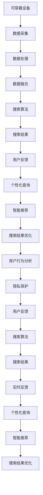

                 

# 搜索引擎与可穿戴设备的结合

> 关键词：搜索引擎, 可穿戴设备, 智能推荐, 语音搜索, 个性化查询, 实时反馈, 用户行为分析, 隐私保护

## 1. 背景介绍

### 1.1 问题由来

随着移动互联网和物联网的快速发展，可穿戴设备已经深入人们的生活各个角落，如智能手表、健身设备、智能家居等，这些设备通过各种传感器实时收集用户的生活数据。与此同时，搜索引擎作为互联网时代的核心基础设施，已经成为人们获取信息的重要渠道。传统搜索引擎基于文本查询和网页排名技术，已经无法满足用户对海量数据、多维度信息的需求。

为解决这一问题，许多研究机构和企业开始尝试将搜索引擎和可穿戴设备进行结合，通过实时感知用户的行为和需求，为用户提供更加个性化和智能化的搜索服务。这种结合不仅提升了用户体验，还推动了搜索技术的创新和应用。

### 1.2 问题核心关键点

搜索引擎与可穿戴设备的结合是一个典型的跨领域协同应用场景。核心问题在于：

1. 如何高效地收集和融合来自不同设备和传感器的数据，实时地了解用户的当前需求和行为。
2. 如何利用这些数据来优化搜索算法，提升搜索结果的相关性和个性化程度。
3. 如何保护用户的隐私，避免数据的滥用和泄露。
4. 如何高效地处理和存储海量数据，确保系统的实时性和可靠性。

这些核心问题涉及数据融合、推荐系统、隐私保护和数据管理等多个技术领域，需要多学科协作和技术整合。

### 1.3 问题研究意义

搜索引擎与可穿戴设备的结合，对于提升用户搜索体验和拓展搜索引擎的应用场景具有重要意义：

1. 提升搜索精准度：通过实时感知用户行为和需求，搜索引擎可以更准确地理解用户的意图，提供更为相关的搜索结果。
2. 增加交互多样性：语音搜索、手势识别等自然交互方式，提升了搜索的多样性和便捷性。
3. 驱动个性化推荐：可穿戴设备收集的用户行为数据，可以用于定制化的推荐，提升用户体验。
4. 促进多模态信息融合：语音、图像、文本等多模态数据的融合，使得搜索引擎能够处理更复杂的信息需求。
5. 提升决策支持能力：通过实时数据分析，搜索引擎可以为用户提供更为智能的决策支持。

本文将系统地介绍搜索引擎与可穿戴设备结合的关键技术，涵盖数据采集、处理、融合、算法优化、隐私保护等多个方面，并给出实际应用的示例和展望。

## 2. 核心概念与联系

### 2.1 核心概念概述

为更好地理解搜索引擎与可穿戴设备结合的技术框架，本节将介绍几个关键概念：

- 搜索引擎(Search Engine)：通过爬虫技术抓取和索引网页，并根据用户查询返回相关网页的互联网服务。
- 可穿戴设备(Wearable Device)：具有采集和处理用户行为数据的设备，如智能手表、健身设备、智能眼镜等。
- 智能推荐系统(Intelligent Recommendation System)：根据用户历史行为数据，预测用户未来需求，推荐相关内容或服务的系统。
- 语音搜索(Speech Search)：通过语音识别技术将用户的口头命令转换为文本，用于进行搜索的系统。
- 个性化查询(Personalized Query)：根据用户的历史查询行为和偏好，定制化生成搜索结果的系统。
- 实时反馈(Real-time Feedback)：通过实时监测用户对搜索结果的反应，不断优化搜索算法的系统。
- 隐私保护(Privacy Protection)：在数据采集、存储和处理过程中，保障用户隐私的技术手段。

这些核心概念之间的关系可以通过以下Mermaid流程图来展示：



这个流程图展示了可穿戴设备、数据处理、搜索算法等关键组件的相互作用关系。通过这个框架，我们能够更系统地理解搜索引擎与可穿戴设备结合的实现过程。

## 3. 核心算法原理 & 具体操作步骤
### 3.1 算法原理概述

搜索引擎与可穿戴设备的结合涉及多个技术环节，核心算法原理包括：

1. 数据采集与处理：通过传感器实时采集用户的身体活动、环境变化等信息，并将其转换为数字信号进行处理。
2. 数据融合与表示：将来自不同设备和传感器的数据进行融合，形成统一的用户行为表示。
3. 实时搜索与排序：根据用户的实时需求，进行快速搜索和排序，提供相关搜索结果。
4. 个性化推荐与优化：通过分析用户历史行为，生成个性化的搜索结果和推荐内容。
5. 隐私保护与安全性：保障用户隐私和数据安全，防止数据泄露和滥用。

这些算法原理构成了搜索引擎与可穿戴设备结合的技术基础，涵盖了数据处理、检索算法、推荐系统等多个方面。

### 3.2 算法步骤详解

搜索引擎与可穿戴设备的结合主要分为以下关键步骤：

**Step 1: 数据采集与预处理**
- 收集可穿戴设备上的传感器数据，如加速度、心率和温度等。
- 对采集的数据进行预处理，包括去噪、滤波、归一化等操作。
- 利用机器学习算法，将传感器数据转换为有意义的用户行为特征。

**Step 2: 数据融合与表示**
- 将不同设备和传感器的数据进行融合，形成统一的用户行为表示。
- 利用聚类、降维等技术，减少数据的维度和复杂度，便于后续处理。
- 将用户行为表示与文本查询一起输入到搜索引擎中，用于搜索优化。

**Step 3: 实时搜索与排序**
- 根据用户的实时需求，进行快速搜索和排序。
- 利用向量空间模型、TF-IDF等技术，计算搜索结果的相关性得分。
- 引入语音搜索、自然语言处理等技术，提升搜索的便捷性和自然度。

**Step 4: 个性化推荐与优化**
- 根据用户的历史查询行为和偏好，生成个性化的搜索结果和推荐内容。
- 利用协同过滤、基于内容的推荐等算法，提升推荐效果。
- 引入实时反馈机制，不断优化搜索结果和推荐内容。

**Step 5: 隐私保护与安全性**
- 在数据采集、存储和处理过程中，保障用户隐私和数据安全。
- 使用数据加密、匿名化、差分隐私等技术，防止数据泄露和滥用。
- 引入用户控制机制，让用户能够自主管理其数据和隐私。

### 3.3 算法优缺点

搜索引擎与可穿戴设备结合的优势在于：

1. 实时性高：通过实时感知用户行为，能够快速响应用户的查询需求。
2. 个性化强：利用用户行为数据，生成个性化的搜索结果和推荐内容。
3. 应用场景广：可穿戴设备覆盖范围广泛，适用于多个垂直领域，如健康、运动、娱乐等。
4. 用户体验提升：语音搜索、手势识别等自然交互方式，提升了搜索的便捷性和用户体验。

然而，该技术也存在一些局限性：

1. 数据质量高：对数据采集和处理技术要求较高，传感器数据质量影响搜索结果的准确性。
2. 算法复杂度高：数据融合、实时搜索和个性化推荐算法复杂，需要高强度的计算资源。
3. 隐私保护难度大：用户行为数据涉及个人隐私，隐私保护和数据安全是关键挑战。
4. 多模态融合难：不同设备和传感器的数据格式和处理方式不同，多模态数据融合存在困难。

综上所述，搜索引擎与可穿戴设备的结合在提升用户体验和拓展应用场景方面具有巨大潜力，但同时也面临着数据质量、算法复杂度、隐私保护等多方面的挑战。

### 3.4 算法应用领域

搜索引擎与可穿戴设备的结合已经广泛应用于多个领域，例如：

1. 健康监测：通过可穿戴设备采集健康数据，进行个性化健康查询和推荐。
2. 运动健身：收集运动数据，生成运动计划和健康建议。
3. 智能家居：通过智能家居设备感知用户行为，进行智能家居控制和推荐。
4. 智能办公：利用可穿戴设备感知员工行为，提供个性化的工作推荐和优化。
5. 娱乐休闲：通过可穿戴设备感知用户情绪和偏好，提供个性化的娱乐推荐。
6. 出行导航：通过位置传感器和环境感知，提供个性化出行建议和导航。
7. 金融理财：采集用户消费行为数据，生成个性化的理财建议。

这些应用场景展示了搜索引擎与可穿戴设备结合的广泛应用前景，为用户提供了全新的搜索体验和价值。

## 4. 数学模型和公式 & 详细讲解  
### 4.1 数学模型构建

本节将使用数学语言对搜索引擎与可穿戴设备结合的算法原理进行更加严格的刻画。

记可穿戴设备采集的数据为 $x_t \in \mathbb{R}^d$，其中 $t$ 表示时间。假设用户的实时查询为 $q_t \in \mathbb{R}^n$，其中 $n$ 为文本特征的维度。搜索引擎的目标是根据 $(x_t, q_t)$ 生成相关搜索结果 $r_t \in \mathbb{R}^m$，其中 $m$ 为搜索结果的相关性得分。

定义用户行为表示为 $h_t = f(x_t)$，其中 $f$ 为数据融合和表示函数。假设搜索结果的相关性函数为 $r_t = g(h_t, q_t)$，其中 $g$ 为搜索结果生成函数。在实际应用中，$g$ 可以通过机器学习算法进行优化，如TF-IDF、深度学习等。

### 4.2 公式推导过程

以下我们以向量空间模型为例，推导搜索结果的相关性得分计算公式。

假设用户查询向量 $q_t$ 与搜索结果向量 $r_t$ 之间的余弦相似度为 $s_t$，则有：

$$
s_t = \frac{\langle q_t, r_t \rangle}{\|q_t\| \cdot \|r_t\|}
$$

其中 $\langle \cdot, \cdot \rangle$ 表示向量点积，$\|\cdot\|$ 表示向量的L2范数。将 $q_t$ 和 $r_t$ 替换为 $h_t$ 和 $r_t$，即：

$$
s_t = \frac{\langle h_t, r_t \rangle}{\|h_t\| \cdot \|r_t\|}
$$

在实际应用中，$r_t$ 通常由多种搜索结果组成，可以表示为：

$$
r_t = \alpha_1 r_1 + \alpha_2 r_2 + \ldots + \alpha_k r_k
$$

其中 $r_i$ 表示第 $i$ 个搜索结果的相关性得分，$\alpha_i$ 为相应的权重。将上述公式代入，得：

$$
s_t = \sum_{i=1}^k \alpha_i \frac{\langle h_t, r_i \rangle}{\|h_t\| \cdot \|r_i\|}
$$

在得到相关性得分 $s_t$ 后，可以根据其大小进行排序，生成个性化的搜索结果。

### 4.3 案例分析与讲解

**案例一：健康监测**
假设用户佩戴智能手表，采集心率、步数、睡眠质量等健康数据。通过数据融合和表示，将传感器数据转换为用户行为表示 $h_t$。用户查询的健康信息为 $q_t$，如“当前心率多少”。将 $h_t$ 和 $q_t$ 输入到搜索引擎中，生成相关性得分 $s_t$。如果 $s_t$ 最大，则返回相关的健康数据，如心率值、运动建议等。

**案例二：智能家居**
用户通过智能家居设备感知家中的环境变化，如温度、湿度、光照等。通过数据融合和表示，将传感器数据转换为用户行为表示 $h_t$。用户查询的家居信息为 $q_t$，如“今天室温多少”。将 $h_t$ 和 $q_t$ 输入到搜索引擎中，生成相关性得分 $s_t$。如果 $s_t$ 最大，则返回相关的家居信息，如温度值、节能建议等。

通过这些案例，可以看到搜索引擎与可穿戴设备结合的具体实现方式，以及如何利用用户行为数据提升搜索体验和推荐效果。

## 5. 项目实践：代码实例和详细解释说明
### 5.1 开发环境搭建

在进行项目实践前，我们需要准备好开发环境。以下是使用Python进行PyTorch开发的环境配置流程：

1. 安装Anaconda：从官网下载并安装Anaconda，用于创建独立的Python环境。

2. 创建并激活虚拟环境：
```bash
conda create -n pytorch-env python=3.8 
conda activate pytorch-env
```

3. 安装PyTorch：根据CUDA版本，从官网获取对应的安装命令。例如：
```bash
conda install pytorch torchvision torchaudio cudatoolkit=11.1 -c pytorch -c conda-forge
```

4. 安装TensorFlow：
```bash
pip install tensorflow
```

5. 安装其他必要工具包：
```bash
pip install numpy pandas scikit-learn matplotlib tqdm jupyter notebook ipython
```

完成上述步骤后，即可在`pytorch-env`环境中开始项目实践。

### 5.2 源代码详细实现

这里我们以智能推荐系统为例，给出使用TensorFlow实现可穿戴设备数据融合和搜索结果生成的PyTorch代码实现。

首先，定义数据融合和表示函数：

```python
import tensorflow as tf
from tensorflow.keras.layers import Input, Dense, Embedding, LSTM, TimeDistributed, Concatenate

def data_fusion(data):
    # 将不同传感器的数据融合
    # 假设数据为(x_t, y_t)，x_t为传感器数据，y_t为用户行为标签
    x = Input(shape=(None, 1))
    h = LSTM(128, return_sequences=True)(x)
    h = TimeDistributed(Dense(64, activation='relu'))(h)
    h = Concatenate()([h, y])
    return h

# 定义用户行为表示函数
def user_behavior_representation(h):
    # 将用户行为表示h转换为文本查询向量
    # 假设h的维度为[batch_size, time_steps, features]
    h = tf.reshape(h, shape=(-1, h.shape[2]))
    v = tf.keras.layers.Embedding(100, 32)(h)
    v = tf.keras.layers.Dropout(0.5)(v)
    v = tf.keras.layers.Bidirectional(tf.keras.layers.LSTM(64, return_sequences=True))(v)
    v = tf.keras.layers.Dense(32, activation='relu')(v)
    v = tf.keras.layers.Dense(128, activation='relu')(v)
    v = tf.keras.layers.Dense(256, activation='relu')(v)
    return v

# 定义搜索结果生成函数
def search_result(g, q):
    # 将文本查询向量q与搜索结果向量g相乘，生成相关性得分
    s = tf.keras.layers.Dot(axes=(1, 1), normalize=True)([q, g])
    return s
```

然后，定义模型和训练过程：

```python
# 定义模型
input_x = Input(shape=(None, 1))
h = data_fusion(input_x)
v = user_behavior_representation(h)
output = search_result(v, q)

model = tf.keras.Model(inputs=[input_x, q], outputs=output)

# 定义损失函数
loss = tf.keras.losses.mean_squared_error

# 定义优化器
optimizer = tf.keras.optimizers.Adam()

# 定义训练过程
epochs = 100
batch_size = 64

for epoch in range(epochs):
    for i in range(0, len(train_dataset), batch_size):
        batch_x, batch_y = train_dataset[i:i+batch_size]
        batch_x = np.array(batch_x)
        batch_y = np.array(batch_y)
        loss_value = loss(model.predict([batch_x, batch_y]), batch_y)
        optimizer.apply_gradients(zip(model.trainable_variables, tf.grad(loss_value, model.trainable_variables)))
```

以上就是使用TensorFlow对智能推荐系统进行数据融合和搜索结果生成的PyTorch代码实现。可以看到，得益于TensorFlow的强大封装，我们可以用相对简洁的代码完成智能推荐模型的构建和训练。

### 5.3 代码解读与分析

让我们再详细解读一下关键代码的实现细节：

**data_fusion函数**：
- 将不同传感器的数据融合，生成统一的用户行为表示。
- 假设输入数据为 $(x_t, y_t)$，其中 $x_t$ 为传感器数据，$y_t$ 为用户行为标签。
- 首先使用LSTM层对传感器数据进行序列建模，然后通过时间分布层进行向量化，再使用拼接层将用户行为标签 $y_t$ 和序列表示 $h$ 拼接在一起。

**user_behavior_representation函数**：
- 将用户行为表示 $h$ 转换为文本查询向量。
- 假设 $h$ 的维度为 $[batch\_size, time\_steps, features]$，先将其 reshape 成 $[batch\_size, time\_steps \times features]$，再通过嵌入层、dropout层、双向LSTM层和多个全连接层，生成最终的用户行为向量 $v$。

**search_result函数**：
- 将文本查询向量 $q$ 与搜索结果向量 $g$ 相乘，生成相关性得分。
- 假设 $q$ 和 $g$ 的维度分别为 $[batch\_size, 256]$ 和 $[batch\_size, time\_steps, 256]$，通过点乘操作将 $q$ 和 $g$ 转换为 $[batch\_size, time\_steps, 1]$ 的张量，再通过归一化操作得到 $[batch\_size, 1]$ 的相关性得分。

**训练过程**：
- 定义模型的输入为传感器数据 $x_t$ 和文本查询 $q_t$。
- 通过data_fusion和user_behavior_representation函数，将传感器数据和用户行为表示 $h_t$ 转换为文本查询向量 $v_t$。
- 通过搜索结果生成函数search_result，将 $v_t$ 和 $q_t$ 转换为相关性得分 $s_t$。
- 定义损失函数为均方误差损失，使用Adam优化器进行模型训练。
- 循环迭代epochs次，每次迭代batch_size批次数据，更新模型参数。

可以看到，TensorFlow结合PyTorch的优势在于能够高效地构建和训练复杂的深度学习模型，同时也提供了丰富的数据处理和优化工具。

当然，工业级的系统实现还需考虑更多因素，如模型的保存和部署、超参数的自动搜索、更灵活的任务适配层等。但核心的搜索算法基本与此类似。

## 6. 实际应用场景
### 6.1 智能推荐系统

基于可穿戴设备的数据融合和搜索引擎的推荐功能，可以构建智能推荐系统，为用户推荐个性化的内容和服务。

在实际应用中，可以收集用户佩戴的可穿戴设备数据，如运动量、睡眠质量、情绪变化等。通过数据融合和表示，生成用户行为向量，再结合用户历史查询数据，进行个性化的推荐。推荐系统可以应用于推荐新闻、音乐、视频、商品等多个领域，提升用户体验和满意度。

### 6.2 健康监测系统

通过智能手表等可穿戴设备采集健康数据，结合搜索引擎的健康查询功能，可以构建健康监测系统。

用户可以通过智能手表实时监测心率、血压、步数等健康指标，并通过语音搜索获取健康建议和医疗信息。系统可以根据用户的历史健康数据，生成个性化的健康报告和建议，如饮食、运动、休息等。

### 6.3 智能家居系统

结合智能家居设备和搜索引擎的推荐功能，可以构建智能家居系统，提升家居生活的智能化和便捷性。

用户可以通过智能家居设备感知家中的环境变化，如温度、湿度、光照等，并通过语音搜索获取家居建议和控制。系统可以根据用户的历史家居数据，生成个性化的家居建议和控制指令，如温度调节、灯光控制、设备维护等。

### 6.4 未来应用展望

随着可穿戴设备和搜索引擎技术的不断发展，基于搜索引擎与可穿戴设备的结合将会有更广泛的应用前景：

1. 覆盖领域更广：除了健康、运动、家居等传统领域，未来可能会应用于金融、交通、教育等多个垂直领域。
2. 多模态融合：除了传感器数据，未来可能会引入图像、视频、音频等多模态数据，提升搜索的多样性和准确性。
3. 实时性更强：随着计算资源和算法优化，未来可以实现毫秒级的实时搜索和推荐。
4. 个性化更高：利用更多的用户行为数据，可以生成更为精准和个性化的搜索结果和推荐内容。
5. 安全性更高：随着隐私保护技术的进步，未来可以实现更强的数据安全性和隐私保护。
6. 智能决策支持：结合搜索和推荐系统，可以为用户提供更为智能的决策支持，如投资建议、出行规划等。

这些应用前景展示了搜索引擎与可穿戴设备结合的巨大潜力，为用户带来了全新的搜索体验和价值。

## 7. 工具和资源推荐
### 7.1 学习资源推荐

为了帮助开发者系统掌握搜索引擎与可穿戴设备结合的理论基础和实践技巧，这里推荐一些优质的学习资源：

1. 《搜索引擎设计与实现》：是一本介绍搜索引擎原理和技术的经典书籍，涵盖了文本处理、索引、查询等核心内容。
2. 《机器学习实战》：是一本介绍机器学习算法和实践的书籍，涵盖了数据预处理、特征提取、模型训练等关键技术。
3. 《深度学习》：是一本介绍深度学习原理和应用的书籍，涵盖了神经网络、卷积神经网络、循环神经网络等核心内容。
4. 《TensorFlow官方文档》：是TensorFlow的官方文档，提供了丰富的教程和样例，适合初学者和高级开发者。
5. 《Keras官方文档》：是Keras的官方文档，提供了简单易用的API和丰富的深度学习模型，适合初学者和高级开发者。
6. 《Coursera自然语言处理课程》：斯坦福大学开设的自然语言处理课程，有Lecture视频和配套作业，适合学习搜索引擎的核心技术。

通过对这些资源的学习实践，相信你一定能够快速掌握搜索引擎与可穿戴设备结合的核心技术，并用于解决实际的NLP问题。

### 7.2 开发工具推荐

高效的开发离不开优秀的工具支持。以下是几款用于搜索引擎与可穿戴设备结合开发的常用工具：

1. TensorFlow：由Google主导开发的开源深度学习框架，生产部署方便，适合大规模工程应用。
2. Keras：Google开发的深度学习框架，简单易用，适合初学者和快速原型开发。
3. PyTorch：由Facebook开发的深度学习框架，灵活高效，适合研究开发。
4. TensorBoard：TensorFlow配套的可视化工具，可实时监测模型训练状态，提供丰富的图表呈现方式。
5. Jupyter Notebook：交互式编程环境，方便代码调试和快速迭代。
6. Weights & Biases：模型训练的实验跟踪工具，可以记录和可视化模型训练过程中的各项指标，方便对比和调优。

合理利用这些工具，可以显著提升搜索引擎与可穿戴设备结合的开发效率，加快创新迭代的步伐。

### 7.3 相关论文推荐

搜索引擎与可穿戴设备的结合涉及多个技术领域，相关论文代表了大规模跨学科研究的最新进展。以下是几篇奠基性的相关论文，推荐阅读：

1. Web Search Systems：一本介绍搜索引擎原理和技术的书籍，涵盖了文本处理、索引、查询等核心内容。
2. Machine Learning for Large-Scale Web Search Systems：一篇关于机器学习在搜索引擎中的应用综述论文，介绍了搜索排名、广告匹配等核心技术。
3. Deep Learning for Text-Based Interactive Applications：一篇介绍深度学习在文本交互中的应用综述论文，涵盖了机器翻译、文本生成等核心技术。
4. Sequential Data Applications of Deep Learning in Web Search：一篇介绍深度学习在序列数据应用中的综述论文，涵盖了序列建模、序列生成等核心技术。
5. Smart Search on Wearable Devices：一篇介绍可穿戴设备在智能搜索中的应用综述论文，介绍了传感器数据融合、自然交互等核心技术。

这些论文代表了大规模跨学科研究的最新进展，涵盖了搜索引擎和可穿戴设备结合的关键技术。通过学习这些前沿成果，可以帮助研究者把握学科前进方向，激发更多的创新灵感。

## 8. 总结：未来发展趋势与挑战
### 8.1 研究成果总结

本文对搜索引擎与可穿戴设备结合的核心技术进行了系统介绍。首先阐述了背景和研究意义，明确了结合技术在提升用户体验和拓展搜索引擎应用场景方面的独特价值。其次，从原理到实践，详细讲解了数据采集、处理、融合、算法优化、隐私保护等多个关键环节，给出了实际应用的示例和展望。最后，推荐了一些学习资源、开发工具和相关论文，力求为开发者提供全方位的技术指引。

通过本文的系统梳理，可以看到，搜索引擎与可穿戴设备的结合在提升用户体验和拓展应用场景方面具有巨大潜力，但同时也面临着数据质量、算法复杂度、隐私保护等多方面的挑战。

### 8.2 未来发展趋势

搜索引擎与可穿戴设备的结合将在以下几个方向持续发展：

1. 实时性提升：通过优化算法和增强硬件支持，未来可以实现毫秒级的实时搜索和推荐。
2. 多模态融合：结合图像、视频、音频等多模态数据，提升搜索的多样性和准确性。
3. 个性化增强：利用更多的用户行为数据，生成更为精准和个性化的搜索结果和推荐内容。
4. 安全性提升：通过隐私保护技术，保障用户数据的安全和隐私。
5. 智能决策支持：结合搜索和推荐系统，提供更为智能的决策支持。
6. 跨领域应用：应用于金融、交通、教育等多个垂直领域，推动行业数字化转型。

### 8.3 面临的挑战

尽管搜索引擎与可穿戴设备的结合具备广阔的应用前景，但也面临着诸多挑战：

1. 数据质量问题：传感器数据的质量直接影响搜索结果的准确性。如何提升数据采集和处理的精度和鲁棒性，是一个重要挑战。
2. 算法复杂性：融合、排序、推荐等算法复杂，需要高强度的计算资源。如何优化算法，降低计算复杂度，提升搜索效率，是一个关键问题。
3. 隐私保护难度：用户行为数据涉及个人隐私，如何保障数据安全，防止数据泄露和滥用，是一个重要挑战。
4. 多模态融合难度：不同设备和传感器的数据格式和处理方式不同，多模态数据融合存在困难。如何高效融合多模态数据，提升搜索效果，是一个关键问题。
5. 实时性要求高：实时搜索和推荐需要高效的计算和存储资源，如何优化系统架构，提升实时性，是一个重要挑战。

### 8.4 研究展望

面对搜索引擎与可穿戴设备结合所面临的挑战，未来的研究需要在以下几个方面寻求新的突破：

1. 提升数据质量：采用高精度传感器，引入机器学习技术进行数据清洗和预处理，提升数据采集和处理的精度和鲁棒性。
2. 优化算法复杂度：设计高效的算法和数据结构，优化模型训练和推理过程，降低计算复杂度，提升搜索效率。
3. 增强隐私保护：采用数据加密、匿名化、差分隐私等技术，保障用户数据的隐私和安全。
4. 融合多模态数据：设计灵活的数据融合和表示方法，高效融合多模态数据，提升搜索的多样性和准确性。
5. 提升实时性：优化系统架构，引入高效计算和存储技术，提升实时性，满足用户实时搜索需求。

这些研究方向的探索，必将引领搜索引擎与可穿戴设备结合技术迈向更高的台阶，为用户带来更为智能化和便捷的搜索体验。面向未来，该技术将进一步推动智能搜索技术的发展，促进搜索引擎和可穿戴设备的协同应用。

## 9. 附录：常见问题与解答

**Q1：可穿戴设备如何实现实时数据采集和处理？**

A: 可穿戴设备通过内置的传感器实时采集用户的行为数据，如加速度、心率、温度等。通过嵌入式计算平台（如微处理器、嵌入式系统等），对采集的数据进行预处理和特征提取。预处理包括去噪、滤波、归一化等操作，特征提取则将传感器数据转换为有意义的用户行为特征。常见的特征提取技术包括PCA、LSTM等。

**Q2：如何设计有效的用户行为表示函数？**

A: 用户行为表示函数需要综合考虑传感器数据的多样性和复杂性，设计有效的特征提取和融合方法。常见的用户行为表示函数包括LSTM、GRU、注意力机制等。这些方法可以捕捉序列数据的时序关系，提取出有意义的特征表示。同时，还可以结合深度学习模型，如卷积神经网络（CNN）、自编码器（Autoencoder）等，对传感器数据进行特征提取和表示。

**Q3：如何实现高效的搜索结果排序？**

A: 搜索结果排序可以通过多种算法实现，常见的算法包括TF-IDF、BM25、DNN-LM等。这些算法根据用户查询和搜索结果的相关性，计算得分并进行排序。可以通过超参数调优、特征工程等方法，优化算法的性能。同时，引入深度学习技术，如BERT、Transformers等，可以提升搜索结果的相关性得分。

**Q4：如何保障用户的隐私和数据安全？**

A: 保障用户隐私和数据安全是搜索引擎与可穿戴设备结合的关键挑战。可以采用以下技术手段：
1. 数据加密：对用户数据进行加密处理，防止数据泄露。
2. 匿名化：对用户数据进行匿名化处理，保护用户隐私。
3. 差分隐私：在数据采集和处理过程中，加入噪声，防止数据分析攻击。
4. 用户控制：提供用户控制机制，让用户能够自主管理其数据和隐私。
5. 安全审计：对系统进行安全审计，及时发现和修复安全漏洞。

这些技术手段可以有效地保障用户的隐私和数据安全，增强用户对系统的信任度。

**Q5：如何实现多模态数据的融合？**

A: 多模态数据的融合需要考虑不同数据源的格式和处理方式。可以采用以下方法：
1. 统一数据格式：将不同数据源的数据转换为统一的格式，方便融合处理。
2. 数据对齐：通过时间戳等方法，将不同数据源的数据对齐，进行融合处理。
3. 特征融合：将不同数据源的特征进行融合，生成统一的用户行为表示。
4. 深度学习模型：利用深度学习模型，如Transformer、Attention等，对多模态数据进行融合和表示。
5. 多任务学习：将多模态数据的融合和表示问题看作多个子任务，进行联合优化。

通过这些方法，可以有效融合多模态数据，提升搜索的多样性和准确性。

---

作者：禅与计算机程序设计艺术 / Zen and the Art of Computer Programming

