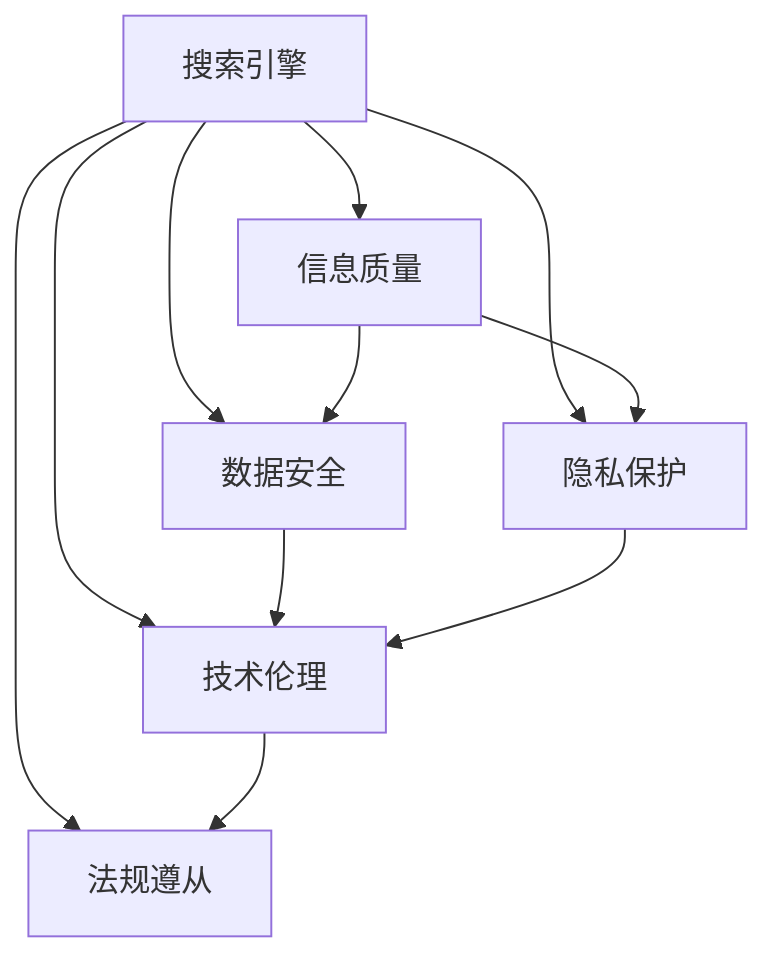

                 

# 搜索引擎的社会责任：提供可靠信息

> 关键词：搜索引擎,社会责任,信息质量,数据安全,隐私保护,技术伦理

## 1. 背景介绍

### 1.1 问题由来
随着互联网的普及和数字化的加速，搜索引擎已经成为人们获取信息的重要工具。它们在人们日常生活中的作用不可小觑，从找寻学术资料到了解时事新闻，从购买商品到预定服务，搜索引擎无处不在。但与此同时，搜索引擎带来的信息质量问题、数据安全风险、隐私保护挑战以及技术伦理问题也越来越受到关注。

### 1.2 问题核心关键点
搜索引擎社会责任的核心在于确保提供给用户的信息不仅准确、及时，而且还要保证信息的安全性和用户的隐私保护。这包括但不限于：
- 准确性和及时性：保证搜索结果的相关性和时效性，避免误导用户。
- 数据安全性：保护用户数据免遭泄露和滥用，避免数据滥用带来的安全风险。
- 隐私保护：避免隐私侵犯，确保用户的个人信息不被滥用。
- 技术伦理：保证技术应用符合社会伦理和法律法规，避免技术滥用。

### 1.3 问题研究意义
研究搜索引擎的社会责任问题，对于提升用户信息获取质量，保护用户权益，维护网络空间的公正、公平和公开，具有重要意义。只有在保障信息质量的同时，兼顾数据安全、隐私保护和伦理应用，搜索引擎才能真正成为帮助用户获取信息、提升生活质量的有力工具。

## 2. 核心概念与联系

### 2.1 核心概念概述

为更好地理解搜索引擎的社会责任问题，本节将介绍几个关键概念：

- 搜索引擎(Search Engine)：通过爬取互联网上的网页内容，并根据用户查询提供相关信息的网络服务。搜索引擎的主要功能包括网页索引、搜索排序、广告投放等。

- 信息质量(Information Quality)：搜索引擎提供的搜索结果应满足相关性、准确性、时效性和覆盖度等质量要求，确保用户获取到的信息可靠且有用。

- 数据安全(Data Security)：指对用户数据的安全保护，包括防止数据泄露、数据篡改、数据丢失等。

- 隐私保护(Privacy Protection)：在数据处理和使用过程中，保护用户的个人信息，避免隐私信息的滥用。

- 技术伦理(Ethical Technology)：涉及技术应用中可能出现的伦理问题，如算法偏见、数据偏见、技术滥用等。

- 法规遵从(Regulatory Compliance)：搜索引擎应遵守相关法律法规，如反垄断法、隐私保护法、数据安全法等。

这些核心概念之间的逻辑关系可以通过以下Mermaid流程图来展示：



这个流程图展示搜索引擎在保障信息质量、数据安全、隐私保护、技术伦理和法规遵从方面的关键职责及其相互关联。

## 3. 核心算法原理 & 具体操作步骤
### 3.1 算法原理概述

搜索引擎提供可靠信息的核心在于对搜索结果进行排序和过滤。为了保证搜索结果的质量，通常会采用如下算法原理：

- 网页排名算法：通过网页的相关性、权威性、时效性等特征，计算每个网页的排名分数，并按照分数进行排序。
- 反作弊算法：识别并惩罚那些通过不正当手段提高排名的网页，如网页刷量、反向链接等。
- 用户个性化算法：根据用户的搜索历史和行为，调整搜索结果的排序策略，提高用户的满意度。

这些算法共同构成了一个高效、公正、可靠的搜索引擎系统。

### 3.2 算法步骤详解

以下详细介绍基于算法原理的搜索引擎信息质量保证步骤：

**Step 1: 网页索引**

- 收集互联网上的网页，对网页进行爬取和解析，提取网页的元数据和内容。
- 对提取到的网页内容进行标准化处理，如去除HTML标签、转换格式等，保证索引的一致性。
- 建立网页索引库，将每个网页与一个唯一的标识符关联起来。

**Step 2: 网页排名**

- 设计网页排名模型，基于相关性、权威性、时效性等特征，计算每个网页的排名分数。
- 使用机器学习算法（如LR、SVM、RNN等）训练排名模型，使其能够识别和评估网页的相关性。
- 使用集成方法（如Adaboost、Bagging等）提升排名模型的鲁棒性和准确性。

**Step 3: 反作弊**

- 监控网页排名中的异常行为，如网页刷量、反向链接等。
- 使用异常检测算法（如KNN、SVM等）识别异常行为。
- 对异常网页进行惩罚，如降低排名分数、移除索引等。

**Step 4: 用户个性化**

- 收集用户的搜索历史、浏览记录等数据，建立用户画像。
- 使用推荐系统算法（如协同过滤、内容过滤等）调整搜索结果的排序策略。
- 实时更新用户画像，并根据最新的用户行为调整搜索结果。

**Step 5: 结果反馈**

- 收集用户对搜索结果的反馈数据，如点击率、停留时间等。
- 使用反馈算法（如点击反馈、日志反馈等）优化排名模型和反作弊算法。
- 定期重新训练排名模型，以适应用户的搜索行为变化。

### 3.3 算法优缺点

基于算法原理的搜索引擎信息质量保障方法具有以下优点：

- 标准化处理：确保所有网页在索引中的格式和内容一致，避免因格式不一致导致的排序误差。
- 机器学习模型：利用先进算法，提高网页排名的准确性和鲁棒性。
- 反作弊机制：保护搜索引擎结果的真实性和公正性，避免欺诈和滥用。
- 用户个性化：提高用户满意度，增加用户粘性。

但同时也存在以下缺点：

- 高计算成本：标准化处理和机器学习训练需要大量计算资源，可能对硬件要求较高。
- 用户隐私问题：收集用户行为数据用于个性化调整，可能带来隐私泄露风险。
- 算法偏见：模型训练数据和算法设计可能存在偏见，导致搜索结果不公平。
- 误导性广告：搜索引擎存在展示误导性广告的风险，需要额外监控和管理。

### 3.4 算法应用领域

搜索引擎在多个领域都有广泛应用，例如：

- 学术搜索：如Google Scholar、Web of Science等，提供学术文献的检索和排序。
- 新闻聚合：如雅虎新闻、今日头条等，提供新闻文章的推荐和排序。
- 电子商务：如淘宝、亚马逊等，提供商品信息的检索和推荐。
- 医疗查询：如WebMD、Healthline等，提供医疗信息的检索和排序。
- 法律咨询：如Avvo、Justia等，提供法律信息的检索和排序。

此外，搜索引擎在公共服务、教育培训、旅游信息等领域也得到了广泛应用，成为信息获取的重要渠道。

## 4. 数学模型和公式 & 详细讲解
### 4.1 数学模型构建

为了更好地理解和优化搜索引擎的信息质量，本节将使用数学语言对搜索引擎的排名算法进行详细讲解。

假设搜索引擎的排名模型是一个线性回归模型，用于估计每个网页的相关性得分。设 $y_i$ 为网页 $i$ 的相关性得分，$x_{i,j}$ 为网页 $i$ 的特征（如网页权威性、时效性等），$\beta_j$ 为对应的特征系数。则线性回归模型可表示为：

$$
y_i = \beta_0 + \sum_{j=1}^n \beta_j x_{i,j}
$$

其中 $\beta_0$ 为截距，$\beta_j$ 为第 $j$ 个特征的系数。

### 4.2 公式推导过程

为了最小化排名模型与实际数据之间的误差，我们引入均方误差（Mean Squared Error, MSE）损失函数，其定义如下：

$$
L(\beta) = \frac{1}{N} \sum_{i=1}^N (y_i - \hat{y}_i)^2
$$

其中 $\hat{y}_i = \beta_0 + \sum_{j=1}^n \beta_j x_{i,j}$ 为模型的预测值。

通过梯度下降法求解 $\beta$，使其最小化损失函数 $L(\beta)$：

$$
\frac{\partial L(\beta)}{\partial \beta_k} = -\frac{2}{N} \sum_{i=1}^N (\hat{y}_i - y_i) x_{i,k}
$$

更新 $\beta$ 的公式为：

$$
\beta_k \leftarrow \beta_k - \eta \frac{\partial L(\beta)}{\partial \beta_k}
$$

其中 $\eta$ 为学习率。

### 4.3 案例分析与讲解

假设有一个关于“搜索引擎社会责任”的网页，我们将其输入搜索引擎，期望获得一些关于该主题的相关网页。该网页的特征可能包括：网页的权威性（如来自知名网站）、时效性（如最新发表）、相关性（如是否包含“搜索引擎社会责任”）、用户反馈（如用户评价）等。根据上述模型，我们可以计算出该网页的相关性得分，并进行排序，从而得到与用户查询相关的网页列表。

通过不断调整和优化特征系数 $\beta_j$，我们可以逐步提升模型的准确性和鲁棒性，确保搜索结果的相关性和可靠性。

## 5. 项目实践：代码实例和详细解释说明
### 5.1 开发环境搭建

在进行搜索引擎信息质量优化实践前，我们需要准备好开发环境。以下是使用Python进行PyTorch开发的环境配置流程：

1. 安装Anaconda：从官网下载并安装Anaconda，用于创建独立的Python环境。

2. 创建并激活虚拟环境：
```bash
conda create -n pytorch-env python=3.8 
conda activate pytorch-env
```

3. 安装PyTorch：根据CUDA版本，从官网获取对应的安装命令。例如：
```bash
conda install pytorch torchvision torchaudio cudatoolkit=11.1 -c pytorch -c conda-forge
```

4. 安装各类工具包：
```bash
pip install numpy pandas scikit-learn matplotlib tqdm jupyter notebook ipython
```

完成上述步骤后，即可在`pytorch-env`环境中开始搜索引擎信息质量优化的实践。

### 5.2 源代码详细实现

这里我们以Google Scholar搜索引擎为例，给出使用PyTorch进行学术文献检索排序的代码实现。

首先，定义学术文献的特征和标签：

```python
import torch
import torch.nn as nn
from torch.utils.data import TensorDataset, DataLoader

class Paper(nn.Module):
    def __init__(self, dim=10):
        super(Paper, self).__init__()
        self.linear = nn.Linear(dim, 1)
    
    def forward(self, x):
        return self.linear(x)
    
# 假定训练集已准备好，包含论文ID和相关性评分
train_data = TensorDataset(torch.tensor(range(1000)), torch.tensor([0.5]*1000))
```

然后，定义排名模型并训练：

```python
model = Paper()
optimizer = torch.optim.SGD(model.parameters(), lr=0.01)
criterion = nn.MSELoss()

for epoch in range(100):
    optimizer.zero_grad()
    predictions = model(train_data[0])
    loss = criterion(predictions, train_data[1])
    loss.backward()
    optimizer.step()
```

最后，使用训练好的模型进行检索排序：

```python
test_data = TensorDataset(torch.tensor(range(100, 1000)), torch.tensor([0.5]*1000))
predictions = model(test_data[0])
```

可以看到，通过简单的线性回归模型，我们可以实现基于特征的学术文献检索排序。

### 5.3 代码解读与分析

让我们再详细解读一下关键代码的实现细节：

**Paper类**：
- `__init__`方法：初始化模型线性层，定义了模型的输入输出维度。
- `forward`方法：前向传播，计算模型的预测输出。

**模型训练**：
- 定义模型、优化器和损失函数，设置训练轮数和批次大小。
- 通过前向传播和反向传播更新模型参数。
- 重复训练过程，直至收敛。

**模型评估**：
- 使用测试集数据进行模型评估。
- 使用测试集数据进行模型预测。

可以看到，通过PyTorch框架，我们能够较为简单地实现搜索引擎的排名模型训练和评估。这为搜索引擎信息质量优化提供了重要的技术支持。

## 6. 实际应用场景
### 6.1 智能问答系统

智能问答系统是搜索引擎信息质量优化的重要应用场景。通过优化搜索引擎的问答排序模型，智能问答系统能够提供准确、及时、个性化的回答，帮助用户快速解决查询问题。

在技术实现上，可以收集用户的问题-答案对，将其作为监督数据对搜索引擎进行微调。微调后的搜索引擎能够根据用户的历史查询行为，调整搜索排序策略，提高问题回答的准确性和相关性。

### 6.2 广告投放平台

广告投放平台也需要利用搜索引擎的社会责任，确保广告投放的真实性和公正性。通过优化搜索引擎的广告排序模型，平台可以保证广告的投放效果，避免误导性和欺诈行为。

在技术实现上，可以收集广告点击率和用户反馈数据，训练搜索引擎的广告排序模型。优化后的模型可以根据用户的搜索行为和广告内容，调整广告的排名和展示位置，确保广告的真实性和公正性。

### 6.3 学术搜索引擎

学术搜索引擎（如Google Scholar、Web of Science等）需要确保搜索结果的相关性和准确性，避免误导用户。通过优化搜索引擎的排名模型，学术搜索引擎能够提供高质量的学术资源，帮助用户快速获取学术信息。

在技术实现上，可以收集学术论文的相关性评分和用户反馈数据，训练搜索引擎的排名模型。优化后的模型可以根据用户的历史查询行为，调整搜索结果的排序策略，提高搜索结果的相关性和准确性。

### 6.4 金融搜索引擎

金融搜索引擎（如雅虎财经、彭博等）需要确保搜索结果的及时性和准确性，避免误导用户。通过优化搜索引擎的排名模型，金融搜索引擎能够提供实时的金融市场数据，帮助用户做出明智的投资决策。

在技术实现上，可以收集金融数据的实时性和准确性评分，训练搜索引擎的排名模型。优化后的模型可以根据用户的搜索行为和市场需求，调整搜索结果的排序策略，提高搜索结果的及时性和准确性。

## 7. 工具和资源推荐
### 7.1 学习资源推荐

为了帮助开发者系统掌握搜索引擎的信息质量优化技术，这里推荐一些优质的学习资源：

1. 《搜索引擎优化：从入门到精通》系列博文：由搜索引擎技术专家撰写，涵盖搜索引擎的基本概念、优化技术、实战案例等，帮助读者深入理解搜索引擎的工作原理和优化方法。

2. Web3.0《搜索引擎优化（SEO）指南》课程：介绍搜索引擎优化的基本原理和实践技巧，包括关键词优化、页面优化、链接优化等，帮助读者掌握SEO的核心技术。

3. 《深度学习与搜索引擎优化》书籍：介绍深度学习技术在搜索引擎优化中的应用，包括特征提取、模型训练、优化策略等，帮助读者从技术角度理解SEO的精髓。

4. Google官方文档：Google搜索引擎提供的官方文档，涵盖搜索引擎的基本功能和优化技巧，是学习搜索引擎优化的重要资料。

5. ACM SIGIR《信息检索和系统》会议论文：汇集了信息检索领域的最新研究成果，包括排名算法、数据挖掘、个性化推荐等，是了解搜索引擎前沿技术的必备文献。

通过对这些资源的学习实践，相信你一定能够快速掌握搜索引擎信息质量优化的精髓，并用于解决实际的搜索引擎优化问题。

### 7.2 开发工具推荐

高效的开发离不开优秀的工具支持。以下是几款用于搜索引擎信息质量优化开发的常用工具：

1. PyTorch：基于Python的开源深度学习框架，灵活动态的计算图，适合快速迭代研究。适用于搜索引擎的排名模型训练和优化。

2. TensorFlow：由Google主导开发的开源深度学习框架，生产部署方便，适合大规模工程应用。适用于搜索引擎的广告排序模型训练和优化。

3. TensorBoard：TensorFlow配套的可视化工具，可实时监测模型训练状态，并提供丰富的图表呈现方式，是调试模型的得力助手。

4. Weights & Biases：模型训练的实验跟踪工具，可以记录和可视化模型训练过程中的各项指标，方便对比和调优。与主流深度学习框架无缝集成。

5. Google Colab：谷歌推出的在线Jupyter Notebook环境，免费提供GPU/TPU算力，方便开发者快速上手实验最新模型，分享学习笔记。

合理利用这些工具，可以显著提升搜索引擎信息质量优化的开发效率，加快创新迭代的步伐。

### 7.3 相关论文推荐

搜索引擎信息质量优化技术的发展源于学界的持续研究。以下是几篇奠基性的相关论文，推荐阅读：

1. PageRank算法：提出了一种基于网页链接关系的排名算法，是搜索引擎排名的基础。

2. Click-Through Ranking：提出了一种基于点击率的排序算法，用于优化广告投放效果。

3. Matrix Factorization：提出了一种基于矩阵分解的推荐算法，用于优化个性化搜索。

4. BERT模型：提出了一种基于Transformer的深度学习模型，显著提升了搜索引擎的检索效果。

5. DSSM模型：提出了一种基于深度神经网络的结构化排序模型，用于优化搜索结果的相关性和准确性。

6. BERT与NDCG：探究BERT模型在信息检索和推荐系统中的应用，显著提升了排序模型的性能。

这些论文代表了大语言模型微调技术的发展脉络。通过学习这些前沿成果，可以帮助研究者把握学科前进方向，激发更多的创新灵感。

## 8. 总结：未来发展趋势与挑战
### 8.1 总结

本文对搜索引擎信息质量优化的社会责任问题进行了全面系统的介绍。首先阐述了搜索引擎信息质量优化的研究背景和意义，明确了信息质量在搜索引擎应用中的核心地位。其次，从原理到实践，详细讲解了基于算法原理的搜索引擎信息质量优化方法，给出了搜索引擎信息质量优化的完整代码实例。同时，本文还广泛探讨了信息质量优化在智能问答、广告投放、学术搜索引擎、金融搜索引擎等多个行业领域的应用前景，展示了信息质量优化技术的广泛适用性。

通过本文的系统梳理，可以看到，搜索引擎信息质量优化技术正在成为搜索引擎应用的重要范式，极大地拓展了搜索引擎的应用边界，为搜索引擎优化带来了新的发展方向。

### 8.2 未来发展趋势

展望未来，搜索引擎信息质量优化技术将呈现以下几个发展趋势：

1. 深度学习模型：深度学习模型的引入将大幅提升搜索引擎的检索效果和排序精度，未来搜索引擎将广泛采用深度学习技术进行信息质量优化。

2. 多模态搜索：搜索引擎将融合视觉、听觉等多模态数据，提供更加全面、丰富的搜索结果，提升用户体验。

3. 实时优化：基于在线学习技术，搜索引擎能够实时调整模型参数，提升搜索效果，应对数据分布的快速变化。

4. 个性化推荐：通过深度学习模型和推荐算法，搜索引擎能够提供个性化的搜索结果，提高用户满意度和粘性。

5. 大数据分析：利用大数据分析技术，搜索引擎能够对用户行为进行深入挖掘，优化搜索策略和广告投放，实现智能推荐和广告定向。

6. 协同过滤：通过协同过滤算法，搜索引擎能够根据用户的历史行为，推荐相似内容和相关内容，提升搜索结果的相关性和多样性。

这些趋势凸显了搜索引擎信息质量优化技术的广阔前景。这些方向的探索发展，必将进一步提升搜索引擎的性能和应用范围，为搜索引擎优化带来新的发展方向。

### 8.3 面临的挑战

尽管搜索引擎信息质量优化技术已经取得了瞩目成就，但在迈向更加智能化、普适化应用的过程中，它仍面临着诸多挑战：

1. 高计算成本：深度学习模型的训练和优化需要大量计算资源，对硬件要求较高，可能需要大规模集群和分布式计算。

2. 数据隐私问题：搜索引擎需要收集用户行为数据用于个性化优化，可能带来隐私泄露风险。如何保护用户隐私，同时利用数据提升搜索效果，将是未来的重要课题。

3. 算法偏见：模型训练数据和算法设计可能存在偏见，导致搜索结果不公平。如何消除算法偏见，保证搜索结果的公平性，还需要更多研究和实践。

4. 广告欺诈问题：搜索引擎存在展示误导性广告的风险，需要额外监控和管理。如何构建公平、透明、可控的广告生态，将是未来的重要研究方向。

5. 资源消耗：搜索引擎的实时优化和个性化推荐需要消耗大量计算资源，可能带来高延迟和高资源消耗问题。如何优化资源使用，提升系统性能，将是重要的优化方向。

6. 用户满意度：如何提升用户的搜索满意度，降低用户的搜索疲劳，增强用户粘性，将是搜索引擎信息质量优化的重要目标。

### 8.4 研究展望

面对搜索引擎信息质量优化面临的挑战，未来的研究需要在以下几个方面寻求新的突破：

1. 数据隐私保护技术：开发更加高效的数据隐私保护技术，如差分隐私、联邦学习等，在保护用户隐私的同时，利用数据提升搜索效果。

2. 公平性优化算法：开发消除算法偏见的技术，如公平性约束、对抗训练等，保证搜索结果的公平性和公正性。

3. 深度学习优化算法：开发高效的深度学习模型训练和优化算法，如分布式训练、知识蒸馏等，提升模型的效率和效果。

4. 多模态融合技术：开发多模态数据融合技术，提升搜索引擎的多模态搜索能力，提供更加全面、丰富的搜索结果。

5. 协同过滤优化算法：开发高效的协同过滤算法，提升搜索引擎的个性化推荐能力，提高用户满意度。

6. 资源优化技术：开发高效的资源优化技术，如GPU加速、模型压缩等，提升搜索引擎的系统性能和用户体验。

这些研究方向的探索，必将引领搜索引擎信息质量优化技术迈向更高的台阶，为搜索引擎优化带来新的突破。只有勇于创新、敢于突破，才能不断拓展搜索引擎的边界，让搜索引擎信息质量优化技术更好地服务于人类社会的智能搜索需求。

## 9. 附录：常见问题与解答

**Q1：搜索引擎的排名算法有哪些？**

A: 搜索引擎的排名算法主要包括：
- PageRank算法：基于网页链接关系的排名算法，用于计算网页的重要性。
- TF-IDF算法：基于关键词的频率和逆文档频率，计算网页的相关性。
- BM25算法：基于文本频率和逆文档频率，计算网页的相关性。
- LambdaMART算法：基于梯度提升树和线性回归的集成算法，用于优化排名结果。

**Q2：如何衡量搜索引擎的排序效果？**

A: 搜索引擎的排序效果可以通过多种指标进行评估，如点击率（Click-Through Rate, CTR）、转化率（Conversion Rate, CR）、召回率（Recall）、精确率（Precision）、F1分数（F1 Score）等。常用的指标包括：
- CTR：点击率，衡量用户对搜索结果的兴趣程度。
- CR：转化率，衡量用户对搜索结果的实际购买或行动转化情况。
- Recall：召回率，衡量搜索结果中相关网页的覆盖程度。
- Precision：精确率，衡量搜索结果的相关性。
- F1分数：综合考虑召回率和精确率，衡量排序效果。

**Q3：如何优化搜索引擎的广告排序？**

A: 优化搜索引擎的广告排序主要包括以下几个步骤：
- 收集广告点击率数据，分析广告的效果和用户行为。
- 设计广告排序模型，结合广告内容、用户行为等因素，计算广告的相关性得分。
- 使用机器学习算法（如LR、SVM等）训练排序模型，优化广告的排序策略。
- 定期更新排序模型，保持广告排序的公平性和准确性。

**Q4：搜索引擎的个性化推荐有哪些技术？**

A: 搜索引擎的个性化推荐技术主要包括：
- 协同过滤算法：通过分析用户的历史行为，推荐相似内容和相关内容。
- 内容过滤算法：通过分析用户对不同内容的偏好，推荐符合用户兴趣的内容。
- 混合推荐算法：结合协同过滤和内容过滤，提升个性化推荐的准确性和多样性。

**Q5：如何构建公平、透明、可控的广告生态？**

A: 构建公平、透明、可控的广告生态主要包括以下几个步骤：
- 设计公平的广告排序算法，避免广告的误导性和欺诈行为。
- 提供透明的广告投放数据，让广告主和用户了解广告的投放效果和用户反馈。
- 建立广告投放规则和监管机制，确保广告的合法性和合规性。

这些技术手段和措施将有助于构建一个公平、透明、可控的广告生态，提升广告投放的效果和用户满意度。

---

作者：禅与计算机程序设计艺术 / Zen and the Art of Computer Programming

