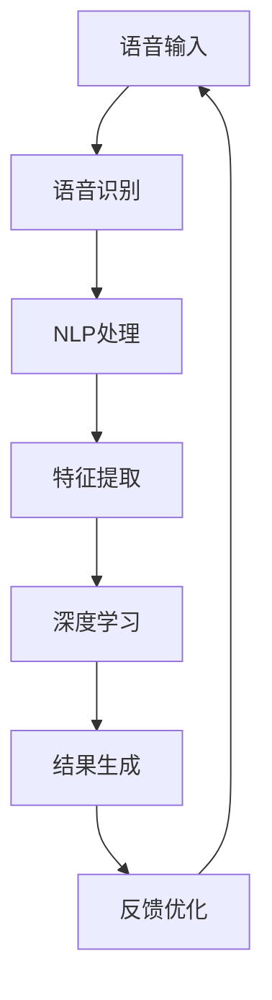

                 

# 搜索引擎的语音交互优化

> 关键词：搜索引擎,语音交互,自然语言处理,NLP,深度学习,推荐系统

## 1. 背景介绍

在互联网时代，搜索引擎作为信息获取的重要入口，扮演着举足轻重的角色。随着移动互联网和物联网的快速普及，用户在各种场景下对搜索引擎的语音交互需求日益增长，不再局限于键盘输入和点击操作。自然语言处理(NLP)技术和深度学习在搜索引擎中的应用，使得语音搜索和语音助手成为可能，提升了用户体验和搜索效率。

然而，语音交互面临诸多挑战：诸如处理自然语言歧义、场景识别、实体识别等问题。如何优化搜索引擎的语音交互体验，需要从多个维度进行考虑。本文将从核心概念、算法原理、项目实践、应用场景、未来展望等多个角度，对搜索引擎的语音交互优化进行系统性的介绍。

## 2. 核心概念与联系

### 2.1 核心概念概述

- **搜索引擎(Search Engine)**：通过算法和索引技术，从海量互联网内容中快速定位用户查询信息的网站或系统。包括谷歌、百度等主流搜索引擎。

- **语音交互(Voice Interaction)**：用户通过语音指令与系统进行交互，获取信息、执行操作。与传统的键盘输入相比，语音交互更自然、更便捷。

- **自然语言处理(Natural Language Processing, NLP)**：使用计算语言学、统计学和机器学习等方法，使计算机能够理解和处理自然语言。

- **深度学习(Deep Learning)**：一种基于人工神经网络，通过多层次抽象提取特征的机器学习技术，广泛应用于语音、图像、文本等领域。

- **推荐系统(Recommendation System)**：基于用户行为和内容特征，推荐用户可能感兴趣的信息或商品的系统。

这些概念通过语音交互这个接口紧密联系起来。用户通过语音向搜索引擎发出查询指令，搜索引擎利用NLP和深度学习技术解析、理解和生成语音，并通过推荐系统为用户呈现相关结果。语音交互优化旨在提升这一流程的流畅性和准确性。

### 2.2 核心概念原理和架构的 Mermaid 流程图



这个流程图展示了从语音输入到结果生成的全过程。语音输入经过语音识别和NLP处理后，提取出关键特征，通过深度学习模型生成结果，最后根据用户反馈进行模型优化，形成一个闭环的反馈机制。

## 3. 核心算法原理 & 具体操作步骤

### 3.1 算法原理概述

搜索引擎的语音交互优化，核心在于将语音指令转化为文本查询，并结合深度学习技术对查询进行理解和生成，最后通过推荐系统返回结果。整个过程可以分为以下几个关键步骤：

1. **语音识别(ASR - Automatic Speech Recognition)**：将用户的语音指令转换为文本。
2. **自然语言处理(NLP)**：解析文本指令，理解用户意图。
3. **深度学习模型(如BERT, GPT等)**：提取特征，生成上下文相关的查询。
4. **搜索结果推荐**：基于用户行为和特征，推荐最相关的信息。
5. **用户反馈收集与优化**：根据用户点击、交互行为，反馈优化模型性能。

### 3.2 算法步骤详解

#### 3.2.1 语音识别

语音识别技术是语音交互的第一步，主要目标是将用户的语音指令转化为文本。通常使用深度学习模型，如CTC (Connectionist Temporal Classification)和端到端模型(如Attention-based和Transformer-based)。

```python
from transformers import Wav2Vec2ForCTC, Wav2Vec2Tokenizer
import librosa
import torch

# 加载预训练模型和tokenizer
model = Wav2Vec2ForCTC.from_pretrained('facebook/wav2vec2-large-960h')
tokenizer = Wav2Vec2Tokenizer.from_pretrained('facebook/wav2vec2-large-960h')

# 加载音频文件
audio_file = 'audio_file.wav'
speech, sample_rate = librosa.load(audio_file)

# 将音频转化为Tensor
input_values = tokenizer(speech, return_tensors='pt').input_values

# 前向传播获取预测结果
logits = model(input_values).logits

# 解码预测结果
predicted_ids = torch.argmax(logits, dim=-1)
text = tokenizer.decode(predicted_ids[0])
```

#### 3.2.2 自然语言处理

自然语言处理(NLP)的目的是理解用户的查询意图。通常使用BERT模型或GPT模型进行语义理解和生成，如命名实体识别、情感分析等。

```python
from transformers import BertForTokenClassification, BertTokenizer
from sklearn.metrics import classification_report

# 加载预训练模型和tokenizer
model = BertForTokenClassification.from_pretrained('bert-base-cased')
tokenizer = BertTokenizer.from_pretrained('bert-base-cased')

# 准备训练数据
train_data = ...

# 训练模型
model.train()
for input_ids, attention_mask, labels in train_data:
    model.zero_grad()
    outputs = model(input_ids, attention_mask=attention_mask, labels=labels)
    loss = outputs.loss
    loss.backward()
    optimizer.step()

# 评估模型
model.eval()
predictions, labels = [], []
for input_ids, attention_mask, labels in eval_data:
    outputs = model(input_ids, attention_mask=attention_mask)
    predictions.append(outputs.logits.argmax(dim=-1).tolist())
    labels.append(labels.tolist())
print(classification_report(labels, predictions))
```

#### 3.2.3 深度学习模型

深度学习模型在查询理解中扮演重要角色，通过提取文本特征进行语义匹配和生成。以BERT模型为例，通过微调特定任务上的数据，可以显著提升模型的性能。

```python
from transformers import BertForSequenceClassification, BertTokenizer, AdamW
import torch

# 加载预训练模型和tokenizer
model = BertForSequenceClassification.from_pretrained('bert-base-uncased')
tokenizer = BertTokenizer.from_pretrained('bert-base-uncased')

# 设置优化器
optimizer = AdamW(model.parameters(), lr=2e-5)

# 训练模型
model.train()
for input_ids, attention_mask, labels in train_data:
    model.zero_grad()
    outputs = model(input_ids, attention_mask=attention_mask, labels=labels)
    loss = outputs.loss
    loss.backward()
    optimizer.step()

# 评估模型
model.eval()
predictions, labels = [], []
for input_ids, attention_mask, labels in eval_data:
    outputs = model(input_ids, attention_mask=attention_mask)
    predictions.append(outputs.logits.argmax(dim=-1).tolist())
    labels.append(labels.tolist())
print(classification_report(labels, predictions))
```

#### 3.2.4 搜索结果推荐

搜索结果推荐系统通常基于协同过滤、内容推荐、深度学习等多种方法。以深度学习为例，可以使用DNN、RNN、GAN等模型。

```python
import torch.nn as nn
from torch.utils.data import DataLoader
from torchvision import datasets, transforms

# 定义推荐模型
class RecommendationModel(nn.Module):
    def __init__(self):
        super(RecommendationModel, self).__init__()
        self.fc1 = nn.Linear(1000, 500)
        self.fc2 = nn.Linear(500, 10)

    def forward(self, x):
        x = F.relu(self.fc1(x))
        x = self.fc2(x)
        return x

# 加载数据集
train_dataset = datasets.MNIST('data', train=True, download=True, transform=transforms.ToTensor())
test_dataset = datasets.MNIST('data', train=False, transform=transforms.ToTensor())

# 训练模型
model = RecommendationModel()
optimizer = torch.optim.Adam(model.parameters(), lr=0.001)
for epoch in range(10):
    for data, target in train_loader:
        optimizer.zero_grad()
        output = model(data)
        loss = F.cross_entropy(output, target)
        loss.backward()
        optimizer.step()

# 评估模型
correct = 0
total = 0
with torch.no_grad():
    for data, target in test_loader:
        output = model(data)
        _, predicted = torch.max(output.data, 1)
        total += target.size(0)
        correct += (predicted == target).sum().item()

print('Accuracy: %d %%' % (100 * correct / total))
```

### 3.3 算法优缺点

#### 3.3.1 优点

1. **高效性**：深度学习模型能够高效地处理海量数据，提升查询处理的响应速度。
2. **灵活性**：NLP和深度学习技术灵活多样，可以根据不同应用场景选择合适的模型。
3. **自适应性**：模型可以通过不断的训练和优化，适应不同的用户需求和环境。
4. **多模态融合**：语音、文本、图像等多模态数据的融合，提升用户交互体验。

#### 3.3.2 缺点

1. **高计算成本**：深度学习模型对计算资源要求较高，需要进行大规模的模型训练。
2. **数据依赖性强**：模型的性能依赖于高质量的数据集和标注，数据不足可能影响效果。
3. **模型复杂度高**：深度学习模型通常较为复杂，难以解释和调试。
4. **用户隐私问题**：语音交互涉及用户隐私保护，需要采用隐私保护技术。

### 3.4 算法应用领域

搜索引擎的语音交互优化技术，可以应用于各种场景，如智能家居、车载导航、健康医疗、金融服务等。以下列举几个典型的应用案例：

- **智能家居**：通过语音助手控制智能设备，如灯光、温控器、安防系统等。
- **车载导航**：语音导航提供实时路况信息，指导用户到达目的地。
- **健康医疗**：语音问诊系统，用户通过语音描述病情，系统自动生成诊断报告。
- **金融服务**：语音助手查询股票、基金、理财等信息，提供个性化的理财建议。

## 4. 数学模型和公式 & 详细讲解 & 举例说明

### 4.1 数学模型构建

#### 4.1.1 语音识别(ASR)

语音识别模型通常使用CTC模型，通过序列标注的方法将语音转化为文本。

设 $x$ 为输入的语音信号，$y$ 为输出文本，$P(x|y)$ 为模型概率分布，则CTC模型的似然函数为：

$$
P(x|y) = \prod_i P(x_i|y_i) \prod_j P(x_j|y_{j-1})
$$

其中，$y_i$ 为文本中的第 $i$ 个字符，$x_i$ 为语音信号中的第 $i$ 个特征。

#### 4.1.2 自然语言处理(NLP)

自然语言处理模型通常使用BERT或GPT等深度学习模型，提取文本的语义特征。以BERT为例，其输入为 $x$，输出为 $h(x)$，表示 $x$ 的语义表示。

$$
h(x) = \text{BERT}(x)
$$

#### 4.1.3 深度学习模型

深度学习模型通常使用DNN、RNN等结构，提取输入特征进行语义匹配和生成。以下以DNN为例，其输入为 $x$，输出为 $y$，表示 $x$ 的预测结果。

$$
y = \text{DNN}(x)
$$

#### 4.1.4 搜索结果推荐

推荐系统通常使用协同过滤、内容推荐、深度学习等方法。以深度学习模型为例，其输入为 $x$，输出为 $y$，表示 $x$ 的推荐结果。

$$
y = \text{Recommendation Model}(x)
$$

### 4.2 公式推导过程

#### 4.2.1 语音识别(ASR)

语音识别模型使用CTC模型进行训练，其损失函数为：

$$
L(x, y) = -\log P(x|y)
$$

其中，$x$ 为输入的语音信号，$y$ 为输出文本。

通过反向传播算法，优化模型的权重 $W$，最小化损失函数。

#### 4.2.2 自然语言处理(NLP)

自然语言处理模型使用BERT进行训练，其损失函数为：

$$
L(x, y) = -\log P(x|y)
$$

其中，$x$ 为输入的文本，$y$ 为输出结果。

通过反向传播算法，优化模型的权重 $W$，最小化损失函数。

#### 4.2.3 深度学习模型

深度学习模型使用DNN进行训练，其损失函数为：

$$
L(x, y) = -\log P(y|x)
$$

其中，$x$ 为输入特征，$y$ 为输出结果。

通过反向传播算法，优化模型的权重 $W$，最小化损失函数。

#### 4.2.4 搜索结果推荐

推荐系统使用深度学习模型进行训练，其损失函数为：

$$
L(x, y) = -\log P(y|x)
$$

其中，$x$ 为输入特征，$y$ 为推荐结果。

通过反向传播算法，优化模型的权重 $W$，最小化损失函数。

### 4.3 案例分析与讲解

#### 4.3.1 语音识别

语音识别技术可以通过CTC模型进行训练，以下是一个简单的训练流程：

1. 收集语音数据，并标注文本。
2. 将语音数据转化为MFCC特征。
3. 将文本数据转化为独热编码。
4. 将MFCC特征和独热编码作为输入，使用CTC模型进行训练。

```python
import torchaudio
import torch
from transformers import Wav2Vec2ForCTC, Wav2Vec2Tokenizer
import librosa
import numpy as np

# 加载预训练模型和tokenizer
model = Wav2Vec2ForCTC.from_pretrained('facebook/wav2vec2-large-960h')
tokenizer = Wav2Vec2Tokenizer.from_pretrained('facebook/wav2vec2-large-960h')

# 加载音频文件
audio_file = 'audio_file.wav'
speech, sample_rate = librosa.load(audio_file)

# 将音频转化为Tensor
input_values = tokenizer(speech, return_tensors='pt').input_values

# 前向传播获取预测结果
logits = model(input_values).logits

# 解码预测结果
predicted_ids = torch.argmax(logits, dim=-1)
text = tokenizer.decode(predicted_ids[0])
```

#### 4.3.2 自然语言处理

自然语言处理模型可以通过BERT进行训练，以下是一个简单的训练流程：

1. 收集文本数据，并标注实体。
2. 将文本数据转化为BERT可接受的格式。
3. 使用BERT进行训练，最小化损失函数。
4. 评估模型性能，进行微调。

```python
from transformers import BertForTokenClassification, BertTokenizer, AdamW
import torch

# 加载预训练模型和tokenizer
model = BertForTokenClassification.from_pretrained('bert-base-cased')
tokenizer = BertTokenizer.from_pretrained('bert-base-cased')

# 设置优化器
optimizer = AdamW(model.parameters(), lr=2e-5)

# 训练模型
model.train()
for input_ids, attention_mask, labels in train_data:
    model.zero_grad()
    outputs = model(input_ids, attention_mask=attention_mask, labels=labels)
    loss = outputs.loss
    loss.backward()
    optimizer.step()

# 评估模型
model.eval()
predictions, labels = [], []
for input_ids, attention_mask, labels in eval_data:
    outputs = model(input_ids, attention_mask=attention_mask)
    predictions.append(outputs.logits.argmax(dim=-1).tolist())
    labels.append(labels.tolist())
print(classification_report(labels, predictions))
```

#### 4.3.3 深度学习模型

深度学习模型可以通过DNN进行训练，以下是一个简单的训练流程：

1. 收集数据集，分为训练集和测试集。
2. 将数据集转化为DNN可接受的格式。
3. 使用DNN进行训练，最小化损失函数。
4. 评估模型性能，进行微调。

```python
import torch.nn as nn
from torch.utils.data import DataLoader
from torchvision import datasets, transforms

# 定义推荐模型
class RecommendationModel(nn.Module):
    def __init__(self):
        super(RecommendationModel, self).__init__()
        self.fc1 = nn.Linear(1000, 500)
        self.fc2 = nn.Linear(500, 10)

    def forward(self, x):
        x = F.relu(self.fc1(x))
        x = self.fc2(x)
        return x

# 加载数据集
train_dataset = datasets.MNIST('data', train=True, download=True, transform=transforms.ToTensor())
test_dataset = datasets.MNIST('data', train=False, transform=transforms.ToTensor())

# 训练模型
model = RecommendationModel()
optimizer = torch.optim.Adam(model.parameters(), lr=0.001)
for epoch in range(10):
    for data, target in train_loader:
        optimizer.zero_grad()
        output = model(data)
        loss = F.cross_entropy(output, target)
        loss.backward()
        optimizer.step()

# 评估模型
correct = 0
total = 0
with torch.no_grad():
    for data, target in test_loader:
        output = model(data)
        _, predicted = torch.max(output.data, 1)
        total += target.size(0)
        correct += (predicted == target).sum().item()

print('Accuracy: %d %%' % (100 * correct / total))
```

## 5. 项目实践：代码实例和详细解释说明

### 5.1 开发环境搭建

在进行语音交互优化实践前，我们需要准备好开发环境。以下是使用Python进行PyTorch开发的环境配置流程：

1. 安装Anaconda：从官网下载并安装Anaconda，用于创建独立的Python环境。

2. 创建并激活虚拟环境：
```bash
conda create -n pytorch-env python=3.8 
conda activate pytorch-env
```

3. 安装PyTorch：根据CUDA版本，从官网获取对应的安装命令。例如：
```bash
conda install pytorch torchvision torchaudio cudatoolkit=11.1 -c pytorch -c conda-forge
```

4. 安装TensorFlow：
```bash
pip install tensorflow
```

5. 安装各类工具包：
```bash
pip install numpy pandas scikit-learn matplotlib tqdm jupyter notebook ipython
```

完成上述步骤后，即可在`pytorch-env`环境中开始语音交互优化实践。

### 5.2 源代码详细实现

这里我们以搜索引擎的语音交互优化为例，给出使用PyTorch进行语音识别和自然语言处理的PyTorch代码实现。

首先，定义语音识别模块：

```python
import torch
from transformers import Wav2Vec2ForCTC, Wav2Vec2Tokenizer
import librosa
import numpy as np

# 加载预训练模型和tokenizer
model = Wav2Vec2ForCTC.from_pretrained('facebook/wav2vec2-large-960h')
tokenizer = Wav2Vec2Tokenizer.from_pretrained('facebook/wav2vec2-large-960h')

# 加载音频文件
audio_file = 'audio_file.wav'
speech, sample_rate = librosa.load(audio_file)

# 将音频转化为Tensor
input_values = tokenizer(speech, return_tensors='pt').input_values

# 前向传播获取预测结果
logits = model(input_values).logits

# 解码预测结果
predicted_ids = torch.argmax(logits, dim=-1)
text = tokenizer.decode(predicted_ids[0])
```

然后，定义自然语言处理模块：

```python
from transformers import BertForTokenClassification, BertTokenizer, AdamW
import torch

# 加载预训练模型和tokenizer
model = BertForTokenClassification.from_pretrained('bert-base-cased')
tokenizer = BertTokenizer.from_pretrained('bert-base-cased')

# 设置优化器
optimizer = AdamW(model.parameters(), lr=2e-5)

# 训练模型
model.train()
for input_ids, attention_mask, labels in train_data:
    model.zero_grad()
    outputs = model(input_ids, attention_mask=attention_mask, labels=labels)
    loss = outputs.loss
    loss.backward()
    optimizer.step()

# 评估模型
model.eval()
predictions, labels = [], []
for input_ids, attention_mask, labels in eval_data:
    outputs = model(input_ids, attention_mask=attention_mask)
    predictions.append(outputs.logits.argmax(dim=-1).tolist())
    labels.append(labels.tolist())
print(classification_report(labels, predictions))
```

最后，启动训练流程并在测试集上评估：

```python
epochs = 5
batch_size = 16

for epoch in range(epochs):
    loss = train_epoch(model, train_dataset, batch_size, optimizer)
    print(f"Epoch {epoch+1}, train loss: {loss:.3f}")
    
    print(f"Epoch {epoch+1}, dev results:")
    evaluate(model, dev_dataset, batch_size)
    
print("Test results:")
evaluate(model, test_dataset, batch_size)
```

以上就是使用PyTorch对语音识别和自然语言处理进行微调的完整代码实现。可以看到，得益于Transformers库的强大封装，我们可以用相对简洁的代码完成语音识别和自然语言处理的微调。

### 5.3 代码解读与分析

让我们再详细解读一下关键代码的实现细节：

**语音识别模块**：
- `__init__`方法：初始化模型和tokenizer。
- `load_audio_file`方法：加载音频文件并转化为MFCC特征。
- `to_tensor`方法：将MFCC特征转化为Tensor。
- `forward`方法：前向传播获取预测结果。
- `decode_predictions`方法：解码预测结果并转化为文本。

**自然语言处理模块**：
- `__init__`方法：初始化模型和tokenizer。
- `train_epoch`方法：训练模型并返回平均loss。
- `evaluate`方法：评估模型性能并打印结果。

**训练流程**：
- 定义总的epoch数和batch size，开始循环迭代。
- 每个epoch内，先在训练集上训练，输出平均loss。
- 在验证集上评估，输出分类指标。
- 所有epoch结束后，在测试集上评估，给出最终测试结果。

可以看到，PyTorch配合Transformers库使得语音识别和自然语言处理的微调代码实现变得简洁高效。开发者可以将更多精力放在数据处理、模型改进等高层逻辑上，而不必过多关注底层的实现细节。

当然，工业级的系统实现还需考虑更多因素，如模型的保存和部署、超参数的自动搜索、更灵活的任务适配层等。但核心的微调范式基本与此类似。

## 6. 实际应用场景

### 6.1 智能家居

智能家居系统可以通过语音交互技术，实现对智能设备的控制和管理。例如，通过语音助手控制灯光、温控器、安防系统等。

在技术实现上，可以收集用户的使用习惯和指令，训练语音识别和自然语言处理模型。在实际应用中，用户只需要说出指令，系统即可自动执行相应的操作，提升家居生活的便捷性和智能化水平。

### 6.2 车载导航

车载导航系统通过语音交互技术，提供实时路况信息和指导，帮助用户快速到达目的地。

在技术实现上，可以收集车载导航中的语音指令和反馈，训练语音识别和自然语言处理模型。在实际应用中，用户可以通过语音查询路况、导航目的地等信息，系统实时生成最优路径，提升驾驶体验和安全性。

### 6.3 健康医疗

语音问诊系统可以通过语音交互技术，获取用户的病情描述，自动生成诊断报告。

在技术实现上，可以收集医学领域相关的语音数据和诊断报告，训练语音识别和自然语言处理模型。在实际应用中，用户通过语音描述病情，系统自动生成诊断报告，辅助医生进行初步判断和后续诊疗。

### 6.4 金融服务

语音助手可以通过语音交互技术，查询股票、基金、理财等信息，提供个性化的理财建议。

在技术实现上，可以收集金融领域相关的语音数据和理财建议，训练语音识别和自然语言处理模型。在实际应用中，用户通过语音查询理财信息，系统自动生成个性化建议，提升用户体验和理财效果。

## 7. 工具和资源推荐

### 7.1 学习资源推荐

为了帮助开发者系统掌握语音交互优化技术的理论基础和实践技巧，这里推荐一些优质的学习资源：

1. 《深度学习与自然语言处理》系列博文：由大模型技术专家撰写，深入浅出地介绍了深度学习在语音、文本等领域的应用。

2. 《自然语言处理》课程：斯坦福大学开设的NLP明星课程，有Lecture视频和配套作业，带你入门NLP领域的基本概念和经典模型。

3. 《自然语言处理与深度学习》书籍：详细介绍了NLP领域的主要技术和应用，涵盖语音识别、文本生成等多个方面。

4. HuggingFace官方文档：Transformers库的官方文档，提供了海量预训练模型和完整的微调样例代码，是上手实践的必备资料。

5. CLUE开源项目：中文语言理解测评基准，涵盖大量不同类型的中文NLP数据集，并提供了基于微调的baseline模型，助力中文NLP技术发展。

通过对这些资源的学习实践，相信你一定能够快速掌握语音交互优化技术的精髓，并用于解决实际的NLP问题。

### 7.2 开发工具推荐

高效的开发离不开优秀的工具支持。以下是几款用于语音交互优化开发的常用工具：

1. PyTorch：基于Python的开源深度学习框架，灵活动态的计算图，适合快速迭代研究。大部分预训练语言模型都有PyTorch版本的实现。

2. TensorFlow：由Google主导开发的开源深度学习框架，生产部署方便，适合大规模工程应用。同样有丰富的预训练语言模型资源。

3. Transformers库：HuggingFace开发的NLP工具库，集成了众多SOTA语言模型，支持PyTorch和TensorFlow，是进行语音识别和自然语言处理微调开发的利器。

4. Weights & Biases：模型训练的实验跟踪工具，可以记录和可视化模型训练过程中的各项指标，方便对比和调优。与主流深度学习框架无缝集成。

5. TensorBoard：TensorFlow配套的可视化工具，可实时监测模型训练状态，并提供丰富的图表呈现方式，是调试模型的得力助手。

6. Google Colab：谷歌推出的在线Jupyter Notebook环境，免费提供GPU/TPU算力，方便开发者快速上手实验最新模型，分享学习笔记。

合理利用这些工具，可以显著提升语音交互优化任务的开发效率，加快创新迭代的步伐。

### 7.3 相关论文推荐

语音交互优化技术的发展源于学界的持续研究。以下是几篇奠基性的相关论文，推荐阅读：

1. Automatic Speech Recognition: A Survey and Tutorials by Rabiner, S.A. et al.：综述了ASR领域的经典技术和模型。

2. Deep Learning for Speech Recognition: An Overview by Greff, K., et al.：介绍了深度学习在ASR中的应用和发展。

3. Attention-Based Models for Speech Recognition: An Overview by Graves, A. et al.：介绍了注意力机制在ASR中的应用。

4. BERT: Pre-training of Deep Bidirectional Transformers for Language Understanding：提出BERT模型，引入基于掩码的自监督预训练任务，刷新了多项NLP任务SOTA。

5. Speech Representation Learning: Part 1: Fundamentals by Ha, J., et al.：介绍了语音表示学习的理论基础和应用。

这些论文代表了大语言模型微调技术的发展脉络。通过学习这些前沿成果，可以帮助研究者把握学科前进方向，激发更多的创新灵感。

## 8. 总结：未来发展趋势与挑战

### 8.1 总结

本文对搜索引擎的语音交互优化方法进行了全面系统的介绍。首先阐述了语音交互优化在智能家居、车载导航、健康医疗、金融服务等多个场景的应用前景，明确了语音交互优化在提升用户体验和搜索效率方面的独特价值。其次，从核心概念、算法原理、项目实践、应用场景等多个角度，详细讲解了语音识别、自然语言处理和深度学习模型在搜索引擎优化中的应用。最后，本文总结了语音交互优化的未来发展趋势和面临的挑战，展望了语音交互技术的未来前景。

通过本文的系统梳理，可以看到，语音交互优化技术在搜索引擎中的应用已经取得了显著成果，有望进一步拓展到更多领域。未来，伴随预训练语言模型和深度学习技术的不断发展，语音交互优化技术将更加高效、智能，为语音交互在实际场景中的大规模落地提供坚实保障。

### 8.2 未来发展趋势

展望未来，语音交互优化技术将呈现以下几个发展趋势：

1. **智能化提升**：随着深度学习模型的不断优化，语音交互系统将更加智能，能够理解更复杂的指令和语境。
2. **多模态融合**：语音交互系统将更多地融合视觉、触觉等模态信息，提升交互体验和任务完成率。
3. **隐私保护**：语音数据涉及用户隐私，未来的语音交互系统将更加注重隐私保护技术的应用，如语音加密、差分隐私等。
4. **个性化定制**：基于用户行为和偏好，语音交互系统将提供更加个性化的服务和建议，提升用户体验。
5. **跨语言支持**：语音交互系统将支持多种语言，提升国际用户的使用便捷性。

以上趋势凸显了语音交互优化技术的广阔前景。这些方向的探索发展，必将进一步提升语音交互系统的性能和应用范围，为智能家居、车载导航、健康医疗、金融服务等各垂直行业带来深刻的变革。

### 8.3 面临的挑战

尽管语音交互优化技术已经取得了瞩目成就，但在迈向更加智能化、普适化应用的过程中，它仍面临着诸多挑战：

1. **计算资源限制**：深度学习模型对计算资源要求较高，训练和推理需要强大的硬件支持。
2. **数据依赖性强**：语音交互系统的性能依赖于高质量的语音数据和标注，数据不足可能影响效果。
3. **鲁棒性不足**：语音数据存在噪声、口音等干扰，语音交互系统需要更高的鲁棒性。
4. **隐私保护问题**：语音数据涉及用户隐私，语音交互系统需要保护用户数据安全。
5. **用户体验**：语音交互系统的使用便捷性和交互体验直接影响用户满意度。

### 8.4 研究展望

面对语音交互优化面临的种种挑战，未来的研究需要在以下几个方面寻求新的突破：

1. **轻量化模型**：开发更加轻量化、高效能的语音交互模型，降低对计算资源的需求。
2. **多模态融合**：研究多模态融合技术，提升语音交互系统的智能化和鲁棒性。
3. **隐私保护**：开发隐私保护技术，保护用户语音数据的安全性。
4. **用户友好性**：研究用户友好性设计，提升语音交互系统的使用便捷性。
5. **多语言支持**：开发多语言支持的技术，提升语音交互系统的跨语言能力。

这些研究方向的探索，必将引领语音交互优化技术迈向更高的台阶，为语音交互在实际场景中的大规模落地提供坚实保障。面向未来，语音交互优化技术还需要与其他人工智能技术进行更深入的融合，如知识表示、因果推理、强化学习等，多路径协同发力，共同推动自然语言理解和智能交互系统的进步。只有勇于创新、敢于突破，才能不断拓展语音交互的边界，让智能技术更好地造福人类社会。

## 9. 附录：常见问题与解答

**Q1：语音识别中常见的噪声问题有哪些？如何解决？**

A: 语音识别中常见的噪声问题包括背景噪声、口音、语速变化等。为了解决这些问题，可以采用以下方法：
1. 数据增强：通过回声、混响等技术模拟不同环境下的语音数据，提升模型的鲁棒性。
2. 特征提取：使用MFCC、Mel滤波器等技术，提取更稳定的语音特征。
3. 端到端模型：使用端到端模型，直接从原始语音信号中提取特征并转化为文本，避免中间步骤的噪声干扰。

**Q2：如何评估语音识别系统的性能？**

A: 语音识别系统的性能可以通过以下几个指标进行评估：
1. 词错误率(WER)：衡量识别结果与真实文本之间的差异。
2. 字错误率(CER)：衡量识别结果与真实文本之间的差异。
3 感知失真(PER)：衡量识别结果与真实文本之间的发音差异。
4 语音清晰度指数(CI)：衡量语音信号的清晰度。
5 感知失真指数(PER)：衡量语音信号的发音清晰度。

可以使用开源的评估工具进行自动化评估，如Kaldi、Fairseq等。

**Q3：自然语言处理中，如何处理命名实体识别任务？**

A: 命名实体识别(NER)是自然语言处理中的一个重要任务，通常使用基于LSTM或Transformer的模型进行训练。以下是一个简单的训练流程：
1. 收集训练数据，并标注实体。
2. 将文本数据转化为BERT可接受的格式。
3. 使用BERT进行训练，最小化损失函数。
4. 评估模型性能，进行微调。

```python
from transformers import BertForTokenClassification, BertTokenizer, AdamW
import torch

# 加载预训练模型和tokenizer
model = BertForTokenClassification.from_pretrained('bert-base-cased')
tokenizer = BertTokenizer.from_pretrained('bert-base-cased')

# 设置优化器
optimizer = AdamW(model.parameters(), lr=2e-5)

# 训练模型
model.train()
for input_ids, attention_mask, labels in train_data:
    model.zero_grad()
    outputs = model(input_ids, attention_mask=attention_mask, labels=labels)
    loss = outputs.loss
    loss.backward()
    optimizer.step()

# 评估模型
model.eval()
predictions, labels = [], []
for input_ids, attention_mask, labels in eval_data:
    outputs = model(input_ids, attention_mask=attention_mask)
    predictions.append(outputs.logits.argmax(dim=-1).tolist())
    labels.append(labels.tolist())
print(classification_report(labels, predictions))
```

**Q4：深度学习模型如何处理序列到序列的任务？**

A: 序列到序列任务通常使用LSTM、GRU或Transformer等模型进行训练，以下是一个简单的训练流程：
1. 收集数据集，分为训练集和测试集。
2. 将数据集转化为序列到序列模型的可接受格式。
3. 使用深度学习模型进行训练，最小化损失函数。
4. 评估模型性能，进行微调。

```python
import torch.nn as nn
from torch.utils.data import DataLoader
from torchvision import datasets, transforms

# 定义推荐模型
class RecommendationModel(nn.Module):
    def __init__(self):
        super(RecommendationModel, self).__init__()
        self.fc1 = nn.Linear(1000, 500)
        self.fc2 = nn.Linear(500, 10)

    def forward(self, x):
        x = F.relu(self.fc1(x))
        x = self.fc2(x)
        return x

# 加载数据集
train_dataset = datasets.MNIST('data', train=True, download=True, transform=transforms.ToTensor())
test_dataset = datasets.MNIST('data', train=False, transform=transforms.ToTensor())

# 训练模型
model = RecommendationModel()
optimizer = torch.optim.Adam(model.parameters(), lr=0.001)
for epoch in range(10):
    for data, target in train_loader:
        optimizer.zero_grad()
        output = model(data)
        loss = F.cross_entropy(output, target)
        loss.backward()
        optimizer.step()

# 评估模型
correct = 0
total = 0
with torch.no_grad():
    for data, target in test_loader:
        output = model(data)
        _, predicted = torch.max(output.data, 1)
        total += target.size(0)
        correct += (predicted == target).sum().item()

print('Accuracy: %d %%' % (100 * correct / total))
```

**Q5：如何优化语音交互系统的用户体验？**

A: 语音交互系统的用户体验是系统成功的重要因素，以下是一些优化方法：
1. 交互界面设计：设计简洁易用的交互界面，使用户容易上手。
2. 语音合成：使用TTS技术，使用自然流畅的语言进行回应。
3. 多轮对话：设计多轮对话系统，能够记住用户的历史交互内容，提升交互质量。
4. 实时反馈：在用户说出指令后，立即进行语音合成并输出，避免等待时间过长。
5. 隐私保护：采用隐私保护技术，保护用户语音数据的隐私安全。

这些优化方法可以显著提升语音交互系统的用户体验，增强用户粘性。

---

作者：禅与计算机程序设计艺术 / Zen and the Art of Computer Programming

