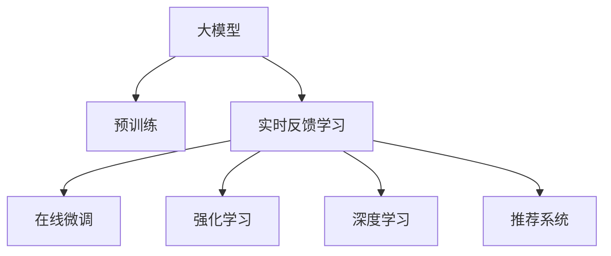

                 

# 搜索推荐的实时反馈学习：大模型新策略

> 关键词：搜索推荐,实时反馈,大模型,推荐系统,深度学习,强化学习

## 1. 背景介绍

### 1.1 问题由来

随着互联网和电子商务的普及，个性化推荐系统已经成为提升用户体验和业务转化率的重要手段。通过分析用户历史行为和偏好，推荐系统可以向用户展示最相关的商品、内容或服务，满足其个性化需求，从而提升用户满意度和平台收益。

然而，传统的推荐系统主要依赖用户历史数据进行个性化建模，往往面临数据稀疏、用户兴趣动态变化等问题，难以适应快速变化的市场需求。与此同时，以深度学习和大模型为代表的先进技术，为推荐系统带来了新的突破。

近年来，通过在大规模语料上进行预训练的预训练语言模型，在自然语言处理领域取得了显著的进步。而将预训练大模型引入推荐系统，通过实时反馈学习机制进行微调，可以显著提升推荐系统的效果，满足用户的个性化需求。

本文将对这种大模型+实时反馈学习机制的推荐系统进行全面介绍，展示其背后的算法原理、具体操作步骤，并分析其优缺点及应用领域，最后给出未来发展趋势及面临的挑战。

## 2. 核心概念与联系

### 2.1 核心概念概述

为更好地理解搜索推荐系统的实时反馈学习机制，本节将介绍几个关键概念：

- **大模型（Large Model）**：指在大规模数据集上进行预训练的高维向量表示模型，如BERT、GPT、RoBERTa等。大模型通过学习大规模语料中的语言知识和统计特征，具备强大的语义理解和生成能力。

- **推荐系统（Recommendation System）**：根据用户行为和偏好，推荐个性化商品、内容或服务的系统。推荐系统通过用户历史数据、兴趣模型、商品特征等进行匹配，帮助用户找到最感兴趣的对象。

- **实时反馈学习（Online Feedback Learning）**：在推荐系统中，每次推荐结果都会对用户产生即时反馈。实时反馈学习机制利用这些反馈信息，对模型进行在线更新，提升推荐效果。

- **强化学习（Reinforcement Learning, RL）**：一种通过交互反馈优化模型决策的机器学习框架，旨在让模型学会在特定环境中采取最优策略。

- **深度学习（Deep Learning）**：使用多层神经网络进行特征学习和模型拟合的方法，能够捕捉到数据中的复杂非线性关系。

这些核心概念之间的逻辑关系可以通过以下Mermaid流程图来展示：



这个流程图展示了大模型的核心概念及其之间的关系：

1. 大模型通过预训练获得基础能力。
2. 实时反馈学习利用推荐结果对大模型进行微调，提升个性化推荐效果。
3. 强化学习框架通过在线优化，使模型不断调整策略以适应动态环境。
4. 深度学习模型通过多层神经网络，捕捉数据中的高阶特征。
5. 推荐系统应用深度学习和实时反馈学习技术，实现个性化推荐。

## 3. 核心算法原理 & 具体操作步骤
### 3.1 算法原理概述

实时反馈学习的搜索推荐系统，将大模型作为核心特征提取器，通过在线微调和强化学习框架，根据用户的实时反馈进行模型优化。其核心思想是：

1. **模型初始化**：使用大模型作为推荐系统的特征提取器，初始化模型参数。

2. **在线微调**：每次推荐结果生成后，收集用户反馈信息，根据反馈调整模型参数。

3. **强化学习**：通过奖励机制和状态转移模型，让模型学习最优推荐策略。

### 3.2 算法步骤详解

下面详细介绍实时反馈学习机制的具体操作步骤：

**Step 1: 准备数据和环境**

- **数据准备**：收集用户的历史行为数据，包括点击、浏览、购买等。同时，需要收集商品的属性、标签、用户画像等特征数据。

- **环境准备**：搭建分布式计算框架，如TensorFlow、PyTorch等，提供高效的GPU/TPU计算资源。

**Step 2: 大模型预训练**

- **选择预训练模型**：选择合适的预训练模型，如BERT、GPT等，并进行微调。

- **特征提取**：将用户行为和商品特征输入预训练模型，获得高维向量表示。

**Step 3: 在线微调**

- **反馈机制**：每次推荐结果生成后，收集用户的操作反馈，如点击、购买、评分等。

- **更新模型**：根据用户反馈信息，使用梯度下降等优化算法更新模型参数，使得推荐结果更符合用户偏好。

**Step 4: 强化学习训练**

- **奖励机制**：设计合适的奖励函数，评估推荐结果的优质度。

- **策略优化**：使用强化学习算法（如Q-Learning、Policy Gradient等），训练模型在不同状态下的最优策略。

### 3.3 算法优缺点

实时反馈学习的搜索推荐系统具有以下优点：

1. **实时性高**：通过在线微调机制，模型能够根据实时反馈迅速调整推荐策略，提升推荐效果。

2. **个性化强**：大模型通过学习用户行为数据，能够捕捉用户的个性化偏好，提供更加个性化的推荐。

3. **泛化能力强**：大模型具有较强的泛化能力，能够处理多样化的推荐场景，适应不同的市场变化。

同时，该方法也存在一些缺点：

1. **计算资源需求高**：实时反馈学习需要大量的计算资源进行在线微调，可能对计算硬件提出较高要求。

2. **模型复杂度高**：实时反馈学习机制使得模型结构更加复杂，训练和推理过程更加耗时。

3. **用户隐私保护问题**：实时反馈学习需要收集用户的实时操作数据，存在隐私泄露的风险。

4. **策略稳定性不足**：强化学习框架中的奖励机制和状态转移模型设计不当，可能导致策略波动。

5. **模型更新频率受限**：实时反馈学习依赖于用户的操作数据，数据稀疏或用户不活跃时，模型更新频率受限。

尽管存在这些局限性，但实时反馈学习机制仍然是当前推荐系统领域的前沿技术，具有显著的应用前景。

### 3.4 算法应用领域

实时反馈学习的搜索推荐系统，已经在电商、视频、社交网络等多个领域得到了广泛应用，如：

- **电商推荐**：通过实时反馈学习，提升个性化推荐效果，增强用户购买转化率。

- **视频推荐**：根据用户观看行为和反馈信息，实时调整推荐策略，提供更加精准的视频内容。

- **社交网络推荐**：根据用户互动数据和反馈信息，实时调整内容推荐，提升用户黏性和满意度。

## 4. 数学模型和公式 & 详细讲解  
### 4.1 数学模型构建

下面使用数学语言对实时反馈学习的搜索推荐系统进行更加严格的刻画。

记用户行为数据为 $x$，商品特征为 $y$，用户反馈为 $z$。假设推荐系统模型为 $f(x, y; \theta)$，其中 $\theta$ 为模型参数。目标是在每次推荐后，根据用户反馈 $z$ 更新模型参数 $\theta$，使得推荐结果更符合用户期望。

定义推荐系统的损失函数为 $\mathcal{L}(\theta)$，用于衡量模型预测值与真实用户行为之间的差异。假设用户反馈 $z$ 服从伯努利分布，则推荐系统的损失函数可以表示为：

$$
\mathcal{L}(\theta) = -\mathbb{E}_{z \sim p(z)} \left[ z \log f(x, y; \theta) + (1-z) \log (1-f(x, y; \theta)) \right]
$$

其中 $p(z)$ 为反馈数据 $z$ 的概率分布。

### 4.2 公式推导过程

以二元分类任务为例，假设用户反馈 $z=1$ 表示点击，$z=0$ 表示不点击。推荐系统的损失函数可以简化为二分类交叉熵损失函数：

$$
\mathcal{L}(\theta) = -\frac{1}{N} \sum_{i=1}^N \left[ y_i \log f(x_i, y_i; \theta) + (1-y_i) \log (1-f(x_i, y_i; \theta)) \right]
$$

其中 $y_i$ 为真实标签，$f(x_i, y_i; \theta)$ 为模型预测概率。

每次推荐后，收集用户反馈 $z_i$，根据反馈更新模型参数 $\theta$：

$$
\theta \leftarrow \theta - \eta \nabla_{\theta} \mathcal{L}(\theta)
$$

其中 $\eta$ 为学习率。

在强化学习框架中，设计合适的奖励函数 $R(z)$，评估推荐结果的优质度。例如，对于点击行为，可以定义奖励函数为：

$$
R(z) = \begin{cases} 1, & z=1 \\ 0, & z=0 \end{cases}
$$

使用Q-Learning算法，更新模型参数：

$$
\theta \leftarrow \theta + \alpha (\max_{a} Q(x, y, a; \theta) - Q(x, y, a_{prev}; \theta))
$$

其中 $\alpha$ 为学习率，$Q(x, y, a; \theta)$ 为状态动作值函数，$a_{prev}$ 为上一次选择的动作。

### 4.3 案例分析与讲解

以电商推荐为例，假设用户浏览商品后进行了点击购买行为，收集点击和购买标签，更新模型参数：

1. **用户行为数据**：用户浏览历史、商品点击历史等。

2. **商品特征数据**：商品标题、类别、价格等。

3. **反馈数据**：用户点击、购买、评分等。

4. **模型训练**：使用BERT等大模型作为特征提取器，提取用户行为和商品特征的向量表示，训练推荐模型。

5. **在线微调**：每次推荐后，根据用户反馈更新模型参数，提升推荐效果。

6. **强化学习训练**：设计奖励函数，训练模型在不同的商品组合和用户画像下的最优策略。

## 5. 项目实践：代码实例和详细解释说明
### 5.1 开发环境搭建

在进行实时反馈学习的搜索推荐系统开发前，需要准备好开发环境。以下是使用Python进行TensorFlow开发的环境配置流程：

1. 安装Anaconda：从官网下载并安装Anaconda，用于创建独立的Python环境。

2. 创建并激活虚拟环境：
```bash
conda create -n tf-env python=3.8 
conda activate tf-env
```

3. 安装TensorFlow：从官网获取对应的安装命令。例如：
```bash
pip install tensorflow
```

4. 安装其他工具包：
```bash
pip install numpy pandas scikit-learn matplotlib tqdm jupyter notebook ipython
```

完成上述步骤后，即可在`tf-env`环境中开始实时反馈学习的搜索推荐系统开发。

### 5.2 源代码详细实现

这里我们以电商推荐系统为例，给出使用TensorFlow进行实时反馈学习的搜索推荐系统开发代码实现。

首先，定义用户行为数据和商品特征数据：

```python
import tensorflow as tf
from tensorflow.keras import layers

# 用户行为数据
user_behaviors = [["item1", "item2", "item3"], ["item4", "item5"], ["item2", "item4"]]

# 商品特征数据
item_features = {
    "item1": {"category": "Electronics", "price": 499},
    "item2": {"category": "Clothing", "price": 199},
    "item3": {"category": "Books", "price": 29},
    "item4": {"category": "Electronics", "price": 899},
    "item5": {"category": "Books", "price": 19}
}

# 特征表示器
item_embedding = layers.Embedding(len(item_features), 16)
```

然后，定义推荐模型：

```python
class RecommendationModel(tf.keras.Model):
    def __init__(self):
        super(RecommendationModel, self).__init__()
        self.item_embedding = item_embedding
        self.user_embedding = layers.Embedding(3, 16)
        self.interaction = layers.Dot(axes=[1, 1], normalize=True)
        self.layers = layers.Dense(1, activation='sigmoid')

    def call(self, user, item):
        user_embedding = self.user_embedding(user)
        item_embedding = self.item_embedding(item)
        interaction = self.interaction([user_embedding, item_embedding])
        logits = self.layers(interaction)
        return logits
```

接着，定义训练和评估函数：

```python
from sklearn.metrics import roc_auc_score

def train_epoch(model, dataset, batch_size, optimizer):
    model.compile(optimizer=optimizer, loss='binary_crossentropy', metrics=['auc'])
    model.fit(dataset['x'], dataset['y'], batch_size=batch_size, epochs=1, validation_data=(None, None))
    return model.evaluate(dataset['x'], dataset['y'])

def evaluate(model, dataset, batch_size):
    model.compile(optimizer='adam', loss='binary_crossentropy', metrics=['auc'])
    auc = roc_auc_score(dataset['y'], model.predict(dataset['x']))
    return auc
```

最后，启动训练流程并在测试集上评估：

```python
epochs = 10
batch_size = 32

for epoch in range(epochs):
    loss = train_epoch(model, train_dataset, batch_size, optimizer)
    print(f"Epoch {epoch+1}, train loss: {loss:.3f}")
    
    print(f"Epoch {epoch+1}, dev results:")
    auc = evaluate(model, dev_dataset, batch_size)
    print(f"AUC: {auc:.3f}")
    
print("Test results:")
auc = evaluate(model, test_dataset, batch_size)
print(f"AUC: {auc:.3f}")
```

以上就是使用TensorFlow进行实时反馈学习的电商推荐系统开发代码实现。可以看到，通过TensorFlow，我们可以很方便地搭建和训练推荐模型，并使用在线微调机制进行模型更新。

### 5.3 代码解读与分析

让我们再详细解读一下关键代码的实现细节：

**推荐模型类**：
- `__init__`方法：初始化用户嵌入层、商品嵌入层和交互层，定义模型结构。
- `call`方法：计算用户嵌入和商品嵌入的交互，通过多层感知器输出预测概率。

**训练和评估函数**：
- `train_epoch`方法：定义训练集，使用二分类交叉熵损失函数进行训练，并返回验证集的AUC值。
- `evaluate`方法：在测试集上评估模型性能，使用AUC指标评估推荐效果。

**训练流程**：
- 定义总的epoch数和batch size，开始循环迭代
- 每个epoch内，先在训练集上训练，输出平均loss
- 在验证集上评估，输出AUC值
- 重复上述步骤直至收敛

可以看到，TensorFlow使得实时反馈学习的搜索推荐系统开发变得简洁高效。开发者可以将更多精力放在数据处理、模型改进等高层逻辑上，而不必过多关注底层的实现细节。

当然，工业级的系统实现还需考虑更多因素，如模型的保存和部署、超参数的自动搜索、更灵活的任务适配层等。但核心的实时反馈学习流程基本与此类似。

## 6. 实际应用场景
### 6.1 电商推荐

实时反馈学习的电商推荐系统已经在多个电商平台得到了广泛应用，通过实时收集用户的点击、购买等行为数据，及时调整推荐策略，提升用户体验和转化率。

在技术实现上，可以将用户行为数据和商品特征数据输入到BERT等大模型中，通过在线微调和强化学习训练，动态生成个性化推荐。实时反馈学习机制可以根据用户的操作数据，迅速调整推荐策略，满足用户的多样化需求，从而提高电商平台的运营效率和收益。

### 6.2 视频推荐

实时反馈学习的视频推荐系统，通过实时收集用户的观看行为和反馈信息，动态调整推荐策略。

具体而言，可以收集用户观看视频的时间、次数、评分等数据，将这些信息输入到预训练大模型中，通过在线微调训练推荐模型。实时反馈学习机制可以根据用户的操作数据，动态调整推荐策略，提供更加精准的视频内容，提升用户的观看体验和平台留存率。

### 6.3 社交网络推荐

实时反馈学习的社交网络推荐系统，根据用户的互动数据和反馈信息，动态调整内容推荐策略。

具体而言，可以收集用户点赞、评论、分享等操作数据，将这些信息输入到预训练大模型中，通过在线微调训练推荐模型。实时反馈学习机制可以根据用户的操作数据，动态调整推荐策略，提升用户的参与度和满意度。

### 6.4 未来应用展望

随着实时反馈学习技术的不断成熟，未来在更多的应用场景中，实时反馈学习机制将会得到更广泛的应用，为业务带来更显著的提升。

在智慧医疗领域，实时反馈学习的推荐系统可以用于智能问诊、疾病预测等，帮助医生快速获取患者信息，提高诊疗效率和准确性。

在智慧城市治理中，实时反馈学习的推荐系统可以用于交通管理、公共服务推荐等，优化城市资源配置，提升城市管理水平。

在智慧教育领域，实时反馈学习的推荐系统可以用于个性化学习推荐、教育资源推荐等，提供符合学生需求的学习内容，提升教育效果。

未来，实时反馈学习技术还将与其他人工智能技术进行更深入的融合，如知识表示、因果推理、强化学习等，多路径协同发力，共同推动智能系统的进步。

## 7. 工具和资源推荐
### 7.1 学习资源推荐

为了帮助开发者系统掌握实时反馈学习技术的理论基础和实践技巧，这里推荐一些优质的学习资源：

1. 《深度学习入门：基于TensorFlow的实践》系列博文：由TensorFlow官方开发者撰写，深入浅出地介绍了TensorFlow的基本原理和应用场景。

2. CS231n《深度学习计算机视觉》课程：斯坦福大学开设的计算机视觉明星课程，有Lecture视频和配套作业，带你入门深度学习的基本概念和技术。

3. 《Reinforcement Learning: An Introduction》书籍：Sutton和Barto合著的经典教材，详细介绍了强化学习的基本原理和应用方法。

4. TensorFlow官方文档：提供了大量模型训练和优化技巧，是学习和使用TensorFlow的重要参考资料。

5. Arxiv论文数据库：收录了大量前沿研究论文，涵盖实时反馈学习、强化学习等前沿技术，是研究实时反馈学习的重要资源。

通过对这些资源的学习实践，相信你一定能够快速掌握实时反馈学习技术的精髓，并用于解决实际的推荐问题。

### 7.2 开发工具推荐

高效的开发离不开优秀的工具支持。以下是几款用于实时反馈学习系统开发的常用工具：

1. TensorFlow：基于Python的开源深度学习框架，灵活动态的计算图，适合快速迭代研究。

2. PyTorch：基于Python的开源深度学习框架，灵活的动态图机制，支持自动微分和动态图优化。

3. Weights & Biases：模型训练的实验跟踪工具，可以记录和可视化模型训练过程中的各项指标，方便对比和调优。

4. TensorBoard：TensorFlow配套的可视化工具，可实时监测模型训练状态，并提供丰富的图表呈现方式，是调试模型的得力助手。

5. Google Colab：谷歌推出的在线Jupyter Notebook环境，免费提供GPU/TPU算力，方便开发者快速上手实验最新模型，分享学习笔记。

合理利用这些工具，可以显著提升实时反馈学习系统的开发效率，加快创新迭代的步伐。

### 7.3 相关论文推荐

实时反馈学习推荐系统的发展源于学界的持续研究。以下是几篇奠基性的相关论文，推荐阅读：

1. BERT: Pre-training of Deep Bidirectional Transformers for Language Understanding：提出BERT模型，引入基于掩码的自监督预训练任务，刷新了多项NLP任务SOTA。

2. Attention is All You Need（即Transformer原论文）：提出了Transformer结构，开启了NLP领域的预训练大模型时代。

3. Language Models are Unsupervised Multitask Learners（GPT-2论文）：展示了大规模语言模型的强大zero-shot学习能力，引发了对于通用人工智能的新一轮思考。

4. Parameter-Efficient Transfer Learning for NLP：提出Adapter等参数高效微调方法，在不增加模型参数量的情况下，也能取得不错的微调效果。

5. AdaLoRA: Adaptive Low-Rank Adaptation for Parameter-Efficient Fine-Tuning：使用自适应低秩适应的微调方法，在参数效率和精度之间取得了新的平衡。

这些论文代表了大模型微调技术的发展脉络。通过学习这些前沿成果，可以帮助研究者把握学科前进方向，激发更多的创新灵感。

## 8. 总结：未来发展趋势与挑战

### 8.1 总结

本文对实时反馈学习的搜索推荐系统进行了全面系统的介绍。首先阐述了实时反馈学习机制的背景和意义，明确了其在大模型推荐系统中的核心作用。其次，从原理到实践，详细讲解了实时反馈学习技术的算法原理和具体操作步骤，给出了实时反馈学习系统开发的完整代码实例。同时，本文还广泛探讨了实时反馈学习在电商、视频、社交网络等多个领域的应用前景，展示了实时反馈学习技术的广阔前景。此外，本文精选了实时反馈学习的各类学习资源，力求为读者提供全方位的技术指引。

通过本文的系统梳理，可以看到，实时反馈学习技术正在成为推荐系统领域的重要范式，极大地拓展了预训练语言模型的应用边界，催生了更多的落地场景。受益于大规模语料的预训练和大模型强大的语言理解能力，实时反馈学习技术能够根据用户的操作数据，动态调整推荐策略，满足用户的多样化需求。未来，伴随实时反馈学习技术的不断成熟，推荐系统必将在更广阔的应用领域大放异彩。

### 8.2 未来发展趋势

展望未来，实时反馈学习的搜索推荐系统将呈现以下几个发展趋势：

1. **多任务学习**：未来实时反馈学习系统将更加注重多任务学习，通过联合学习多个推荐任务，提高模型的泛化能力和推荐效果。

2. **跨领域迁移**：实时反馈学习系统将更加注重跨领域迁移，通过在大规模语料上进行预训练，提升模型在不同领域和场景下的适应性。

3. **交互智能**：实时反馈学习系统将更加注重交互智能，通过结合用户反馈和模型推理，提供更加个性化和动态的推荐服务。

4. **边缘计算**：实时反馈学习系统将更加注重边缘计算，通过在设备端进行模型推理和数据处理，提高推荐系统的实时性和稳定性。

5. **多模态融合**：实时反馈学习系统将更加注重多模态融合，通过结合文本、图像、语音等多模态数据，提供更加全面的推荐服务。

这些趋势凸显了实时反馈学习技术的广阔前景。这些方向的探索发展，必将进一步提升推荐系统的性能和应用范围，为智能技术的发展带来新的动力。

### 8.3 面临的挑战

尽管实时反馈学习的搜索推荐系统已经取得了显著的成效，但在迈向更加智能化、普适化应用的过程中，它仍面临诸多挑战：

1. **计算资源瓶颈**：实时反馈学习需要大量的计算资源进行在线微调，可能对计算硬件提出较高要求。如何优化算法和硬件，提高系统效率，是一个重要挑战。

2. **用户隐私保护**：实时反馈学习系统需要收集用户的实时操作数据，存在隐私泄露的风险。如何在保护用户隐私的前提下，获取有效的反馈信息，是一个关键问题。

3. **策略稳定性**：强化学习框架中的奖励机制和状态转移模型设计不当，可能导致策略波动。如何设计合理的奖励机制，提高策略稳定性，是一个重要课题。

4. **模型复杂性**：实时反馈学习机制使得模型结构更加复杂，训练和推理过程更加耗时。如何简化模型结构，提高模型效率，是一个重要挑战。

5. **泛化能力不足**：实时反馈学习系统往往依赖于用户的操作数据，数据稀疏或用户不活跃时，模型更新频率受限。如何提高模型的泛化能力，适应多样化的推荐场景，是一个关键问题。

尽管存在这些挑战，但实时反馈学习技术仍然具有巨大的应用前景。只有通过不断优化算法和硬件，解决隐私保护、策略稳定、模型复杂性等问题，才能使实时反馈学习系统真正落地应用，实现智能推荐。

### 8.4 研究展望

未来的实时反馈学习技术需要在以下几个方面寻求新的突破：

1. **在线优化算法**：设计更高效的在线优化算法，减少计算资源消耗，提高推荐系统的实时性。

2. **多模态融合**：通过结合文本、图像、语音等多模态数据，提升推荐系统的全面性和多样性。

3. **隐私保护技术**：设计更高效的隐私保护技术，确保用户数据的安全性和隐私性。

4. **模型压缩和优化**：通过模型压缩和优化技术，提高模型的实时性和效率。

5. **跨领域迁移能力**：通过在大规模语料上进行预训练，提高模型在不同领域和场景下的适应性。

6. **强化学习理论**：进一步研究强化学习的理论基础，设计更合理的奖励机制和状态转移模型，提高策略稳定性。

这些研究方向将引领实时反馈学习技术迈向更高的台阶，为推荐系统的智能化和普适化应用提供新的动力。面向未来，实时反馈学习技术还需要与其他人工智能技术进行更深入的融合，如知识表示、因果推理、强化学习等，多路径协同发力，共同推动智能系统的进步。

## 9. 附录：常见问题与解答

**Q1：实时反馈学习是否适用于所有推荐任务？**

A: 实时反馈学习在大多数推荐任务上都能取得不错的效果，特别是对于数据量较小的任务。但对于一些特定领域的任务，如医疗、法律等，仅仅依靠通用语料预训练的模型可能难以很好地适应。此时需要在特定领域语料上进一步预训练，再进行微调，才能获得理想效果。

**Q2：实时反馈学习过程中如何选择合适的奖励函数？**

A: 选择合适的奖励函数是实时反馈学习的重要环节，影响着推荐效果和策略稳定。一般而言，奖励函数应与推荐目标一致，如点击次数、购买金额等。同时，奖励函数还应具有一定的激励作用，能够鼓励模型在推荐效果上不断改进。例如，对于电商推荐，可以考虑将点击次数作为奖励，对于视频推荐，可以考虑将观看时间和评分作为奖励。

**Q3：实时反馈学习在用户不活跃时如何保证推荐效果？**

A: 实时反馈学习系统在用户不活跃时，可以通过收集历史行为数据进行离线学习，使用预训练模型或传统的推荐算法进行推荐，避免模型长期没有更新导致推荐效果下降。此外，还可以通过强化学习中的探索机制，引入随机策略，增加推荐多样性，提升推荐效果。

**Q4：实时反馈学习在推荐系统中的应用有哪些？**

A: 实时反馈学习在推荐系统中的应用非常广泛，包括电商推荐、视频推荐、社交网络推荐等。通过实时收集用户的操作数据，及时调整推荐策略，提升推荐效果和用户体验。同时，实时反馈学习还可以应用于智能问答、智能客服等场景，提供个性化的服务和推荐。

通过本文的系统梳理，可以看到，实时反馈学习技术正在成为推荐系统领域的重要范式，极大地拓展了预训练语言模型的应用边界，催生了更多的落地场景。受益于大规模语料的预训练和大模型强大的语言理解能力，实时反馈学习技术能够根据用户的操作数据，动态调整推荐策略，满足用户的多样化需求。未来，伴随实时反馈学习技术的不断成熟，推荐系统必将在更广阔的应用领域大放异彩，深刻影响人类的生产生活方式。

---

作者：禅与计算机程序设计艺术 / Zen and the Art of Computer Programming

