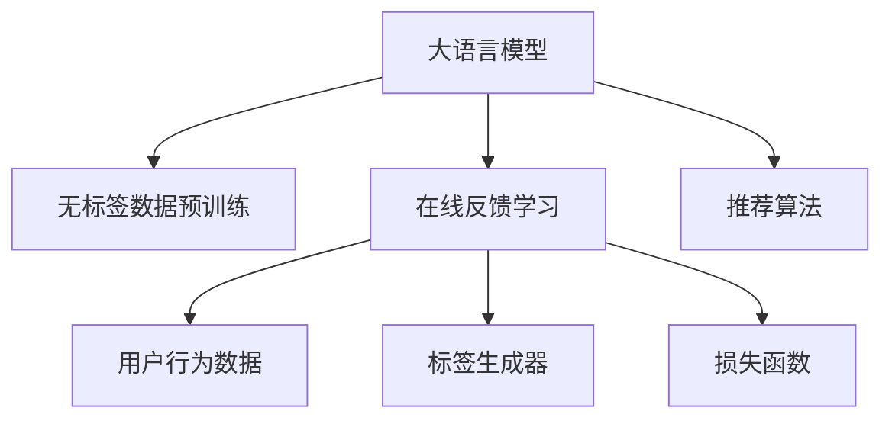

                 

# 搜索推荐的实时反馈学习：大模型的在线更新策略

## 1. 背景介绍

随着互联网和电子商务的迅猛发展，搜索推荐系统已成为提升用户体验和平台流量变现的重要手段。传统推荐系统通过分析用户历史行为数据，挖掘用户兴趣，生成推荐内容。但这种方法存在显著局限，难以应对动态变化的用户需求和兴趣，且缺乏对实时反馈信息的利用。随着深度学习和大模型技术的兴起，实时反馈学习(Online Feedback Learning, OFL)方法逐渐成为推荐系统的重要补充。

实时反馈学习通过在线训练模型参数，将用户实时反馈信息（如点击、购买、评分等）纳入模型训练过程，从而不断优化模型性能。与传统的离线训练不同，OFL方法允许模型在真实数据流上持续更新，以适应不断变化的动态用户需求。

大语言模型如BERT、GPT等，凭借其庞大的参数量和丰富的语言知识，成为OFL推荐算法的重要工具。通过在大规模无标签语料上进行预训练，大模型可以抽取通用的语言特征，然后通过实时反馈学习进行微调，适应特定领域的推荐任务。

## 2. 核心概念与联系

### 2.1 核心概念概述

为深入理解大语言模型在搜索推荐中的实时反馈学习，我们需要理解以下几个核心概念：

- 大语言模型(Large Language Model, LLM)：以自回归(如GPT)或自编码(如BERT)模型为代表的大规模预训练语言模型。通过在大规模无标签文本语料上进行预训练，学习通用的语言知识和常识，具备强大的语言理解和生成能力。

- 实时反馈学习(Online Feedback Learning, OFL)：通过在线训练模型参数，不断利用用户实时反馈信息优化模型的方法。OFL方法使模型能够实时适应动态的用户需求，显著提升推荐系统的精准度和个性化程度。

- 带标签数据(Labeled Data)：包括用户行为数据（如点击、购买、评分等），用于模型在线更新的监督信号。

- 无标签数据(Unlabeled Data)：包括文本、图片、视频等非结构化数据，用于大语言模型的预训练和初始化。

- 推荐算法(Recommender Algorithm)：结合用户特征、物品特征和模型预测，生成推荐结果的算法。

### 2.2 核心概念原理和架构的 Mermaid 流程图



这个流程图展示了大语言模型在搜索推荐系统中的关键步骤：

1. 大语言模型通过无标签数据进行预训练，学习通用的语言知识。
2. 通过在线反馈学习，利用实时用户行为数据进行微调，适应特定的推荐任务。
3. 推荐算法结合用户特征、物品特征和模型预测，生成推荐结果。

## 3. 核心算法原理 & 具体操作步骤

### 3.1 算法原理概述

大语言模型在搜索推荐系统中的实时反馈学习，本质上是一个在线增量学习的过程。其核心思想是：利用用户实时反馈信息，在线更新模型参数，不断优化模型预测。

具体来说，假设预训练的大语言模型为 $M_{\theta}$，其中 $\theta$ 为预训练得到的模型参数。给定推荐系统用户的实时行为数据 $D_t=\{(x_t, y_t)\}_{t=1}^T$，其中 $x_t$ 为当前时间步的推荐请求，$y_t$ 为推荐结果（点击、购买、评分等）。

推荐系统通过在线训练，不断更新模型参数 $\theta$，使得模型输出的推荐结果逼近真实用户反馈，从而优化推荐策略。模型训练目标最小化预测错误，即：

$$
\theta^* = \mathop{\arg\min}_{\theta} \mathcal{L}(M_{\theta},D_t)
$$

其中 $\mathcal{L}$ 为针对推荐任务设计的损失函数，用于衡量模型预测输出与真实标签之间的差异。常见的损失函数包括交叉熵损失、均方误差损失等。

### 3.2 算法步骤详解

大语言模型在搜索推荐系统中的实时反馈学习，可以分为以下几个关键步骤：

**Step 1: 数据准备**
- 收集推荐系统用户的实时行为数据 $D_t=\{(x_t, y_t)\}_{t=1}^T$。
- 处理和清洗数据，构建训练集 $D=\{(x_i,y_i)\}_{i=1}^N$，其中 $x_i$ 为推荐请求，$y_i$ 为推荐结果。

**Step 2: 模型初始化**
- 加载预训练的大语言模型 $M_{\theta}$，作为模型初始化参数。
- 根据推荐任务设计合适的任务适配层，定义损失函数。

**Step 3: 在线学习**
- 对每个推荐请求 $x_t$，利用预训练模型 $M_{\theta}$ 进行前向传播，得到推荐结果 $z_t$。
- 将 $z_t$ 与用户反馈 $y_t$ 进行比较，计算预测误差 $\Delta_t$。
- 根据 $\Delta_t$ 更新模型参数 $\theta$，具体公式为：

$$
\theta \leftarrow \theta - \eta \nabla_{\theta}\mathcal{L}(z_t,y_t)
$$

其中 $\eta$ 为学习率，$\nabla_{\theta}\mathcal{L}(z_t,y_t)$ 为损失函数对参数 $\theta$ 的梯度，可通过反向传播算法高效计算。

**Step 4: 模型评估**
- 周期性在测试集 $D_{test}$ 上评估模型性能，记录推荐精度等指标。
- 根据评估结果调整超参数，如学习率、批大小、迭代轮数等。

**Step 5: 模型部署**
- 使用微调后的模型进行实时推荐，结合用户特征和物品特征生成推荐结果。
- 不断收集新数据，进行模型迭代更新。

### 3.3 算法优缺点

实时反馈学习具有以下优点：
1. 灵活适应动态用户需求。通过不断利用用户实时反馈信息，模型能够实时调整，适应不断变化的用户兴趣和需求。
2. 提高推荐精度。通过实时反馈学习，模型能够更准确地捕捉用户真实偏好，提升推荐效果。
3. 提升个性化程度。实时反馈学习能够不断学习用户新行为，提供更加个性化的推荐内容。

但实时反馈学习也存在一些局限性：
1. 对数据流要求较高。实时反馈学习需要不断的数据流输入，一旦数据流中断或出现异常，系统容易崩溃。
2. 模型更新代价高。在线学习需要对模型参数进行频繁的更新，可能会导致模型收敛速度变慢。
3. 过拟合风险增加。在线学习容易受到噪声干扰，模型容易过拟合于训练数据。
4. 数据隐私问题。实时反馈学习需要收集和分析用户行为数据，存在一定的数据隐私风险。

尽管存在这些局限性，但实时反馈学习在实际应用中仍是大模型推荐系统的重要补充，能够显著提升推荐系统的精准度和个性化程度。

### 3.4 算法应用领域

实时反馈学习在搜索推荐系统中具有广泛的应用，适用于各种NLP和视觉任务。以下是几个典型应用场景：

- 电商平台推荐：通过对用户点击、购买、评分等行为进行实时反馈学习，优化推荐策略，提升用户体验和转化率。
- 新闻推荐：利用用户阅读点击数据进行实时反馈学习，动态调整新闻内容推荐，提高用户停留时间和阅读体验。
- 视频推荐：通过用户观看记录、点赞、分享等行为进行实时反馈学习，生成个性化视频推荐。
- 音乐推荐：利用用户收听、分享、评论等行为进行实时反馈学习，生成音乐推荐列表。
- 游戏推荐：通过玩家游戏行为数据进行实时反馈学习，动态调整游戏推荐，提升游戏黏性。

## 4. 数学模型和公式 & 详细讲解 & 举例说明

### 4.1 数学模型构建

大语言模型在搜索推荐系统中的实时反馈学习，可以通过以下数学模型进行刻画：

假设推荐系统用户的实时行为数据为 $D_t=\{(x_t, y_t)\}_{t=1}^T$，其中 $x_t$ 为推荐请求，$y_t$ 为推荐结果。

定义预训练模型 $M_{\theta}$ 在输入 $x_t$ 上的输出为 $\hat{y}_t=M_{\theta}(x_t) \in [0,1]$，表示模型预测推荐结果的概率。

定义模型在数据样本 $(x,y)$ 上的损失函数为 $\ell(M_{\theta}(x),y)$，则在数据集 $D$ 上的经验风险为：

$$
\mathcal{L}(\theta) = \frac{1}{N} \sum_{i=1}^N \ell(M_{\theta}(x_i),y_i)
$$

其中 $\ell$ 为针对推荐任务设计的损失函数，用于衡量模型预测输出与真实标签之间的差异。

在实践中，我们通常使用交叉熵损失函数：

$$
\ell(M_{\theta}(x),y) = -[y\log \hat{y} + (1-y)\log(1-\hat{y})]
$$

将 $\hat{y}_t$ 代入上式，得到：

$$
\mathcal{L}(\theta) = -\frac{1}{N}\sum_{i=1}^N [y_i\log M_{\theta}(x_i)+(1-y_i)\log(1-M_{\theta}(x_i))]
$$

根据链式法则，损失函数对参数 $\theta_k$ 的梯度为：

$$
\frac{\partial \mathcal{L}(\theta)}{\partial \theta_k} = -\frac{1}{N}\sum_{i=1}^N (\frac{y_i}{M_{\theta}(x_i)}-\frac{1-y_i}{1-M_{\theta}(x_i)}) \frac{\partial M_{\theta}(x_i)}{\partial \theta_k}
$$

其中 $\frac{\partial M_{\theta}(x_i)}{\partial \theta_k}$ 可进一步递归展开，利用自动微分技术完成计算。

### 4.2 公式推导过程

以下我们以二分类任务为例，推导交叉熵损失函数及其梯度的计算公式。

假设模型 $M_{\theta}$ 在输入 $x$ 上的输出为 $\hat{y}=M_{\theta}(x) \in [0,1]$，表示样本属于正类的概率。真实标签 $y \in \{0,1\}$。则二分类交叉熵损失函数定义为：

$$
\ell(M_{\theta}(x),y) = -[y\log \hat{y} + (1-y)\log(1-\hat{y})]
$$

将其代入经验风险公式，得：

$$
\mathcal{L}(\theta) = -\frac{1}{N}\sum_{i=1}^N [y_i\log M_{\theta}(x_i)+(1-y_i)\log(1-M_{\theta}(x_i))]
$$

根据链式法则，损失函数对参数 $\theta_k$ 的梯度为：

$$
\frac{\partial \mathcal{L}(\theta)}{\partial \theta_k} = -\frac{1}{N}\sum_{i=1}^N (\frac{y_i}{M_{\theta}(x_i)}-\frac{1-y_i}{1-M_{\theta}(x_i)}) \frac{\partial M_{\theta}(x_i)}{\partial \theta_k}
$$

其中 $\frac{\partial M_{\theta}(x_i)}{\partial \theta_k}$ 可进一步递归展开，利用自动微分技术完成计算。

在得到损失函数的梯度后，即可带入参数更新公式，完成模型的迭代优化。重复上述过程直至收敛，最终得到适应下游任务的最优模型参数 $\theta^*$。

## 5. 项目实践：代码实例和详细解释说明

### 5.1 开发环境搭建

在进行实时反馈学习实践前，我们需要准备好开发环境。以下是使用Python进行PyTorch开发的环境配置流程：

1. 安装Anaconda：从官网下载并安装Anaconda，用于创建独立的Python环境。

2. 创建并激活虚拟环境：
```bash
conda create -n pytorch-env python=3.8 
conda activate pytorch-env
```

3. 安装PyTorch：根据CUDA版本，从官网获取对应的安装命令。例如：
```bash
conda install pytorch torchvision torchaudio cudatoolkit=11.1 -c pytorch -c conda-forge
```

4. 安装TensorFlow：
```bash
conda install tensorflow -c conda-forge
```

5. 安装各类工具包：
```bash
pip install numpy pandas scikit-learn matplotlib tqdm jupyter notebook ipython
```

完成上述步骤后，即可在`pytorch-env`环境中开始实时反馈学习实践。

### 5.2 源代码详细实现

下面我们以电商平台推荐为例，给出使用PyTorch对BERT模型进行实时反馈学习的PyTorch代码实现。

首先，定义推荐系统数据处理函数：

```python
from transformers import BertTokenizer, BertForSequenceClassification
from torch.utils.data import Dataset
import torch

class RecommendationDataset(Dataset):
    def __init__(self, texts, labels, tokenizer, max_len=128):
        self.texts = texts
        self.labels = labels
        self.tokenizer = tokenizer
        self.max_len = max_len
        
    def __len__(self):
        return len(self.texts)
    
    def __getitem__(self, item):
        text = self.texts[item]
        label = self.labels[item]
        
        encoding = self.tokenizer(text, return_tensors='pt', max_length=self.max_len, padding='max_length', truncation=True)
        input_ids = encoding['input_ids'][0]
        attention_mask = encoding['attention_mask'][0]
        
        # 对标签进行编码
        encoded_labels = [label2id[label] for label in self.labels] 
        encoded_labels.extend([label2id['O']] * (self.max_len - len(encoded_labels)))
        labels = torch.tensor(encoded_labels, dtype=torch.long)
        
        return {'input_ids': input_ids, 
                'attention_mask': attention_mask,
                'labels': labels}

# 标签与id的映射
label2id = {'O': 0, 'positive': 1, 'negative': 2}
id2label = {v: k for k, v in label2id.items()}

# 创建dataset
tokenizer = BertTokenizer.from_pretrained('bert-base-cased')

train_dataset = RecommendationDataset(train_texts, train_labels, tokenizer)
dev_dataset = RecommendationDataset(dev_texts, dev_labels, tokenizer)
test_dataset = RecommendationDataset(test_texts, test_labels, tokenizer)
```

然后，定义模型和优化器：

```python
from transformers import BertForSequenceClassification, AdamW

model = BertForSequenceClassification.from_pretrained('bert-base-cased', num_labels=len(label2id))

optimizer = AdamW(model.parameters(), lr=2e-5)
```

接着，定义训练和评估函数：

```python
from torch.utils.data import DataLoader
from tqdm import tqdm
from sklearn.metrics import classification_report

device = torch.device('cuda') if torch.cuda.is_available() else torch.device('cpu')
model.to(device)

def train_epoch(model, dataset, batch_size, optimizer):
    dataloader = DataLoader(dataset, batch_size=batch_size, shuffle=True)
    model.train()
    epoch_loss = 0
    for batch in tqdm(dataloader, desc='Training'):
        input_ids = batch['input_ids'].to(device)
        attention_mask = batch['attention_mask'].to(device)
        labels = batch['labels'].to(device)
        model.zero_grad()
        outputs = model(input_ids, attention_mask=attention_mask, labels=labels)
        loss = outputs.loss
        epoch_loss += loss.item()
        loss.backward()
        optimizer.step()
    return epoch_loss / len(dataloader)

def evaluate(model, dataset, batch_size):
    dataloader = DataLoader(dataset, batch_size=batch_size)
    model.eval()
    preds, labels = [], []
    with torch.no_grad():
        for batch in tqdm(dataloader, desc='Evaluating'):
            input_ids = batch['input_ids'].to(device)
            attention_mask = batch['attention_mask'].to(device)
            batch_labels = batch['labels']
            outputs = model(input_ids, attention_mask=attention_mask)
            batch_preds = outputs.logits.argmax(dim=2).to('cpu').tolist()
            batch_labels = batch_labels.to('cpu').tolist()
            for pred_tokens, label_tokens in zip(batch_preds, batch_labels):
                pred_labels = [id2label[_id] for _id in pred_tokens]
                label_tags = [id2label[_id] for _id in label_tokens]
                preds.append(pred_labels[:len(label_tags)])
                labels.append(label_tags)
                
    print(classification_report(labels, preds))
```

最后，启动训练流程并在测试集上评估：

```python
epochs = 5
batch_size = 16

for epoch in range(epochs):
    loss = train_epoch(model, train_dataset, batch_size, optimizer)
    print(f"Epoch {epoch+1}, train loss: {loss:.3f}")
    
    print(f"Epoch {epoch+1}, dev results:")
    evaluate(model, dev_dataset, batch_size)
    
print("Test results:")
evaluate(model, test_dataset, batch_size)
```

以上就是使用PyTorch对BERT进行电商平台推荐任务实时反馈学习的完整代码实现。可以看到，得益于Transformers库的强大封装，我们可以用相对简洁的代码完成BERT模型的加载和实时反馈学习。

### 5.3 代码解读与分析

让我们再详细解读一下关键代码的实现细节：

**RecommendationDataset类**：
- `__init__`方法：初始化文本、标签、分词器等关键组件。
- `__len__`方法：返回数据集的样本数量。
- `__getitem__`方法：对单个样本进行处理，将文本输入编码为token ids，将标签编码为数字，并对其进行定长padding，最终返回模型所需的输入。

**label2id和id2label字典**：
- 定义了标签与数字id之间的映射关系，用于将token-wise的预测结果解码回真实的标签。

**训练和评估函数**：
- 使用PyTorch的DataLoader对数据集进行批次化加载，供模型训练和推理使用。
- 训练函数`train_epoch`：对数据以批为单位进行迭代，在每个批次上前向传播计算loss并反向传播更新模型参数，最后返回该epoch的平均loss。
- 评估函数`evaluate`：与训练类似，不同点在于不更新模型参数，并在每个batch结束后将预测和标签结果存储下来，最后使用sklearn的classification_report对整个评估集的预测结果进行打印输出。

**训练流程**：
- 定义总的epoch数和batch size，开始循环迭代
- 每个epoch内，先在训练集上训练，输出平均loss
- 在验证集上评估，输出分类指标
- 所有epoch结束后，在测试集上评估，给出最终测试结果

可以看到，PyTorch配合Transformers库使得BERT实时反馈学习的代码实现变得简洁高效。开发者可以将更多精力放在数据处理、模型改进等高层逻辑上，而不必过多关注底层的实现细节。

当然，工业级的系统实现还需考虑更多因素，如模型的保存和部署、超参数的自动搜索、更灵活的任务适配层等。但核心的实时反馈学习范式基本与此类似。

## 6. 实际应用场景
### 6.1 电商推荐

实时反馈学习在电商推荐系统中得到了广泛应用。电商平台的推荐系统需要实时响应用户浏览和点击行为，动态调整推荐策略。通过实时反馈学习，电商推荐系统可以不断学习和适应用户的实时兴趣和需求，提升推荐效果。

具体实现上，可以利用用户点击、购买、评分等行为数据进行实时反馈学习，优化推荐模型，提升个性化推荐。例如，当用户点击某个商品时，系统会立即记录这一行为，并通过在线更新推荐模型，生成新的推荐结果。如果用户后续产生了购买行为，系统会记录这一行为，进一步优化推荐模型。如此循环，电商推荐系统能够实时响应用户需求，提供更精准、个性化的推荐。

### 6.2 新闻推荐

新闻推荐系统需要实时处理海量的新闻数据，并根据用户阅读和互动行为进行推荐。通过实时反馈学习，新闻推荐系统可以不断优化模型，提高推荐效果。

在实践上，新闻推荐系统可以采集用户阅读点击数据，利用实时反馈学习进行推荐模型优化。当用户点击一篇新闻时，系统会立即记录这一行为，并调整推荐模型，将类似新闻推荐给用户。如果用户阅读了新闻并评论或点赞，系统会记录这一行为，进一步优化推荐模型。通过实时反馈学习，新闻推荐系统能够动态调整推荐策略，提升用户阅读体验和平台黏性。

### 6.3 音乐推荐

音乐推荐系统需要实时响应用户听歌行为，动态调整推荐策略。通过实时反馈学习，音乐推荐系统可以不断优化模型，提升个性化推荐。

具体实现上，音乐推荐系统可以采集用户收听、分享、评论等行为数据，利用实时反馈学习进行推荐模型优化。当用户收听一首歌曲时，系统会立即记录这一行为，并调整推荐模型，推荐类似歌曲。如果用户分享歌曲或评论，系统会记录这一行为，进一步优化推荐模型。通过实时反馈学习，音乐推荐系统能够动态调整推荐策略，提升用户听歌体验和平台黏性。

## 7. 工具和资源推荐
### 7.1 学习资源推荐

为了帮助开发者系统掌握大语言模型实时反馈学习的基础理论和实践技巧，这里推荐一些优质的学习资源：

1. 《Deep Learning for NLP》课程：斯坦福大学开设的NLP入门课程，详细介绍了自然语言处理的基本概念和深度学习模型的应用。

2. 《Introduction to Deep Learning》书籍：深度学习领域的经典教材，涵盖深度学习的基本理论和实际应用。

3. 《Transformers: From Self-Attention to State-of-the-Art》书籍：Transformer模型的原理、应用和优化方法的详细介绍，适合深度学习和NLP领域的研究者阅读。

4. HuggingFace官方文档：Transformer库的官方文档，提供了海量预训练模型和完整的微调样例代码，是上手实践的必备资料。

5. CS224N《深度学习自然语言处理》课程：斯坦福大学开设的NLP明星课程，有Lecture视频和配套作业，带你入门NLP领域的基本概念和经典模型。

通过对这些资源的学习实践，相信你一定能够快速掌握大语言模型实时反馈学习的精髓，并用于解决实际的NLP问题。

### 7.2 开发工具推荐

高效的开发离不开优秀的工具支持。以下是几款用于大语言模型实时反馈学习开发的常用工具：

1. PyTorch：基于Python的开源深度学习框架，灵活动态的计算图，适合快速迭代研究。大部分预训练语言模型都有PyTorch版本的实现。

2. TensorFlow：由Google主导开发的开源深度学习框架，生产部署方便，适合大规模工程应用。同样有丰富的预训练语言模型资源。

3. Transformers库：HuggingFace开发的NLP工具库，集成了众多SOTA语言模型，支持PyTorch和TensorFlow，是进行实时反馈学习开发的利器。

4. Weights & Biases：模型训练的实验跟踪工具，可以记录和可视化模型训练过程中的各项指标，方便对比和调优。与主流深度学习框架无缝集成。

5. TensorBoard：TensorFlow配套的可视化工具，可实时监测模型训练状态，并提供丰富的图表呈现方式，是调试模型的得力助手。

6. Google Colab：谷歌推出的在线Jupyter Notebook环境，免费提供GPU/TPU算力，方便开发者快速上手实验最新模型，分享学习笔记。

合理利用这些工具，可以显著提升实时反馈学习的开发效率，加快创新迭代的步伐。

### 7.3 相关论文推荐

大语言模型实时反馈学习的研究源于学界的持续研究。以下是几篇奠基性的相关论文，推荐阅读：

1. Online Feedback Learning for Recommendation: A Survey：综述了实时反馈学习在推荐系统中的应用，详细介绍了不同在线反馈学习算法及其优化策略。

2. Deep Learning Recommender Systems: A Survey and Tutorial：综述了深度学习在推荐系统中的应用，详细介绍了基于深度学习的推荐算法和模型优化方法。

3. Click-Through Rate Prediction via Deep Learning: A Large-Scale Experiment on User-Item Interaction：利用深度学习模型进行点击率预测，并实时反馈学习优化模型。

4. Hypernetwork Approach to Transfer Learning and Few-shot Learning of Deep Neural Networks：提出Hypernetwork方法，实现参数高效的微调，减少模型更新代价。

5. SimCLR: A Novel Approach for Improving Unsupervised Feature Representation Learning with Deep Neural Networks：提出SimCLR方法，利用自监督学习提高特征表示的质量。

这些论文代表了大语言模型实时反馈学习的发展脉络。通过学习这些前沿成果，可以帮助研究者把握学科前进方向，激发更多的创新灵感。

## 8. 总结：未来发展趋势与挑战

### 8.1 总结

本文对大语言模型在搜索推荐系统中的实时反馈学习方法进行了全面系统的介绍。首先阐述了实时反馈学习的背景和意义，明确了实时反馈学习在提升推荐系统精准度和个性化程度方面的独特价值。其次，从原理到实践，详细讲解了实时反馈学习的数学模型和关键步骤，给出了实时反馈学习任务开发的完整代码实例。同时，本文还广泛探讨了实时反馈学习在电商推荐、新闻推荐、音乐推荐等多个行业领域的应用前景，展示了实时反馈学习范式的巨大潜力。此外，本文精选了实时反馈学习的各类学习资源，力求为读者提供全方位的技术指引。

通过本文的系统梳理，可以看到，实时反馈学习在搜索推荐系统中具有广泛的应用，通过不断利用用户实时反馈信息，优化模型性能，提升推荐效果。大语言模型凭借其庞大的参数量和丰富的语言知识，成为实时反馈学习的重要工具，显著提高了推荐系统的精准度和个性化程度。未来，伴随大语言模型和实时反馈学习的不断进步，搜索推荐系统必将取得更大的突破，为平台和用户带来更多价值。

### 8.2 未来发展趋势

展望未来，实时反馈学习在搜索推荐系统中将呈现以下几个发展趋势：

1. 推荐模型复杂度提升。随着深度学习和大模型技术的发展，推荐模型的复杂度将进一步提升，能够处理更加复杂和多样的用户需求。

2. 在线学习算法优化。实时反馈学习算法将不断优化，减少噪声干扰，提高模型收敛速度，增强模型泛化能力。

3. 多模态数据融合。未来的推荐系统将更加注重多模态数据的融合，结合文本、图像、语音等多种信息，提升推荐效果。

4. 混合学习范式。未来的推荐系统将采用混合学习范式，结合在线学习、离线学习、迁移学习等多种方法，优化推荐策略。

5. 公平性与多样性优化。推荐系统将更加注重公平性，避免推荐偏袒某一类用户，确保推荐内容的多样性，提升用户体验。

6. 实时动态推荐。推荐系统将实现实时动态推荐，根据用户实时行为，动态调整推荐策略，提高用户满意度。

以上趋势凸显了实时反馈学习在搜索推荐系统中的广阔前景。这些方向的探索发展，必将进一步提升推荐系统的精准度和个性化程度，为平台和用户带来更多价值。

### 8.3 面临的挑战

尽管实时反馈学习在推荐系统中的应用取得了显著成效，但在迈向更加智能化、普适化应用的过程中，它仍面临着诸多挑战：

1. 数据隐私问题。实时反馈学习需要收集和分析用户行为数据，存在一定的数据隐私风险。如何在保护用户隐私的前提下，优化推荐模型，是一个重要挑战。

2. 模型过拟合问题。在线学习容易受到噪声干扰，模型容易过拟合于训练数据。如何设计有效的正则化方法，防止过拟合，是一个重要研究方向。

3. 实时系统性能。实时反馈学习需要快速响应用户行为，对系统性能要求较高。如何在保证性能的同时，提高模型训练效率，是一个重要挑战。

4. 推荐内容质量。实时反馈学习需要不断优化推荐模型，提高推荐内容的质量。如何确保推荐内容的时效性和相关性，是一个重要研究方向。

5. 技术门槛问题。实时反馈学习涉及深度学习和大模型技术，技术门槛较高。如何降低技术门槛，提高开发效率，是一个重要挑战。

尽管存在这些挑战，但实时反馈学习在实际应用中仍是大模型推荐系统的重要补充，能够显著提升推荐系统的精准度和个性化程度。未来，研究者需要不断攻克这些挑战，优化实时反馈学习算法，提升推荐系统的性能和用户体验。

### 8.4 研究展望

面对实时反馈学习所面临的挑战，未来的研究需要在以下几个方面寻求新的突破：

1. 数据隐私保护：研究如何在保证用户隐私的前提下，优化实时反馈学习算法，利用用户数据进行推荐模型训练。

2. 模型泛化能力：研究如何设计有效的正则化方法，防止模型过拟合，提高推荐模型的泛化能力。

3. 实时系统优化：研究如何提高实时反馈学习系统的性能，优化模型训练和推理效率。

4. 推荐内容优化：研究如何提高推荐内容的质量，确保推荐内容的时效性和相关性。

5. 技术门槛降低：研究如何降低实时反馈学习的技术门槛，提高开发效率，使更多开发者能够参与推荐系统的构建。

这些研究方向的探索，必将引领实时反馈学习技术迈向更高的台阶，为推荐系统带来更大的突破，为平台和用户带来更多价值。面向未来，实时反馈学习技术还需要与其他人工智能技术进行更深入的融合，如知识表示、因果推理、强化学习等，多路径协同发力，共同推动推荐系统的进步。只有勇于创新、敢于突破，才能不断拓展推荐系统的边界，让智能技术更好地造福人类社会。

## 9. 附录：常见问题与解答

**Q1：实时反馈学习是否适用于所有推荐系统？**

A: 实时反馈学习在大多数推荐系统中都能取得不错的效果，特别是对于数据量较小的推荐系统。但对于一些特定领域的推荐系统，如金融、医疗等，仅仅依靠实时反馈学习可能难以很好地适应。此时需要在特定领域数据上进一步进行离线训练和微调，才能获得理想效果。此外，对于一些需要时效性、个性化很强的推荐系统，如新闻推荐、音乐推荐等，实时反馈学习方法也需要针对性的改进优化。

**Q2：实时反馈学习过程中如何处理噪声数据？**

A: 实时反馈学习容易受到噪声干扰，常见的噪声数据包括用户误操作、系统故障等。为了提高模型的鲁棒性，可以采取以下措施：

1. 数据清洗：在数据预处理阶段，通过去除异常值和错误标签，减少噪声数据的干扰。

2. 异常检测：利用异常检测算法，识别并去除异常行为数据，提高模型的稳定性和鲁棒性。

3. 集成学习：通过集成多个实时反馈学习模型，综合各模型的预测结果，减少单一模型受到噪声干扰的影响。

4. 正则化：使用L2正则、Dropout等正则化技术，防止模型过拟合于噪声数据。

5. 模型更新策略：采用逐步更新的策略，降低模型更新频率，减少噪声数据对模型训练的影响。

通过以上措施，可以有效减少噪声数据对实时反馈学习的影响，提升模型的稳定性和鲁棒性。

**Q3：实时反馈学习在推荐系统中的应用前景如何？**

A: 实时反馈学习在推荐系统中的应用前景非常广阔，通过不断利用用户实时反馈信息，优化推荐模型，提升推荐效果。未来，随着深度学习和大模型技术的发展，实时反馈学习将成为推荐系统的标准范式，带来更多价值。

**Q4：实时反馈学习是否需要庞大的标注数据？**

A: 实时反馈学习不需要庞大的标注数据，只需要收集用户行为数据，利用在线训练的方式优化模型。相比传统的离线训练，实时反馈学习可以大幅降低标注数据的需求，减少人力成本和时间成本。

**Q5：实时反馈学习是否可以应用于多模态数据？**

A: 实时反馈学习可以应用于多模态数据，如文本、图片、视频等。通过多模态数据的融合，可以提高推荐系统的精准度和个性化程度。例如，在新闻推荐系统中，可以结合文本数据和图片数据进行多模态推荐。在音乐推荐系统中，可以结合歌词文本和音乐节奏进行多模态推荐。

---

作者：禅与计算机程序设计艺术 / Zen and the Art of Computer Programming

