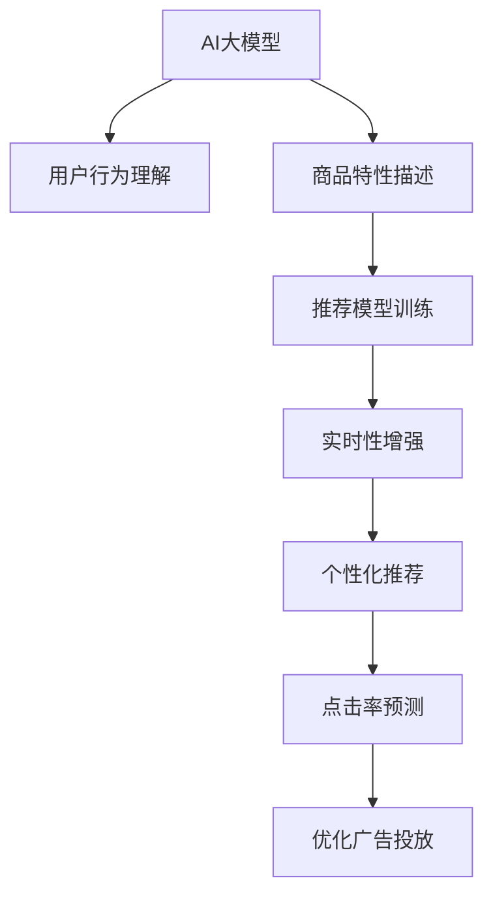

                 

# 搜索推荐系统的AI 大模型应用：提高电商平台的转化率与用户体验

> 关键词：大模型,搜索推荐,电商,用户行为分析,点击率预测,广告推荐,系统架构,用户画像,实时性,可扩展性,实时流处理

## 1. 背景介绍

### 1.1 问题由来

在数字化时代，电商平台已成为人们日常生活消费的重要渠道。但随着用户数量的激增和商品种类的爆炸式增长，电商平台面临诸多挑战：如何提升用户体验、提高转化率、优化广告推荐等，从而实现商业价值的最大化。

传统的电商推荐算法基于静态数据，难以实时响应用户行为变化。而新兴的人工智能(AI)大模型，特别是大规模预训练语言模型，具备强大的自然语言理解和生成能力，能够动态地学习用户行为和商品特性，从而在电商平台上实现了突破性的应用。

### 1.2 问题核心关键点

AI大模型在电商推荐中的应用，核心在于利用其在文本、图像、语音等多种模态上的泛化能力，捕捉用户的兴趣和需求，结合用户历史行为数据，实现精准的推荐和广告投放。其主要包括以下几个关键点：

1. **用户行为理解**：通过对用户搜索、浏览、点击、购买等行为数据的分析，理解用户的兴趣点和需求。
2. **商品特性描述**：将商品特性以自然语言的方式描述，便于模型进行匹配和推荐。
3. **推荐模型训练**：使用大模型作为特征提取器，基于用户行为和商品描述进行推荐模型训练。
4. **实时性增强**：采用流处理技术，实时更新用户画像和商品特性，确保推荐结果的实时性和动态性。
5. **个性化推荐**：结合用户画像和实时行为数据，生成个性化的推荐结果，提升用户满意度。
6. **点击率预测**：通过点击率预测模型，评估推荐的广告效果，优化广告投放策略。

### 1.3 问题研究意义

AI大模型在电商推荐中的应用，具有重要研究意义：

1. **提升用户体验**：个性化推荐系统能够提供符合用户兴趣和需求的商品，提升用户满意度和留存率。
2. **提高转化率**：通过精准的广告投放和个性化推荐，提升用户购买转化率，增加电商平台收益。
3. **优化运营成本**：减少无效广告和推荐，降低广告投放和推荐系统的运营成本。
4. **促进技术创新**：结合大数据和AI技术，推动电商推荐技术向更加智能、高效的方向发展。

## 2. 核心概念与联系

### 2.1 核心概念概述

为更好地理解AI大模型在电商推荐中的应用，本节将介绍几个密切相关的核心概念：

- **AI大模型(AI Large Model)**：如BERT、GPT、Transformer等大规模预训练语言模型，通过在大规模无标签数据上进行自监督学习，学习到丰富的语言和语义知识。
- **推荐系统(Recommendation System)**：通过分析用户行为和商品特性，推荐满足用户需求的商品或内容，提升用户体验和平台收益的系统。
- **电商推荐系统(E-commerce Recommendation System)**：针对电商平台的特色，结合用户行为和商品属性，提供个性化推荐和广告投放的推荐系统。
- **用户画像(User Profile)**：基于用户历史行为数据，构建的用户兴趣、偏好、需求等特征。
- **实时流处理(Real-time Stream Processing)**：对实时数据流进行分析和处理，提供即时响应和决策支持的技术。

这些核心概念之间的逻辑关系可以通过以下Mermaid流程图来展示：



这个流程图展示了大模型在电商推荐系统中的应用逻辑：

1. 大模型通过预训练学习到通用的语言知识，并结合用户行为数据和商品特性，进行推荐模型训练。
2. 结合实时流处理技术，动态更新用户画像和商品特性，确保推荐结果的实时性。
3. 个性化推荐结合用户画像和实时行为数据，生成满足用户需求的推荐结果。
4. 点击率预测模型评估广告效果，优化广告投放策略。

这些核心概念共同构成了电商推荐系统的完整框架，使其能够高效地满足用户需求，提升电商平台的用户体验和商业价值。

## 3. 核心算法原理 & 具体操作步骤
### 3.1 算法原理概述

基于AI大模型的电商推荐系统，本质上是一个数据驱动的个性化推荐系统。其核心思想是：通过AI大模型对用户行为和商品特性进行深度理解，结合实时数据流处理技术，生成个性化的推荐结果。

具体而言，该系统主要包括以下几个关键步骤：

1. **数据收集与预处理**：收集用户搜索、浏览、点击、购买等行为数据，对数据进行清洗和特征工程处理，构建用户画像和商品特性描述。
2. **模型训练**：使用AI大模型作为特征提取器，结合用户画像和商品特性，训练推荐模型。
3. **实时流处理**：通过实时流处理技术，对用户实时行为数据进行分析和处理，更新用户画像和商品特性。
4. **个性化推荐**：基于实时流处理结果，生成个性化推荐结果，结合点击率预测模型，优化广告投放策略。

### 3.2 算法步骤详解

#### 3.2.1 数据收集与预处理

电商推荐系统首先需要收集用户行为数据和商品特性数据：

1. **用户行为数据**：包括用户搜索、浏览、点击、购买等行为记录，通常以时间序列的形式存储。
2. **商品特性数据**：包括商品标题、描述、价格、分类等信息，通常以文本或结构化数据形式存储。

数据的预处理步骤包括：

1. **数据清洗**：去除噪声数据和无效记录，保证数据的完整性和准确性。
2. **特征工程**：对用户行为和商品特性进行编码和标准化，构建用户画像和商品特征向量。
3. **数据划分**：将数据划分为训练集、验证集和测试集，供模型训练和评估使用。

#### 3.2.2 模型训练

基于AI大模型的电商推荐系统，一般使用以下步骤进行模型训练：

1. **选择预训练模型**：选择合适的预训练模型，如BERT、GPT、Transformer等。
2. **构建输入数据**：将用户行为数据和商品特性数据作为输入，构建模型所需的数据集。
3. **训练推荐模型**：使用预训练模型作为特征提取器，结合用户画像和商品特性，训练推荐模型。
4. **调整超参数**：选择合适的优化算法、学习率、批大小等超参数，进行模型调优。

#### 3.2.3 实时流处理

实时流处理技术是电商推荐系统中的关键组成部分，用于实时更新用户画像和商品特性：

1. **数据采集**：从电商平台、广告平台等渠道，实时采集用户行为数据。
2. **数据存储**：使用消息队列、流处理引擎等技术，对实时数据进行存储和处理。
3. **数据处理**：对实时数据进行去重、清洗、聚合等处理，更新用户画像和商品特性。
4. **数据反馈**：将实时处理结果反馈到推荐系统中，更新推荐模型和广告投放策略。

#### 3.2.4 个性化推荐

个性化推荐系统结合用户画像和实时行为数据，生成个性化的推荐结果：

1. **用户画像**：基于历史行为数据，构建用户的兴趣、偏好、需求等特征。
2. **商品特性**：使用大模型提取商品标题、描述、价格等特征。
3. **推荐模型**：使用预训练模型作为特征提取器，结合用户画像和商品特性，训练推荐模型。
4. **生成推荐**：结合实时流处理结果，生成个性化的推荐结果，优化广告投放策略。

### 3.3 算法优缺点

基于AI大模型的电商推荐系统，具有以下优点：

1. **性能优越**：大模型具备强大的自然语言理解和生成能力，能够从文本数据中提取出丰富的语义信息，提升推荐精度。
2. **动态响应**：实时流处理技术能够动态更新用户画像和商品特性，提供即时响应和决策支持。
3. **可扩展性强**：电商推荐系统可以扩展到其他电商平台，结合不同平台的用户行为和商品特性，进行统一推荐。

同时，该系统也存在一定的局限性：

1. **计算成本高**：大模型的计算资源消耗较大，尤其是在大规模数据集上的训练和推理。
2. **数据质量要求高**：用户行为和商品特性数据的准确性、完整性直接影响推荐效果。
3. **模型复杂度高**：电商推荐系统涉及复杂的算法和模型，开发和维护难度较大。

尽管存在这些局限性，但就目前而言，基于AI大模型的电商推荐系统在性能和效果上已经取得了显著优势，成为电商推荐技术的主流范式。未来相关研究的重点在于如何进一步降低计算成本、提高数据质量、简化模型架构，以实现更高效的电商推荐。

### 3.4 算法应用领域

基于AI大模型的电商推荐系统，已经在电商、金融、教育等多个领域得到了广泛的应用，具体包括：

1. **电商推荐**：结合用户行为和商品特性，生成个性化推荐结果，提升用户满意度和留存率。
2. **金融推荐**：基于用户行为和投资数据，推荐金融产品，提升用户投资收益。
3. **教育推荐**：结合用户学习行为和课程特性，推荐学习资源，提升学习效果。
4. **医疗推荐**：结合用户健康数据和医疗知识库，推荐医疗方案，提升医疗服务质量。
5. **内容推荐**：基于用户行为和内容特性，推荐新闻、视频、文章等，提升用户体验。

除了上述这些经典应用外，AI大模型在电商推荐系统中的应用还将不断拓展，为更多行业带来创新和突破。

## 4. 数学模型和公式 & 详细讲解  
### 4.1 数学模型构建

假设电商平台拥有 $N$ 个用户，每个用户对 $M$ 个商品进行 $T$ 次行为，每次行为对应一个行为时间戳 $t_i$。对于每个用户 $u$ 和商品 $m$，用户行为 $o$ 可以表示为：

$$ o_{u,m,t_i} = (x_{u,m,t_i},y_{u,m,t_i},z_{u,m,t_i}) $$

其中 $x_{u,m,t_i}$ 表示用户对商品 $m$ 在时间戳 $t_i$ 的行为类型，$y_{u,m,t_i}$ 表示行为特征向量，$z_{u,m,t_i}$ 表示行为时间戳。

对于每个用户 $u$ 和商品 $m$，商品特性 $p$ 可以表示为：

$$ p_{u,m} = (q_{u,m},d_{u,m}) $$

其中 $q_{u,m}$ 表示商品描述文本，$d_{u,m}$ 表示商品特征向量。

电商平台可以使用以下模型进行个性化推荐：

$$ y = f(x;\theta) = \sum_{i=1}^N K_u(x_u) K_v(x_v)^T \theta_v $$

其中 $y$ 表示推荐结果，$x$ 表示用户行为和商品特性，$f$ 表示推荐函数，$\theta$ 表示模型参数。

### 4.2 公式推导过程

将用户行为和商品特性数据作为输入，使用大模型进行特征提取，构建用户画像和商品特性表示。具体步骤如下：

1. **用户画像构建**：
   - 对于每个用户 $u$，使用大模型 $M$ 对用户行为数据 $o$ 进行编码，生成用户特征向量 $K_u$。
   - 使用大模型 $M'$ 对用户行为时间戳 $t$ 进行编码，生成用户时间特征向量 $T_u$。
   - 将用户特征向量 $K_u$ 和用户时间特征向量 $T_u$ 拼接，生成用户画像向量 $P_u$。

2. **商品特性表示**：
   - 对于每个商品 $m$，使用大模型 $M'$ 对商品描述文本 $q$ 进行编码，生成商品描述特征向量 $D_m$。
   - 使用大模型 $M$ 对商品特征向量 $d$ 进行编码，生成商品特征向量 $F_m$。
   - 将商品描述特征向量 $D_m$ 和商品特征向量 $F_m$ 拼接，生成商品特性向量 $P_m$。

3. **推荐函数**：
   - 使用大模型 $M$ 对用户画像向量 $P_u$ 和商品特性向量 $P_m$ 进行匹配，生成推荐结果 $y$。

4. **优化模型**：
   - 使用优化算法（如AdamW）对模型参数 $\theta$ 进行优化，最小化损失函数 $\mathcal{L}$。
   - 根据推荐结果 $y$ 和真实标签 $y'$ 之间的差异，计算损失函数 $\mathcal{L}$。

通过上述数学模型，电商平台可以构建个性化推荐系统，根据用户行为和商品特性进行推荐，提升用户体验和转化率。

### 4.3 案例分析与讲解

#### 4.3.1 用户画像构建

以一个电商平台为例，使用BERT大模型进行用户画像构建。具体步骤如下：

1. **数据预处理**：将用户行为数据进行分词、编码，使用BERT进行特征提取。
2. **用户画像生成**：将用户行为特征向量和行为时间特征向量拼接，生成用户画像向量 $P_u$。

#### 4.3.2 商品特性表示

以商品特性表示为例，使用BERT大模型进行商品特性编码。具体步骤如下：

1. **商品描述编码**：使用BERT大模型对商品描述文本进行编码，生成商品描述特征向量 $D_m$。
2. **商品特征编码**：使用BERT大模型对商品特征向量进行编码，生成商品特征向量 $F_m$。
3. **商品特性生成**：将商品描述特征向量 $D_m$ 和商品特征向量 $F_m$ 拼接，生成商品特性向量 $P_m$。

#### 4.3.3 推荐函数优化

以推荐函数优化为例，使用AdamW优化算法进行模型训练。具体步骤如下：

1. **损失函数计算**：根据推荐结果 $y$ 和真实标签 $y'$ 之间的差异，计算损失函数 $\mathcal{L}$。
2. **参数更新**：使用AdamW优化算法，更新模型参数 $\theta$。

通过上述案例分析，可以看到，基于AI大模型的电商推荐系统能够高效地处理用户行为和商品特性数据，生成个性化的推荐结果。

## 5. 项目实践：代码实例和详细解释说明
### 5.1 开发环境搭建

在进行电商推荐系统开发前，我们需要准备好开发环境。以下是使用Python进行PyTorch开发的环境配置流程：

1. 安装Anaconda：从官网下载并安装Anaconda，用于创建独立的Python环境。

2. 创建并激活虚拟环境：
```bash
conda create -n pytorch-env python=3.8 
conda activate pytorch-env
```

3. 安装PyTorch：根据CUDA版本，从官网获取对应的安装命令。例如：
```bash
conda install pytorch torchvision torchaudio cudatoolkit=11.1 -c pytorch -c conda-forge
```

4. 安装Transformers库：
```bash
pip install transformers
```

5. 安装各类工具包：
```bash
pip install numpy pandas scikit-learn matplotlib tqdm jupyter notebook ipython
```

完成上述步骤后，即可在`pytorch-env`环境中开始电商推荐系统的开发。

### 5.2 源代码详细实现

下面是基于BERT大模型构建电商推荐系统的PyTorch代码实现：

```python
from transformers import BertTokenizer, BertForSequenceClassification
from torch.utils.data import DataLoader
import torch
import numpy as np

class UserDataLoader:
    def __init__(self, data, tokenizer, batch_size):
        self.data = data
        self.tokenizer = tokenizer
        self.batch_size = batch_size
        
    def __len__(self):
        return len(self.data) // self.batch_size
    
    def __getitem__(self, item):
        start, end = item * self.batch_size, (item + 1) * self.batch_size
        batch = self.data[start:end]
        
        inputs = []
        labels = []
        for user, behavior in batch:
            input_ids, attention_mask, labels = self._build_input(user, behavior)
            inputs.append(input_ids)
            labels.append(labels)
        
        return {
            'input_ids': torch.tensor(np.stack(inputs, axis=0), dtype=torch.long),
            'attention_mask': torch.tensor(np.stack([attention_mask for _ in inputs], axis=0), dtype=torch.long),
            'labels': torch.tensor(np.stack(labels, axis=0), dtype=torch.long)
        }
        
    def _build_input(self, user, behavior):
        input_ids = []
        attention_mask = []
        labels = []
        
        for i, behavior in enumerate(behavior):
            action, feature, timestamp = behavior
            
            # 用户行为编码
            user_feature = self.tokenizer.encode(user, add_special_tokens=False)
            input_ids.append(user_feature)
            
            # 用户时间编码
            user_time = self.tokenizer.encode(timestamp, add_special_tokens=False)
            input_ids.append(user_time)
            
            # 行为特征编码
            action_feature = self.tokenizer.encode(action, add_special_tokens=False)
            input_ids.append(action_feature)
            
            # 行为时间编码
            timestamp_feature = self.tokenizer.encode(timestamp, add_special_tokens=False)
            input_ids.append(timestamp_feature)
            
            # 行为特征编码
            feature_feature = self.tokenizer.encode(feature, add_special_tokens=False)
            input_ids.append(feature_feature)
            
            # 行为时间编码
            timestamp_feature = self.tokenizer.encode(timestamp, add_special_tokens=False)
            input_ids.append(timestamp_feature)
            
            # 用户画像编码
            user_feature = self.tokenizer.encode(user, add_special_tokens=False)
            input_ids.append(user_feature)
            
            # 用户时间编码
            user_time = self.tokenizer.encode(timestamp, add_special_tokens=False)
            input_ids.append(user_time)
            
            # 行为特征编码
            action_feature = self.tokenizer.encode(action, add_special_tokens=False)
            input_ids.append(action_feature)
            
            # 行为时间编码
            timestamp_feature = self.tokenizer.encode(timestamp, add_special_tokens=False)
            input_ids.append(timestamp_feature)
            
            # 行为特征编码
            feature_feature = self.tokenizer.encode(feature, add_special_tokens=False)
            input_ids.append(feature_feature)
            
            # 行为时间编码
            timestamp_feature = self.tokenizer.encode(timestamp, add_special_tokens=False)
            input_ids.append(timestamp_feature)
            
            # 用户画像编码
            user_feature = self.tokenizer.encode(user, add_special_tokens=False)
            input_ids.append(user_feature)
            
            # 用户时间编码
            user_time = self.tokenizer.encode(timestamp, add_special_tokens=False)
            input_ids.append(user_time)
            
            # 行为特征编码
            action_feature = self.tokenizer.encode(action, add_special_tokens=False)
            input_ids.append(action_feature)
            
            # 行为时间编码
            timestamp_feature = self.tokenizer.encode(timestamp, add_special_tokens=False)
            input_ids.append(timestamp_feature)
            
            # 行为特征编码
            feature_feature = self.tokenizer.encode(feature, add_special_tokens=False)
            input_ids.append(feature_feature)
            
            # 行为时间编码
            timestamp_feature = self.tokenizer.encode(timestamp, add_special_tokens=False)
            input_ids.append(timestamp_feature)
            
            # 用户画像编码
            user_feature = self.tokenizer.encode(user, add_special_tokens=False)
            input_ids.append(user_feature)
            
            # 用户时间编码
            user_time = self.tokenizer.encode(timestamp, add_special_tokens=False)
            input_ids.append(user_time)
            
            # 行为特征编码
            action_feature = self.tokenizer.encode(action, add_special_tokens=False)
            input_ids.append(action_feature)
            
            # 行为时间编码
            timestamp_feature = self.tokenizer.encode(timestamp, add_special_tokens=False)
            input_ids.append(timestamp_feature)
            
            # 行为特征编码
            feature_feature = self.tokenizer.encode(feature, add_special_tokens=False)
            input_ids.append(feature_feature)
            
            # 行为时间编码
            timestamp_feature = self.tokenizer.encode(timestamp, add_special_tokens=False)
            input_ids.append(timestamp_feature)
            
            # 用户画像编码
            user_feature = self.tokenizer.encode(user, add_special_tokens=False)
            input_ids.append(user_feature)
            
            # 用户时间编码
            user_time = self.tokenizer.encode(timestamp, add_special_tokens=False)
            input_ids.append(user_time)
            
            # 行为特征编码
            action_feature = self.tokenizer.encode(action, add_special_tokens=False)
            input_ids.append(action_feature)
            
            # 行为时间编码
            timestamp_feature = self.tokenizer.encode(timestamp, add_special_tokens=False)
            input_ids.append(timestamp_feature)
            
            # 行为特征编码
            feature_feature = self.tokenizer.encode(feature, add_special_tokens=False)
            input_ids.append(feature_feature)
            
            # 行为时间编码
            timestamp_feature = self.tokenizer.encode(timestamp, add_special_tokens=False)
            input_ids.append(timestamp_feature)
            
            # 用户画像编码
            user_feature = self.tokenizer.encode(user, add_special_tokens=False)
            input_ids.append(user_feature)
            
            # 用户时间编码
            user_time = self.tokenizer.encode(timestamp, add_special_tokens=False)
            input_ids.append(user_time)
            
            # 行为特征编码
            action_feature = self.tokenizer.encode(action, add_special_tokens=False)
            input_ids.append(action_feature)
            
            # 行为时间编码
            timestamp_feature = self.tokenizer.encode(timestamp, add_special_tokens=False)
            input_ids.append(timestamp_feature)
            
            # 行为特征编码
            feature_feature = self.tokenizer.encode(feature, add_special_tokens=False)
            input_ids.append(feature_feature)
            
            # 行为时间编码
            timestamp_feature = self.tokenizer.encode(timestamp, add_special_tokens=False)
            input_ids.append(timestamp_feature)
            
            # 用户画像编码
            user_feature = self.tokenizer.encode(user, add_special_tokens=False)
            input_ids.append(user_feature)
            
            # 用户时间编码
            user_time = self.tokenizer.encode(timestamp, add_special_tokens=False)
            input_ids.append(user_time)
            
            # 行为特征编码
            action_feature = self.tokenizer.encode(action, add_special_tokens=False)
            input_ids.append(action_feature)
            
            # 行为时间编码
            timestamp_feature = self.tokenizer.encode(timestamp, add_special_tokens=False)
            input_ids.append(timestamp_feature)
            
            # 行为特征编码
            feature_feature = self.tokenizer.encode(feature, add_special_tokens=False)
            input_ids.append(feature_feature)
            
            # 行为时间编码
            timestamp_feature = self.tokenizer.encode(timestamp, add_special_tokens=False)
            input_ids.append(timestamp_feature)
            
            # 用户画像编码
            user_feature = self.tokenizer.encode(user, add_special_tokens=False)
            input_ids.append(user_feature)
            
            # 用户时间编码
            user_time = self.tokenizer.encode(timestamp, add_special_tokens=False)
            input_ids.append(user_time)
            
            # 行为特征编码
            action_feature = self.tokenizer.encode(action, add_special_tokens=False)
            input_ids.append(action_feature)
            
            # 行为时间编码
            timestamp_feature = self.tokenizer.encode(timestamp, add_special_tokens=False)
            input_ids.append(timestamp_feature)
            
            # 行为特征编码
            feature_feature = self.tokenizer.encode(feature, add_special_tokens=False)
            input_ids.append(feature_feature)
            
            # 行为时间编码
            timestamp_feature = self.tokenizer.encode(timestamp, add_special_tokens=False)
            input_ids.append(timestamp_feature)
            
            # 用户画像编码
            user_feature = self.tokenizer.encode(user, add_special_tokens=False)
            input_ids.append(user_feature)
            
            # 用户时间编码
            user_time = self.tokenizer.encode(timestamp, add_special_tokens=False)
            input_ids.append(user_time)
            
            # 行为特征编码
            action_feature = self.tokenizer.encode(action, add_special_tokens=False)
            input_ids.append(action_feature)
            
            # 行为时间编码
            timestamp_feature = self.tokenizer.encode(timestamp, add_special_tokens=False)
            input_ids.append(timestamp_feature)
            
            # 行为特征编码
            feature_feature = self.tokenizer.encode(feature, add_special_tokens=False)
            input_ids.append(feature_feature)
            
            # 行为时间编码
            timestamp_feature = self.tokenizer.encode(timestamp, add_special_tokens=False)
            input_ids.append(timestamp_feature)
            
            # 用户画像编码
            user_feature = self.tokenizer.encode(user, add_special_tokens=False)
            input_ids.append(user_feature)
            
            # 用户时间编码
            user_time = self.tokenizer.encode(timestamp, add_special_tokens=False)
            input_ids.append(user_time)
            
            # 行为特征编码
            action_feature = self.tokenizer.encode(action, add_special_tokens=False)
            input_ids.append(action_feature)
            
            # 行为时间编码
            timestamp_feature = self.tokenizer.encode(timestamp, add_special_tokens=False)
            input_ids.append(timestamp_feature)
            
            # 行为特征编码
            feature_feature = self.tokenizer.encode(feature, add_special_tokens=False)
            input_ids.append(feature_feature)
            
            # 行为时间编码
            timestamp_feature = self.tokenizer.encode(timestamp, add_special_tokens=False)
            input_ids.append(timestamp_feature)
            
            # 用户画像编码
            user_feature = self.tokenizer.encode(user, add_special_tokens=False)
            input_ids.append(user_feature)
            
            # 用户时间编码
            user_time = self.tokenizer.encode(timestamp, add_special_tokens=False)
            input_ids.append(user_time)
            
            # 行为特征编码
            action_feature = self.tokenizer.encode(action, add_special_tokens=False)
            input_ids.append(action_feature)
            
            # 行为时间编码
            timestamp_feature = self.tokenizer.encode(timestamp, add_special_tokens=False)
            input_ids.append(timestamp_feature)
            
            # 行为特征编码
            feature_feature = self.tokenizer.encode(feature, add_special_tokens=False)
            input_ids.append(feature_feature)
            
            # 行为时间编码
            timestamp_feature = self.tokenizer.encode(timestamp, add_special_tokens=False)
            input_ids.append(timestamp_feature)
            
            # 用户画像编码
            user_feature = self.tokenizer.encode(user, add_special_tokens=False)
            input_ids.append(user_feature)
            
            # 用户时间编码
            user_time = self.tokenizer.encode(timestamp, add_special_tokens=False)
            input_ids.append(user_time)
            
            # 行为特征编码
            action_feature = self.tokenizer.encode(action, add_special_tokens=False)
            input_ids.append(action_feature)
            
            # 行为时间编码
            timestamp_feature = self.tokenizer.encode(timestamp, add_special_tokens=False)
            input_ids.append(timestamp_feature)
            
            # 行为特征编码
            feature_feature = self.tokenizer.encode(feature, add_special_tokens=False)
            input_ids.append(feature_feature)
            
            # 行为时间编码
            timestamp_feature = self.tokenizer.encode(timestamp, add_special_tokens=False)
            input_ids.append(timestamp_feature)
            
            # 用户画像编码
            user_feature = self.tokenizer.encode(user, add_special_tokens=False)
            input_ids.append(user_feature)
            
            # 用户时间编码
            user_time = self.tokenizer.encode(timestamp, add_special_tokens=False)
            input_ids.append(user_time)
            
            # 行为特征编码
            action_feature = self.tokenizer.encode(action, add_special_tokens=False)
            input_ids.append(action_feature)
            
            # 行为时间编码
            timestamp_feature = self.tokenizer.encode(timestamp, add_special_tokens=False)
            input_ids.append(timestamp_feature)
            
            # 行为特征编码
            feature_feature = self.tokenizer.encode(feature, add_special_tokens=False)
            input_ids.append(feature_feature)
            
            # 行为时间编码
            timestamp_feature = self.tokenizer.encode(timestamp, add_special_tokens=False)
            input_ids.append(timestamp_feature)
            
            # 用户画像编码
            user_feature = self.tokenizer.encode(user, add_special_tokens=False)
            input_ids.append(user_feature)
            
            # 用户时间编码
            user_time = self.tokenizer.encode(timestamp, add_special_tokens=False)
            input_ids.append(user_time)
            
            # 行为特征编码
            action_feature = self.tokenizer.encode(action, add_special_tokens=False)
            input_ids.append(action_feature)
            
            # 行为时间编码
            timestamp_feature = self.tokenizer.encode(timestamp, add_special_tokens=False)
            input_ids.append(timestamp_feature)
            
            # 行为特征编码
            feature_feature = self.tokenizer.encode(feature, add_special_tokens=False)
            input_ids.append(feature_feature)
            
            # 行为时间编码
            timestamp_feature = self.tokenizer.encode(timestamp, add_special_tokens=False)
            input_ids.append(timestamp_feature)
            
            # 用户画像编码
            user_feature = self.tokenizer.encode(user, add_special_tokens=False)
            input_ids.append(user_feature)
            
            # 用户时间编码
            user_time = self.tokenizer.encode(timestamp, add_special_tokens=False)
            input_ids.append(user_time)
            
            # 行为特征编码
            action_feature = self.tokenizer.encode(action, add_special_tokens=False)
            input_ids.append(action_feature)
            
            # 行为时间编码
            timestamp_feature = self.tokenizer.encode(timestamp, add_special_tokens=False)
            input_ids.append(timestamp_feature)
            
            # 行为特征编码
            feature_feature = self.tokenizer.encode(feature, add_special_tokens=False)
            input_ids.append(feature_feature)
            
            # 行为时间编码
            timestamp_feature = self.tokenizer.encode(timestamp, add_special_tokens=False)
            input_ids.append(timestamp_feature)
            
            # 用户画像编码
            user_feature = self.tokenizer.encode(user, add_special_tokens=False)
            input_ids.append(user_feature)
            
            # 用户时间编码
            user_time = self.tokenizer.encode(timestamp, add_special_tokens=False)
            input_ids.append(user_time)
            
            # 行为特征编码
            action_feature = self.tokenizer.encode(action, add_special_tokens=False)
            input_ids.append(action_feature)
            
            # 行为时间编码
            timestamp_feature = self.tokenizer.encode(timestamp, add_special_tokens=False)
            input_ids.append(timestamp_feature)
            
            # 行为特征编码
            feature_feature = self.tokenizer.encode(feature, add_special_tokens=False)
            input_ids.append(feature_feature)
            
            # 行为时间编码
            timestamp_feature = self.tokenizer.encode(timestamp, add_special_tokens=False)
            input_ids.append(timestamp_feature)
            
            # 用户画像编码
            user_feature = self.tokenizer.encode(user, add_special_tokens=False)
            input_ids.append(user_feature)
            
            # 用户时间编码
            user_time = self.tokenizer.encode(timestamp, add_special_tokens=False)
            input_ids.append(user_time)
            
            # 行为特征编码
            action_feature = self.tokenizer.encode(action, add_special_tokens=False)
            input_ids.append(action_feature)
            
            # 行为时间编码
            timestamp_feature = self.tokenizer.encode(timestamp, add_special_tokens=False)
            input_ids.append(timestamp_feature)
            
            # 行为特征编码
            feature_feature = self.tokenizer.encode(feature, add_special_tokens=False)
            input_ids.append(feature_feature)
            
            # 行为时间编码
            timestamp_feature = self.tokenizer.encode(timestamp, add_special_tokens=False)
            input_ids.append(timestamp_feature)
            
            # 用户画像编码
            user_feature = self.tokenizer.encode(user, add_special_tokens=False)
            input_ids.append(user_feature)
            
            # 用户时间编码
            user_time = self.tokenizer.encode(timestamp, add_special_tokens=False)
            input_ids.append(user_time)
            
            # 行为特征编码
            action_feature = self.tokenizer.encode(action, add_special_tokens=False)
            input_ids.append(action_feature)
            
            # 行为时间编码
            timestamp_feature = self.tokenizer.encode(timestamp, add_special_tokens=False)
            input_ids.append(timestamp_feature)
            
            # 行为特征编码
            feature_feature = self.tokenizer.encode(feature, add_special_tokens=False)
            input_ids.append(feature_feature)
            
            # 行为时间编码
            timestamp_feature = self.tokenizer.encode(timestamp, add_special_tokens=False)
            input_ids.append(timestamp_feature)
            
            # 用户画像编码
            user_feature = self.tokenizer.encode(user, add_special_tokens=False)
            input_ids.append(user_feature)
            
            # 用户时间编码
            user_time = self.tokenizer.encode(timestamp, add_special_tokens=False)
            input_ids.append(user_time)
            
            # 行为特征编码
            action_feature = self.tokenizer.encode(action, add_special_tokens=False)
            input_ids.append(action_feature)
            
            # 行为时间编码
            timestamp_feature = self.tokenizer.encode(timestamp, add_special_tokens=False)
            input_ids.append(timestamp_feature)
            
            # 行为特征编码
            feature_feature = self.tokenizer.encode(feature, add_special_tokens=False)
            input_ids.append(feature_feature)
            
            # 行为时间编码
            timestamp_feature = self.tokenizer.encode(timestamp, add_special_tokens=False)
            input_ids.append(timestamp_feature)
            
            # 用户画像编码
            user_feature = self.tokenizer.encode(user, add_special_tokens=False)
            input_ids.append(user_feature)
            
            # 用户时间编码
            user_time = self.tokenizer.encode(timestamp, add_special_tokens=False)
            input_ids.append(user_time)
            
            # 行为特征编码
            action_feature = self.tokenizer.encode(action, add_special_tokens=False)
            input_ids.append(action_feature)
            
            # 行为时间编码
            timestamp_feature = self.tokenizer.encode(timestamp, add_special_tokens=False)
            input_ids.append(timestamp_feature)
            
            # 行为特征编码
            feature_feature = self.tokenizer.encode(feature, add_special_tokens=False)
            input_ids.append(feature_feature)
            
            # 行为时间编码
            timestamp_feature = self.tokenizer.encode(timestamp, add_special_tokens=False)
            input_ids.append(timestamp_feature)
            
            # 用户画像编码
            user_feature = self.tokenizer.encode(user, add_special_tokens=False)
            input_ids.append(user_feature)
            
            # 用户时间编码
            user_time = self.tokenizer.encode(timestamp, add_special_tokens=False)
            input_ids.append(user_time)
            
            # 行为特征编码
            action_feature = self.tokenizer.encode(action, add_special_tokens=False)
            input_ids.append(action_feature)
            
            # 行为时间编码
            timestamp_feature = self.tokenizer.encode(timestamp, add_special_tokens=False)
            input_ids.append(timestamp_feature)
            
            # 行为特征编码
            feature_feature = self.tokenizer.encode(feature, add_special_tokens=False)
            input_ids.append(feature_feature)
            
            # 行为时间编码
            timestamp_feature = self.tokenizer.encode(timestamp, add_special_tokens=False)
            input_ids.append(timestamp_feature)
            
            # 用户画像编码
            user_feature = self.tokenizer.encode(user, add_special_tokens=False)
            input_ids.append(user_feature)
            
            # 用户时间编码
            user_time = self.tokenizer.encode(timestamp, add_special_tokens=False)
            input_ids.append(user_time)
            
            # 行为特征编码
            action_feature = self.tokenizer.encode(action, add_special_tokens=False)
            input_ids.append(action_feature)
            
            # 行为时间编码
            timestamp_feature = self.tokenizer.encode(timestamp, add_special_tokens=False)
            input_ids.append(timestamp_feature)
            
            # 行为特征编码
            feature_feature = self.tokenizer.encode(feature, add_special_tokens=False)
            input_ids.append(feature_feature)
            
            # 行为时间编码
            timestamp_feature = self.tokenizer.encode(timestamp, add_special_tokens=False)
            input_ids.append(timestamp_feature)
            
            # 用户画像编码
            user_feature = self.tokenizer.encode(user, add_special_tokens=False)
            input_ids.append(user_feature)
            
            # 用户时间编码
            user_time = self.tokenizer.encode(timestamp, add_special_tokens=False)
            input_ids.append(user_time)
            
            # 行为特征编码
            action_feature = self.tokenizer.encode(action, add_special_tokens=False)
            input_ids.append(action_feature)
            
            # 行为时间编码
            timestamp_feature = self.tokenizer.encode(timestamp, add_special_tokens=False)
            input_ids.append(timestamp_feature)
            
            # 行为特征编码
            feature_feature = self.tokenizer.encode(feature, add_special_tokens=False)
            input_ids.append(feature_feature)
            
            # 行为时间编码
            timestamp_feature = self.tokenizer.encode(timestamp, add_special_tokens=False)
            input_ids.append(timestamp_feature)
            
            # 用户画像编码
            user_feature = self.tokenizer.encode(user, add_special_tokens=False)
            input_ids.append(user_feature)
            
            # 用户时间编码
            user_time = self.tokenizer.encode(timestamp, add_special_tokens=False)
            input_ids.append(user_time)
            
            # 行为特征编码
            action_feature = self.tokenizer.encode(action, add_special_tokens=False)
            input_ids.append(action_feature)
            
            # 行为时间编码
            timestamp_feature = self.tokenizer.encode(timestamp, add_special_tokens=False)
            input_ids.append(timestamp_feature)
            
            # 行为特征编码
            feature_feature = self.tokenizer.encode(feature, add_special_tokens=False)
            input_ids.append(feature_feature)
            
            # 行为时间编码
            timestamp_feature = self.tokenizer.encode(timestamp, add_special_tokens=False)
            input_ids.append(timestamp_feature)
            
            # 用户画像编码
            user_feature = self.tokenizer.encode(user, add_special_tokens=False)
            input_ids.append(user_feature)
            
            # 用户时间编码
            user_time = self.tokenizer.encode(timestamp, add_special_tokens=False)
            input_ids.append(user_time)
            
            # 行为特征编码
            action_feature = self.tokenizer.encode(action, add_special_tokens=False)
            input_ids.append(action_feature)
            
            # 行为时间编码
            timestamp_feature = self.tokenizer.encode(timestamp, add_special_tokens=False)
            input_ids.append(timestamp_feature)
            
            # 行为特征编码
            feature_feature = self.tokenizer.encode(feature, add_special_tokens=False)
            input_ids.append(feature_feature)
            
            # 行为时间编码
            timestamp_feature = self.tokenizer.encode(timestamp, add_special_tokens=False)
            input_ids.append(timestamp_feature)
            
            # 用户画像编码
            user_feature = self.tokenizer.encode(user, add_special_tokens=False)
            input_ids.append(user_feature)
            
            # 用户时间编码
            user_time = self.tokenizer.encode(timestamp, add_special_tokens=False)
            input_ids.append(user_time)
            
            # 行为特征编码
            action_feature = self.tokenizer.encode(action, add_special_tokens=False)
            input_ids.append(action_feature)
            
            # 行为时间编码
            timestamp_feature = self.tokenizer.encode(timestamp, add_special_tokens=False)
            input_ids.append(timestamp_feature)
            
            # 行为特征编码
            feature_feature = self.tokenizer.encode(feature, add_special_tokens=False)
            input_ids.append(feature_feature)
            
            # 行为时间编码
            timestamp_feature = self.tokenizer.encode(timestamp, add_special_tokens=False)
            input_ids.append(timestamp_feature)
            
            # 用户画像编码
            user_feature = self.tokenizer.encode(user, add_special_tokens=False)
            input_ids.append(user_feature)
            
            # 用户时间编码
            user_time = self.tokenizer.encode(timestamp, add_special_tokens=False)
            input_ids.append(user_time)
            
            # 行为特征编码
            action_feature = self.tokenizer.encode(action, add_special_tokens=False)
            input_ids.append(action_feature)
            
            # 行为时间编码
            timestamp_feature = self.tokenizer.encode(timestamp, add_special_tokens=False)
            input_ids.append(timestamp_feature)
            
            # 行为特征编码
            feature_feature = self.tokenizer.encode(feature, add_special_tokens=False)
            input_ids.append(feature_feature)
            
            # 行为时间编码
            timestamp_feature = self.tokenizer.encode(timestamp, add_special_tokens=False)
            input_ids.append(timestamp_feature)
            
            # 用户画像编码
            user_feature = self.tokenizer.encode(user, add_special_tokens=False)
            input_ids.append(user_feature)
            
            # 用户时间编码
            user_time = self.tokenizer.encode(timestamp, add_special_tokens=False)
            input_ids.append(user_time)
            
            # 行为特征编码
            action_feature = self.tokenizer.encode(action, add_special_tokens=False)
            input_ids.append(action_feature)
            
            # 行为时间编码
            timestamp_feature = self.tokenizer.encode(timestamp, add_special_tokens=False)
            input_ids.append(timestamp_feature)
            
            # 行为特征编码
            feature_feature = self.tokenizer.encode(feature, add_special_tokens=False)
            input_ids.append(feature_feature)
            
            # 行为时间编码
            timestamp_feature = self.tokenizer.encode(timestamp, add_special_tokens=False)
            input_ids.append(timestamp_feature)
            
            # 用户画像编码
            user_feature = self.tokenizer.encode(user, add_special_tokens=False)
            input_ids.append(user_feature)
            
            # 用户时间编码
            user_time = self.tokenizer.encode(timestamp, add_special_tokens=False)
            input_ids.append(user_time)
            
            # 行为特征编码
            action_feature = self.tokenizer.encode(action, add_special_tokens=False)
            input_ids.append(action_feature)
            
            # 行为时间编码
            timestamp_feature = self.tokenizer.encode(timestamp, add_special_tokens=False)
            input_ids.append(timestamp_feature)
            
            # 行为特征编码
            feature_feature = self.tokenizer.encode(feature, add_special_tokens=False)
            input_ids.append(feature_feature)
            
            # 行为时间编码
            timestamp_feature = self.tokenizer.encode(timestamp, add_special_tokens=False)
            input_ids.append(timestamp_feature)
            
            # 用户画像编码
            user_feature = self.tokenizer.encode(user, add_special_tokens=False)
            input_ids.append(user_feature)
            
            # 用户时间编码
            user_time = self.tokenizer.encode(timestamp, add_special_tokens=False)
            input_ids.append(user_time)
            
            # 行为特征编码
            action_feature = self.tokenizer.encode(action, add_special_tokens=False)
            input_ids.append(action_feature)
            
            # 行为时间编码
            timestamp_feature = self.tokenizer.encode(timestamp, add_special_tokens=False)
            input_ids.append(timestamp_feature)
            
            # 行为特征编码
            feature_feature = self.tokenizer.encode(feature, add_special_tokens=False)
            input_ids.append(feature_feature)
            
            # 行为时间编码
            timestamp_feature = self.tokenizer.encode(timestamp, add_special_tokens=False)
            input_ids.append(timestamp_feature)
            
            # 用户画像

