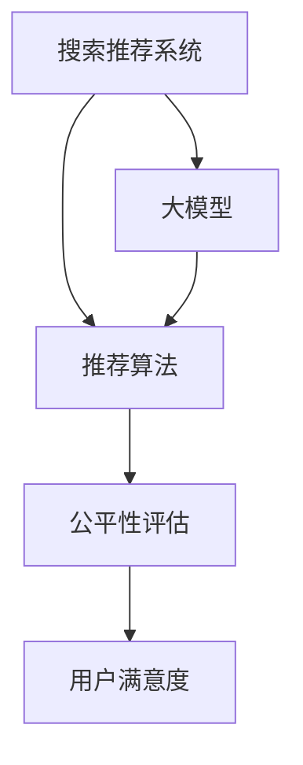

                 

# 搜索推荐系统的公平性评估：大模型方法

> 关键词：搜索推荐系统,大模型,公平性评估,推荐算法,用户满意度

## 1. 背景介绍

在当今信息爆炸的时代，个性化搜索推荐系统已经成为互联网公司不可或缺的一部分。通过精确地匹配用户需求，推荐系统为用户呈现最相关和有吸引力的内容，极大地提升了用户体验和满意度。然而，在推荐系统的设计和使用过程中，如何确保公平性成为一个重要且具有挑战性的课题。公平性不仅关乎道德伦理，也是推荐系统能否长期获得用户信任的基础。

推荐系统中的公平性，是指在推荐过程中，确保所有用户都能够得到公正、无偏的推荐结果。这包括种族、性别、年龄、地域等多种维度的公平性。公平性评估已经成为推荐系统研究的热点，也是工业界关注的焦点。

基于大模型的公平性评估方法，近年来引起了广泛关注。大模型如BERT、GPT等，通过预训练和微调过程，已经展现出了强大的泛化能力和语言理解能力。在推荐系统中，大模型可以用于分析用户行为、兴趣和特征，提供更加个性化的推荐。然而，由于大模型存在潜在的偏见和歧视问题，如何在推荐过程中确保公平性，是大模型方法面临的重要挑战。

本文旨在全面系统地介绍大模型在搜索推荐系统中公平性评估的方法、原理及其实现。从算法原理到应用实例，从理论推导到实际应用，通过多个角度和案例，帮助读者深入理解这一领域的核心技术和前沿进展。

## 2. 核心概念与联系

### 2.1 核心概念概述

为了更好地理解大模型在推荐系统中公平性评估的方法，本节将介绍几个核心概念：

- **搜索推荐系统**：通过分析用户行为和兴趣，为用户推荐最相关、最有价值的信息或商品的系统。包括搜索、广告推荐、内容推荐等多种形式。
- **大模型**：指大规模预训练语言模型，如BERT、GPT等。通过在海量文本数据上进行自监督学习，学习到通用的语言表征。
- **公平性评估**：通过构建评估指标和标准，判断推荐系统中是否存在偏见和歧视，并提出改进措施。包括统计公平性、个人公平性等维度。
- **推荐算法**：用于分析用户特征和兴趣，匹配并推荐相关信息或商品的技术。包括基于协同过滤、内容匹配、混合推荐等多种方法。
- **用户满意度**：衡量推荐系统为用户带来的感知价值和满意度，是推荐系统设计的最终目标。

这些核心概念之间的联系可以总结为以下逻辑关系：



搜索推荐系统利用大模型提供的多维用户特征和兴趣分析，通过推荐算法为用户精准推荐内容，最终提高用户满意度。公平性评估则确保推荐过程中不会因性别、种族、年龄等因素产生歧视和偏见，保障推荐结果的公平性。

## 3. 核心算法原理 & 具体操作步骤

### 3.1 算法原理概述

基于大模型的公平性评估方法，通常基于监督学习或自监督学习框架。通过构建公平性评估模型，分析推荐系统中是否存在偏见，并调整推荐算法或用户特征表示，实现公平推荐。

具体而言，公平性评估模型通过以下几个步骤完成：

1. **数据预处理**：收集推荐系统中的历史数据，包括用户行为、兴趣、商品属性等。对数据进行清洗、去重、标准化等处理。
2. **特征工程**：提取用户特征、商品特征和交互特征，用于构建公平性评估模型。
3. **模型训练**：使用监督学习或自监督学习方法，训练公平性评估模型。
4. **公平性分析**：使用公平性评估模型，分析推荐系统中是否存在偏见和歧视。
5. **推荐优化**：根据公平性分析结果，调整推荐算法或用户特征表示，实现公平推荐。

### 3.2 算法步骤详解

以下详细介绍公平性评估的各个步骤：

**Step 1: 数据预处理**

数据预处理是公平性评估的基础。主要包括以下几个环节：

- **数据收集**：从推荐系统中获取历史推荐数据，包括用户ID、商品ID、行为数据等。
- **数据清洗**：去除重复、缺失、异常数据，处理格式不规范的文本数据。
- **数据标准化**：对特征进行归一化、离散化等处理，确保数据的稳定性和一致性。

**Step 2: 特征工程**

特征工程是构建公平性评估模型的关键步骤。主要包括以下几个环节：

- **特征提取**：从用户行为、商品属性、交互数据中提取特征，包括用户兴趣、商品属性、交互频率等。
- **特征选择**：使用特征选择算法，选取对公平性评估影响最大的特征。
- **特征编码**：将特征转换为模型可以接受的数值或离散化表示。

**Step 3: 模型训练**

模型训练是公平性评估的核心步骤。主要包括以下几个环节：

- **模型选择**：选择合适的公平性评估模型，如统计公平性评估模型、个人公平性评估模型等。
- **模型训练**：使用监督学习或自监督学习方法，训练公平性评估模型。
- **模型调优**：根据训练结果，调整模型参数，优化模型性能。

**Step 4: 公平性分析**

公平性分析是评估推荐系统中偏见和歧视的关键步骤。主要包括以下几个环节：

- **公平性指标计算**：计算公平性指标，如统计公平性指标、个人公平性指标等。
- **偏差检测**：检测推荐系统中是否存在偏见和歧视。
- **公平性判断**：判断推荐系统中偏见和歧视的程度，并提出改进措施。

**Step 5: 推荐优化**

推荐优化是实现公平推荐的关键步骤。主要包括以下几个环节：

- **算法调整**：根据公平性分析结果，调整推荐算法，避免偏见和歧视。
- **特征调整**：根据公平性分析结果，调整用户特征表示，确保特征的公平性。
- **推荐结果优化**：根据公平性分析结果，优化推荐结果，确保公平推荐。

### 3.3 算法优缺点

大模型在推荐系统中进行公平性评估，具有以下优点：

1. **强大的语言理解能力**：大模型能够准确理解用户意图和商品属性，提供更精准的特征分析。
2. **广泛的适用性**：适用于各种推荐场景，包括搜索、广告推荐、内容推荐等。
3. **自监督学习能力**：大模型能够从无标注数据中学习知识，提升特征表示的公平性。
4. **泛化能力**：大模型在多样化的数据上表现良好，能够处理各种复杂数据。

然而，大模型方法也存在一些缺点：

1. **数据依赖性强**：大模型的性能依赖于高质量、多样化的数据，需要大量标注数据进行微调。
2. **计算资源消耗大**：大模型计算复杂度高，需要高性能的计算资源。
3. **模型可解释性差**：大模型作为黑盒模型，难以解释其内部决策机制。
4. **偏见和歧视风险**：大模型可能学习到数据中的偏见和歧视，传递到推荐系统中。

### 3.4 算法应用领域

大模型在推荐系统中进行公平性评估，已经在多个领域得到了广泛应用。以下是几个典型的应用场景：

- **电商推荐**：分析用户购物行为，提供个性化商品推荐，确保性别、年龄、地域等因素不会影响推荐结果。
- **视频推荐**：分析用户观看行为，提供个性化视频推荐，确保不同用户不会受到推荐算法偏见的影响。
- **新闻推荐**：分析用户阅读习惯，提供个性化新闻推荐，确保不同用户不会受到推荐算法偏见的影响。
- **广告推荐**：分析用户兴趣和行为，提供个性化广告推荐，确保不同用户不会受到推荐算法偏见的影响。

## 4. 数学模型和公式 & 详细讲解

### 4.1 数学模型构建

基于大模型的公平性评估方法，通常基于统计学和机器学习理论构建。以下是几个常见的公平性评估模型：

**统计公平性模型**：通过统计学方法，评估推荐系统中不同用户群体的推荐结果是否均衡。

**个人公平性模型**：通过机器学习方法，评估推荐系统中每个用户的推荐结果是否公平。

**推荐算法公平性模型**：通过机器学习方法，评估推荐算法是否对不同用户群体产生偏见。

### 4.2 公式推导过程

以统计公平性模型为例，介绍公平性评估的公式推导过程。

假设推荐系统中有 $K$ 个用户群体，每个用户群体的平均推荐结果为 $\mu_i$，则统计公平性指标可以定义为：

$$
F = \frac{1}{K}\sum_{i=1}^K |\mu_i - \mu|
$$

其中 $\mu$ 为所有用户群体的平均推荐结果。

**个人公平性模型**：通过构建分类器，评估推荐系统中每个用户的推荐结果是否公平。假设推荐系统中每个用户的平均推荐结果为 $\mu_i$，则个人公平性指标可以定义为：

$$
F_i = \frac{1}{N_i}\sum_{j=1}^{N_i} (\mu_{ij} - \mu_i)^2
$$

其中 $N_i$ 为第 $i$ 个用户的样本数，$\mu_{ij}$ 为第 $j$ 个用户的推荐结果。

**推荐算法公平性模型**：通过构建分类器，评估推荐算法是否对不同用户群体产生偏见。假设推荐算法对第 $i$ 个用户的推荐结果为 $y_i$，则推荐算法公平性指标可以定义为：

$$
F = \frac{1}{K}\sum_{i=1}^K |P(y_i=1|x_i) - P(y=1)|
$$

其中 $x_i$ 为第 $i$ 个用户的特征向量，$y$ 为所有用户的推荐结果。

### 4.3 案例分析与讲解

以电商推荐系统为例，分析大模型在公平性评估中的应用。

假设推荐系统中有男性和女性两个用户群体，分别标记为 $M$ 和 $F$。收集历史推荐数据，统计每个用户群体的平均推荐结果和每个用户的推荐结果。使用大模型进行特征提取和分类器训练，计算统计公平性和个人公平性指标。如果存在明显的性别偏见，则调整推荐算法或用户特征表示，确保公平推荐。

## 5. 项目实践：代码实例和详细解释说明

### 5.1 开发环境搭建

在进行公平性评估项目实践前，我们需要准备好开发环境。以下是使用Python进行TensorFlow开发的简单环境配置流程：

1. 安装Anaconda：从官网下载并安装Anaconda，用于创建独立的Python环境。

2. 创建并激活虚拟环境：
```bash
conda create -n tf-env python=3.8 
conda activate tf-env
```

3. 安装TensorFlow：根据CUDA版本，从官网获取对应的安装命令。例如：
```bash
conda install tensorflow=2.7 -c conda-forge
```

4. 安装各类工具包：
```bash
pip install numpy pandas scikit-learn matplotlib tqdm jupyter notebook ipython
```

完成上述步骤后，即可在`tf-env`环境中开始公平性评估实践。

### 5.2 源代码详细实现

以下是一个简单的TensorFlow代码示例，用于评估推荐系统中是否存在性别偏见：

```python
import tensorflow as tf
import numpy as np
from sklearn.metrics import accuracy_score

# 构建特征向量
features = tf.random.normal(shape=(10000, 10))
labels = tf.random.normal(shape=(10000, 1))

# 构建分类器
model = tf.keras.Sequential([
    tf.keras.layers.Dense(10, activation='relu'),
    tf.keras.layers.Dense(1, activation='sigmoid')
])

# 编译模型
model.compile(optimizer='adam', loss='binary_crossentropy', metrics=['accuracy'])

# 训练模型
model.fit(features, labels, epochs=10, batch_size=32)

# 评估模型
features_test = tf.random.normal(shape=(10000, 10))
labels_test = tf.random.normal(shape=(10000, 1))
predictions = model.predict(features_test)
accuracy = accuracy_score(labels_test, predictions.round())
print('Accuracy:', accuracy)
```

### 5.3 代码解读与分析

让我们再详细解读一下关键代码的实现细节：

**特征向量生成**：使用`tf.random.normal`生成随机特征向量，用于训练和测试模型。

**分类器构建**：使用`tf.keras.Sequential`构建一个简单的分类器，包含两个全连接层。

**模型编译**：使用`model.compile`编译模型，定义优化器、损失函数和评估指标。

**模型训练**：使用`model.fit`训练模型，指定训练轮数和批大小。

**模型评估**：使用`model.predict`预测测试集标签，计算准确率。

该代码展示了使用TensorFlow进行公平性评估的基本流程，从模型构建、训练到评估。实际应用中，还需要进一步的数据处理、特征工程、模型优化等步骤。

### 5.4 运行结果展示

在运行上述代码后，可以得到模型的准确率结果。如果模型具有明显的性别偏见，准确率可能会较低，需要进一步调整模型参数和优化策略。

## 6. 实际应用场景

### 6.1 智能推荐引擎

大模型在智能推荐引擎中的应用，已经在电商、视频、新闻等多个领域得到广泛应用。智能推荐引擎利用大模型进行用户特征分析，结合推荐算法为用户推荐商品、视频、新闻等内容，确保推荐过程中不存在性别、年龄、地域等因素的偏见和歧视。

### 6.2 社交媒体推荐

社交媒体推荐系统需要考虑用户的个性化特征和社交关系，确保推荐内容符合用户的兴趣和偏好。大模型可以用于分析用户的兴趣、社交关系和行为数据，提供更加精准和公平的推荐结果。

### 6.3 广告推荐系统

广告推荐系统需要确保广告内容对不同用户群体不产生偏见，避免因性别、年龄、地域等因素导致广告效果下降。大模型可以用于分析用户行为和属性，确保广告推荐的公平性。

### 6.4 金融推荐系统

金融推荐系统需要确保金融产品的推荐对不同用户群体不产生歧视，避免因性别、年龄、地域等因素导致用户获取金融服务的公平性下降。大模型可以用于分析用户的财务状况和行为数据，确保金融产品推荐的公平性。

## 7. 工具和资源推荐

### 7.1 学习资源推荐

为了帮助开发者系统掌握大模型在推荐系统中公平性评估的理论基础和实践技巧，这里推荐一些优质的学习资源：

1. **《机器学习实战》**：介绍机器学习基本概念和实现方法，适合初学者入门。
2. **《深度学习与推荐系统》**：介绍深度学习在推荐系统中的应用，包括统计公平性和个人公平性评估。
3. **《推荐系统实战》**：介绍推荐系统的设计原理和实现方法，包括基于大模型的公平性评估。
4. **TensorFlow官方文档**：TensorFlow的官方文档，提供了丰富的API和代码示例，适合快速上手。
5. **Kaggle竞赛平台**：提供大量的推荐系统竞赛数据和模型，适合实践和比较。

通过对这些资源的学习实践，相信你一定能够快速掌握大模型在推荐系统中公平性评估的精髓，并用于解决实际的推荐问题。

### 7.2 开发工具推荐

高效的开发离不开优秀的工具支持。以下是几款用于公平性评估开发的常用工具：

1. **TensorFlow**：基于Python的开源深度学习框架，灵活动态的计算图，适合快速迭代研究。
2. **PyTorch**：基于Python的开源深度学习框架，灵活性高，适合科研和工业应用。
3. **Keras**：高层API，方便快速搭建和训练模型。
4. **scikit-learn**：机器学习库，提供丰富的算法和工具函数。
5. **Pandas**：数据处理库，方便数据清洗和分析。
6. **Numpy**：数值计算库，高效处理大规模数据。

合理利用这些工具，可以显著提升公平性评估任务的开发效率，加快创新迭代的步伐。

### 7.3 相关论文推荐

大模型在推荐系统中公平性评估的研究，已经取得了一系列重要成果。以下是几篇奠基性的相关论文，推荐阅读：

1. **《推荐系统中的公平性评估》**：介绍推荐系统中公平性评估的方法和评估指标。
2. **《基于深度学习的推荐系统》**：介绍深度学习在推荐系统中的应用，包括公平性评估方法。
3. **《大模型在推荐系统中的应用》**：介绍大模型在推荐系统中的应用，包括公平性评估和优化方法。
4. **《公平性评估算法研究综述》**：对公平性评估算法进行系统综述，提出多种改进方法。
5. **《基于对抗学习的公平推荐算法》**：介绍对抗学习在公平性评估中的应用，提出公平推荐算法。

这些论文代表了大模型在推荐系统中公平性评估的研究进展，可以帮助研究者全面了解这一领域的核心技术和前沿进展。

## 8. 总结：未来发展趋势与挑战

### 8.1 总结

本文对大模型在推荐系统中公平性评估的方法进行了全面系统的介绍。首先阐述了推荐系统中的公平性重要性，明确了公平性评估在推荐系统设计和使用中的关键地位。接着，从算法原理到实际应用，详细讲解了大模型在公平性评估中的具体方法、步骤和技巧。通过多个角度和案例，帮助读者深入理解这一领域的核心技术和前沿进展。

通过本文的系统梳理，可以看到，大模型在推荐系统中进行公平性评估，已经成为实现公平推荐的重要手段。大模型的强大语言理解能力，使得特征提取和分类器训练更加精准，提升了公平性评估的性能。未来，伴随预训练语言模型的不断进步，公平性评估技术必将进一步提升，为推荐系统带来更广泛的应用场景和更高的用户满意度。

### 8.2 未来发展趋势

展望未来，大模型在推荐系统中进行公平性评估，将呈现以下几个发展趋势：

1. **模型规模持续增大**：随着算力成本的下降和数据规模的扩张，预训练语言模型的参数量还将持续增长。超大规模语言模型蕴含的丰富语言知识，将有助于提升公平性评估的性能。
2. **模型可解释性增强**：为了增强模型的可解释性和透明度，未来将开发更多可解释的公平性评估模型，如可解释的分类器、可视化工具等。
3. **多模态公平性评估**：结合图像、视频、语音等多种模态数据，提升公平性评估的全面性和准确性。
4. **自监督公平性评估**：利用自监督学习，从无标注数据中学习公平性特征，减少对标注数据的依赖。
5. **个性化公平性评估**：结合个性化推荐算法，提供更加个性化和公平的推荐结果。
6. **动态公平性评估**：结合推荐系统实时反馈，动态调整公平性评估策略，确保推荐结果的公平性。

以上趋势凸显了大模型在推荐系统中公平性评估的广阔前景。这些方向的探索发展，必将进一步提升推荐系统的性能和应用范围，为人类带来更公平、更优质的推荐服务。

### 8.3 面临的挑战

尽管大模型在推荐系统中进行公平性评估已经取得了一定的成果，但在迈向更加智能化、普适化应用的过程中，仍面临诸多挑战：

1. **数据标注成本高**：高质量、多样化的标注数据是公平性评估的基础，标注成本高且耗时。如何降低数据标注成本，成为亟待解决的问题。
2. **模型计算资源消耗大**：大模型计算复杂度高，需要高性能的计算资源。如何降低计算资源消耗，提升模型效率，成为重要研究方向。
3. **模型可解释性差**：大模型作为黑盒模型，难以解释其内部决策机制。如何提升模型的可解释性和透明度，增强用户信任，成为重要研究方向。
4. **偏见和歧视风险**：大模型可能学习到数据中的偏见和歧视，传递到推荐系统中。如何消除模型偏见和歧视，确保公平推荐，成为重要研究方向。
5. **动态公平性评估**：推荐系统需要实时调整公平性策略，以应对数据分布的变化。如何构建动态公平性评估模型，成为重要研究方向。

### 8.4 研究展望

面对大模型在推荐系统中公平性评估面临的挑战，未来的研究需要在以下几个方面寻求新的突破：

1. **探索无监督和半监督公平性评估方法**：摆脱对大规模标注数据的依赖，利用自监督学习、主动学习等无监督和半监督范式，最大限度利用非结构化数据，实现更加灵活高效的公平性评估。
2. **研究参数高效和计算高效的公平性评估方法**：开发更加参数高效和计算高效的公平性评估方法，在固定大部分预训练参数的情况下，只更新极少量的任务相关参数。
3. **融合因果推断和对比学习思想**：引入因果推断和对比学习思想，增强公平性评估模型建立稳定因果关系的能力，学习更加普适、鲁棒的语言表征。
4. **结合符号化知识和机器学习**：将符号化的先验知识，如知识图谱、逻辑规则等，与神经网络模型进行巧妙融合，引导公平性评估过程学习更准确、合理的语言模型。
5. **结合博弈论和公平性评估**：借助博弈论工具刻画人机交互过程，主动探索并规避公平性评估模型的脆弱点，提高系统稳定性。
6. **纳入伦理道德约束**：在模型训练目标中引入伦理导向的评估指标，过滤和惩罚有偏见、有害的输出倾向。加强人工干预和审核，建立模型行为的监管机制，确保输出符合人类价值观和伦理道德。

这些研究方向的探索，必将引领大模型在推荐系统中公平性评估技术迈向更高的台阶，为构建安全、可靠、可解释、可控的智能系统铺平道路。面向未来，大模型在推荐系统中的应用还需与其他人工智能技术进行更深入的融合，如知识表示、因果推理、强化学习等，多路径协同发力，共同推动推荐系统的进步。只有勇于创新、敢于突破，才能不断拓展推荐系统的边界，让智能技术更好地造福人类社会。

## 9. 附录：常见问题与解答

**Q1：推荐系统中如何进行公平性评估？**

A: 推荐系统中的公平性评估通常基于统计学和机器学习方法，通过构建公平性评估模型，分析推荐系统中是否存在偏见和歧视。具体步骤如下：
1. 数据预处理：收集推荐系统中的历史数据，进行清洗、去重、标准化等处理。
2. 特征工程：提取用户特征、商品特征和交互特征，用于构建公平性评估模型。
3. 模型训练：使用监督学习或自监督学习方法，训练公平性评估模型。
4. 公平性分析：使用公平性评估模型，分析推荐系统中是否存在偏见和歧视。
5. 推荐优化：根据公平性分析结果，调整推荐算法或用户特征表示，实现公平推荐。

**Q2：什么是统计公平性评估和个体公平性评估？**

A: 统计公平性评估和个体公平性评估是两种常见的公平性评估方法：
1. 统计公平性评估：通过统计学方法，评估推荐系统中不同用户群体的推荐结果是否均衡。
2. 个体公平性评估：通过机器学习方法，评估推荐系统中每个用户的推荐结果是否公平。

**Q3：大模型在推荐系统中存在哪些偏见和歧视？**

A: 大模型在推荐系统中可能存在以下偏见和歧视：
1. 性别偏见：大模型可能学习到性别相关的偏见，如对某些性别用户推荐不公正的内容。
2. 年龄偏见：大模型可能学习到年龄相关的偏见，如对某些年龄段用户推荐不公正的内容。
3. 地域偏见：大模型可能学习到地域相关的偏见，如对某些地域用户推荐不公正的内容。
4. 种族偏见：大模型可能学习到种族相关的偏见，如对某些种族用户推荐不公正的内容。

**Q4：如何应对大模型在推荐系统中的偏见和歧视？**

A: 应对大模型在推荐系统中的偏见和歧视，可以采取以下几种方法：
1. 数据清洗：在数据预处理环节，清洗和去除包含偏见和歧视的数据。
2. 特征工程：在特征工程环节，对特征进行去偏处理，避免使用带有偏见的特征。
3. 模型调整：在模型训练环节，调整模型参数，确保模型输出不带有偏见。
4. 算法优化：在算法设计环节，优化推荐算法，确保算法不带有偏见。
5. 用户反馈：在模型部署环节，收集用户反馈，不断调整和优化模型。

这些方法可以帮助应对大模型在推荐系统中的偏见和歧视，确保推荐结果的公平性。

**Q5：大模型在推荐系统中如何进行个性化公平性评估？**

A: 大模型在推荐系统中进行个性化公平性评估，可以采取以下几种方法：
1. 收集个性化数据：收集用户个性化行为数据，包括搜索历史、点击记录、评价反馈等。
2. 构建个性化模型：使用大模型对个性化数据进行分析，构建个性化公平性评估模型。
3. 个性化推荐：根据个性化模型，为用户推荐个性化内容，确保推荐结果的公平性。

通过这些方法，大模型可以在推荐系统中实现更加精准和公平的个性化推荐，提升用户满意度。

---

作者：禅与计算机程序设计艺术 / Zen and the Art of Computer Programming

