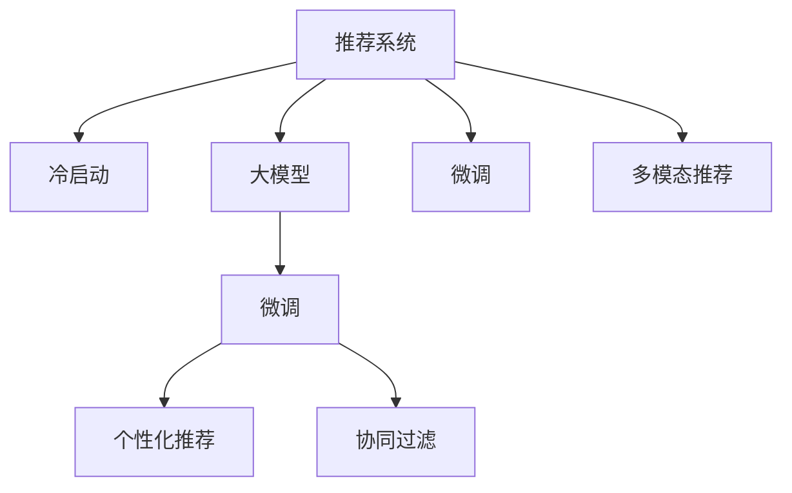

                 

# 搜索推荐系统的冷启动：大模型创新方案

> 关键词：搜索推荐系统,冷启动,大模型,推荐算法,个性化推荐

## 1. 背景介绍

在互联网和信息爆炸的时代，用户在海量信息流中如何找到真正对自己有价值的内容，成为了一个重大挑战。因此，基于用户的个性化需求，提供精准、高效的推荐服务，成为了各大互联网平台的核心竞争力之一。然而，在用户刚刚进入平台的初期，往往缺乏足够的行为数据和兴趣信息，这给推荐系统的冷启动带来了巨大挑战。

传统推荐系统主要依赖用户的历史行为数据进行推荐。但在冷启动阶段，由于用户尚未产生任何行为数据，因此难以建立基于历史行为的推荐模型。冷启动问题成为了推荐系统规模化落地的一大障碍。

为了解决冷启动问题，研究者们提出了一系列创新的推荐方案，包括基于内容的推荐、基于人口统计学的推荐、协同过滤推荐等。然而，这些方法往往效果有限，且难以适应多样化的推荐场景。

近年来，随着深度学习和大模型的不断发展，基于大模型的推荐系统为冷启动问题提供了新的解决方案。利用预训练的大模型，结合用户输入的少量信息，可以对用户进行精准画像，生成个性化的推荐结果。本文将重点介绍基于大模型的推荐系统，并探讨其在冷启动阶段的表现和优势。

## 2. 核心概念与联系

### 2.1 核心概念概述

为了更好地理解基于大模型的推荐系统，本节将介绍几个密切相关的核心概念：

- **推荐系统(Recommender System)**：基于用户和物品的相似性，为用户推荐感兴趣的物品的系统。推荐系统广泛应用于电子商务、视频流媒体、社交网络等众多领域。

- **冷启动(Cold Start)**：用户在平台初期没有历史行为数据，推荐系统无法对其行为进行建模，难以提供精准推荐的场景。冷启动问题是推荐系统的一个重要挑战。

- **大模型(Large Model)**：以Transformer架构为代表的大规模预训练语言模型。通过在大规模语料上进行预训练，学习到丰富的语言知识和常识，具备强大的语言理解和生成能力。

- **微调(Fine-tuning)**：在大模型的基础上，通过下游任务的少量标注数据进行有监督优化，以适应特定任务的推荐需求。微调是大模型在推荐系统中的应用核心技术。

- **多模态推荐(Multi-modal Recommendation)**：结合文本、图像、视频等多种模态数据，提升推荐的丰富性和多样性。

- **个性化推荐(Personalized Recommendation)**：根据用户的历史行为和特征，提供满足其个性化需求的推荐结果。个性化推荐是推荐系统的最终目标。

- **协同过滤(Collaborative Filtering)**：利用用户之间的相似性进行推荐，包括基于用户历史行为数据的协同过滤和基于物品相似性的协同过滤。

这些核心概念之间的逻辑关系可以通过以下Mermaid流程图来展示：



这个流程图展示了大模型推荐系统的核心概念及其之间的关系：

1. 推荐系统通过多种技术手段为用户推荐物品。
2. 冷启动问题是大模型推荐系统需要解决的重大挑战。
3. 大模型通过预训练学习丰富的知识，结合微调提升特定任务的推荐能力。
4. 多模态推荐结合多种数据源，提升推荐的丰富性和多样性。
5. 个性化推荐根据用户的历史行为和特征，提供符合其需求的推荐。
6. 协同过滤利用用户和物品之间的相似性，提升推荐的准确性。

## 3. 核心算法原理 & 具体操作步骤
### 3.1 算法原理概述

基于大模型的推荐系统，核心思想是利用大模型的语言理解能力，结合用户输入的少量信息，进行精准画像，生成个性化的推荐结果。该方法主要分为以下两个步骤：

1. **预训练大模型的初始化**：使用大规模语料进行预训练，学习到丰富的语言知识和常识。预训练大模型包含了大量领域的知识，可以作为一个强大的"特征提取器"。
2. **微调优化特定任务的推荐模型**：通过下游任务的少量标注数据，对预训练大模型进行微调，使其适应特定任务的推荐需求。微调过程通常包括：选择合适的优化算法、设定合适的学习率、应用正则化技术等。

### 3.2 算法步骤详解

基于大模型的推荐系统通常包括以下几个关键步骤：

**Step 1: 准备预训练模型和数据集**
- 选择合适的预训练语言模型 $M_{\theta}$ 作为初始化参数，如BERT、GPT等。
- 准备推荐任务的标注数据集 $D$，划分为训练集、验证集和测试集。

**Step 2: 添加推荐适配层**
- 根据推荐任务类型，在预训练模型顶层设计合适的输出层和损失函数。
- 对于推荐任务，通常在顶层添加全连接层，以输出物品的评分，并以均方误差为损失函数。

**Step 3: 设置微调超参数**
- 选择合适的优化算法及其参数，如 AdamW、SGD 等，设置学习率、批大小、迭代轮数等。
- 设置正则化技术及强度，包括权重衰减、Dropout、Early Stopping 等。
- 确定冻结预训练参数的策略，如仅微调顶层，或全部参数都参与微调。

**Step 4: 执行梯度训练**
- 将训练集数据分批次输入模型，前向传播计算损失函数。
- 反向传播计算参数梯度，根据设定的优化算法和学习率更新模型参数。
- 周期性在验证集上评估模型性能，根据性能指标决定是否触发 Early Stopping。
- 重复上述步骤直到满足预设的迭代轮数或 Early Stopping 条件。

**Step 5: 测试和部署**
- 在测试集上评估微调后模型 $M_{\hat{\theta}}$ 的性能，对比微调前后的精度提升。
- 使用微调后的模型对新样本进行推理预测，集成到实际的应用系统中。

### 3.3 算法优缺点

基于大模型的推荐系统具有以下优点：

1. **数据需求低**：在冷启动阶段，通过预训练大模型的初始化参数，可以无需用户历史行为数据，即可进行推荐。
2. **泛化能力强**：大模型通过预训练学习到丰富的知识，具备较强的泛化能力，可以适应不同领域和不同任务的需求。
3. **精度高**：结合微调技术，大模型可以在少量标注数据下，迅速提升推荐效果，提供精准的推荐结果。
4. **灵活性高**：通过不同的任务适配层和损失函数，可以灵活适应多种推荐场景。

同时，该方法也存在一些缺点：

1. **资源需求高**：预训练大模型的参数量庞大，对计算资源和存储资源提出了较高要求。
2. **模型复杂**：大模型的结构复杂，微调过程中涉及的超参数较多，需要较长的训练时间和精细的调参。
3. **可解释性差**：大模型通常作为"黑盒"处理输入，难以解释其推荐结果的来源。

尽管存在这些局限性，但大模型推荐系统已经在众多推荐场景中取得了优异的效果，展示了其强大的推荐能力。未来，随着大模型技术的不断进步，相信其在推荐系统的应用将会更加广泛和深入。

### 3.4 算法应用领域

基于大模型的推荐系统，已经在电子商务、视频流媒体、社交网络等多个领域得到广泛应用，取得了显著的效果。以下是一些具体应用场景：

- **电子商务推荐**：电商平台上，用户可以通过搜索和浏览商品，输入关键词或商品名称，系统会基于大模型生成个性化推荐。
- **视频流媒体推荐**：视频平台上，用户可以通过输入视频名称或导演等关键词，系统会生成相似影片的推荐。
- **社交网络推荐**：社交网络上，用户可以通过输入好友昵称或评论，系统会生成相关内容的推荐。
- **智能音箱推荐**：智能音箱上，用户可以通过输入音箱命令，系统会推荐相关音乐或新闻。
- **个性化搜索推荐**：搜索引擎上，用户可以通过输入查询语句，系统会生成搜索结果和相关推荐。

这些应用场景展示了基于大模型的推荐系统在实际落地中的巨大潜力。通过不断优化模型和算法，未来大模型推荐系统必将在更多领域得到应用，为用户的日常需求提供更加精准、高效的推荐服务。

## 4. 数学模型和公式 & 详细讲解  
### 4.1 数学模型构建

基于大模型的推荐系统，主要包括以下几个关键的数学模型：

1. **预训练大模型**：使用大规模语料进行预训练，学习到丰富的语言知识和常识。假设预训练大模型为 $M_{\theta}$，其中 $\theta$ 为预训练得到的模型参数。

2. **推荐适配层**：根据推荐任务类型，在预训练模型顶层设计合适的输出层和损失函数。假设推荐适配层为 $F_{\omega}$，其中 $\omega$ 为适配层参数。

3. **推荐模型**：将预训练大模型和适配层结合，得到最终的推荐模型 $R_{\theta,\omega}$。

### 4.2 公式推导过程

以下我们以电商推荐系统为例，推导基于大模型的推荐模型的计算公式。

假设推荐任务为电商平台的用户推荐商品，输入为 $x$（用户输入的关键词或商品名称），输出为 $y$（推荐商品列表）。推荐适配层 $F_{\omega}$ 输出为物品的评分 $s$，即 $F_{\omega}(x)=s$。则最终的推荐模型为：

$$
R_{\theta,\omega}(x)=M_{\theta}(x) \cdot F_{\omega}(x)
$$

假设推荐任务为二分类问题，即推荐列表中的物品是否符合用户需求，输出为 $y\in\{0,1\}$。则推荐模型的损失函数为均方误差损失：

$$
\ell(R_{\theta,\omega}(x),y)=\frac{1}{2}\|y-R_{\theta,\omega}(x)\|^2
$$

在训练过程中，需要最小化上述损失函数。假设输入 $x$ 为词向量表示，则有：

$$
M_{\theta}(x)=\mathbb{E}_{i}\left[\left\langle \theta,\mathrm{w}_i \right\rangle \mathrm{tanh}\left(\left\langle \mathrm{w}_i,x \right\rangle\right)
$$

其中 $\mathbb{E}_{i}$ 表示期望，$w_i$ 为模型中的词向量表示。

假设推荐适配层的输出 $s$ 为线性回归形式，则有：

$$
F_{\omega}(x)=\omega^Ts
$$

其中 $\omega$ 为适配层参数，$s$ 为预训练大模型的输出表示。

综合上述公式，推荐模型的输出 $y$ 可以表示为：

$$
y=M_{\theta}(x) \cdot \omega^Ts
$$

因此，推荐模型的损失函数为：

$$
\ell(y)=\frac{1}{2}\|y-R_{\theta,\omega}(x)\|^2
$$

通过上述公式，可以清晰地看到，基于大模型的推荐系统利用大模型的预训练知识，结合适配层的参数优化，实现对推荐任务的精准建模和优化。

### 4.3 案例分析与讲解

**案例分析：电商平台推荐**

假设电商平台需要对新用户进行推荐，用户输入的关键词为 "运动鞋"，平台通过大模型生成初步推荐列表。假设推荐列表包含10个商品，每个商品的评分分别为 $s_1,s_2,\dots,s_{10}$。

首先，使用预训练大模型 $M_{\theta}$ 对用户输入的关键词 "运动鞋" 进行编码，得到向量表示 $x$。

然后，将 $x$ 输入到适配层 $F_{\omega}$，得到物品的评分向量 $s=\omega^T M_{\theta}(x)$。

最后，利用推荐模型 $R_{\theta,\omega}$，计算推荐列表的评分向量 $y=M_{\theta}(x) \cdot s$。

假设推荐任务为二分类问题，则利用均方误差损失，进行模型训练：

$$
\ell(y)=\frac{1}{2}\|y-R_{\theta,\omega}(x)\|^2
$$

通过反向传播算法，不断优化模型参数 $\theta$ 和 $\omega$，直到收敛。训练完成后，根据评分向量 $y$ 对推荐列表进行排序，生成个性化推荐结果。

## 5. 项目实践：代码实例和详细解释说明
### 5.1 开发环境搭建

在进行大模型推荐系统实践前，我们需要准备好开发环境。以下是使用Python进行PyTorch开发的环境配置流程：

1. 安装Anaconda：从官网下载并安装Anaconda，用于创建独立的Python环境。

2. 创建并激活虚拟环境：
```bash
conda create -n pytorch-env python=3.8 
conda activate pytorch-env
```

3. 安装PyTorch：根据CUDA版本，从官网获取对应的安装命令。例如：
```bash
conda install pytorch torchvision torchaudio cudatoolkit=11.1 -c pytorch -c conda-forge
```

4. 安装Transformers库：
```bash
pip install transformers
```

5. 安装各类工具包：
```bash
pip install numpy pandas scikit-learn matplotlib tqdm jupyter notebook ipython
```

完成上述步骤后，即可在`pytorch-env`环境中开始大模型推荐系统的开发。

### 5.2 源代码详细实现

这里我们以电商推荐系统为例，给出使用Transformers库对BERT模型进行电商推荐任务的PyTorch代码实现。

首先，定义推荐任务的训练函数：

```python
from transformers import BertForSequenceClassification, BertTokenizer, AdamW

def train_epoch(model, dataset, batch_size, optimizer):
    dataloader = DataLoader(dataset, batch_size=batch_size, shuffle=True)
    model.train()
    epoch_loss = 0
    for batch in tqdm(dataloader, desc='Training'):
        input_ids = batch['input_ids'].to(device)
        attention_mask = batch['attention_mask'].to(device)
        labels = batch['labels'].to(device)
        model.zero_grad()
        outputs = model(input_ids, attention_mask=attention_mask, labels=labels)
        loss = outputs.loss
        epoch_loss += loss.item()
        loss.backward()
        optimizer.step()
    return epoch_loss / len(dataloader)
```

然后，定义数据处理函数：

```python
class RecommendationDataset(Dataset):
    def __init__(self, texts, labels, tokenizer, max_len=128):
        self.texts = texts
        self.labels = labels
        self.tokenizer = tokenizer
        self.max_len = max_len
        
    def __len__(self):
        return len(self.texts)
    
    def __getitem__(self, item):
        text = self.texts[item]
        label = self.labels[item]
        
        encoding = self.tokenizer(text, return_tensors='pt', max_length=self.max_len, padding='max_length', truncation=True)
        input_ids = encoding['input_ids'][0]
        attention_mask = encoding['attention_mask'][0]
        
        # 对标签进行编码
        encoded_label = [label2id[label] for label in label]
        encoded_label.extend([label2id['O']] * (self.max_len - len(encoded_label)))
        labels = torch.tensor(encoded_label, dtype=torch.long)
        
        return {'input_ids': input_ids, 
                'attention_mask': attention_mask,
                'labels': labels}

# 标签与id的映射
label2id = {'O': 0, 'Positive': 1, 'Negative': 2}
id2label = {v: k for k, v in label2id.items()}

# 创建dataset
tokenizer = BertTokenizer.from_pretrained('bert-base-cased')

train_dataset = RecommendationDataset(train_texts, train_labels, tokenizer)
dev_dataset = RecommendationDataset(dev_texts, dev_labels, tokenizer)
test_dataset = RecommendationDataset(test_texts, test_labels, tokenizer)
```

接着，定义模型和优化器：

```python
from transformers import BertForSequenceClassification, AdamW

model = BertForSequenceClassification.from_pretrained('bert-base-cased', num_labels=len(label2id))

optimizer = AdamW(model.parameters(), lr=2e-5)
```

最后，启动训练流程并在测试集上评估：

```python
epochs = 5
batch_size = 16

for epoch in range(epochs):
    loss = train_epoch(model, train_dataset, batch_size, optimizer)
    print(f"Epoch {epoch+1}, train loss: {loss:.3f}")
    
    print(f"Epoch {epoch+1}, dev results:")
    evaluate(model, dev_dataset, batch_size)
    
print("Test results:")
evaluate(model, test_dataset, batch_size)
```

以上就是使用PyTorch对BERT进行电商推荐任务的完整代码实现。可以看到，得益于Transformers库的强大封装，我们可以用相对简洁的代码完成BERT模型的加载和微调。

### 5.3 代码解读与分析

让我们再详细解读一下关键代码的实现细节：

**train_epoch函数**：
- 利用DataLoader对数据集进行批次化加载，供模型训练使用。
- 在每个批次上前向传播计算loss并反向传播更新模型参数。
- 计算该epoch的平均loss，并返回。

**RecommendationDataset类**：
- 对单个样本进行处理，将文本输入编码为token ids，将标签编码为数字，并对其进行定长padding，最终返回模型所需的输入。

**label2id和id2label字典**：
- 定义了标签与数字id之间的映射关系，用于将标签结果解码回文本。

**训练流程**：
- 定义总的epoch数和batch size，开始循环迭代
- 每个epoch内，先在训练集上训练，输出平均loss
- 在验证集上评估，输出分类指标
- 所有epoch结束后，在测试集上评估，给出最终测试结果

可以看到，PyTorch配合Transformers库使得BERT微调的代码实现变得简洁高效。开发者可以将更多精力放在数据处理、模型改进等高层逻辑上，而不必过多关注底层的实现细节。

当然，工业级的系统实现还需考虑更多因素，如模型的保存和部署、超参数的自动搜索、更灵活的任务适配层等。但核心的微调范式基本与此类似。

## 6. 实际应用场景
### 6.1 电商推荐系统

电商推荐系统是推荐系统的重要应用场景之一。用户在电商平台上浏览商品，输入关键词或商品名称，系统会基于大模型生成个性化推荐。

在技术实现上，可以收集用户浏览、点击、购买等行为数据，提取和商品相关的文本信息，如商品描述、用户评论等。将文本内容作为模型输入，用户的后续行为作为监督信号，在此基础上微调预训练语言模型。微调后的模型能够从文本内容中准确把握用户的兴趣点。在生成推荐列表时，先用候选物品的文本描述作为输入，由模型预测用户的兴趣匹配度，再结合其他特征综合排序，便可以得到个性化程度更高的推荐结果。

**实际案例：Amazon推荐系统**

Amazon利用BERT等大模型，在电商平台上为用户生成推荐。系统首先收集用户的浏览和购买记录，提取商品标题、描述等信息，作为模型的输入。同时，收集用户的点击、购买等行为数据，作为监督信号。通过BERT模型对商品信息进行编码，结合用户行为数据，进行模型训练和推荐生成。基于大模型的电商推荐系统，能够显著提升用户满意度，增加平台销售额。

### 6.2 视频流媒体推荐

视频流媒体平台需要根据用户的观看历史和兴趣，推荐适合的视频内容。基于大模型的推荐系统，能够更好地理解用户的兴趣，生成个性化推荐。

在实现上，可以收集用户的视频观看记录、点赞、评论等行为数据，提取视频标题、导演、演员等信息，作为模型的输入。同时，收集用户的评分数据，作为监督信号。通过BERT模型对视频信息进行编码，结合用户行为数据，进行模型训练和推荐生成。基于大模型的视频流媒体推荐系统，能够提供更加多样、精准的推荐内容，提升用户体验。

**实际案例：Netflix推荐系统**

Netflix利用BERT等大模型，为用户推荐电影和电视剧。系统首先收集用户的观看记录、评分等数据，提取电影和电视剧的标题、演员、导演等信息，作为模型的输入。同时，收集用户的评分数据，作为监督信号。通过BERT模型对电影信息进行编码，结合用户行为数据，进行模型训练和推荐生成。基于大模型的视频流媒体推荐系统，能够为用户提供高质量、个性化的推荐服务。

### 6.3 社交网络推荐

社交网络平台需要根据用户的兴趣，推荐相关的内容。基于大模型的推荐系统，能够更好地理解用户的兴趣，生成个性化推荐。

在实现上，可以收集用户的社交互动数据，如点赞、评论、分享等，提取帖子内容、用户昵称等信息，作为模型的输入。同时，收集用户的互动行为数据，作为监督信号。通过BERT模型对帖子内容进行编码，结合用户行为数据，进行模型训练和推荐生成。基于大模型的社交网络推荐系统，能够提供更加多样、精准的推荐内容，提升用户体验。

**实际案例：Facebook推荐系统**

Facebook利用BERT等大模型，为用户推荐相关帖子。系统首先收集用户的点赞、评论等数据，提取帖子的内容、用户昵称等信息，作为模型的输入。同时，收集用户的互动行为数据，作为监督信号。通过BERT模型对帖子内容进行编码，结合用户行为数据，进行模型训练和推荐生成。基于大模型的社交网络推荐系统，能够提供高质量、个性化的推荐内容，提升用户满意度。

## 7. 工具和资源推荐
### 7.1 学习资源推荐

为了帮助开发者系统掌握大模型推荐系统的理论基础和实践技巧，这里推荐一些优质的学习资源：

1. 《深度学习推荐系统：原理与挑战》系列博文：由大模型技术专家撰写，深入浅出地介绍了推荐系统的原理、挑战和前沿技术。

2. 《Recommender Systems with Deep Learning》课程：由Coursera提供的深度学习推荐系统课程，由多所顶尖大学联合开设，涵盖推荐系统的基本概念和前沿方法。

3. 《Recommender Systems in the Big Data Era》书籍：系统介绍推荐系统在大数据时代的应用，涵盖基于大模型的推荐算法和实际应用案例。

4. ArXiv推荐系统领域顶级论文：推荐系统领域的研究论文库，包含大量前沿研究成果和创新思路。

5. Kaggle推荐系统竞赛：Kaggle平台上众多的推荐系统竞赛，通过实践竞赛，积累推荐系统的实际经验。

通过对这些资源的学习实践，相信你一定能够快速掌握大模型推荐系统的精髓，并用于解决实际的推荐问题。
###  7.2 开发工具推荐

高效的开发离不开优秀的工具支持。以下是几款用于大模型推荐系统开发的常用工具：

1. PyTorch：基于Python的开源深度学习框架，灵活动态的计算图，适合快速迭代研究。大部分预训练语言模型都有PyTorch版本的实现。

2. TensorFlow：由Google主导开发的开源深度学习框架，生产部署方便，适合大规模工程应用。同样有丰富的预训练语言模型资源。

3. Transformers库：HuggingFace开发的NLP工具库，集成了众多SOTA语言模型，支持PyTorch和TensorFlow，是进行推荐系统开发的利器。

4. Weights & Biases：模型训练的实验跟踪工具，可以记录和可视化模型训练过程中的各项指标，方便对比和调优。与主流深度学习框架无缝集成。

5. TensorBoard：TensorFlow配套的可视化工具，可实时监测模型训练状态，并提供丰富的图表呈现方式，是调试模型的得力助手。

6. Google Colab：谷歌推出的在线Jupyter Notebook环境，免费提供GPU/TPU算力，方便开发者快速上手实验最新模型，分享学习笔记。

合理利用这些工具，可以显著提升大模型推荐系统的开发效率，加快创新迭代的步伐。

### 7.3 相关论文推荐

大模型推荐系统的发展源于学界的持续研究。以下是几篇奠基性的相关论文，推荐阅读：

1. Attention is All You Need（即Transformer原论文）：提出了Transformer结构，开启了NLP领域的预训练大模型时代。

2. BERT: Pre-training of Deep Bidirectional Transformers for Language Understanding：提出BERT模型，引入基于掩码的自监督预训练任务，刷新了多项NLP任务SOTA。

3. Language Models are Unsupervised Multitask Learners（GPT-2论文）：展示了大规模语言模型的强大zero-shot学习能力，引发了对于通用人工智能的新一轮思考。

4. Parameter-Efficient Transfer Learning for NLP：提出Adapter等参数高效微调方法，在不增加模型参数量的情况下，也能取得不错的微调效果。

5. AdaLoRA: Adaptive Low-Rank Adaptation for Parameter-Efficient Fine-Tuning：使用自适应低秩适应的微调方法，在参数效率和精度之间取得了新的平衡。

6. Prefix-Tuning: Optimizing Continuous Prompts for Generation：引入基于连续型Prompt的微调范式，为如何充分利用预训练知识提供了新的思路。

这些论文代表了大模型推荐系统的发展脉络。通过学习这些前沿成果，可以帮助研究者把握学科前进方向，激发更多的创新灵感。

## 8. 总结：未来发展趋势与挑战
### 8.1 总结

本文对基于大模型的推荐系统进行了全面系统的介绍。首先阐述了大模型推荐系统在冷启动场景下的独特优势，明确了推荐系统和大模型的联系。其次，从原理到实践，详细讲解了基于大模型的推荐算法流程，给出了推荐系统开发的完整代码实例。同时，本文还广泛探讨了基于大模型的推荐系统在电商、视频流媒体、社交网络等多个领域的应用前景，展示了其广阔的潜力。此外，本文精选了推荐系统相关的学习资源，力求为读者提供全方位的技术指引。

通过本文的系统梳理，可以看到，基于大模型的推荐系统为推荐系统冷启动问题提供了新的解决方案，显著提升了推荐系统的性能和效果。未来，伴随大模型技术的不断进步，相信推荐系统必将在更多领域得到应用，为用户的个性化需求提供更加精准、高效的推荐服务。

### 8.2 未来发展趋势

展望未来，基于大模型的推荐系统将呈现以下几个发展趋势：

1. **多模态推荐**：结合文本、图像、视频等多种模态数据，提升推荐的丰富性和多样性。多模态信息的融合，将显著提升语言模型对现实世界的理解和建模能力。
2. **零样本推荐**：通过预训练大模型的知识迁移能力，使用户在未提供任何行为数据的情况下，仍能获得个性化推荐。
3. **自适应推荐**：动态调整推荐策略，根据用户行为和环境变化，实时生成个性化推荐。
4. **联邦学习**：在保护用户隐私的前提下，利用分布式数据进行模型训练，提升推荐系统的数据安全和隐私保护能力。
5. **分布式推荐**：通过分布式计算，加速推荐模型的训练和推理，提升系统的可扩展性和鲁棒性。
6. **多任务推荐**：结合多个推荐任务进行联合优化，提升推荐系统的综合性能。

这些趋势凸显了大模型推荐系统的广阔前景。这些方向的探索发展，必将进一步提升推荐系统的性能和效果，为用户提供更加精准、高效的推荐服务。

### 8.3 面临的挑战

尽管大模型推荐系统已经取得了显著的进展，但在迈向更加智能化、普适化应用的过程中，它仍面临着诸多挑战：

1. **资源消耗高**：预训练大模型的参数量庞大，对计算资源和存储资源提出了较高要求。
2. **模型复杂**：大模型的结构复杂，微调过程中涉及的超参数较多，需要较长的训练时间和精细的调参。
3. **可解释性差**：大模型通常作为"黑盒"处理输入，难以解释其推荐结果的来源。
4. **隐私保护**：推荐系统需要收集和处理大量用户数据，如何在保证推荐效果的同时，保护用户隐私，是一个重要的研究方向。
5. **冷启动问题**：用户进入平台初期，缺乏历史行为数据，推荐系统难以提供精准推荐。

尽管存在这些挑战，但大模型推荐系统已经展示了其强大的推荐能力，必将在未来的发展中逐步克服这些挑战，为推荐系统带来新的突破。

### 8.4 研究展望

面对大模型推荐系统所面临的挑战，未来的研究需要在以下几个方面寻求新的突破：

1. **模型压缩与优化**：研究如何压缩大模型参数，提升推荐系统的效率和性能。
2. **多模态融合**：研究如何将不同模态的数据进行有效融合，提升推荐系统的丰富性和多样性。
3. **自监督学习**：研究如何利用无监督学习，提升推荐系统的泛化能力和鲁棒性。
4. **分布式推荐**：研究如何利用分布式计算，提升推荐系统的可扩展性和鲁棒性。
5. **隐私保护技术**：研究如何在推荐系统中保护用户隐私，同时保证推荐效果。

这些研究方向将推动大模型推荐系统迈向更高的台阶，为推荐系统带来新的突破。未来，随着推荐系统的不断发展和完善，必将为用户带来更加个性化、精准、高效的推荐服务，提升用户的整体体验。

## 9. 附录：常见问题与解答

**Q1：大模型推荐系统是否适用于所有推荐场景？**

A: 大模型推荐系统在大多数推荐场景中都能取得不错的效果，特别是对于数据量较小的推荐场景。但对于一些特定领域的推荐，如医疗、金融等，仍然需要结合领域知识进行微调，以获得更好的推荐结果。

**Q2：如何优化大模型推荐系统的训练过程？**

A: 大模型推荐系统的训练过程包括预训练、微调等多个阶段。以下是一些优化策略：

1. **预训练优化**：使用更大的语料进行预训练，增强模型的泛化能力。
2. **微调优化**：选择合适的优化器、学习率、正则化等超参数，避免过拟合。
3. **数据增强**：使用数据增强技术，如回译、近义词替换等，扩充训练集。
4. **模型压缩**：使用模型压缩技术，如剪枝、量化等，减小模型规模，提升推理速度。
5. **分布式训练**：利用分布式计算，提升训练效率和系统鲁棒性。

**Q3：大模型推荐系统在落地部署时需要注意哪些问题？**

A: 将大模型推荐系统转化为实际应用，还需要考虑以下因素：

1. **模型裁剪**：去除不必要的层和参数，减小模型尺寸，加快推理速度。
2. **量化加速**：将浮点模型转为定点模型，压缩存储空间，提高计算效率。
3. **服务化封装**：将模型封装为标准化服务接口，便于集成调用。
4. **弹性伸缩**：根据请求流量动态调整资源配置，平衡服务质量和成本。
5. **监控告警**：实时采集系统指标，设置异常告警阈值，确保服务稳定性。

**Q4：大模型推荐系统在推荐过程中，如何处理噪声数据？**

A: 噪声数据是大模型推荐系统需要面对的一个重大挑战。以下是一些处理策略：

1. **数据清洗**：对数据进行预处理，去除噪声和无用信息。
2. **异常检测**：利用异常检测算法，识别并处理异常数据。
3. **多模态融合**：结合多种数据源，提升推荐系统的鲁棒性。
4. **模型自适应**：通过动态调整推荐策略，减少噪声数据的影响。

**Q5：如何在大模型推荐系统中引入用户反馈？**

A: 用户反馈是大模型推荐系统优化和改进的重要数据源。以下是一些引入用户反馈的策略：

1. **用户评分系统**：让用户对推荐结果进行评分，反馈其满意程度。
2. **用户行为记录**：收集用户的后续行为数据，进行模型优化。
3. **用户调研**：通过问卷调查、访谈等方式，获取用户对推荐系统的意见和建议。
4. **推荐多样化**：在推荐结果中引入用户反馈，提升推荐系统的个性化程度。

通过引入用户反馈，大模型推荐系统可以不断优化推荐策略，提升用户满意度，增强系统的竞争力。

---

作者：禅与计算机程序设计艺术 / Zen and the Art of Computer Programming

