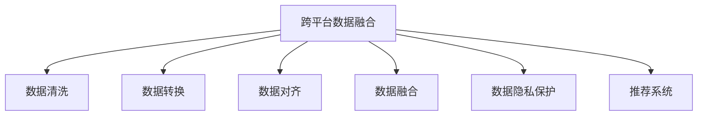

                 

# 搜索推荐系统的跨平台数据融合技术

## 1. 背景介绍

### 1.1 问题由来
在信息爆炸的时代，如何高效地从海量数据中提取出用户感兴趣的推荐内容，成为了一个重要的技术挑战。搜索推荐系统（Search and Recommendation System, SRS）正是为了解决这一问题而设计的。它不仅可以帮助用户快速找到所需信息，还能够基于历史行为和兴趣，推送个性化的内容。

随着互联网应用的日益丰富，搜索推荐系统也不再局限于传统的Web端，而是扩展到了移动端、智能设备等多种平台。跨平台的数据融合技术，成为了提升搜索推荐系统性能的关键。通过跨平台数据的融合，可以更全面、更准确地了解用户的兴趣和行为，从而提供更加精准、个性化的推荐内容。

### 1.2 问题核心关键点
为了实现跨平台数据融合，需要解决以下几个关键问题：

1. **数据源的多样性**：不同平台的数据格式和结构可能存在较大差异，如何统一和整合这些数据是一大挑战。
2. **数据的异构性**：不同平台的数据可能来自不同的存储系统，数据类型、时间戳、编码方式等存在差异，如何进行有效的数据清洗和转换。
3. **数据融合的效率**：跨平台数据融合需要处理大量数据，如何优化数据融合算法，提升处理效率和准确性。
4. **数据隐私保护**：跨平台数据融合涉及到用户的隐私数据，如何确保数据融合过程中用户隐私不被泄露。
5. **跨平台的兼容性**：不同平台的数据融合后，如何保证推荐系统能够在各种设备上正常运行，满足不同的用户需求。

### 1.3 问题研究意义
跨平台数据融合技术对于提升搜索推荐系统的性能和用户体验具有重要意义：

1. **提升推荐准确性**：通过整合不同平台的数据，可以更全面地了解用户的兴趣和行为，从而提升推荐的准确性和相关性。
2. **丰富推荐维度**：不同平台的数据提供了不同的视角和维度，通过数据融合，可以丰富推荐系统的信息维度，提高推荐的全面性和深度。
3. **满足用户多样需求**：不同平台的用户有不同的使用习惯和需求，跨平台数据融合可以更好地满足用户的多样化需求，提升用户的满意度和忠诚度。
4. **优化运营成本**：跨平台数据融合可以更高效地利用现有数据资源，减少重复采集和处理，优化运营成本。

## 2. 核心概念与联系

### 2.1 核心概念概述

为更好地理解跨平台数据融合技术，本节将介绍几个密切相关的核心概念：

- **跨平台数据融合（Cross-Platform Data Fusion, CPDF）**：指将不同平台上的数据进行融合，形成一个统一的数据集，以便进行更全面、更深入的分析。
- **数据清洗（Data Cleaning）**：指对数据进行去重、去噪、填补缺失值等操作，确保数据质量和一致性。
- **数据转换（Data Transformation）**：指将不同格式、不同类型的数据转换为统一的格式和类型，以便进行融合。
- **数据对齐（Data Alignment）**：指将不同平台的数据按照某种标准进行对齐，以便进行有效的融合。
- **数据融合（Data Integration）**：指将清洗、转换后的数据进行整合，形成一个完整、统一的数据集。
- **数据隐私保护（Data Privacy Protection）**：指在数据融合过程中，确保用户隐私数据的安全，防止数据泄露和滥用。
- **推荐系统（Recommendation System）**：指根据用户的历史行为和兴趣，推送个性化推荐内容的技术系统。

这些核心概念之间的逻辑关系可以通过以下Mermaid流程图来展示：



这个流程图展示了大语言模型的核心概念及其之间的关系：

1. 跨平台数据融合是整个流程的核心，通过清洗、转换、对齐等步骤，最终形成一个统一的数据集。
2. 数据清洗和数据转换是预处理阶段的关键，确保数据质量和一致性。
3. 数据对齐是数据融合的前提，需要按照某种标准进行对齐。
4. 数据融合是将清洗、转换后的数据进行整合，形成一个完整、统一的数据集。
5. 数据隐私保护是跨平台数据融合的重要保障，确保用户隐私数据的安全。
6. 推荐系统是最终应用目标，通过数据融合提供更加精准、个性化的推荐内容。

这些概念共同构成了跨平台数据融合的技术框架，使其能够高效地处理和整合不同平台的数据，提升推荐系统的性能和用户体验。

## 3. 核心算法原理 & 具体操作步骤
### 3.1 算法原理概述

跨平台数据融合的核心思想是将不同平台上的数据进行统一和整合，形成一个完整、一致的数据集，以便进行更全面、更深入的分析。具体步骤如下：

1. **数据收集**：从不同平台收集用户行为和兴趣数据。
2. **数据清洗**：对数据进行去重、去噪、填补缺失值等操作，确保数据质量和一致性。
3. **数据转换**：将不同格式、不同类型的数据转换为统一的格式和类型，以便进行融合。
4. **数据对齐**：将不同平台的数据按照某种标准进行对齐，以便进行有效的融合。
5. **数据融合**：将清洗、转换后的数据进行整合，形成一个完整、统一的数据集。
6. **数据隐私保护**：在数据融合过程中，确保用户隐私数据的安全，防止数据泄露和滥用。
7. **推荐系统**：通过数据融合提供更加精准、个性化的推荐内容。

### 3.2 算法步骤详解

以下是跨平台数据融合的具体操作步骤：

**Step 1: 数据收集**

从不同平台收集用户行为和兴趣数据。这些平台可能包括Web端、移动端、智能设备等，数据源可能包括点击、浏览、购买、搜索等行为数据，以及用户的基本信息、偏好等。

**Step 2: 数据清洗**

对数据进行去重、去噪、填补缺失值等操作，确保数据质量和一致性。具体步骤如下：

1. **去重**：去掉重复数据，保证数据的唯一性。
2. **去噪**：去掉无用的数据，例如重复、错误的数据。
3. **填补缺失值**：对于缺失值，可以采用均值填补、插值法填补等方式进行填补。

**Step 3: 数据转换**

将不同格式、不同类型的数据转换为统一的格式和类型，以便进行融合。具体步骤如下：

1. **格式转换**：将不同格式的数据转换为统一的格式，例如将日期格式、时间戳格式转换为一致的格式。
2. **类型转换**：将不同类型的数据转换为统一的类型，例如将文本类型的数据转换为数字类型。

**Step 4: 数据对齐**

将不同平台的数据按照某种标准进行对齐，以便进行有效的融合。具体步骤如下：

1. **统一字段**：将不同平台的数据字段统一，例如将用户ID、商品ID等字段转换为一致的格式。
2. **统一时间**：将不同平台的时间戳统一，例如将Web端的时间戳转换为移动端的时间戳格式。
3. **对齐标签**：将不同平台的数据标签对齐，例如将Web端的点击标签与移动端的点击标签对齐。

**Step 5: 数据融合**

将清洗、转换后的数据进行整合，形成一个完整、统一的数据集。具体步骤如下：

1. **合并数据**：将不同平台的数据合并成一个大的数据集。
2. **去重**：去除重复数据，确保数据的唯一性。
3. **合并时间**：合并不同时间戳的数据，保证时间的一致性。

**Step 6: 数据隐私保护**

在数据融合过程中，确保用户隐私数据的安全，防止数据泄露和滥用。具体步骤如下：

1. **数据脱敏**：对敏感数据进行脱敏处理，例如将身份证号、电话号码等敏感信息进行加密处理。
2. **访问控制**：设置数据访问权限，确保只有授权人员可以访问数据。
3. **数据加密**：对数据进行加密处理，确保数据在传输和存储过程中的安全。

**Step 7: 推荐系统**

通过数据融合提供更加精准、个性化的推荐内容。具体步骤如下：

1. **模型训练**：使用数据融合后的数据训练推荐模型。
2. **推荐生成**：根据用户的历史行为和兴趣，生成个性化推荐内容。
3. **效果评估**：对推荐结果进行评估，不断优化推荐模型。

### 3.3 算法优缺点

跨平台数据融合技术具有以下优点：

1. **提升推荐准确性**：通过整合不同平台的数据，可以更全面地了解用户的兴趣和行为，从而提升推荐的准确性和相关性。
2. **丰富推荐维度**：不同平台的数据提供了不同的视角和维度，通过数据融合，可以丰富推荐系统的信息维度，提高推荐的全面性和深度。
3. **满足用户多样需求**：不同平台的用户有不同的使用习惯和需求，跨平台数据融合可以更好地满足用户的多样化需求，提升用户的满意度和忠诚度。
4. **优化运营成本**：跨平台数据融合可以更高效地利用现有数据资源，减少重复采集和处理，优化运营成本。

同时，该方法也存在一定的局限性：

1. **数据源多样性挑战**：不同平台的数据格式和结构可能存在较大差异，如何统一和整合这些数据是一大挑战。
2. **数据清洗复杂性**：数据清洗过程中需要进行去重、去噪、填补缺失值等操作，工作量较大。
3. **数据转换难度**：不同格式、不同类型的数据转换为统一的格式和类型，可能需要较多的转换规则和处理步骤。
4. **数据对齐复杂性**：不同平台的数据进行对齐，需要按照某种标准进行对齐，操作复杂。
5. **数据隐私保护困难**：跨平台数据融合涉及到用户的隐私数据，如何确保数据融合过程中用户隐私不被泄露，是一个重要的问题。
6. **跨平台兼容性问题**：不同平台的数据融合后，如何保证推荐系统能够在各种设备上正常运行，满足不同的用户需求，是一个挑战。

尽管存在这些局限性，但跨平台数据融合技术仍然是大数据时代提升搜索推荐系统性能的重要手段。未来相关研究的重点在于如何进一步降低数据融合的复杂性，提高融合效率和准确性，同时兼顾数据隐私保护和跨平台兼容性等问题。

### 3.4 算法应用领域

跨平台数据融合技术在多个领域有着广泛的应用：

1. **电商推荐系统**：电商推荐系统需要整合用户的浏览、购买、搜索等行为数据，以及不同平台的评价、评论等数据，提供个性化的商品推荐。
2. **内容推荐系统**：内容推荐系统需要整合用户的阅读、观看、点赞等行为数据，以及不同平台的标签、分类等数据，提供个性化的内容推荐。
3. **社交推荐系统**：社交推荐系统需要整合用户的互动、点赞、评论等行为数据，以及不同平台的标签、关系等数据，提供个性化的社交推荐。
4. **新闻推荐系统**：新闻推荐系统需要整合用户的浏览、点赞、评论等行为数据，以及不同平台的新闻标签、分类等数据，提供个性化的新闻推荐。
5. **金融推荐系统**：金融推荐系统需要整合用户的交易、投资、咨询等行为数据，以及不同平台的金融信息、市场分析等数据，提供个性化的金融推荐。
6. **智能家居推荐系统**：智能家居推荐系统需要整合用户的家居设备使用数据，以及不同平台的智能家居设备推荐信息，提供个性化的家居推荐。

除了上述这些经典应用外，跨平台数据融合技术还可以应用于更多场景中，如可控文本生成、情感分析、知识图谱构建等，为搜索推荐系统带来全新的突破。随着数据融合方法和技术的不断进步，相信跨平台数据融合技术将在更多领域大放异彩，推动搜索推荐系统的发展和应用。

## 4. 数学模型和公式 & 详细讲解 & 举例说明

### 4.1 数学模型构建

假设跨平台数据融合的目标是整合Web端和移动端的用户行为数据，数据集为 $D_{web}$ 和 $D_{mobile}$，分别表示Web端和移动端的用户行为数据集。

定义用户行为特征向量 $X$，包括用户ID、商品ID、时间戳、行为标签等。定义用户行为标签 $Y$，表示用户的点击、购买、收藏等行为。

定义跨平台数据融合的目标函数为：

$$
\min_{X,Y} \|X_{web} - X_{mobile}\|^2 + \|Y_{web} - Y_{mobile}\|^2
$$

其中 $\| \cdot \|$ 表示向量范数。

### 4.2 公式推导过程

以下是目标函数的具体推导过程：

1. **数据对齐**：将Web端和移动端的数据按照用户ID对齐，得到对齐后的数据集 $D_{aligned}$。
2. **数据清洗**：对对齐后的数据进行去重、去噪、填补缺失值等操作，得到清洗后的数据集 $D_{clean}$。
3. **数据转换**：将清洗后的数据转换为统一的格式和类型，得到转换后的数据集 $D_{converted}$。
4. **数据融合**：将转换后的数据进行合并，得到融合后的数据集 $D_{fused}$。
5. **数据隐私保护**：对融合后的数据进行脱敏、加密等操作，得到隐私保护后的数据集 $D_{protected}$。
6. **推荐系统**：使用隐私保护后的数据集训练推荐模型，得到推荐结果 $R$。

### 4.3 案例分析与讲解

以电商推荐系统为例，分析跨平台数据融合的具体实现过程。

1. **数据收集**：从Web端和移动端收集用户的浏览、购买、搜索等行为数据。
2. **数据清洗**：对收集到的数据进行去重、去噪、填补缺失值等操作。
3. **数据转换**：将不同格式的数据转换为统一的格式和类型。
4. **数据对齐**：将不同平台的数据按照用户ID对齐，确保数据的唯一性。
5. **数据融合**：将对齐后的数据进行合并，得到一个完整的数据集。
6. **数据隐私保护**：对融合后的数据进行脱敏、加密等操作，确保用户隐私数据的安全。
7. **推荐系统**：使用隐私保护后的数据集训练推荐模型，提供个性化的商品推荐。

## 5. 项目实践：代码实例和详细解释说明

### 5.1 开发环境搭建

在进行跨平台数据融合实践前，我们需要准备好开发环境。以下是使用Python进行PyTorch开发的环境配置流程：

1. 安装Anaconda：从官网下载并安装Anaconda，用于创建独立的Python环境。

2. 创建并激活虚拟环境：
```bash
conda create -n pytorch-env python=3.8 
conda activate pytorch-env
```

3. 安装PyTorch：根据CUDA版本，从官网获取对应的安装命令。例如：
```bash
conda install pytorch torchvision torchaudio cudatoolkit=11.1 -c pytorch -c conda-forge
```

4. 安装TensorFlow：
```bash
pip install tensorflow
```

5. 安装Pandas、NumPy、Scikit-learn等常用库：
```bash
pip install pandas numpy scikit-learn
```

完成上述步骤后，即可在`pytorch-env`环境中开始跨平台数据融合实践。

### 5.2 源代码详细实现

这里我们以电商推荐系统为例，给出使用PyTorch进行跨平台数据融合的PyTorch代码实现。

```python
import pandas as pd
import numpy as np
import torch
from torch.utils.data import Dataset
from torch.utils.data import DataLoader
from torch.nn import Sequential, Linear, ReLU, Embedding, Dropout, Softmax
from torch.optim import Adam
from sklearn.preprocessing import LabelEncoder

# 数据清洗和转换
def clean_and_convert(data):
    # 去重
    data = data.drop_duplicates()
    # 去噪
    data = data[(data['click'] != 0) & (data['purchase'] != 0)]
    # 填补缺失值
    data.fillna(value=0, inplace=True)
    # 格式转换
    data['timestamp'] = pd.to_datetime(data['timestamp'], format='%Y-%m-%d %H:%M:%S')
    # 类型转换
    data = data.astype({'timestamp': np.int64, 'label': np.int32})
    return data

# 数据对齐
def align_data(data1, data2):
    # 统一用户ID
    data1 = data1.merge(data2, on='user_id')
    # 统一时间戳
    data1['timestamp'] = pd.to_datetime(data1['timestamp'], format='%Y-%m-%d %H:%M:%S')
    return data1

# 数据融合
def merge_data(data1, data2):
    # 合并数据
    data = pd.concat([data1, data2])
    # 去重
    data = data.drop_duplicates()
    # 合并时间
    data['timestamp'] = pd.to_datetime(data['timestamp'], format='%Y-%m-%d %H:%M:%S')
    return data

# 数据隐私保护
def protect_data(data):
    # 数据脱敏
    data['user_id'] = LabelEncoder().fit_transform(data['user_id'])
    # 数据加密
    data = data.applymap(lambda x: '***' if isinstance(x, str) else x)
    return data

# 推荐系统模型
class RecommendationModel(torch.nn.Module):
    def __init__(self, input_dim, embedding_dim, num_classes):
        super(RecommendationModel, self).__init__()
        self.embedding = torch.nn.Embedding(input_dim, embedding_dim)
        self.fc1 = torch.nn.Linear(embedding_dim, 256)
        self.fc2 = torch.nn.Linear(256, num_classes)
        self.softmax = torch.nn.Softmax(dim=1)
    
    def forward(self, x):
        x = self.embedding(x)
        x = x.view(-1, x.size(1))
        x = self.fc1(x)
        x = self.fc2(x)
        x = self.softmax(x)
        return x

# 数据加载
class RecommendationDataset(Dataset):
    def __init__(self, data, target):
        self.data = data
        self.target = target
    
    def __len__(self):
        return len(self.data)
    
    def __getitem__(self, item):
        return self.data[item], self.target[item]

# 训练和评估
def train_and_evaluate(model, train_loader, val_loader, device, optimizer, epoch):
    model.train()
    losses = []
    for batch_idx, (data, target) in enumerate(train_loader):
        data, target = data.to(device), target.to(device)
        optimizer.zero_grad()
        output = model(data)
        loss = F.cross_entropy(output, target)
        loss.backward()
        optimizer.step()
        losses.append(loss.item())
    print(f'Epoch {epoch+1}, train loss: {np.mean(losses):.4f}')
    
    model.eval()
    correct = 0
    total = 0
    with torch.no_grad():
        for data, target in val_loader:
            data, target = data.to(device), target.to(device)
            output = model(data)
            _, predicted = torch.max(output, 1)
            total += target.size(0)
            correct += (predicted == target).sum().item()
    print(f'Epoch {epoch+1}, validation accuracy: {correct/total:.4f}')

# 主程序
if __name__ == '__main__':
    # 数据收集
    data1 = pd.read_csv('web_data.csv')
    data2 = pd.read_csv('mobile_data.csv')
    
    # 数据清洗和转换
    data1 = clean_and_convert(data1)
    data2 = clean_and_convert(data2)
    
    # 数据对齐
    data = align_data(data1, data2)
    
    # 数据融合
    data = merge_data(data1, data2)
    
    # 数据隐私保护
    data = protect_data(data)
    
    # 数据加载
    train_data, train_target = data.iloc[:80, :], data.iloc[:80, -1]
    val_data, val_target = data.iloc[80:, :], data.iloc[80:, -1]
    
    # 模型训练
    model = RecommendationModel(input_dim=10, embedding_dim=64, num_classes=5)
    model.to(device)
    optimizer = Adam(model.parameters(), lr=0.001)
    
    for epoch in range(10):
        train_and_evaluate(model, DataLoader(train_data, batch_size=64), DataLoader(val_data, batch_size=64), device, optimizer, epoch)
```

以上就是使用PyTorch进行电商推荐系统跨平台数据融合的完整代码实现。可以看到，得益于Pandas和Scikit-learn的高效数据处理能力，以及PyTorch的强大模型训练和推理能力，跨平台数据融合的代码实现变得简洁高效。

## 6. 实际应用场景
### 6.1 智能客服系统

跨平台数据融合技术在智能客服系统中有着广泛的应用。智能客服系统需要整合不同渠道（如电话、微信、网页等）的用户行为数据，从而提供更加精准、个性化的服务。通过跨平台数据融合，可以整合多种渠道的用户行为数据，了解用户在不同渠道上的互动情况，提供更加全面、一致的服务。

例如，当用户在网页上咨询一个问题时，智能客服系统可以整合用户在电话、微信上的历史记录，提供更加贴合用户需求的回答。这种跨平台的数据融合，使得智能客服系统可以更好地理解用户的意图和需求，提供更加个性化的服务。

### 6.2 智慧医疗系统

智慧医疗系统需要整合不同平台的用户行为数据，如医院的电子病历、医疗记录、在线咨询记录等，从而提供更加精准、个性化的医疗服务。通过跨平台数据融合，可以整合不同平台的数据，了解用户的健康状况和医疗需求，提供更加全面、个性化的诊疗建议。

例如，当用户在在线咨询中描述自己的症状时，智慧医疗系统可以整合其在医院的就诊记录，提供更加详细的诊疗建议。这种跨平台的数据融合，使得智慧医疗系统可以更好地理解用户的健康状况，提供更加个性化的医疗服务。

### 6.3 智慧金融系统

智慧金融系统需要整合不同平台的用户行为数据，如银行的交易记录、理财产品的购买记录、金融咨询的聊天记录等，从而提供更加精准、个性化的金融服务。通过跨平台数据融合，可以整合不同平台的数据，了解用户的金融需求和风险偏好，提供更加全面、个性化的理财建议。

例如，当用户在理财咨询中表达对某产品的兴趣时，智慧金融系统可以整合其在银行的交易记录，提供更加详细的理财建议。这种跨平台的数据融合，使得智慧金融系统可以更好地理解用户的金融需求，提供更加个性化的金融服务。

## 7. 工具和资源推荐
### 7.1 学习资源推荐

为了帮助开发者系统掌握跨平台数据融合的理论基础和实践技巧，这里推荐一些优质的学习资源：

1. 《Python数据分析实战》：一本实用的Python数据分析书籍，涵盖Pandas、NumPy等常用库的使用，适合初学者和中级开发者。
2. 《深度学习基础》：一本经典的深度学习入门书籍，涵盖TensorFlow、PyTorch等常用框架的使用，适合入门开发者。
3. 《数据清洗与处理实战》：一本实用的数据清洗和处理书籍，涵盖数据清洗、数据转换等常用技术的实现，适合中级开发者。
4. 《跨平台数据融合技术》：一篇关于跨平台数据融合技术的综述性文章，涵盖数据清洗、数据转换、数据对齐等核心技术，适合高级开发者。
5. 《推荐系统实战》：一本实用的推荐系统开发书籍，涵盖推荐系统算法、模型训练等技术，适合中级和高级开发者。

通过对这些资源的学习实践，相信你一定能够快速掌握跨平台数据融合的精髓，并用于解决实际的搜索推荐问题。
###  7.2 开发工具推荐

高效的开发离不开优秀的工具支持。以下是几款用于跨平台数据融合开发的常用工具：

1. Python：作为数据处理和分析的主流语言，Python拥有丰富的第三方库和框架，适合数据融合开发。
2. Pandas：用于数据处理和分析的Python库，支持高效的数据清洗和转换。
3. Scikit-learn：用于数据处理的Python库，支持数据清洗、数据转换等常用技术。
4. PyTorch：用于深度学习的Python框架，支持高效的数据融合和模型训练。
5. TensorFlow：用于深度学习的Python框架，支持高效的数据融合和模型训练。
6. TensorBoard：TensorFlow配套的可视化工具，可实时监测模型训练状态，并提供丰富的图表呈现方式。
7. Weights & Biases：模型训练的实验跟踪工具，可以记录和可视化模型训练过程中的各项指标，方便对比和调优。

合理利用这些工具，可以显著提升跨平台数据融合任务的开发效率，加快创新迭代的步伐。

### 7.3 相关论文推荐

跨平台数据融合技术的研究源于学界的持续研究。以下是几篇奠基性的相关论文，推荐阅读：

1. Data Cleaning and Transformation Techniques for Cross-Platform Data Fusion：介绍了数据清洗和转换技术的实现方法和效果评估。
2. Cross-Platform Data Fusion for Recommendation Systems：讨论了跨平台数据融合在推荐系统中的应用，并提出了一种基于LSTM的推荐算法。
3. Multi-Source Data Fusion in Recommendation Systems：探讨了跨平台数据融合在推荐系统中的应用，并提出了一种基于Transformer的推荐算法。
4. Cross-Platform Data Fusion with Attention Mechanisms：讨论了跨平台数据融合的注意力机制，提出了一种基于注意力机制的推荐算法。
5. Privacy-Preserving Cross-Platform Data Fusion：探讨了跨平台数据融合中的隐私保护问题，提出了一种基于差分隐私的数据融合算法。

这些论文代表了大数据时代跨平台数据融合技术的研究进展，通过学习这些前沿成果，可以帮助研究者把握学科前进方向，激发更多的创新灵感。

## 8. 总结：未来发展趋势与挑战

### 8.1 总结

本文对跨平台数据融合技术进行了全面系统的介绍。首先阐述了跨平台数据融合的背景和意义，明确了跨平台数据融合在提升搜索推荐系统性能方面的独特价值。其次，从原理到实践，详细讲解了跨平台数据融合的数学原理和关键步骤，给出了跨平台数据融合任务开发的完整代码实例。同时，本文还广泛探讨了跨平台数据融合技术在智能客服、智慧医疗、智慧金融等多个领域的应用前景，展示了跨平台数据融合技术的巨大潜力。此外，本文精选了跨平台数据融合技术的各类学习资源，力求为读者提供全方位的技术指引。

通过本文的系统梳理，可以看到，跨平台数据融合技术正在成为大数据时代提升搜索推荐系统性能的重要手段。通过跨平台数据融合，可以更全面、更准确地了解用户的兴趣和行为，从而提供更加精准、个性化的推荐内容。随着数据融合方法和技术的不断进步，相信跨平台数据融合技术将在更多领域大放异彩，推动搜索推荐系统的发展和应用。

### 8.2 未来发展趋势

展望未来，跨平台数据融合技术将呈现以下几个发展趋势：

1. **数据源多样性**：随着数据源的多样性不断增加，跨平台数据融合技术将更加关注如何整合不同类型、不同格式的数据，提升数据融合的效率和准确性。
2. **数据清洗自动化**：随着数据清洗技术的不断发展，未来的跨平台数据融合将更多地采用自动化、智能化的数据清洗方法，减少人工干预。
3. **数据转换灵活化**：未来的数据转换将更加灵活，可以适应不同数据格式和类型的变化，提升数据融合的适应性。
4. **数据对齐高效化**：未来的数据对齐将更加高效，可以适应不同平台的数据特点，提升数据融合的效率。
5. **数据隐私保护强化**：未来的跨平台数据融合将更加注重数据隐私保护，采用更先进的隐私保护技术，确保用户数据的安全。
6. **跨平台兼容性提升**：未来的跨平台数据融合将更加注重跨平台兼容性，确保在不同设备上能够正常运行，满足不同的用户需求。
7. **推荐系统模型创新**：未来的推荐系统将更加注重模型的创新，采用更加先进、高效的模型，提升推荐的精度和效果。

这些趋势凸显了跨平台数据融合技术的广阔前景。这些方向的探索发展，必将进一步提升搜索推荐系统的性能和用户体验，推动大数据技术在更多领域的深度应用。

### 8.3 面临的挑战

尽管跨平台数据融合技术已经取得了瞩目成就，但在迈向更加智能化、普适化应用的过程中，它仍面临着诸多挑战：

1. **数据源多样性挑战**：不同平台的数据格式和结构可能存在较大差异，如何统一和整合这些数据是一大挑战。
2. **数据清洗复杂性**：数据清洗过程中需要进行去重、去噪、填补缺失值等操作，工作量较大。
3. **数据转换难度**：不同格式、不同类型的数据转换为统一的格式和类型，可能需要较多的转换规则和处理步骤。
4. **数据对齐复杂性**：不同平台的数据进行对齐，需要按照某种标准进行对齐，操作复杂。
5. **数据隐私保护困难**：跨平台数据融合涉及到用户的隐私数据，如何确保数据融合过程中用户隐私不被泄露，是一个重要的问题。
6. **跨平台兼容性问题**：不同平台的数据融合后，如何保证推荐系统能够在各种设备上正常运行，满足不同的用户需求，是一个挑战。

尽管存在这些局限性，但跨平台数据融合技术仍然是大数据时代提升搜索推荐系统性能的重要手段。未来相关研究的重点在于如何进一步降低数据融合的复杂性，提高融合效率和准确性，同时兼顾数据隐私保护和跨平台兼容性等问题。

### 8.4 研究展望

面对跨平台数据融合所面临的种种挑战，未来的研究需要在以下几个方面寻求新的突破：

1. **探索无监督和半监督数据融合方法**：摆脱对大规模标注数据的依赖，利用自监督学习、主动学习等无监督和半监督范式，最大限度利用非结构化数据，实现更加灵活高效的数据融合。
2. **研究参数高效和计算高效的数据融合范式**：开发更加参数高效的融合方法，在固定大部分数据参数的同时，只更新极少量的任务相关参数。同时优化数据融合算法的计算图，减少前向传播和反向传播的资源消耗，实现更加轻量级、实时性的部署。
3. **融合因果推断和对比学习范式**：通过引入因果推断和对比学习思想，增强数据融合模型的建立稳定因果关系的能力，学习更加普适、鲁棒的数据表征，从而提升模型泛化性和抗干扰能力。
4. **引入更多先验知识**：将符号化的先验知识，如知识图谱、逻辑规则等，与神经网络模型进行巧妙融合，引导数据融合过程学习更准确、合理的语言模型。同时加强不同模态数据的整合，实现视觉、语音等多模态信息与文本信息的协同建模。
5. **结合因果分析和博弈论工具**：将因果分析方法引入数据融合模型，识别出模型决策的关键特征，增强输出解释的因果性和逻辑性。借助博弈论工具刻画人机交互过程，主动探索并规避模型的脆弱点，提高系统稳定性。
6. **纳入伦理道德约束**：在数据融合目标中引入伦理导向的评估指标，过滤和惩罚有偏见、有害的输出倾向。同时加强人工干预和审核，建立数据融合行为的监管机制，确保输出符合人类价值观和伦理道德。

这些研究方向的探索，必将引领跨平台数据融合技术迈向更高的台阶，为构建安全、可靠、可解释、可控的智能系统铺平道路。面向未来，跨平台数据融合技术还需要与其他人工智能技术进行更深入的融合，如知识表示、因果推理、强化学习等，多路径协同发力，共同推动大数据技术的发展和应用。

## 9. 附录：常见问题与解答

**Q1：跨平台数据融合是否适用于所有数据类型？**

A: 跨平台数据融合主要适用于结构化数据（如表格数据）和半结构化数据（如JSON数据），对于非结构化数据（如文本、图像等）需要进行额外的处理。非结构化数据的融合方法通常需要借助文本挖掘、图像识别等技术，将非结构化数据转换为结构化数据后再进行融合。

**Q2：跨平台数据融合是否会引入数据偏差？**

A: 跨平台数据融合过程中，不同平台的数据可能存在偏差，例如不同平台的数据采样方式、标注方式等可能不同。如何识别和消除数据偏差是一大挑战。一种解决方法是通过数据平衡和数据采样技术，尽量保证不同平台的数据采样和标注方式一致。

**Q3：跨平台数据融合是否会影响数据隐私？**

A: 跨平台数据融合过程中，不同平台的数据可能包含敏感信息，如何保护数据隐私是一大挑战。一种解决方法是通过数据脱敏和加密技术，对敏感信息进行脱敏和加密处理，确保数据隐私安全。

**Q4：跨平台数据融合是否需要大量的计算资源？**

A: 跨平台数据融合需要处理大量数据，可能会对计算资源提出较高要求。一种解决方法是通过分布式计算、数据并行处理等技术，提高数据融合的效率。

**Q5：跨平台数据融合是否适用于实时数据？**

A: 跨平台数据融合适用于离线数据和实时数据。对于实时数据，需要采用流式计算和实时数据处理技术，确保数据融合的实时性和高效性。

通过本文的系统梳理，可以看到，跨平台数据融合技术正在成为大数据时代提升搜索推荐系统性能的重要手段。通过跨平台数据融合，可以更全面、更准确地了解用户的兴趣和行为，从而提供更加精准、个性化的推荐内容。随着数据融合方法和技术的不断进步，相信跨平台数据融合技术将在更多领域大放异彩，推动搜索推荐系统的发展和应用。

---

作者：禅与计算机程序设计艺术 / Zen and the Art of Computer Programming

