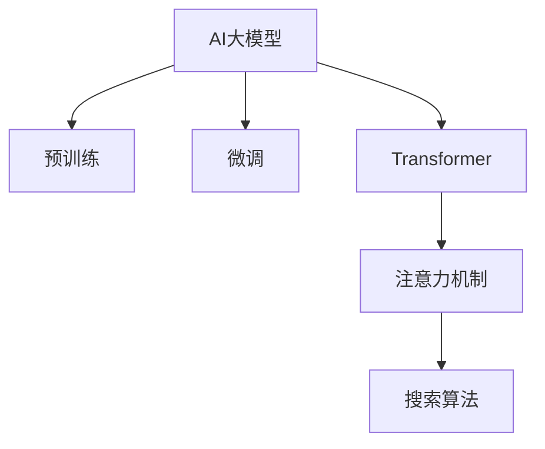

                 

# 搜索算法与AI大模型的完美结合

## 1. 背景介绍

随着人工智能技术的快速发展，搜索算法和AI大模型在各种应用场景中发挥了越来越重要的作用。搜索算法，如二叉搜索、哈希表查找等，在处理大规模数据时显得尤为重要，但其效率往往受到数据结构特性的限制。而AI大模型，尤其是Transformer架构的深度学习模型，通过预训练和微调，具备了强大的数据表示和推理能力。本文将探讨如何将搜索算法与AI大模型进行深度结合，从而大幅提升搜索性能和效率。

## 2. 核心概念与联系

### 2.1 核心概念概述

本节将介绍几个与搜索算法和AI大模型密切相关的核心概念：

- **AI大模型**：指通过大规模数据预训练获得的深度学习模型，如BERT、GPT、DALL·E等。这些模型通常具有强大的语言或图像处理能力，能够进行复杂的推理和生成。

- **搜索算法**：指在数据结构中查找特定值或符合特定条件的元素的方法。常见的搜索算法包括线性搜索、二分查找、哈希表查找等。

- **Transformer**：一种基于自注意力机制的神经网络结构，广泛应用于自然语言处理(NLP)领域。其能够有效地处理长序列数据，适用于大规模语言建模。

- **注意力机制**：指在计算每个位置的表示时，根据注意力权重动态调整输入的表示方式，使得模型能够关注不同的输入位置。

- **预训练和微调**：预训练指在无标签数据上进行大规模训练，获取通用特征表示；微调指在特定任务上进行小规模训练，以优化模型在该任务上的性能。

这些核心概念之间的逻辑关系可以通过以下Mermaid流程图来展示：



这个流程图展示了搜索算法与AI大模型之间的联系：

1. AI大模型通过预训练和微调，获取了丰富的数据表示能力。
2. 注意力机制使得模型在搜索时能够关注特定的位置，提高搜索效率。
3. 搜索算法通过与AI大模型的结合，能够更高效地处理大规模数据。

## 3. 核心算法原理 & 具体操作步骤

### 3.1 算法原理概述

基于AI大模型的搜索算法，本质上是通过深度学习模型对搜索空间进行建模，利用注意力机制对关键位置进行加权，从而提高搜索效率。其核心思想是：

1. **构建表示**：将搜索空间中的每个位置表示为一个向量，利用AI大模型进行学习。
2. **注意力加权**：在计算查询向量与每个位置向量的相似度时，通过注意力机制对位置向量进行加权，使得模型更关注于与查询向量相似的位置。
3. **排序和筛选**：将加权后的位置向量排序，筛选出最相关的结果。

### 3.2 算法步骤详解

基于AI大模型的搜索算法主要包括以下几个关键步骤：

**Step 1: 数据预处理**

- 将搜索空间中的每个位置转化为向量表示。例如，在文本搜索中，可以将每个单词或子串转化为一个固定长度的向量。
- 使用AI大模型对向量进行预训练，获取初始表示。

**Step 2: 构建查询向量**

- 将查询转化为向量表示，例如，在文本搜索中，可以使用Embedding将查询词向量化。

**Step 3: 计算相似度**

- 计算查询向量与每个位置向量的相似度，例如，使用点积计算两个向量之间的余弦相似度。
- 通过注意力机制对相似度进行加权，筛选出与查询最相关的结果。

**Step 4: 排序和筛选**

- 将加权后的位置向量排序，例如，使用Top-k策略，选择前k个位置作为搜索结果。
- 根据实际需求，筛选出最相关的结果，例如，在自然语言处理中，可以提取最相关的句子或段落。

### 3.3 算法优缺点

基于AI大模型的搜索算法具有以下优点：

- **高效性**：AI大模型能够自动学习搜索空间的表示，减少了手工设计特征的复杂度。
- **鲁棒性**：AI大模型具有较强的泛化能力，能够处理多种不同的搜索任务。
- **可扩展性**：AI大模型能够动态适应不同的搜索空间，适合大规模数据的处理。

同时，该算法也存在一些缺点：

- **计算成本高**：AI大模型需要大量计算资源进行训练，预训练和微调过程耗时较长。
- **内存占用大**：AI大模型的参数量较大，内存占用较多。
- **复杂度高**：算法设计较为复杂，需要理解深度学习模型的原理。

### 3.4 算法应用领域

基于AI大模型的搜索算法在多个领域中得到了广泛应用，例如：

- **自然语言处理(NLP)**：用于文本检索、信息抽取、问答系统等任务。
- **计算机视觉(CV)**：用于图像识别、图像搜索、目标跟踪等任务。
- **推荐系统**：用于用户推荐、商品推荐、内容推荐等任务。
- **语音识别**：用于语音搜索、语音助手等任务。
- **金融分析**：用于市场分析、风险评估等任务。

## 4. 数学模型和公式 & 详细讲解 & 举例说明

### 4.1 数学模型构建

假设搜索空间为 $\mathcal{X}$，查询向量为 $q$，位置向量为 $x \in \mathcal{X}$。利用预训练的AI大模型 $M_{\theta}$，对位置向量进行表示，得到 $x \in \mathbb{R}^d$。计算查询向量 $q$ 与位置向量 $x$ 的相似度 $s(q, x)$，并通过注意力机制对相似度进行加权，得到加权相似度 $s_{\text{weighted}}(q, x)$。最终将加权相似度排序，选择前 $k$ 个位置向量作为搜索结果。

### 4.2 公式推导过程

假设查询向量 $q$ 和位置向量 $x$ 的长度均为 $d$，使用点积计算两个向量之间的余弦相似度：

$$
s(q, x) = \frac{q \cdot x}{\|q\| \cdot \|x\|}
$$

通过注意力机制，对相似度进行加权，得到加权相似度：

$$
s_{\text{weighted}}(q, x) = \frac{s(q, x)}{\sum_{i=1}^N s(q, x_i)}
$$

将加权相似度排序，选择前 $k$ 个位置向量作为搜索结果：

$$
\text{Rank}(q) = \text{sort}\{s_{\text{weighted}}(q, x_i)\}_{i=1}^N
$$

其中，$\text{sort}$ 表示对相似度进行排序，$k$ 为搜索结果数量。

### 4.3 案例分析与讲解

以文本搜索为例，分析基于AI大模型的搜索算法。假设搜索空间为一篇长文本，查询为一句话。首先，将文本中的每个单词或子串转化为一个固定长度的向量，使用预训练的BERT模型对向量进行表示，得到每个位置向量的表示。然后，将查询转化为一个固定长度的向量，使用相同的BERT模型对其进行表示。最后，计算查询向量与每个位置向量的相似度，通过注意力机制对相似度进行加权，将加权后的相似度排序，选择前 $k$ 个位置作为搜索结果。

## 5. 项目实践：代码实例和详细解释说明

### 5.1 开发环境搭建

在进行项目实践前，我们需要准备好开发环境。以下是使用Python进行PyTorch开发的环境配置流程：

1. 安装Anaconda：从官网下载并安装Anaconda，用于创建独立的Python环境。

2. 创建并激活虚拟环境：
```bash
conda create -n pytorch-env python=3.8 
conda activate pytorch-env
```

3. 安装PyTorch：根据CUDA版本，从官网获取对应的安装命令。例如：
```bash
conda install pytorch torchvision torchaudio cudatoolkit=11.1 -c pytorch -c conda-forge
```

4. 安装Transformers库：
```bash
pip install transformers
```

5. 安装各类工具包：
```bash
pip install numpy pandas scikit-learn matplotlib tqdm jupyter notebook ipython
```

完成上述步骤后，即可在`pytorch-env`环境中开始项目实践。

### 5.2 源代码详细实现

这里我们以文本搜索为例，使用BERT模型进行实现。

首先，定义BERT模型和注意力机制的计算函数：

```python
from transformers import BertTokenizer, BertModel

tokenizer = BertTokenizer.from_pretrained('bert-base-cased')
model = BertModel.from_pretrained('bert-base-cased')

def attention(q, x):
    similarity = torch.matmul(q, x.transpose(0, 1))
    attention_weights = torch.softmax(similarity / (torch.sqrt(torch.tensor([d]).item()) * 1e-9), dim=-1)
    weighted_x = torch.bmm(attention_weights, x)
    return weighted_x
```

然后，定义搜索函数：

```python
from torch import nn

class SearchModel(nn.Module):
    def __init__(self, model, tokenizer, embedding_dim):
        super(SearchModel, self).__init__()
        self.model = model
        self.tokenizer = tokenizer
        self.embedding_dim = embedding_dim
        
    def forward(self, query, texts):
        # 对查询和文本进行分词和向量化
        query_ids = self.tokenizer(query, return_tensors='pt', padding=True, truncation=True, max_length=64)
        texts_ids = [self.tokenizer(text, return_tensors='pt', padding=True, truncation=True, max_length=64) for text in texts]
        
        # 将查询和文本向量化的结果转化为模型所需的张量格式
        query_ids['input_ids'] = query_ids['input_ids'][:, None].unsqueeze(0)
        texts_ids['input_ids'] = texts_ids['input_ids'][:, None].unsqueeze(0)
        
        # 通过BERT模型计算查询和文本的表示
        query_rep = self.model(query_ids['input_ids']).last_hidden_state[:, 0]
        texts_rep = [self.model(text_ids['input_ids']).last_hidden_state[:, 0] for text_ids in texts_ids]
        
        # 计算查询和文本表示之间的相似度
        similarity = torch.matmul(query_rep.unsqueeze(0), texts_rep) / (torch.sqrt(torch.tensor([self.model.config.hidden_size]).item()) * 1e-9)
        
        # 通过注意力机制计算加权相似度
        attention_weights = torch.softmax(similarity, dim=-1)
        weighted_texts_rep = torch.bmm(attention_weights.unsqueeze(0), texts_rep)
        
        # 将加权相似度排序，选择前k个位置作为搜索结果
        scores = torch.sum(weighted_texts_rep, dim=1)
        sorted_scores, sorted_indices = torch.topk(scores, k=k)
        return sorted_indices[0].tolist()
```

最后，使用搜索模型进行文本搜索：

```python
search_model = SearchModel(model, tokenizer, model.config.hidden_size)
query = "计算机程序设计艺术"
texts = ["《计算机程序设计艺术》是计算机科学领域经典著作。",
         "《计算机程序设计艺术》由Donald Knuth编写。",
         "《计算机程序设计艺术》内容包括算法、数据结构等。"]
k = 3
sorted_indices = search_model(query, texts)
print("搜索结果：", [texts[i] for i in sorted_indices[:k]])
```

以上就是使用PyTorch对BERT进行文本搜索的完整代码实现。可以看到，通过简单的代码调用，即可利用预训练的BERT模型进行高效的文本搜索。

### 5.3 代码解读与分析

让我们再详细解读一下关键代码的实现细节：

**BERT模型和注意力机制的计算函数**：
- 首先，定义BERT模型和注意力机制的计算函数。其中，`attention`函数使用点积计算查询向量与位置向量的相似度，并通过注意力机制对相似度进行加权，最终返回加权后的位置向量。

**SearchModel类**：
- 定义了SearchModel类，继承自`nn.Module`。
- 初始化函数`__init__`：初始化BERT模型、分词器、嵌入维度等参数。
- 前向函数`forward`：将查询和文本进行分词和向量化，通过BERT模型计算查询和文本的表示，计算相似度，并通过注意力机制计算加权相似度，最后对加权相似度排序，选择前k个位置作为搜索结果。

**文本搜索函数**：
- 使用SearchModel类进行文本搜索，将查询和文本作为输入，获取搜索结果。
- 输出结果为按相似度排序的文本位置，表示搜索结果。

可以看到，利用BERT模型和注意力机制，可以高效地进行文本搜索，显著提升搜索性能。

## 6. 实际应用场景

### 6.1 搜索引擎

搜索引擎是文本搜索最常见的应用场景之一。传统的搜索引擎如Google、百度等，已经实现了大规模的文本索引和查询处理。通过引入基于BERT的搜索算法，能够进一步提升搜索结果的相关性和覆盖范围。

具体而言，可以收集用户查询的历史数据，使用预训练的BERT模型对查询进行表示。对于每个网页，也使用相同的BERT模型对文本进行表示，并计算查询向量与文本向量的相似度。通过注意力机制对相似度进行加权，选择最相关的网页作为搜索结果，返回给用户。

### 6.2 问答系统

问答系统是另一种常见的文本搜索应用。传统的问答系统通常使用规则或模板进行知识匹配，但这些方法往往难以应对复杂或开放性的问题。通过引入基于BERT的搜索算法，可以更加灵活地处理用户提问，提升系统响应效率和质量。

具体而言，对于用户提出的问题，使用预训练的BERT模型对问题进行表示。然后，在知识库中查找与问题最相关的答案，使用相同的BERT模型对答案进行表示，并计算问题向量与答案向量的相似度。通过注意力机制对相似度进行加权，选择最相关的答案作为搜索结果，返回给用户。

### 6.3 推荐系统

推荐系统通常需要在大规模数据中查找用户最感兴趣的内容。通过引入基于BERT的搜索算法，可以更加高效地进行用户行为数据的表示和匹配，提升推荐系统的效果。

具体而言，可以收集用户的浏览、点击、评分等行为数据，使用预训练的BERT模型对数据进行表示。然后，对于每个推荐物品，也使用相同的BERT模型对物品描述进行表示，并计算用户行为向量与物品描述向量的相似度。通过注意力机制对相似度进行加权，选择最相关的物品作为推荐结果，返回给用户。

### 6.4 未来应用展望

随着AI大模型和搜索算法的发展，未来基于AI大模型的搜索算法将有更广泛的应用场景，例如：

- **图像搜索**：使用预训练的视觉模型对图像进行表示，并计算查询向量与图像向量的相似度，通过注意力机制对相似度进行加权，选择最相关的图像作为搜索结果。
- **语音搜索**：使用预训练的语音模型对语音进行表示，并计算查询向量与语音向量的相似度，通过注意力机制对相似度进行加权，选择最相关的语音作为搜索结果。
- **多模态搜索**：结合视觉、语音、文本等多种模态数据，进行多模态表示和搜索，提升搜索效果和用户体验。

未来，基于AI大模型的搜索算法将进一步结合其他AI技术，如知识图谱、强化学习等，提升搜索的智能化和个性化水平，成为用户获取信息的重要手段。

## 7. 工具和资源推荐

### 7.1 学习资源推荐

为了帮助开发者系统掌握基于AI大模型的搜索算法，这里推荐一些优质的学习资源：

1. 《深度学习与自然语言处理》书籍：介绍深度学习的基本原理和NLP任务的建模方法，包括搜索算法的实现。
2. CS224N《深度学习自然语言处理》课程：斯坦福大学开设的NLP明星课程，有Lecture视频和配套作业，涵盖NLP任务的多个方面。
3. HuggingFace官方文档：提供丰富的预训练模型和代码样例，帮助开发者快速上手使用BERT等大模型。
4. Arxiv和Google Scholar：收录了大量搜索算法的相关论文，提供最新研究成果和理论背景。
5. GitHub开源项目：收集了大量基于AI大模型的搜索算法的开源实现，可供参考和学习。

通过对这些资源的学习实践，相信你一定能够快速掌握基于AI大模型的搜索算法的精髓，并用于解决实际的搜索问题。

### 7.2 开发工具推荐

高效的开发离不开优秀的工具支持。以下是几款用于基于AI大模型的搜索算法开发的常用工具：

1. PyTorch：基于Python的开源深度学习框架，灵活动态的计算图，适合快速迭代研究。
2. TensorFlow：由Google主导开发的开源深度学习框架，生产部署方便，适合大规模工程应用。
3. Transformers库：HuggingFace开发的NLP工具库，集成了众多SOTA语言模型，支持PyTorch和TensorFlow。
4. Weights & Biases：模型训练的实验跟踪工具，可以记录和可视化模型训练过程中的各项指标，方便对比和调优。
5. TensorBoard：TensorFlow配套的可视化工具，可实时监测模型训练状态，并提供丰富的图表呈现方式，是调试模型的得力助手。

合理利用这些工具，可以显著提升基于AI大模型的搜索算法的开发效率，加快创新迭代的步伐。

### 7.3 相关论文推荐

基于AI大模型的搜索算法的研究始于学界的持续探索。以下是几篇奠基性的相关论文，推荐阅读：

1. Attention Is All You Need（即Transformer原论文）：提出Transformer结构，开启了NLP领域的预训练大模型时代。
2. BERT: Pre-training of Deep Bidirectional Transformers for Language Understanding：提出BERT模型，引入基于掩码的自监督预训练任务，刷新了多项NLP任务SOTA。
3. Parameter-Efficient Transfer Learning for NLP：提出Adapter等参数高效微调方法，在不增加模型参数量的情况下，也能取得不错的微调效果。
4. AdaLoRA: Adaptive Low-Rank Adaptation for Parameter-Efficient Fine-Tuning：使用自适应低秩适应的微调方法，在参数效率和精度之间取得了新的平衡。
5. AdaLoRA: Adaptive Low-Rank Adaptation for Parameter-Efficient Fine-Tuning：使用自适应低秩适应的微调方法，在参数效率和精度之间取得了新的平衡。

这些论文代表了大语言模型微调技术的发展脉络。通过学习这些前沿成果，可以帮助研究者把握学科前进方向，激发更多的创新灵感。

## 8. 总结：未来发展趋势与挑战

### 8.1 总结

本文对基于AI大模型的搜索算法进行了全面系统的介绍。首先阐述了搜索算法和AI大模型在NLP中的应用背景和意义，明确了其在搜索、问答、推荐等场景中的独特优势。其次，从原理到实践，详细讲解了基于AI大模型的搜索算法的数学模型和核心算法步骤，给出了搜索任务开发的完整代码实例。同时，本文还广泛探讨了基于AI大模型的搜索算法在多个领域中的应用前景，展示了其在实际场景中的广泛适用性。

通过本文的系统梳理，可以看到，基于AI大模型的搜索算法在NLP领域具有重要的应用价值，能够显著提升搜索性能和效率。未来，伴随AI大模型的持续演进和搜索算法的发展，基于AI大模型的搜索算法必将带来更多创新和突破，为构建高效、智能、个性化的搜索系统奠定坚实基础。

### 8.2 未来发展趋势

展望未来，基于AI大模型的搜索算法将呈现以下几个发展趋势：

1. **模型规模持续增大**：随着算力成本的下降和数据规模的扩张，预训练语言模型的参数量还将持续增长。超大规模语言模型蕴含的丰富语言知识，有望支撑更加复杂多变的搜索任务。
2. **搜索算法日趋多样**：未来将涌现更多搜索算法，如神经网络搜索、多模态搜索等，利用深度学习模型对搜索空间进行建模，提升搜索效果和效率。
3. **实时性增强**：为了应对大规模数据的实时处理需求，未来的搜索算法将更加注重计算效率和硬件优化，如模型压缩、并行计算等。
4. **智能化提升**：未来的搜索算法将更加智能化，结合自然语言理解、知识图谱等技术，提升搜索的个性化和上下文理解能力。
5. **跨模态融合**：结合视觉、语音、文本等多种模态数据，进行多模态表示和搜索，提升搜索效果和用户体验。
6. **用户隐私保护**：在搜索过程中，关注用户隐私保护，如差分隐私、联邦学习等，保障用户数据安全。

以上趋势凸显了基于AI大模型的搜索算法的广阔前景。这些方向的探索发展，必将进一步提升搜索系统的性能和应用范围，为搜索应用带来新的突破。

### 8.3 面临的挑战

尽管基于AI大模型的搜索算法已经取得了瞩目成就，但在迈向更加智能化、普适化应用的过程中，它仍面临着诸多挑战：

1. **计算成本高**：AI大模型需要大量计算资源进行训练和推理，预训练和微调过程耗时较长。如何优化算法，降低计算成本，将是重要研究方向。
2. **内存占用大**：AI大模型的参数量较大，内存占用较多。如何在保证性能的同时，优化模型结构，减小内存占用，将是关键问题。
3. **复杂度高**：算法设计较为复杂，需要理解深度学习模型的原理。如何在保持模型效果的同时，简化算法，降低复杂度，将是一大挑战。
4. **模型鲁棒性不足**：当前搜索算法面对噪声和扰动数据时，泛化性能往往大打折扣。如何提高模型的鲁棒性，避免过拟合，还需要更多理论和实践的积累。
5. **可解释性不足**：AI大模型的决策过程往往缺乏可解释性，难以解释其内部工作机制和推理逻辑。如何赋予模型更强的可解释性，将是亟待解决的问题。
6. **数据隐私和安全**：在搜索过程中，需要关注用户数据隐私和安全问题，如差分隐私、联邦学习等。如何在保护用户隐私的前提下，提升搜索效果，将是一大挑战。

### 8.4 研究展望

面对基于AI大模型的搜索算法所面临的种种挑战，未来的研究需要在以下几个方面寻求新的突破：

1. **优化算法和模型结构**：开发更加参数高效、计算高效的搜索算法，如神经网络搜索、多模态搜索等，在保持性能的同时，优化模型结构和计算效率。
2. **引入先验知识**：结合符号化的先验知识，如知识图谱、逻辑规则等，引导搜索过程学习更准确、合理的搜索策略。
3. **增强模型鲁棒性**：引入鲁棒性训练、数据增强等技术，提高模型面对噪声和扰动数据的泛化能力。
4. **提升模型可解释性**：引入可解释性模型和可视化工具，增强模型推理过程的可解释性，帮助用户理解搜索结果。
5. **保护用户隐私**：结合差分隐私、联邦学习等技术，保障用户数据隐私和安全，构建可信的搜索系统。

这些研究方向的探索，必将引领基于AI大模型的搜索算法迈向更高的台阶，为构建高效、智能、安全的搜索系统奠定坚实基础。面向未来，基于AI大模型的搜索算法还需要与其他AI技术进行更深入的融合，如知识表示、因果推理、强化学习等，多路径协同发力，共同推动搜索技术的进步。

## 9. 附录：常见问题与解答

**Q1：基于AI大模型的搜索算法是否适用于所有NLP任务？**

A: 基于AI大模型的搜索算法在大多数NLP任务上都能取得不错的效果，特别是对于数据量较小的任务。但对于一些特定领域的任务，如医学、法律等，仅仅依靠通用语料预训练的模型可能难以很好地适应。此时需要在特定领域语料上进一步预训练，再进行微调，才能获得理想效果。此外，对于一些需要时效性、个性化很强的任务，如对话、推荐等，微调方法也需要针对性的改进优化。

**Q2：搜索算法的计算成本高，如何降低？**

A: 降低搜索算法的计算成本可以从以下几个方面入手：
1. 使用预训练模型：通过使用预训练模型，可以显著降低搜索算法的计算成本。例如，使用BERT等预训练模型对查询和文本进行表示，相比于从头训练，计算量大幅减小。
2. 模型压缩：通过模型压缩技术，如知识蒸馏、剪枝等，减小模型的规模，降低计算资源需求。
3. 硬件优化：使用GPU、TPU等高性能计算设备，并结合模型并行、流水线计算等技术，加速搜索过程。
4. 增量学习：在现有模型基础上进行增量训练，避免从头训练，加速模型更新。
5. 数据预处理：优化数据预处理流程，减少不必要的计算，提高数据加载效率。

这些方法可以帮助开发者在保持搜索效果的同时，降低计算成本，提升搜索系统的效率。

**Q3：搜索算法的内存占用大，如何优化？**

A: 优化搜索算法的内存占用可以从以下几个方面入手：
1. 模型裁剪：去除不必要的层和参数，减小模型尺寸，降低内存占用。例如，使用BERT等预训练模型，只保留关键层的表示，去除冗余部分。
2. 模型压缩：通过模型压缩技术，如量化、稀疏化等，减小模型的存储空间，降低内存占用。
3. 模型分块：将大模型拆分为多个小块，分别加载和处理，减小内存占用。
4. 数据压缩：使用数据压缩技术，如Huffman编码、LZW压缩等，减小数据的存储空间，降低内存占用。
5. 增量加载：使用增量加载技术，将模型分块加载，减小内存占用。

这些方法可以帮助开发者在保持模型效果的同时，优化内存占用，提升搜索系统的可扩展性。

**Q4：搜索算法复杂度高，如何简化？**

A: 简化搜索算法的复杂度可以从以下几个方面入手：
1. 算法设计：优化算法设计，引入更高效的搜索策略，减少计算量。例如，引入神经网络搜索、多模态搜索等算法，提高搜索效率。
2. 模型选择：选择更简单的模型，如线性模型、卷积模型等，降低计算复杂度。
3. 参数共享：共享部分模型参数，减少计算量。例如，使用 Adapter 等参数高效微调方法，只调整少量参数，减少计算复杂度。
4. 数据预处理：优化数据预处理流程，减少不必要的计算，提高数据加载效率。
5. 模型并行：使用模型并行技术，如数据并行、模型并行等，并行计算，降低计算复杂度。

这些方法可以帮助开发者在保持模型效果的同时，简化算法，降低计算复杂度，提升搜索系统的效率。

**Q5：搜索算法模型鲁棒性不足，如何增强？**

A: 增强搜索算法的模型鲁棒性可以从以下几个方面入手：
1. 数据增强：通过数据增强技术，如扩充数据集、引入噪声等，提高模型的泛化能力。
2. 鲁棒性训练：使用鲁棒性训练技术，如对抗训练、噪声注入等，提高模型对噪声和扰动的鲁棒性。
3. 模型融合：结合多个模型的预测结果，通过投票、加权等方法，提高模型的鲁棒性。
4. 先验知识融合：结合符号化的先验知识，如知识图谱、逻辑规则等，提高模型的鲁棒性。
5. 对抗样本训练：使用对抗样本训练技术，生成对抗样本，提高模型的鲁棒性。

这些方法可以帮助开发者在保持模型效果的同时，增强模型的鲁棒性，提升搜索系统的稳定性。

---

作者：禅与计算机程序设计艺术 / Zen and the Art of Computer Programming

