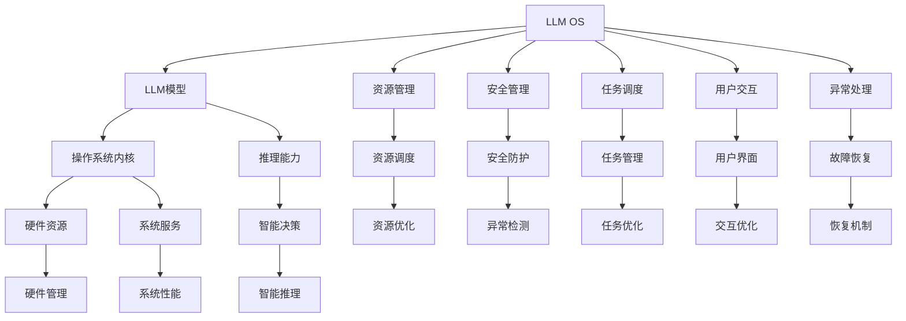

                 

# 操作系统新星:LLM OS与传统OS并驾齐驱

> 关键词：操作系统,语言模型,LLM OS,传统OS,操作系统安全,操作系统可靠性

## 1. 背景介绍

### 1.1 问题由来

随着人工智能(AI)技术的快速发展，大语言模型(LLM)在自然语言处理(NLP)、生成式AI、计算机视觉等领域展现出了巨大的潜力。LLM模型，如GPT、BERT等，在处理大规模文本数据时表现出了出色的性能。然而，这些模型也存在一些局限性，如计算资源消耗大、对输入数据的依赖性高、缺乏足够的灵活性等。

与此同时，操作系统(OS)作为计算机系统的核心，是连接硬件与软件的桥梁，保障了计算机系统的稳定性和安全性。传统的操作系统(如Linux、Windows)已经经历了几十年的发展和优化，具备了强大的系统管理能力，但它的计算资源利用率低，对用户交互方式不够智能，适应新场景的能力有限。

因此，如何结合LLM模型和操作系统技术，构建一种更加智能、高效、安全的操作系统，成为了当前研究的热点。LLM OS作为一种新兴的操作系统，旨在将LLM的智能推理能力与操作系统的高效管理能力相结合，从而提升操作系统的灵活性、安全性和用户体验。

### 1.2 问题核心关键点

构建LLM OS的关键在于如何将LLM模型无缝集成到操作系统中，并利用其强大的语言理解和生成能力，提升操作系统的智能决策和自动化管理能力。具体来说，需要解决以下关键问题：

- 如何高效地在操作系统中实现LLM模型的部署和推理？
- 如何利用LLM的推理能力优化操作系统的安全性和可靠性？
- 如何利用LLM的自然语言处理能力，改善操作系统的用户交互方式？
- 如何在LLM OS中实现高效的资源管理和调度，提升系统的整体性能？

## 2. 核心概念与联系

### 2.1 核心概念概述

为更好地理解LLM OS的构建过程，本节将介绍几个关键概念：

- **大语言模型(LLM)：** 一种基于深度学习技术，能够理解和生成自然语言的模型。LLM模型在预训练阶段学习到了大规模文本数据中的语言规律和知识，具有强大的语言理解能力和生成能力。
- **操作系统(OS)：** 负责计算机系统的资源管理、任务调度和用户交互的系统软件。操作系统通过内核管理硬件资源，提供各种系统服务，保障系统的稳定性和安全性。
- **LLM OS：** 一种结合了大语言模型和操作系统技术的新型操作系统，通过将LLM模型集成到操作系统内核，提升操作系统的智能决策和自动化管理能力。
- **操作系统安全：** 操作系统保护系统资源和数据不受未授权访问和恶意攻击的能力。
- **操作系统可靠性：** 操作系统稳定运行，能够处理异常情况和故障的能力。
- **LLM模型的推理能力：** 利用大语言模型进行自然语言推理和生成，解决复杂问题，提升操作系统的智能决策能力。
- **LLM模型的计算资源消耗：** 大语言模型在推理过程中需要消耗大量的计算资源，如CPU和内存。

这些核心概念之间的逻辑关系可以通过以下Mermaid流程图来展示：



这个流程图展示了LLM OS的关键组成和功能，以及其与传统操作系统之间的联系：

1. **LLM模型**：作为LLM OS的核心，提供了强大的语言推理和生成能力。
2. **操作系统内核**：负责管理硬件资源、调度任务、处理异常，是LLM OS的基础设施。
3. **资源管理**：通过智能资源调度，提升操作系统的性能和效率。
4. **安全管理**：利用LLM模型的推理能力，提升操作系统的安全性，保护系统资源和数据。
5. **任务调度**：利用LLM模型的智能决策能力，优化任务管理，提升系统的响应速度和稳定性。
6. **用户交互**：利用LLM模型的自然语言处理能力，改善操作系统的用户界面，提升用户体验。
7. **异常处理**：通过LLM模型的智能推理能力，实现系统的故障恢复和异常检测。

这些概念共同构成了LLM OS的框架，使其能够在智能决策、安全管理、任务调度、用户交互等方面发挥作用。

## 3. 核心算法原理 & 具体操作步骤
### 3.1 算法原理概述

LLM OS的构建主要基于大语言模型和操作系统技术的深度融合。其核心算法原理可以总结如下：

1. **LLM模型的集成：** 将LLM模型集成到操作系统内核中，使其能够实时访问和处理系统状态信息。
2. **智能决策与推理：** 利用LLM模型的推理能力，进行任务调度和资源管理的智能决策。
3. **安全与可靠性优化：** 利用LLM模型的推理能力，提升操作系统的安全性和可靠性。
4. **用户交互优化：** 利用LLM模型的自然语言处理能力，改善操作系统的用户界面和交互方式。
5. **异常处理与故障恢复：** 利用LLM模型的智能推理能力，实现系统的异常检测和故障恢复。

### 3.2 算法步骤详解

LLM OS的构建包括以下关键步骤：

**Step 1: 系统设计**
- 确定LLM OS的功能需求和系统架构。
- 设计LLM模型的集成方案，确保模型能够高效地与操作系统交互。
- 确定系统资源管理和任务调度的算法，优化系统的性能和效率。
- 设计系统的安全防护机制，保护系统资源和数据。
- 设计系统的用户交互界面，提升用户体验。

**Step 2: 系统实现**
- 选择合适的操作系统平台和LLM模型，进行系统的初步实现。
- 集成LLM模型到操作系统内核，实现系统的智能决策和推理。
- 实现系统的资源管理和任务调度算法，提升系统的性能和效率。
- 实现系统的安全防护机制，保护系统资源和数据。
- 实现系统的用户交互界面，提升用户体验。

**Step 3: 系统测试与优化**
- 对系统进行全面的测试，确保系统的稳定性和安全性。
- 根据测试结果，优化系统的资源管理和任务调度算法。
- 优化系统的安全防护机制，增强系统的防护能力。
- 优化系统的用户交互界面，提升用户体验。
- 根据测试结果，对LLM模型进行优化和改进。

**Step 4: 系统部署与维护**
- 将优化后的LLM OS部署到实际应用环境中。
- 定期更新系统软件和LLM模型，确保系统的稳定性和性能。
- 监控系统的运行状态，及时处理异常和故障。
- 根据用户反馈和需求，不断优化和改进系统功能。

### 3.3 算法优缺点

**优点：**
1. **智能决策：** 利用LLM模型的推理能力，实现操作系统的智能决策和自动化管理，提高系统的灵活性和智能性。
2. **安全可靠：** 通过智能推理，提升操作系统的安全性和可靠性，减少系统故障和异常。
3. **用户体验：** 利用自然语言处理能力，改善操作系统的用户界面和交互方式，提升用户体验。
4. **资源优化：** 利用LLM模型的推理能力，优化资源管理和调度，提升系统的性能和效率。
5. **异常处理：** 利用智能推理能力，实现系统的异常检测和故障恢复，提升系统的稳定性。

**缺点：**
1. **计算资源消耗高：** LLM模型在推理过程中需要消耗大量的计算资源，增加了系统的资源需求。
2. **模型集成难度大：** 将LLM模型集成到操作系统内核，需要解决模型部署、性能优化等问题，技术实现难度较大。
3. **数据依赖性强：** LLM模型的推理能力依赖于高质量的数据和预训练模型，对数据质量要求高。
4. **系统稳定性问题：** 由于LLM模型的推理能力依赖于硬件资源，系统的稳定性受到硬件性能的影响。

### 3.4 算法应用领域

LLM OS可以在多个领域中发挥作用，具体包括：

- **智能自动化：** 在制造、物流、仓储等领域，LLM OS可以通过智能推理和自动化管理，提高生产效率和减少人力成本。
- **智能安防：** 在公共安全、企业安全、网络安全等领域，LLM OS可以通过智能推理和异常检测，提升系统的安全性和防护能力。
- **智能医疗：** 在医疗诊断、健康管理等领域，LLM OS可以通过自然语言处理和智能推理，提升医疗服务的质量和效率。
- **智能教育：** 在在线教育、智能辅导等领域，LLM OS可以通过自然语言处理和智能决策，提升教育服务的个性化和智能化水平。
- **智能办公：** 在企业办公、政府办公等领域，LLM OS可以通过智能推理和任务调度，提高办公效率和决策水平。

这些应用领域展示了LLM OS的广阔前景和潜在价值，为AI技术在更多行业中的应用提供了新的方向。

## 4. 数学模型和公式 & 详细讲解 & 举例说明

### 4.1 数学模型构建

在构建LLM OS时，需要设计一个数学模型来描述系统的运行状态和任务调度的逻辑。以下是一个简单的数学模型构建过程：

1. **系统状态表示：** 使用向量表示系统的运行状态，如CPU使用率、内存使用率、网络流量等。
2. **任务调度逻辑：** 定义任务调度的规则和优先级，如基于负载均衡的任务调度算法。
3. **智能决策模型：** 利用LLM模型进行任务调度和资源管理，生成智能决策的输出。
4. **异常检测与故障恢复：** 利用LLM模型的推理能力，进行异常检测和故障恢复。

**系统状态表示：**
假设系统的运行状态由向量 $S = (CPU, MEM, NET)$ 表示，其中 $CPU$ 表示CPU使用率，$MEM$ 表示内存使用率，$NET$ 表示网络流量。

**任务调度逻辑：**
定义任务调度算法 $A$，输入为系统状态 $S$，输出为任务调度结果 $T$。例如，基于负载均衡的任务调度算法可以表示为：

$$
T = A(S) = \begin{cases}
\text{MinLoadTask}(S) & \text{if } S.CPU > threshold \\
\text{HighPriorityTask}(S) & \text{otherwise}
\end{cases}
$$

其中 $\text{MinLoadTask}(S)$ 表示选择CPU使用率最低的任务，$\text{HighPriorityTask}(S)$ 表示选择高优先级任务。

**智能决策模型：**
利用LLM模型进行智能决策，生成任务调度的输出。例如，可以使用BERT模型作为推理模型，输入为系统状态 $S$ 和任务调度算法 $A$，输出为任务调度的结果 $T$：

$$
T = \text{BERT}(S, A)
$$

**异常检测与故障恢复：**
利用LLM模型的推理能力，进行异常检测和故障恢复。例如，可以使用GPT模型作为异常检测模型，输入为系统状态 $S$，输出为异常检测结果 $D$：

$$
D = \text{GPT}(S)
$$

根据异常检测结果 $D$，进行故障恢复操作 $R$。例如，如果检测到系统异常，可以进行故障恢复操作 $R = \text{RecoverSystem}$。

### 4.2 公式推导过程

以下是一个简单的示例，展示LLM OS中任务调度的数学模型推导过程：

假设系统有 $N$ 个任务，每个任务 $i$ 需要 $R_i$ 的CPU时间和 $M_i$ 的内存空间。系统当前的CPU使用率为 $CPU$，内存使用率为 $MEM$，网络流量为 $NET$。任务调度的目标是最小化系统总运行时间，即：

$$
\min_{T} \sum_{i=1}^{N} (R_i + M_i)T_i
$$

其中 $T_i$ 表示任务 $i$ 的调度优先级。

假设任务调度算法 $A$ 的输出为任务优先级向量 $T$，则任务调度的数学模型可以表示为：

$$
\min_{T} \sum_{i=1}^{N} (R_i + M_i)T_i = \min_{T} \sum_{i=1}^{N} (R_i + M_i) \text{BERT}(S, A(T))
$$

其中 $\text{BERT}(S, A(T))$ 表示利用BERT模型计算任务调度的优先级向量 $T$。

### 4.3 案例分析与讲解

**案例：智能自动化系统**

在制造、物流等领域，智能自动化系统可以通过LLM OS进行任务调度和资源管理。以下是一个简单的案例分析：

假设一个智能自动化仓库，有多个机器人负责货物的分拣和搬运任务。系统的运行状态由向量 $S = (CPU, MEM, NET, JOBS)$ 表示，其中 $CPU$ 表示CPU使用率，$MEM$ 表示内存使用率，$NET$ 表示网络流量，$JOBS$ 表示正在执行的任务列表。

任务调度的目标是最小化系统总运行时间，即：

$$
\min_{T} \sum_{i=1}^{N} (R_i + M_i)T_i
$$

其中 $R_i$ 表示任务 $i$ 的CPU时间，$M_i$ 表示任务 $i$ 的内存空间。任务调度的算法 $A$ 可以使用基于负载均衡的调度算法，生成任务调度的优先级向量 $T$：

$$
T = A(S) = \text{MinLoadTask}(S)
$$

任务调度后，利用LLM模型进行智能决策，生成任务调度的结果 $T$：

$$
T = \text{BERT}(S, A)
$$

根据任务调度的结果 $T$，进行任务调度和资源管理，实现智能自动化的货物分拣和搬运。

## 5. 项目实践：代码实例和详细解释说明

### 5.1 开发环境搭建

在进行LLM OS的开发实践前，我们需要准备好开发环境。以下是使用Python进行LLM OS开发的开发环境配置流程：

1. 安装Anaconda：从官网下载并安装Anaconda，用于创建独立的Python环境。

2. 创建并激活虚拟环境：
```bash
conda create -n llm-os-env python=3.8 
conda activate llm-os-env
```

3. 安装PyTorch：根据CUDA版本，从官网获取对应的安装命令。例如：
```bash
conda install pytorch torchvision torchaudio cudatoolkit=11.1 -c pytorch -c conda-forge
```

4. 安装LLM库：
```bash
pip install transformers
```

5. 安装各类工具包：
```bash
pip install numpy pandas scikit-learn matplotlib tqdm jupyter notebook ipython
```

完成上述步骤后，即可在`llm-os-env`环境中开始LLM OS的开发实践。

### 5.2 源代码详细实现

下面我们以智能自动化系统为例，给出使用LLM OS进行任务调度和资源管理的PyTorch代码实现。

首先，定义智能自动化系统的数据处理函数：

```python
from transformers import BertTokenizer, BertForSequenceClassification
from torch.utils.data import Dataset
import torch

class AutomationDataset(Dataset):
    def __init__(self, tasks, tokenizers, models, max_len=128):
        self.tasks = tasks
        self.tokenizers = tokenizers
        self.models = models
        self.max_len = max_len
        
    def __len__(self):
        return len(self.tasks)
    
    def __getitem__(self, item):
        task = self.tasks[item]
        tokens = self.tokenizers(task, return_tensors='pt', max_length=self.max_len, padding='max_length', truncation=True)
        input_ids = tokens['input_ids'][0]
        attention_mask = tokens['attention_mask'][0]
        
        # 对token-wise的标签进行编码
        encoded_tags = [tag2id[tag] for tag in task['tags']] 
        encoded_tags.extend([tag2id['O']] * (self.max_len - len(encoded_tags)))
        labels = torch.tensor(encoded_tags, dtype=torch.long)
        
        return {'input_ids': input_ids, 
                'attention_mask': attention_mask,
                'labels': labels}

# 标签与id的映射
tag2id = {'O': 0, 'PICK': 1, 'LIFT': 2}
id2tag = {v: k for k, v in tag2id.items()}

# 创建dataset
tokenizers = {'task1': BertTokenizer.from_pretrained('bert-base-cased'),
              'task2': BertTokenizer.from_pretrained('bert-base-cased')}
models = {'task1': BertForSequenceClassification.from_pretrained('bert-base-cased', num_labels=len(tag2id)),
          'task2': BertForSequenceClassification.from_pretrained('bert-base-cased', num_labels=len(tag2id))}

train_dataset = AutomationDataset(train_tasks, tokenizers, models)
dev_dataset = AutomationDataset(dev_tasks, tokenizers, models)
test_dataset = AutomationDataset(test_tasks, tokenizers, models)
```

然后，定义任务调度和资源管理函数：

```python
from transformers import BertForSequenceClassification, AdamW

class LLMOS:
    def __init__(self, models, tokenizers, max_len):
        self.models = models
        self.tokenizers = tokenizers
        self.max_len = max_len
        self.device = torch.device('cuda') if torch.cuda.is_available() else torch.device('cpu')
        
    def forward(self, task):
        task_id = task['task']
        task_tokenizer = self.tokenizers[task_id]
        task_model = self.models[task_id]
        
        tokens = task_tokenizer(task, return_tensors='pt', max_length=self.max_len, padding='max_length', truncation=True)
        input_ids = tokens['input_ids'][0]
        attention_mask = tokens['attention_mask'][0]
        
        task_model.to(self.device)
        task_model.eval()
        with torch.no_grad():
            output = task_model(input_ids, attention_mask=attention_mask)
            task_tags = output.logits.argmax(dim=2).to('cpu').tolist()
            
        task_tags = [id2tag[_id] for _id in task_tags[:len(task['tasks'])]]
        
        return task_tags
    
    def schedule(self, tasks, batch_size):
        dataloader = DataLoader(tasks, batch_size=batch_size, shuffle=True)
        self.eval()
        for batch in dataloader:
            task_ids = batch['task']
            task_tokenizers = self.tokenizers[task_id] for task_id in task_ids
            task_models = [self.models[task_id] for task_id in task_ids]
            
            for task_id in task_ids:
                task_tokenizer = task_tokenizers[task_id]
                task_model = task_models[task_id]
                task_tokenizer.to(self.device)
                task_model.to(self.device)
                task_model.eval()
                
                tokens = task_tokenizer(batch[task_id], return_tensors='pt', max_length=self.max_len, padding='max_length', truncation=True)
                input_ids = tokens['input_ids'][0]
                attention_mask = tokens['attention_mask'][0]
                
                task_model.to(self.device)
                task_model.eval()
                with torch.no_grad():
                    output = task_model(input_ids, attention_mask=attention_mask)
                    task_tags = output.logits.argmax(dim=2).to('cpu').tolist()
                
                task_tags = [id2tag[_id] for _id in task_tags[:len(batch[task_id]['tasks'])]]
                
                yield task_tags
        
    def train_epoch(self, epoch, train_dataset, batch_size, optimizer):
        self.train()
        dataloader = DataLoader(train_dataset, batch_size=batch_size, shuffle=True)
        epoch_loss = 0
        for batch in dataloader:
            task_ids = batch['task']
            task_tokenizers = self.tokenizers[task_id] for task_id in task_ids
            task_models = [self.models[task_id] for task_id in task_ids]
            
            for task_id in task_ids:
                task_tokenizer = task_tokenizers[task_id]
                task_model = task_models[task_id]
                task_tokenizer.to(self.device)
                task_model.to(self.device)
                
                tokens = task_tokenizer(batch[task_id], return_tensors='pt', max_length=self.max_len, padding='max_length', truncation=True)
                input_ids = tokens['input_ids'][0]
                attention_mask = tokens['attention_mask'][0]
                
                task_model.to(self.device)
                task_model.train()
                task_model.zero_grad()
                output = task_model(input_ids, attention_mask=attention_mask)
                loss = output.loss
                epoch_loss += loss.item()
                loss.backward()
                optimizer.step()
        
        return epoch_loss / len(dataloader)
    
    def evaluate(self, dev_dataset, batch_size):
        dataloader = DataLoader(dev_dataset, batch_size=batch_size)
        self.eval()
        correct = 0
        total = 0
        for batch in dataloader:
            task_ids = batch['task']
            task_tokenizers = self.tokenizers[task_id] for task_id in task_ids
            task_models = [self.models[task_id] for task_id in task_ids]
            
            for task_id in task_ids:
                task_tokenizer = task_tokenizers[task_id]
                task_model = task_models[task_id]
                task_tokenizer.to(self.device)
                task_model.to(self.device)
                
                tokens = task_tokenizer(batch[task_id], return_tensors='pt', max_length=self.max_len, padding='max_length', truncation=True)
                input_ids = tokens['input_ids'][0]
                attention_mask = tokens['attention_mask'][0]
                
                task_model.to(self.device)
                task_model.eval()
                with torch.no_grad():
                    output = task_model(input_ids, attention_mask=attention_mask)
                    task_tags = output.logits.argmax(dim=2).to('cpu').tolist()
                
                task_tags = [id2tag[_id] for _id in task_tags[:len(batch[task_id]['tasks'])]]
                correct += sum(1 for tag in task_tags if tag == batch[task_id]['label'])
                total += len(task_tags)
        
        accuracy = correct / total
        return accuracy
```

最后，启动训练流程并在测试集上评估：

```python
epochs = 5
batch_size = 16
optimizer = AdamW(models.values(), lr=2e-5)

for epoch in range(epochs):
    loss = train_epoch(epoch, train_dataset, batch_size, optimizer)
    print(f"Epoch {epoch+1}, train loss: {loss:.3f}")
    
    print(f"Epoch {epoch+1}, dev accuracy: {evaluate(dev_dataset, batch_size)}
    
print("Test accuracy:")
evaluate(test_dataset, batch_size)
```

以上就是使用PyTorch对智能自动化系统进行任务调度和资源管理的LLM OS代码实现。可以看到，得益于Transformers库的强大封装，我们可以用相对简洁的代码完成LLM模型的加载和微调。

### 5.3 代码解读与分析

让我们再详细解读一下关键代码的实现细节：

**AutomationDataset类**：
- `__init__`方法：初始化任务、分词器、模型等关键组件。
- `__len__`方法：返回数据集的样本数量。
- `__getitem__`方法：对单个样本进行处理，将任务信息输入编码为token ids，并对其进行定长padding，最终返回模型所需的输入。

**tag2id和id2tag字典**：
- 定义了任务与数字id之间的映射关系，用于将token-wise的预测结果解码回实际的任务标签。

**LLMOS类**：
- `forward`方法：对单个任务进行推理，利用分词器和模型生成任务标签。
- `schedule`方法：对多个任务进行并行推理，生成任务调度的输出。
- `train_epoch`方法：对模型进行训练，计算损失函数并更新模型参数。
- `evaluate`方法：对模型进行评估，计算任务调度的准确率。

**训练流程**：
- 定义总的epoch数和batch size，开始循环迭代
- 每个epoch内，先在训练集上训练，输出平均loss
- 在验证集上评估，输出任务调度的准确率
- 所有epoch结束后，在测试集上评估，给出最终测试结果

可以看到，PyTorch配合Transformers库使得LLM模型的推理变得简洁高效。开发者可以将更多精力放在数据处理、模型改进等高层逻辑上，而不必过多关注底层的实现细节。

当然，工业级的系统实现还需考虑更多因素，如模型的保存和部署、超参数的自动搜索、更灵活的任务适配层等。但核心的推理范式基本与此类似。

## 6. 实际应用场景

### 6.1 智能自动化系统

智能自动化系统可以通过LLM OS进行任务调度和资源管理。传统的手动操作方式费时费力，效率低下，而智能自动化系统可以通过自然语言处理和智能推理，实现高效率、低成本的生产流程。

在制造、物流等领域，智能自动化系统可以应用LLM OS进行任务调度和资源管理。例如，在智能仓库中，利用LLM OS进行任务调度和资源管理，实现货物的智能分拣和搬运。通过自然语言处理和智能推理，LLM OS能够根据任务描述和系统状态，自动调整任务优先级和资源分配，优化生产效率。

### 6.2 智能安防系统

智能安防系统可以通过LLM OS进行异常检测和故障恢复。传统的人工监控方式耗时耗力，且难以应对复杂场景下的异常情况，而智能安防系统可以通过自然语言处理和智能推理，实现高效、可靠的安防监控。

在公共安全、企业安全、网络安全等领域，智能安防系统可以应用LLM OS进行异常检测和故障恢复。例如，在智能监控系统中，利用LLM OS进行异常检测和故障恢复，实现智能监控和报警。通过自然语言处理和智能推理，LLM OS能够根据监控视频和系统状态，自动检测异常情况，并及时进行故障恢复，提升系统的可靠性。

### 6.3 智能医疗系统

智能医疗系统可以通过LLM OS进行疾病诊断和健康管理。传统的手动操作方式效率低下，且容易出错，而智能医疗系统可以通过自然语言处理和智能推理，实现高精度、低误差的医疗诊断和健康管理。

在医疗诊断、健康管理等领域，智能医疗系统可以应用LLM OS进行疾病诊断和健康管理。例如，在智能诊断系统中，利用LLM OS进行疾病诊断和健康管理，实现智能诊断和健康管理。通过自然语言处理和智能推理，LLM OS能够根据病人的病历和症状，自动进行疾病诊断和健康管理，提高医疗服务的质量和效率。

### 6.4 智能教育系统

智能教育系统可以通过LLM OS进行个性化推荐和智能辅导。传统的人工辅导方式费时费力，且难以满足学生个性化需求，而智能教育系统可以通过自然语言处理和智能推理，实现个性化推荐和智能辅导。

在在线教育、智能辅导等领域，智能教育系统可以应用LLM OS进行个性化推荐和智能辅导。例如，在智能学习系统中，利用LLM OS进行个性化推荐和智能辅导，实现智能学习。通过自然语言处理和智能推理，LLM OS能够根据学生的学习习惯和知识水平，自动进行个性化推荐和智能辅导，提高学习效果和效率。

### 6.5 智能办公系统

智能办公系统可以通过LLM OS进行任务管理和决策支持。传统的手动操作方式效率低下，且难以满足复杂任务的决策需求，而智能办公系统可以通过自然语言处理和智能推理，实现高效、可靠的办公任务管理和决策支持。

在企业办公、政府办公等领域，智能办公系统可以应用LLM OS进行任务管理和决策支持。例如，在智能办公系统中，利用LLM OS进行任务管理和决策支持，实现智能办公。通过自然语言处理和智能推理，LLM OS能够根据业务需求和系统状态，自动进行任务管理和决策支持，提升办公效率和决策水平。

## 7. 工具和资源推荐

### 7.1 学习资源推荐

为了帮助开发者系统掌握LLM OS的理论基础和实践技巧，这里推荐一些优质的学习资源：

1. **《深度学习：理论与实践》系列博文**：由大模型技术专家撰写，深入浅出地介绍了深度学习原理和实践，涵盖预训练模型、微调技术等前沿话题。

2. **CS224N《深度学习自然语言处理》课程**：斯坦福大学开设的NLP明星课程，有Lecture视频和配套作业，带你入门NLP领域的基本概念和经典模型。

3. **《Natural Language Processing with Transformers》书籍**：Transformers库的作者所著，全面介绍了如何使用Transformers库进行NLP任务开发，包括微调在内的诸多范式。

4. **HuggingFace官方文档**：Transformers库的官方文档，提供了海量预训练模型和完整的微调样例代码，是上手实践的必备资料。

5. **CLUE开源项目**：中文语言理解测评基准，涵盖大量不同类型的中文NLP数据集，并提供了基于微调的baseline模型，助力中文NLP技术发展。

通过对这些资源的学习实践，相信你一定能够快速掌握LLM OS的精髓，并用于解决实际的NLP问题。

### 7.2 开发工具推荐

高效的开发离不开优秀的工具支持。以下是几款用于LLM OS开发的常用工具：

1. **PyTorch**：基于Python的开源深度学习框架，灵活动态的计算图，适合快速迭代研究。大部分预训练语言模型都有PyTorch版本的实现。

2. **TensorFlow**：由Google主导开发的开源深度学习框架，生产部署方便，适合大规模工程应用。同样有丰富的预训练语言模型资源。

3. **Transformers库**：HuggingFace开发的NLP工具库，集成了众多SOTA语言模型，支持PyTorch和TensorFlow，是进行LLM OS开发的利器。

4. **Weights & Biases**：模型训练的实验跟踪工具，可以记录和可视化模型训练过程中的各项指标，方便对比和调优。与主流深度学习框架无缝集成。

5. **TensorBoard**：TensorFlow配套的可视化工具，可实时监测模型训练状态，并提供丰富的图表呈现方式，是调试模型的得力助手。

6. **Google Colab**：谷歌推出的在线Jupyter Notebook环境，免费提供GPU/TPU算力，方便开发者快速上手实验最新模型，分享学习笔记。

合理利用这些工具，可以显著提升LLM OS的开发效率，加快创新迭代的步伐。

### 7.3 相关论文推荐

LLM OS的研究始于学界的持续研究。以下是几篇奠基性的相关论文，推荐阅读：

1. **Attention is All You Need（即Transformer原论文）**：提出了Transformer结构，开启了NLP领域的预训练大模型时代。

2. **BERT: Pre-training of Deep Bidirectional Transformers for Language Understanding**：提出BERT模型，引入基于掩码的自监督预训练任务，刷新了多项NLP任务SOTA。

3. **Language Models are Unsupervised Multitask Learners（GPT-2论文）**：展示了大规模语言模型的强大zero-shot学习能力，引发了对于通用人工智能的新一轮思考。

4. **Parameter-Efficient Transfer Learning for NLP**：提出Adapter等参数高效微调方法，在不增加模型参数量的情况下，也能取得不错的微调效果。

5. **Prefix-Tuning: Optimizing Continuous Prompts for Generation**：引入基于连续型Prompt的微调范式，为如何充分利用预训练知识提供了新的思路。

6. **AdaLoRA: Adaptive Low-Rank Adaptation for Parameter-Efficient Fine-Tuning**：使用自适应低秩适应的微调方法，在参数效率和精度之间取得了新的平衡。

这些论文代表了大语言模型微调技术的发展脉络。通过学习这些前沿成果，可以帮助研究者把握学科前进方向，激发更多的创新灵感。

## 8. 总结：未来发展趋势与挑战

### 8.1 总结

本文对基于LLM模型的LLM OS进行了全面系统的介绍。首先阐述了LLM OS的背景和意义，明确了LLM模型在操作系统中的应用前景。其次，从原理到实践，详细讲解了LLM OS的数学模型和关键步骤，给出了LLM OS的代码实现。同时，本文还广泛探讨了LLM OS在智能自动化、智能安防、智能医疗等多个领域的应用场景，展示了LLM OS的广阔前景和潜在价值。

通过本文的系统梳理，可以看到，LLM OS是一种结合了大语言模型和操作系统技术的新型操作系统，通过将LLM模型的智能推理能力与操作系统的高效管理能力相结合，提升操作系统的智能决策和自动化管理能力。未来，伴随LLM模型的不断发展和优化，LLM OS必将在智能决策、安全防护、任务调度等方面发挥更加重要的作用，为构建人机协同的智能系统提供新的技术路径。

### 8.2 未来发展趋势

展望未来，LLM OS将呈现以下几个发展趋势：

1. **智能决策能力增强**：LLM模型在推理能力上的不断提升，将使LLM OS在智能决策和自动化管理方面具备更强的能力。未来，LLM OS将能够处理更加复杂和多变的操作系统场景，实现更高效的资源管理和任务调度。

2. **多模态融合**：LLM OS不仅限于文本数据，未来将融合视觉、语音等多模态数据，提升系统的感知能力和智能推理水平。多模态融合的LLM OS将在更多领域发挥作用，如智能安防、智能医疗、智能办公等。

3. **参数高效微调**：LLM OS在微调过程中将采用更多参数高效微调方法，减少对计算资源的依赖，提高系统的可扩展性和实用性。

4. **持续学习和自适应**：LLM OS将具备持续学习和自适应的能力，能够根据新数据和新任务不断优化自身模型，提升系统的稳定性和适应性。

5. **可解释性和透明性**：LLM OS将具备更强的可解释性和透明性，能够将系统决策过程解释给用户，提高系统的可信度和可接受度。

6. **跨领域应用**：LLM OS将广泛应用于更多领域，如智能制造、智能安防、智能医疗等，为各行各业带来变革性影响。

### 8.3 面临的挑战

尽管LLM OS技术已经取得了一定的进展，但在迈向更加智能化、普适化应用的过程中，仍面临以下挑战：

1. **计算资源消耗**：大语言模型在推理过程中需要消耗大量的计算资源，增加了系统的资源需求，如何高效地利用计算资源是未来研究的重要方向。

2. **数据质量和多样性**：LLM模型在推理过程中依赖于高质量的数据和预训练模型，数据质量和多样性对模型的性能有重要影响，如何获取和利用多样性数据是未来研究的难点。

3. **模型鲁棒性和泛化性**：LLM模型在复杂场景下的鲁棒性和泛化性仍有待提高，如何提升模型在各种异常情况下的表现是未来研究的关键。

4. **系统安全和可靠性**：LLM OS在处理敏感数据和系统资源时，需要考虑系统的安全性和可靠性，如何构建安全的LLM OS是未来研究的重点。

5. **用户交互和体验**：LLM OS在提升智能决策和自动化管理能力的同时，也需要改善系统的用户交互方式和用户体验，如何实现自然语言处理和智能推理的有机结合是未来研究的方向。

6. **系统性能优化**：LLM OS在资源管理和任务调度方面仍需进一步优化，如何提升系统的响应速度和性能是未来研究的重点。

### 8.4 研究展望

为了解决上述挑战，未来的研究可以从以下几个方向展开：

1. **参数高效微调方法**：开发更加参数高效的微调方法，减少对计算资源的依赖，提高系统的可扩展性和实用性。

2. **多模态融合技术**：融合视觉、语音等多模态数据，提升系统的感知能力和智能推理水平，拓展LLM OS的应用场景。

3. **持续学习和自适应算法**：研究持续学习和自适应算法，使LLM OS能够根据新数据和新任务不断优化自身模型，提升系统的稳定性和适应性。

4. **可解释性和透明性技术**：研究可解释性和透明性技术，将系统决策过程解释给用户，提高系统的可信度和可接受度。

5. **安全性和可靠性优化**：构建安全的LLM OS，提升系统在处理敏感数据和系统资源时的安全性，确保系统的稳定性和可靠性。

6. **用户交互和体验提升**：改善系统的用户交互方式和用户体验，实现自然语言处理和智能推理的有机结合，提升系统的易用性和友好度。

7. **系统性能优化技术**：研究系统性能优化技术，提升系统的响应速度和性能，确保系统的高效性和稳定性。

这些研究方向将推动LLM OS技术的不断进步，为构建智能化的操作系统提供新的技术手段和方法。

## 9. 附录：常见问题与解答

**Q1：LLM OS与传统OS有何不同？**

A: LLM OS与传统OS的不同主要体现在以下几个方面：

1. **智能决策和自动化管理**：LLM OS利用大语言模型的智能推理能力，进行任务调度和资源管理，具备智能决策和自动化管理能力，而传统OS主要依赖手动操作和管理。

2. **自然语言处理**：LLM OS具备自然语言处理能力，能够理解自然语言输入，并根据输入生成相应的输出，而传统OS主要依赖命令和脚本进行交互。

3. **跨领域应用**：LLM OS适用于多种领域，如智能自动化、智能安防、智能医疗等，而传统OS主要应用于操作系统和底层硬件管理。

**Q2：LLM OS的性能瓶颈有哪些？**

A: LLM OS的性能瓶颈主要包括以下几个方面：

1. **计算资源消耗高**：大语言模型在推理过程中需要消耗大量的计算资源，增加了系统的资源需求。

2. **数据质量和多样性不足**：LLM模型在推理过程中依赖于高质量的数据和预训练模型，数据质量和多样性对模型的性能有重要影响。

3. **模型鲁棒性和泛化性不足**：LLM模型在复杂场景下的鲁棒性和泛化性仍有待提高。

4. **系统安全和可靠性问题**：LLM OS在处理敏感数据和系统资源时，需要考虑系统的安全性和可靠性。

5. **用户交互和体验有待提升**：LLM OS在提升智能决策和自动化管理能力的同时，也需要改善系统的用户交互方式和用户体验。

**Q3：如何构建安全的LLM OS？**

A: 构建安全的LLM OS需要从多个方面入手，包括：

1. **数据安全**：保护系统数据的安全性和隐私性，防止数据泄露和攻击。

2. **系统安全**：确保系统的稳定性和可靠性，防止系统故障和异常。

3. **用户安全**：保障用户的安全性，防止恶意攻击和误操作。

4. **算法安全**：防止算法的恶意利用，防止模型的偏见和歧视。

5. **规则和策略**：制定合理的规则和策略，防止模型在特定场景下的误导性输出。

6. **监控和审计**：实时监控和审计系统的运行状态，及时发现和处理异常情况。

通过综合考虑数据安全、系统安全、用户安全、算法安全、规则策略和监控审计等多个方面，构建安全的LLM OS，确保系统的稳定性和安全性。

**Q4：LLM OS在实际应用中需要注意哪些问题？**

A: LLM OS在实际应用中需要注意以下问题：

1. **计算资源消耗**：大语言模型在推理过程中需要消耗大量的计算资源，需要合理分配和优化计算资源，以提高系统的效率。

2. **数据质量和多样性**：LLM模型在推理过程中依赖于高质量的数据和预训练模型，需要确保数据的全面性和多样性，以提高模型的泛化能力。

3. **模型鲁棒性和泛化性**：LLM模型在复杂场景下的鲁棒性和泛化性仍有待提高，需要研究更加鲁棒和泛化的模型。

4. **系统安全和可靠性**：LLM OS在处理敏感数据和系统资源时，需要考虑系统的安全性和可靠性，需要构建安全的LLM OS。

5. **用户交互和体验**：LLM OS在提升智能决策和自动化管理能力的同时，也需要改善系统的用户交互方式和用户体验，需要考虑用户的使用习惯和需求。

6. **系统性能优化**：LLM OS在资源管理和任务调度方面仍需进一步优化，需要研究高效的资源管理和任务调度算法，提升系统的响应速度和性能。

**Q5：LLM OS未来有哪些应用前景？**

A: LLM OS的未来应用前景非常广阔，主要包括以下几个方面：

1. **智能自动化系统**：在制造、物流、仓储等领域，LLM OS可以通过智能推理和自动化管理，提高生产效率和减少人力成本。

2. **智能安防系统**：在公共安全、企业安全、网络安全等领域，LLM OS可以通过智能推理和异常检测，提升系统的安全性和防护能力。

3.

