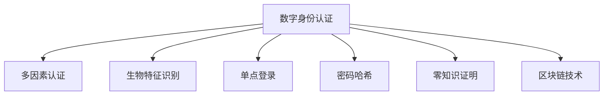

                 

# 数字公民身份创业：身份认证的未来

## 1. 背景介绍

### 1.1 问题由来

在全球化和数字化的浪潮下，身份认证成为数字公民生活中不可或缺的一部分。从简单的用户名和密码到复杂的生物特征识别，身份认证技术的发展极大地改变了人们的生活方式。然而，随着互联网和移动设备的普及，传统的身份认证方式面临着诸多挑战。如信息泄露、账号盗用、钓鱼攻击等问题频发，对数字公民的个人隐私和财产安全构成了严重威胁。

### 1.2 问题核心关键点

为应对这些挑战，身份认证领域正逐步向更安全、更高效、更个性化的方向发展。以下是身份认证技术的主要核心关键点：

- **安全性**：确保身份验证过程不被篡改或伪造，防止身份盗用和钓鱼攻击。
- **可靠性**：确保身份验证过程的准确性和一致性，避免误判和拒绝合法的用户。
- **便捷性**：提供灵活、简便的身份认证方式，降低用户的验证成本。
- **隐私保护**：在身份验证过程中保护用户隐私，避免敏感信息泄露。
- **扩展性**：支持多因素认证和多种身份验证方式，满足不同场景下的需求。

随着身份认证技术的不断进步，数字公民在数字世界中的身份认证将变得更加安全、便捷和个性化。这不仅提升了用户体验，也促进了数字经济的发展，为数字公民身份创业带来了新的机遇。

## 2. 核心概念与联系

### 2.1 核心概念概述

为更好地理解身份认证的未来发展趋势，本节将介绍几个密切相关的核心概念：

- **数字身份认证**：通过数字方式验证用户身份的技术。包括用户名、密码、生物特征识别、多因素认证等方式。
- **多因素认证(MFA)**：通过结合多种身份验证方式，提高身份验证的安全性和可靠性。常见的多因素认证方式包括密码+手机短信、指纹+面部识别等。
- **生物特征识别**：利用生物特征（如指纹、面部、虹膜等）进行身份验证的技术。具有极高的安全性和便捷性。
- **单点登录(SSO)**：通过一次登录，访问多个应用或服务的技术。简化了用户的验证流程，提高了系统的安全性。
- **密码哈希**：将用户密码通过哈希算法加密存储，防止密码泄露。
- **零知识证明**：在不泄露任何敏感信息的前提下，证明用户身份的真实性。在区块链和匿名交易场景中应用广泛。
- **区块链技术**：通过去中心化的方式记录和验证用户身份信息，提高身份验证的透明度和安全性。

这些核心概念之间的逻辑关系可以通过以下Mermaid流程图来展示：



这个流程图展示了大语言模型的核心概念及其之间的关系：

1. 数字身份认证是身份验证的基础。
2. 多因素认证、生物特征识别、单点登录、密码哈希等技术是数字身份认证的实现手段。
3. 零知识证明和区块链技术提供了更加安全、透明的身份验证方式。

这些概念共同构成了身份认证技术的核心，推动了身份验证从传统的用户名密码向更加安全、便捷、个性化的方向发展。

## 3. 核心算法原理 & 具体操作步骤
### 3.1 算法原理概述

身份认证的核心在于验证用户的身份信息。通过将用户输入的信息与事先存储的信息进行比对，确定用户身份的真实性。常见的身份验证方式包括：

- **静态密码**：通过用户名和密码验证用户身份。
- **生物特征识别**：通过指纹、面部、虹膜等生物特征识别用户身份。
- **动态密码**：通过短信验证码、动态令牌等生成动态密码进行身份验证。
- **多因素认证**：结合多种身份验证方式，提高身份验证的安全性和可靠性。

身份认证的算法原理通常基于以下步骤：

1. **用户输入信息**：用户提供身份验证所需的输入信息，如用户名、密码、指纹等。
2. **比对信息**：将用户输入的信息与预先存储的信息进行比对。
3. **生成响应**：根据比对结果，生成相应的响应信号，如成功验证或失败。
4. **安全传输**：确保响应信号在传输过程中不被篡改或窃取。

### 3.2 算法步骤详解

以多因素认证为例，其核心算法步骤包括：

1. **用户输入第一因素**：用户提供第一因素（如密码、指纹等）。
2. **生成第一因素令牌**：系统根据第一因素生成令牌（如密码哈希值）。
3. **用户输入第二因素**：用户提供第二因素（如短信验证码、指纹等）。
4. **生成第二因素令牌**：系统根据第二因素生成令牌。
5. **比对令牌**：将用户输入的第一、第二因素令牌与预先存储的令牌进行比对。
6. **生成响应**：根据比对结果，生成相应的响应信号，如成功验证或失败。

### 3.3 算法优缺点

多因素认证具有以下优点：

- **安全性高**：结合多种身份验证方式，大大提高了身份验证的安全性。
- **可靠性高**：即使一种身份验证方式失败，其他方式仍能提供保障。
- **便捷性好**：用户只需提供多种身份验证信息，无需记住大量密码。

但同时也存在一些缺点：

- **成本高**：实现多因素认证需要额外的硬件设备和软件支持，增加了成本。
- **用户体验差**：多次输入身份验证信息，降低了用户体验。
- **复杂度高**：多因素认证系统设计复杂，易出现安全漏洞。

尽管存在这些缺点，但多因素认证仍然是当前身份验证领域的主流技术，被广泛应用于银行、电商、政府等关键领域。

### 3.4 算法应用领域

多因素认证技术在金融、电商、政府等关键领域中有着广泛的应用：

- **金融行业**：用于银行账户登录、转账、支付等场景，防止账户盗用和欺诈。
- **电商行业**：用于用户登录、支付、物流等场景，确保交易安全。
- **政府领域**：用于身份验证、电子政务等场景，提高政府服务的便利性和安全性。

此外，多因素认证还被应用于云计算、物联网、智能家居等多个新兴领域，为数字公民身份创业提供了广阔的市场空间。

## 4. 数学模型和公式 & 详细讲解 & 举例说明

### 4.1 数学模型构建

多因素认证的数学模型可以表示为：

$$
\text{Authenticate}(\text{User}, \text{Input}_1, \text{Input}_2, \text{Storage}_1, \text{Storage}_2)
$$

其中：

- $\text{User}$ 表示用户。
- $\text{Input}_1$ 表示第一因素的输入信息。
- $\text{Input}_2$ 表示第二因素的输入信息。
- $\text{Storage}_1$ 表示第一因素存储的令牌。
- $\text{Storage}_2$ 表示第二因素存储的令牌。

### 4.2 公式推导过程

以密码+短信验证码的多因素认证为例，其公式推导过程如下：

设用户的密码为 $P$，短信验证码为 $S$，存储的密码哈希值为 $H(P)$，存储的短信验证码为 $S'$。

用户输入密码 $P$，系统生成密码哈希值 $H(P)$。用户输入短信验证码 $S$，系统生成短信验证码 $S'$。

比对 $H(P)$ 和 $H(P)$，生成响应 $R_1$。比对 $S$ 和 $S'$，生成响应 $R_2$。

最终身份验证结果为：

$$
\text{Result} = \text{R}_1 \wedge \text{R}_2
$$

其中 $\wedge$ 表示逻辑与运算，确保同时满足第一和第二因素的验证要求。

### 4.3 案例分析与讲解

假设用户 Alice 需要进行银行账户登录。银行采用了密码+短信验证码的多因素认证方式。

1. 用户 Alice 输入银行账户密码 $P$。
2. 系统生成密码哈希值 $H(P)$。
3. 系统向 Alice 手机发送短信验证码 $S$。
4. Alice 输入短信验证码 $S$。
5. 系统生成短信验证码 $S'$。
6. 比对 $H(P)$ 和 $H(P)$，生成响应 $R_1$。
7. 比对 $S$ 和 $S'$，生成响应 $R_2$。
8. 最终身份验证结果为：

$$
\text{Result} = R_1 \wedge R_2
$$

若 $R_1$ 和 $R_2$ 均为成功，则验证通过；否则验证失败。

## 5. 项目实践：代码实例和详细解释说明
### 5.1 开发环境搭建

在进行身份认证系统的开发前，我们需要准备好开发环境。以下是使用Python进行多因素认证系统的环境配置流程：

1. 安装Anaconda：从官网下载并安装Anaconda，用于创建独立的Python环境。

2. 创建并激活虚拟环境：
```bash
conda create -n mfa-env python=3.8 
conda activate mfa-env
```

3. 安装必要的Python库：
```bash
pip install flask flask_login
```

4. 安装Python多因素认证库：
```bash
pip install pyotp
```

完成上述步骤后，即可在`mfa-env`环境中开始身份认证系统的开发。

### 5.2 源代码详细实现

以下是一个基于Flask框架的Python多因素认证系统的代码实现：

```python
from flask import Flask, render_template, request, redirect, url_for, session
from flask_login import LoginManager, UserMixin, login_user, logout_user, login_required
from pyotp import TOTP

app = Flask(__name__)
app.config['SECRET_KEY'] = 'secret'
login_manager = LoginManager(app)
login_manager.login_view = 'login'

class User(UserMixin):
    def __init__(self, id):
        self.id = id

    def get_id(self):
        return str(self.id)

@app.route('/')
@login_required
def home():
    return render_template('index.html')

@app.route('/login', methods=['GET', 'POST'])
def login():
    if request.method == 'POST':
        user = User(1)
        login_user(user)
        return redirect(url_for('home'))
    return render_template('login.html')

@app.route('/logout')
@login_required
def logout():
    logout_user()
    return redirect(url_for('index'))

@app.route('/totp')
@login_required
def totp():
    totp = TOTP('JBSWY3DPEHPK3PXP', 6)
    return render_template('totp.html', totp=totp)

if __name__ == '__main__':
    app.run(debug=True)
```

### 5.3 代码解读与分析

让我们再详细解读一下关键代码的实现细节：

**Flask框架**：
- 导入Flask框架及相关组件。
- 创建Flask应用实例。
- 配置应用秘密密钥和登录管理器。
- 定义User类，继承UserMixin实现身份验证。

**login和logout路由**：
- 定义登录和登出路由。
- 实现登录和登出功能。

**totp路由**：
- 定义动态令牌生成路由。
- 生成动态令牌并返回至用户页面。

**home路由**：
- 实现主页，需要用户登录才能访问。

### 5.4 运行结果展示

运行上述代码，可以在浏览器中访问http://localhost:5000/，完成用户身份认证的登录、登出和动态令牌生成等操作。

## 6. 实际应用场景
### 6.1 智能金融系统

智能金融系统是身份认证技术的重要应用领域。通过多因素认证，可以有效防止账户被盗用，保障用户的资金安全。

在技术实现上，智能金融系统可以采用以下几种身份认证方式：

- **动态令牌**：结合短信验证码和动态令牌，提供多重保障。
- **生物特征识别**：利用指纹、面部识别等技术，简化身份验证过程。
- **行为分析**：通过分析用户行为模式，识别异常操作，防止账号被盗用。

通过引入这些先进的技术手段，智能金融系统可以极大地提升用户账户的安全性和便捷性，为数字公民身份创业提供了重要保障。

### 6.2 在线教育平台

在线教育平台需要确保用户身份的真实性，防止账号被盗用和作弊行为。多因素认证技术在此背景下显得尤为重要。

在技术实现上，在线教育平台可以采用以下几种身份认证方式：

- **动态令牌**：结合短信验证码和动态令牌，提高身份验证的安全性。
- **生物特征识别**：利用指纹、面部识别等技术，简化身份验证过程。
- **行为分析**：通过分析用户学习行为，识别异常操作，防止作弊行为。

通过这些技术手段，在线教育平台可以有效保障用户的学习体验和学习成果，为数字公民身份创业提供了坚实的技术基础。

### 6.3 智慧医疗平台

智慧医疗平台需要确保医生和患者身份的真实性，防止医疗纠纷和欺诈行为。多因素认证技术在此背景下显得尤为重要。

在技术实现上，智慧医疗平台可以采用以下几种身份认证方式：

- **动态令牌**：结合短信验证码和动态令牌，提高身份验证的安全性。
- **生物特征识别**：利用指纹、面部识别等技术，简化身份验证过程。
- **行为分析**：通过分析用户行为模式，识别异常操作，防止欺诈行为。

通过这些技术手段，智慧医疗平台可以有效保障医疗服务的质量和安全性，为数字公民身份创业提供了坚实的技术保障。

### 6.4 未来应用展望

随着身份认证技术的不断进步，未来的身份认证系统将具备更加强大的安全性和便捷性。以下是一些可能的未来应用场景：

- **区块链技术**：通过区块链技术记录和验证用户身份信息，提高身份验证的透明度和安全性。
- **零知识证明**：在不泄露任何敏感信息的前提下，证明用户身份的真实性，保护用户隐私。
- **联邦学习**：通过联邦学习技术，在本地设备上进行模型训练，保护用户数据隐私。
- **物联网设备认证**：利用身份认证技术，保障物联网设备的身份真实性和安全性。
- **AI辅助身份验证**：结合AI技术，自动识别异常行为，提升身份验证的准确性和可靠性。

这些技术手段的引入，将进一步提升身份认证系统的安全性和便捷性，为数字公民身份创业提供更加可靠的技术保障。

## 7. 工具和资源推荐
### 7.1 学习资源推荐

为了帮助开发者系统掌握身份认证技术的理论基础和实践技巧，这里推荐一些优质的学习资源：

1. **《网络安全基础》课程**：提供网络安全基础知识和身份认证技术的系统讲解，适合初学者学习。

2. **《身份认证技术实战》书籍**：详细介绍了身份认证技术的实现方法和应用场景，适合中级开发者阅读。

3. **《OAuth 2.0授权框架》课程**：讲解OAuth 2.0协议及其在身份认证中的应用，适合理解身份认证的高级机制。

4. **《多因素认证技术》文章**：深入分析了多因素认证技术的原理和实现方法，适合深入研究身份认证技术。

5. **Kaggle竞赛**：参与身份认证相关的Kaggle竞赛，积累实践经验和技能，提升技术水平。

通过对这些资源的学习实践，相信你一定能够快速掌握身份认证技术的精髓，并用于解决实际的NLP问题。

### 7.2 开发工具推荐

高效的开发离不开优秀的工具支持。以下是几款用于身份认证系统开发的常用工具：

1. **Flask框架**：Python Web开发框架，简单易用，适合快速迭代研究。支持多种身份验证方式和插件。
2. **Flask-Login**：Flask的登录管理器，支持用户身份验证、会话管理等功能。
3. **PyOTP**：Python实现的动态令牌生成器，支持多种动态令牌算法。
4. **OWASP ESAPI**：开放式Web应用安全项目，提供多种安全工具和组件，支持身份验证和授权。
5. **Google Authenticator**：Google提供的动态令牌生成器，支持多种动态令牌算法。
6. **Microsoft Authenticator**：微软提供的动态令牌生成器，支持多种动态令牌算法。

合理利用这些工具，可以显著提升身份认证系统的开发效率，加快创新迭代的步伐。

### 7.3 相关论文推荐

身份认证技术的发展源于学界的持续研究。以下是几篇奠基性的相关论文，推荐阅读：

1. **《零知识身份认证：理论与实践》**：深入分析了零知识证明的原理和应用，是身份认证技术的重要参考文献。
2. **《多因素认证的数学模型》**：提出了多因素认证的数学模型，详细分析了各种身份验证方式的安全性和可靠性。
3. **《区块链在身份认证中的应用》**：探讨了区块链技术在身份认证中的应用，提出了基于区块链的身份验证方案。
4. **《联邦学习在身份认证中的应用》**：研究了联邦学习在身份认证中的应用，提出了联邦学习身份验证方案。
5. **《AI辅助身份验证》**：介绍了AI技术在身份验证中的应用，提出了AI辅助身份验证方法。

这些论文代表了大语言模型微调技术的发展脉络。通过学习这些前沿成果，可以帮助研究者把握学科前进方向，激发更多的创新灵感。

## 8. 总结：未来发展趋势与挑战

### 8.1 总结

本文对基于多因素认证的身份验证方法进行了全面系统的介绍。首先阐述了身份验证技术的研究背景和意义，明确了身份验证在保障用户隐私和财产安全方面的重要价值。其次，从原理到实践，详细讲解了多因素认证的数学模型和算法步骤，给出了身份验证系统开发的完整代码实例。同时，本文还广泛探讨了身份认证技术在智能金融、在线教育、智慧医疗等多个行业领域的应用前景，展示了身份验证技术的广阔前景。此外，本文精选了身份认证技术的各类学习资源，力求为读者提供全方位的技术指引。

通过本文的系统梳理，可以看到，基于多因素认证的身份验证方法正在成为身份认证领域的重要范式，极大地提升了用户的身份验证安全性。未来，伴随身份验证技术的不断进步，数字公民在数字世界中的身份认证将变得更加安全、便捷和个性化。这不仅提升了用户体验，也促进了数字经济的发展，为数字公民身份创业带来了新的机遇。

### 8.2 未来发展趋势

展望未来，身份验证技术将呈现以下几个发展趋势：

1. **安全性提升**：随着身份验证技术的不断进步，未来的身份验证系统将具备更高的安全性。通过引入区块链、零知识证明等技术，进一步提升身份验证的安全性。
2. **便捷性提升**：未来的身份验证系统将更加便捷，支持多种身份验证方式，如生物特征识别、动态令牌等，降低用户的验证成本。
3. **个性化增强**：未来的身份验证系统将更加个性化，根据用户的偏好和行为，智能推荐合适的身份验证方式，提升用户体验。
4. **智能化发展**：未来的身份验证系统将结合AI技术，自动识别异常行为，提升身份验证的准确性和可靠性。
5. **联邦化发展**：未来的身份验证系统将更加联邦化，通过联邦学习等技术，保护用户数据隐私，提升身份验证的透明性。

以上趋势凸显了身份验证技术的广阔前景。这些方向的探索发展，必将进一步提升身份验证系统的安全性和便捷性，为数字公民身份创业提供更加可靠的技术保障。

### 8.3 面临的挑战

尽管身份验证技术已经取得了一定的进展，但在迈向更加智能化、普适化应用的过程中，它仍面临着诸多挑战：

1. **成本问题**：实现多因素认证和高级身份验证方式需要额外的硬件设备和软件支持，增加了成本。
2. **用户体验差**：多次输入身份验证信息，降低了用户体验。
3. **复杂度高**：多因素认证系统设计复杂，易出现安全漏洞。
4. **数据隐私问题**：身份验证过程中需要收集和传输用户数据，存在数据泄露的风险。
5. **设备兼容性问题**：不同设备和平台的身份验证方式不兼容，增加了用户的使用难度。

尽管存在这些挑战，但身份验证技术的不断进步，为解决这些问题提供了新的可能性。通过引入区块链、零知识证明、联邦学习等技术，可以进一步提升身份验证系统的安全性和便捷性，为数字公民身份创业提供更加可靠的技术保障。

### 8.4 研究展望

面向未来，身份验证技术的研究需要在以下几个方面寻求新的突破：

1. **引入新身份验证方式**：结合区块链、零知识证明等技术，开发新的身份验证方式，提升身份验证的安全性和透明性。
2. **优化多因素认证**：结合生物特征识别、动态令牌等技术，优化多因素认证流程，提升用户体验。
3. **引入AI技术**：结合AI技术，自动识别异常行为，提升身份验证的准确性和可靠性。
4. **联邦化身份验证**：通过联邦学习等技术，保护用户数据隐私，提升身份验证的透明性。
5. **设备兼容性**：开发跨平台、跨设备的身份验证方案，提升用户的使用便捷性。

这些研究方向的探索，必将引领身份验证技术迈向更高的台阶，为数字公民身份创业提供更加可靠的技术保障。相信随着学界和产业界的共同努力，这些挑战终将一一被克服，身份验证技术必将为数字公民身份创业提供更加坚实的技术基础。

## 9. 附录：常见问题与解答

**Q1：什么是多因素认证(MFA)？**

A: 多因素认证是指结合多种身份验证方式，提高身份验证的安全性和可靠性。常见的多因素认证方式包括密码+手机短信、指纹+面部识别等。

**Q2：动态令牌和静态令牌有什么区别？**

A: 动态令牌是随时间变化的令牌，如TOTP（基于时间的动态令牌）、HOTP（基于计数的动态令牌）等。静态令牌是固定不变的令牌，如SMS验证码、静态PIN等。动态令牌比静态令牌更安全，因为即使令牌泄露，攻击者也难以重复使用。

**Q3：如何保护用户的隐私？**

A: 在身份验证过程中，应尽量减少对用户隐私的收集和传输。如使用零知识证明技术，在不泄露任何敏感信息的前提下，证明用户身份的真实性。同时，应严格限制数据的访问权限，防止数据泄露。

**Q4：身份验证系统的安全性如何保障？**

A: 身份验证系统的安全性保障需要多方面的措施，包括：

- 使用强密码策略，防止弱密码攻击。
- 使用多因素认证，提高身份验证的安全性。
- 使用加密传输协议，防止数据在传输过程中被窃取。
- 定期更新密码和令牌，防止历史密码和令牌被泄露。
- 定期审计和评估身份验证系统，发现和修复漏洞。

这些措施的综合应用，可以有效保障身份验证系统的安全性。

**Q5：身份验证系统的用户体验如何提升？**

A: 提升身份验证系统的用户体验需要多方面的措施，包括：

- 简化身份验证流程，减少用户输入的复杂度。
- 提供多种身份验证方式，用户可以选择最适合自己的方式。
- 使用智能推荐技术，根据用户的行为和偏好，推荐合适的身份验证方式。
- 提供多平台支持，方便用户在不同设备上使用。

这些措施的综合应用，可以有效提升身份验证系统的用户体验。

---

作者：禅与计算机程序设计艺术 / Zen and the Art of Computer Programming

