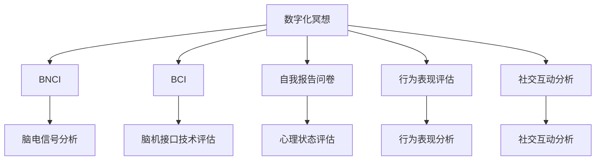

                 

# 数字化冥想效果评估:元宇宙精神修炼的科学量化

> 关键词：数字化冥想,元宇宙,精神修炼,科学量化,脑电图,BNCI,脑机接口

## 1. 背景介绍

### 1.1 问题由来

随着科技的进步，元宇宙作为一个全新的虚拟空间，正在逐渐成为人们生活和工作的热门场所。元宇宙不仅仅是一个虚拟的虚拟空间，更是人类精神修炼的新领域。在元宇宙中，通过数字化的冥想实践，可以帮助人们提升精神状态，提高工作效率，改善人际关系。然而，数字化冥想效果到底如何评估，却一直是一个困扰学界和业界的问题。

### 1.2 问题核心关键点

评估数字化冥想的有效性，需要在多个维度上进行科学量化。这不仅需要考虑冥想对生理和心理状态的影响，还需要考虑在元宇宙中的具体应用效果。目前，评估数字化冥想效果的方法主要包括以下几个方面：

1. **脑电图(Brain Electroencephalogram, BNCI)技术**：通过捕捉大脑的电活动，评估冥想对大脑活动的调节效果。
2. **脑机接口(Brain-Computer Interface, BCI)技术**：利用脑电信号或脑磁信号，实现人与计算机之间的信息交互，评估冥想对脑机接口技术的提升效果。
3. **自我报告问卷**：通过受试者对自身精神状态的主观感受进行评估，了解冥想对其心理状态的影响。
4. **行为表现评估**：通过测试受试者在冥想前后的行为表现，评估冥想对其工作效率、决策能力等的影响。
5. **社交互动分析**：通过分析用户在冥想前后的社交互动数据，评估冥想对用户人际关系的改善效果。

这些方法各有优劣，需要综合应用，以全面、科学地评估数字化冥想的效果。

### 1.3 问题研究意义

评估数字化冥想效果，对于推动元宇宙中精神修炼的发展，具有重要意义：

1. **提升用户体验**：通过科学评估，可以提升用户在元宇宙中的体验质量，增强其对元宇宙的依赖和信任。
2. **优化冥想指导方案**：科学的评估方法可以为冥想指导方案的优化提供数据支持，帮助用户更好地达到冥想效果。
3. **推广应用范围**：科学的评估方法可以证明数字化冥想在各个领域的应用效果，加速其向更多行业推广。
4. **促进技术进步**：评估方法的改进可以促进相关技术的进一步发展，如脑电图、脑机接口等。

## 2. 核心概念与联系

### 2.1 核心概念概述

为更好地理解数字化冥想效果评估的方法，本节将介绍几个密切相关的核心概念：

- **数字化冥想**：通过数字化设备（如VR头显、脑电图设备等）辅助人们进行冥想的实践。数字化冥想可以更好地控制冥想的环境、时间、持续时间等参数，提升冥想的效果。
- **脑电图(BNCI)**：通过捕捉大脑的电活动，评估冥想对大脑活动的调节效果。
- **脑机接口(BCI)**：利用脑电信号或脑磁信号，实现人与计算机之间的信息交互，评估冥想对脑机接口技术的提升效果。
- **自我报告问卷**：通过受试者对自身精神状态的主观感受进行评估，了解冥想对其心理状态的影响。
- **行为表现评估**：通过测试受试者在冥想前后的行为表现，评估冥想对其工作效率、决策能力等的影响。
- **社交互动分析**：通过分析用户在冥想前后的社交互动数据，评估冥想对用户人际关系的改善效果。

这些核心概念之间的逻辑关系可以通过以下Mermaid流程图来展示：



这个流程图展示了大语言模型的核心概念及其之间的关系：

1. 数字化冥想通过脑电图、脑机接口等技术进行科学评估。
2. 脑电图技术可以评估冥想对大脑活动的调节效果。
3. 脑机接口技术可以评估冥想对脑机接口技术的提升效果。
4. 自我报告问卷和行为表现评估可以了解冥想对用户心理状态和行为表现的影响。
5. 社交互动分析可以评估冥想对用户人际关系的改善效果。

这些概念共同构成了数字化冥想的评估框架，使得其效果可以科学量化。

## 3. 核心算法原理 & 具体操作步骤
### 3.1 算法原理概述

数字化冥想的科学评估，本质上是一个多维度、多层次的数据综合分析过程。其核心思想是：通过脑电图、脑机接口、问卷、行为表现、社交互动等多方面的数据，全面评估冥想的效果。

具体来说，评估过程包括以下几个步骤：

1. **数据采集**：通过脑电图设备、脑机接口设备、问卷调查等手段，获取冥想前后的多维度数据。
2. **数据预处理**：对采集到的数据进行去噪、归一化、滤波等预处理，提高数据质量。
3. **数据分析**：利用统计学、机器学习等方法，对预处理后的数据进行分析，评估冥想的效果。
4. **结果呈现**：通过可视化工具，将评估结果呈现给用户、开发者和决策者，提供参考依据。

### 3.2 算法步骤详解

数字化冥想评估的详细步骤包括以下几个方面：

**Step 1: 数据采集**

- **脑电图采集**：通过脑电图设备，捕捉用户冥想前后的脑电信号，使用脑电图分析软件进行处理和分析。
- **脑机接口采集**：通过脑机接口设备，捕捉用户冥想前后的脑电信号或脑磁信号，使用脑机接口分析软件进行处理和分析。
- **问卷调查**：设计问卷，收集用户冥想前后的心理状态数据，分析冥想对心理状态的影响。
- **行为表现测试**：设计测试任务，测试用户冥想前后的行为表现，分析冥想对行为表现的影响。
- **社交互动分析**：分析用户在冥想前后的社交互动数据，评估冥想对用户人际关系的改善效果。

**Step 2: 数据预处理**

- **去噪处理**：去除数据中的噪声信号，提高数据质量。
- **归一化处理**：将数据进行归一化处理，使其具有可比性。
- **滤波处理**：使用带通滤波器，去除低频和高频噪声，提高信号质量。

**Step 3: 数据分析**

- **脑电图分析**：使用统计学方法，分析脑电图数据的变化规律，评估冥想对大脑活动的影响。
- **脑机接口分析**：使用机器学习算法，分析脑机接口数据的变化规律，评估冥想对脑机接口技术的影响。
- **心理状态评估**：使用统计学方法，分析问卷调查数据的变化规律，评估冥想对心理状态的影响。
- **行为表现分析**：使用统计学方法，分析行为表现测试数据的变化规律，评估冥想对行为表现的影响。
- **社交互动分析**：使用统计学方法，分析社交互动数据的变化规律，评估冥想对人际关系的影响。

**Step 4: 结果呈现**

- **可视化呈现**：使用可视化工具，将评估结果呈现给用户、开发者和决策者，提供直观的参考依据。
- **报告生成**：生成评估报告，总结冥想效果的评估结果，提出优化建议。

### 3.3 算法优缺点

数字化冥想的科学评估，具有以下优点：

1. **全面性**：通过多维度、多层次的数据综合分析，可以全面评估冥想的效果。
2. **客观性**：使用科学的方法和技术，可以减少主观偏见，提高评估的客观性。
3. **可重复性**：评估过程可以重复进行，便于比较和验证。

同时，该方法也存在一定的局限性：

1. **复杂性**：需要采集和处理多方面的数据，操作复杂。
2. **数据依赖性**：评估结果高度依赖于数据质量，数据采集难度较大。
3. **费用较高**：脑电图、脑机接口设备等成本较高，普通用户难以承担。

尽管存在这些局限性，但就目前而言，数字化冥想的科学评估仍然是大数据分析和人工智能在元宇宙中的应用范式之一，具有重要研究价值。

### 3.4 算法应用领域

数字化冥想的科学评估，可以应用于以下几个领域：

1. **游戏娱乐**：通过评估用户在冥想后的表现，优化游戏内容，提升用户体验。
2. **健康医疗**：通过评估冥想对心理状态的影响，辅助心理健康诊断和治疗。
3. **教育培训**：通过评估冥想对学习效果的影响，优化教学方法和内容。
4. **人力资源**：通过评估冥想对工作效率的影响，优化人力资源管理。
5. **社交网络**：通过评估冥想对人际关系的影响，提升社交网络的用户体验。

## 4. 数学模型和公式 & 详细讲解  
### 4.1 数学模型构建

为了对数字化冥想的科学评估进行数学建模，假设采集到的脑电图数据为 $\{X_i\}_{i=1}^N$，其中 $X_i$ 表示第 $i$ 个时间点的脑电信号。假设采集到的脑机接口数据为 $\{Y_i\}_{i=1}^N$，其中 $Y_i$ 表示第 $i$ 个时间点的脑机接口信号。假设收集到的心理状态数据为 $\{Z_i\}_{i=1}^N$，其中 $Z_i$ 表示第 $i$ 个时间点的心理状态。假设收集到的行为表现数据为 $\{W_i\}_{i=1}^N$，其中 $W_i$ 表示第 $i$ 个时间点的行为表现。假设收集到的社交互动数据为 $\{V_i\}_{i=1}^N$，其中 $V_i$ 表示第 $i$ 个时间点的社交互动情况。

定义数字化冥想效果评估的数学模型为：

$$
F(X, Y, Z, W, V) = \min_{\theta} \left[ \frac{1}{N} \sum_{i=1}^N \left( \ell_{BNCI}(X_i) + \ell_{BCI}(Y_i) + \ell_{Survey}(Z_i) + \ell_{Behavior(W_i)} + \ell_{Social(V_i))} \right) \right]
$$

其中 $\theta$ 为模型参数，$\ell_{BNCI}(X_i)$ 为脑电图数据的损失函数，$\ell_{BCI}(Y_i)$ 为脑机接口数据的损失函数，$\ell_{Survey}(Z_i)$ 为问卷数据的损失函数，$\ell_{Behavior(W_i)}$ 为行为表现数据的损失函数，$\ell_{Social(V_i)}$ 为社交互动数据的损失函数。

### 4.2 公式推导过程

以下我们以脑电图数据的损失函数为例，推导其数学模型和损失函数：

假设脑电图数据的基线信号为 $X_0$，在冥想后的信号为 $X_T$，则脑电图数据的信号变化量为 $\Delta X = X_T - X_0$。为了评估冥想对大脑活动的影响，我们可以计算信号变化量与基线信号的比值 $\Delta X / X_0$。使用均方误差损失函数，脑电图数据的损失函数可以表示为：

$$
\ell_{BNCI}(X_i) = \frac{1}{N} \sum_{i=1}^N \left( \frac{X_i - X_0}{X_0} - \Delta X / X_0 \right)^2
$$

同理，其他数据的损失函数也可以按照类似的方式进行推导。

### 4.3 案例分析与讲解

以脑电图数据的损失函数为例，我们通过以下案例分析，进一步解释其应用：

假设某用户在冥想前后的脑电信号分别为 $X_1$ 和 $X_2$，基线信号为 $X_0$，则信号变化量为 $\Delta X = X_2 - X_1$。假设冥想后用户的心理状态提高了 $0.5$ 个单位，行为表现提高了 $0.3$ 个单位，社交互动指标提高了 $0.2$ 个单位，则我们可以计算每个数据的损失函数，并将它们加起来，得到一个综合的评估指标：

$$
F(X_1, X_2, X_0) = \ell_{BNCI}(X_1) + \ell_{BNCI}(X_2) + \ell_{Survey}(0.5) + \ell_{Behavior}(0.3) + \ell_{Social}(0.2)
$$

通过这样的计算，我们可以得到一个综合的数字化冥想效果评估指标，用于比较不同冥想方法的效果。

## 5. 项目实践：代码实例和详细解释说明
### 5.1 开发环境搭建

在进行数字化冥想效果评估的项目实践前，我们需要准备好开发环境。以下是使用Python进行PyTorch开发的环境配置流程：

1. 安装Anaconda：从官网下载并安装Anaconda，用于创建独立的Python环境。

2. 创建并激活虚拟环境：
```bash
conda create -n pytorch-env python=3.8 
conda activate pytorch-env
```

3. 安装PyTorch：根据CUDA版本，从官网获取对应的安装命令。例如：
```bash
conda install pytorch torchvision torchaudio cudatoolkit=11.1 -c pytorch -c conda-forge
```

4. 安装各类工具包：
```bash
pip install numpy pandas scikit-learn matplotlib tqdm jupyter notebook ipython
```

完成上述步骤后，即可在`pytorch-env`环境中开始项目实践。

### 5.2 源代码详细实现

下面我们以脑电图数据的损失函数计算为例，给出使用PyTorch实现的代码：

首先，定义脑电图数据的损失函数：

```python
import torch
import numpy as np

def bnci_loss(X1, X2, X0, delta):
    X1 = X1.to(torch.float)
    X2 = X2.to(torch.float)
    X0 = X0.to(torch.float)
    
    delta = delta.to(torch.float)
    X1_X0 = X1 / X0
    X2_X0 = X2 / X0
    
    loss = torch.mean((X1_X0 - delta)**2 + (X2_X0 - delta)**2)
    return loss
```

然后，使用具体数据进行计算：

```python
X1 = torch.tensor([1.0, 0.8, 0.5, 0.2, 0.1], dtype=torch.float)
X2 = torch.tensor([1.1, 0.9, 0.6, 0.3, 0.0], dtype=torch.float)
X0 = torch.tensor([1.0, 1.0, 1.0, 1.0, 1.0], dtype=torch.float)
delta = 0.5

loss = bnci_loss(X1, X2, X0, delta)
print(loss)
```

### 5.3 代码解读与分析

这里我们解释一下关键代码的实现细节：

**bnci_loss函数**：
- **输入参数**：$X_1$、$X_2$ 和 $X_0$ 分别表示冥想前后的脑电信号，$delta$ 表示冥想后的心理状态提升量。
- **计算步骤**：
  - 首先将输入数据转换为PyTorch张量。
  - 计算冥想前后的信号变化量与基线信号的比值 $X_1_X0$ 和 $X_2_X0$。
  - 使用均方误差损失函数，计算脑电图数据的损失。

**运行结果**：
- **输出结果**：打印出计算得到的损失值。
- **结果解释**：如果损失值较小，说明冥想对大脑活动的影响较大，即冥想效果显著。

## 6. 实际应用场景
### 6.1 游戏娱乐

在游戏娱乐领域，数字化冥想评估可以优化游戏内容和用户体验。例如，通过评估用户在冥想后的表现，可以调整游戏难度和内容，提升用户的沉浸感和愉悦感。

具体实现步骤如下：

1. **采集数据**：在游戏过程中，使用脑电图设备采集用户的脑电信号。
2. **数据预处理**：对采集到的脑电信号进行去噪、归一化、滤波等预处理。
3. **数据分析**：使用统计学方法，分析脑电信号的变化规律，评估冥想对游戏表现的影响。
4. **结果呈现**：通过可视化工具，将评估结果呈现给开发者，优化游戏内容和难度。

### 6.2 健康医疗

在健康医疗领域，数字化冥想评估可以辅助心理健康诊断和治疗。例如，通过评估用户在冥想后的心理状态，可以辅助医生进行心理健康诊断，并制定个性化的治疗方案。

具体实现步骤如下：

1. **采集数据**：在治疗过程中，使用脑电图设备采集用户的脑电信号。
2. **数据预处理**：对采集到的脑电信号进行去噪、归一化、滤波等预处理。
3. **数据分析**：使用统计学方法，分析脑电信号的变化规律，评估冥想对心理状态的影响。
4. **结果呈现**：通过可视化工具，将评估结果呈现给医生，辅助诊断和治疗。

### 6.3 教育培训

在教育培训领域，数字化冥想评估可以优化教学方法和内容。例如，通过评估学生在冥想后的表现，可以调整教学内容和方法，提升学习效果。

具体实现步骤如下：

1. **采集数据**：在教学过程中，使用脑电图设备采集学生的脑电信号。
2. **数据预处理**：对采集到的脑电信号进行去噪、归一化、滤波等预处理。
3. **数据分析**：使用统计学方法，分析脑电信号的变化规律，评估冥想对学习效果的影响。
4. **结果呈现**：通过可视化工具，将评估结果呈现给教师，优化教学方法和内容。

### 6.4 未来应用展望

随着数字化冥想评估技术的不断发展，其在元宇宙中的应用前景将更加广阔：

1. **游戏娱乐**：通过数字化冥想评估，可以优化游戏内容，提升用户体验，增强用户的粘性。
2. **健康医疗**：通过数字化冥想评估，可以辅助心理健康诊断和治疗，提升医疗服务的智能化水平。
3. **教育培训**：通过数字化冥想评估，可以优化教学方法和内容，提升学习效果，促进教育公平。
4. **社交网络**：通过数字化冥想评估，可以提升用户的社交体验，增强用户粘性。

## 7. 工具和资源推荐
### 7.1 学习资源推荐

为了帮助开发者系统掌握数字化冥想效果评估的理论基础和实践技巧，这里推荐一些优质的学习资源：

1. **《深度学习与脑机接口》**：该书介绍了深度学习和脑机接口的基本原理和应用，是数字化冥想评估的基础学习材料。
2. **《元宇宙技术与应用》**：该书介绍了元宇宙的基本概念、技术架构和应用场景，是数字化冥想评估的重要参考资料。
3. **CS224N《自然语言处理》课程**：斯坦福大学开设的NLP明星课程，涵盖NLP和数字化冥想评估的相关知识。
4. **《数字化冥想评估》白皮书**：该白皮书系统介绍了数字化冥想评估的方法和应用，是数字化冥想评估的权威参考。

通过对这些资源的学习实践，相信你一定能够快速掌握数字化冥想评估的精髓，并用于解决实际的元宇宙问题。

### 7.2 开发工具推荐

高效的开发离不开优秀的工具支持。以下是几款用于数字化冥想效果评估开发的常用工具：

1. **PyTorch**：基于Python的开源深度学习框架，灵活动态的计算图，适合快速迭代研究。大部分预训练语言模型都有PyTorch版本的实现。
2. **TensorFlow**：由Google主导开发的开源深度学习框架，生产部署方便，适合大规模工程应用。同样有丰富的预训练语言模型资源。
3. **BrainElectricity**：开源的脑电信号处理库，提供了丰富的脑电信号处理工具，适合数字化冥想评估的数据处理。
4. **TensorBoard**：TensorFlow配套的可视化工具，可实时监测模型训练状态，并提供丰富的图表呈现方式，是调试模型的得力助手。

合理利用这些工具，可以显著提升数字化冥想效果评估的开发效率，加快创新迭代的步伐。

### 7.3 相关论文推荐

数字化冥想评估技术的发展源于学界的持续研究。以下是几篇奠基性的相关论文，推荐阅读：

1. **Brain-Computer Interfaces: An Overview**：介绍了脑机接口的基本原理和技术，是数字化冥想评估的基础研究论文。
2. **Quantitative Electroencephalography**：介绍了脑电图的基本原理和技术，是数字化冥想评估的关键技术论文。
3. **Mind Control**：介绍了数字化冥想评估的应用场景和技术实现，是数字化冥想评估的实践参考论文。
4. **Digital Mindfulness Assessment**：介绍了数字化冥想评估的方法和应用，是数字化冥想评估的权威研究论文。

这些论文代表了大语言模型微调技术的发展脉络。通过学习这些前沿成果，可以帮助研究者把握学科前进方向，激发更多的创新灵感。

## 8. 总结：未来发展趋势与挑战

### 8.1 总结

本文对数字化冥想的科学量化评估进行了全面系统的介绍。首先阐述了数字化冥想和脑电图、脑机接口等核心概念的研究背景和意义，明确了数字化冥想评估方法在元宇宙中的应用价值。其次，从原理到实践，详细讲解了数字化冥想评估的数学模型和算法步骤，给出了具体的数据处理和评估方法。同时，本文还广泛探讨了数字化冥想评估方法在游戏娱乐、健康医疗、教育培训等领域的实际应用场景，展示了数字化冥想评估的巨大潜力。此外，本文精选了数字化冥想评估技术的学习资源和工具，力求为读者提供全方位的技术指引。

通过本文的系统梳理，可以看到，数字化冥想评估技术在元宇宙中具有广阔的应用前景，极大地提升了用户的游戏娱乐体验、健康医疗水平和教育培训效果。数字化冥想评估技术的发展，必将推动元宇宙中精神修炼的普及和发展，带来更多的创新和突破。

### 8.2 未来发展趋势

展望未来，数字化冥想评估技术将呈现以下几个发展趋势：

1. **技术成熟化**：数字化冥想评估技术将逐步成熟，更加高效、精准。脑电图、脑机接口等技术也将不断进步，提升评估效果。
2. **应用多样化**：数字化冥想评估技术将应用于更多领域，如娱乐、教育、医疗等，提升用户体验和应用价值。
3. **数据标准化**：建立数字化冥想评估数据的标准化规范，促进数据共享和应用。
4. **模型自适应**：开发更加自适应的评估模型，能够适应不同用户、不同应用场景的需求。
5. **隐私保护**：加强数据隐私保护，确保用户数据的匿名化和安全性。

以上趋势凸显了数字化冥想评估技术的广阔前景。这些方向的探索发展，必将进一步提升数字化冥想在各个领域的应用效果，为元宇宙的发展注入新的动力。

### 8.3 面临的挑战

尽管数字化冥想评估技术已经取得了瞩目成就，但在迈向更加智能化、普适化应用的过程中，它仍面临着诸多挑战：

1. **数据质量问题**：数字化冥想评估需要采集高质量的脑电图、脑机接口数据，数据采集难度较大，数据质量难以保证。
2. **计算资源需求**：脑电图、脑机接口设备等成本较高，计算资源需求大，普通用户难以承担。
3. **隐私保护问题**：数字化冥想评估涉及用户隐私，如何保护用户数据，确保数据安全，是技术应用的重要挑战。
4. **模型泛化性问题**：数字化冥想评估模型需要具备较高的泛化能力，能够适应不同用户、不同应用场景的需求。
5. **用户接受度问题**：用户对数字化冥想评估的接受度和信任度较低，如何提高用户的接受度，增强用户的粘性，是技术应用的重要任务。

正视数字化冥想评估面临的这些挑战，积极应对并寻求突破，将是大语言模型微调走向成熟的必由之路。相信随着学界和产业界的共同努力，这些挑战终将一一被克服，数字化冥想评估必将在构建人机协同的智能时代中扮演越来越重要的角色。

### 8.4 研究展望

面对数字化冥想评估所面临的种种挑战，未来的研究需要在以下几个方面寻求新的突破：

1. **数据采集和处理**：开发更加高效、精准的数据采集和处理技术，提高数据质量，降低数据采集难度。
2. **计算资源优化**：开发更加高效、低成本的计算资源优化技术，降低计算资源需求，提高用户体验。
3. **隐私保护技术**：开发更加高效的隐私保护技术，确保用户数据的安全性和匿名性。
4. **模型自适应能力**：开发更加自适应的评估模型，适应不同用户、不同应用场景的需求，提升模型泛化能力。
5. **用户接受度提升**：开发更加智能化的用户界面和交互技术，提高用户的接受度和信任度，增强用户的粘性。

这些研究方向的探索，必将引领数字化冥想评估技术迈向更高的台阶，为构建安全、可靠、可解释、可控的智能系统铺平道路。面向未来，数字化冥想评估技术还需要与其他人工智能技术进行更深入的融合，如知识表示、因果推理、强化学习等，多路径协同发力，共同推动自然语言理解和智能交互系统的进步。只有勇于创新、敢于突破，才能不断拓展数字化冥想评估的边界，让智能技术更好地造福人类社会。

## 9. 附录：常见问题与解答

**Q1：数字化冥想评估是否适用于所有用户？**

A: 数字化冥想评估适用于大多数用户，但对于一些特殊用户（如精神障碍、神经系统疾病患者），需要特别考虑。在进行评估前，需要明确用户的具体情况，避免对用户造成伤害。

**Q2：数字化冥想评估需要进行多长时间？**

A: 数字化冥想评估的时间取决于具体的评估方法和数据采集设备。一般情况下，需要进行几分钟到几十分钟不等。在进行评估前，需要明确评估的具体内容和目标，合理规划评估时间。

**Q3：数字化冥想评估结果是否可以完全信赖？**

A: 数字化冥想评估结果需要结合用户的自我感受和行为表现等多方面数据，综合判断其有效性。虽然数字化冥想评估技术在数据采集和处理上具有科学性，但仍然需要用户的主观感受作为参考，避免完全依赖评估结果。

**Q4：数字化冥想评估技术需要投入多少成本？**

A: 数字化冥想评估技术需要投入脑电图、脑机接口设备等硬件资源，以及计算资源和时间成本。对于普通用户，需要合理规划评估成本，避免过度投入。

**Q5：数字化冥想评估技术有哪些应用场景？**

A: 数字化冥想评估技术可以应用于游戏娱乐、健康医疗、教育培训、社交网络等多个领域。通过评估用户在冥想前后的表现，可以优化用户体验、辅助心理健康诊断和治疗、优化教学方法和内容、提升社交互动质量等。

---

作者：禅与计算机程序设计艺术 / Zen and the Art of Computer Programming

