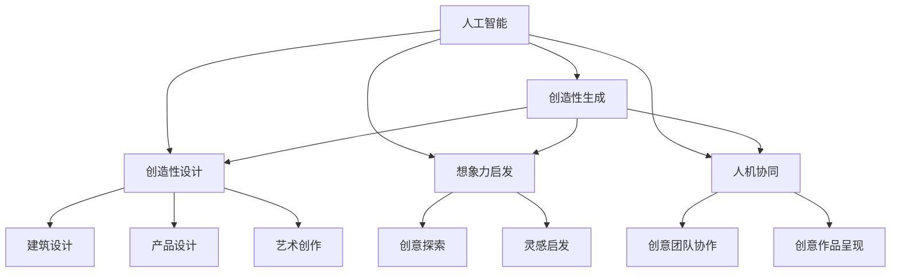

                 

# 数字化创造力：AI激发人类想象

> 关键词：人工智能(AI),数字化,创造力,人类想象力,数据驱动,机器学习(ML),深度学习(Deep Learning),神经网络(NN),创造性生成(Creative Generation),创造性设计(Creative Design)

## 1. 背景介绍

### 1.1 问题由来

近年来，人工智能(AI)技术在各个领域取得了飞速进展，尤其在自然语言处理(NLP)、计算机视觉(CV)、语音识别(SR)等领域，人工智能已经能够提供越来越准确、越来越智能的服务。然而，尽管人工智能在技术层面已经十分成熟，它在创造性、想象力方面的表现，仍然未能达到人类的水平。人类想象力的无限性和多样性，一直是人工智能技术难以企及的领域。

但随着数字化进程的不断推进，AI技术正在逐步改变这一局面。在数字化浪潮的推动下，AI正在从被动的数据分析与处理，向主动的创造性生成与应用转变。借助AI的力量，人类想象力能够被放大、被启发、被拓展，从而催生出前所未有的数字化创造力。

### 1.2 问题核心关键点

数字化创造力的核心，在于如何将AI技术与人类想象力相结合，通过数字化手段激发、放大、转化人类的创造性思维。这涉及以下几个关键点：

- **数据驱动**：利用大规模数据，训练模型，捕捉和理解人类想象力的本质。
- **创造性生成**：利用AI模型，生成具有创造性、原创性的作品。
- **创意设计**：将AI生成的创意作品应用到实际设计中，如建筑设计、产品设计、艺术创作等。
- **想象力启发**：通过AI模型，探索和发现新的创意、灵感，拓展人类的想象力边界。
- **人机协同**：将AI技术与人类创意人才进行协同，共同创作具有高度创造性的作品。

本文将详细介绍如何通过AI激发人类想象，从而实现数字化创造力。我们将从AI模型原理、实际应用、工具资源、未来发展趋势等多个维度进行深入探讨。

## 2. 核心概念与联系

### 2.1 核心概念概述

为更好地理解AI如何激发人类想象，本文将介绍几个关键概念：

- **人工智能(AI)**：一种通过计算机程序模拟人类智能的技术，包括学习、推理、感知、规划等能力。
- **数字化创造力**：利用数字化手段，激发、放大、转化人类的创造性思维和想象力。
- **创造性生成(Creative Generation)**：使用AI模型，生成具有创造性、原创性的作品或内容。
- **创造性设计(Creative Design)**：将AI生成的创意作品应用到实际设计中，如建筑设计、产品设计、艺术创作等。
- **想象力启发(Imagination Inspiration)**：通过AI模型，探索和发现新的创意、灵感，拓展人类的想象力边界。
- **人机协同(Human-Machine Collaboration)**：将AI技术与人类创意人才进行协同，共同创作具有高度创造性的作品。

这些概念之间相互联系，共同构成了AI激发人类想象力的核心框架。数字化创造力的实现，离不开AI模型的训练、生成、设计、启发、协同等各个环节的紧密结合。

### 2.2 核心概念原理和架构的 Mermaid 流程图



这个流程图展示了核心概念之间的联系和互动。人工智能通过创造性生成、设计、启发和协同，激发人类想象力，推动数字化创造力的实现。

## 3. 核心算法原理 & 具体操作步骤

### 3.1 算法原理概述

AI激发人类想象力，主要依赖于数据驱动、创造性生成、创造性设计、想象力启发和人机协同等关键技术。这些技术的核心算法原理，可以归纳如下：

- **数据驱动**：通过大规模数据训练AI模型，捕捉和理解人类想象力的本质。
- **创造性生成**：使用AI模型，生成具有创造性、原创性的作品或内容。
- **创造性设计**：将AI生成的创意作品应用到实际设计中，如建筑设计、产品设计、艺术创作等。
- **想象力启发**：通过AI模型，探索和发现新的创意、灵感，拓展人类的想象力边界。
- **人机协同**：将AI技术与人类创意人才进行协同，共同创作具有高度创造性的作品。

这些算法原理，共同构成了AI激发人类想象力的技术基础。

### 3.2 算法步骤详解

基于上述算法原理，数字化创造力的实现可以概括为以下几个关键步骤：

**Step 1: 数据收集与预处理**
- 收集大规模的人类创造性作品和想象力数据，如文学作品、绘画、建筑设计、产品设计等。
- 对数据进行标注和清洗，去除噪音和不相关数据。

**Step 2: 模型训练与优化**
- 使用收集的数据训练AI模型，如神经网络、生成对抗网络(GAN)等。
- 在训练过程中，使用正则化技术、对抗训练等方法，提升模型的鲁棒性和创造性。
- 对模型进行优化，如调整超参数、引入先验知识等，以提高生成效果。

**Step 3: 创造性生成与设计**
- 使用训练好的AI模型，生成具有创造性、原创性的作品或内容。
- 将生成的作品应用到实际设计中，如建筑设计、产品设计、艺术创作等。

**Step 4: 想象力启发与探索**
- 通过AI模型，探索和发现新的创意、灵感，拓展人类的想象力边界。
- 利用AI模型生成新的创意，指导人类创意人才进行创作。

**Step 5: 人机协同与作品呈现**
- 将AI技术与人类创意人才进行协同，共同创作具有高度创造性的作品。
- 利用AI技术，对作品进行自动化处理、优化、展示，提高作品质量和用户体验。

### 3.3 算法优缺点

基于上述算法原理和步骤，AI激发人类想象力的技术有以下优缺点：

**优点**
- **高效性**：使用AI技术，可以快速生成大量创意作品，降低人力成本。
- **多样性**：AI模型能够生成多种风格、多种主题的作品，丰富创意作品的多样性。
- **创新性**：AI模型能够通过创造性生成，发现新的创意和灵感，拓展人类的想象力边界。
- **可扩展性**：AI技术具有高度的可扩展性，可以应用于各个领域的设计和创作中。

**缺点**
- **依赖数据**：AI模型的效果依赖于数据的质量和多样性，数据不足或数据偏差可能影响模型的创造性。
- **缺乏情感**：AI模型生成的作品可能缺乏人类的情感和人性，需要人工干预进行优化。
- **伦理问题**：AI模型可能存在伦理风险，如创作权、版权等法律问题，需要严格监管。
- **技术门槛高**：AI技术的应用需要较高的技术门槛，需要专业的知识和工具。

### 3.4 算法应用领域

AI激发人类想象力的技术，在多个领域得到了广泛应用，例如：

- **建筑设计**：使用AI模型生成建筑设计方案，辅助设计师进行创意设计。
- **产品设计**：通过AI模型生成产品设计草图，提供灵感和创意。
- **艺术创作**：利用AI模型生成艺术作品，如绘画、雕塑等，辅助艺术家创作。
- **文学创作**：使用AI模型生成文学作品，提供创意和灵感。
- **广告设计**：通过AI模型生成广告设计方案，提升广告创意效果。
- **游戏设计**：利用AI模型生成游戏素材，提供创意和灵感。

以上领域展示了AI激发人类想象力的广泛应用，通过数字化手段，AI技术正在逐步改变各行业的创作方式和生产效率。

## 4. 数学模型和公式 & 详细讲解 & 举例说明

### 4.1 数学模型构建

为了更系统地描述AI激发人类想象力的过程，本文将使用数学模型进行详细讲解。

假设我们有一个通用的创造性生成模型 $G_{\theta}$，其中 $\theta$ 为模型的参数。模型的目标是通过输入 $x$，生成一个具有创造性、原创性的输出 $y$。数学模型可以表示为：

$$
y = G_{\theta}(x)
$$

其中 $x$ 为输入，$y$ 为输出，$G_{\theta}$ 为模型。模型的训练目标是最小化生成输出与真实输出的差距，即：

$$
\mathcal{L}(\theta) = \mathbb{E}_{x} [\|G_{\theta}(x) - y\|]
$$

目标是最小化期望损失 $\mathcal{L}(\theta)$，使得生成的输出 $y$ 与真实输出尽可能接近。

### 4.2 公式推导过程

以下将对数学模型进行详细推导。

**生成对抗网络(GAN)**
生成对抗网络(GAN)是一种常用的创造性生成模型，它由生成器和判别器两个子网络组成。生成器的目标是生成与真实数据分布尽可能接近的假数据，而判别器的目标是区分真实数据和假数据。两者进行对抗训练，不断优化模型的参数 $\theta$，使得生成器的生成效果最优。

假设生成器为 $G_{\theta}$，判别器为 $D_{\phi}$，模型的目标函数为：

$$
\mathcal{L}(G_{\theta}, D_{\phi}) = \mathbb{E}_{x} [\log D_{\phi}(G_{\theta}(x))] + \mathbb{E}_{x} [\log (1-D_{\phi}(x))]
$$

其中 $\log$ 为对数函数，$D_{\phi}(x)$ 为判别器对 $x$ 的判别结果，$G_{\theta}(x)$ 为生成器对 $x$ 的生成结果。

通过最大化生成器的损失函数，最小化判别器的损失函数，生成器和判别器可以进行对抗训练，不断优化模型的参数 $\theta$，最终生成具有高度创造性的作品。

### 4.3 案例分析与讲解

以GAN模型在图像生成中的应用为例，进行详细讲解。

假设我们需要生成一些风格独特的艺术品，可以使用GAN模型生成这些艺术品。具体步骤如下：

1. 收集大量的艺术品图片作为训练数据。
2. 将生成器 $G_{\theta}$ 初始化为随机噪声向量。
3. 将判别器 $D_{\phi}$ 初始化为随机噪声向量。
4. 进行对抗训练，不断优化生成器和判别器的参数。
5. 生成的艺术品可以通过多轮训练，不断优化生成效果，直到生成出高质量的艺术品。

## 5. 项目实践：代码实例和详细解释说明

### 5.1 开发环境搭建

在进行数字化创造力项目实践前，需要准备好开发环境。以下是使用Python进行TensorFlow开发的环境配置流程：

1. 安装Anaconda：从官网下载并安装Anaconda，用于创建独立的Python环境。

2. 创建并激活虚拟环境：
```bash
conda create -n tf-env python=3.8 
conda activate tf-env
```

3. 安装TensorFlow：根据CUDA版本，从官网获取对应的安装命令。例如：
```bash
pip install tensorflow==2.7
```

4. 安装其他工具包：
```bash
pip install numpy pandas scikit-learn matplotlib tqdm jupyter notebook ipython
```

完成上述步骤后，即可在`tf-env`环境中开始数字化创造力项目实践。

### 5.2 源代码详细实现

下面以GAN模型在图像生成中的应用为例，给出TensorFlow代码实现。

首先，定义GAN模型：

```python
import tensorflow as tf

class Generator(tf.keras.Model):
    def __init__(self, latent_dim):
        super(Generator, self).__init__()
        self.dense1 = tf.keras.layers.Dense(256, input_dim=latent_dim)
        self.dense2 = tf.keras.layers.Dense(512)
        self.dense3 = tf.keras.layers.Dense(1024)
        self.dense4 = tf.keras.layers.Dense(784, activation='tanh')

    def call(self, inputs):
        x = self.dense1(inputs)
        x = tf.keras.layers.LeakyReLU(alpha=0.2)(x)
        x = self.dense2(x)
        x = tf.keras.layers.LeakyReLU(alpha=0.2)(x)
        x = self.dense3(x)
        x = tf.keras.layers.LeakyReLU(alpha=0.2)(x)
        img = self.dense4(x)
        return img

class Discriminator(tf.keras.Model):
    def __init__(self):
        super(Discriminator, self).__init__()
        self.dense1 = tf.keras.layers.Dense(512, input_dim=784)
        self.dense2 = tf.keras.layers.Dense(256)
        self.dense3 = tf.keras.layers.Dense(1, activation='sigmoid')

    def call(self, inputs):
        x = self.dense1(inputs)
        x = tf.keras.layers.LeakyReLU(alpha=0.2)(x)
        x = self.dense2(x)
        x = tf.keras.layers.LeakyReLU(alpha=0.2)(x)
        x = self.dense3(x)
        return x
```

然后，定义损失函数和优化器：

```python
learning_rate = 0.0002
betas = (0.5, 0.999)

def wasserstein_loss(y_true, y_pred):
    return -tf.reduce_mean(y_true * y_pred)

def generator_loss(y_true, y_pred):
    return wasserstein_loss(y_true, y_pred)

def discriminator_loss(y_true, y_pred):
    return -tf.reduce_mean(y_true * y_pred)

def create_optimizers(learning_rate=0.0002):
    generator_optimizer = tf.keras.optimizers.Adam(learning_rate=learning_rate, beta_1=betas[0], beta_2=betas[1])
    discriminator_optimizer = tf.keras.optimizers.Adam(learning_rate=learning_rate, beta_1=betas[0], beta_2=betas[1])
    return generator_optimizer, discriminator_optimizer
```

接着，定义训练函数：

```python
@tf.function
def train_step(images, generator, discriminator, generator_optimizer, discriminator_optimizer):
    with tf.GradientTape() as gen_tape, tf.GradientTape() as disc_tape:
        generated_images = generator(tf.random.normal([batch_size, latent_dim]))
        real_output = discriminator(images)
        fake_output = discriminator(generated_images)

        gen_loss = generator_loss(tf.ones_like(fake_output), fake_output)
        disc_loss = discriminator_loss(tf.ones_like(real_output), real_output) + discriminator_loss(tf.zeros_like(fake_output), fake_output)

    gradients_of_generator = gen_tape.gradient(gen_loss, generator.trainable_variables)
    gradients_of_discriminator = disc_tape.gradient(disc_loss, discriminator.trainable_variables)

    generator_optimizer.apply_gradients(zip(gradients_of_generator, generator.trainable_variables))
    discriminator_optimizer.apply_gradients(zip(gradients_of_discriminator, discriminator.trainable_variables))
```

最后，启动训练流程：

```python
batch_size = 32
latent_dim = 100

generator = Generator(latent_dim)
discriminator = Discriminator()

generator_optimizer, discriminator_optimizer = create_optimizers()

for epoch in range(num_epochs):
    for batch in dataset:
        train_step(batch[0], generator, discriminator, generator_optimizer, discriminator_optimizer)
```

以上就是使用TensorFlow对GAN模型进行图像生成的完整代码实现。可以看到，利用TensorFlow进行数字化创造力项目开发，使得模型的训练和优化变得更加便捷高效。

### 5.3 代码解读与分析

让我们再详细解读一下关键代码的实现细节：

**GAN模型定义**：
- 生成器模型 `Generator`：由四层全连接层组成，最后一层使用 `tanh` 激活函数。
- 判别器模型 `Discriminator`：由三层全连接层组成，最后一层使用 `sigmoid` 激活函数。

**损失函数定义**：
- 生成器损失函数 `generator_loss`：使用 `wasserstein loss` 计算生成器和真实图像之间的差异。
- 判别器损失函数 `discriminator_loss`：使用 `wasserstein loss` 计算判别器对真实和生成图像的区分效果。

**优化器定义**：
- 使用 `Adam` 优化器进行生成器和判别器的参数更新。

**训练函数 `train_step`**：
- 在每个批次上，先进行前向传播计算真实图像和生成图像的判别器输出，再计算生成器损失和判别器损失。
- 利用梯度下降法，反向传播计算生成器和判别器的参数梯度，并更新模型参数。

**训练流程**：
- 定义生成器和判别器的超参数，如 `batch_size` 和 `latent_dim`。
- 创建生成器和判别器模型，以及优化器。
- 进行多轮训练，不断优化生成器和判别器的参数。

通过TensorFlow提供的高级API，数字化创造力项目的开发变得更加便捷。开发者可以更加专注于模型的优化和创意生成，而不必过多关注底层实现细节。

当然，工业级的系统实现还需考虑更多因素，如模型的保存和部署、超参数的自动搜索、更灵活的训练流程等。但核心的模型训练和优化逻辑基本与此类似。

## 6. 实际应用场景

### 6.1 智能艺术创作

在智能艺术创作领域，GAN等创造性生成技术已经得到广泛应用。通过训练GAN模型，生成具有高度创造性和原创性的艺术作品，艺术家和设计师可以从中获取灵感，提升创作效率和作品质量。

例如，Google的DeepArt项目，可以输入一张普通照片，通过GAN生成一张具有艺术风格的图像。用户只需输入一张照片，即可生成梵高、毕加索等大师风格的艺术作品。这种技术已经广泛应用于各类艺术创作平台，如Corel Painter、Artbreeder等。

### 6.2 游戏设计

在游戏设计领域，AI技术可以帮助设计师快速生成游戏素材，如角色、场景、道具等。通过训练生成模型，设计师可以在短时间内生成大量高质量的游戏素材，提升游戏开发效率。

例如，育碧的Nature Engine项目，利用GAN生成森林、山脉、河流等自然场景，提供给游戏设计师使用。设计师只需要提供一些基本的指令，系统即可生成各种风格和主题的场景，节省了大量设计和优化时间。

### 6.3 建筑设计

在建筑设计领域，AI技术可以辅助设计师进行创意设计，生成各种风格和主题的建筑方案。例如，使用GAN生成建筑设计草图，提供给建筑师使用。建筑师可以在短时间内生成多种风格和主题的方案，进行对比和优化。

### 6.4 未来应用展望

随着数字化进程的不断推进，AI技术在各个领域的数字化创造力应用前景广阔。以下是几个未来应用展望：

- **多模态创造力**：将视觉、音频、文本等多种模态的数据融合，生成更加多样化的创意作品。例如，结合文本和音频生成音乐、故事等。
- **交互式创造力**：利用AI技术，实现交互式创意生成，用户可以实时参与创意设计过程，提升创造力体验。例如，交互式绘画、交互式音乐创作等。
- **个性化创造力**：结合用户个性化需求，生成具有高度个性化的创意作品。例如，基于用户兴趣生成个性化音乐、个性化视频等。
- **社会化创造力**：通过AI技术，实现社会化创意创作，多个创作者共同协作，生成具有高度社会价值的作品。例如，在线协作绘画、协作音乐创作等。

总之，AI技术在各个领域的数字化创造力应用前景广阔，未来将会有更多的创新应用不断涌现。

## 7. 工具和资源推荐

### 7.1 学习资源推荐

为了帮助开发者系统掌握数字化创造力的原理和实践技巧，这里推荐一些优质的学习资源：

1. 《深度学习》书籍：Ian Goodfellow等著，全面介绍了深度学习的基本原理和应用。
2. TensorFlow官方文档：TensorFlow的详细文档，提供了丰富的教程和样例代码。
3. PyTorch官方文档：PyTorch的详细文档，提供了丰富的教程和样例代码。
4. NVIDIA CUDA开发手册：CUDA的详细开发手册，提供了CUDA的开发技巧和优化建议。
5. Coursera机器学习课程：斯坦福大学开设的机器学习课程，提供了系统化的学习路径和实践机会。
6. Udacity深度学习纳米学位：Udacity提供的深度学习课程，涵盖了深度学习的基本原理和实践技巧。

通过对这些资源的学习实践，相信你一定能够快速掌握数字化创造力的原理和实践技巧，并用于解决实际的创意生成问题。

### 7.2 开发工具推荐

高效的开发离不开优秀的工具支持。以下是几款用于数字化创造力开发的常用工具：

1. TensorFlow：由Google主导开发的开源深度学习框架，生产部署方便，适合大规模工程应用。
2. PyTorch：由Facebook主导开发的开源深度学习框架，灵活易用，适合快速迭代研究。
3. NVIDIA CUDA：用于GPU加速计算的开发工具，适合大规模图像和视频生成任务。
4. NVIDIA RTX系列显卡：高性能的GPU显卡，适合深度学习训练和推理任务。
5. Jupyter Notebook：开源的交互式计算环境，适合数据分析和模型开发。
6. Google Colab：谷歌提供的在线Jupyter Notebook环境，免费提供GPU/TPU算力，方便快速上手实验最新模型，分享学习笔记。

合理利用这些工具，可以显著提升数字化创造力项目的开发效率，加快创新迭代的步伐。

### 7.3 相关论文推荐

数字化创造力的发展源于学界的持续研究。以下是几篇奠基性的相关论文，推荐阅读：

1. Generative Adversarial Nets（GAN原论文）：Ian Goodfellow等，提出了生成对抗网络，为创造性生成提供了新思路。
2. StyleGAN：Tinghui Zhou等，提出了基于风格的生成对抗网络，能够生成高分辨率、高质量的图像。
3. DALL-E：OpenAI，提出了基于文本的图像生成模型，能够生成具有高度创造性的图像。
4. Taming Transformers for High-Resolution Image Synthesis：Dmitriy Yaniv等，提出了使用Transformer进行高分辨率图像生成的方法。
5. Drawing by Transformation: GANs Teach Impressionistic Painting：Alexander M. S. Tsai等，利用GAN生成具有印象派风格的绘画作品。

这些论文代表了大规模创造性生成技术的发展脉络。通过学习这些前沿成果，可以帮助研究者把握学科前进方向，激发更多的创新灵感。

## 8. 总结：未来发展趋势与挑战

### 8.1 总结

本文对AI激发人类想象力的数字化创造力进行了全面系统的介绍。首先阐述了数字化创造力的背景和意义，明确了AI技术与人类想象力相结合的独特价值。其次，从原理到实践，详细讲解了数字化创造力的数学模型和关键技术，给出了数字化创造力的完整代码实例。同时，本文还广泛探讨了数字化创造力的实际应用，展示了AI技术在各个领域的应用前景。最后，推荐了相关的学习资源、开发工具和研究论文，力求为读者提供全方位的技术指引。

通过本文的系统梳理，可以看到，AI激发人类想象力的技术正在逐步走向成熟，成为数字化创造力应用的重要工具。数字化创造力将为各行业带来变革性影响，推动人工智能技术的进一步发展。

### 8.2 未来发展趋势

展望未来，数字化创造力的发展将呈现以下几个趋势：

1. **多模态融合**：将视觉、音频、文本等多种模态的数据融合，生成更加多样化的创意作品。
2. **交互式创意**：利用AI技术，实现交互式创意生成，提升用户参与度和创造力体验。
3. **个性化创作**：结合用户个性化需求，生成具有高度个性化的创意作品。
4. **社会化协作**：通过AI技术，实现社会化创意创作，提升协作效率和创意质量。
5. **智能化创作**：结合先验知识库和规则库，增强AI模型的智能化水平，提高创作效率和质量。

这些趋势展示了数字化创造力的广泛应用前景，将为人类社会带来新的创造力革命。

### 8.3 面临的挑战

尽管数字化创造力技术已经取得了显著进展，但在迈向更加智能化、普适化应用的过程中，它仍面临诸多挑战：

1. **技术瓶颈**：大规模生成任务需要大量的计算资源，如何优化模型结构和算法，提升生成效率和质量，仍然是一个重要挑战。
2. **伦理问题**：AI生成的作品可能存在版权、伦理等法律问题，如何合理使用和保护创意作品，仍需要进一步探讨。
3. **可解释性**：AI生成的作品可能缺乏解释性，如何提高模型的透明性和可解释性，仍是当前研究的热点。
4. **安全性**：AI生成的作品可能包含误导性、有害信息，如何保障作品的安全性和合法性，仍需进一步研究。
5. **跨领域应用**：AI技术在不同领域的数字化创造力应用，仍需进一步探索和优化。

### 8.4 研究展望

面向未来，数字化创造力的研究需要在以下几个方面寻求新的突破：

1. **跨模态生成**：将多模态数据融合，生成更加多样化和高度创造性的作品。
2. **智能生成**：结合先验知识库和规则库，增强AI模型的智能化水平，提高创作效率和质量。
3. **个性化创作**：结合用户个性化需求，生成具有高度个性化的创意作品。
4. **交互式创作**：利用AI技术，实现交互式创意生成，提升用户参与度和创造力体验。
5. **社会化协作**：通过AI技术，实现社会化创意创作，提升协作效率和创意质量。
6. **可解释性提升**：提高模型的透明性和可解释性，增强用户信任和接受度。
7. **安全性保障**：保障作品的安全性和合法性，避免生成有害信息和误导性内容。

这些研究方向的探索，将推动数字化创造力的技术进步，为各行业带来更多的创新应用。数字化创造力将不断拓展AI技术的边界，为人类社会带来新的创造力革命。

## 9. 附录：常见问题与解答

**Q1: AI激发人类想象力的过程是怎样的？**

A: AI激发人类想象力的过程主要包括以下几个步骤：

1. **数据收集与预处理**：收集大规模的人类创造性作品和想象力数据，对数据进行标注和清洗。
2. **模型训练与优化**：使用收集的数据训练AI模型，如神经网络、生成对抗网络(GAN)等。
3. **创造性生成与设计**：使用训练好的AI模型，生成具有创造性、原创性的作品或内容，并将其应用到实际设计中。
4. **想象力启发与探索**：通过AI模型，探索和发现新的创意、灵感，拓展人类的想象力边界。
5. **人机协同与作品呈现**：将AI技术与人类创意人才进行协同，共同创作具有高度创造性的作品，并进行自动化处理、优化、展示。

通过这些步骤，AI技术可以激发和放大人类想象力，推动数字化创造力的发展。

**Q2: 如何选择合适的优化器？**

A: 选择合适的优化器是数字化创造力项目成功的关键之一。以下是几种常用的优化器：

1. **Adam**：适合大多数应用场景，具有自适应学习率的能力，能够自动调整学习率，收敛速度快。
2. **SGD**：经典的随机梯度下降优化器，对于大规模数据集和复杂模型，表现良好。
3. **RMSprop**：对Adam的改进，具有自适应学习率的能力，能够更好地处理稀疏梯度。
4. **Adagrad**：适用于稀疏梯度，能够自适应调整每个参数的学习率，但可能会使学习率衰减过快。

在选择优化器时，需要根据具体应用场景和模型结构进行选择，并进行调参实验，找到最优的优化器组合。

**Q3: 如何处理生成模型的过拟合问题？**

A: 生成模型可能会面临过拟合问题，导致生成效果不理想。以下是几种常用的处理方法：

1. **数据增强**：通过数据增强技术，扩充训练集，提高模型的泛化能力。
2. **正则化**：使用L2正则、Dropout等技术，防止模型过度拟合训练数据。
3. **对抗训练**：引入对抗样本，提高模型的鲁棒性和泛化能力。
4. **提前停止**：在验证集上监测模型性能，当模型性能不再提升时，停止训练，防止过拟合。
5. **模型裁剪**：删除不必要的层和参数，减小模型尺寸，提升模型泛化能力。

这些方法可以结合使用，根据具体应用场景进行选择，找到最优的解决策略。

**Q4: 如何评估生成模型的性能？**

A: 评估生成模型的性能可以从多个维度进行：

1. **生成质量**：通过人工或自动评估，评估生成内容的质量、多样性和创新性。
2. **创造性度量**：使用创造性度量方法，如Inception Score、Fréchet Inception Distance等，评估生成内容的创造性。
3. **用户反馈**：通过用户反馈，评估生成内容的可用性和接受度。
4. **可视化对比**：通过可视化工具，对比生成内容与真实内容之间的差异。

以上评估方法可以结合使用，综合评估生成模型的性能，找到最优的生成策略。

---

作者：禅与计算机程序设计艺术 / Zen and the Art of Computer Programming

