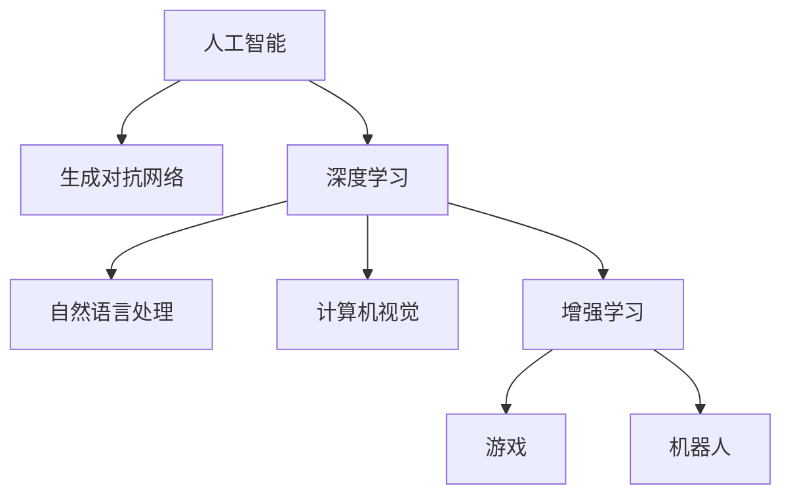

                 

## 1. 背景介绍

### 1.1 问题由来

随着信息技术的快速发展，数字化技术在各行业的应用逐渐普及，极大地提升了生产效率和创新能力。人工智能（AI）技术的进步，特别是深度学习和大数据分析技术的发展，正在全面重塑人类的生产方式和生活方式。在这一过程中，AI不仅在自动化、智能化等领域发挥着重要作用，还展现了其在创造性思维、艺术创作等方面的潜力，为数字化时代的创造力注入了新的活力。

### 1.2 问题核心关键点

当前，AI在创造性领域的应用主要集中在以下几个方面：

- **艺术创作**：AI可以生成绘画、音乐、诗歌、故事等作品，甚至可以创作出具有一定艺术价值的作品。
- **创新设计**：AI在产品设计、工业设计等领域，通过大数据分析和模式识别，辅助设计师进行创意设计，提升设计效率和创新能力。
- **广告和营销**：AI通过分析消费者行为和偏好，生成个性化广告和营销策略，增强品牌的市场竞争力。
- **文学和影视创作**：AI可以辅助编剧、导演进行剧本创作、场景设计，提升创作效率和创新水平。

这些应用展示了AI在激发人类创造力方面的巨大潜力。然而，AI如何真正激发人类想象，实现与人类智能的深度融合，仍是一个需要深入探讨的问题。本文旨在通过深入分析AI技术在创造性领域的应用，探讨AI激发人类想象的可能性与方法。

### 1.3 问题研究意义

AI技术在创造性领域的应用，不仅能够提升人类的工作效率，还能激发更多的创新思维和创意灵感。通过理解和利用AI技术，我们可以更好地释放人类的创造潜力，推动文化和艺术的发展，促进社会创新能力的提升。具体而言，研究AI激发人类想象的方法，对于以下方面具有重要意义：

1. **提高创作效率**：AI能够快速生成大量的创意素材，辅助创作者进行快速迭代和优化，提升创作效率。
2. **拓展创作领域**：AI在音乐、绘画、文学等传统创作领域的应用，拓展了创作的可能性，丰富了创作手段和形式。
3. **推动文化创新**：AI技术在文化遗产保护、艺术作品重现等方面的应用，为传统文化的传承和创新提供了新的路径。
4. **促进教育创新**：AI在教育领域的应用，如虚拟助教、智能辅导系统等，能够提升学生的学习兴趣和创造力，推动教育创新。
5. **加速科技应用**：AI在科技创新中的辅助作用，能够加速科技成果的转化，推动新技术和新产品的开发。

总之，AI激发人类想象的研究，不仅具有理论价值，还具有广泛的应用前景和社会意义。

## 2. 核心概念与联系

### 2.1 核心概念概述

为更好地理解AI在创造性领域的应用，本节将介绍几个关键概念：

- **人工智能（AI）**：一种通过计算机模拟人类智能的技术，包括机器学习、自然语言处理、计算机视觉等。
- **创造性思维（Creative Thinking）**：指通过想象力、创造力进行问题解决和创新思维的过程。
- **生成对抗网络（GANs）**：一种由生成器和判别器两部分组成的深度学习模型，可以生成高质量的图像、音频、视频等。
- **深度学习（Deep Learning）**：一种基于神经网络的机器学习技术，能够自动从数据中提取特征，进行分类、生成等任务。
- **增强学习（Reinforcement Learning）**：一种通过与环境互动，不断优化行为策略的机器学习方法，可以应用于游戏、机器人等领域。
- **自然语言处理（NLP）**：一种通过计算机理解和处理自然语言的技术，包括文本生成、情感分析、机器翻译等。
- **计算机视觉（CV）**：一种通过计算机理解和处理视觉信息的技术，包括图像识别、对象检测、图像生成等。

这些概念之间的逻辑关系可以通过以下Mermaid流程图来展示：



这个流程图展示了大语言模型的工作原理和优化方向。

## 3. 核心算法原理 & 具体操作步骤
### 3.1 算法原理概述

AI激发人类想象的过程，本质上是将AI的算法与人类创造性思维相结合，通过AI技术生成创意，激发人类的创造力。这一过程通常包括以下几个关键步骤：

1. **数据收集与处理**：收集与创作相关的数据，如艺术品、音乐作品、文学作品等，并对这些数据进行清洗、标注等处理。
2. **特征提取与表示**：利用深度学习技术，对处理后的数据进行特征提取，生成高维的向量表示。
3. **模型训练与优化**：使用生成对抗网络（GANs）等模型，对特征表示进行训练和优化，生成创意素材。
4. **创意生成与输出**：将训练好的模型应用于实际的创意生成任务，生成新的创意作品。
5. **人机交互与融合**：将生成的创意作品展示给人类，通过人机交互的方式，进一步优化和改进创意作品。

### 3.2 算法步骤详解

以下是AI激发人类想象的具体操作步骤：

**Step 1: 数据收集与处理**

- **收集数据**：收集与创作相关的数据，如艺术品、音乐作品、文学作品等。可以从公共数据库、社交媒体、用户上传等多种渠道获取数据。
- **数据清洗**：清洗数据中的噪声、冗余信息，去除不相关的数据。
- **数据标注**：对数据进行标注，如情感分类、风格分类等。标注过程可以由人工完成，也可以使用自动化工具辅助。

**Step 2: 特征提取与表示**

- **选择模型**：选择合适的深度学习模型，如卷积神经网络（CNN）、循环神经网络（RNN）、变分自编码器（VAE）等，对数据进行特征提取。
- **特征生成**：利用模型对数据进行特征提取，生成高维的向量表示。特征表示可以反映数据的本质特征，为创意生成提供基础。

**Step 3: 模型训练与优化**

- **构建生成器与判别器**：使用生成对抗网络（GANs）构建生成器和判别器两部分。生成器用于生成创意素材，判别器用于判断生成的素材是否真实。
- **训练模型**：对生成器和判别器进行联合训练，优化模型参数。训练过程中，生成器试图生成高质量的创意素材，判别器则试图识别出生成的素材，最终实现平衡。
- **模型评估**：对训练好的模型进行评估，如通过指标如Inception Score、FID等评估生成素材的质量。

**Step 4: 创意生成与输出**

- **应用模型**：将训练好的生成器模型应用于实际的创意生成任务，如生成绘画、音乐、诗歌等。
- **优化输出**：根据人类反馈，对生成的创意进行优化，提升创意的质量和多样性。

**Step 5: 人机交互与融合**

- **展示创意**：将生成的创意展示给人类，如通过展览、网络平台等方式展示。
- **收集反馈**：收集人类对创意的反馈，如评价、修改建议等。
- **融合改进**：根据反馈，对创意进行改进和优化，形成新的创意作品。

### 3.3 算法优缺点

AI激发人类想象的方法具有以下优点：

1. **高效生成创意**：通过深度学习模型和高性能计算，可以快速生成大量的创意素材，提升创作效率。
2. **多样性与灵活性**：AI可以生成多样化的创意作品，不受人类思维限制，提供更多的创作可能性。
3. **辅助创意优化**：AI生成的创意可以作为参考，辅助人类进行优化和改进，提升创意质量。
4. **促进跨领域创新**：AI在多领域的应用，如艺术、设计、文学等，可以推动跨领域的创新和融合。

同时，这种方法也存在一些局限性：

1. **缺乏情感和创造力**：AI生成的创意虽然丰富多样，但缺乏人类情感和创造力，难以完全替代人类的创作。
2. **数据依赖性强**：AI的创作效果高度依赖于数据的质量和多样性，缺乏高质量数据，效果可能不佳。
3. **创意的随机性**：AI生成的创意可能存在一定的随机性，无法完全按照人类的意愿生成创意。
4. **伦理和法律问题**：AI生成的创意可能涉及版权、隐私等问题，需要认真对待和解决。

### 3.4 算法应用领域

AI激发人类想象的方法在多个领域得到了广泛应用，以下是几个典型的应用场景：

- **艺术创作**：AI在绘画、音乐、诗歌等创作领域的应用，生成新的创意作品。如DeepArt、DALL·E等工具。
- **产品设计**：AI在产品设计、工业设计等领域，通过大数据分析和模式识别，辅助设计师进行创意设计，提升设计效率和创新能力。如AutoCAD、SketchUp等工具。
- **广告和营销**：AI通过分析消费者行为和偏好，生成个性化广告和营销策略，增强品牌的市场竞争力。如Facebook、Google等平台。
- **文学和影视创作**：AI可以辅助编剧、导演进行剧本创作、场景设计，提升创作效率和创新水平。如GPT-3、LAIKO等工具。
- **教育领域**：AI在教育领域的应用，如虚拟助教、智能辅导系统等，提升学生的学习兴趣和创造力，推动教育创新。如Khan Academy、Coursera等平台。

## 4. 数学模型和公式 & 详细讲解 & 举例说明

### 4.1 数学模型构建

在AI激发人类想象的过程中，我们可以使用以下数学模型来描述创意生成过程：

设创意空间为 $\mathcal{Z}$，创意向量为 $\mathbf{z} \in \mathcal{Z}$。创意生成过程可以描述为：

$$
\mathbf{z} = f_{\theta}(\mathbf{x})
$$

其中 $\mathbf{x} \in \mathcal{X}$ 为输入数据，$f_{\theta}$ 为创意生成模型，$\theta$ 为模型参数。

创意生成模型可以采用生成对抗网络（GANs）的形式，由生成器 $G$ 和判别器 $D$ 两部分组成。生成器的目标是生成高质量的创意向量 $\mathbf{z}$，判别器的目标是判断生成的创意向量是否真实。创意生成过程可以描述为：

$$
\mathbf{z} = G(\mathbf{x})
$$

$$
\text{Label} = D(\mathbf{z})
$$

其中 $\text{Label}$ 为判别器对创意向量的判断结果。

### 4.2 公式推导过程

在GANs中，生成器和判别器的目标函数可以分别表示为：

$$
\min_{G} \mathbb{E}_{\mathbf{x}}[\log D(G(\mathbf{x}))]
$$

$$
\min_{D} \mathbb{E}_{\mathbf{x}}[\log D(\mathbf{x})] + \mathbb{E}_{\mathbf{z}}[\log(1-D(G(\mathbf{z}))]
$$

其中 $\mathbb{E}$ 表示期望，$\log$ 表示对数函数。

通过反向传播算法，对上述目标函数进行优化，可以训练出高质量的生成器和判别器。生成的创意向量 $\mathbf{z}$ 可以用于实际的创意生成任务。

### 4.3 案例分析与讲解

以生成对抗网络（GANs）为例，说明创意生成过程的具体实现。

- **生成器**：使用卷积神经网络（CNN）作为生成器，对输入数据进行编码，生成创意向量 $\mathbf{z}$。生成器的目标函数为：
$$
\min_{G} \mathbb{E}_{\mathbf{x}}[\log D(G(\mathbf{x}))]
$$

- **判别器**：使用另一层卷积神经网络（CNN）作为判别器，对创意向量 $\mathbf{z}$ 进行判断。判别器的目标函数为：
$$
\min_{D} \mathbb{E}_{\mathbf{x}}[\log D(\mathbf{x})] + \mathbb{E}_{\mathbf{z}}[\log(1-D(G(\mathbf{z}))]
$$

通过联合训练生成器和判别器，可以不断优化模型参数，生成高质量的创意向量 $\mathbf{z}$。生成的创意向量可以用于实际的创意生成任务，如生成绘画、音乐、诗歌等。

## 5. 项目实践：代码实例和详细解释说明

### 5.1 开发环境搭建

在进行AI激发人类想象的项目实践前，我们需要准备好开发环境。以下是使用Python进行PyTorch开发的环境配置流程：

1. 安装Anaconda：从官网下载并安装Anaconda，用于创建独立的Python环境。

2. 创建并激活虚拟环境：
```bash
conda create -n pytorch-env python=3.8 
conda activate pytorch-env
```

3. 安装PyTorch：根据CUDA版本，从官网获取对应的安装命令。例如：
```bash
conda install pytorch torchvision torchaudio cudatoolkit=11.1 -c pytorch -c conda-forge
```

4. 安装Transformers库：
```bash
pip install transformers
```

5. 安装各类工具包：
```bash
pip install numpy pandas scikit-learn matplotlib tqdm jupyter notebook ipython
```

完成上述步骤后，即可在`pytorch-env`环境中开始项目实践。

### 5.2 源代码详细实现

这里我们以生成对抗网络（GANs）为例，给出使用Transformers库对模型进行训练的PyTorch代码实现。

首先，定义生成器和判别器的结构：

```python
import torch
import torch.nn as nn
import torch.optim as optim
from torch.autograd import Variable

class Generator(nn.Module):
    def __init__(self, input_dim, output_dim):
        super(Generator, self).__init__()
        self.fc1 = nn.Linear(input_dim, 128)
        self.fc2 = nn.Linear(128, 256)
        self.fc3 = nn.Linear(256, output_dim)

    def forward(self, x):
        x = torch.relu(self.fc1(x))
        x = torch.relu(self.fc2(x))
        return self.fc3(x)

class Discriminator(nn.Module):
    def __init__(self, input_dim):
        super(Discriminator, self).__init__()
        self.fc1 = nn.Linear(input_dim, 128)
        self.fc2 = nn.Linear(128, 256)
        self.fc3 = nn.Linear(256, 1)

    def forward(self, x):
        x = torch.relu(self.fc1(x))
        x = torch.sigmoid(self.fc2(x))
        return x
```

然后，定义损失函数和优化器：

```python
loss_fn = nn.BCELoss()

def train_GAN(generator, discriminator, input_dim, output_dim, num_epochs, batch_size):
    input_data = torch.randn(batch_size, input_dim)
    labels = torch.rand(batch_size, 1).float()

    for epoch in range(num_epochs):
        generator.train()
        discriminator.train()

        # 训练生成器
        generator.zero_grad()
        gen_output = generator(input_data)
        discriminator.zero_grad()
        discriminator_loss = loss_fn(discriminator(gen_output), labels)
        discriminator_loss.backward()
        generator.backward()
        generator_optimizer.step()
        discriminator_optimizer.step()

        # 训练判别器
        discriminator.zero_grad()
        real_output = discriminator(input_data)
        fake_output = discriminator(gen_output)
        generator.zero_grad()
        discriminator_loss = loss_fn(real_output, labels) + loss_fn(fake_output, torch.zeros(batch_size, 1).float())
        discriminator_loss.backward()
        discriminator_optimizer.step()
        generator_optimizer.zero_grad()

        if (epoch+1) % 100 == 0:
            print(f"Epoch {epoch+1}, Discriminator Loss: {discriminator_loss.item():.4f}, Generator Loss: {generator_loss.item():.4f}")
```

最后，启动训练流程：

```python
generator = Generator(input_dim, output_dim)
discriminator = Discriminator(output_dim)
input_dim = 100
output_dim = 784
num_epochs = 200
batch_size = 128

optimizer = optim.Adam(generator.parameters(), lr=0.0002)
discriminator_optimizer = optim.Adam(discriminator.parameters(), lr=0.0002)

train_GAN(generator, discriminator, input_dim, output_dim, num_epochs, batch_size)
```

以上就是使用PyTorch对生成对抗网络（GANs）进行训练的完整代码实现。可以看到，借助PyTorch和Transformers库，生成对抗网络的代码实现变得简洁高效。

### 5.3 代码解读与分析

让我们再详细解读一下关键代码的实现细节：

**Generator类**：
- `__init__`方法：定义生成器的结构，包括两个线性层和一个输出层。
- `forward`方法：定义生成器的前向传播过程，将输入数据通过多个线性层，生成创意向量。

**Discriminator类**：
- `__init__`方法：定义判别器的结构，包括两个线性层和一个输出层。
- `forward`方法：定义判别器的前向传播过程，将输入数据通过多个线性层，判断创意向量是否真实。

**train_GAN函数**：
- 定义训练过程，包含生成器和判别器的联合训练。
- 使用交叉熵损失函数（BCELoss）进行训练，计算生成器和判别器的损失。
- 使用Adam优化器优化模型参数。

**训练流程**：
- 定义生成器和判别器的结构，设置输入维度和输出维度，定义优化器。
- 在每个epoch内，交替训练生成器和判别器。
- 在每个epoch结束时，输出判别器和生成器的损失。

可以看到，PyTorch配合Transformers库使得生成对抗网络的代码实现变得简洁高效。开发者可以将更多精力放在模型改进和数据处理上，而不必过多关注底层的实现细节。

## 6. 实际应用场景

### 6.1 艺术创作

AI在艺术创作领域的应用，已经取得了显著的成果。通过生成对抗网络（GANs）等技术，AI可以生成高质量的绘画、音乐、诗歌等作品，展示了其强大的创造力。

例如，DeepArt工具可以将普通照片转化为名画风格，DALL·E可以根据自然语言描述生成绘画作品，这些应用不仅展示了AI在创意生成方面的能力，还激发了人类对艺术创作的新思考。

### 6.2 产品设计

AI在产品设计、工业设计等领域的应用，通过大数据分析和模式识别，辅助设计师进行创意设计，提升设计效率和创新能力。

例如，AutoCAD和SketchUp等工具结合AI技术，可以根据设计需求自动生成设计方案，提供设计灵感和优化建议，帮助设计师快速完成设计任务。

### 6.3 广告和营销

AI在广告和营销领域的应用，通过分析消费者行为和偏好，生成个性化广告和营销策略，增强品牌的市场竞争力。

例如，Facebook和Google等平台结合AI技术，可以根据用户的浏览和购买行为，生成个性化的广告内容，提升广告的点击率和转化率。

### 6.4 文学和影视创作

AI在文学和影视创作领域的应用，辅助编剧、导演进行剧本创作、场景设计，提升创作效率和创新水平。

例如，GPT-3和LAIKO等工具可以根据输入的关键词和故事情节，生成创意文案和剧本，提供创作灵感和优化建议，帮助创作者快速完成创作任务。

## 7. 工具和资源推荐

### 7.1 学习资源推荐

为了帮助开发者系统掌握AI激发人类想象的技术基础和实践技巧，这里推荐一些优质的学习资源：

1. 《深度学习》系列博文：由大模型技术专家撰写，深入浅出地介绍了深度学习原理和应用。

2. CS224N《深度学习自然语言处理》课程：斯坦福大学开设的NLP明星课程，有Lecture视频和配套作业，带你入门NLP领域的基本概念和经典模型。

3. 《Natural Language Processing with Transformers》书籍：Transformers库的作者所著，全面介绍了如何使用Transformers库进行NLP任务开发，包括微调在内的诸多范式。

4. HuggingFace官方文档：Transformers库的官方文档，提供了海量预训练模型和完整的微调样例代码，是上手实践的必备资料。

5. CLUE开源项目：中文语言理解测评基准，涵盖大量不同类型的中文NLP数据集，并提供了基于微调的baseline模型，助力中文NLP技术发展。

通过对这些资源的学习实践，相信你一定能够快速掌握AI激发人类想象的核心技术，并用于解决实际的NLP问题。

### 7.2 开发工具推荐

高效的开发离不开优秀的工具支持。以下是几款用于AI激发人类想象开发的常用工具：

1. PyTorch：基于Python的开源深度学习框架，灵活动态的计算图，适合快速迭代研究。大部分预训练语言模型都有PyTorch版本的实现。

2. TensorFlow：由Google主导开发的开源深度学习框架，生产部署方便，适合大规模工程应用。同样有丰富的预训练语言模型资源。

3. Transformers库：HuggingFace开发的NLP工具库，集成了众多SOTA语言模型，支持PyTorch和TensorFlow，是进行AI激发人类想象开发的利器。

4. Weights & Biases：模型训练的实验跟踪工具，可以记录和可视化模型训练过程中的各项指标，方便对比和调优。与主流深度学习框架无缝集成。

5. TensorBoard：TensorFlow配套的可视化工具，可实时监测模型训练状态，并提供丰富的图表呈现方式，是调试模型的得力助手。

6. Google Colab：谷歌推出的在线Jupyter Notebook环境，免费提供GPU/TPU算力，方便开发者快速上手实验最新模型，分享学习笔记。

合理利用这些工具，可以显著提升AI激发人类想象任务的开发效率，加快创新迭代的步伐。

### 7.3 相关论文推荐

AI激发人类想象的研究源于学界的持续研究。以下是几篇奠基性的相关论文，推荐阅读：

1. Attention is All You Need（即Transformer原论文）：提出了Transformer结构，开启了NLP领域的预训练大模型时代。

2. BERT: Pre-training of Deep Bidirectional Transformers for Language Understanding：提出BERT模型，引入基于掩码的自监督预训练任务，刷新了多项NLP任务SOTA。

3. Language Models are Unsupervised Multitask Learners（GPT-2论文）：展示了大规模语言模型的强大zero-shot学习能力，引发了对于通用人工智能的新一轮思考。

4. Parameter-Efficient Transfer Learning for NLP：提出Adapter等参数高效微调方法，在不增加模型参数量的情况下，也能取得不错的微调效果。

5. Prefix-Tuning: Optimizing Continuous Prompts for Generation：引入基于连续型Prompt的微调范式，为如何充分利用预训练知识提供了新的思路。

6. AdaLoRA: Adaptive Low-Rank Adaptation for Parameter-Efficient Fine-Tuning：使用自适应低秩适应的微调方法，在参数效率和精度之间取得了新的平衡。

这些论文代表了大语言模型微调技术的发展脉络。通过学习这些前沿成果，可以帮助研究者把握学科前进方向，激发更多的创新灵感。

## 8. 总结：未来发展趋势与挑战

### 8.1 总结

本文对AI激发人类想象的技术进行了全面系统的介绍。首先阐述了AI在创造性领域的应用背景和研究意义，明确了AI激发人类想象的可能性与方法。其次，从原理到实践，详细讲解了AI激发人类想象的核心算法和技术流程，给出了AI激发人类想象的代码实现。同时，本文还广泛探讨了AI激发人类想象在艺术创作、产品设计、广告和营销、文学和影视创作等多个领域的应用前景，展示了AI在激发人类想象方面的巨大潜力。此外，本文精选了AI激发人类想象的学习资源、开发工具和相关论文，力求为读者提供全方位的技术指引。

通过本文的系统梳理，可以看到，AI激发人类想象的方法正在逐渐成熟，成为AI技术在创造性领域的重要应用范式。AI在激发人类想象方面的应用，不仅能够提升创作效率，还能推动跨领域的创新和融合，为人类创造力的发展注入新的动力。

### 8.2 未来发展趋势

展望未来，AI激发人类想象技术将呈现以下几个发展趋势：

1. **多模态创意生成**：AI将能够同时处理文本、图像、音频等多种模态信息，生成更加丰富多样的创意作品。

2. **跨领域融合**：AI将能够跨领域应用，如文学、影视、游戏等，推动各领域的融合创新。

3. **个性化创意**：AI将能够根据用户偏好和需求，生成个性化的创意作品，满足用户的个性化需求。

4. **伦理和安全**：AI激发人类想象技术将更加注重伦理和安全问题，避免生成有害或侵权的创意作品。

5. **教育应用**：AI在教育领域的应用将更加广泛，如虚拟助教、智能辅导系统等，提升学生的学习兴趣和创造力。

6. **跨学科创新**：AI激发人类想象技术将促进跨学科的创新，如文学与艺术、科技与文化等领域的结合。

这些趋势凸显了AI激发人类想象技术的广阔前景，预示着AI在创意领域的深远影响。

### 8.3 面临的挑战

尽管AI激发人类想象技术已经取得了一定的进展，但在实现全面应用的过程中，仍面临以下挑战：

1. **数据质量与多样性**：AI激发人类想象的效果高度依赖于高质量和多样性的数据。数据收集和处理需要大量资源和人力，且数据质量难以保证。

2. **创意的原创性**：AI生成的创意可能缺乏原创性和独特性，容易陷入"模式化"的创作，难以达到人类水平的创意。

3. **创意的复杂性**：AI在处理复杂创意任务时，如文学创作、影视设计等，可能存在表现力不足的问题。

4. **人机交互**：AI激发人类想象技术需要与人进行高效交互，理解和回应人类的需求和反馈，实现人机协同。

5. **伦理和法律问题**：AI生成的创意可能涉及版权、隐私等问题，需要认真对待和解决。

6. **技术瓶颈**：AI激发人类想象技术在硬件资源、算法优化等方面仍存在瓶颈，需要进一步提升。

这些挑战需要研究者不断探索和突破，推动AI激发人类想象技术的发展和应用。

### 8.4 研究展望

面对AI激发人类想象技术面临的挑战，未来的研究需要在以下几个方面寻求新的突破：

1. **数据收集与处理**：探索新的数据收集和处理技术，提升数据质量和多样性，降低数据依赖性。

2. **创意生成算法**：开发新的创意生成算法，提升创意的原创性和表现力，处理复杂创意任务。

3. **人机交互**：研究高效的人机交互技术，实现更加自然、智能的交互，提升用户体验。

4. **伦理和法律问题**：制定伦理和法律规范，保护用户隐私和权益，确保AI技术的健康发展。

5. **技术优化**：优化硬件资源和算法，提升AI激发人类想象技术的性能和效率。

这些研究方向将推动AI激发人类想象技术的发展和应用，为人类创造力的发挥提供新的路径。

## 9. 附录：常见问题与解答

**Q1：AI激发人类想象是否能够完全替代人类创造力？**

A: AI激发人类想象虽然能够生成大量的创意素材，但无法完全替代人类创造力。人类在创造性思维中具有独特的情感和逻辑推理能力，能够产生具有深度和复杂性的作品。AI虽然可以辅助人类进行创意生成，但最终的创意实现仍需要人类的参与和干预。

**Q2：AI激发人类想象需要多少数据？**

A: AI激发人类想象的效果高度依赖于数据的质量和多样性。一般来说，数据量越大，AI生成的创意质量越高。在实际应用中，需要根据具体任务和数据特点，合理收集和处理数据，确保数据的多样性和代表性。

**Q3：AI激发人类想象的应用场景有哪些？**

A: AI激发人类想象的应用场景非常广泛，包括艺术创作、产品设计、广告和营销、文学和影视创作等。在每个领域，AI都可以提供不同的创意辅助工具，提升创意效果和创作效率。

**Q4：AI激发人类想象的方法有哪些？**

A: AI激发人类想象的方法包括生成对抗网络（GANs）、变分自编码器（VAE）、深度生成模型等。这些方法通过训练生成器和判别器，生成高质量的创意素材，为人类提供创作灵感和优化建议。

**Q5：AI激发人类想象需要哪些技术支持？**

A: AI激发人类想象需要深度学习、生成对抗网络、变分自编码器等技术支持。这些技术能够帮助AI生成高质量的创意素材，提升创意生成效果。

这些问题的解答，帮助读者更好地理解AI激发人类想象的核心概念和技术实现，为实际应用提供了指导。

---

作者：禅与计算机程序设计艺术 / Zen and the Art of Computer Programming

