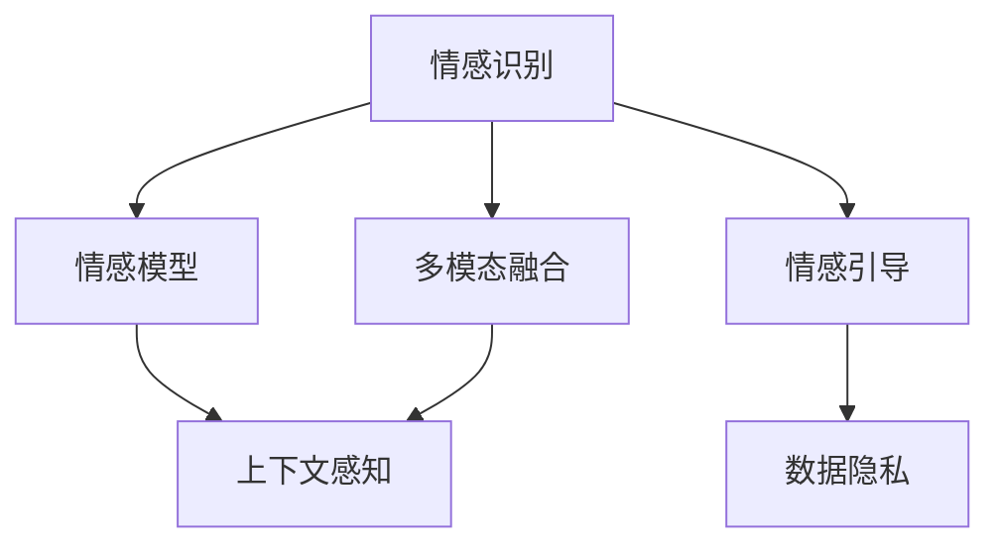

                 

# 数字化情绪:元宇宙中的情感管理

## 1. 背景介绍

### 1.1 问题由来

随着虚拟现实（Virtual Reality, VR）、增强现实（Augmented Reality, AR）、和Web3等技术的发展，人类开始进入元宇宙（Metaverse）时代。在这一数字化世界里，人们不仅可以沉浸在虚拟环境中，还能进行各种社交、工作、娱乐活动，虚拟与现实的界限愈发模糊。然而，元宇宙带来的不只有便利和自由，也伴随着新的人际关系和复杂的情感挑战。

在传统的物理世界，我们能够直观地通过面部表情、身体语言和语言声调等自然方式表达和感知情感。但在元宇宙中，数字化屏幕上的文字、图片和动画，往往难以准确传达细微的情感变化。加之网络交往的匿名性、互动的异步性，人与人之间的情感理解可能更加困难。因此，如何提升元宇宙用户的情感体验，变得尤为重要。

### 1.2 问题核心关键点

数字化情绪管理的核心，在于利用人工智能技术，理解和预测用户的情感状态，从而在虚拟环境中提供更加自然、人性化的交互体验。具体问题包括：

- 用户情感识别：如何从文本、语音、视频等数据中准确识别用户的情感状态？
- 情感模型训练：如何构建有效的情感识别模型，确保模型的泛化能力和鲁棒性？
- 情感适应性：如何在不同的交互场景中，动态调整情感识别策略，适应用户的多样化需求？
- 情感引导策略：如何设计情感引导策略，优化用户情感体验？
- 情感数据隐私：如何在保护用户隐私的前提下，有效收集和利用情感数据？

## 2. 核心概念与联系

### 2.1 核心概念概述

为更好地理解元宇宙中的数字化情绪管理，本节将介绍几个密切相关的核心概念：

- 情感识别（Emotion Recognition）：通过分析文本、语音、视频等数据，识别用户的情感状态。常见的情感识别方法包括文本情感分析、语音情感识别、面部表情识别等。
- 情感模型（Emotion Model）：基于深度学习等技术构建的情感识别模型，能够从输入数据中学习情感特征，输出情感类别。
- 多模态融合（Multimodal Fusion）：将不同模态的数据融合在一起，提升情感识别的准确性和鲁棒性。
- 上下文感知（Context-Awareness）：在情感识别中，考虑上下文信息（如用户历史交互、场景变化等），以提高情感识别的准确性和适应性。
- 情感引导（Emotion Guidance）：利用情感模型预测用户的情感状态，设计合理的交互策略，引导用户产生积极情感，提升用户体验。
- 数据隐私（Data Privacy）：在情感识别和处理过程中，保护用户的隐私数据，避免滥用和泄露。

这些概念之间的逻辑关系可以通过以下Mermaid流程图来展示：



这个流程图展示了大规模语言模型微调的情感识别流程：

1. 首先，从不同模态（如文本、语音、视频）获取用户数据。
2. 通过多模态融合技术，将不同模态的数据融合，提高情感识别的准确性。
3. 使用上下文感知技术，考虑用户的历史交互、场景变化等背景信息，提升情感识别的适应性。
4. 构建情感模型，对融合后的数据进行训练，预测用户的情感状态。
5. 根据情感模型的预测结果，设计情感引导策略，优化用户体验。
6. 在情感引导过程中，重视用户数据隐私保护，避免隐私泄露。

## 3. 核心算法原理 & 具体操作步骤
### 3.1 算法原理概述

元宇宙中的数字化情绪管理，主要依赖于人工智能技术，通过情感识别、情感模型训练、多模态融合等手段，实现对用户情感状态的准确预测和动态引导。以下详细阐述相关算法原理：

- **情感识别算法**：从文本、语音、视频等数据中提取特征，使用深度学习模型进行情感分类。常用方法包括卷积神经网络（CNN）、循环神经网络（RNN）、长短期记忆网络（LSTM）和Transformer等。
- **情感模型训练算法**：利用标注数据训练情感分类模型，通过交叉熵损失函数和梯度下降优化算法，最小化模型预测误差。常见优化算法包括Adam、SGD等。
- **多模态融合算法**：将不同模态的特征信息融合，提高情感识别的准确性。常用方法包括特征拼接、加权融合等。
- **上下文感知算法**：考虑用户的历史交互、场景变化等因素，通过时间卷积网络（TCN）、注意力机制等，增强情感识别的适应性。
- **情感引导算法**：根据情感预测结果，设计合理交互策略，如自然语言处理（NLP）技术生成友好回复，增强用户互动体验。
- **数据隐私算法**：使用数据匿名化、差分隐私等技术，保护用户隐私，确保情感数据的安全使用。

### 3.2 算法步骤详解

以下是数字化情绪管理的详细操作步骤：

**Step 1: 数据采集与预处理**
- 从元宇宙平台收集用户的数据，如聊天记录、语音通话、面部表情等。
- 对数据进行清洗、标注，去除噪声和无关信息，确保数据的质量和可用性。

**Step 2: 特征提取与多模态融合**
- 使用自然语言处理技术（如BERT、GPT等）提取文本特征。
- 利用音频处理技术（如MFCC）提取语音特征。
- 通过计算机视觉技术（如CNN、RCNN等）提取视频特征。
- 将不同模态的特征信息进行拼接或加权融合，提升情感识别的准确性。

**Step 3: 情感模型训练**
- 选择适合的深度学习模型，如LSTM、GRU等，构建情感分类模型。
- 利用标注数据进行模型训练，设置合适的超参数，如学习率、迭代次数等。
- 使用交叉熵损失函数和优化算法（如Adam、SGD等）进行模型优化。

**Step 4: 上下文感知与动态引导**
- 在情感识别过程中，考虑用户的历史交互、场景变化等上下文信息，增强情感识别的适应性。
- 设计合理的情感引导策略，如根据情感状态生成友好回复，优化用户体验。

**Step 5: 数据隐私保护**
- 对用户数据进行匿名化处理，避免数据泄露和滥用。
- 使用差分隐私等技术，确保情感数据的安全使用。

**Step 6: 模型评估与优化**
- 在测试数据集上评估情感模型的性能，如准确率、召回率、F1-score等。
- 根据评估结果，优化模型结构和超参数，提升情感识别的准确性和鲁棒性。

### 3.3 算法优缺点

数字化情绪管理的优点包括：

- 准确性高：利用深度学习技术，能够从多模态数据中准确识别用户情感。
- 鲁棒性好：考虑上下文信息，适应不同场景和用户需求。
- 实时性强：结合Web3技术，实现实时情感识别和动态引导，提升用户体验。

缺点则主要体现在：

- 数据需求大：需要大量的标注数据进行模型训练，获取高质量标注数据的成本较高。
- 计算资源高：深度学习模型计算复杂度高，需要高性能硬件支持。
- 隐私风险高：用户数据隐私保护难度大，需严格控制数据使用范围。

### 3.4 算法应用领域

数字化情绪管理技术在元宇宙中具有广泛的应用前景，具体包括：

- **虚拟社交**：在虚拟社交平台上，通过情感识别和动态引导，提升用户的互动体验和社交质量。
- **虚拟客服**：在虚拟客服系统中，通过情感识别和自然语言处理技术，提高用户满意度和服务效率。
- **虚拟教育**：在虚拟教育平台上，通过情感识别和个性化推荐，优化学习体验和教学效果。
- **虚拟旅游**：在虚拟旅游应用中，通过情感识别和情感引导，提供个性化的旅行建议和服务。

此外，数字化情绪管理还广泛应用于虚拟医疗、虚拟娱乐、虚拟商业等领域，为元宇宙用户提供更加自然、人性化的体验。

## 4. 数学模型和公式 & 详细讲解  
### 4.1 数学模型构建

以下是数字化情绪管理的数学模型构建：

假设用户情感状态为 $y \in \{1,2,...,k\}$，其中 $1$ 表示正面情感，$2$ 表示中性情感，$k$ 表示负面情感。给定用户输入 $x$，情感分类模型 $f(x)$ 预测情感状态 $y$，则情感识别的损失函数为：

$$
L(y, f(x)) = -\log f(y|x)
$$

其中 $f(y|x)$ 为模型在输入 $x$ 下，输出 $y$ 的概率。

假设使用深度学习模型进行情感分类，则模型的输出为 $h(x) \in \mathbb{R}^k$，对应每个情感类别的概率分布。情感分类模型的损失函数为：

$$
L = -\sum_{i=1}^k y_i \log \frac{\exp h_i(x)}{\sum_{j=1}^k \exp h_j(x)}
$$

其中 $h_i(x)$ 为输入 $x$ 在模型 $f$ 下，输出情感类别 $i$ 的概率。

### 4.2 公式推导过程

以下是情感模型训练的公式推导：

根据最大似然估计原理，情感模型的目标是最小化损失函数 $L$，即：

$$
\min_{\theta} L(y, f(x))
$$

其中 $\theta$ 为模型的参数。通过梯度下降等优化算法，最小化损失函数，更新模型参数。具体公式为：

$$
\theta \leftarrow \theta - \eta \nabla_{\theta} L(y, f(x))
$$

其中 $\eta$ 为学习率，$\nabla_{\theta} L(y, f(x))$ 为损失函数对模型参数的梯度，可通过反向传播算法高效计算。

在训练过程中，还需要考虑正则化技术（如L2正则、Dropout等），以防止模型过拟合。同时，为了提高情感识别的准确性和鲁棒性，可以引入多模态融合和上下文感知技术，对输入数据进行处理。

### 4.3 案例分析与讲解

以情感识别为例，假设输入 $x$ 为一段文本，情感分类模型 $f$ 为BERT模型，情感状态 $y$ 为正面情感。在训练过程中，使用标注数据 $(x_1, y_1), (x_2, y_2), ..., (x_N, y_N)$ 进行训练，损失函数为：

$$
L = -\sum_{i=1}^N y_i \log f(y_i|x_i)
$$

使用交叉熵损失函数和梯度下降算法进行优化：

$$
\theta \leftarrow \theta - \eta \nabla_{\theta} L
$$

在测试阶段，对于新的输入 $x$，模型预测情感状态 $y'$：

$$
y' = \arg\max_{i=1,...,k} f_i(x)
$$

其中 $f_i(x)$ 为输入 $x$ 在模型 $f$ 下，输出情感类别 $i$ 的概率。

## 5. 项目实践：代码实例和详细解释说明
### 5.1 开发环境搭建

在进行数字化情绪管理实践前，我们需要准备好开发环境。以下是使用Python进行PyTorch开发的环境配置流程：

1. 安装Anaconda：从官网下载并安装Anaconda，用于创建独立的Python环境。

2. 创建并激活虚拟环境：
```bash
conda create -n pytorch-env python=3.8 
conda activate pytorch-env
```

3. 安装PyTorch：根据CUDA版本，从官网获取对应的安装命令。例如：
```bash
conda install pytorch torchvision torchaudio cudatoolkit=11.1 -c pytorch -c conda-forge
```

4. 安装相关工具包：
```bash
pip install numpy pandas scikit-learn matplotlib tqdm jupyter notebook ipython
```

完成上述步骤后，即可在`pytorch-env`环境中开始项目实践。

### 5.2 源代码详细实现

这里我们以文本情感分类为例，给出使用PyTorch进行情感分类的完整代码实现。

首先，定义情感分类任务的数据处理函数：

```python
import torch
from torch.utils.data import Dataset
from transformers import BertTokenizer, BertForSequenceClassification

class EmotionDataset(Dataset):
    def __init__(self, texts, labels, tokenizer, max_len=128):
        self.texts = texts
        self.labels = labels
        self.tokenizer = tokenizer
        self.max_len = max_len
        
    def __len__(self):
        return len(self.texts)
    
    def __getitem__(self, item):
        text = self.texts[item]
        label = self.labels[item]
        
        encoding = self.tokenizer(text, return_tensors='pt', max_length=self.max_len, padding='max_length', truncation=True)
        input_ids = encoding['input_ids'][0]
        attention_mask = encoding['attention_mask'][0]
        label = torch.tensor(label, dtype=torch.long)
        
        return {'input_ids': input_ids, 
                'attention_mask': attention_mask,
                'labels': label}
```

然后，定义模型和优化器：

```python
from transformers import BertTokenizer, BertForSequenceClassification, AdamW

tokenizer = BertTokenizer.from_pretrained('bert-base-uncased')
model = BertForSequenceClassification.from_pretrained('bert-base-uncased', num_labels=3)

optimizer = AdamW(model.parameters(), lr=2e-5)
```

接着，定义训练和评估函数：

```python
from torch.utils.data import DataLoader
from tqdm import tqdm
from sklearn.metrics import accuracy_score, precision_score, recall_score, f1_score

device = torch.device('cuda') if torch.cuda.is_available() else torch.device('cpu')
model.to(device)

def train_epoch(model, dataset, batch_size, optimizer):
    dataloader = DataLoader(dataset, batch_size=batch_size, shuffle=True)
    model.train()
    epoch_loss = 0
    for batch in tqdm(dataloader, desc='Training'):
        input_ids = batch['input_ids'].to(device)
        attention_mask = batch['attention_mask'].to(device)
        labels = batch['labels'].to(device)
        model.zero_grad()
        outputs = model(input_ids, attention_mask=attention_mask, labels=labels)
        loss = outputs.loss
        epoch_loss += loss.item()
        loss.backward()
        optimizer.step()
    return epoch_loss / len(dataloader)

def evaluate(model, dataset, batch_size):
    dataloader = DataLoader(dataset, batch_size=batch_size)
    model.eval()
    preds, labels = [], []
    with torch.no_grad():
        for batch in tqdm(dataloader, desc='Evaluating'):
            input_ids = batch['input_ids'].to(device)
            attention_mask = batch['attention_mask'].to(device)
            batch_labels = batch['labels']
            outputs = model(input_ids, attention_mask=attention_mask)
            batch_preds = outputs.logits.argmax(dim=2).to('cpu').tolist()
            batch_labels = batch_labels.to('cpu').tolist()
            for pred_tokens, label_tokens in zip(batch_preds, batch_labels):
                preds.append(pred_tokens[:len(label_tokens)])
                labels.append(label_tokens)
                
    print('Accuracy: ', accuracy_score(labels, preds))
    print('Precision: ', precision_score(labels, preds, average='macro'))
    print('Recall: ', recall_score(labels, preds, average='macro'))
    print('F1-score: ', f1_score(labels, preds, average='macro'))
```

最后，启动训练流程并在测试集上评估：

```python
epochs = 5
batch_size = 16

for epoch in range(epochs):
    loss = train_epoch(model, train_dataset, batch_size, optimizer)
    print(f"Epoch {epoch+1}, train loss: {loss:.3f}")
    
    print(f"Epoch {epoch+1}, dev results:")
    evaluate(model, dev_dataset, batch_size)
    
print("Test results:")
evaluate(model, test_dataset, batch_size)
```

以上就是使用PyTorch对BERT进行情感分类的完整代码实现。可以看到，得益于Transformers库的强大封装，我们可以用相对简洁的代码完成BERT模型的加载和训练。

### 5.3 代码解读与分析

让我们再详细解读一下关键代码的实现细节：

**EmotionDataset类**：
- `__init__`方法：初始化文本、标签、分词器等关键组件。
- `__len__`方法：返回数据集的样本数量。
- `__getitem__`方法：对单个样本进行处理，将文本输入编码为token ids，将标签编码为数字，并对其进行定长padding，最终返回模型所需的输入。

**训练和评估函数**：
- 使用PyTorch的DataLoader对数据集进行批次化加载，供模型训练和推理使用。
- 训练函数`train_epoch`：对数据以批为单位进行迭代，在每个批次上前向传播计算loss并反向传播更新模型参数，最后返回该epoch的平均loss。
- 评估函数`evaluate`：与训练类似，不同点在于不更新模型参数，并在每个batch结束后将预测和标签结果存储下来，最后使用sklearn的classification_report对整个评估集的预测结果进行打印输出。

**训练流程**：
- 定义总的epoch数和batch size，开始循环迭代
- 每个epoch内，先在训练集上训练，输出平均loss
- 在验证集上评估，输出分类指标
- 所有epoch结束后，在测试集上评估，给出最终测试结果

可以看到，PyTorch配合Transformers库使得BERT情感分类的代码实现变得简洁高效。开发者可以将更多精力放在数据处理、模型改进等高层逻辑上，而不必过多关注底层的实现细节。

当然，工业级的系统实现还需考虑更多因素，如模型的保存和部署、超参数的自动搜索、更灵活的任务适配层等。但核心的情感识别流程基本与此类似。

## 6. 实际应用场景
### 6.1 虚拟社交平台

在虚拟社交平台上，数字化情绪管理具有重要应用价值。通过情感识别和动态引导，可以提升用户的互动体验和社交质量。具体应用场景包括：

- **情绪监测与干预**：通过实时监测用户的聊天记录、表情变化等，识别其情绪状态。一旦发现异常情绪（如沮丧、愤怒等），系统可以自动触发情绪干预机制，发送友好的回复或提供心理辅导。
- **智能推荐**：根据用户的历史交互和情感状态，推荐其感兴趣的内容和话题。情感状态较好的用户，可以优先推荐正向内容，提升用户体验。
- **社群管理**：通过分析社群中用户的情感变化，识别潜在矛盾和问题，及时进行干预和解决。例如，对于某些负面言论较多的社群，系统可以自动提醒管理员进行干预。

### 6.2 虚拟客服系统

在虚拟客服系统中，情感管理技术可以显著提升服务效率和用户满意度。具体应用场景包括：

- **情绪识别与响应**：通过分析用户输入的文本和语音，识别其情感状态，设计合理的回复策略。例如，对于情绪激动的用户，客服系统可以采用更温和的语言和语气进行回应。
- **情感引导与问题解决**：根据用户的历史交互和情感状态，设计个性化的客服方案。例如，对于情绪低落的客户，客服系统可以主动提供心理支持或转接至心理顾问。
- **系统优化与改进**：通过分析用户的情感反馈，不断优化客服系统的策略和流程，提高服务质量和用户满意度。

### 6.3 虚拟教育平台

在虚拟教育平台上，情感管理技术可以优化学习体验和教学效果。具体应用场景包括：

- **情感分析与反馈**：通过分析学生的作业、考试等数据，识别其情感状态和学习态度。例如，对于表现出负面情绪的学生，教师可以及时进行心理辅导。
- **个性化推荐**：根据学生的情感状态和学习需求，推荐合适的学习资源和课程。例如，对于情绪低落的学
生，可以推荐一些轻松愉悦的学习内容。
- **互动优化与效果评估**：通过情感分析，优化虚拟课堂的互动设计，提高教学效果。例如，对于情绪波动较大的学生，教师可以调整教学内容和方式，提升学生的学习体验。

### 6.4 未来应用展望

随着数字化情绪管理技术的不断进步，未来的应用场景将更加丰富和多样化。以下是一些未来展望：

- **情感计算与智能决策**：将情感数据与决策模型结合，进行更精准的智能决策。例如，在金融投资、医疗诊断等场景，通过情感分析辅助决策，提高决策的准确性和科学性。
- **情感增强与虚拟陪伴**：结合情感识别和自然语言生成技术，设计虚拟助手和陪伴机器人，提供个性化的情感支持和心理辅导。
- **情感驱动的创新创业**：在创业项目和产品设计中，融入情感计算技术，开发更加人性化的智能产品和应用。例如，智能家居系统可以根据用户的情绪状态，自动调节室内灯光和温度。
- **情感驱动的市场营销**：通过情感分析，优化市场营销策略，提高用户粘性和品牌忠诚度。例如，针对不同情感倾向的用户，设计不同的广告内容和推荐策略。

## 7. 工具和资源推荐
### 7.1 学习资源推荐

为了帮助开发者系统掌握数字化情绪管理的理论基础和实践技巧，这里推荐一些优质的学习资源：

1. 《深度学习理论与实践》系列博文：由深度学习领域专家撰写，深入浅出地介绍了深度学习的基础理论、模型架构和应用实践。

2. 《情感计算与人工智能》课程：斯坦福大学开设的情感计算课程，涵盖情感识别、情感计算等多个方面的内容，帮助理解情感计算的基本概念和前沿技术。

3. 《自然语言处理与情感分析》书籍：详细介绍了自然语言处理中的情感分析技术，包括文本情感分类、语音情感识别等。

4. HuggingFace官方文档：提供了丰富的情感识别模型资源，包括预训练模型和微调样例，是快速入门的必备资料。

5. 《机器学习实战》系列书籍：深入浅出地介绍了机器学习的基本概念和实践方法，帮助理解情感识别等NLP任务的实现。

通过对这些资源的学习实践，相信你一定能够快速掌握数字化情绪管理的精髓，并用于解决实际的NLP问题。

### 7.2 开发工具推荐

高效的开发离不开优秀的工具支持。以下是几款用于情感识别开发的常用工具：

1. PyTorch：基于Python的开源深度学习框架，灵活的动态计算图，适合快速迭代研究。大部分情感识别模型都有PyTorch版本的实现。

2. TensorFlow：由Google主导开发的开源深度学习框架，生产部署方便，适合大规模工程应用。同样有丰富的情感识别模型资源。

3. Transformers库：HuggingFace开发的NLP工具库，集成了众多预训练情感识别模型，支持PyTorch和TensorFlow，是进行情感识别任务开发的利器。

4. Weights & Biases：模型训练的实验跟踪工具，可以记录和可视化模型训练过程中的各项指标，方便对比和调优。与主流深度学习框架无缝集成。

5. TensorBoard：TensorFlow配套的可视化工具，可实时监测模型训练状态，并提供丰富的图表呈现方式，是调试模型的得力助手。

6. Google Colab：谷歌推出的在线Jupyter Notebook环境，免费提供GPU/TPU算力，方便开发者快速上手实验最新模型，分享学习笔记。

合理利用这些工具，可以显著提升情感识别任务的开发效率，加快创新迭代的步伐。

### 7.3 相关论文推荐

情感识别和数字化情绪管理技术的发展源于学界的持续研究。以下是几篇奠基性的相关论文，推荐阅读：

1. A Survey on Affective Computing and Human-Affective Interaction（情感计算综述）：综述了情感计算的研究现状和应用场景，为理解情感识别技术提供全面的视角。

2. Emotion Recognition: A Review（情感识别综述）：总结了情感识别技术的多种方法和应用，为研究者提供了全面的理论基础。

3. Emotion Analysis in Social Media（社交媒体情感分析）：介绍了社交媒体中的情感分析技术，分析了情感识别在社交媒体中的实际应用。

4. Sentiment Analysis and Social Media Use（社交媒体情感分析）：总结了社交媒体中的情感识别技术和应用，为情感识别技术的发展提供了新的思路。

5. Deep Learning for Sentiment Analysis（深度学习在情感分析中的应用）：介绍了深度学习技术在情感分析中的应用，包括情感分类、情感识别等任务。

这些论文代表了大规模语言模型微调的情感识别技术的发展脉络。通过学习这些前沿成果，可以帮助研究者把握学科前进方向，激发更多的创新灵感。

## 8. 总结：未来发展趋势与挑战

### 8.1 总结

本文对基于深度学习的数字化情绪管理方法进行了全面系统的介绍。首先阐述了元宇宙中情绪管理的背景和重要性，明确了情感识别和动态引导的核心问题。其次，从原理到实践，详细讲解了情感识别的数学模型和关键算法，给出了情感分类的完整代码实现。同时，本文还广泛探讨了情感识别在元宇宙中的应用场景，展示了数字化情绪管理技术的广阔前景。

通过本文的系统梳理，可以看到，基于深度学习的数字化情绪管理方法正在成为元宇宙中的重要技术，为用户的情感体验提供了新的可能。在虚拟世界中，情感识别和动态引导能够显著提升用户体验，带来更加自然、人性化的互动体验。

### 8.2 未来发展趋势

展望未来，数字化情绪管理技术将呈现以下几个发展趋势：

1. **多模态融合**：将文本、语音、视频等多种模态的数据融合，提升情感识别的准确性和鲁棒性。多模态融合技术将进一步普及，成为情感识别的标准范式。

2. **上下文感知**：在情感识别中，考虑用户的历史交互、场景变化等上下文信息，增强情感识别的适应性和准确性。上下文感知技术将进一步发展，提高情感识别的泛化能力。

3. **实时性和交互性**：利用Web3技术，实现实时情感识别和动态引导，提升用户的互动体验和满意度。实时性和交互性将进一步提升，成为情感管理技术的关键指标。

4. **个性化与情感驱动**：结合情感识别和自然语言生成技术，设计虚拟助手和陪伴机器人，提供个性化的情感支持和心理辅导。个性化与情感驱动技术将进一步发展，带来更加人性化的用户体验。

5. **跨领域应用**：将情感识别技术应用于金融、医疗、教育、营销等多个领域，提升各行业的决策效率和服务质量。跨领域应用将进一步拓展，推动情感识别技术的普及和应用。

6. **伦理与安全**：在情感识别和处理过程中，重视用户数据隐私保护，避免滥用和泄露。伦理与安全技术将进一步加强，确保情感识别技术的安全性和可靠性。

以上趋势凸显了数字化情绪管理技术的广阔前景。这些方向的探索发展，必将进一步提升元宇宙用户的情感体验，推动人工智能技术在各行各业的深入应用。

### 8.3 面临的挑战

尽管数字化情绪管理技术已经取得了瞩目成就，但在迈向更加智能化、普适化应用的过程中，它仍面临着诸多挑战：

1. **数据需求大**：需要大量的标注数据进行模型训练，获取高质量标注数据的成本较高。如何降低数据获取成本，提高标注数据质量，仍需进一步研究。

2. **计算资源高**：深度学习模型计算复杂度高，需要高性能硬件支持。如何降低计算资源消耗，提高模型训练和推理效率，还需要进一步优化。

3. **隐私风险高**：用户数据隐私保护难度大，需严格控制数据使用范围。如何在确保隐私保护的同时，利用情感数据提升用户体验，仍需进一步探索。

4. **模型鲁棒性差**：情感识别模型面对域外数据时，泛化性能往往大打折扣。如何在不同场景中保持模型的鲁棒性和泛化能力，仍需进一步研究。

5. **算法复杂度高**：情感识别算法复杂度高，需要精细调参。如何在保证准确性的同时，提高模型的泛化能力和鲁棒性，仍需进一步优化。

6. **应用场景多样**：不同领域的应用场景各异，需针对具体应用场景进行模型优化。如何在多种场景中保持模型的性能和稳定性，仍需进一步研究。

这些挑战凸显了数字化情绪管理技术的复杂性和多样性。唯有从数据、算法、工程、业务等多个维度协同发力，才能真正实现情感识别技术的落地应用。

### 8.4 研究展望

面对数字化情绪管理所面临的种种挑战，未来的研究需要在以下几个方面寻求新的突破：

1. **少样本学习**：在标注数据不足的情况下，利用迁移学习、自监督学习等方法，提高情感识别的准确性和泛化能力。

2. **参数高效优化**：开发更加参数高效的情感识别方法，在固定大部分模型参数的情况下，只调整少量情感分类器。

3. **对抗攻击防御**：通过对抗训练等方法，增强情感识别模型的鲁棒性和泛化能力，避免对抗攻击的影响。

4. **情感计算与智能决策**：将情感数据与决策模型结合，进行更精准的智能决策。例如，在金融投资、医疗诊断等场景，通过情感分析辅助决策，提高决策的准确性和科学性。

5. **情感增强与虚拟陪伴**：结合情感识别和自然语言生成技术，设计虚拟助手和陪伴机器人，提供个性化的情感支持和心理辅导。

6. **情感驱动的创新创业**：在创业项目和产品设计中，融入情感计算技术，开发更加人性化的智能产品和应用。例如，智能家居系统可以根据用户的情绪状态，自动调节室内灯光和温度。

这些研究方向将推动情感识别技术的发展，为元宇宙用户带来更加自然、人性化的情感体验，推动人工智能技术的广泛应用。

## 9. 附录：常见问题与解答

**Q1：情感识别技术在元宇宙中能否实现实时性？**

A: 基于深度学习的情感识别技术，通常需要较长的模型推理时间。要实现实时情感识别，需要采用一些优化方法，如模型裁剪、量化加速、模型并行等。此外，利用Web3技术，可以实现分布式训练和推理，进一步提升实时性。

**Q2：情感识别技术对标注数据的依赖程度高吗？**

A: 情感识别技术对标注数据的依赖较高。需要大量的标注数据进行模型训练，获取高质量标注数据的成本较高。可以通过半监督学习、主动学习等方法，减少对标注数据的依赖，提高模型的泛化能力。

**Q3：如何保护用户隐私数据？**

A: 在情感识别和处理过程中，重视用户数据隐私保护，避免滥用和泄露。可以通过数据匿名化、差分隐私等技术，保护用户隐私数据。同时，严格控制数据的使用范围，确保用户数据的安全。

**Q4：情感识别技术的鲁棒性如何提升？**

A: 情感识别技术的鲁棒性可以通过以下方法提升：

1. 引入对抗训练技术，增强模型的鲁棒性和泛化能力。
2. 结合上下文信息，提高模型的泛化能力。
3. 采用多模态融合技术，提升模型的鲁棒性。

**Q5：情感识别技术在实际应用中有什么局限性？**

A: 情感识别技术在实际应用中存在以下局限性：

1. 数据需求大，获取高质量标注数据的成本较高。
2. 计算资源高，需要高性能硬件支持。
3. 隐私风险高，用户数据隐私保护难度大。
4. 模型鲁棒性差，面对域外数据时泛化性能有限。

以上局限性需要通过不断的技术创新和优化，逐步克服。

---

作者：禅与计算机程序设计艺术 / Zen and the Art of Computer Programming

