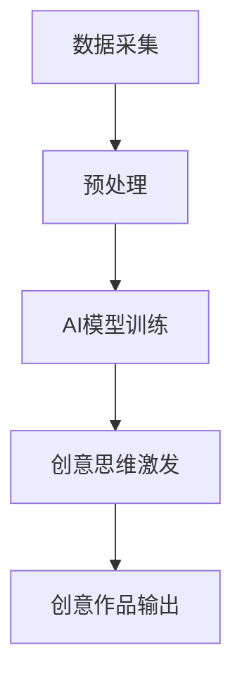

                 

# 数字化想象力：AI激发的创意思维

## 1. 背景介绍

### 1.1 问题由来
随着人工智能（AI）技术的迅猛发展，其在各个领域的应用已经显现出显著的变革效应。特别是在创意思维领域，AI技术已经开始从边缘走向核心，成为驱动创意产业发展的强大引擎。从自动绘画到自然语言生成，从音乐创作到诗歌创作，AI正在以一种全新的方式重塑我们的创意思维模式。数字化想象力，这一新兴概念正成为这场变革的代名词。

### 1.2 问题核心关键点
数字化想象力的核心在于如何利用AI技术，激发和引导人类的创意思维。其关键点包括：
1. **数据驱动创意**：AI通过对大规模数据的学习，能够发现人类难以察觉的模式和趋势，从而提供新的创意灵感。
2. **协同创作**：AI不仅能够独立创作，更能够与人类创作者进行深度协同，共同完成复杂创意作品。
3. **跨界融合**：AI技术能够跨越多个领域，将不同领域的知识和技术进行融合，创造出全新的创意作品。

### 1.3 问题研究意义
研究AI激发的创意思维，对于理解AI技术的潜力、促进创意产业的发展、推动跨学科融合具有重要意义。数字化想象力不仅能提升创意思维的质量和效率，还能激发人类更多新的创新点，为未来的创新发展奠定基础。

## 2. 核心概念与联系

### 2.1 核心概念概述

要深入理解数字化想象力，首先需要明确几个核心概念：

- **人工智能（AI）**：指利用计算机模拟人类的智能行为，包括感知、学习、推理、决策等能力。AI技术的应用范围广泛，涵盖了从自动驾驶到自然语言处理等多个领域。
- **创意思维**：指在创新过程中，利用已有的知识和经验，产生新的想法、解决方案和创意产品的思维过程。
- **数字化想象力**：指利用数字化技术和AI工具，激发和扩展人类的创意思维，使创意过程更加高效、多元、创新。

这些概念之间存在紧密的联系。AI技术通过分析大量的数据，发现其中的规律和模式，为创意思维提供了新的灵感和方向。数字化想象力则进一步将AI技术应用于创意过程，使创意的产出变得更加高效和多元。

### 2.2 核心概念原理和架构的 Mermaid 流程图



这个流程图展示了数字化想象力的基本工作流程：首先，通过数据采集和预处理，获取高质量的数据集；然后，利用AI模型训练，发现数据中的模式和规律；最后，通过创意思维激发，生成新的创意作品，并通过输出展示。

## 3. 核心算法原理 & 具体操作步骤
### 3.1 算法原理概述

数字化想象力涉及的算法主要包括数据处理、AI模型训练和创意激发三部分。其中，AI模型训练是核心，通过训练AI模型，可以从数据中提取出创意的元素，用于后续的创意激发。

### 3.2 算法步骤详解

#### 3.2.1 数据采集与预处理
数据采集是数字化想象力的第一步，需要从各种渠道获取创意相关的数据。预处理则是通过清洗、标注等手段，提高数据质量，使其适合AI模型的训练。

#### 3.2.2 AI模型训练
AI模型的训练分为两个阶段：监督学习和无监督学习。监督学习是通过标注数据集训练模型，使其能够识别特定的模式和规律。无监督学习则是通过未标注数据，发现数据中的内在结构和联系。在创意激发中，通常采用无监督学习，以发现数据中的新颖模式。

#### 3.2.3 创意激发与生成
创意激发是通过AI模型对数据的分析和处理，发现新的创意点。创意生成则是基于这些点，结合人类的创意能力，生成新的创意作品。这一过程可能需要多次迭代，不断优化和调整。

### 3.3 算法优缺点

数字化想象力的算法优点包括：
1. **高效性**：通过数据驱动的方式，AI可以快速发现数据中的模式和规律，激发新的创意点。
2. **多元性**：AI模型能够跨越多个领域，将不同领域的知识和技术进行融合，生成多元化的创意作品。
3. **创新性**：AI能够发现人类难以察觉的模式和趋势，提供新的创意灵感。

其缺点则包括：
1. **依赖高质量数据**：AI模型的性能高度依赖数据的质量和数量，数据质量差或数量不足会影响创意激发的效果。
2. **缺乏人类情感**：AI模型虽然可以生成创意，但缺乏人类的情感和主观判断，可能影响创意的深度和温度。
3. **模型偏见**：AI模型可能继承数据中的偏见，导致创意作品缺乏公正性。

### 3.4 算法应用领域

数字化想象力在多个领域都有广泛的应用，包括但不限于：

- **广告创意**：通过分析消费者数据，AI可以生成个性化的广告创意，提高广告效果。
- **艺术创作**：AI可以帮助艺术家发现新的创作灵感，甚至独立创作出具有创新性的艺术作品。
- **设计创新**：AI可以分析市场趋势和用户反馈，辅助设计师进行产品设计和创新。
- **音乐创作**：AI可以生成新的音乐旋律和节奏，甚至创作出全新的音乐作品。
- **文学创作**：AI可以生成新的故事情节和人物设定，辅助作家进行小说创作。

## 4. 数学模型和公式 & 详细讲解 & 举例说明

### 4.1 数学模型构建

数字化想象力的数学模型主要涉及数据预处理、AI模型训练和创意生成三个部分。其中，数据预处理和创意生成的数学模型相对简单，而AI模型训练则相对复杂。

### 4.2 公式推导过程

#### 4.2.1 数据预处理
数据预处理的目的是提高数据质量，使其适合AI模型的训练。例如，文本数据需要进行分词、去停用词等预处理。假设有一个文本数据集 $\mathcal{D}=\{x_1, x_2, ..., x_N\}$，预处理后的文本表示为 $\mathcal{D'}=\{t_1, t_2, ..., t_M\}$，其中 $t_i$ 表示经过预处理后的文本。

#### 4.2.2 AI模型训练
AI模型的训练通常使用神经网络模型，例如卷积神经网络（CNN）、循环神经网络（RNN）和变分自编码器（VAE）等。以CNN为例，其训练过程可以表示为：

$$
\theta^* = \mathop{\arg\min}_{\theta} \mathcal{L}(\theta, \mathcal{D'})
$$

其中，$\theta$ 表示模型的参数，$\mathcal{L}$ 表示损失函数，$\mathcal{D'}$ 表示预处理后的数据集。

#### 4.2.3 创意激发与生成
创意激发和生成的过程较为复杂，通常需要结合AI模型和人类的创意能力。假设创意激发过程需要输入数据 $x$，生成创意 $y$，则可以表示为：

$$
y = f(x, \theta)
$$

其中，$f$ 表示创意激发函数，$\theta$ 表示模型的参数。

### 4.3 案例分析与讲解

以音乐创作为例，分析AI如何激发数字化想象力。

#### 4.3.1 数据采集
从各大音乐平台收集用户听歌数据，包括听歌时间、听歌频率、用户评分等。

#### 4.3.2 数据预处理
对收集到的数据进行清洗和标注，去除无效数据和噪声，标注用户对不同音乐的情感偏好。

#### 4.3.3 AI模型训练
使用神经网络模型（如RNN）训练情感识别模型，识别用户对音乐的情感偏好。

#### 4.3.4 创意激发与生成
结合情感识别模型和人类的创意能力，生成新的音乐作品。例如，可以生成一段具有特定情感的音乐片段，用于电影或广告的配乐。

## 5. 项目实践：代码实例和详细解释说明

### 5.1 开发环境搭建

在进行数字化想象力的项目实践前，需要搭建相应的开发环境。以下是使用Python进行TensorFlow开发的环境配置流程：

1. 安装Anaconda：从官网下载并安装Anaconda，用于创建独立的Python环境。

2. 创建并激活虚拟环境：
```bash
conda create -n tensorflow-env python=3.7 
conda activate tensorflow-env
```

3. 安装TensorFlow：根据CUDA版本，从官网获取对应的安装命令。例如：
```bash
conda install tensorflow==2.3.0 -c tensorflow
```

4. 安装TensorBoard：TensorFlow配套的可视化工具，可实时监测模型训练状态，并提供丰富的图表呈现方式。
```bash
pip install tensorboard
```

5. 安装其他所需库：
```bash
pip install numpy pandas scikit-learn matplotlib
```

完成上述步骤后，即可在`tensorflow-env`环境中开始项目实践。

### 5.2 源代码详细实现

以下是使用TensorFlow和Keras框架，对音乐情感识别模型进行训练的Python代码实现。

```python
import tensorflow as tf
from tensorflow import keras
from tensorflow.keras import layers
import numpy as np

# 定义音乐数据集
train_dataset = tf.data.Dataset.from_tensor_slices((x_train, y_train))
test_dataset = tf.data.Dataset.from_tensor_slices((x_test, y_test))

# 定义模型
model = keras.Sequential([
    layers.Embedding(input_dim=vocab_size, output_dim=embedding_dim),
    layers.LSTM(128),
    layers.Dense(1, activation='sigmoid')
])

# 编译模型
model.compile(optimizer='adam', loss='binary_crossentropy', metrics=['accuracy'])

# 训练模型
model.fit(train_dataset, epochs=10, validation_data=test_dataset)
```

### 5.3 代码解读与分析

让我们再详细解读一下关键代码的实现细节：

**音乐数据集定义**：
- `train_dataset`和`test_dataset`分别用于训练和测试数据集的定义，使用`tf.data.Dataset`创建。
- `x_train`和`x_test`表示音乐数据的文本表示，`y_train`和`y_test`表示对应的情感标签。

**模型定义**：
- 使用`keras.Sequential`创建模型，包含嵌入层、LSTM层和全连接层。
- 嵌入层用于将文本数据转换为向量表示，LSTM层用于提取文本特征，全连接层输出情感标签。

**模型编译和训练**：
- 使用`model.compile`编译模型，设置优化器、损失函数和评价指标。
- 使用`model.fit`训练模型，设置训练轮数和验证集。

### 5.4 运行结果展示

运行上述代码，可以得到音乐情感识别模型的训练结果，例如准确率、损失值等。可以通过TensorBoard查看模型训练的可视化结果，包括损失曲线、准确率曲线等。

## 6. 实际应用场景

### 6.1 广告创意

数字化想象力在广告创意领域有着广泛的应用。例如，通过分析用户数据，AI可以生成个性化的广告创意，提高广告效果。以下是一个基于用户行为数据的广告创意生成流程：

1. 收集用户行为数据，包括浏览网页、购买记录、点击广告等。
2. 对数据进行预处理，清洗无效数据，提取有用的特征。
3. 使用AI模型训练创意生成模型，生成个性化的广告创意。
4. 在广告投放平台上展示创意，并根据用户反馈进行调整。

### 6.2 艺术创作

数字化想象力在艺术创作中的应用，主要是通过分析艺术作品的风格和特点，生成新的创意作品。例如，分析梵高画作的色彩和构图特点，生成新的绘画作品。以下是一个基于梵高画作的数字化想象力创作流程：

1. 收集梵高画作的图像数据。
2. 对数据进行预处理，提取有用的特征，如颜色、构图等。
3. 使用AI模型训练创意生成模型，生成新的绘画作品。
4. 结合人类的创意能力，进行进一步的创作和优化。

### 6.3 设计创新

数字化想象力在产品设计和创新中，主要用于分析市场需求和用户反馈，辅助设计师进行设计决策。例如，通过分析用户的反馈数据，AI可以生成新的设计方案。以下是一个基于用户反馈的设计创新流程：

1. 收集用户的反馈数据，包括产品评价、使用体验等。
2. 对数据进行预处理，提取有用的特征，如用户满意度、功能需求等。
3. 使用AI模型训练设计优化模型，生成新的设计方案。
4. 结合设计师的创意能力，进行进一步的优化和调整。

### 6.4 未来应用展望

随着数字化想象力的不断演进，其在多个领域的应用前景将更加广阔。未来，数字化想象力可能会在以下几个方面取得新的突破：

1. **跨领域融合**：数字化想象力可以跨越多个领域，将不同领域的知识和技术进行融合，创造出全新的创意作品。例如，结合人工智能、大数据和物联网技术，开发智能家居系统。
2. **智能化协同**：AI不仅能够独立创作，更能够与人类创作者进行深度协同，共同完成复杂创意作品。例如，使用AI辅助电影制作，生成特效和场景。
3. **个性化定制**：数字化想象力可以生成个性化的创意作品，满足用户的个性化需求。例如，通过分析用户偏好，生成个性化的音乐播放列表。
4. **实时生成**：AI可以实时生成创意作品，应用于实时互动场景。例如，在社交媒体平台上，实时生成创意内容，增加用户的互动体验。
5. **自动化创作**：数字化想象力可以自动生成创意作品，应用于自动化创作场景。例如，自动生成新闻报道、广告文案等。

## 7. 工具和资源推荐

### 7.1 学习资源推荐

为了帮助开发者系统掌握数字化想象力的理论基础和实践技巧，这里推荐一些优质的学习资源：

1. 《Deep Learning》书籍：深度学习领域的经典教材，涵盖了从基础到高级的内容，适合入门和进阶学习。
2. 《AI超级大国：美国如何在人工智能竞赛中占据上风》：探讨了AI技术在全球竞争中的战略地位和发展趋势，有助于理解AI技术的广泛应用。
3. 《Python深度学习》：介绍Python在深度学习中的应用，包括TensorFlow、Keras等工具的使用。
4. Coursera和edX等在线课程平台，提供了大量关于AI和创意产业的课程，适合系统学习和实践。
5. Google AI实验室的研究论文，展示了AI在各个领域的前沿应用，具有很高的参考价值。

通过对这些资源的学习实践，相信你一定能够快速掌握数字化想象力的精髓，并用于解决实际的创意问题。

### 7.2 开发工具推荐

高效的开发离不开优秀的工具支持。以下是几款用于数字化想象力开发的常用工具：

1. TensorFlow：基于Python的开源深度学习框架，灵活动态的计算图，适合快速迭代研究。
2. Keras：高层次的深度学习API，易于使用，适合初学者快速上手。
3. Jupyter Notebook：交互式开发环境，支持Python、R等多种语言，适合数据探索和模型调试。
4. Visual Studio Code：功能强大的代码编辑器，支持多种语言和插件，适合开发复杂的创意应用。
5. Adobe Creative Suite：图形设计软件，可以用于创意作品的创作和编辑。

合理利用这些工具，可以显著提升数字化想象力任务的开发效率，加快创新迭代的步伐。

### 7.3 相关论文推荐

数字化想象力的研究源于学界的持续研究。以下是几篇奠基性的相关论文，推荐阅读：

1. GPT-3：展示了大规模语言模型的强大生成能力，可以用于生成创意文本。
2. StyleGAN：提出了生成对抗网络（GAN），可以用于生成具有创意风格的图片。
3. AutoML：提出了自动化机器学习技术，可以用于自动优化AI模型，提高创意生成效率。
4. Artist AI：展示了AI在艺术创作中的应用，可以生成具有创意特点的绘画和音乐作品。
5. Generative Adversarial Networks：深度学习领域的重要论文，介绍了GAN的基本原理和应用场景。

这些论文代表了大规模语言模型和AI在创意产业的应用，有助于理解数字化想象力的发展脉络。

## 8. 总结：未来发展趋势与挑战

### 8.1 总结

本文对数字化想象力进行了全面系统的介绍。首先阐述了数字化想象力的背景和意义，明确了AI技术在创意思维中的应用。其次，从原理到实践，详细讲解了数字化想象力的数学模型和操作步骤，给出了数字化想象力任务开发的完整代码实例。同时，本文还广泛探讨了数字化想象力在多个领域的应用前景，展示了数字化想象力的广泛应用。

通过本文的系统梳理，可以看到，数字化想象力正成为AI技术的重要应用方向，极大地拓展了创意产业的边界，带来了新的商业机会。未来，伴随AI技术的不断进步，数字化想象力必将在创意产业中发挥越来越重要的作用。

### 8.2 未来发展趋势

展望未来，数字化想象力将呈现以下几个发展趋势：

1. **技术融合**：数字化想象力将与更多技术进行融合，如物联网、云计算、区块链等，创造出更加多元化、智能化的创意产品。
2. **跨界合作**：创意产业将与更多行业进行跨界合作，如医疗、教育、旅游等，形成更加多样化的创意生态。
3. **自动化创作**：自动化创作技术将进一步发展，AI能够独立完成大部分创意工作，人类更多地参与创意的优化和调整。
4. **个性化服务**：个性化服务将成为创意产业的重要方向，通过分析用户数据，提供个性化的创意作品和服务。
5. **实时互动**：实时互动技术将进一步发展，AI能够实时生成创意内容，应用于社交媒体、虚拟现实等领域。

这些趋势将推动数字化想象力向更加智能化、普适化方向发展，带来更多的商业机遇和创新点。

### 8.3 面临的挑战

尽管数字化想象力已经取得了瞩目成就，但在迈向更加智能化、普适化应用的过程中，它仍面临着诸多挑战：

1. **数据隐私和安全**：创意数据通常涉及用户的隐私信息，如何保护数据隐私和安全，是数字化想象力发展的重要挑战。
2. **技术瓶颈**：AI技术在某些领域仍存在技术瓶颈，如自然语言理解、情感识别等，需要进一步研究改进。
3. **伦理和道德**：数字化想象力可能会涉及伦理和道德问题，如创意作品的版权归属、AI的创作责任等，需要建立相应的规范和标准。
4. **跨领域融合**：跨领域的融合需要解决不同领域之间的技术差异和协作问题，需要更多的跨学科合作和创新。
5. **创意质量控制**：如何保证创意作品的质量和创意能力，避免过度自动化导致的创意同质化，是需要进一步研究的问题。

这些挑战需要学界和业界共同努力，才能推动数字化想象力技术走向成熟，发挥其应有的潜力。

### 8.4 研究展望

面对数字化想象力面临的挑战，未来的研究需要在以下几个方面寻求新的突破：

1. **数据隐私保护**：研究新的数据隐私保护技术，确保创意数据的隐私和安全。
2. **技术创新**：开发新的AI技术，如自然语言生成、情感识别等，提升数字化想象力的创作能力。
3. **伦理和道德**：建立AI创作的伦理和道德规范，确保AI的创作行为符合人类价值观和伦理道德。
4. **跨领域融合**：研究跨领域的融合技术，解决不同领域之间的技术差异和协作问题。
5. **创意质量控制**：研究新的创意质量控制方法，避免过度自动化导致的创意同质化。

这些研究方向将引领数字化想象力技术向更高的台阶发展，为创意产业带来更多的创新和突破。

## 9. 附录：常见问题与解答

**Q1：什么是数字化想象力？**

A: 数字化想象力是指利用数字化技术和AI工具，激发和扩展人类的创意思维，使创意过程更加高效、多元、创新。

**Q2：数字化想象力如何应用在创意产业？**

A: 数字化想象力可以应用于广告创意、艺术创作、设计创新等多个领域。通过分析用户数据，生成个性化的创意作品，提高创意效果和效率。

**Q3：数字化想象力面临哪些挑战？**

A: 数字化想象力面临数据隐私、技术瓶颈、伦理和道德、跨领域融合、创意质量控制等挑战。

**Q4：未来数字化想象力有哪些发展趋势？**

A: 未来数字化想象力将向技术融合、跨界合作、自动化创作、个性化服务和实时互动方向发展。

**Q5：如何保护创意数据的隐私和安全？**

A: 保护创意数据的隐私和安全，需要研究新的数据隐私保护技术，如数据匿名化、差分隐私等，确保创意数据在传输和存储过程中的安全。

---

作者：禅与计算机程序设计艺术 / Zen and the Art of Computer Programming

