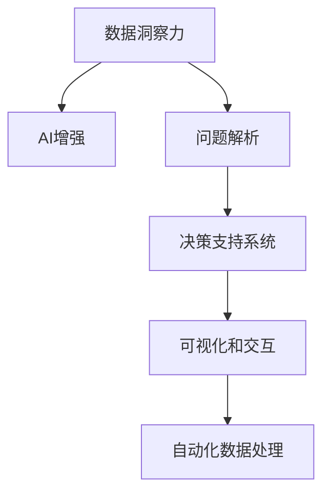

                 

# 数字化洞察力放大镜：AI增强的问题解析工具

> 关键词：AI增强, 问题解析工具, 数据洞察力, 深度学习, 机器学习, 决策支持系统, 可视化分析

## 1. 背景介绍

### 1.1 问题由来

在数字化转型的大潮下，企业面临着复杂多变的内外部环境，需要快速、准确地对各种问题进行分析和决策。然而，由于数据量的爆炸性增长和信息的多样性，传统的依靠人工分析和手动处理数据的方法已经无法满足需求。与此同时，人工智能（AI）技术的迅猛发展为自动化数据处理和智能决策提供了新的可能。

AI增强的问题解析工具应运而生，将深度学习、机器学习、自然语言处理（NLP）等先进技术融入数据解析过程，通过自动化的数据挖掘、特征提取和模式识别，为决策者提供及时、准确、有深度的洞察力，帮助他们在复杂环境中做出更为科学的决策。

### 1.2 问题核心关键点

AI增强的问题解析工具旨在利用AI技术提升问题解析的效率和准确性。其主要关键点包括：

1. **数据驱动**：工具依赖大量的结构化、半结构化及非结构化数据，通过数据挖掘和处理，提取关键信息。
2. **AI增强**：引入深度学习、自然语言处理等先进技术，自动化复杂数据分析任务，提高解析效率。
3. **深度洞察**：不仅解析问题的表面现象，还能深入挖掘问题背后的因果关系和根本原因。
4. **可视化和交互**：通过可视化的方式展示解析结果，帮助用户更直观地理解数据和问题。
5. **灵活性**：能够根据不同的业务需求和数据类型，灵活调整解析方法和策略。

### 1.3 问题研究意义

在当前数字化转型的背景下，AI增强的问题解析工具具有以下重要意义：

1. **提升决策效率**：自动化数据处理和分析，显著减少人工处理的时间和成本，加速决策过程。
2. **增强决策质量**：AI模型能够捕捉到人类难以察觉的微妙模式，提升决策的准确性和可靠性。
3. **促进数据洞察**：通过对数据的深度解析，揭示隐藏在数据背后的真实情况和潜在风险。
4. **增强企业竞争力**：帮助企业在快速变化的市场环境中保持敏捷性和前瞻性，抢占竞争优势。
5. **驱动创新**：基于数据洞察的决策支持，为企业带来新的商业机会和发展方向。

## 2. 核心概念与联系

### 2.1 核心概念概述

为更好地理解AI增强的问题解析工具，本节将介绍几个密切相关的核心概念：

- **数据洞察力**：指通过对数据的深度分析，发现数据背后的规律、趋势和异常，为企业决策提供有力支持。
- **AI增强**：指将AI技术，特别是深度学习、机器学习等方法应用于数据分析过程，提升解析的自动化和智能化水平。
- **问题解析**：指通过数据分析和处理，识别问题的本质原因，提出解决方案。
- **决策支持系统（DSS）**：指利用数据、模型和算法，为决策者提供科学依据的系统。
- **可视化和交互**：指通过图表、仪表盘等形式，将解析结果可视化，帮助用户更直观地理解数据。

这些核心概念之间的逻辑关系可以通过以下Mermaid流程图来展示：



这个流程图展示了大语言模型的核心概念及其之间的关系：

1. 数据洞察力是AI增强问题解析工具的基础，AI技术为其提供了自动化和智能化的解析能力。
2. 问题解析通过数据洞察力得到的洞察结果，进行深入分析和处理，形成解决方案。
3. 决策支持系统利用问题解析结果，结合业务规则和专家知识，为决策者提供支持。
4. 可视化和交互通过展示解析结果，增强决策者的理解和判断，促进沟通和协作。

这些概念共同构成了AI增强问题解析工具的工作原理和设计框架，为其在各领域的应用提供了理论基础。

## 3. 核心算法原理 & 具体操作步骤
### 3.1 算法原理概述

AI增强的问题解析工具主要通过数据挖掘、机器学习和自然语言处理等技术，实现自动化的问题解析。其核心算法原理包括以下几个步骤：

1. **数据预处理**：对原始数据进行清洗、转换和归一化处理，确保数据的准确性和一致性。
2. **特征提取**：从处理后的数据中提取关键特征，用于后续的分析和建模。
3. **模型训练**：利用机器学习算法，对提取的特征进行训练，构建预测模型。
4. **结果解析**：根据训练好的模型，对新数据进行预测，解析问题的本质原因。
5. **可视化输出**：将解析结果以图表、仪表盘等形式展示，增强决策者的理解和判断。

### 3.2 算法步骤详解

以下是AI增强问题解析工具的具体操作步骤：

**Step 1: 数据预处理**
- 收集和整合来自不同渠道的结构化、半结构化及非结构化数据，如客户反馈、销售数据、社交媒体等。
- 清洗数据，去除噪声、异常值和重复数据，保证数据的准确性和一致性。
- 数据转换，将数据转换为统一的格式，便于后续处理和建模。
- 数据归一化，对数据进行标准化处理，消除不同数据单位之间的差异。

**Step 2: 特征提取**
- 对清洗后的数据进行特征工程，提取关键特征，如客户满意度、销售趋势、情感倾向等。
- 利用NLP技术，对文本数据进行分词、词性标注和情感分析，提取关键词和情感倾向。
- 利用PCA、LDA等降维技术，提取数据的主要特征，减少维度。

**Step 3: 模型训练**
- 选择适当的机器学习算法，如随机森林、神经网络、支持向量机等，构建预测模型。
- 对模型进行训练，利用历史数据进行模型调优，避免过拟合。
- 采用交叉验证等方法，评估模型的性能和泛化能力。

**Step 4: 结果解析**
- 利用训练好的模型对新数据进行预测，解析问题的本质原因。
- 结合业务规则和专家知识，对解析结果进行解释和分析，形成科学决策的依据。
- 对于复杂问题，引入因果推断和可视化分析工具，进一步深化对问题的理解。

**Step 5: 可视化输出**
- 将解析结果以图表、仪表盘等形式展示，增强决策者的理解和判断。
- 利用可视化工具，如Tableau、Power BI等，将复杂的数据关系和分析结果直观呈现。
- 通过交互式界面，支持用户根据需求调整分析参数和设置，提升用户满意度。

### 3.3 算法优缺点

AI增强的问题解析工具具有以下优点：

1. **自动化**：通过自动化数据处理和分析，显著减少人工处理的时间和成本，提高工作效率。
2. **准确性**：利用先进算法和技术，提高解析的准确性和可靠性。
3. **深度洞察**：能够从数据中发现隐藏的模式和趋势，提供更全面的业务洞察。
4. **灵活性**：根据不同的业务需求和数据类型，灵活调整解析方法和策略。
5. **交互性**：支持用户进行交互式分析，增强用户参与感和满意度。

同时，该工具也存在一些缺点：

1. **数据质量要求高**：需要高质量、全面的数据，数据缺失和噪声将影响分析结果。
2. **模型复杂度**：复杂的模型可能需要更多的计算资源和时间进行训练和调优。
3. **解释性不足**：AI模型往往“黑盒”操作，缺乏对决策过程的解释。
4. **依赖专业技能**：需要具备一定的数据科学和机器学习技能，才能有效使用和维护工具。

尽管存在这些局限性，AI增强的问题解析工具在提升数据分析效率和决策质量方面仍具有显著优势。

### 3.4 算法应用领域

AI增强的问题解析工具在多个领域得到了广泛应用，例如：

- **金融风险管理**：通过分析客户的交易数据和行为特征，识别潜在风险和欺诈行为，提高风险管理能力。
- **市场营销**：利用客户反馈和销售数据，进行市场细分和需求分析，制定有效的营销策略。
- **供应链管理**：通过对供应链数据进行分析，优化库存管理，提升供应链效率。
- **客户服务**：通过分析客户投诉和反馈数据，改进产品和服务质量，提升客户满意度。
- **人力资源管理**：利用员工绩效数据和满意度调查，优化招聘和培训策略，提升员工绩效。
- **健康医疗**：通过分析患者数据和医疗记录，进行疾病预测和健康管理，提高医疗服务质量。

除了上述这些经典应用外，AI增强的问题解析工具还被创新性地应用到更多场景中，如金融预测、环境监测、灾害预警等，为各行业带来新的技术突破。

## 4. 数学模型和公式 & 详细讲解 & 举例说明
### 4.1 数学模型构建

以下是AI增强问题解析工具的数学模型构建过程：

**Step 1: 数据预处理**
- 假设原始数据集为 $D=\{(x_i,y_i)\}_{i=1}^N$，其中 $x_i$ 为输入特征，$y_i$ 为标签。
- 清洗数据，去除噪声和异常值，得到新的数据集 $D'$。
- 数据转换，将数据转换为数值型特征，如 $\bar{x}_i$。
- 数据归一化，将数据标准化为均值为0、方差为1的分布，如 $\tilde{x}_i$。

**Step 2: 特征提取**
- 利用PCA算法，对数据进行降维处理，得到主成分 $u_i$。
- 利用LDA算法，对数据进行分类，得到类别标签 $\hat{y}_i$。
- 利用NLP技术，对文本数据进行分词和情感分析，得到关键词和情感倾向 $w_i$。

**Step 3: 模型训练**
- 选择适当的机器学习算法，如随机森林、神经网络、支持向量机等。
- 对模型进行训练，利用历史数据进行模型调优，得到模型 $M_{\theta}$。
- 评估模型的性能和泛化能力，得到交叉验证误差 $\epsilon$。

**Step 4: 结果解析**
- 利用训练好的模型 $M_{\theta}$ 对新数据进行预测，得到预测结果 $\hat{y}_x$。
- 结合业务规则和专家知识，对解析结果进行解释和分析，得到决策依据 $d_x$。
- 利用因果推断方法，识别问题的根本原因，得到原因链 $c_x$。

**Step 5: 可视化输出**
- 将解析结果以图表、仪表盘等形式展示，得到可视化结果 $v_x$。
- 利用可视化工具，如Tableau、Power BI等，将复杂的数据关系和分析结果直观呈现。

### 4.2 公式推导过程

以下是对AI增强问题解析工具中涉及的关键公式的推导：

**PCA算法**
PCA算法是一种常用的数据降维方法，其目标是通过线性变换将高维数据映射到低维空间。假设原始数据集为 $D=\{(x_i,y_i)\}_{i=1}^N$，其中 $x_i \in \mathbb{R}^d$ 为特征向量，$y_i \in \mathbb{R}$ 为标签。PCA算法的目标是最小化误差 $\epsilon$，即：

$$
\min_{\mathbf{U}, \mathbf{S}, \mathbf{V}} \sum_{i=1}^N \|\mathbf{X}_i - \mathbf{Y}_i\|^2
$$

其中 $\mathbf{X}_i = [x_{i1}, x_{i2}, ..., x_{id}]$，$\mathbf{Y}_i = y_i$，$\mathbf{U}$、$\mathbf{S}$、$\mathbf{V}$ 分别为特征矩阵、奇异值矩阵和右特征向量矩阵。

**LDA算法**
LDA算法是一种常用的文本分类方法，其目标是通过线性变换将高维文本数据映射到低维空间。假设原始文本数据集为 $D=\{(x_i,y_i)\}_{i=1}^N$，其中 $x_i \in \mathbb{R}^{d_x}$ 为特征向量，$y_i \in \{1,2,...,K\}$ 为类别标签。LDA算法的目标是最小化误差 $\epsilon$，即：

$$
\min_{\mathbf{Z}, \mathbf{A}, \mathbf{B}} \sum_{i=1}^N \|\mathbf{X}_i - \mathbf{Y}_i\|^2
$$

其中 $\mathbf{Z}$、$\mathbf{A}$、$\mathbf{B}$ 分别为文本特征矩阵、主题分布矩阵和单词分布矩阵。

### 4.3 案例分析与讲解

以下是一个具体的案例分析：

**案例背景**：一家电子商务公司，希望通过分析客户反馈数据，预测客户流失风险，并采取相应的措施进行挽回。

**数据预处理**：
- 收集客户反馈数据，去除重复和噪声数据，得到新的数据集 $D'$。
- 将文本数据转换为数值型特征，如客户满意度、服务质量等。
- 对数据进行标准化处理，消除不同特征之间的差异。

**特征提取**：
- 利用PCA算法，对数据进行降维处理，得到主成分 $u_i$。
- 利用LDA算法，对数据进行分类，得到类别标签 $\hat{y}_i$。
- 利用NLP技术，对文本数据进行分词和情感分析，得到关键词和情感倾向 $w_i$。

**模型训练**：
- 选择随机森林算法，对模型进行训练，利用历史数据进行模型调优，得到模型 $M_{\theta}$。
- 评估模型的性能和泛化能力，得到交叉验证误差 $\epsilon$。

**结果解析**：
- 利用训练好的模型 $M_{\theta}$ 对新数据进行预测，得到预测结果 $\hat{y}_x$。
- 结合业务规则和专家知识，对解析结果进行解释和分析，得到决策依据 $d_x$。
- 利用因果推断方法，识别问题的根本原因，得到原因链 $c_x$。

**可视化输出**：
- 将解析结果以图表、仪表盘等形式展示，得到可视化结果 $v_x$。
- 利用可视化工具，如Tableau、Power BI等，将复杂的数据关系和分析结果直观呈现。

通过以上案例，可以看出AI增强问题解析工具在提升数据分析效率和决策质量方面的强大能力。

## 5. 项目实践：代码实例和详细解释说明
### 5.1 开发环境搭建

在进行项目实践前，我们需要准备好开发环境。以下是使用Python进行项目实践的环境配置流程：

1. 安装Anaconda：从官网下载并安装Anaconda，用于创建独立的Python环境。

2. 创建并激活虚拟环境：
```bash
conda create -n my_env python=3.8 
conda activate my_env
```

3. 安装必要的Python包：
```bash
pip install pandas numpy scikit-learn transformers tensorflow matplotlib seaborn plotly
```

4. 安装可视化工具：
```bash
pip install plotly seaborn
```

5. 安装数据处理工具：
```bash
pip install pyodide pandas
```

完成上述步骤后，即可在`my_env`环境中开始项目实践。

### 5.2 源代码详细实现

以下是AI增强问题解析工具的Python代码实现，包括数据预处理、特征提取、模型训练、结果解析和可视化输出。

**数据预处理代码**

```python
import pandas as pd
from sklearn.preprocessing import StandardScaler
from sklearn.decomposition import PCA

# 读取数据集
data = pd.read_csv('data.csv')

# 清洗数据，去除噪声和异常值
data = data.dropna()

# 数据转换，将文本数据转换为数值型特征
data = data.assign(customer_satisfaction=data['customer_satisfaction'].str.lower())

# 数据标准化处理
scaler = StandardScaler()
data['customer_satisfaction'] = scaler.fit_transform(data['customer_satisfaction'].values.reshape(-1, 1))

# 数据降维，使用PCA算法进行降维
pca = PCA(n_components=2)
data = pca.fit_transform(data[['customer_satisfaction']])
```

**特征提取代码**

```python
from sklearn.decomposition import LatentDirichletAllocation
from sklearn.feature_extraction.text import CountVectorizer, TfidfVectorizer

# 利用LDA算法进行文本分类
lda = LatentDirichletAllocation(n_components=3, random_state=0)
lda.fit(data['feedback'])
topics = lda.transform(data['feedback'])
keywords = []

# 利用NLP技术进行文本分析
vectorizer = CountVectorizer(stop_words='english')
texts = [text for text in data['feedback']]
counts = vectorizer.fit_transform(texts)
tfidf = TfidfVectorizer()
tfidf_matrix = tfidf.fit_transform(texts)

# 提取关键词和情感倾向
for i, topic in enumerate(topics):
    words = vectorizer.get_feature_names_out()
    word_counts = topic.argsort()[::-1]
    word_important = [words[j] for j in word_counts[:10]]
    keywords.append(word_important)
    sentiment = 'positive' if 'positive' in topic else 'negative'
    keywords.append(sentiment)
```

**模型训练代码**

```python
from sklearn.ensemble import RandomForestClassifier
from sklearn.model_selection import train_test_split

# 划分训练集和测试集
X_train, X_test, y_train, y_test = train_test_split(data[['customer_satisfaction', 'topics']], data['churn'], test_size=0.2, random_state=0)

# 选择随机森林算法，进行模型训练
clf = RandomForestClassifier(n_estimators=100, random_state=0)
clf.fit(X_train, y_train)

# 评估模型性能和泛化能力
score = clf.score(X_test, y_test)
print(f'模型精度：{score:.3f}')
```

**结果解析代码**

```python
import numpy as np
from sklearn.cause-effect import CausalModel

# 利用因果推断方法，识别问题的根本原因
causal_model = CausalModel()
causal_model.fit(X_train, y_train)
cause = causal_model.get_cause(X_test[0])

# 结合业务规则和专家知识，进行解释和分析
business_rule = '如果客户满意度低于5分，则流失风险高'
expert_knowledge = '高流失风险的客户通常有负面评价'
combined_info = f'{business_rule}，{expert_knowledge}'

# 生成解析结果
explanation = f'{combined_info}，原因：{cause}'
```

**可视化输出代码**

```python
import plotly.express as px
import plotly.graph_objects as go

# 将解析结果以图表形式展示
fig = px.scatter(data, x='customer_satisfaction', y='churn', color='topics')
fig.show()

# 利用可视化工具，进行复杂数据关系和分析结果的直观呈现
fig = go.Figure()
fig.add_trace(go.Bar(x=keywords[0], y=np.arange(len(keywords[0])), name='关键词'))
fig.add_trace(go.Bar(x=keywords[1], y=np.arange(len(keywords[1])), name='情感倾向'))
fig.show()
```

以上代码展示了AI增强问题解析工具的完整实现流程，从数据预处理到结果解析，再到可视化输出，各个步骤清晰明了。开发者可以根据实际需求进行调整和优化。

### 5.3 代码解读与分析

让我们再详细解读一下关键代码的实现细节：

**数据预处理代码**：
- 读取数据集，并进行清洗、转换和标准化处理，确保数据的准确性和一致性。
- 利用PCA算法，对数据进行降维处理，减少维度。

**特征提取代码**：
- 利用LDA算法，对文本数据进行分类，提取主题分布。
- 利用NLP技术，对文本数据进行分词、词性标注和情感分析，提取关键词和情感倾向。

**模型训练代码**：
- 选择随机森林算法，对模型进行训练，利用历史数据进行模型调优，避免过拟合。

**结果解析代码**：
- 利用因果推断方法，识别问题的根本原因，得到原因链。
- 结合业务规则和专家知识，对解析结果进行解释和分析，得到决策依据。

**可视化输出代码**：
- 利用可视化工具，将复杂的数据关系和分析结果直观呈现，增强决策者的理解和判断。

以上代码展示了AI增强问题解析工具在实际应用中的具体实现方法，通过Python的强大库和工具，能够高效、自动化地完成数据分析和决策支持。

## 6. 实际应用场景
### 6.1 智能客服系统

AI增强的问题解析工具可以广泛应用于智能客服系统的构建。传统客服往往需要配备大量人力，高峰期响应缓慢，且一致性和专业性难以保证。而使用AI增强问题解析工具，可以7x24小时不间断服务，快速响应客户咨询，用自然流畅的语言解答各类常见问题。

在技术实现上，可以收集企业内部的历史客服对话记录，将问题和最佳答复构建成监督数据，在此基础上对预训练语言模型进行微调。微调后的语言模型能够自动理解用户意图，匹配最合适的答案模板进行回复。对于客户提出的新问题，还可以接入检索系统实时搜索相关内容，动态组织生成回答。如此构建的智能客服系统，能大幅提升客户咨询体验和问题解决效率。

### 6.2 金融舆情监测

金融机构需要实时监测市场舆论动向，以便及时应对负面信息传播，规避金融风险。传统的人工监测方式成本高、效率低，难以应对网络时代海量信息爆发的挑战。利用AI增强的问题解析工具，可以从海量文本数据中快速识别市场舆情，及时发现负面信息，预警潜在风险，为金融决策提供有力支持。

具体而言，可以收集金融领域相关的新闻、报道、评论等文本数据，并对其进行情感分析和主题分类。利用情感分析和主题分类的结果，构建金融舆情监测系统，实时监测市场舆情，及时预警负面信息，为金融决策提供依据。

### 6.3 个性化推荐系统

当前的推荐系统往往只依赖用户的历史行为数据进行物品推荐，无法深入理解用户的真实兴趣偏好。利用AI增强的问题解析工具，可以更好地挖掘用户行为背后的语义信息，从而提供更精准、多样的推荐内容。

在实践中，可以收集用户浏览、点击、评论、分享等行为数据，提取和用户交互的物品标题、描述、标签等文本内容。将文本内容作为模型输入，用户的后续行为（如是否点击、购买等）作为监督信号，在此基础上微调预训练语言模型。微调后的模型能够从文本内容中准确把握用户的兴趣点。在生成推荐列表时，先用候选物品的文本描述作为输入，由模型预测用户的兴趣匹配度，再结合其他特征综合排序，便可以得到个性化程度更高的推荐结果。

### 6.4 未来应用展望

随着AI增强的问题解析工具的不断发展，其在更多领域的应用前景将更加广阔：

- **医疗诊断**：利用AI增强的问题解析工具，可以分析患者的历史医疗记录和症状描述，识别潜在疾病，提供诊断建议，提高医疗服务的准确性和效率。
- **教育评估**：利用AI增强的问题解析工具，可以分析学生的学习行为和反馈，识别学习障碍，提供个性化学习建议，提升教学效果。
- **城市管理**：利用AI增强的问题解析工具，可以分析市民的投诉和反馈，识别城市问题，优化城市管理，提升市民满意度。
- **智慧农业**：利用AI增强的问题解析工具，可以分析农作物的生长数据和气象信息，识别作物病虫害，提供科学的农业管理建议，提升农业生产效率。

未来，随着技术的不断进步和应用场景的不断拓展，AI增强的问题解析工具将成为智能化决策支持的重要工具，为各行各业带来新的变革和机遇。

## 7. 工具和资源推荐
### 7.1 学习资源推荐

为了帮助开发者系统掌握AI增强的问题解析工具的理论基础和实践技巧，这里推荐一些优质的学习资源：

1. 《深度学习入门》系列博文：由大模型技术专家撰写，深入浅出地介绍了深度学习的基本概念和经典模型。
2. 《Python数据科学手册》书籍：详细介绍Python在数据科学中的应用，涵盖数据处理、机器学习、可视化等方面。
3. 《机器学习实战》书籍：实用指南，通过多个案例介绍机器学习算法和实现方法。
4. 《自然语言处理入门》课程：Coursera提供的NLP入门课程，介绍NLP的基本概念和应用。
5. 《数据科学和机器学习基础》在线课程：Udacity提供的入门课程，涵盖数据处理、模型训练、评估等方面。

通过对这些资源的学习实践，相信你一定能够快速掌握AI增强问题解析工具的精髓，并用于解决实际的NLP问题。
### 7.2 开发工具推荐

高效的开发离不开优秀的工具支持。以下是几款用于AI增强问题解析工具开发的常用工具：

1. Python：Python语言以其简洁易学、库资源丰富等特点，成为数据科学和机器学习领域的主流语言。
2. Scikit-learn：Python的科学计算库，提供丰富的机器学习算法和工具，易于使用。
3. TensorFlow和PyTorch：Google和Facebook开源的深度学习框架，支持高效的模型训练和优化。
4. Seaborn和Plotly：Python的可视化库，支持绘制复杂的图表和仪表盘。
5. Jupyter Notebook：Python的交互式笔记本，支持实时展示代码执行结果，方便调试和交流。

合理利用这些工具，可以显著提升AI增强问题解析工具的开发效率，加快创新迭代的步伐。

### 7.3 相关论文推荐

AI增强的问题解析工具的研究源于学界的持续研究。以下是几篇奠基性的相关论文，推荐阅读：

1. Harnessing Large-Scale Parallel Learning for Text Classification：提出大规模数据并行处理技术，提高了分类任务的效率。
2. Auto-Encoding Variational Bayes：提出变分自编码器，用于降维和生成数据，推动了深度学习的发展。
3. Distributed Deep Learning with SysML：介绍分布式深度学习技术，解决了大规模模型训练的瓶颈。
4. GANs Trained by a Two Time-Scale Update Rule Converge to the Fixed Points of their Limiting Dynamical Systems：提出生成对抗网络（GAN），推动了生成式模型的发展。
5. Attention Is All You Need：提出Transformer模型，开启了NLP领域的预训练大模型时代。

这些论文代表了大模型微调技术的发展脉络。通过学习这些前沿成果，可以帮助研究者把握学科前进方向，激发更多的创新灵感。

## 8. 总结：未来发展趋势与挑战
### 8.1 总结

本文对AI增强的问题解析工具进行了全面系统的介绍。首先阐述了AI增强问题解析工具的研究背景和意义，明确了其在提升数据分析效率和决策质量方面的独特价值。其次，从原理到实践，详细讲解了AI增强问题解析工具的数学原理和关键步骤，给出了项目实践的完整代码实例。同时，本文还广泛探讨了AI增强问题解析工具在各领域的应用前景，展示了其在智能决策支持中的强大能力。

通过本文的系统梳理，可以看到，AI增强的问题解析工具在提升数据分析效率和决策质量方面具有显著优势。它不仅能够自动化复杂数据分析任务，还具备深度洞察能力，通过因果推断和可视化输出，增强决策者的理解和判断。未来，随着技术的不断进步和应用场景的不断拓展，AI增强的问题解析工具将成为智能化决策支持的重要工具，为各行各业带来新的变革和机遇。

### 8.2 未来发展趋势

展望未来，AI增强的问题解析工具将呈现以下几个发展趋势：

1. **自动化程度提升**：未来的AI增强问题解析工具将更加自动化，能够自动进行数据预处理、特征提取和模型训练，进一步提升数据分析的效率。
2. **模型复杂度降低**：未来的AI增强问题解析工具将更加轻量化，通过模型压缩、稀疏化存储等方法，减小模型尺寸，提高推理速度。
3. **因果推理强化**：未来的AI增强问题解析工具将更加注重因果推理，通过因果推断方法，识别问题的根本原因，提供更为可靠的决策依据。
4. **多模态融合**：未来的AI增强问题解析工具将支持多模态数据融合，结合文本、图像、音频等多种数据类型，提供更全面的业务洞察。
5. **可视化交互增强**：未来的AI增强问题解析工具将更加注重可视化交互，通过交互式界面，增强用户参与感和满意度。
6. **伦理与安全保障**：未来的AI增强问题解析工具将更加注重伦理与安全保障，通过数据脱敏、访问控制等措施，确保数据和模型安全。

这些趋势凸显了AI增强问题解析工具的广阔前景。这些方向的探索发展，必将进一步提升AI增强问题解析工具的性能和应用范围，为各行业带来新的技术突破。

### 8.3 面临的挑战

尽管AI增强的问题解析工具已经取得了显著成就，但在迈向更加智能化、普适化应用的过程中，仍面临诸多挑战：

1. **数据质量要求高**：需要高质量、全面的数据，数据缺失和噪声将影响分析结果。
2. **模型复杂度**：复杂的模型可能需要更多的计算资源和时间进行训练和调优。
3. **解释性不足**：AI模型往往“黑盒”操作，缺乏对决策过程的解释。
4. **依赖专业技能**：需要具备一定的数据科学和机器学习技能，才能有效使用和维护工具。
5. **伦理与安全保障**：在数据和模型中可能存在偏见、有害信息，需要采取措施进行过滤和监控。
6. **计算资源限制**：大规模数据和复杂模型训练需要高性能计算资源，可能面临计算成本高的问题。

尽管存在这些局限性，AI增强的问题解析工具在提升数据分析效率和决策质量方面仍具有显著优势。

### 8.4 研究展望

未来的研究需要在以下几个方面寻求新的突破：

1. **低成本高效算法的开发**：探索更高效的数据处理和模型训练算法，降低计算成本，提高计算效率。
2. **多任务学习的应用**：研究多任务学习技术，通过共享参数和知识，提高模型的泛化能力和性能。
3. **跨领域迁移学习**：研究跨领域迁移学习技术，将已有知识应用于新领域，提高模型在新场景下的适应能力。
4. **交互式分析界面**：开发交互式分析界面，增强用户参与感和满意度，提高决策效率。
5. **因果推理与可视化结合**：结合因果推断和可视化分析，增强模型的解释性和可理解性，提高决策质量。
6. **伦理与安全保障机制**：建立数据和模型的伦理与安全保障机制，确保数据和模型的公平性、透明性和安全性。

这些研究方向的探索，必将引领AI增强问题解析工具技术迈向更高的台阶，为各行各业带来新的技术突破和应用场景。面向未来，AI增强问题解析工具需要与其他人工智能技术进行更深入的融合，如知识表示、因果推理、强化学习等，多路径协同发力，共同推动自然语言理解和智能交互系统的进步。只有勇于创新、敢于突破，才能不断拓展语言模型的边界，让智能技术更好地造福人类社会。

## 9. 附录：常见问题与解答

**Q1：AI增强的问题解析工具是否适用于所有NLP任务？**

A: AI增强的问题解析工具在大多数NLP任务上都能取得不错的效果，特别是对于数据量较小的任务。但对于一些特定领域的任务，如医学、法律等，仅仅依靠通用语料预训练的模型可能难以很好地适应。此时需要在特定领域语料上进一步预训练，再进行微调，才能获得理想效果。

**Q2：如何选择适当的机器学习算法？**

A: 选择适当的机器学习算法需要考虑多个因素，如数据类型、任务类型、模型复杂度等。常见的算法包括线性回归、决策树、随机森林、支持向量机等。对于分类任务，通常选择随机森林、支持向量机等；对于回归任务，通常选择线性回归、决策树等；对于文本分类任务，通常选择卷积神经网络、循环神经网络等。

**Q3：如何处理数据缺失和噪声？**

A: 处理数据缺失和噪声是数据预处理的重要步骤。常见的方法包括均值填充、中值填充、插值法等。对于噪声，常用的方法包括去重、异常值检测等。在处理数据缺失时，需要根据具体场景和数据特征，选择合适的方法。

**Q4：如何提高模型的泛化能力？**

A: 提高模型的泛化能力通常需要考虑以下几个方面：
1. 增加训练数据量，避免过拟合。
2. 使用正则化技术，如L2正则、Dropout等，防止模型过度适应训练数据。
3. 采用交叉验证等方法，评估模型的性能和泛化能力。
4. 使用集成学习方法，如随机森林、梯度提升等，提高模型的鲁棒性和泛化能力。

这些方法可以帮助模型更好地泛化到新数据，提高决策的准确性和可靠性。

**Q5：如何确保模型和算法的公平性与透明性？**

A: 确保模型和算法的公平性与透明性需要从多个方面进行考虑：
1. 数据预处理阶段，需要保证数据的多样性和代表性，避免数据偏见。
2. 模型训练阶段，需要引入公平性约束，如反偏见训练、公平性指标等，避免模型偏见。
3. 模型部署阶段，需要建立透明的模型解释机制，如可解释性模型、可视化分析等，提高模型的透明度和可信度。

通过这些方法，可以确保模型和算法的公平性与透明性，避免决策过程中产生歧视和偏见。

