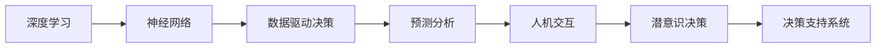

                 

# 数字化直觉：AI辅助的潜意识决策

> 关键词：人工智能, 潜意识决策, 深度学习, 神经网络, 人机交互, 数据驱动决策, 预测分析

## 1. 背景介绍

### 1.1 问题由来
在现代社会，信息爆炸、决策复杂化使得个体在面对各类决策时往往难以全面权衡利弊，特别是在金融投资、医疗诊断、商业管理等高风险领域，错误的决策可能会导致重大损失。因此，如何辅助人类进行高质量的决策，降低决策偏差，成为人工智能领域亟待解决的问题。

### 1.2 问题核心关键点
潜意识决策（Subconscious Decision Making），又称自动化决策（Automated Decision Making），是指无需意识介入，系统自动依据规则或模型进行决策的过程。这一过程依赖于AI算法和数据驱动的决策支持系统，其核心在于将决策过程自动化，减少人为干预，提升决策效率和质量。

### 1.3 问题研究意义
研究AI辅助潜意识决策，有助于：
1. **提高决策效率**：自动化处理海量数据，大幅提升决策速度。
2. **降低决策偏差**：算法依据历史数据和规则进行决策，减少人为情感、偏见等干扰。
3. **促进数据驱动决策**：通过大数据分析和机器学习，获得更客观、准确的决策依据。
4. **增强风险控制**：实时监控决策过程，及时发现并纠正潜在的错误。
5. **支持跨领域应用**：通过通用算法和框架，将决策系统应用到不同场景。

## 2. 核心概念与联系

### 2.1 核心概念概述

为了理解AI辅助潜意识决策，需要掌握几个核心概念：

- **深度学习（Deep Learning）**：一种基于神经网络（Neural Networks）的机器学习范式，能够学习数据的内在特征，进行高效的模式识别和预测。
- **神经网络（Neural Networks）**：由多个层次组成的计算模型，通过学习大量数据，实现复杂函数的逼近。
- **人机交互（Human-Computer Interaction, HCI）**：研究如何设计有效的交互界面和交互流程，实现人与机器的自然交互。
- **数据驱动决策（Data-Driven Decision Making）**：依据数据分析和模型预测进行决策，减少主观判断。
- **预测分析（Predictive Analytics）**：利用历史数据和机器学习模型，预测未来事件或趋势。

这些概念相互关联，共同构建了AI辅助潜意识决策的基础框架。

### 2.2 核心概念原理和架构的 Mermaid 流程图(Mermaid 流程节点中不要有括号、逗号等特殊字符)


### 2.3 核心概念之间的联系

- 深度学习通过神经网络模型，能够高效地从数据中学习并提取特征，为数据驱动决策和预测分析提供技术基础。
- 数据驱动决策依赖于深度学习模型的预测结果，通过算法优化和模型训练，确保决策的客观性和准确性。
- 预测分析基于历史数据和模型，对未来趋势进行预测，辅助决策系统提供更全面、可靠的信息支持。
- 人机交互通过友好的界面和流程设计，提升用户与决策系统的交互体验，增强系统的易用性和接受度。
- 潜意识决策系统整合以上组件，实现自动化、高效化的决策支持，减少人为干预，提升决策效率和质量。

## 3. 核心算法原理 & 具体操作步骤
### 3.1 算法原理概述

AI辅助潜意识决策的核心算法包括深度学习、数据驱动决策和预测分析。其整体流程如下：

1. **数据预处理**：收集和清洗数据，准备输入模型。
2. **特征提取**：利用神经网络模型，从原始数据中提取高维特征。
3. **模型训练**：使用监督或无监督学习算法，训练决策模型。
4. **预测分析**：使用训练好的模型，对新数据进行预测和分析。
5. **人机交互**：设计交互界面，实现用户与系统的交互。
6. **决策执行**：基于预测结果，自动做出决策并执行。

### 3.2 算法步骤详解

#### 3.2.1 数据预处理
数据预处理是AI辅助决策的基础，包括数据收集、清洗和归一化等步骤：

1. **数据收集**：从各种渠道收集相关数据，如金融交易数据、医疗记录、用户行为数据等。
2. **数据清洗**：去除噪声、缺失值和异常值，确保数据质量。
3. **数据归一化**：将数据按比例缩放，使不同特征值具有相同的数量级。

#### 3.2.2 特征提取
特征提取是利用深度学习模型从原始数据中提取高维特征的过程：

1. **神经网络结构选择**：选择合适的神经网络结构，如卷积神经网络（CNN）、循环神经网络（RNN）、长短期记忆网络（LSTM）等。
2. **模型训练**：使用历史数据训练模型，学习数据的内在特征。
3. **特征提取**：通过前向传播计算，将模型输出作为高维特征。

#### 3.2.3 模型训练
模型训练是利用历史数据训练决策模型的过程：

1. **选择模型**：选择合适的监督或无监督学习模型，如决策树、随机森林、神经网络等。
2. **模型训练**：使用历史数据训练模型，优化模型参数。
3. **模型评估**：使用测试数据评估模型性能，确保模型泛化能力。

#### 3.2.4 预测分析
预测分析是基于训练好的模型，对新数据进行预测和分析的过程：

1. **输入数据**：将新数据输入训练好的模型。
2. **预测结果**：模型输出预测结果，作为决策依据。
3. **结果解释**：通过特征重要性分析，解释模型的预测结果。

#### 3.2.5 人机交互
人机交互是通过友好的界面和流程设计，实现用户与系统的交互：

1. **界面设计**：设计简洁、直观的用户界面，减少用户学习成本。
2. **交互流程**：设计顺畅、高效的交互流程，确保用户操作便捷。
3. **反馈机制**：提供及时的反馈，使用户了解决策结果。

#### 3.2.6 决策执行
决策执行是基于预测结果，自动做出决策并执行的过程：

1. **决策规则**：根据预测结果，设定决策规则，如“当预测值为1时，执行A操作”。
2. **执行动作**：根据决策规则，自动执行相应的操作，如投资、治疗、推荐等。
3. **执行监控**：监控决策执行过程，及时发现并纠正错误。

### 3.3 算法优缺点

AI辅助潜意识决策具有以下优点：
1. **效率高**：自动化处理数据，大幅提升决策速度。
2. **准确性好**：基于数据驱动和模型预测，减少人为干扰，提升决策质量。
3. **适应性强**：算法可根据不同场景进行调整和优化，适应各种复杂任务。

但其缺点也不容忽视：
1. **模型复杂度高**：深度学习模型参数众多，训练和推理复杂。
2. **数据依赖性强**：决策依赖于历史数据，数据质量直接影响模型性能。
3. **解释性不足**：模型预测过程复杂，难以解释决策依据。
4. **隐私风险**：涉及个人隐私数据的决策，需考虑数据安全性和隐私保护。

### 3.4 算法应用领域

AI辅助潜意识决策在多个领域都有广泛应用，例如：

1. **金融投资**：自动分析市场数据，预测股票走势，辅助投资决策。
2. **医疗诊断**：自动分析患者数据，预测疾病风险，辅助医生诊断和治疗。
3. **商业管理**：自动分析业务数据，预测市场趋势，辅助企业决策。
4. **交通管理**：自动分析交通数据，预测流量变化，优化交通管理。
5. **风险控制**：自动分析风险数据，预测风险事件，防范风险。

## 4. 数学模型和公式 & 详细讲解 & 举例说明

### 4.1 数学模型构建

AI辅助潜意识决策的核心数学模型包括神经网络模型、预测分析模型等。以神经网络模型为例，其结构如下：

```python
import torch
import torch.nn as nn
import torch.nn.functional as F

class NeuralNet(nn.Module):
    def __init__(self, input_size, hidden_size, output_size):
        super(NeuralNet, self).__init__()
        self.hidden = nn.Linear(input_size, hidden_size)
        self.relu = nn.ReLU()
        self.output = nn.Linear(hidden_size, output_size)
    
    def forward(self, x):
        out = self.hidden(x)
        out = self.relu(out)
        out = self.output(out)
        return out
```

### 4.2 公式推导过程

以神经网络模型为例，其基本公式推导如下：

1. **前向传播**：
   - 输入层：$x \in \mathbb{R}^n$，表示输入向量。
   - 隐藏层：$h = \sigma(W_h x + b_h)$，其中$\sigma$为激活函数，$W_h$和$b_h$为权重和偏置。
   - 输出层：$y = \sigma(W_y h + b_y)$，其中$\sigma$为激活函数，$W_y$和$b_y$为权重和偏置。

2. **损失函数**：
   - 均方误差（MSE）：$L(y, \hat{y}) = \frac{1}{N} \sum_{i=1}^N (y_i - \hat{y_i})^2$
   - 交叉熵损失（CE）：$L(y, \hat{y}) = -\frac{1}{N} \sum_{i=1}^N \sum_{j=1}^C y_{ij} \log(\hat{y}_{ij})$

3. **反向传播**：
   - 求导：$\frac{\partial L}{\partial W_h} = \frac{\partial L}{\partial h} \frac{\partial h}{\partial W_h}$
   - 更新参数：$W_h \leftarrow W_h - \eta \frac{\partial L}{\partial W_h}$
   - 重复迭代，直到收敛。

### 4.3 案例分析与讲解

以金融投资领域为例，利用深度学习模型进行股票预测：

1. **数据准备**：收集历史股票价格数据，进行数据清洗和归一化。
2. **模型选择**：选择LSTM模型，处理时间序列数据。
3. **模型训练**：使用历史数据训练模型，优化模型参数。
4. **预测分析**：输入新数据，模型输出预测结果。
5. **决策执行**：根据预测结果，自动调整投资组合。

## 5. 项目实践：代码实例和详细解释说明

### 5.1 开发环境搭建

为了快速搭建AI辅助潜意识决策项目，可以使用Python和相关深度学习框架。以下是搭建环境的步骤：

1. **安装Python**：从官网下载并安装Python 3.x版本。
2. **安装深度学习框架**：使用pip安装TensorFlow、Keras、PyTorch等深度学习框架。
3. **安装数据处理库**：安装Pandas、NumPy等数据处理库，方便数据清洗和预处理。
4. **安装可视化工具**：安装Matplotlib、Seaborn等可视化工具，用于数据可视化。

### 5.2 源代码详细实现

以下是一个简单的神经网络模型代码实现，用于股票价格预测：

```python
import numpy as np
import pandas as pd
from keras.models import Sequential
from keras.layers import Dense, LSTM

# 数据准备
data = pd.read_csv('stock_price.csv')
data = data.dropna()

# 数据预处理
data = (data - data.mean()) / data.std()
X = data['open'].values.reshape(-1, 1)
y = data['close'].values.reshape(-1, 1)

# 模型训练
model = Sequential()
model.add(LSTM(50, return_sequences=True, input_shape=(X.shape[0], 1)))
model.add(LSTM(50))
model.add(Dense(1))
model.compile(loss='mse', optimizer='adam')
model.fit(X, y, epochs=100, batch_size=32)

# 预测分析
test_X = np.array([X[-1], X[-2], X[-3]])
pred_y = model.predict(test_X)
```

### 5.3 代码解读与分析

**数据准备**：
- 从CSV文件中读取股票价格数据。
- 使用Pandas库进行数据清洗和预处理，去除缺失值和异常值。
- 对数据进行归一化处理，使其满足神经网络模型输入要求。

**模型训练**：
- 使用Keras框架，搭建LSTM神经网络模型。
- 添加两个LSTM层和一层全连接层，进行模型训练。
- 使用均方误差（MSE）作为损失函数，Adam优化器进行参数更新。

**预测分析**：
- 使用训练好的模型，对最新三天的数据进行预测。
- 输出预测结果，作为投资决策依据。

### 5.4 运行结果展示

以下是预测结果的展示：

```python
import matplotlib.pyplot as plt

# 绘制预测曲线
plt.plot(y, label='Actual')
plt.plot(pred_y, label='Predicted')
plt.legend()
plt.show()
```

## 6. 实际应用场景

### 6.1 金融投资

在金融投资领域，AI辅助潜意识决策可以自动分析市场数据，预测股票走势，辅助投资决策。例如，使用LSTM模型预测某只股票的未来价格，自动调整投资组合。

### 6.2 医疗诊断

在医疗诊断领域，AI辅助潜意识决策可以自动分析患者数据，预测疾病风险，辅助医生诊断和治疗。例如，使用深度学习模型预测患者的疾病类型和严重程度，辅助医生制定治疗方案。

### 6.3 商业管理

在商业管理领域，AI辅助潜意识决策可以自动分析业务数据，预测市场趋势，辅助企业决策。例如，使用神经网络模型预测市场变化，辅助企业制定市场营销策略。

### 6.4 交通管理

在交通管理领域，AI辅助潜意识决策可以自动分析交通数据，预测流量变化，优化交通管理。例如，使用深度学习模型预测交通流量，辅助交通部门调整信号灯设置。

### 6.5 风险控制

在风险控制领域，AI辅助潜意识决策可以自动分析风险数据，预测风险事件，防范风险。例如，使用神经网络模型预测金融市场风险，辅助金融机构制定风险管理策略。

## 7. 工具和资源推荐

### 7.1 学习资源推荐

为了帮助开发者系统掌握AI辅助潜意识决策的理论基础和实践技巧，这里推荐一些优质的学习资源：

1. **深度学习课程**：如斯坦福大学《CS231n: Convolutional Neural Networks for Visual Recognition》、Coursera《Deep Learning Specialization by Andrew Ng》等。
2. **机器学习框架**：如TensorFlow、PyTorch、Keras等。
3. **开源项目**：如TensorFlow、Keras等。
4. **学术论文**：如《Deep Reinforcement Learning for Robotics》等。
5. **在线社区**：如GitHub、Stack Overflow、Kaggle等。

通过对这些资源的学习实践，相信你一定能够快速掌握AI辅助潜意识决策的精髓，并用于解决实际的NLP问题。

### 7.2 开发工具推荐

高效的开发离不开优秀的工具支持。以下是几款用于AI辅助潜意识决策开发的常用工具：

1. **TensorFlow**：由Google主导开发的开源深度学习框架，生产部署方便，适合大规模工程应用。
2. **PyTorch**：基于Python的开源深度学习框架，灵活动态的计算图，适合快速迭代研究。
3. **Keras**：高层次的神经网络API，易于上手，适合初学者。
4. **Matplotlib**：数据可视化工具，支持绘制各种图表。
5. **Seaborn**：基于Matplotlib的高级可视化库，提供更美观的绘图效果。

合理利用这些工具，可以显著提升AI辅助潜意识决策任务的开发效率，加快创新迭代的步伐。

### 7.3 相关论文推荐

AI辅助潜意识决策领域的研究仍在不断深入，以下是几篇奠基性的相关论文，推荐阅读：

1. **《Deep Reinforcement Learning for Robotics》**：提出深度强化学习算法，在机器人控制和自动驾驶等领域取得优异成果。
2. **《Neural Network Methods for Predictive Maintenance》**：提出神经网络模型，用于预测设备故障和维护需求。
3. **《Gated Recurrent Units: A New Approach for Continuous Sequence Modeling》**：提出LSTM模型，解决序列数据的预测和分类问题。
4. **《Deep Neural Networks for Natural Language Processing》**：提出深度神经网络模型，在自然语言处理领域取得突破。
5. **《A Survey on Deep Learning for Cybersecurity》**：综述深度学习在网络安全领域的应用，提供全面的理论和技术支持。

这些论文代表了大语言模型微调技术的发展脉络。通过学习这些前沿成果，可以帮助研究者把握学科前进方向，激发更多的创新灵感。

## 8. 总结：未来发展趋势与挑战

### 8.1 总结

本文对AI辅助潜意识决策方法进行了全面系统的介绍。首先阐述了潜意识决策的原理和应用场景，明确了AI辅助潜意识决策在提高决策效率和质量方面的独特价值。其次，从原理到实践，详细讲解了神经网络模型的构建和训练过程，给出了具体代码实现。同时，本文还广泛探讨了AI辅助潜意识决策在金融、医疗、商业等多个领域的应用前景，展示了AI决策系统的巨大潜力。此外，本文精选了学习资源和开发工具，力求为开发者提供全方位的技术指引。

通过本文的系统梳理，可以看到，AI辅助潜意识决策在现代决策系统中具有广泛的应用前景，能够显著提升决策效率和质量，降低决策偏差。未来，伴随深度学习、神经网络等技术的不断进步，AI辅助潜意识决策必将迎来更广泛的应用，为各行各业带来更智能、更高效的决策支持。

### 8.2 未来发展趋势

展望未来，AI辅助潜意识决策技术将呈现以下几个发展趋势：

1. **技术进步**：深度学习模型的精度和效率将不断提高，能够处理更复杂、更精细的决策任务。
2. **跨领域应用**：AI辅助潜意识决策将更多地应用于不同领域，如金融、医疗、交通等，实现多场景的智能化决策。
3. **实时性增强**：实时决策系统将成为主流，能够及时响应用户需求，提供即时的决策支持。
4. **数据融合**：更多数据源的融合和协同，将提升决策系统的全面性和准确性。
5. **人机协同**：AI和人类将更加紧密合作，实现更高效、更智能的决策过程。
6. **算法优化**：基于新算法和新模型，实现更加高效的决策过程，降低资源消耗。

### 8.3 面临的挑战

尽管AI辅助潜意识决策技术已经取得了显著进展，但在迈向更加智能化、普适化应用的过程中，仍面临诸多挑战：

1. **模型复杂度**：深度学习模型的参数众多，训练和推理复杂，需要高效的算法和硬件支持。
2. **数据质量**：决策依赖于数据质量，低质量、不完整的数据将影响模型性能。
3. **隐私安全**：数据隐私和安全问题，如数据泄露、数据篡改等，需要引起高度关注。
4. **可解释性**：模型决策过程复杂，难以解释，缺乏可解释性将影响用户信任。
5. **伦理道德**：AI决策系统可能带来伦理道德问题，如算法歧视、误导决策等，需要严格监管和规范。

### 8.4 研究展望

未来，AI辅助潜意识决策的研究需要在以下几个方面寻求新的突破：

1. **数据融合技术**：通过多数据源的融合，提升决策系统的全面性和准确性。
2. **实时决策算法**：研究高效的实时决策算法，满足实时性要求。
3. **可解释性算法**：研究可解释性强的算法，提升用户对决策过程的理解和信任。
4. **隐私保护技术**：研究数据隐私保护技术，确保用户数据安全。
5. **伦理道德规范**：建立伦理道德规范，确保AI决策系统的公平性和透明性。

通过这些研究方向的探索发展，AI辅助潜意识决策技术必将迈向更高的台阶，为构建智能、可靠、可解释的决策系统铺平道路。

## 9. 附录：常见问题与解答

### 9.1 Q1：AI辅助潜意识决策的原理是什么？

A：AI辅助潜意识决策的原理是通过深度学习模型，从历史数据中学习规律和特征，自动进行决策和预测。其核心在于将决策过程自动化，减少人为干预，提升决策效率和质量。

### 9.2 Q2：AI辅助潜意识决策有哪些应用场景？

A：AI辅助潜意识决策在金融投资、医疗诊断、商业管理、交通管理、风险控制等领域都有广泛应用。其应用场景包括自动分析数据、预测趋势、辅助决策等。

### 9.3 Q3：AI辅助潜意识决策的优势和劣势是什么？

A：AI辅助潜意识决策的优势包括效率高、准确性好、适应性强等，劣势包括模型复杂度高、数据依赖性强、解释性不足、隐私风险等。

### 9.4 Q4：AI辅助潜意识决策的开发流程是什么？

A：AI辅助潜意识决策的开发流程包括数据预处理、特征提取、模型训练、预测分析、人机交互和决策执行。其开发流程通常需要经过多次迭代和优化，以获得理想的决策效果。

### 9.5 Q5：AI辅助潜意识决策如何确保数据安全？

A：确保数据安全的关键在于数据加密、访问控制和数据匿名化等技术手段。采用严格的访问控制和加密技术，防止数据泄露和篡改，确保数据隐私和安全。

作者：禅与计算机程序设计艺术 / Zen and the Art of Computer Programming

