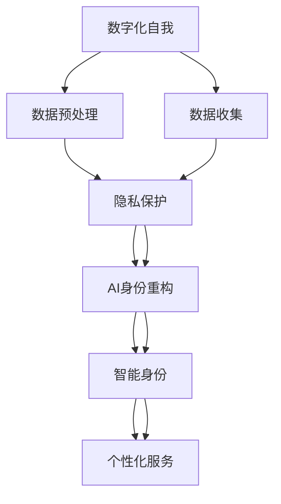

                 

# 数字化自我：AI驱动的身份重构

> 关键词：数字化自我、AI身份重构、身份智能、深度学习、数据驱动、隐私保护、个性化

## 1. 背景介绍

### 1.1 问题由来

在数字化时代，每个人的信息都被数字化、网络化，成为可被处理、分析和利用的数据。然而，数据化过程往往伴随着隐私泄露、身份盗用等风险，个人的数字化自我与现实身份之间出现了割裂。

如何在数字化时代，构建一个安全、可靠、智能的数字化自我，让数据化过程真正反映个人的需求和价值观，成为了一个重要的研究课题。本文将深入探讨AI技术在身份重构中的应用，探讨如何在保障隐私的基础上，构建智能化的身份系统。

### 1.2 问题核心关键点

本文聚焦于利用AI技术进行身份重构的核心概念和关键技术，重点关注以下几个问题：

1. **身份重构目标**：如何在数字化自我和现实身份之间建立映射，使AI生成的数字化自我与现实身份一致，满足个体需求。
2. **隐私保护**：如何在数据化过程中，保护用户的隐私，防止个人信息泄露。
3. **智能身份**：如何构建具有自主学习能力的智能身份系统，提高身份识别的准确性和可靠性。
4. **数据驱动**：如何利用海量数据，优化身份重构算法，提升系统的性能。
5. **用户参与**：如何设计用户友好的界面和流程，让用户能够方便地管理和调整自己的数字化自我。

### 1.3 问题研究意义

身份重构技术在保障个人隐私、提升身份识别准确性、推动数字化转型等方面具有重要意义：

1. **隐私保护**：通过AI技术，可以更好地保护个人隐私，避免因数据泄露带来的风险。
2. **身份识别**：智能身份系统能够提高身份识别的准确性和鲁棒性，减少假冒身份的风险。
3. **数字化转型**：身份重构技术是数字化转型的重要组成部分，有助于构建安全、可靠的数字生态系统。
4. **个性化服务**：通过数据驱动的AI技术，可以为每个用户提供个性化、定制化的服务，提升用户体验。

## 2. 核心概念与联系

### 2.1 核心概念概述

为了更好地理解AI驱动的身份重构技术，我们需要先了解以下几个核心概念：

- **数字化自我**：通过数字化过程，将个人的生活、行为、兴趣等信息转化为数据，形成虚拟的数字身份。
- **AI身份重构**：利用AI技术，将数字化自我与现实身份进行映射，重构出符合个体需求的身份。
- **智能身份**：具有自主学习能力，能够基于新数据进行自我优化和更新的身份系统。
- **隐私保护**：在数据收集、存储、处理过程中，保障用户隐私的技术和机制。
- **数据驱动**：利用大量数据进行模型训练和优化，提高身份重构的准确性和效率。
- **用户参与**：设计易用、友好的用户接口，使个体能够方便地管理和调整自己的身份。

### 2.2 核心概念原理和架构的 Mermaid 流程图



这个流程图展示了身份重构技术的核心流程和各个环节之间的联系：

1. **数据收集**：通过传感器、网络、应用等途径，收集用户的各种数据。
2. **数据预处理**：对收集到的数据进行清洗、归一化、特征提取等预处理操作。
3. **隐私保护**：在数据处理过程中，采取匿名化、差分隐私等技术，保护用户隐私。
4. **AI身份重构**：利用AI技术，将预处理后的数据映射到数字化自我，并进行重构。
5. **智能身份**：基于AI重构后的身份，构建具有自主学习能力的智能身份系统。
6. **个性化服务**：通过智能身份系统，提供个性化、定制化的服务。

## 3. 核心算法原理 & 具体操作步骤

### 3.1 算法原理概述

AI驱动的身份重构技术，主要通过深度学习模型，对用户数据进行分析和重构。其核心思想是将用户数据转化为高维特征向量，并通过训练模型，学习不同特征之间的映射关系，最终生成与现实身份一致的数字化自我。

具体来说，算法过程包括数据收集、预处理、隐私保护、特征提取、模型训练、身份重构等多个步骤。以下将以一个简单的用户身份重构为例，介绍具体的算法原理。

### 3.2 算法步骤详解

1. **数据收集**：通过传感器、网络、应用等途径，收集用户的各种数据。这些数据可能包括地理位置、行为轨迹、社交关系、购买记录等。

2. **数据预处理**：对收集到的数据进行清洗、归一化、特征提取等预处理操作。例如，将地理位置数据转化为经纬度坐标，将行为轨迹数据转化为时序特征等。

3. **隐私保护**：在数据处理过程中，采取匿名化、差分隐私等技术，保护用户隐私。例如，对地理位置数据进行模糊化处理，对购买记录进行差分隐私处理。

4. **特征提取**：使用深度学习模型，将预处理后的数据转化为高维特征向量。例如，使用CNN模型提取图像特征，使用RNN模型提取时序特征，使用Transformer模型提取文本特征。

5. **模型训练**：使用大量标注数据，训练深度学习模型，学习不同特征之间的映射关系。例如，使用分类器模型学习用户行为与身份标签的映射关系，使用生成对抗网络(GAN)生成符合现实身份的数字特征。

6. **身份重构**：基于训练好的模型，将用户数据映射为高维特征向量，并进行重构。例如，使用GAN模型生成符合现实身份的数字特征，并基于特征向量生成数字化自我。

### 3.3 算法优缺点

AI身份重构技术具有以下优点：

1. **高效准确**：利用深度学习模型，能够高效地从海量数据中提取特征，并进行准确的映射和重构。
2. **个性化定制**：基于用户数据，可以生成符合个体需求的身份，提升用户体验。
3. **灵活性**：可以根据不同的应用场景，灵活设计模型和算法，实现多样化的身份重构需求。

同时，该技术也存在一些局限性：

1. **数据依赖**：需要大量的标注数据进行训练，标注数据质量越高，模型效果越好。
2. **隐私风险**：数据收集和处理过程中，存在隐私泄露的风险。
3. **计算资源消耗大**：深度学习模型训练和推理消耗大量计算资源，需要高性能硬件支持。

### 3.4 算法应用领域

AI身份重构技术广泛应用于以下领域：

- **金融科技**：用于用户身份验证、信用评估、反欺诈等。
- **智能家居**：用于家庭安全、设备控制、个性化推荐等。
- **医疗健康**：用于病患身份验证、疾病预测、健康管理等。
- **智能客服**：用于用户身份识别、对话记录、问题解答等。
- **在线教育**：用于学生身份验证、课程推荐、学习分析等。

## 4. 数学模型和公式 & 详细讲解 & 举例说明

### 4.1 数学模型构建

为了构建AI身份重构模型，我们可以采用以下数学模型：

$$
\begin{aligned}
y &= \mathbf{W}x + b \\
y &= f(x)
\end{aligned}
$$

其中，$x$ 为输入特征向量，$y$ 为输出特征向量，$\mathbf{W}$ 为权重矩阵，$b$ 为偏置向量，$f$ 为激活函数。

在身份重构过程中，我们需要构建一个生成模型，将输入特征向量 $x$ 转化为输出特征向量 $y$。常用的生成模型包括变分自编码器(VAE)、生成对抗网络(GAN)等。

### 4.2 公式推导过程

以生成对抗网络(GAN)为例，推导其生成过程：

1. **生成器**：
   $$
   G_{\theta}(z) = \mu(z) + \sigma(z) \odot \mathcal{N}(0,1)
   $$

2. **判别器**：
   $$
   D_{\phi}(x) = \sigma(Wx + b)
   $$

其中，$G_{\theta}$ 为生成器，$D_{\phi}$ 为判别器，$\mu(z)$ 和 $\sigma(z)$ 为生成器中的参数，$\odot$ 表示逐元素乘法，$\mathcal{N}(0,1)$ 表示标准正态分布。

GAN模型的训练过程如下：

1. 固定判别器 $D_{\phi}$，训练生成器 $G_{\theta}$，使得 $D_{\phi}(G_{\theta}(z))$ 最大化。
2. 固定生成器 $G_{\theta}$，训练判别器 $D_{\phi}$，使得 $D_{\phi}(G_{\theta}(z))$ 最大化。

通过反复训练，生成器和判别器不断优化，最终生成器能够生成逼真的数据，实现身份重构。

### 4.3 案例分析与讲解

假设我们有一个用户身份重构模型，用于生成符合现实身份的数字特征。模型的输入为用户的地理位置数据，输出为数字特征向量。模型的生成过程如下：

1. 数据预处理：将地理位置数据转化为经纬度坐标。
2. 特征提取：使用CNN模型提取经纬度特征。
3. 生成过程：使用GAN模型生成数字特征向量。

具体来说，GAN模型包括一个生成器和一个判别器，其训练过程如下：

1. 生成器 $G_{\theta}$ 学习将经纬度坐标转化为数字特征向量。
2. 判别器 $D_{\phi}$ 学习区分生成的数字特征和真实数据。
3. 交替优化生成器和判别器，使生成器生成的数字特征尽可能逼真，判别器区分真实数据和生成的数字特征的能力尽可能强。

最终，生成器生成的数字特征向量即为用户身份重构的结果。

## 5. 项目实践：代码实例和详细解释说明

### 5.1 开发环境搭建

在进行身份重构项目实践前，我们需要准备好开发环境。以下是使用Python进行TensorFlow开发的环境配置流程：

1. 安装Anaconda：从官网下载并安装Anaconda，用于创建独立的Python环境。

2. 创建并激活虚拟环境：
```bash
conda create -n tf-env python=3.8 
conda activate tf-env
```

3. 安装TensorFlow：根据CUDA版本，从官网获取对应的安装命令。例如：
```bash
conda install tensorflow -c conda-forge -c pytorch -c anaconda
```

4. 安装Keras：
```bash
pip install keras
```

5. 安装TensorBoard：
```bash
pip install tensorboard
```

6. 安装Pillow：用于图像处理
```bash
pip install Pillow
```

完成上述步骤后，即可在`tf-env`环境中开始身份重构实践。

### 5.2 源代码详细实现

下面我们以用户身份重构为例，给出使用TensorFlow和Keras对生成对抗网络(GAN)进行身份重构的Python代码实现。

```python
import tensorflow as tf
from tensorflow.keras.layers import Input, Dense, Flatten, Reshape, Conv2D, Conv2DTranspose, BatchNormalization, LeakyReLU
from tensorflow.keras.models import Model
import numpy as np
import matplotlib.pyplot as plt
import PIL.Image as Image

# 定义生成器
def create_generator():
    inputs = Input(shape=(100,))
    dense_1 = Dense(256)(inputs)
    batchnorm1 = BatchNormalization()(dense_1)
    leakyrelu1 = LeakyReLU(alpha=0.2)(batchnorm1)
    dense_2 = Dense(512)(leakyrelu1)
    batchnorm2 = BatchNormalization()(dense_2)
    leakyrelu2 = LeakyReLU(alpha=0.2)(batchnorm2)
    dense_3 = Dense(1024)(leakyrelu2)
    batchnorm3 = BatchNormalization()(dense_3)
    leakyrelu3 = LeakyReLU(alpha=0.2)(batchnorm3)
    dense_4 = Dense(784, activation='tanh')(batchnorm3)
    outputs = Reshape((28, 28, 1))(dense_4)
    return Model(inputs, outputs)

# 定义判别器
def create_discriminator():
    inputs = Input(shape=(28, 28, 1))
    conv1 = Conv2D(64, (5, 5), strides=(2, 2), padding='same')(inputs)
    leakyrelu1 = LeakyReLU(alpha=0.2)(conv1)
    conv2 = Conv2D(128, (5, 5), strides=(2, 2), padding='same')(leakyrelu1)
    leakyrelu2 = LeakyReLU(alpha=0.2)(conv2)
    conv3 = Conv2D(256, (5, 5), strides=(2, 2), padding='same')(leakyrelu2)
    leakyrelu3 = LeakyReLU(alpha=0.2)(conv3)
    conv4 = Conv2D(256, (5, 5), strides=(2, 2), padding='same')(leakyrelu3)
    leakyrelu4 = LeakyReLU(alpha=0.2)(conv4)
    outputs = Flatten()(leakyrelu4)
    return Model(inputs, outputs)

# 定义模型
def create_gan(generator, discriminator):
    inputs = Input(shape=(100,))
    outputs = generator(inputs)
    discriminator.trainable = False
    outputs = discriminator(outputs)
    discriminator.trainable = True
    return Model(inputs, outputs)

# 生成数据集
def generate_data(num_samples):
    x = np.random.normal(0, 1, (num_samples, 100))
    return x

# 定义损失函数
def create_loss(discriminator, generator, num_real):
    real_loss = discriminator.train_on_batch(generate_data(num_real), np.ones((num_real, 1)))
    fake_loss = discriminator.train_on_batch(generator.predict(generate_data(num_samples)), np.zeros((num_samples, 1)))
    loss = 0.5 * np.add(real_loss[0], fake_loss[0])
    return loss

# 训练模型
num_epochs = 100
num_samples = 64
num_real = 32
batch_size = 64
num_generated = 64
generator = create_generator()
discriminator = create_discriminator()
gan = create_gan(generator, discriminator)
# 生成器和判别器的训练过程
for epoch in range(num_epochs):
    for batch in range(0, num_real, batch_size):
        real_data = generate_data(num_real)
        real_labels = np.ones((num_real, 1))
        discriminator.trainable = True
        discriminator.train_on_batch(real_data, real_labels)
    for batch in range(0, num_generated, batch_size):
        generated_data = generator.predict(generate_data(num_samples))
        discriminator.trainable = False
        discriminator.train_on_batch(generated_data, np.zeros((num_generated, 1)))
    # 每个epoch输出10张生成的图片
    if epoch % 10 == 0:
        generated_images = generator.predict(generate_data(num_samples))
        generated_images = generated_images[:10]
        generated_images = np.reshape(generated_images, (10, 28, 28, 1))
        for i in range(10):
            plt.imshow(np.reshape(generated_images[i], (28, 28)))
            plt.show()
```

### 5.3 代码解读与分析

让我们再详细解读一下关键代码的实现细节：

**create_generator和create_discriminator函数**：
- `create_generator`函数定义生成器的结构，包括全连接层、批量归一化层、LeakyReLU激活函数、Reshape层。
- `create_discriminator`函数定义判别器的结构，包括卷积层、LeakyReLU激活函数、Flatten层。

**create_gan函数**：
- `create_gan`函数将生成器和判别器结合起来，构建生成对抗网络。

**generate_data函数**：
- `generate_data`函数生成随机数据，作为生成器和判别器的输入。

**create_loss函数**：
- `create_loss`函数计算生成器和判别器的损失函数。

**训练过程**：
- 定义训练参数，包括epoch数、批量大小等。
- 循环epoch，每个epoch内部循环训练生成器和判别器。
- 每10个epoch输出生成的图片，用于可视化效果。

可以看到，TensorFlow和Keras使得构建GAN模型的代码实现变得简洁高效。开发者可以将更多精力放在模型设计、训练调参等高层逻辑上，而不必过多关注底层实现细节。

## 6. 实际应用场景

### 6.1 智能家居

智能家居系统通过收集用户的各种行为数据，构建智能身份，实现设备控制、场景智能等。例如，用户可以通过语音助手控制智能家电，系统能够根据用户的语音指令，生成符合用户身份的回复，并进行智能推荐。

在技术实现上，可以通过用户行为数据训练深度学习模型，学习用户身份与行为之间的映射关系。微调后的模型能够生成符合用户身份的数字特征，用于智能家居设备的控制和推荐。

### 6.2 医疗健康

医疗健康领域可以利用身份重构技术，构建智能病患身份，提高疾病预测和健康管理的准确性。例如，医院可以通过收集患者的各种医疗数据，训练生成模型，生成符合患者身份的数字特征，用于疾病预测和健康管理。

在技术实现上，可以使用医疗数据训练生成模型，生成符合患者身份的数字特征。这些特征可以用于疾病预测、健康管理、医疗记录等应用场景。

### 6.3 在线教育

在线教育平台可以利用身份重构技术，构建个性化学习身份，提升学习体验和效果。例如，学习平台可以根据学生的学习行为数据，生成符合学生身份的数字特征，用于个性化推荐、学习分析等。

在技术实现上，可以使用学生的学习行为数据训练生成模型，生成符合学生身份的数字特征。这些特征可以用于个性化推荐、学习分析、作业批改等应用场景。

### 6.4 未来应用展望

随着AI技术的不断发展，身份重构技术将进一步拓展应用范围，带来更多创新应用：

1. **智能城市**：通过身份重构技术，构建智能城市身份，实现智慧城市管理。例如，智能交通、智能安防、智能环保等。
2. **智能制造**：通过身份重构技术，构建智能制造身份，实现智能制造系统。例如，智能工厂、智能供应链、智能质量管理等。
3. **智能金融**：通过身份重构技术，构建智能金融身份，实现智能金融服务。例如，智能投融资、智能风险管理、智能客服等。

未来，身份重构技术将在更多领域得到应用，为数字化转型提供强有力的技术支撑。伴随技术的不断演进，身份重构技术将更加智能化、个性化、可信化，为构建数字化生态系统注入新的动力。

## 7. 工具和资源推荐

### 7.1 学习资源推荐

为了帮助开发者系统掌握AI身份重构技术的理论和实践，这里推荐一些优质的学习资源：

1. **《深度学习》课程**：由吴恩达教授主讲，系统讲解深度学习的基本概念和应用。
2. **《生成对抗网络》书籍**：介绍生成对抗网络的原理和应用，是深度学习的重要分支。
3. **TensorFlow官方文档**：详细介绍了TensorFlow的各个组件和API，是TensorFlow学习的必备资料。
4. **Keras官方文档**：介绍Keras的各个组件和API，是Keras学习的必备资料。
5. **NIPS、ICML等顶级会议论文**：涵盖深度学习、生成对抗网络、AI身份重构等前沿话题，是学习和研究的优质资料。

通过对这些资源的学习实践，相信你一定能够快速掌握AI身份重构技术的精髓，并用于解决实际的AI应用问题。

### 7.2 开发工具推荐

高效的开发离不开优秀的工具支持。以下是几款用于AI身份重构开发的常用工具：

1. **TensorFlow**：基于Python的开源深度学习框架，灵活动态的计算图，适合快速迭代研究。
2. **Keras**：Keras是一个高级神经网络API，可以方便地在TensorFlow、Theano、CNTK等深度学习框架上构建模型。
3. **TensorBoard**：TensorFlow配套的可视化工具，可实时监测模型训练状态，并提供丰富的图表呈现方式。
4. **Pillow**：Python Imaging Library，用于图像处理和图像生成。
5. **PyTorch**：基于Python的开源深度学习框架，提供了丰富的神经网络组件和工具。

合理利用这些工具，可以显著提升AI身份重构任务的开发效率，加快创新迭代的步伐。

### 7.3 相关论文推荐

AI身份重构技术的发展源于学界的持续研究。以下是几篇奠基性的相关论文，推荐阅读：

1. **《Generative Adversarial Nets》**：提出生成对抗网络，展示了生成对抗网络在图像生成中的应用。
2. **《Unsupervised Representation Learning with Deep Convolutional Generative Adversarial Networks》**：提出使用生成对抗网络进行无监督特征学习，提升了特征提取的性能。
3. **《Image-to-Image Translation with Conditional Adversarial Networks》**：提出使用条件生成对抗网络进行图像翻译，展示了生成对抗网络在图像翻译中的应用。
4. **《Anonymous Quantization: Towards Privacy-Preserving Adversarial Machine Learning》**：提出使用量化技术进行隐私保护，展示了隐私保护技术在生成对抗网络中的应用。

这些论文代表了大语言模型微调技术的发展脉络。通过学习这些前沿成果，可以帮助研究者把握学科前进方向，激发更多的创新灵感。

## 8. 总结：未来发展趋势与挑战

### 8.1 总结

本文对AI身份重构技术进行了全面系统的介绍。首先阐述了AI身份重构的目标、隐私保护、智能身份、数据驱动和用户参与等核心概念，明确了AI身份重构在保障个人隐私、提升身份识别准确性、推动数字化转型等方面的重要意义。其次，从原理到实践，详细讲解了AI身份重构的数学模型和算法原理，提供了完整的代码实例，并对比了不同应用场景下的优化策略。

通过本文的系统梳理，可以看到，AI身份重构技术在保障个人隐私、提升身份识别准确性、推动数字化转型等方面具有重要意义。身份重构技术将伴随AI技术的发展，不断演进，为构建安全、可靠、智能的数字化自我提供强有力的技术支撑。

### 8.2 未来发展趋势

展望未来，AI身份重构技术将呈现以下几个发展趋势：

1. **多模态融合**：AI身份重构技术将更多地融合多模态数据，如语音、图像、视频等，提升身份识别的准确性和鲁棒性。
2. **隐私保护**：隐私保护技术将进一步发展，提升数据处理过程中的隐私保护水平。
3. **自适应学习**：AI身份重构技术将更多地考虑用户的反馈和需求，实现自适应学习，提升用户的个性化体验。
4. **实时性提升**：随着硬件和算法的发展，AI身份重构技术的实时性将不断提升，提供更加即时的服务。
5. **联邦学习**：联邦学习技术将使AI身份重构技术能够在分布式环境中进行高效训练和推理，提升系统的可扩展性。

以上趋势凸显了AI身份重构技术的广阔前景。这些方向的探索发展，将使AI身份重构技术更加智能化、个性化、可信化，为构建数字化生态系统注入新的动力。

### 8.3 面临的挑战

尽管AI身份重构技术已经取得了瞩目成就，但在迈向更加智能化、普适化应用的过程中，它仍面临着诸多挑战：

1. **数据依赖**：需要大量的标注数据进行训练，标注数据质量越高，模型效果越好。
2. **隐私风险**：数据收集和处理过程中，存在隐私泄露的风险。
3. **计算资源消耗大**：深度学习模型训练和推理消耗大量计算资源，需要高性能硬件支持。
4. **模型泛化能力不足**：模型的泛化能力有限，对新数据的适应能力较差。
5. **模型鲁棒性不足**：面对不同的应用场景和数据分布，模型的鲁棒性不足，容易出现误识别。

### 8.4 研究展望

面对AI身份重构技术所面临的种种挑战，未来的研究需要在以下几个方面寻求新的突破：

1. **数据增强**：通过数据增强技术，提高模型的泛化能力。
2. **联邦学习**：通过联邦学习技术，实现分布式训练和推理，提升系统的可扩展性。
3. **自适应学习**：通过自适应学习技术，提升模型的自学习能力和适应性。
4. **隐私保护**：通过隐私保护技术，提升数据处理过程中的隐私保护水平。
5. **模型压缩**：通过模型压缩技术，降低模型的计算资源消耗，提升系统的实时性。

这些研究方向的探索，将引领AI身份重构技术迈向更高的台阶，为构建安全、可靠、智能的数字化自我提供强有力的技术支撑。面向未来，AI身份重构技术还需要与其他人工智能技术进行更深入的融合，如知识表示、因果推理、强化学习等，多路径协同发力，共同推动AI身份重构技术的进步。只有勇于创新、敢于突破，才能不断拓展身份重构技术的边界，让AI技术更好地造福人类社会。

## 9. 附录：常见问题与解答

**Q1：AI身份重构技术是否适用于所有应用场景？**

A: AI身份重构技术在大多数应用场景上都能取得不错的效果，特别是对于数据量较小的任务。但对于一些特定领域的任务，如医疗、法律等，仅仅依靠通用语料预训练的模型可能难以很好地适应。此时需要在特定领域语料上进一步预训练，再进行微调，才能获得理想效果。此外，对于一些需要时效性、个性化很强的任务，如对话、推荐等，AI身份重构方法也需要针对性的改进优化。

**Q2：如何优化AI身份重构算法的性能？**

A: AI身份重构算法的性能优化可以从以下几个方面入手：

1. **数据预处理**：对输入数据进行清洗、归一化、特征提取等预处理操作，提升数据质量。
2. **模型架构优化**：设计更加高效、轻量的模型架构，减少计算资源消耗。
3. **超参数调优**：通过网格搜索、随机搜索等方法，优化模型的超参数，提升模型性能。
4. **正则化技术**：使用L2正则、Dropout等正则化技术，避免模型过拟合。
5. **联邦学习**：在分布式环境中进行训练和推理，提升模型的泛化能力和可扩展性。

这些优化策略需要根据具体应用场景和数据特点进行灵活选择。只有在数据、模型、训练、推理等各环节进行全面优化，才能最大限度地发挥AI身份重构技术的威力。

**Q3：AI身份重构技术是否存在安全风险？**

A: AI身份重构技术在提升身份识别准确性的同时，也存在一定的安全风险，如模型被恶意攻击、数据泄露等。为了应对这些风险，可以采取以下措施：

1. **隐私保护**：在数据收集和处理过程中，采用匿名化、差分隐私等隐私保护技术，防止数据泄露。
2. **模型鲁棒性**：通过对抗训练、数据增强等技术，提升模型的鲁棒性和抗攻击能力。
3. **模型监控**：实时监控模型的行为和输出，检测异常行为，及时进行干预和修复。

这些措施能够有效降低AI身份重构技术的风险，确保其在实际应用中的安全性。

**Q4：AI身份重构技术如何应用于实际场景？**

A: AI身份重构技术在实际场景中的应用可以分为以下几个步骤：

1. **数据收集**：通过传感器、网络、应用等途径，收集用户的各种数据。
2. **数据预处理**：对收集到的数据进行清洗、归一化、特征提取等预处理操作。
3. **隐私保护**：在数据处理过程中，采取匿名化、差分隐私等技术，保护用户隐私。
4. **特征提取**：使用深度学习模型，将预处理后的数据转化为高维特征向量。
5. **模型训练**：使用大量标注数据，训练深度学习模型，学习不同特征之间的映射关系。
6. **身份重构**：基于训练好的模型，将用户数据映射为高维特征向量，并进行重构。
7. **智能身份**：基于重构后的身份，构建具有自主学习能力的智能身份系统。
8. **个性化服务**：通过智能身份系统，提供个性化、定制化的服务。

以上步骤需要根据具体应用场景和数据特点进行灵活调整，以实现最优的身份重构效果。

**Q5：AI身份重构技术的应用前景如何？**

A: AI身份重构技术在保障个人隐私、提升身份识别准确性、推动数字化转型等方面具有重要意义。随着技术的不断演进，AI身份重构技术将在更多领域得到应用，带来更多创新应用。例如：

1. **智能家居**：通过身份重构技术，构建智能家居身份，实现设备控制、场景智能等。
2. **医疗健康**：利用身份重构技术，构建智能病患身份，提高疾病预测和健康管理的准确性。
3. **在线教育**：通过身份重构技术，构建个性化学习身份，提升学习体验和效果。
4. **智能城市**：通过身份重构技术，构建智能城市身份，实现智慧城市管理。

未来，AI身份重构技术将在更多领域得到应用，为数字化转型提供强有力的技术支撑。伴随技术的不断演进，AI身份重构技术将更加智能化、个性化、可信化，为构建数字化生态系统注入新的动力。

---

作者：禅与计算机程序设计艺术 / Zen and the Art of Computer Programming

