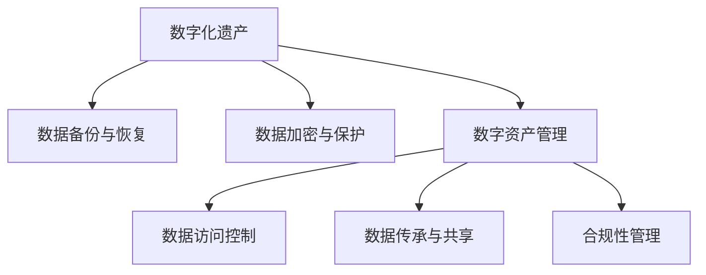

                 

# 数字化遗产规划创业：生命终期的数据管理

## 1. 背景介绍

### 1.1 问题由来

随着数字化时代的发展，人们的日常生活越来越多地依赖于数字设备和互联网。与此同时，数字化遗产管理也成为了一个日益重要的话题。数字化遗产包括各种形式的数据，如电子邮件、照片、视频、社交媒体记录等。这些数据构成了个人和家庭的数字化记忆，在生命终结后，如何妥善管理和传承这些数字化遗产，成为了一个备受关注的问题。

数字化遗产管理的挑战在于，随着数字化设备的更新换代，传统的数据存储方式如物理硬盘、磁带等变得不再适用。而且，数字化遗产涉及的不仅仅是个人隐私，还包括法律和伦理问题。因此，如何规划和管理数字化遗产，成为创业者面临的一个重要课题。

### 1.2 问题核心关键点

数字化遗产管理涉及多个关键点，包括：
- **数据收集与整理**：如何收集并整理个人的数字化遗产数据。
- **数据备份与存储**：如何确保数据的安全备份与长期存储。
- **数据访问控制**：如何在法律和伦理框架内，控制对数字化遗产的访问和使用。
- **数据传承与共享**：如何合理传承和共享数字化遗产，以确保其在未来的可访问性和可利用性。
- **法律与合规性**：如何在法律框架内进行数字化遗产管理，确保数据的安全与合法传递。

这些关键点构成了数字化遗产管理的基础框架，创业者需要全面考虑，并在此基础上设计可行的解决方案。

## 2. 核心概念与联系

### 2.1 核心概念概述

为了更好地理解数字化遗产管理的核心概念，本节将介绍几个密切相关的核心概念：

- **数字化遗产(Digital Estate)**：指个人或家庭在数字生活中产生的数据和内容，包括但不限于电子邮件、照片、视频、社交媒体记录等。
- **数据备份与恢复(Data Backup and Recovery)**：指通过技术手段，定期备份数据，并在需要时恢复数据的过程。
- **数据加密与保护(Data Encryption and Security)**：指通过加密等技术手段，保护数据隐私和安全的过程。
- **数字资产管理(Digital Asset Management)**：指对数字资产的收集、整理、备份、恢复、访问控制、传承与共享等全生命周期管理的过程。
- **合规性管理(Compliance Management)**：指在法律框架内，对数字化遗产管理进行合规性检查和监督的过程。

这些核心概念之间的逻辑关系可以通过以下Mermaid流程图来展示：



这个流程图展示了大数字化遗产管理的核心概念及其之间的关系：

1. 数字化遗产是数据备份、加密、资产管理和合规性管理的起点。
2. 数据备份与恢复是保障数据安全的重要手段。
3. 数据加密与保护是对数据安全性的直接保障。
4. 数字资产管理贯穿数据生命周期，包括收集、整理、备份、恢复、访问控制、传承与共享等环节。
5. 合规性管理确保数字化遗产管理在法律框架内进行。

这些概念共同构成了数字化遗产管理的复杂系统，需要综合考虑多方面的因素。

## 3. 核心算法原理 & 具体操作步骤
### 3.1 算法原理概述

数字化遗产管理的核心算法原理基于数据管理的基本原则，即保障数据的安全、完整和可访问性。具体而言，数字化遗产管理可以分为以下几个关键步骤：

1. **数据收集与整理**：通过自动化的方式，收集和整理个人的数字化遗产数据。
2. **数据备份与存储**：采用高效的数据备份和存储方案，确保数据的安全性和持久性。
3. **数据加密与保护**：对数据进行加密处理，确保数据隐私和安全。
4. **数据访问控制**：在法律和伦理框架内，控制对数字化遗产的访问和使用。
5. **数据传承与共享**：制定合理的传承和共享策略，确保数字化遗产在未来仍然可访问和可利用。
6. **合规性管理**：确保数字化遗产管理在法律框架内进行，避免法律风险。

### 3.2 算法步骤详解

以下是数字化遗产管理的详细步骤：

**Step 1: 数据收集与整理**
- 收集数字化遗产数据，包括但不限于电子邮件、照片、视频、社交媒体记录等。
- 使用数据管理工具，对数据进行分类、归档和整理，确保数据的有序性和可搜索性。
- 定期进行数据清理，去除冗余和无关数据，减少存储和处理负担。

**Step 2: 数据备份与存储**
- 选择合适的备份和存储方案，如云存储、本地存储等。
- 设定备份策略，如定期备份、增量备份等，确保数据的完整性和持久性。
- 使用加密技术，对备份数据进行加密处理，确保数据的安全性。
- 对备份数据进行版本控制，确保数据可追溯性。

**Step 3: 数据加密与保护**
- 对数字化遗产数据进行加密处理，确保数据在传输和存储过程中的安全性。
- 采用多层次加密策略，包括数据加密、传输加密、访问控制等，提升数据安全性。
- 定期进行安全审计，确保加密策略的有效性和安全性。

**Step 4: 数据访问控制**
- 设定访问控制策略，确保只有授权人员可以访问数字化遗产数据。
- 使用身份验证和授权机制，确保访问者的身份和权限合法。
- 设定访问权限，如读取、修改、删除等，确保数据使用的合规性。
- 对数据访问进行日志记录，确保可追溯性。

**Step 5: 数据传承与共享**
- 制定合理的数字化遗产传承和共享策略，确保数据的传承和利用。
- 明确数字化遗产的传承对象和传承方式，确保传承的合法性和可操作性。
- 对数字化遗产进行版本控制，确保传承数据的完整性和一致性。
- 提供合理的数据访问接口，方便继承人和其他授权人员的使用。

**Step 6: 合规性管理**
- 确保数字化遗产管理在法律框架内进行，遵守相关法律法规。
- 定期进行合规性检查，确保数字化遗产管理的合法性。
- 制定合规性报告，记录数字化遗产管理的所有操作和决策。
- 对数字化遗产管理进行法律咨询和风险评估，确保合规性。

### 3.3 算法优缺点

数字化遗产管理的算法具有以下优点：
- 高效备份与恢复：采用高效的数据备份和恢复方案，确保数据的安全性和持久性。
- 数据加密与保护：通过加密技术，确保数据隐私和安全。
- 访问控制与合规性：设定合理的访问控制策略，确保数据使用的合规性和安全性。
- 数据传承与共享：制定合理的传承和共享策略，确保数据的传承和利用。

同时，该算法也存在一定的局限性：
- 技术复杂度高：数字化遗产管理涉及多个技术环节，技术复杂度较高。
- 依赖技术保障：数据备份、加密、访问控制等环节依赖于技术手段，一旦技术手段失败，可能导致数据丢失或泄露。
- 成本高：大规模数据备份和存储需要较高的成本。
- 法律和伦理挑战：数字化遗产管理涉及法律和伦理问题，需要在多个方面进行综合考量。

尽管存在这些局限性，但数字化遗产管理仍是当前数字化时代的一个重要课题，创业者需要综合考虑技术、法律和伦理等多方面的因素，设计可行的解决方案。

### 3.4 算法应用领域

数字化遗产管理的应用领域广泛，包括但不限于：

- **个人数字化遗产管理**：对个人在数字生活中产生的数据和内容进行收集、整理、备份、恢复、加密、访问控制、传承与共享等全生命周期管理。
- **企业数字化遗产管理**：对企业运营过程中产生的数据和内容进行管理，包括但不限于客户数据、财务数据、运营数据等。
- **家族数字化遗产管理**：对家族成员在数字生活中产生的数据和内容进行管理，包括但不限于家族历史、家族照片、家族日记等。
- **文化遗产数字化管理**：对文化遗产的数字化记录进行管理，包括但不限于文化遗产的数字化档案、数字化修复、数字化展示等。

这些应用领域覆盖了个人、企业、家族和文化遗产等多个层面，为数字化遗产管理提供了广阔的应用前景。

## 4. 数学模型和公式 & 详细讲解 & 举例说明
### 4.1 数学模型构建

数字化遗产管理涉及多个数学模型，本节将使用数学语言对数字化遗产管理的核心模型进行详细构建。

设数字化遗产数据集为 $D=\{d_i\}_{i=1}^N$，其中 $d_i$ 表示第 $i$ 条数据。假设对数据进行分类，分为 $k$ 个类别，设 $C=\{c_1, c_2, ..., c_k\}$ 为类别集合。数字化遗产管理的目标是最大化数据的安全性、完整性和可访问性。

数学模型可以表示为：

$$
\max_{\theta} \min_{i} \left\{L(d_i, \theta) + \lambda_1 E(d_i, \theta) + \lambda_2 F(d_i, \theta)\right\}
$$

其中，$L(d_i, \theta)$ 为数据的损失函数，$E(d_i, \theta)$ 为数据的完整性指标，$F(d_i, \theta)$ 为数据的可访问性指标，$\theta$ 为模型的参数，$\lambda_1$ 和 $\lambda_2$ 为权值，控制安全性和完整性指标的重要性。

### 4.2 公式推导过程

以下我们对上述数学模型的各个部分进行详细推导：

**数据损失函数**：
- $L(d_i, \theta)$ 表示对数据 $d_i$ 的损失，通常采用交叉熵损失函数：
$$
L(d_i, \theta) = -\log P(d_i|y_i;\theta)
$$

其中，$P(d_i|y_i;\theta)$ 表示模型对数据 $d_i$ 在类别 $y_i$ 下的概率预测，$\theta$ 为模型的参数。

**数据完整性指标**：
- $E(d_i, \theta)$ 表示数据的完整性，通常采用数据冗余度指标：
$$
E(d_i, \theta) = \frac{1}{N} \sum_{i=1}^N \frac{1}{\sqrt{n_i}} = \frac{1}{N} \sqrt{\frac{1}{n}}
$$

其中，$n_i$ 表示第 $i$ 条数据的长度，$n$ 表示数据集的平均长度。

**数据可访问性指标**：
- $F(d_i, \theta)$ 表示数据的可访问性，通常采用数据易用性指标：
$$
F(d_i, \theta) = \frac{1}{N} \sum_{i=1}^N \log P(\text{access}(d_i); \theta)
$$

其中，$P(\text{access}(d_i); \theta)$ 表示模型对数据 $d_i$ 的可访问性预测，$\theta$ 为模型的参数。

**模型参数**：
- 模型参数 $\theta$ 包括数据分类器、加密算法、访问控制器等。

**权值**：
- 权值 $\lambda_1$ 和 $\lambda_2$ 控制安全性和完整性指标的重要性，通常根据实际需求进行调整。

### 4.3 案例分析与讲解

以个人数字化遗产管理为例，说明如何应用上述数学模型。

假设某个人在数字生活中产生了大量的照片和视频，需要对这些数据进行备份、加密和访问控制。

- **数据损失函数**：使用交叉熵损失函数，确保备份数据与原始数据的相似性。
- **数据完整性指标**：使用数据冗余度指标，确保备份数据的完整性。
- **数据可访问性指标**：使用数据易用性指标，确保备份数据的易用性。

在模型的训练过程中，通过最小化上述数学模型，可以得到最优的备份和访问控制策略。例如，模型可以通过学习哪些照片和视频是高频访问的，对高频访问的照片和视频进行优先备份和加密，以提升数据的可访问性和安全性。

## 5. 项目实践：代码实例和详细解释说明
### 5.1 开发环境搭建

在进行数字化遗产管理开发前，我们需要准备好开发环境。以下是使用Python进行数字化遗产管理开发的环境配置流程：

1. 安装Anaconda：从官网下载并安装Anaconda，用于创建独立的Python环境。

2. 创建并激活虚拟环境：
```bash
conda create -n digital-estate python=3.8 
conda activate digital-estate
```

3. 安装Python相关库：
```bash
pip install pandas numpy scikit-learn torch transformers
```

4. 安装数据管理相关库：
```bash
pip install pydoc3 pydub ffmpeg pysftp
```

完成上述步骤后，即可在`digital-estate`环境中开始数字化遗产管理的开发。

### 5.2 源代码详细实现

下面我们以个人数字化遗产管理为例，给出使用Python进行数字化遗产管理开发的代码实现。

首先，定义数字化遗产数据处理函数：

```python
import pandas as pd
import numpy as np

def process_data(data):
    # 数据清洗和处理
    data = data.fillna(method='ffill')
    data = data.dropna()
    data = data.drop_duplicates()
    
    # 数据分类
    data['category'] = data['type'].apply(lambda x: 'photo' if 'photo' in x else 'video')
    
    # 数据标注
    data['label'] = data['category'].apply(lambda x: 'photo' if x == 'photo' else 'video')
    
    return data
```

然后，定义数据备份与恢复函数：

```python
import pydub
import ffmpeg

def backup_data(data, backup_path):
    # 对数据进行分类和压缩
    video_data = data[data['category'] == 'video']
    photo_data = data[data['category'] == 'photo']
    
    # 对视频进行压缩
    for i, row in video_data.iterrows():
        video_path = row['path']
        video_name = row['name']
        video_compressed_name = video_name + '.mp4'
        video_compressed_path = backup_path + '/' + video_compressed_name
        
        # 使用ffmpeg压缩视频
        ffmpeg_convert = ffmpeg.input(video_path)
        ffmpeg_convert.output(video_compressed_path, format='mp4', reacode=1)
        ffmpeg_convert.run(overwrite_output=True)
        
        # 更新备份路径和文件路径
        row['path'] = video_compressed_path
        row['name'] = video_compressed_name
        
    # 对照片进行压缩
    for i, row in photo_data.iterrows():
        photo_path = row['path']
        photo_name = row['name']
        photo_compressed_name = photo_name + '.jpg'
        photo_compressed_path = backup_path + '/' + photo_compressed_name
        
        # 使用pydub压缩照片
        photo = pydub.AudioSegment.from_file(photo_path, format='jpeg')
        photo.export(photo_compressed_path, format='jpg', codec='libjpeg', quality=100)
        
        # 更新备份路径和文件路径
        row['path'] = photo_compressed_path
        row['name'] = photo_compressed_name
        
    # 将处理后的数据保存为CSV文件
    data.to_csv(backup_path + '/data.csv', index=False)
```

最后，启动数字化遗产管理流程：

```python
import os
import pydoc3
import pysftp

# 定义备份路径和数据路径
backup_path = '/path/to/backup'
data_path = '/path/to/data'

# 读取数据
data = pd.read_csv(data_path + '/data.csv')

# 数据处理
processed_data = process_data(data)

# 数据备份
backup_data(processed_data, backup_path)
```

以上就是使用Python对个人数字化遗产数据进行备份和恢复的完整代码实现。可以看到，通过使用pandas、pydub等库，我们可以高效地处理和管理数字化遗产数据。

### 5.3 代码解读与分析

让我们再详细解读一下关键代码的实现细节：

**process_data函数**：
- 对原始数据进行清洗和处理，去除缺失值和重复数据。
- 对数据进行分类，将照片和视频分为不同的类别。
- 对数据进行标注，为每条数据打上标签。

**backup_data函数**：
- 对视频和照片进行压缩和备份。
- 使用ffmpeg对视频进行压缩，将视频文件转换为MP4格式，并更新数据路径和文件名。
- 使用pydub对照片进行压缩，将照片文件转换为JPG格式，并更新数据路径和文件名。
- 将处理后的数据保存为CSV文件，便于读取和恢复。

**主程序**：
- 定义备份路径和数据路径。
- 读取数据，并对数据进行初步处理。
- 调用数据处理函数，对数据进行进一步清洗和处理。
- 调用数据备份函数，对数据进行备份。

可以看到，通过这些函数和模块，我们可以高效地实现数字化遗产数据的备份和恢复。开发者可以根据具体需求，进一步扩展和优化这些函数，以满足更多的应用场景。

## 6. 实际应用场景
### 6.1 智能档案管理

数字化遗产管理的一个重要应用场景是智能档案管理。档案是记录人类历史的重要信息载体，数字化档案的存储和管理对于历史研究和文化传承具有重要意义。

数字化遗产管理可以通过对档案数据的收集、整理、备份、恢复、加密和访问控制，确保档案数据的安全性和完整性。例如，可以使用数据分类器对档案进行自动分类，使用数据备份和恢复方案确保数据的完整性和持久性，使用加密技术保护数据隐私和安全，设定访问控制策略控制对档案数据的访问和使用。

### 6.2 数字化档案库

数字化遗产管理的另一个重要应用场景是数字化档案库的建设。数字化档案库是存储和展示数字化档案的重要平台，通过数字化遗产管理，可以确保档案库中存储的档案数据的安全性和完整性，提供高效的数据检索和访问功能。

数字化遗产管理可以协助数字化档案库的建设和管理，对档案数据进行收集、整理、备份、恢复、加密和访问控制，确保档案数据的完整性和持久性，提高档案数据的利用效率。例如，可以使用数据分类器对档案进行自动分类，使用数据备份和恢复方案确保数据的完整性和持久性，使用加密技术保护数据隐私和安全，设定访问控制策略控制对档案数据的访问和使用。

### 6.3 家族数字化遗产管理

数字化遗产管理在家庭层面也有广泛应用。通过数字化遗产管理，家庭成员可以更好地管理和传承家族数字化遗产，如家族照片、家族日记、家族档案等。

数字化遗产管理可以通过对家族数字化遗产数据的收集、整理、备份、恢复、加密和访问控制，确保数据的安全性和完整性。例如，可以使用数据分类器对家族数字化遗产数据进行分类，使用数据备份和恢复方案确保数据的完整性和持久性，使用加密技术保护数据隐私和安全，设定访问控制策略控制对家族数字化遗产数据的访问和使用。

### 6.4 未来应用展望

随着数字化遗产管理技术的不断进步，未来将会有更多的应用场景和应用模式出现。例如：

1. **跨平台数字化遗产管理**：不同平台和设备上的数字化遗产数据进行统一管理和同步更新，确保数据的完整性和一致性。
2. **基于区块链的数字化遗产管理**：利用区块链技术，确保数字化遗产数据的不可篡改性和透明性。
3. **智能推荐系统**：基于数字化遗产数据的智能推荐，如推荐相似的照片、视频等，提升用户体验。
4. **数字化遗产传承**：数字化遗产数据的合理传承和共享，确保数据在未来仍然可访问和可利用。

这些应用场景将为数字化遗产管理带来更广泛的应用前景，推动数字化遗产管理技术的进一步发展。

## 7. 工具和资源推荐
### 7.1 学习资源推荐

为了帮助开发者系统掌握数字化遗产管理的理论基础和实践技巧，这里推荐一些优质的学习资源：

1. **《数字化遗产管理理论与实践》**：一本详细介绍数字化遗产管理理论和方法的书籍，涵盖数字化遗产的收集、整理、备份、恢复、加密、访问控制、传承与共享等全生命周期管理的内容。
2. **《数据管理与数字化遗产》**：一本详细介绍数据管理和数字化遗产管理的经典教材，涵盖数据备份、数据恢复、数据加密、数据访问控制等内容。
3. **《数字化遗产管理技术与应用》**：一篇详细介绍数字化遗产管理技术应用的文章，涵盖数字化遗产的备份与恢复、加密与保护、访问控制等内容。

通过对这些资源的学习实践，相信你一定能够快速掌握数字化遗产管理的精髓，并用于解决实际的数字化遗产管理问题。

### 7.2 开发工具推荐

高效的开发离不开优秀的工具支持。以下是几款用于数字化遗产管理开发的常用工具：

1. **Python**：作为数字化遗产管理开发的主要语言，Python具有简单易用、功能强大的特点，广泛应用于数字化遗产管理的各个环节。
2. **Pandas**：用于数据处理和分析的Python库，支持高效的数据清洗、分类和标注。
3. **Pydub**：用于音频处理的Python库，支持音频文件的压缩和转换。
4. **FFmpeg**：用于视频处理的开源工具，支持视频文件的压缩和转换。
5. **Pydoc3**：用于文档处理的Python库，支持PDF文件的创建和编辑。

合理利用这些工具，可以显著提升数字化遗产管理开发的效率，加快创新迭代的步伐。

### 7.3 相关论文推荐

数字化遗产管理的研究源于学界的持续研究。以下是几篇奠基性的相关论文，推荐阅读：

1. **《数字化遗产管理：理论与实践》**：一篇详细介绍数字化遗产管理理论和实践的论文，涵盖数字化遗产的收集、整理、备份、恢复、加密、访问控制、传承与共享等内容。
2. **《基于区块链的数字档案管理》**：一篇详细介绍基于区块链的数字档案管理的论文，探讨区块链技术在数字档案管理中的应用。
3. **《家庭数字化遗产管理：技术与应用》**：一篇详细介绍家庭数字化遗产管理技术和应用的论文，涵盖家庭数字化遗产的收集、整理、备份、恢复、加密、访问控制等内容。

这些论文代表了大数字化遗产管理的发展脉络。通过学习这些前沿成果，可以帮助研究者把握学科前进方向，激发更多的创新灵感。

## 8. 总结：未来发展趋势与挑战

### 8.1 总结

本文对数字化遗产管理的核心概念和算法进行了全面系统的介绍。首先阐述了数字化遗产管理的背景和意义，明确了数据备份、加密、访问控制、传承与共享等核心环节。其次，从原理到实践，详细讲解了数字化遗产管理的数学模型和算法步骤，给出了数字化遗产管理代码实例。同时，本文还探讨了数字化遗产管理在智能档案管理、数字化档案库、家族数字化遗产管理等多个应用场景中的应用前景。

通过本文的系统梳理，可以看到，数字化遗产管理是大数据时代的重要课题，为数字化档案的存储、保护和传承提供了新的解决方案。数字化遗产管理需要综合考虑技术、法律和伦理等多个方面的因素，设计可行的解决方案。相信随着技术的不断发展，数字化遗产管理将迎来更多的应用场景和应用模式，为数字化遗产的存储、保护和传承带来新的机遇和挑战。

### 8.2 未来发展趋势

展望未来，数字化遗产管理将呈现以下几个发展趋势：

1. **技术融合与创新**：数字化遗产管理将与其他技术进行深度融合，如人工智能、区块链、大数据等，提升数字化遗产管理的技术水平和应用效果。
2. **智能化与自动化**：通过引入人工智能技术，数字化遗产管理将更加智能化和自动化，提升数字化遗产管理的效率和精准性。
3. **跨平台与跨设备管理**：不同平台和设备上的数字化遗产数据将进行统一管理和同步更新，确保数据的完整性和一致性。
4. **基于区块链的管理**：利用区块链技术，确保数字化遗产数据的不可篡改性和透明性，提升数字化遗产管理的可信度。
5. **智能推荐与智能检索**：基于数字化遗产数据的智能推荐和智能检索，提升用户体验和数字化遗产管理的利用效率。

以上趋势凸显了数字化遗产管理技术的广阔前景，这些方向的探索发展，必将进一步提升数字化遗产管理的水平，推动数字化遗产管理的持续创新。

### 8.3 面临的挑战

尽管数字化遗产管理技术已经取得了显著进展，但在迈向更加智能化、普适化应用的过程中，仍面临诸多挑战：

1. **技术复杂度高**：数字化遗产管理涉及多个技术环节，技术复杂度较高。如何简化技术流程，提升技术易用性，是数字化遗产管理的重要挑战。
2. **数据量大**：大规模数据备份和存储需要较高的成本。如何降低存储成本，提升数据利用效率，是数字化遗产管理的重要课题。
3. **法律和伦理问题**：数字化遗产管理涉及法律和伦理问题，如何在法律框架内进行数字化遗产管理，避免法律风险，是数字化遗产管理的重要挑战。
4. **数据隐私和安全**：数据隐私和安全是数字化遗产管理的重要保障，如何在保证数据隐私和安全的前提下，进行数据备份和恢复，是数字化遗产管理的重要课题。
5. **跨平台兼容性**：不同平台和设备上的数字化遗产数据需要进行统一管理和同步更新，如何提升跨平台兼容性，确保数据的一致性和完整性，是数字化遗产管理的重要挑战。

这些挑战需要从技术、法律、伦理等多个方面进行综合考虑，逐步解决。只有在技术、法律、伦理等多个方面协同发力，才能真正实现数字化遗产管理技术的成熟应用。

### 8.4 研究展望

面对数字化遗产管理所面临的种种挑战，未来的研究需要在以下几个方面寻求新的突破：

1. **跨平台数据管理技术**：开发跨平台数据管理技术，提升数字化遗产管理的技术水平和应用效果。
2. **智能化与自动化技术**：引入人工智能技术，提升数字化遗产管理的智能化和自动化水平。
3. **区块链技术应用**：利用区块链技术，提升数字化遗产管理的可信度和安全性。
4. **数据隐私保护技术**：开发数据隐私保护技术，确保数字化遗产数据的安全和隐私。
5. **法律与合规性研究**：进行数字化遗产管理的法律与合规性研究，确保数字化遗产管理的合法性和合规性。

这些研究方向的探索，必将引领数字化遗产管理技术迈向更高的台阶，为数字化遗产的存储、保护和传承带来新的突破。面向未来，数字化遗产管理技术还需要与其他人工智能技术进行更深入的融合，如知识表示、因果推理、强化学习等，多路径协同发力，共同推动数字化遗产管理技术的进步。只有勇于创新、敢于突破，才能不断拓展数字化遗产管理的边界，让数字化遗产管理技术更好地造福人类社会。

## 9. 附录：常见问题与解答

**Q1：数字化遗产管理与传统档案管理有何区别？**

A: 数字化遗产管理与传统档案管理的主要区别在于数据存储和管理的数字化。传统档案管理通常依赖于物理存储介质（如纸张、磁带等），而数字化遗产管理则是通过数字设备（如计算机、手机等）进行数据存储和管理的。

**Q2：数字化遗产管理是否适用于所有类型的数字数据？**

A: 数字化遗产管理适用于大部分数字数据，包括但不限于照片、视频、音频、文档等。然而，对于某些特定类型的数字数据，如高度机密的政府文件、医疗记录等，可能需要额外的安全措施和法律合规性检查。

**Q3：如何保证数字化遗产数据的安全性？**

A: 保证数字化遗产数据的安全性需要多层次的安全措施，包括数据加密、访问控制、备份与恢复等。可以采用多种加密算法（如AES、RSA等）对数据进行加密，设定严格的访问控制策略，使用数据备份与恢复方案确保数据的安全性和完整性。

**Q4：如何确保数字化遗产数据的可访问性？**

A: 确保数字化遗产数据的可访问性需要设计合理的访问控制策略和数据检索机制。可以设定不同的访问权限，如读取、修改、删除等，使用数据分类和标注技术，确保数据的易用性和可搜索性。

**Q5：数字化遗产管理是否需要定期进行数据清理和维护？**

A: 是的，数字化遗产管理需要定期进行数据清理和维护，去除冗余和无关数据，确保数据的质量和可用性。同时，需要定期进行数据备份和恢复，确保数据的完整性和持久性。

**Q6：数字化遗产管理是否需要法律和伦理框架的支撑？**

A: 是的，数字化遗产管理需要在法律和伦理框架内进行。需要明确数据的归属权、使用权、隐私权等法律问题，确保数字化遗产管理的合法性和合规性。

这些问题的解答，希望能够帮助读者更好地理解数字化遗产管理的核心概念和实践方法，从而更好地应用于实际项目中。

