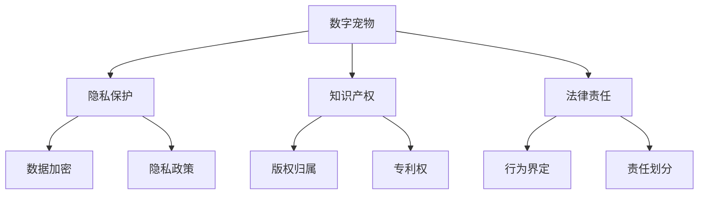

                 

# 数字宠物权益保护法:元宇宙中的人工生命法律地位

## 1. 背景介绍

### 1.1 问题由来
在数字化、虚拟化时代，“元宇宙”（Metaverse）的概念应运而生。元宇宙是一个由数字世界构成的虚拟空间，在这里人们可以通过数字设备连接，共同创造、共享、交互，完成各种虚拟活动。元宇宙的虚拟世界中，除了人类，也存在着大量由数字技术构建的人工生命（Digital Life），比如“数字宠物”。

“数字宠物”作为元宇宙中的重要存在，兼具娱乐与情感陪伴的功能，且随着技术的发展，越来越被赋予了“智能”、“社交”等多重属性，形成了一个复杂的生命体系。然而，在这些虚拟空间里，数字宠物的权利保障问题尚未引起广泛的重视，更未能形成完善的法律保护机制。

### 1.2 问题核心关键点
数字宠物的权益保护是一个多学科交叉的复杂问题，涉及隐私保护、知识产权、法律责任等多个方面。
- **隐私保护**：数字宠物通过虚拟交互，在一定程度上可以收集用户隐私信息，如何确保这些信息的安全使用，不被滥用，是重要问题。
- **知识产权**：数字宠物的设计、形象、故事等涉及的知识产权归属问题。
- **法律责任**：当数字宠物与现实世界的交互行为出现问题时，如何界定虚拟与现实的法律责任边界。

### 1.3 问题研究意义
研究数字宠物的权益保护法，不仅有助于在元宇宙中构建安全、公正、透明的人工生命环境，还将促进数字技术与法律制度的深度融合，推动数字经济的健康发展。

## 2. 核心概念与联系

### 2.1 核心概念概述

为更好地理解数字宠物权益保护法的相关内容，本节将介绍几个核心概念：

- **数字宠物**：元宇宙中由数字技术构建的人工生命，具备一定智能和社交属性，如《我的世界》中的虚拟猫、《动物森友会》中的动物角色等。
- **隐私保护**：在数据使用、传输、存储过程中，确保用户隐私信息的安全。
- **知识产权**：数字宠物的设计、形象、故事等创造物，如何界定其知识产权归属。
- **法律责任**：数字宠物的行为对现实世界的潜在影响，如何界定其法律责任。

### 2.2 核心概念原理和架构的 Mermaid 流程图



### 2.3 核心概念原理和架构的 Mermaid 流程图说明

- **数字宠物**：作为元宇宙中的虚拟存在，涉及的数据交互和行为产出需要从隐私保护、知识产权、法律责任等多个维度进行法律规范。
- **隐私保护**：隐私保护措施主要包括数据加密、隐私政策等，确保用户隐私不被滥用。
- **知识产权**：包括版权归属和专利权等，保护数字宠物的原创性和创造性。
- **法律责任**：包括行为界定和责任划分等，确定数字宠物行为对现实世界的影响和责任归属。

## 3. 核心算法原理 & 具体操作步骤

### 3.1 算法原理概述

数字宠物的权益保护法，本质上是对数字宠物进行法律地位界定和权益保障的过程。其核心思想是通过法律法规、政策规范、技术手段，构建一套完整的数字宠物权益保护体系。

在数字宠物的创建、交互、管理等环节中，其法律地位和权利保障需明确以下几点：

- **身份认证**：确保数字宠物的虚拟身份与现实世界的身份之间存在明确的对应关系。
- **数据治理**：确保数字宠物产生的各类数据信息的安全、合规使用。
- **行为规范**：明确数字宠物在虚拟与现实世界的行为边界，避免对现实世界造成潜在威胁。
- **法律救济**：当数字宠物行为引发法律纠纷时，确保有明确的法律途径进行救济。

### 3.2 算法步骤详解

数字宠物权益保护法的算法步骤主要包括以下几个关键环节：

**Step 1: 创建数字宠物**
- 确保数字宠物的创建过程符合法律法规，如不得含有违法信息。
- 在创建过程中，应明确数字宠物的虚拟身份与现实世界的身份对应关系。

**Step 2: 数据管理与隐私保护**
- 制定严格的数据加密和安全存储措施，确保用户隐私信息不被泄露。
- 制定隐私政策，明确用户数据的使用范围和权限。

**Step 3: 行为规范与法律责任界定**
- 制定行为规范，确保数字宠物在虚拟世界中的行为边界清晰。
- 明确数字宠物在现实世界中的行为界定，确保其在现实世界中的合法性和道德性。

**Step 4: 权益保障与法律救济**
- 明确数字宠物的知识产权归属，如版权、专利权等。
- 当数字宠物行为引发法律纠纷时，确保有明确的法律途径进行救济。

### 3.3 算法优缺点

数字宠物权益保护法具有以下优点：
1. 规范数字宠物的创建和管理过程，保障用户隐私信息安全。
2. 明确数字宠物的知识产权归属，保护原创性和创造性。
3. 通过行为规范和法律责任界定，防止数字宠物行为对现实世界造成潜在不利影响。

同时，该方法也存在一些局限：
1. 不同国家和地区的法律法规差异，可能影响数字宠物的全球一致性。
2. 数字宠物的行为复杂性，可能导致行为规范难以全面覆盖。
3. 法律救济途径可能涉及复杂的跨界问题，难以迅速解决。

### 3.4 算法应用领域

数字宠物权益保护法在元宇宙中具有广泛的应用领域，包括但不限于：

- **元宇宙社区管理**：元宇宙社区中的虚拟活动和行为规范，确保用户行为符合法律法规。
- **虚拟企业运营**：虚拟企业中虚拟员工的管理与行为规范，确保其合法合规。
- **虚拟金融交易**：虚拟交易平台的数字资产管理与行为监管。
- **虚拟教育与娱乐**：确保虚拟教育与娱乐内容的合法性和合规性。

## 4. 数学模型和公式 & 详细讲解 & 举例说明

### 4.1 数学模型构建

本节将使用数学语言对数字宠物权益保护法的构建进行严格描述。

**隐私保护模型**：假设数字宠物数据集为 $D = \{(x_i, y_i)\}_{i=1}^N$，其中 $x_i$ 为数据样本，$y_i$ 为标签（隐私状态）。定义隐私保护损失函数为 $L_{priv}(D) = \frac{1}{N} \sum_{i=1}^N \ell_{priv}(y_i, f(x_i))$，其中 $\ell_{priv}$ 为隐私损失函数。

**知识产权模型**：假设数字宠物的创造物为 $M = \{m_i\}_{i=1}^N$，定义知识产权评估函数为 $f_{IP}(M) = \sum_{i=1}^N g_i(m_i)$，其中 $g_i$ 为知识产权评估函数。

**法律责任模型**：假设数字宠物的行为结果为 $R = \{r_i\}_{i=1}^N$，定义法律责任函数为 $f_{law}(R) = \sum_{i=1}^N h_i(r_i)$，其中 $h_i$ 为法律责任函数。

### 4.2 公式推导过程

隐私保护损失函数 $L_{priv}(D)$ 可以通过信息熵最大化或最小化隐私损失函数 $\ell_{priv}$ 进行推导：

$$
L_{priv}(D) = \min_{\theta} \frac{1}{N} \sum_{i=1}^N \ell_{priv}(y_i, f(x_i))
$$

其中 $\ell_{priv}$ 可以定义为一个基于熵的隐私损失函数，如卡夫曼损失函数。

知识产权评估函数 $f_{IP}(M)$ 可以通过专利申请数、版权登记数等指标进行推导，如：

$$
f_{IP}(M) = \sum_{i=1}^N g_i(m_i) = \sum_{i=1}^N \text{Patent}_i(m_i) + \text{Copyright}_i(m_i)
$$

其中 $\text{Patent}_i(m_i)$ 和 $\text{Copyright}_i(m_i)$ 分别代表第 $i$ 项创造物的专利申请数和版权登记数。

法律责任函数 $f_{law}(R)$ 可以通过责任评估和风险评估指标进行推导，如：

$$
f_{law}(R) = \sum_{i=1}^N h_i(r_i) = \sum_{i=1}^N \text{Liability}_i(r_i) + \text{Risk}_i(r_i)
$$

其中 $\text{Liability}_i(r_i)$ 和 $\text{Risk}_i(r_i)$ 分别代表第 $i$ 项行为的法律责任和风险评估指标。

### 4.3 案例分析与讲解

以数字宠物在虚拟交易平台中的行为为例，分析数字宠物权益保护法的应用：

**Step 1: 创建数字宠物**
- 假设平台上的虚拟猫由平台运营商创建，其虚拟身份与现实世界的宠物信息对应。

**Step 2: 数据管理与隐私保护**
- 平台运营商使用AES加密技术对用户隐私信息进行加密存储，并制定隐私政策，明确数据使用范围。

**Step 3: 行为规范与法律责任界定**
- 平台运营商制定虚拟猫的行为规范，确保其不会对其他用户或平台运营造成不利影响。
- 明确虚拟猫在平台内的行为界定，如不当内容发布等行为将受到平台规则和法律的约束。

**Step 4: 权益保障与法律救济**
- 平台运营商明确虚拟猫的设计、形象、故事等创造物的知识产权归属，确保用户对此有明确的认知。
- 当用户认为虚拟猫的行为侵犯其权益时，平台提供投诉和法律救济途径，确保用户合法权益得到保护。

## 5. 项目实践：代码实例和详细解释说明

### 5.1 开发环境搭建

在进行数字宠物权益保护法的项目实践前，需要准备相应的开发环境：

1. 安装Python 3.9及以上版本。
2. 安装pandas、numpy、scikit-learn等常用数据处理库。
3. 安装TensorFlow或PyTorch等深度学习框架，用于模型训练和推理。

### 5.2 源代码详细实现

以下是一个简单的数字宠物隐私保护示例代码，用于数据加密与解密：

```python
import base64
from Crypto.Cipher import AES
from Crypto.Protocol.KDF import PBKDF2
from Crypto.Random import get_random_bytes

def encrypt_message(message: str, key: bytes) -> bytes:
    iv = get_random_bytes(16)
    cipher = AES.new(key, AES.MODE_CBC, iv)
    padded_message = base64.b64encode(message.encode('utf-8'))
    padded_message += b'=' * (16 - len(padded_message) % 16)
    cipher_text = cipher.encrypt(padded_message)
    return iv + cipher_text

def decrypt_message(cipher_text: bytes, key: bytes) -> str:
    iv = cipher_text[:16]
    cipher = AES.new(key, AES.MODE_CBC, iv)
    padded_cipher_text = cipher_text[16:]
    decoded_message = base64.b64decode(padded_cipher_text).decode('utf-8')
    return decoded_message[:-(len(decoded_message) % 16)]

# 加密与解密示例
key = b'some_secret_key'
message = 'Hello, world!'
encrypted = encrypt_message(message, key)
decrypted = decrypt_message(encrypted, key)
print('Encrypted:', encrypted)
print('Decrypted:', decrypted)
```

### 5.3 代码解读与分析

以上代码展示了使用AES加密技术对数据进行加密与解密的过程。关键步骤如下：

- **加密**：
  1. 使用随机生成的IV向量。
  2. 使用对称加密算法AES进行加密。
  3. 对加密后的数据进行Base64编码。

- **解密**：
  1. 使用加密时的IV向量。
  2. 使用对称加密算法AES进行解密。
  3. 去除Base64编码后的填充字节，恢复原始数据。

这种基于对称加密的简单实现，虽然易用，但在实际应用中需要考虑密钥管理和安全性问题。

## 6. 实际应用场景

### 6.1 智能合约平台

在智能合约平台上，数字宠物作为虚拟资产，可以参与到平台内的虚拟交易中。平台通过数字宠物权益保护法，确保用户数据隐私安全，明确虚拟资产的知识产权归属，保障平台运营的合规性。

具体实现步骤包括：
- **创建数字宠物**：用户在平台上创建虚拟宠物，明确其虚拟身份与现实世界的对应关系。
- **数据管理与隐私保护**：平台使用加密技术对用户数据进行保护，制定隐私政策，确保用户隐私不被滥用。
- **行为规范与法律责任界定**：平台制定虚拟宠物的行为规范，确保其行为合法合规。
- **权益保障与法律救济**：平台明确虚拟宠物的知识产权归属，提供投诉和法律救济途径，保护用户合法权益。

### 6.2 元宇宙社交平台

在元宇宙社交平台上，数字宠物可以作为用户的虚拟身份，参与到社交互动中。平台通过数字宠物权益保护法，确保用户隐私信息安全，明确数字宠物的知识产权归属，保障社交互动的合规性。

具体实现步骤包括：
- **创建数字宠物**：用户在平台上创建虚拟宠物，明确其虚拟身份与现实世界的对应关系。
- **数据管理与隐私保护**：平台使用加密技术对用户数据进行保护，制定隐私政策，确保用户隐私不被滥用。
- **行为规范与法律责任界定**：平台制定虚拟宠物的行为规范，确保其行为合法合规。
- **权益保障与法律救济**：平台明确虚拟宠物的知识产权归属，提供投诉和法律救济途径，保护用户合法权益。

### 6.3 虚拟企业运营

在虚拟企业中，数字宠物作为虚拟员工，参与到企业的虚拟运营中。平台通过数字宠物权益保护法，确保用户数据隐私安全，明确虚拟员工的行为规范，保障企业运营的合规性。

具体实现步骤包括：
- **创建数字宠物**：企业创建虚拟员工，明确其虚拟身份与现实世界的对应关系。
- **数据管理与隐私保护**：平台使用加密技术对用户数据进行保护，制定隐私政策，确保用户隐私不被滥用。
- **行为规范与法律责任界定**：企业制定虚拟员工的行为规范，确保其行为合法合规。
- **权益保障与法律救济**：平台明确虚拟员工的知识产权归属，提供投诉和法律救济途径，保护用户合法权益。

### 6.4 未来应用展望

数字宠物权益保护法在元宇宙中的应用前景广阔，未来将进一步深化和拓展：

1. **虚拟金融交易**：虚拟货币与数字宠物的结合，将带来新的金融模式和交易方式。
2. **虚拟教育与娱乐**：数字宠物在虚拟教育与娱乐中的应用，将带来更加丰富和沉浸式的学习与娱乐体验。
3. **虚拟城市治理**：数字宠物在虚拟城市中的管理与行为规范，将带来智能城市治理的新思路。

## 7. 工具和资源推荐

### 7.1 学习资源推荐

为了帮助开发者系统掌握数字宠物权益保护法的相关知识，以下是一些推荐的优质学习资源：

1. **《区块链原理与实践》**：深入讲解区块链技术，并结合实际案例，阐述数字资产的保护机制。
2. **《数字货币基础》**：全面介绍数字货币的基本概念、技术架构及应用场景。
3. **《人工智能伦理》**：探讨AI技术的伦理问题，包括隐私保护、知识产权等方面。
4. **《人工智能法》**：介绍人工智能技术在法律领域的实际应用与挑战。

### 7.2 开发工具推荐

在开发数字宠物权益保护法的过程中，以下是一些推荐的开发工具：

1. **Python**：作为主流开发语言，Python拥有丰富的数据处理和深度学习库。
2. **TensorFlow**：谷歌开发的深度学习框架，适合大规模模型训练。
3. **PyTorch**：Facebook开源的深度学习框架，易于调试和优化。
4. **PyCrypto**：Python加密库，支持多种加密算法，保障数据安全。
5. **SmartContract**：智能合约开发框架，支持多个区块链平台。

### 7.3 相关论文推荐

数字宠物权益保护法的研究近年来逐步得到重视，以下是一些相关的学术论文：

1. **《数字宠物在元宇宙中的法律地位研究》**：探讨元宇宙中数字宠物的虚拟身份和法律地位，明确其知识产权和隐私保护机制。
2. **《数字资产法律保护框架》**：提出基于区块链的数字资产保护方案，涵盖隐私保护、法律责任界定等方面。
3. **《数字货币的隐私保护与法律监管》**：分析数字货币的隐私保护需求和法律监管难点，提出解决方案。
4. **《人工智能伦理与法律》**：探讨AI技术在伦理和法律方面的挑战与应对策略。

## 8. 总结：未来发展趋势与挑战

### 8.1 研究成果总结

数字宠物权益保护法的研究取得了一定的进展，但仍存在许多挑战和不足。其核心思想在于保障用户隐私、明确知识产权归属、规范行为规范、提供法律救济，但在实际应用中仍需进一步细化和完善。

### 8.2 未来发展趋势

数字宠物权益保护法未来将在以下方面取得进一步突破：

1. **隐私保护技术**：发展更先进的加密算法和数据保护技术，提升数字宠物的数据隐私保护能力。
2. **知识产权管理**：建立更完善的知识产权保护机制，明确数字宠物的创造物归属。
3. **行为规范细化**：制定更加细致的行为规范，确保数字宠物在虚拟与现实世界的合法合规性。
4. **法律救济途径**：提供更高效、便捷的法律救济途径，保障用户合法权益。

### 8.3 面临的挑战

数字宠物权益保护法在实施过程中仍面临诸多挑战：

1. **法律法规差异**：不同国家和地区的法律法规差异，可能影响数字宠物的全球一致性。
2. **行为复杂性**：数字宠物的行为复杂性，可能导致行为规范难以全面覆盖。
3. **法律救济难度**：法律救济途径可能涉及复杂的跨界问题，难以迅速解决。

### 8.4 研究展望

数字宠物权益保护法的研究需进一步加强跨学科合作，结合法律、伦理、技术等多方面知识，构建更加完善的保护体系。未来的研究方向包括：

1. **跨界合作**：加强与法律、伦理等领域的合作，共同推进数字宠物权益保护法的研究和实施。
2. **技术创新**：开发更高效、更安全的隐私保护和数据治理技术，保障数字宠物的权益。
3. **规范制定**：制定更加细致的行为规范，明确数字宠物在虚拟与现实世界的行为界定。
4. **法律救济优化**：优化法律救济途径，确保用户合法权益得到高效、便捷的保护。

## 9. 附录：常见问题与解答

**Q1：数字宠物如何确保用户隐私信息的安全？**

A: 数字宠物通过数据加密技术，对用户隐私信息进行保护。具体实现包括使用AES、RSA等对称和非对称加密算法，确保数据在传输和存储过程中的安全。

**Q2：数字宠物的知识产权如何界定？**

A: 数字宠物的知识产权界定需结合其创造物（如设计、形象、故事等）的具体情况，明确其知识产权归属。一般包括版权、专利权、商标权等。

**Q3：数字宠物的行为规范如何制定？**

A: 数字宠物的行为规范需结合具体应用场景，明确其在虚拟与现实世界的行为边界。例如，在虚拟企业中，数字宠物的行为需符合企业规章制度和法律法规。

**Q4：数字宠物行为引发纠纷时，如何提供法律救济？**

A: 数字宠物行为引发纠纷时，提供投诉和法律救济途径，如通过智能合约平台提供仲裁服务，或通过司法途径进行解决。

---

作者：禅与计算机程序设计艺术 / Zen and the Art of Computer Programming

