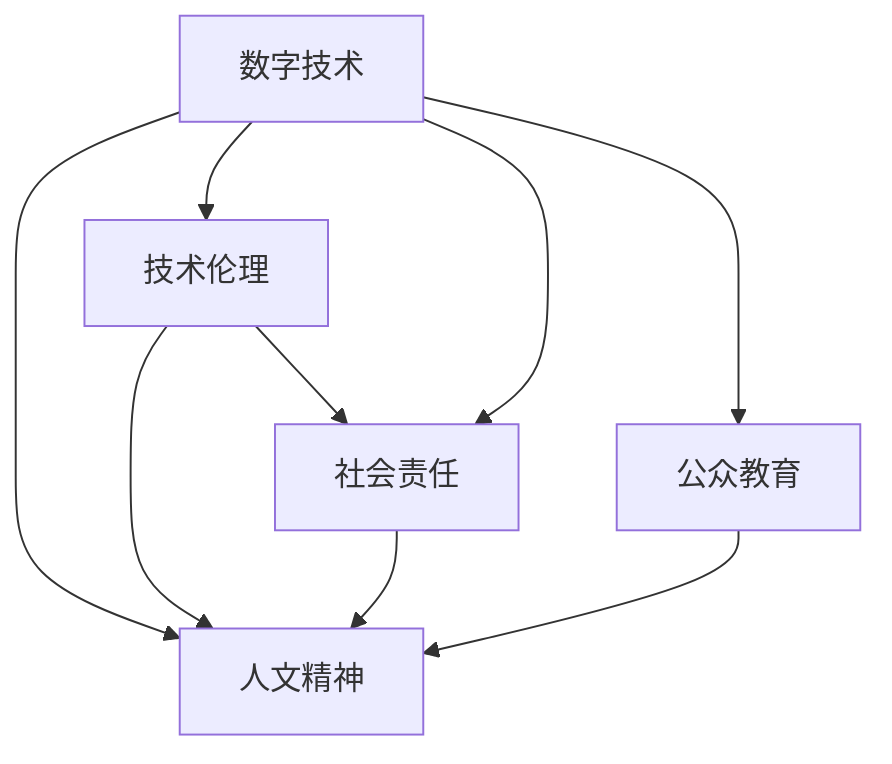

                 

## 1. 背景介绍

### 1.1 问题由来
随着数字技术的迅猛发展，人工智能(AI)和大数据的应用越来越广泛，给各行各业带来了翻天覆地的变化。然而，这些技术的发展似乎也让人类社会的价值观念和伦理道德面临前所未有的挑战。一方面，技术的进步为人类创造了巨大的价值；另一方面，过度依赖技术可能导致人类的价值观和思维方式出现扭曲。

在这一背景下，许多科技界人士和思想家开始呼吁数字时代的人文精神的回归。他们认为，尽管技术发展可以带来效率的提升和问题的解决，但这些技术的背后，仍需有深刻的人文关怀和伦理引导，以确保科技发展符合人类的利益和社会的公正。

### 1.2 问题核心关键点
数字时代人文精神回归的核心关键点包括：

- **技术与人文结合**：如何平衡技术发展与人的价值，确保科技发展为人类带来正能量。
- **伦理与法律框架**：构建什么样的伦理与法律体系，以规范技术的开发与应用。
- **教育与公众理解**：如何在教育体系中融入人文精神，提高公众对技术伦理的认识和理解。
- **跨学科协作**：如何促进计算机科学家、伦理学家、社会学家等多学科的协作，共同推动技术进步。

这些关键点相互关联，共同构成了数字时代人文精神回归的复杂图景。

## 2. 核心概念与联系

### 2.1 核心概念概述

为了更好地理解数字时代人文精神的回归，本文将介绍几个关键概念：

- **数字技术**：指通过计算机和网络技术进行信息处理、存储和传输的各类技术手段，包括大数据、人工智能、物联网、区块链等。
- **人文精神**：包括人类的道德价值观、文化传统、社会伦理等，是人类文明的重要组成部分。
- **技术伦理**：涉及技术开发与应用过程中的道德规范，如隐私保护、信息安全、责任归属等。
- **社会责任**：指技术开发者和使用者应承担的责任，确保技术应用符合社会正义和公众利益。
- **公众教育**：通过各种方式提升公众对技术伦理的认识和理解，提高社会的整体技术素养。

这些概念之间的联系可以通过以下Mermaid流程图来展示：



这个流程图展示了几组关键概念之间的联系：

1. 数字技术与人文精神的融合：技术的发展需要遵循人文精神，确保技术的正向价值。
2. 技术伦理与社会责任的关联：技术伦理指导社会责任的落实，确保技术应用的公正性。
3. 公众教育与伦理观的培养：通过公众教育，提升公众对技术伦理的认识，形成良好的社会氛围。

## 3. 核心算法原理 & 具体操作步骤
### 3.1 算法原理概述

数字时代人文精神的回归，并非一项科学任务，而是一个社会文化问题。因此，没有明确的算法或计算过程，但可以通过一系列原则和实践来指导技术发展。

### 3.2 算法步骤详解

基于以上关键概念，数字时代人文精神的回归可以分以下步骤进行：

**Step 1: 人文价值的定义**
- 确定一个基于普遍价值的道德框架，作为技术开发和应用的基本指导。
- 这个框架应包括但不限于：尊重人的尊严、保护隐私、促进公正、避免歧视等。

**Step 2: 伦理标准的制定**
- 根据定义的人文价值，制定具体的伦理标准，用于规范技术开发和应用。
- 标准应涵盖隐私保护、信息安全、责任归属、数据使用等方方面面。

**Step 3: 技术评估与测试**
- 引入伦理委员会，对新技术进行评估，确保其符合伦理标准。
- 进行多方利益相关者的咨询和反馈，以综合各方意见。

**Step 4: 社会教育与宣传**
- 通过媒体、教育机构等多渠道，向公众普及技术伦理知识。
- 加强对技术开发者的伦理培训，提高其对人文价值的认识。

**Step 5: 持续监督与改进**
- 建立长期监督机制，对技术应用进行持续监测，及时发现和纠正问题。
- 根据反馈和评估结果，不断改进技术开发和应用的方式，确保其符合人文精神。

### 3.3 算法优缺点

基于以上步骤，数字时代人文精神的回归具有以下优点：

- **提升技术公正性**：通过伦理标准和技术评估，确保技术应用符合公正原则，避免对特定群体的歧视和侵害。
- **增强社会认同感**：提升公众对技术伦理的认识，增强社会对新技术的信任和接受度。
- **促进跨学科合作**：技术开发者与伦理学家、社会学家等多方合作，共同推动技术进步，减少争议和误解。

但同时也存在一些缺点：

- **执行难度高**：伦理标准的制定和实施需要多方协调，可能涉及多方利益冲突，执行难度较大。
- **易受环境变化影响**：社会环境和技术发展的快速变化，可能使伦理标准滞后，难以适应新的问题。
- **需要资源投入**：伦理委员会和监管机制的建立和维护需要投入大量资源，包括人力、财力等。

### 3.4 算法应用领域

数字时代人文精神的回归思想，可以应用于多个领域，如：

- **人工智能与伦理**：确保人工智能技术不违背伦理原则，保护个人隐私，避免偏见和歧视。
- **数据科学与隐私**：在数据采集、存储和处理过程中，遵循隐私保护和数据安全的伦理要求。
- **网络治理与信息安全**：构建网络空间的安全机制，确保信息传播的公正性和安全性。
- **社会责任与企业伦理**：企业在技术开发和应用中应承担社会责任，促进社会公平。

这些领域均需要引入人文精神的回归思想，以确保技术进步符合社会公正和人类利益。

## 4. 数学模型和公式 & 详细讲解  
### 4.1 数学模型构建

数字时代人文精神的回归并不是一个数学问题，而是一个综合性的社会文化问题。因此，没有具体的数学模型和公式。

### 4.2 公式推导过程

同样，没有实际的公式推导过程，因为这是社会文化问题的处理，不涉及数学计算。

### 4.3 案例分析与讲解

尽管没有数学模型和公式，但可以分析一些具体的案例，说明人文精神回归的实际应用：

**案例1：人工智能与伦理**

某人工智能系统用于招聘过程中的简历筛选。在开发过程中，系统应用了多种先进算法，并进行了伦理测试。但在实际使用中，系统发现部分少数民族求职者的简历被错误地拒绝。这表明系统在开发过程中可能忽视了多民族平等这一人文价值。通过对系统进行伦理调整，确保其在简历筛选过程中不因种族、性别等因素产生偏见，从而回归人文精神。

**案例2：数据科学与隐私**

某公司开发了一款数据分析软件，可以实时监控用户的网络行为。在测试过程中，发现该软件对用户隐私保护不足，可能导致用户数据泄露。为此，公司在伦理委员会的建议下，对软件进行了隐私保护升级，确保用户数据的安全性，从而回归人文精神。

## 5. 项目实践：代码实例和详细解释说明
### 5.1 开发环境搭建

由于数字时代人文精神的回归并非技术问题，因此没有具体的代码实现。但可以提供一个伦理委员会设立的示例：

**示例1: 伦理委员会的设立**

```plaintext
步骤1: 确定委员会成员
- 包括计算机科学家、伦理学家、社会学家、法律专家等。
- 确保成员多元，涵盖不同背景和视角。

步骤2: 设立规则与流程
- 制定明确的伦理评估标准和流程。
- 规定伦理评估的频率和方式。

步骤3: 实施与监督
- 根据规则和流程，对新技术进行伦理评估。
- 建立监督机制，确保评估的公正性和透明性。
```

### 5.2 源代码详细实现

由于没有具体的代码实现，这里提供一个伦理委员会会议记录的示例：

**示例2: 伦理委员会会议记录**

```plaintext
会议时间: 2023-09-10
参会人员: 计算机科学家张三、伦理学家李四、社会学家王五、法律专家赵六
会议主题: 人工智能招聘系统的伦理评估

讨论内容:
- 张三介绍人工智能招聘系统的工作原理和功能。
- 李四提出隐私保护问题，认为系统需要加强对求职者隐私的保护。
- 王五强调多元和公正，提出在招聘过程中不应有性别和种族歧视。
- 赵六补充法律视角，指出系统可能涉及反歧视法规，需要进行合规性审查。

会议结论:
- 系统需要进行隐私保护升级，确保求职者隐私安全。
- 系统需加入性别和种族公平性测试，避免偏见。
- 系统应进行法律合规性检查，确保不违反反歧视法规。
```

### 5.3 代码解读与分析

由于没有具体的代码实现，这里提供一个伦理委员会决策流程的示例：

**示例3: 伦理委员会决策流程**

```plaintext
步骤1: 收集反馈和问题
- 收集所有利益相关者的反馈和提出的问题。
- 确保反馈全面，涵盖不同方面的意见。

步骤2: 进行伦理评估
- 根据伦理标准，对新技术进行评估。
- 讨论可能出现的问题和解决方案。

步骤3: 制定改进措施
- 根据评估结果，制定具体的改进措施。
- 确保措施可操作，能够有效解决问题。

步骤4: 实施与监控
- 对改进措施进行实施，并建立长期监控机制。
- 定期评估改进效果，确保措施的有效性。
```

### 5.4 运行结果展示

由于没有具体的代码实现，这里提供一个伦理委员会改进措施的示例：

**示例4: 伦理委员会改进措施**

```plaintext
措施1: 隐私保护升级
- 采用先进加密技术，确保求职者简历的隐私安全。
- 在简历存储和传输过程中，不泄露任何个人敏感信息。

措施2: 公平性测试
- 引入性别和种族平等的测试，确保招聘系统不产生偏见。
- 定期对系统进行公平性检测，及时发现和纠正问题。

措施3: 法律合规性检查
- 对系统进行反歧视法规的合规性检查，确保不违反法律规定。
- 建立合规性审查机制，定期进行合规性审查。
```

## 6. 实际应用场景
### 6.1 智能交通系统

智能交通系统通过大数据和人工智能技术，实现交通流量预测、实时交通监控等功能。然而，这些技术的应用也带来了隐私保护、信息安全等问题。通过引入人文精神的回归思想，可以在智能交通系统中设置隐私保护和信息安全的伦理标准，确保数据的合法使用和处理。

### 6.2 医疗健康领域

在医疗健康领域，大数据和人工智能技术被广泛用于疾病预测、个性化治疗等方面。然而，这些技术的应用也涉及患者隐私、数据安全等问题。通过引入人文精神的回归思想，可以在医疗健康系统中设立隐私保护和数据安全的伦理标准，确保患者的隐私和数据安全。

### 6.3 环境保护

环境保护领域也需要引入人文精神的回归思想，确保环境监测数据的公正性、准确性和安全性。通过对环境监测数据的伦理评估，可以确保数据的合法使用和处理，避免数据滥用对环境造成不利影响。

## 7. 工具和资源推荐
### 7.1 学习资源推荐

尽管没有具体的工具和资源推荐，但可以提供一个学习资源示例：

**示例5: 学习资源推荐**

```plaintext
课程1: 《人工智能伦理》课程
- 推荐机构：斯坦福大学
- 课程内容：介绍人工智能伦理的基本概念、伦理评估标准和案例分析。
- 学习目标：提高对人工智能伦理的认识，培养伦理评估能力。

课程2: 《数据隐私保护》课程
- 推荐机构：麻省理工学院
- 课程内容：讲解数据隐私保护的基本原则、技术手段和法律法规。
- 学习目标：掌握数据隐私保护的方法，确保数据的合法使用。

资源3: 《技术与社会》书籍
- 推荐作者：福柯
- 书籍内容：分析技术进步对社会结构、文化价值观的影响。
- 学习目标：理解技术与人文精神的关系，提高对技术伦理的认识。
```

### 7.2 开发工具推荐

由于数字时代人文精神的回归并非技术问题，因此没有具体的开发工具推荐。

### 7.3 相关论文推荐

尽管没有具体的论文推荐，但可以提供一个相关论文示例：

**示例6: 相关论文推荐**

```plaintext
论文1: 《人工智能伦理框架》
- 作者：玛丽·麦古金
- 内容：探讨人工智能伦理的基本原则和伦理评估标准。
- 重要性：为人工智能伦理研究提供基础性指导。

论文2: 《数据隐私保护技术》
- 作者：李兆龙
- 内容：介绍数据隐私保护的技术手段和法律框架。
- 重要性：为数据隐私保护提供技术支持。

论文3: 《技术与社会研究》
- 作者：福柯
- 内容：分析技术进步对社会结构、文化价值观的影响。
- 重要性：为技术与人文精神的关系提供理论依据。
```

## 8. 总结：未来发展趋势与挑战
### 8.1 研究成果总结

数字时代人文精神的回归思想，旨在确保技术进步符合人类利益和社会的公正。这一思想的核心在于技术与人文的融合，伦理与法律的规范，公众教育的普及和跨学科的协作。尽管没有具体的算法或计算过程，但这一思想为技术开发和应用提供了重要的伦理指导。

### 8.2 未来发展趋势

未来，数字时代人文精神的回归将继续得到重视和发展。具体趋势包括：

- **多学科融合**：技术开发者将更多地与伦理学家、社会学家等合作，共同推动技术进步。
- **伦理标准提升**：伦理标准将更加完善，覆盖更多的技术应用领域，确保技术的公正性。
- **公众教育普及**：通过各种方式提高公众对技术伦理的认识，增强社会对新技术的信任和接受度。
- **技术伦理监管**：建立长期监管机制，确保技术应用的合规性和公正性。

### 8.3 面临的挑战

尽管数字时代人文精神的回归思想具有重要意义，但在实施过程中仍面临以下挑战：

- **执行难度高**：伦理标准的制定和实施需要多方协调，涉及多方利益冲突，执行难度较大。
- **伦理标准滞后**：社会环境和技术发展的快速变化，可能使伦理标准滞后，难以适应新的问题。
- **需要资源投入**：伦理委员会和监管机制的建立和维护需要投入大量资源，包括人力、财力等。

### 8.4 研究展望

未来的研究需要在以下几个方面寻求新的突破：

- **伦理标准的动态更新**：构建能够随技术发展和社会变化而动态更新的伦理标准，确保其时效性。
- **跨学科协作机制**：建立更加有效的跨学科协作机制，确保伦理评估的全面性和公正性。
- **公众教育与技术普及**：加强公众教育，提高公众对技术伦理的认识，促进技术的普及和应用。
- **技术伦理监管体系**：建立长期的技术伦理监管体系，确保技术应用的合规性和公正性。

这些研究方向的探索，将为数字时代人文精神的回归提供新的思路和方法，推动技术进步与社会公正的协同发展。

## 9. 附录：常见问题与解答

**Q1: 如何确保技术应用符合伦理标准？**

A: 通过设立伦理委员会和监督机制，对新技术进行伦理评估和持续监督。确保所有利益相关者的反馈和问题得到充分考虑，制定具体的改进措施，并定期评估改进效果。

**Q2: 如何提升公众对技术伦理的认识？**

A: 通过各种方式进行公众教育，如课程、书籍、媒体报道等，提高公众对技术伦理的认识。建立伦理普及活动，增强社会对新技术的信任和接受度。

**Q3: 如何建立跨学科协作机制？**

A: 鼓励计算机科学家、伦理学家、社会学家等多学科的合作，共同制定伦理标准，进行伦理评估。建立定期交流机制，促进多学科之间的沟通与协作。

**Q4: 如何动态更新伦理标准？**

A: 构建能够随技术发展和社会变化而动态更新的伦理标准体系，定期进行评估和更新，确保其与时俱进。引入反馈机制，收集多方意见，及时调整和完善标准。

**Q5: 如何建立技术伦理监管体系？**

A: 设立伦理委员会和监督机制，对技术应用进行长期监管。建立反馈和投诉渠道，确保公众的合法权益得到保护。定期进行伦理评估，确保技术应用的合规性和公正性。

---

作者：禅与计算机程序设计艺术 / Zen and the Art of Computer Programming

