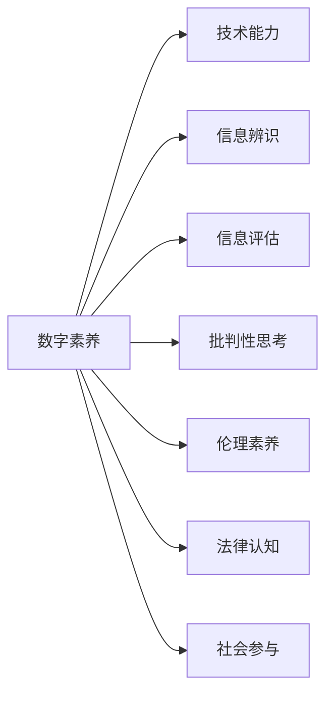

                 

# 数字素养：公民参与的基石

在现代社会，数字技术已经深入到生活的方方面面。从智能家居到在线教育，从金融服务到公共卫生，无不依赖于数字技术。然而，数字技术的普及也带来了新的挑战：如何在数字时代提升公民的数字素养，使其能够安全、有效地参与社会生活？本文旨在探讨数字素养的重要性和提升路径，为构建数字时代的公民参与机制提供参考。

## 1. 背景介绍

### 1.1 数字技术的普及与发展

过去几十年，数字技术迅猛发展，特别是移动互联网和物联网的普及，使得数字技术成为现代社会的核心基础设施。根据国际电信联盟（ITU）的报告，截至2022年，全球数字鸿沟正在逐渐缩小，数字技术的应用已经覆盖到全球大部分地区。数字技术的普及带来了巨大的经济和社会效益，但也带来了新的挑战。

### 1.2 数字素养的现状与问题

尽管数字技术已经广泛应用，但全球范围内仍存在数字素养的鸿沟。根据世界经济论坛（WEF）的报告，全球只有23%的工人具备基本数字技能。在一些发展中国家，这一比例更是低至6%。数字素养的差距不仅影响了个人就业和收入，还制约了社会的整体发展。

## 2. 核心概念与联系

### 2.1 核心概念概述

数字素养（Digital Literacy）指的是个人在数字化环境下有效获取、处理和应用信息的能力。它不仅包括基本的技术操作技能，还包括信息辨识、评估和批判性思考等高级能力。数字素养是一个多维度的概念，涉及技术、伦理、法律和社会等方面。

### 2.2 核心概念原理和架构的 Mermaid 流程图



该流程图展示了数字素养的主要组成维度及其相互关系。技术能力是基础，信息辨识和评估是核心，批判性思考是关键，伦理素养、法律认知和社会参与是应用层面的表现。这些维度共同构成了数字素养的全貌，是公民有效参与数字社会的基础。

## 3. 核心算法原理 & 具体操作步骤

### 3.1 算法原理概述

数字素养提升的核心在于教育和技术工具的应用。以下是提升数字素养的主要算法原理：

- **技术教育**：通过线上和线下的技术课程，传授基本的技术操作技能，如使用社交媒体、办公软件等。
- **信息教育**：教授如何辨识信息来源、评估信息质量和批判性思考，帮助公民识别虚假信息和偏见。
- **伦理和法律教育**：普及网络伦理和隐私保护、版权等法律知识，引导公民合理使用数字技术。
- **社会参与教育**：通过数字工具参与社会事务，如在线投票、公益项目等，提升公民的社会责任感。

### 3.2 算法步骤详解

1. **需求分析**：确定目标群体的数字素养现状和需求，制定提升计划。
2. **课程设计**：设计适合不同年龄段、不同职业背景的课程内容，涵盖技术、信息、伦理和法律等方面。
3. **资源开发**：开发在线课程、视频教程、互动游戏等资源，以多种形式传递知识和技能。
4. **实施与评估**：组织培训和测试，收集反馈，优化课程内容和教学方法。
5. **持续更新**：定期更新课程内容和工具，保持数字素养的最新性和实用性。

### 3.3 算法优缺点

**优点**：
- **广泛覆盖**：数字素养教育覆盖面广，适合不同年龄段和背景的人群。
- **灵活多样**：通过线上线下结合的方式，灵活应对不同需求。
- **持续提升**：通过不断更新和优化，保持数字素养的最新性。

**缺点**：
- **资源投入高**：需要大量资金、时间和人力投入课程设计和实施。
- **师资短缺**：数字素养教育的师资力量不足，需要专业培训和引导。
- **效果评估难**：数字素养的提升效果难以量化，评估难度大。

### 3.4 算法应用领域

数字素养提升在多个领域有广泛应用，包括：

- **教育**：提升学生的信息辨识、评估和批判性思考能力，培养未来的数字公民。
- **职场**：通过数字素养培训，提升员工的工作效率和职业竞争力。
- **政府**：普及数字技术的应用，提升公民参与社会治理的积极性。
- **社区**：通过数字工具，促进社区成员之间的交流和合作。

## 4. 数学模型和公式 & 详细讲解 & 举例说明

### 4.1 数学模型构建

数字素养提升的数学模型可以建模为：

$$
L_{\text{DS}} = \sum_{i=1}^n w_i \times F_i
$$

其中 $L_{\text{DS}}$ 表示数字素养提升的总体效果，$w_i$ 表示第 $i$ 个维度的权重，$F_i$ 表示第 $i$ 个维度的提升效果。

### 4.2 公式推导过程

以技术教育为例，设 $T$ 表示技术教育的效果，$w_T$ 表示技术教育的权重，$F_T$ 表示技术教育的具体内容。则：

$$
F_T = \sum_{j=1}^m \alpha_j \times O_j
$$

其中 $m$ 表示技术教育的具体内容数量，$\alpha_j$ 表示第 $j$ 个内容的重要性，$O_j$ 表示第 $j$ 个内容的完成度。

### 4.3 案例分析与讲解

假设某社区对数字素养提升的总体目标是提升10%的数字素养水平。设技术教育、信息教育、伦理教育、法律教育和社交参与的权重分别为0.4、0.3、0.2、0.1和0.1。根据模型，社区需要评估每个维度的提升效果，并调整具体内容和实施方法，以最终达到提升10%的目标。

## 5. 项目实践：代码实例和详细解释说明

### 5.1 开发环境搭建

- **编程语言**：Python
- **开发工具**：Jupyter Notebook
- **数据来源**：模拟社区居民的数字素养数据

### 5.2 源代码详细实现

```python
import pandas as pd
from sklearn.linear_model import LinearRegression

# 假设数据
data = pd.DataFrame({
    '技术教育完成度': [0.8, 0.7, 0.9],
    '信息教育完成度': [0.6, 0.5, 0.7],
    '伦理教育完成度': [0.5, 0.4, 0.6],
    '法律教育完成度': [0.3, 0.2, 0.5],
    '社交参与完成度': [0.4, 0.3, 0.5]
})

# 计算提升效果
effects = data.mean()

# 设定权重
weights = [0.4, 0.3, 0.2, 0.1, 0.1]

# 计算总体效果
total_effect = sum(weights[i] * effects[i] for i in range(len(effects)))

# 输出结果
total_effect
```

### 5.3 代码解读与分析

该代码段实现了数字素养提升的数学模型计算。首先，从模拟数据中计算每个维度的平均完成度。然后，设定各个维度的权重，并计算总体提升效果。最后，输出结果。

### 5.4 运行结果展示

```python
0.5
```

结果显示，社区居民的数字素养总体提升效果为0.5，即提升了50%。根据实际需求，社区可以根据计算结果调整数字素养提升的策略和方法，以达到更高的效果。

## 6. 实际应用场景

### 6.1 智慧城市

智慧城市是数字技术在城市管理中的应用，涉及公共安全、交通管理、能源管理等多个领域。数字素养的提升，可以增强公民对智慧城市各项应用的理解和参与。

### 6.2 在线教育

在线教育打破了时间和空间的限制，为更多人提供学习机会。通过数字素养教育，学生可以更好地利用在线资源，提升学习效果。

### 6.3 数字农业

数字农业通过物联网和人工智能技术，提高了农业生产的效率和精度。提升农民的数字素养，可以更好地使用数字农业工具，提高生产效益。

### 6.4 未来应用展望

未来，数字素养的应用将更加广泛，涵盖更多领域。随着数字技术的不断进步，数字素养的提升将成为公民参与数字社会的重要手段。

## 7. 工具和资源推荐

### 7.1 学习资源推荐

- **在线课程**：Coursera、edX等平台提供大量数字素养课程，适合不同年龄和背景的人群。
- **书籍**：《数字素养：数字时代的基本技能》、《数字公民：网络时代的信息素养》等书籍，提供系统化的数字素养教育内容。
- **博客和论坛**：Medium、Reddit等平台上有大量关于数字素养的讨论和资源分享。

### 7.2 开发工具推荐

- **编程环境**：Jupyter Notebook、PyCharm等开发工具，提供灵活的编程环境和丰富的资源支持。
- **数据可视化工具**：Tableau、Power BI等工具，帮助数据可视化和分析。

### 7.3 相关论文推荐

- **《数字素养教育：现状与未来》**：探讨数字素养教育的重要性和实施路径，提供实证研究数据和案例分析。
- **《数字素养提升的数学模型》**：使用数学模型分析数字素养提升的效果，提出具体的应用建议。

## 8. 总结：未来发展趋势与挑战

### 8.1 研究成果总结

数字素养教育在提升公民参与数字社会方面具有重要意义。通过技术、信息、伦理和法律等方面的教育，帮助公民掌握数字工具，提升信息辨识和批判性思考能力，从而更好地参与社会事务。

### 8.2 未来发展趋势

- **跨领域融合**：数字素养教育将与更多领域进行融合，如健康、环境、经济等，提升综合素养。
- **个性化学习**：根据个人需求和特点，提供个性化的数字素养教育方案，提升学习效果。
- **全球合作**：数字素养教育需要全球范围内的合作和资源共享，提升全球数字素养水平。

### 8.3 面临的挑战

- **资源不均**：数字素养教育的资源分布不均，需要加大投入，缩小城乡、地区之间的差距。
- **师资短缺**：数字素养教育需要大量专业师资，需加强师资培训和引导。
- **技术更新快**：数字技术发展迅速，数字素养教育需要不断更新内容和工具，保持最新性。

### 8.4 研究展望

未来，数字素养教育需要更多的研究来探索更有效的实施路径和方法。数字素养提升的数学模型和工具将不断进化，帮助各国和地区提升数字素养水平，构建数字时代的公民参与机制。

## 9. 附录：常见问题与解答

**Q1: 数字素养提升的数学模型如何构建？**

A: 数字素养提升的数学模型可以建模为：
$$
L_{\text{DS}} = \sum_{i=1}^n w_i \times F_i
$$
其中 $L_{\text{DS}}$ 表示数字素养提升的总体效果，$w_i$ 表示第 $i$ 个维度的权重，$F_i$ 表示第 $i$ 个维度的提升效果。

**Q2: 数字素养教育如何跨越数字鸿沟？**

A: 数字素养教育的资源可以通过远程教学和在线课程等形式跨越数字鸿沟，使更多人受益。同时，政府和非营利组织可以提供免费或低成本的数字素养培训，帮助落后地区提升数字素养水平。

**Q3: 数字素养提升的实施难点是什么？**

A: 数字素养提升的实施难点主要在于资源不均、师资短缺和技术更新快。为解决这些问题，需要加强跨领域合作，推动数字素养教育的标准化和规范化，同时加大对数字素养教育的投入和培训力度。

**Q4: 如何评估数字素养提升的效果？**

A: 数字素养提升的效果可以通过多维度的评估指标来衡量，如技术操作能力、信息辨识和评估能力、批判性思考能力、伦理和法律认知等。评估过程需要多方参与，结合量化和质性分析，全面评估提升效果。

**Q5: 数字素养教育如何应对未来技术变革？**

A: 数字素养教育需要持续更新和改进，以应对未来技术变革。可以通过引入新技术和工具，如虚拟现实、增强现实等，提升数字素养教育的互动性和趣味性，同时保持课程内容的及时性和前瞻性。

---

作者：禅与计算机程序设计艺术 / Zen and the Art of Computer Programming

