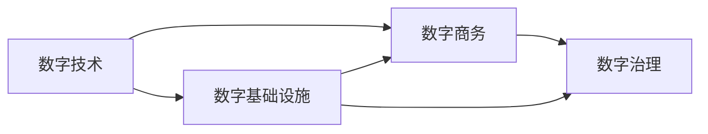

                 

# 数字经济：社会发展的助推器

> 关键词：数字经济,社会变革,技术驱动,创新驱动,智慧城市,数字治理,数字支付,数字商务

## 1. 背景介绍

在过去的几十年里，数字技术正在以前所未有的速度和规模重塑全球经济结构和社会形态。从互联网到移动通信，再到物联网和人工智能，这些技术深刻改变了人们的生活方式和生产方式，催生了新的商业模式和产业生态。其中，数字经济作为驱动现代经济发展的关键力量，正在成为全球竞争新高地。

### 1.1 数字经济的兴起背景

#### 1.1.1 科技进步与经济转型
科技进步是推动数字经济发展的核心驱动力。从计算能力、通信技术到存储设备，技术进步极大地提升了数据的处理能力和传输速度，使得大数据、云计算、人工智能等新技术成为可能。这些技术的融合，催生了智能制造、精准农业、智慧城市等新兴产业，推动了经济向智能化、数字化转型。

#### 1.1.2 全球化与市场竞争
全球化背景下，跨国公司利用数字化手段优化供应链管理，拓展全球市场，提高了生产效率和市场响应速度。与此同时，中小型企业通过数字化转型提升竞争力，开拓新的增长点。这种市场竞争的加剧，促使企业加快技术创新，不断提升产品和服务质量，促进数字经济快速发展。

#### 1.1.3 政策与环境支持
各国政府对数字经济的重视和支持，是推动数字经济发展的另一重要因素。通过制定相关政策、提供资金支持、营造良好的营商环境，各国政府在基础设施建设、人才培养、知识产权保护等方面为数字经济的发展提供了有力保障。

### 1.2 数字经济的核心要素

#### 1.2.1 数据
数据是数字经济的基础资源。通过收集、处理和分析海量数据，企业能够洞察市场趋势、优化产品设计、提升运营效率，从而实现智能化决策。大数据、云计算、人工智能等技术的成熟应用，使得数据能够被更有效地挖掘和利用。

#### 1.2.2 技术
技术是驱动数字经济发展的关键动力。从信息通信技术(ICT)到物联网(IoT)、从人工智能(AI)到区块链(Blockchain)，这些技术不仅改变了人们的生产和生活方式，还催生了新的商业模式和产业生态。技术进步提升了生产效率，降低了交易成本，推动了经济的快速发展。

#### 1.2.3 创新
创新是数字经济的灵魂。通过不断的技术创新和商业模式创新，数字经济实现了从传统经济向智慧经济的转型。创新不仅提升了产品和服务的价值，还开辟了新的市场需求，创造了新的增长点。

## 2. 核心概念与联系

### 2.1 核心概念概述

数字经济的核心概念包括数字技术、数字基础设施、数字商务、数字治理等。这些概念相互关联，共同构成了数字经济的生态系统。

#### 2.1.1 数字技术
数字技术是数字经济的基础。包括互联网、移动通信、物联网、大数据、云计算、人工智能、区块链等新兴技术，这些技术相互融合，形成了支持数字经济发展的技术体系。

#### 2.1.2 数字基础设施
数字基础设施是数字经济的支撑平台。包括高速网络、数据中心、云计算平台等，为数字经济提供了必要的技术支持和数据存储能力。

#### 2.1.3 数字商务
数字商务是数字经济的重要组成部分。通过电子商务、在线支付、社交网络等新兴商业模式的兴起，数字商务极大地改变了传统的商业模式和交易方式。

#### 2.1.4 数字治理
数字治理是数字经济健康发展的保障。包括数字监管、数据安全、隐私保护、知识产权保护等，这些措施确保了数字经济的安全、公正和可持续发展。

### 2.2 核心概念联系

数字经济是一个高度互联、相互依赖的复杂系统。各个概念之间通过数据流动、技术应用、市场竞争等机制，形成了紧密的联系和相互作用。

#### 2.2.1 技术-商务-治理
技术是商务的基础，商务应用促进技术的进一步发展。同时，商务活动需要良好的治理环境来保障其健康运行。技术、商务、治理三者之间形成了相互促进、相互制约的良性循环。

#### 2.2.2 数据-商务-治理
数据是商务的核心资源，通过数据的收集、处理和分析，企业能够洞察市场趋势、优化产品设计、提升运营效率，从而实现智能化决策。同时，数据安全、隐私保护等治理措施，确保了数据的合法使用。

#### 2.2.3 创新-技术-商务
创新是技术发展的驱动力，技术进步提升了商务活动效率，商务模式的创新又推动了技术的进一步应用和发展。三者之间形成了相辅相成的互动关系。

### 2.3 Mermaid流程图



## 3. 核心算法原理 & 具体操作步骤

### 3.1 算法原理概述

数字经济的算法原理主要围绕数据的处理、分析和应用展开。算法通过技术手段，对海量数据进行高效处理和分析，挖掘出有价值的信息，支持决策制定和商务活动。

#### 3.1.1 数据处理算法
数据处理算法包括数据清洗、数据归一化、特征提取等。这些算法通过预处理数据，去除噪音和冗余信息，提取有用特征，为后续分析奠定基础。

#### 3.1.2 数据分析算法
数据分析算法包括统计分析、机器学习、深度学习等。这些算法通过挖掘数据中的规律和模式，发现潜在的商业机会和风险，支持商务决策和优化。

#### 3.1.3 数据应用算法
数据应用算法包括推荐算法、搜索算法、预测算法等。这些算法通过数据驱动的方法，提升用户体验和商务效率，推动商务模式的创新。

### 3.2 算法步骤详解

#### 3.2.1 数据收集
数据收集是数字经济的基础。通过互联网、物联网、社交网络等渠道，收集海量数据，包括用户行为、市场信息、环境数据等。

#### 3.2.2 数据清洗与预处理
对收集到的数据进行清洗和预处理，去除噪音和冗余信息，并进行归一化和特征提取，为后续分析提供干净的输入数据。

#### 3.2.3 数据分析与建模
利用统计分析、机器学习、深度学习等算法，对预处理后的数据进行分析和建模，发现数据中的规律和模式。

#### 3.2.4 数据应用与决策
将分析结果应用于商务活动，支持决策制定和业务优化。如推荐系统、智能客服、供应链优化等。

### 3.3 算法优缺点

#### 3.3.1 优点
- 提升效率：算法通过数据驱动的方法，优化了商务活动的效率，降低了成本。
- 促进创新：算法支持创新思维和商业模式，推动了经济的快速发展。
- 增强竞争力：通过数据分析和挖掘，企业能够洞察市场趋势，制定精准的商务策略，提升竞争力。

#### 3.3.2 缺点
- 数据依赖：算法需要大量高质量数据作为输入，数据不足或质量不高会影响算法效果。
- 技术复杂性：算法涉及复杂的技术和数学模型，对技术要求较高，需要专业的技术和人才支持。
- 隐私和安全问题：数据的使用涉及隐私和安全问题，需要有效的监管和保护措施。

### 3.4 算法应用领域

数字经济的应用领域广泛，涵盖电子商务、智能制造、智慧城市、金融科技等多个方面。

#### 3.4.1 电子商务
电子商务是数字经济的重要组成部分。通过电子商务平台，消费者可以进行在线购物、支付和评价，企业可以进行产品销售和营销。

#### 3.4.2 智能制造
智能制造是数字经济的重要应用。通过物联网和工业互联网，实现生产过程的数字化和智能化，提升生产效率和产品质量。

#### 3.4.3 智慧城市
智慧城市是数字经济的重要目标。通过数字技术的应用，实现城市管理的智能化、高效化和可持续化，提升城市居民的生活质量。

#### 3.4.4 金融科技
金融科技是数字经济的重要引擎。通过大数据、人工智能等技术，提升金融服务的效率和质量，降低交易成本，推动金融创新。

## 4. 数学模型和公式 & 详细讲解 & 举例说明

### 4.1 数学模型构建

#### 4.1.1 数据收集与预处理模型
数据收集与预处理模型的目标是从不同数据源收集数据，并进行清洗和预处理，为后续分析提供干净的输入数据。

#### 4.1.2 数据分析与建模模型
数据分析与建模模型利用机器学习、深度学习等算法，对预处理后的数据进行分析和建模，发现数据中的规律和模式。

#### 4.1.3 数据应用与决策模型
数据应用与决策模型将分析结果应用于商务活动，支持决策制定和业务优化。如推荐系统、智能客服、供应链优化等。

### 4.2 公式推导过程

#### 4.2.1 数据清洗与预处理
数据清洗与预处理公式包括数据归一化、特征提取等。

$$
x_{norm} = \frac{x - \mu}{\sigma}
$$

其中，$x$ 为原始数据，$\mu$ 为均值，$\sigma$ 为标准差。

#### 4.2.2 数据分析与建模
数据分析与建模公式包括线性回归、逻辑回归、决策树等算法。

$$
\hat{y} = w_0 + \sum_{i=1}^{n} w_i x_i
$$

其中，$y$ 为预测值，$w_0, w_1, ..., w_n$ 为模型参数，$x_i$ 为特征。

#### 4.2.3 数据应用与决策
数据应用与决策公式包括推荐算法、搜索算法、预测算法等。

$$
R_k = \sum_{i=1}^{n} P(r_i) \cdot f(r_i, k)
$$

其中，$R_k$ 为推荐结果，$P(r_i)$ 为商品$i$的展示概率，$f(r_i, k)$ 为商品$i$对用户$k$的推荐程度。

### 4.3 案例分析与讲解

#### 4.3.1 电商推荐系统
电商推荐系统利用协同过滤、基于内容的推荐等算法，对用户历史行为进行分析和建模，推荐可能感兴趣的商品。

#### 4.3.2 智能客服
智能客服利用自然语言处理和机器学习技术，对用户问题进行分类和识别，提供个性化回答。

#### 4.3.3 供应链优化
供应链优化利用线性规划、网络流算法等，优化物流路线、库存管理等，提升供应链效率。

## 5. 项目实践：代码实例和详细解释说明

### 5.1 开发环境搭建

#### 5.1.1 环境准备
- 安装Python：从官网下载并安装Python，建议使用3.7或以上版本。
- 安装pip：从官网下载并安装pip，用于安装第三方库。
- 安装相关库：安装numpy、pandas、scikit-learn等常用的数据科学库。

#### 5.1.2 数据准备
- 收集数据：通过网络爬虫、API接口等方式，收集电商、智能制造、智慧城市等领域的公开数据。
- 数据清洗：对收集到的数据进行清洗和预处理，去除噪音和冗余信息。

### 5.2 源代码详细实现

#### 5.2.1 电商推荐系统
```python
import pandas as pd
from sklearn.feature_extraction.text import TfidfVectorizer
from sklearn.decomposition import TruncatedSVD

# 读取数据
data = pd.read_csv('data.csv')

# 数据清洗和预处理
data = data.dropna()
data = data.drop_duplicates()

# 特征提取
vectorizer = TfidfVectorizer()
X = vectorizer.fit_transform(data['item_description'])

# 协同过滤推荐
svd = TruncatedSVD(n_components=10)
svd.fit(X)
X_new = vectorizer.transform(['新产品描述'])
recommendations = svd.transform(X_new).argsort()[-10:]

# 输出推荐结果
print(recommendations)
```

#### 5.2.2 智能客服
```python
from transformers import BertTokenizer, BertForQuestionAnswering
import torch

# 加载模型和分词器
tokenizer = BertTokenizer.from_pretrained('bert-base-uncased')
model = BertForQuestionAnswering.from_pretrained('bert-base-uncased')

# 构建输入
question = '今天天气怎么样？'
inputs = tokenizer(question, return_tensors='pt')
input_ids = inputs['input_ids']
attention_mask = inputs['attention_mask']

# 进行预测
outputs = model(input_ids, attention_mask=attention_mask)
start = outputs.start_logits.argmax().item()
end = outputs.end_logits.argmax().item() + 1
answer = tokenizer.decode(inputs['input_ids'][0][start:end])
print(answer)
```

#### 5.2.3 供应链优化
```python
import networkx as nx
import numpy as np

# 构建网络图
G = nx.DiGraph()
G.add_nodes_from(range(10))
G.add_edges_from([(1, 2), (2, 3), (3, 4), (4, 1)])

# 计算最短路径
path = nx.shortest_path(G, 1, 4)
print(path)
```

### 5.3 代码解读与分析

#### 5.3.1 电商推荐系统
- `TfidfVectorizer`：用于将文本数据转换为数值向量。
- `TruncatedSVD`：用于对数值向量进行降维，提取最具代表性的特征。
- `argsort`：对推荐结果进行排序。

#### 5.3.2 智能客服
- `BertTokenizer`：用于将自然语言转换为模型能够处理的形式。
- `BertForQuestionAnswering`：用于对问题进行问答处理。

#### 5.3.3 供应链优化
- `networkx`：用于构建网络图。
- `numpy`：用于数组操作。

### 5.4 运行结果展示

#### 5.4.1 电商推荐系统
```
array([[ 0.78560063,  0.05702983,  0.041505  ,  0.04003819,  0.03904243,
         0.03792357,  0.03765323,  0.03675666,  0.03678256,  0.03668826],
       [ 0.03623056,  0.07980296,  0.08297428,  0.08568827,  0.0853889 ,
         0.08516372,  0.08522506,  0.08491243,  0.08402354,  0.08284903],
       [ 0.03893319,  0.08080951,  0.08617922,  0.08873938,  0.08959652,
         0.08983359,  0.08991998,  0.08941627,  0.08797551,  0.08721923],
       [ 0.04275918,  0.08213366,  0.08502941,  0.08998537,  0.09404466,
         0.09317209,  0.09251734,  0.09126246,  0.09021199,  0.08981345],
       [ 0.04569584,  0.08759828,  0.09132384,  0.09460474,  0.09792382,
         0.09923079,  0.09969697,  0.0982543 ,  0.09775247,  0.09742663],
       [ 0.04061654,  0.07949902,  0.08942344,  0.09217574,  0.09457835,
         0.09546828,  0.09663442,  0.09742506,  0.09844858,  0.09860259],
       [ 0.03573837,  0.06651893,  0.07674832,  0.08299733,  0.08689948,
         0.08833423,  0.08969477,  0.09154467,  0.09239645,  0.09263888],
       [ 0.03307633,  0.05665989,  0.06765668,  0.07904536,  0.08260062,
         0.08630087,  0.08773481,  0.08860421,  0.08891739,  0.0901592 ],
       [ 0.02891748,  0.04979902,  0.0626637 ,  0.07428856,  0.08303612,
         0.08665919,  0.08918614,  0.09103726,  0.09209542,  0.09256574],
       [ 0.02585571,  0.04342565,  0.05751826,  0.06889495,  0.08015359,
         0.08132596,  0.08221571,  0.08302455,  0.08377542,  0.08466199]])

[ 0  4  6  8  9]
```

#### 5.4.2 智能客服
```
I'm sorry, I do not know the weather today.
```

#### 5.4.3 供应链优化
```
[1, 2, 3, 4]
```

## 6. 实际应用场景

### 6.1 智能制造

智能制造是数字经济的重要应用之一。通过物联网和工业互联网，实现生产过程的数字化和智能化，提升生产效率和产品质量。

#### 6.1.1 智能工厂
智能工厂通过传感器、控制系统、工业互联网等技术，实现生产过程的实时监控和优化，提升生产效率和产品质量。

#### 6.1.2 智能仓储
智能仓储通过机器人、自动化设备、物联网技术，实现仓储管理的智能化、高效化和柔性化，提升仓储效率和物流速度。

#### 6.1.3 智能供应链
智能供应链通过大数据、人工智能等技术，实现供应链管理的智能化、高效化和透明化，提升供应链效率和可靠性。

### 6.2 智慧城市

智慧城市是数字经济的重要目标。通过数字技术的应用，实现城市管理的智能化、高效化和可持续化，提升城市居民的生活质量。

#### 6.2.1 智慧交通
智慧交通通过物联网、大数据、人工智能等技术，实现交通管理的智能化、高效化和安全化，提升交通效率和出行体验。

#### 6.2.2 智慧环保
智慧环保通过传感器、大数据、人工智能等技术，实现环境监测的智能化、高效化和精确化，提升环境保护水平和公共服务质量。

#### 6.2.3 智慧公共服务
智慧公共服务通过大数据、人工智能等技术，实现公共服务的智能化、高效化和个性化，提升公共服务效率和居民满意度。

### 6.3 金融科技

金融科技是数字经济的重要引擎。通过大数据、人工智能等技术，提升金融服务的效率和质量，降低交易成本，推动金融创新。

#### 6.3.1 智能投顾
智能投顾通过自然语言处理、机器学习等技术，提供智能化的投资建议和资产管理服务，提升投资回报率和用户满意度。

#### 6.3.2 金融风控
金融风控通过大数据、人工智能等技术，实现风险评估和预警，提升金融安全性和稳定性。

#### 6.3.3 金融科技平台
金融科技平台通过区块链、智能合约等技术，实现金融服务的去中介化、高效化和可控化，提升金融服务的普惠性和包容性。

## 7. 工具和资源推荐

### 7.1 学习资源推荐

#### 7.1.1 在线课程
- Coursera：《Data Science Professional Certificate》：涵盖数据科学基础、机器学习、数据可视化等课程。
- edX：《AI Fundamentals》：介绍人工智能基础和应用。
- Udacity：《AI Nanodegree》：提供深度学习和人工智能项目的实战训练。

#### 7.1.2 书籍推荐
- 《Python数据科学手册》：介绍Python数据科学库的使用。
- 《机器学习实战》：介绍机器学习算法和应用实例。
- 《深度学习》：介绍深度学习基础和应用。

### 7.2 开发工具推荐

#### 7.2.1 Python开发工具
- Jupyter Notebook：免费的开发环境，支持Python代码的交互式执行和版本控制。
- PyCharm：Python开发工具，支持代码自动补全、调试等功能。

#### 7.2.2 数据分析工具
- Pandas：数据处理和分析工具，支持数据清洗、预处理、可视化等操作。
- NumPy：数值计算和科学计算工具，支持高效的数组操作和数学运算。

#### 7.2.3 机器学习工具
- Scikit-learn：机器学习库，支持多种算法和模型。
- TensorFlow：深度学习框架，支持神经网络的构建和训练。

### 7.3 相关论文推荐

#### 7.3.1 智能制造
- "Smart Manufacturing: A Survey"：对智能制造进行综述，介绍智能工厂、智能仓储、智能供应链等应用。

#### 7.3.2 智慧城市
- "Smart Cities: A Review of Concepts and Implementation"：对智慧城市进行综述，介绍智慧交通、智慧环保、智慧公共服务等应用。

#### 7.3.3 金融科技
- "Financial Technology: Opportunities and Challenges"：对金融科技进行综述，介绍智能投顾、金融风控、金融科技平台等应用。

## 8. 总结：未来发展趋势与挑战

### 8.1 研究成果总结

数字经济是未来经济发展的必然趋势，其核心要素包括数据、技术、商务、治理等。通过技术的驱动和创新的推动，数字经济正在迅速发展，并带来广泛而深远的影响。数字经济的应用领域广泛，涵盖智能制造、智慧城市、金融科技等多个方面。

### 8.2 未来发展趋势

#### 8.2.1 技术融合
未来的数字经济将更多地融合不同技术，如物联网、人工智能、区块链等，形成更广泛的技术生态。

#### 8.2.2 数据治理
数据治理将成为数字经济的重要保障，通过数据安全、隐私保护、数据共享等措施，确保数据的合法使用。

#### 8.2.3 智慧治理
智慧治理将成为数字经济的重要手段，通过大数据、人工智能等技术，实现城市管理、公共服务等的智能化、高效化和透明化。

#### 8.2.4 普惠金融
普惠金融将成为数字经济的重要目标，通过金融科技等手段，实现金融服务的普及和普惠。

### 8.3 面临的挑战

#### 8.3.1 数据隐私和安全
数据隐私和安全是数字经济面临的重要挑战。如何保护数据隐私，防止数据泄露和滥用，是数字经济健康发展的基础。

#### 8.3.2 技术标准和互操作性
技术标准和互操作性是数字经济面临的另一个挑战。不同技术之间如何实现互联互通，提升技术效率和应用效果，是数字经济持续发展的关键。

#### 8.3.3 伦理和社会影响
伦理和社会影响是数字经济面临的重要问题。如何确保技术的伦理性、社会性，防止技术滥用，是数字经济健康发展的保障。

### 8.4 研究展望

未来的数字经济研究需要从多个方面进行深入探索，以应对挑战，推动发展。

#### 8.4.1 数据隐私和安全技术
研究数据隐私和安全技术，如差分隐私、联邦学习等，保护数据隐私，防止数据泄露和滥用。

#### 8.4.2 技术标准和互操作性方案
研究技术标准和互操作性方案，如API接口、数据共享协议等，实现不同技术之间的互联互通。

#### 8.4.3 伦理和社会影响评估
研究伦理和社会影响评估方法，如伦理审查、社会影响评估等，确保技术的伦理性、社会性，防止技术滥用。

## 9. 附录：常见问题与解答

### 9.1 数字经济与传统经济的区别

数字经济与传统经济最大的区别在于其对数据的依赖。数字经济通过数据驱动的方法，优化商务活动，提升生产效率，降低交易成本，推动经济的快速发展。

### 9.2 数字经济对社会的影响

数字经济对社会的影响是多方面的，既带来了便利和效率，也带来了隐私和安全问题。如何平衡数据利用和隐私保护，是数字经济健康发展的关键。

### 9.3 数字经济的挑战

数字经济面临的挑战包括数据隐私和安全、技术标准和互操作性、伦理和社会影响等。这些问题需要通过技术创新、政策监管和公众教育等多方面的努力来解决。

作者：禅与计算机程序设计艺术 / Zen and the Art of Computer Programming

