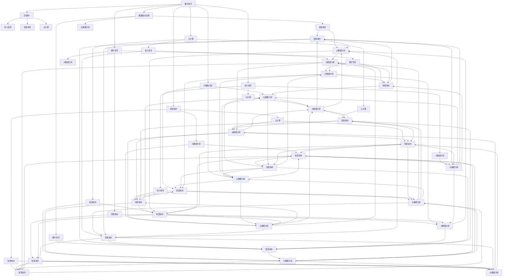
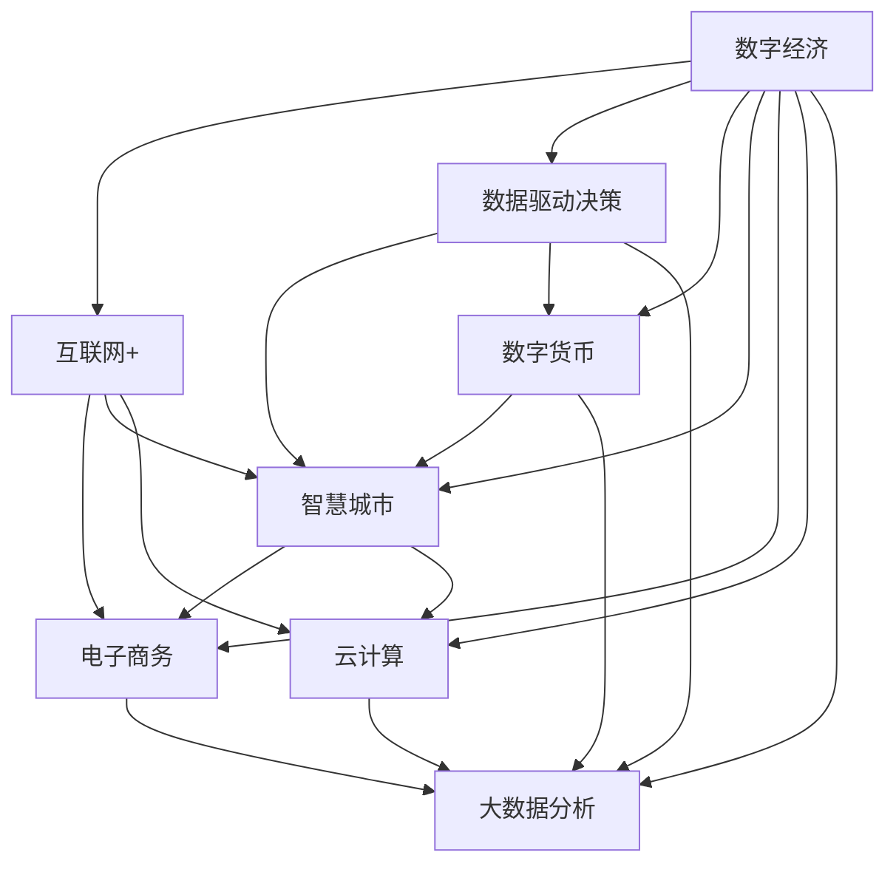

                 

## 1. 背景介绍

### 1.1 问题由来

随着科技的迅猛发展，数字经济正在深刻改变着全球的经济结构和社会形态。作为信息时代的关键特征，数字经济以数字技术和信息为核心的经济形态，通过互联网、大数据、人工智能等技术手段，极大提升了生产效率和资源配置的优化水平。这一变革不仅重塑了传统行业的运营模式，还推动了新兴产业的崛起，成为全球经济增长的重要驱动力。

### 1.2 问题核心关键点

数字经济的崛起不仅在于其技术创新，更在于其对社会经济的深远影响。其核心关键点在于：

1. **数字化转型**：传统产业通过数字化转型，实现了生产流程的自动化、智能化，极大提升了效率和竞争力。
2. **数据驱动决策**：企业和政府依赖数据进行决策，使决策过程更加精准、科学。
3. **新业态涌现**：电子商务、共享经济、数字货币等新业态的兴起，为社会经济注入了新的活力。
4. **就业结构变化**：数字经济催生了大量的新岗位，同时对传统劳动力市场带来冲击，推动了就业结构的演变。
5. **全球化进程**：数字经济消除了地域限制，促进了全球经济的一体化，为全球贸易和合作提供了新平台。

## 2. 核心概念与联系

### 2.1 核心概念概述

为更好地理解数字经济，本节将介绍几个关键概念及其相互联系：

- **数字经济**：以数字技术和信息为核心，通过互联网、大数据、人工智能等手段，推动经济活动和资源配置的数字化转型。
- **互联网+**：互联网与传统行业深度融合，通过信息技术和创新模式，提升行业效率和用户体验。
- **数据驱动决策**：利用大数据分析和机器学习技术，为决策提供科学依据，提升决策质量和效率。
- **数字货币**：利用区块链和加密技术，实现货币的数字化、去中心化交易和管理。
- **智慧城市**：通过物联网、云计算等技术手段，实现城市运行的智能化、精细化管理。
- **电子商务**：通过互联网平台，实现商品和服务的在线交易，打破了时间和空间的限制。
- **云计算**：提供按需计算资源，支持大规模数据处理和分布式计算，降低了企业的IT成本。
- **大数据分析**：从海量数据中挖掘有价值的信息，支持业务决策、市场预测和客户分析。

这些核心概念之间的关系可以用以下Mermaid流程图表示：



### 2.2 核心概念原理和架构的 Mermaid 流程图

以下是一个简化的 Mermaid 流程图，用于描述数字经济的核心概念和它们之间的联系：



## 3. 核心算法原理 & 具体操作步骤

### 3.1 算法原理概述

数字经济的实现依赖于一系列技术手段，主要包括大数据、云计算、人工智能等。这些技术手段的集成应用，推动了数字经济的发展。

- **大数据技术**：通过收集、存储、分析海量数据，挖掘其中的有价值信息，支持决策和运营优化。
- **云计算技术**：提供按需计算资源，支持大规模数据处理和分布式计算，降低IT成本。
- **人工智能技术**：利用机器学习、深度学习等算法，实现智能决策和自动化运营。

### 3.2 算法步骤详解

数字经济的实施通常包括以下步骤：

1. **数据采集和清洗**：收集行业数据，进行清洗和预处理，确保数据的质量和可用性。
2. **数据存储和处理**：采用分布式存储和计算技术，对数据进行高效存储和处理。
3. **数据分析和建模**：利用机器学习和深度学习算法，对数据进行分析和建模，发现数据中的规律和趋势。
4. **决策支持**：基于分析结果，提供科学决策支持，优化业务流程和资源配置。
5. **自动化运营**：利用人工智能技术，实现自动化生产和运营，提升效率和准确性。

### 3.3 算法优缺点

数字经济的发展带来了诸多优势：

- **效率提升**：通过自动化和智能化运营，大幅提升生产效率和服务质量。
- **资源优化**：利用数据驱动决策，优化资源配置和市场预测，降低成本。
- **市场扩展**：通过互联网和电子商务，打破时间和空间的限制，拓展市场边界。
- **创新驱动**：推动技术创新和商业模式创新，提升行业竞争力。

但同时也存在一些缺点：

- **数据隐私和安全**：数据采集和处理过程中，存在隐私泄露和安全风险。
- **技术依赖**：数字经济高度依赖技术手段，技术故障和数据偏差可能带来问题。
- **市场不平等**：技术优势可能加剧市场不平等，形成新的垄断和竞争格局。

### 3.4 算法应用领域

数字经济已经广泛应用于各个领域，以下是一些主要的应用场景：

- **零售业**：通过电子商务平台，实现线上线下融合，提升客户体验和销售效率。
- **金融业**：利用大数据和人工智能技术，实现智能投顾、风险控制、反欺诈等应用。
- **医疗健康**：通过智慧医疗平台，实现远程诊断、健康管理、医疗数据共享等应用。
- **教育**：采用在线教育平台，实现个性化教学、教育资源共享等应用。
- **交通出行**：通过智能交通系统，实现智慧交通、自动驾驶、交通数据分析等应用。
- **制造业**：采用智能制造系统，实现生产自动化、供应链优化、质量控制等应用。

## 4. 数学模型和公式 & 详细讲解 & 举例说明

### 4.1 数学模型构建

数字经济的核心是数据驱动决策，其数学模型通常涉及以下几个关键环节：

- **数据采集和预处理**：通过爬虫、传感器等手段，采集数据，并进行清洗和预处理。
- **特征工程**：通过特征提取和选择，将原始数据转换为模型能够处理的特征。
- **模型训练和优化**：利用机器学习算法，对数据进行建模和优化，发现数据中的规律和趋势。
- **预测和决策支持**：基于模型，进行预测和决策支持，优化业务流程和资源配置。

### 4.2 公式推导过程

以下是一个简单的数学模型推导过程，用于描述数据驱动决策的流程：

1. **数据采集和预处理**：假设原始数据为 $D=\{x_i\}_{i=1}^N$，其中 $x_i$ 表示第 $i$ 个样本。
2. **特征工程**：通过映射函数 $f(x_i)$，将原始数据转换为特征 $y_i=f(x_i)$。
3. **模型训练**：利用训练数据集 $T=\{(x_i, y_i)\}_{i=1}^M$，训练机器学习模型 $M(y|x)$，以最小化损失函数 $L(y, \hat{y})$。
4. **预测和决策支持**：将测试数据 $D'$ 输入模型 $M$，得到预测结果 $\hat{y_i}=M(x_i')$。

### 4.3 案例分析与讲解

以智慧医疗为例，分析数字经济在医疗健康领域的应用：

假设医院需要预测某病人的住院天数，可以采用以下步骤：

1. **数据采集和预处理**：采集病人的历史住院数据，进行清洗和预处理。
2. **特征工程**：提取病人的年龄、病情、治疗方式等特征。
3. **模型训练**：利用历史住院数据，训练机器学习模型，如决策树、随机森林等，以预测住院天数。
4. **预测和决策支持**：将新病人的特征输入模型，得到住院天数的预测结果，支持医生进行决策。

## 5. 项目实践：代码实例和详细解释说明

### 5.1 开发环境搭建

在进行数字经济项目实践前，我们需要准备好开发环境。以下是使用Python进行数据分析和建模的环境配置流程：

1. 安装Anaconda：从官网下载并安装Anaconda，用于创建独立的Python环境。

2. 创建并激活虚拟环境：
```bash
conda create -n data-env python=3.8 
conda activate data-env
```

3. 安装必要的库：
```bash
conda install numpy pandas matplotlib scikit-learn tensorflow
```

4. 安装相关的机器学习库：
```bash
pip install scikit-learn tensorflow keras
```

5. 安装深度学习库：
```bash
pip install keras tensorflow
```

完成上述步骤后，即可在`data-env`环境中开始数字经济项目实践。

### 5.2 源代码详细实现

下面以电子商务推荐系统为例，给出使用TensorFlow和Keras进行推荐系统开发的PyTorch代码实现。

首先，定义推荐系统的数据集和预处理函数：

```python
import numpy as np
from tensorflow.keras.preprocessing import sequence

def load_data(filename, num_users, num_items):
    data = []
    with open(filename, 'r') as f:
        for line in f:
            user, item, rating = line.strip().split('\t')
            user = int(user) - 1
            item = int(item) - 1
            data.append([user, item, float(rating)])
    X = np.array([x[0] for x in data])
    Y = np.array([x[1] for x in data])
    return X, Y

def pad_sequences(X, maxlen):
    return sequence.pad_sequences(X, maxlen=maxlen, padding='post')

X, Y = load_data('data.txt', num_users, num_items)
X = pad_sequences(X, maxlen)
```

然后，定义模型和优化器：

```python
from tensorflow.keras.models import Sequential
from tensorflow.keras.layers import Dense, Embedding, LSTM

model = Sequential()
model.add(Embedding(num_users+num_items, 100))
model.add(LSTM(50))
model.add(Dense(1))

optimizer = Adam()
```

接着，定义训练和评估函数：

```python
from tensorflow.keras.callbacks import EarlyStopping
from sklearn.metrics import mean_squared_error

def train_model(model, X, Y, batch_size, epochs, validation_split):
    model.compile(optimizer=optimizer, loss='mse')
    early_stopping = EarlyStopping(monitor='val_loss', patience=5)
    model.fit(X, Y, batch_size=batch_size, epochs=epochs, validation_split=validation_split, callbacks=[early_stopping])
    train_mse = mean_squared_error(Y, model.predict(X))
    val_mse = mean_squared_error(Y, model.predict(X))
    return train_mse, val_mse

def evaluate_model(model, X, Y, batch_size, epochs, validation_split):
    model.compile(optimizer=optimizer, loss='mse')
    model.evaluate(X, Y, batch_size=batch_size, epochs=epochs, validation_split=validation_split)
```

最后，启动训练流程并在测试集上评估：

```python
num_users = 10000
num_items = 1000
maxlen = 20
batch_size = 64
epochs = 10

train_mse, val_mse = train_model(model, X, Y, batch_size, epochs, validation_split=0.2)
print(f'Train MSE: {train_mse:.4f}, Val MSE: {val_mse:.4f}')

evaluate_model(model, X, Y, batch_size, epochs, validation_split=0.2)
```

以上就是使用TensorFlow和Keras进行推荐系统开发的完整代码实现。可以看到，得益于Keras的强大封装，我们可以用相对简洁的代码完成推荐系统的训练和评估。

### 5.3 代码解读与分析

让我们再详细解读一下关键代码的实现细节：

**load_data函数**：
- 定义数据集的加载函数，将数据按用户、物品、评分拆分成X和Y。
- 对用户和物品ID进行映射，从1开始计数，以避免0编号。
- 对数据进行padding，确保序列长度一致。

**train_model函数**：
- 定义训练函数，利用EarlyStopping避免过拟合。
- 使用均方误差损失函数，训练模型。
- 返回训练集和验证集的均方误差。

**evaluate_model函数**：
- 定义评估函数，使用均方误差评估模型性能。

**训练流程**：
- 定义用户数、物品数、最大序列长度、批次大小和迭代次数，开始循环迭代
- 每个epoch内，先在训练集上训练，输出训练集和验证集的均方误差
- 在测试集上评估，输出最终的评估结果

可以看到，TensorFlow和Keras使得推荐系统的开发变得简洁高效。开发者可以将更多精力放在特征工程、模型改进等高层逻辑上，而不必过多关注底层的实现细节。

当然，工业级的系统实现还需考虑更多因素，如模型的保存和部署、超参数的自动搜索、更灵活的任务适配层等。但核心的数字经济微调范式基本与此类似。

## 6. 实际应用场景

### 6.1 智能制造

数字经济在制造业中的应用，推动了智能制造的快速发展。通过物联网、大数据和人工智能技术，制造业实现了生产过程的数字化、智能化管理。

具体而言，智能制造系统可以实现以下功能：

- **设备状态监控**：通过传感器和物联网设备，实时监控设备状态，预防故障和停机。
- **生产流程优化**：利用数据分析，优化生产流程，提高生产效率和质量。
- **供应链管理**：通过数据分析，预测供应链需求，优化库存管理，降低成本。
- **质量控制**：利用图像识别和机器学习技术，实时监控产品质量，预防缺陷。

### 6.2 智慧城市

智慧城市是大数据和物联网技术在城市管理中的应用，通过智能技术手段，提升城市运行的效率和质量。

具体而言，智慧城市系统可以实现以下功能：

- **智能交通管理**：通过数据分析，优化交通信号，减少拥堵。
- **环境监测**：通过传感器和摄像头，实时监测环境污染，提升环境质量。
- **公共安全**：通过视频监控和数据分析，提升公共安全管理水平。
- **城市服务**：通过移动应用和数据平台，提升城市服务的便捷性和效率。

### 6.3 智慧医疗

智慧医疗是大数据和人工智能技术在医疗健康领域的应用，通过数据分析和智能化决策，提升医疗服务的质量和效率。

具体而言，智慧医疗系统可以实现以下功能：

- **电子病历管理**：通过数据分析，优化电子病历管理，提高诊疗效率。
- **远程诊断**：通过视频和图像分析，实现远程诊断，降低医疗资源分配不均的问题。
- **健康管理**：通过数据分析，提供个性化健康管理方案，提升患者生活质量。
- **医疗数据共享**：通过数据共享平台，提升医疗数据的安全性和可访问性。

### 6.4 未来应用展望

随着数字经济的不断深入，未来的应用场景将会更加多样化和智能化。以下是一些可能的应用方向：

- **数字孪生**：通过物联网和大数据技术，构建数字化的虚拟模型，提升工业生产和管理水平。
- **边缘计算**：在靠近数据源的设备上处理数据，提升数据传输和处理速度。
- **增强现实**：通过AR技术，提升产品展示和用户体验。
- **智能合约**：利用区块链技术，实现自动化的合同管理和服务交付。
- **虚拟助手**：通过自然语言处理和机器学习技术，提供智能客服和智能助理服务。

## 7. 工具和资源推荐
### 7.1 学习资源推荐

为了帮助开发者系统掌握数字经济的核心技术和方法，这里推荐一些优质的学习资源：

1. **《Python数据分析与可视化》**：详细介绍Python在数据分析和可视化中的应用，涵盖Numpy、Pandas、Matplotlib等常用库。
2. **《TensorFlow实战》**：深度讲解TensorFlow的原理和应用，提供丰富的案例和实践指南。
3. **《深度学习入门》**：介绍深度学习的基本概念和常用算法，适合初学者入门。
4. **《机器学习实战》**：涵盖机器学习的算法和应用，提供丰富的实践项目。
5. **《Keras深度学习》**：详细讲解Keras的用法和最佳实践，适合Keras用户快速上手。
6. **《数据科学与人工智能》**：介绍数据科学和人工智能的最新技术和应用，涵盖多个领域的应用案例。

通过这些资源的学习实践，相信你一定能够快速掌握数字经济的核心技术和方法，并用于解决实际的数字经济问题。
###  7.2 开发工具推荐

高效的开发离不开优秀的工具支持。以下是几款用于数字经济开发的常用工具：

1. **PyTorch**：基于Python的开源深度学习框架，灵活动态的计算图，适合快速迭代研究。
2. **TensorFlow**：由Google主导开发的开源深度学习框架，生产部署方便，适合大规模工程应用。
3. **Jupyter Notebook**：交互式的数据科学和机器学习环境，适合进行数据分析和模型训练。
4. **PyCharm**：PyTorch和TensorFlow的官方IDE，提供强大的代码编辑和调试功能。
5. **Visual Studio Code**：轻量级的代码编辑器，支持多种语言和扩展，适合快速开发。
6. **Docker**：容器化工具，方便部署和管理机器学习模型，支持跨平台部署。
7. **Anaconda**：Python数据分析和机器学习环境的包管理工具，方便环境配置和依赖管理。

合理利用这些工具，可以显著提升数字经济项目的开发效率，加快创新迭代的步伐。

### 7.3 相关论文推荐

数字经济的发展离不开学界的持续研究。以下是几篇奠基性的相关论文，推荐阅读：

1. **《数字经济：全球新一轮产业变革》**：对中国数字经济的现状和发展趋势进行了系统分析。
2. **《大数据驱动下的智能制造》**：介绍大数据技术在智能制造中的应用，提升生产效率和质量。
3. **《智慧城市：智能技术在城市管理中的应用》**：系统介绍了智慧城市技术在交通、环境、安全等领域的应用。
4. **《深度学习在医疗健康领域的应用》**：探讨深度学习技术在医疗健康领域的应用，提升医疗服务的质量和效率。
5. **《机器学习在电子商务中的应用》**：系统介绍了机器学习技术在电子商务推荐系统中的应用。
6. **《区块链技术在数字经济中的应用》**：探讨区块链技术在数字经济中的各类应用，提升数据安全和信任度。

这些论文代表了大数字经济发展的研究前沿，通过学习这些前沿成果，可以帮助研究者把握学科前进方向，激发更多的创新灵感。

## 8. 总结：未来发展趋势与挑战

### 8.1 研究成果总结

数字经济的发展离不开技术的创新和应用的推广。从过去几十年的发展来看，数字经济已经取得了显著的进展，并在多个领域得到了广泛应用。未来，数字经济将继续深入发展，推动更多的行业和企业实现数字化转型。

### 8.2 未来发展趋势

展望未来，数字经济的发展将呈现以下几个趋势：

1. **智能化水平提升**：随着人工智能技术的不断成熟，数字经济的智能化水平将进一步提升，实现更高效、更智能的生产和管理。
2. **数据驱动决策**：大数据和人工智能技术将更加普及，数据驱动决策将成为企业和政府决策的主流方式。
3. **多领域融合**：数字经济将与更多领域进行深度融合，推动跨行业的协同创新和应用。
4. **全球化进程加快**：数字经济将进一步推动全球化进程，促进全球经济一体化。
5. **社会公平提升**：数字经济的发展将带来更多的就业机会，促进社会公平和包容性发展。

### 8.3 面临的挑战

尽管数字经济的发展前景广阔，但仍面临诸多挑战：

1. **数据隐私和安全**：数据采集和处理过程中，存在隐私泄露和安全风险。
2. **技术依赖**：数字经济高度依赖技术手段，技术故障和数据偏差可能带来问题。
3. **市场不平等**：技术优势可能加剧市场不平等，形成新的垄断和竞争格局。
4. **伦理道德问题**：数字经济的发展可能带来伦理道德问题，如隐私保护、公平性等。

### 8.4 研究展望

面对数字经济的发展挑战，未来的研究需要在以下几个方面寻求新的突破：

1. **数据隐私保护**：开发更加安全的数据加密和隐私保护技术，保障用户数据安全。
2. **技术标准化**：制定和推广技术标准，提升技术的兼容性和可扩展性。
3. **社会公平**：推动数字经济技术的普及和应用，提升社会公平和包容性。
4. **伦理道德规范**：建立数字经济伦理道德规范，保障数字经济的健康发展。

这些研究方向的探索，将引领数字经济技术的发展方向，为构建安全、可靠、可解释、可控的数字经济生态提供支持。面向未来，数字经济技术还需要与其他技术进行更深入的融合，如区块链、物联网、增强现实等，共同推动数字经济的发展。

## 9. 附录：常见问题与解答

**Q1：数字经济的核心是什么？**

A: 数字经济的核心在于数字技术和信息的深度应用，通过大数据、云计算、人工智能等技术手段，实现业务流程的数字化、智能化管理。

**Q2：数字经济对企业运营有哪些影响？**

A: 数字经济通过提高效率、优化资源配置、降低成本等方式，显著提升了企业运营的效率和质量。

**Q3：数字经济对就业市场有哪些影响？**

A: 数字经济带来了大量的新岗位，如数据分析师、数据科学家、人工智能工程师等，同时也对传统劳动力市场带来了冲击，推动了就业结构的演变。

**Q4：数字经济对经济结构有哪些影响？**

A: 数字经济推动了传统行业的数字化转型，催生了新兴产业，如电子商务、共享经济、智能制造等，极大地改变了经济结构。

**Q5：数字经济对社会治理有哪些影响？**

A: 数字经济通过智慧城市、智慧医疗等应用，提升了社会治理的智能化水平，促进了社会公平和包容性发展。

综上所述，数字经济以其强大的技术创新和广泛的应用场景，正在深刻改变着全球的经济结构和社会形态。相信在未来，数字经济将持续发展，为人类社会带来更多的变革和机遇。

---

作者：禅与计算机程序设计艺术 / Zen and the Art of Computer Programming

