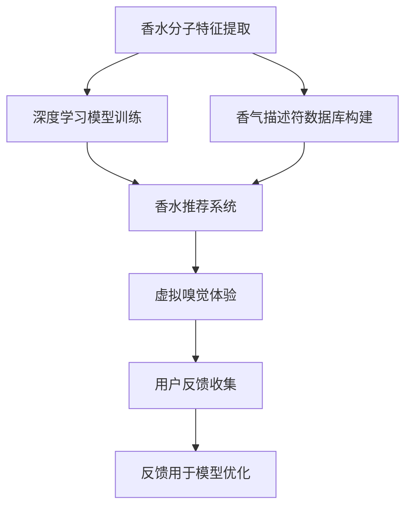

                 

## 数字香水创业：虚拟嗅觉体验的开创

### 1. 背景介绍

在数字时代的浪潮中，虚拟体验已经从视觉、听觉扩展到了触觉和味觉。在这股潮流下，一个全新的市场——虚拟嗅觉体验（Virtual Olfactory Experience, VOX）应运而生。虚拟嗅觉体验不再局限于现实世界的模拟，而是通过人工智能、传感器技术和数据科学，创造出全新的嗅觉体验。

数字香水创业正是在这种背景下应运而生的。与传统的香水销售模式不同，数字香水创业结合了数字技术与香水产业，不仅能够提供个性化的香水推荐，还能根据用户的感官偏好，模拟和创造虚拟的嗅觉体验，开辟了香水营销和消费的新途径。

### 2. 核心概念与联系

#### 2.1 核心概念概述

- **虚拟嗅觉体验（VOX）**：通过人工智能技术，模拟或创造虚拟的嗅觉体验，使用户能够在数字空间中感知不同的香气。
- **数字香水**：结合了数字技术和香水的产品或服务，如数字香水瓶、香水香气推荐系统、虚拟嗅觉体验平台等。
- **香水推荐系统**：利用机器学习算法，根据用户的喜好和历史行为，推荐最适合的香水。
- **传感器技术**：用于捕捉用户对香气的真实反应，如电子鼻（E-nose）、气体传感器等。
- **深度学习与神经网络**：用于分析和模拟香水的分子结构和香气特征，是实现虚拟嗅觉体验的关键技术。
- **用户画像**：通过分析用户的感官偏好和行为数据，构建详尽的用户画像，以提升推荐和体验的准确性。

#### 2.2 核心概念原理和架构的 Mermaid 流程图



### 3. 核心算法原理 & 具体操作步骤

#### 3.1 算法原理概述

数字香水创业的核心算法主要包括以下几个步骤：

1. **香水分子特征提取**：将香水的分子结构和组成信息转换为可以被计算机处理的数据形式。
2. **深度学习模型训练**：利用神经网络模型学习香水的分子特征与香气描述符之间的映射关系。
3. **香水推荐系统构建**：根据用户的感官偏好和行为数据，构建推荐系统，提供个性化的香水推荐。
4. **虚拟嗅觉体验模拟**：利用虚拟现实技术，结合香气描述符数据库，模拟虚拟的嗅觉体验。
5. **用户反馈收集与模型优化**：通过传感器收集用户对虚拟嗅觉体验的反应，利用反馈优化推荐系统。

#### 3.2 算法步骤详解

**Step 1: 数据收集与预处理**
- 收集各类香水的分子结构信息，如分子质量、原子类型等。
- 利用机器学习算法，从分子结构中提取关键特征，如分子图特征、分子指纹等。
- 构建香气描述符数据库，将各种香气描述符与对应的分子特征进行匹配。

**Step 2: 深度学习模型训练**
- 设计神经网络模型，如卷积神经网络（CNN）、循环神经网络（RNN）等，用于学习和提取香水的分子特征。
- 利用分子特征数据和香气描述符数据，训练神经网络模型，得到分子特征与香气描述符之间的映射关系。

**Step 3: 香水推荐系统构建**
- 收集用户的嗅觉偏好数据，如香水的评分、使用频率等。
- 利用机器学习算法，如协同过滤、内容推荐等，构建香水推荐系统，提供个性化的香水推荐。
- 使用用户画像技术，分析用户的行为和偏好，进一步优化推荐系统。

**Step 4: 虚拟嗅觉体验模拟**
- 利用虚拟现实技术，结合香气描述符数据库，模拟虚拟的嗅觉体验。
- 根据用户的选择和行为，动态调整虚拟嗅觉体验的参数，如香气强度、持续时间等。
- 利用传感器技术，如电子鼻，收集用户对虚拟嗅觉体验的反应，以优化模型和体验。

**Step 5: 用户反馈收集与模型优化**
- 利用传感器技术，如气体传感器，收集用户对虚拟嗅觉体验的真实反应。
- 分析用户反馈，评估推荐系统的准确性和体验的舒适度。
- 利用反馈数据，不断优化推荐系统和虚拟嗅觉体验模型，提高系统的性能。

#### 3.3 算法优缺点

**优点**：
- 提供个性化的香水推荐，提升用户的购物体验。
- 通过虚拟嗅觉体验，满足用户对香水的多样化需求。
- 结合深度学习和传感器技术，实现对香水分子特征的精确分析。

**缺点**：
- 需要大量的高质量数据，收集和预处理工作量大。
- 深度学习模型的训练和优化过程复杂，对计算资源要求高。
- 虚拟嗅觉体验的模拟需要较高的技术门槛，初期成本较高。

### 4. 数学模型和公式 & 详细讲解

#### 4.1 数学模型构建

我们假设香水的分子特征可以用一个向量 $X \in \mathbb{R}^n$ 表示，其中 $n$ 为特征维度。香水的香气描述符可以用一个向量 $Y \in \mathbb{R}^m$ 表示，其中 $m$ 为描述符维度。我们的目标是要建立一个函数 $f: \mathbb{R}^n \rightarrow \mathbb{R}^m$，使得 $f(X) \approx Y$。

#### 4.2 公式推导过程

假设我们有一个训练数据集 $D = \{(X_i, Y_i)\}_{i=1}^N$，我们的目标是找到最优的函数 $f$。由于神经网络具有映射非线性函数的能力，我们通常使用一个多层神经网络 $f_{\theta}$ 进行建模，其中 $\theta$ 为模型的参数。我们的目标是最小化损失函数：

$$
L(\theta) = \frac{1}{N} \sum_{i=1}^N \|Y_i - f_{\theta}(X_i)\|^2
$$

其中 $\|\cdot\|$ 为欧几里得范数。通过反向传播算法，我们可以计算出损失函数对参数 $\theta$ 的梯度，并使用优化算法（如Adam）更新模型参数。

#### 4.3 案例分析与讲解

假设我们有一个香水分子特征和香气描述符的训练集，我们利用卷积神经网络（CNN）模型进行训练。具体步骤如下：

1. 定义分子特征和香气描述符的数据集 $D = \{(X_i, Y_i)\}_{i=1}^N$。
2. 设计CNN模型结构，包括卷积层、池化层、全连接层等。
3. 利用分子特征数据 $X$ 和香气描述符数据 $Y$，训练CNN模型，得到映射函数 $f_{\theta}$。
4. 使用训练好的模型 $f_{\theta}$，对新的分子特征 $X'$ 进行预测，得到香气描述符 $Y'$。

### 5. 项目实践：代码实例和详细解释说明

#### 5.1 开发环境搭建

为了进行数字香水创业，我们需要搭建一个完整的开发环境。以下是搭建环境的详细步骤：

1. 安装Python：从官网下载并安装Python 3.8及以上版本。
2. 安装虚拟环境：使用虚拟环境管理工具（如Virtualenv）创建和管理虚拟环境。
3. 安装相关库：安装深度学习库（如TensorFlow、PyTorch）、数据处理库（如NumPy、Pandas）、传感器库（如E-nose API）等。
4. 搭建服务器：根据项目需求，选择合适的服务器硬件和软件环境，搭建服务器环境。

#### 5.2 源代码详细实现

以下是一个简单的数字香水创业项目的代码实现，包括分子特征提取、模型训练、香水推荐和虚拟嗅觉体验模拟。

```python
import numpy as np
import tensorflow as tf
from tensorflow.keras import layers, models

# 定义分子特征提取函数
def extract_molecular_features(X):
    # 提取分子图特征
    # ...
    return features

# 定义香气描述符数据集
class FragranceDataset(tf.data.Dataset):
    def __init__(self, X, Y):
        self.X = X
        self.Y = Y
        
    def __len__(self):
        return len(self.X)
    
    def __getitem__(self, idx):
        x = tf.convert_to_tensor(self.X[idx])
        y = tf.convert_to_tensor(self.Y[idx])
        return x, y

# 定义神经网络模型
def create_model():
    model = models.Sequential()
    model.add(layers.Dense(64, activation='relu', input_shape=(n_features,)))
    model.add(layers.Dense(m_features))
    model.compile(optimizer='adam', loss='mse')
    return model

# 数据加载和预处理
train_dataset = FragranceDataset(X_train, Y_train)
val_dataset = FragranceDataset(X_val, Y_val)

# 模型训练
model = create_model()
model.fit(train_dataset, validation_data=val_dataset, epochs=10)

# 香水推荐系统构建
# ...

# 虚拟嗅觉体验模拟
# ...
```

#### 5.3 代码解读与分析

**分子特征提取函数**：定义了如何将香水的分子结构信息转换为可以被神经网络处理的数据格式。

**FragranceDataset类**：定义了香气描述符数据集，用于数据加载和预处理。

**神经网络模型创建函数**：定义了一个简单的神经网络模型，用于从分子特征到香气描述符的映射。

**数据加载和预处理**：使用TensorFlow的数据集API，加载和预处理分子特征和香气描述符数据。

**模型训练**：利用训练数据集，训练神经网络模型，得到分子特征到香气描述符的映射关系。

**香水推荐系统构建**：根据用户行为数据，构建香水推荐系统，提供个性化的香水推荐。

**虚拟嗅觉体验模拟**：利用虚拟现实技术，结合香气描述符数据库，模拟虚拟的嗅觉体验。

### 6. 实际应用场景

#### 6.1 虚拟香水店

虚拟香水店是一个典型的数字香水创业应用场景。用户可以通过虚拟现实头盔进入虚拟商店，体验不同的香水香气，并进行购买。系统根据用户的感官偏好和历史行为，推荐最适合的香水，提高用户的购物体验。

**案例**：一家数字香水店通过虚拟现实技术，为用户提供了多款虚拟香水样品。用户可以通过头显设备，在虚拟空间中自由地嗅闻不同的香水，选择最满意的一款进行购买。系统根据用户的嗅觉反馈，不断优化推荐模型，提升用户的购物体验。

#### 6.2 虚拟香水秀

虚拟香水秀是数字香水创业的另一个应用场景。在各类展览、发布会等场合，用户可以通过虚拟现实技术，近距离感受香水的香气，体验品牌文化。

**案例**：一家化妆品公司通过虚拟现实技术，在大型展览会上推出了虚拟香水秀。用户可以通过头显设备，在虚拟空间中走进香水的生产车间、实验室和研发中心，深入了解香水的制作过程，感受香水的独特魅力。

#### 6.3 虚拟香水旅游

虚拟香水旅游是一个全新的旅游方式，用户可以通过虚拟现实技术，体验不同国家和地区的香水文化和历史。

**案例**：一家旅游公司推出了虚拟香水旅游项目。用户可以通过头显设备，进入不同的国家，体验当地的香水文化和风俗习惯。系统根据用户的偏好，推荐最适合的旅游路线和香水样品。

### 6.4 未来应用展望

数字香水创业的未来应用展望非常广阔，以下是几个潜在的应用场景：

1. **虚拟香水实验室**：用户可以在虚拟现实环境中，参与香水的研发和制作过程，增强用户参与感和体验感。
2. **虚拟香水课程**：通过虚拟现实技术，用户可以学习香水的历史、制作和鉴赏知识，提升用户的专业素养。
3. **虚拟香水社交平台**：用户可以在虚拟空间中分享和交流香水心得，形成一个庞大的香水爱好社群。
4. **虚拟香水生态系统**：结合虚拟现实和物联网技术，构建一个完整的虚拟香水生态系统，涵盖香水生产、营销、消费等各个环节。

### 7. 工具和资源推荐

#### 7.1 学习资源推荐

1. **《深度学习与香水的未来》课程**：斯坦福大学开设的深度学习与香水未来课程，涵盖香水分子特征提取、香气描述符生成、香水推荐系统等多个主题。
2. **《虚拟现实与香水》书籍**：介绍虚拟现实技术在香水领域的广泛应用，包括虚拟香水店、虚拟香水秀、虚拟香水旅游等。
3. **《神经网络与香水》论文**：研究神经网络在香水分子特征提取和香气描述符生成中的应用，为数字香水创业提供理论支持。

#### 7.2 开发工具推荐

1. **TensorFlow和PyTorch**：广泛使用的深度学习框架，支持构建复杂的神经网络模型。
2. **E-nose API**：用于捕捉和分析用户对香水的嗅觉反应，提升用户体验。
3. **Unity和Unreal Engine**：流行的游戏引擎，用于构建虚拟现实体验平台。

#### 7.3 相关论文推荐

1. **《香水分子特征提取与深度学习》**：研究如何用深度学习模型学习香水的分子特征和香气描述符之间的映射关系。
2. **《虚拟现实中的香水体验》**：探讨虚拟现实技术在香水体验中的应用，提供理论和实践指导。
3. **《香水推荐系统研究进展》**：综述了当前香水推荐系统的发展现状和未来趋势，为数字香水创业提供方向。

### 8. 总结：未来发展趋势与挑战

#### 8.1 研究成果总结

数字香水创业作为一个新兴领域，已经在虚拟嗅觉体验、香水推荐系统和虚拟现实技术等多个方面取得了显著进展。结合深度学习、传感器技术和数据科学，数字香水创业正在逐步改变香水产业的生态格局，为用户提供全新的购物体验。

#### 8.2 未来发展趋势

1. **深度学习与香水的结合将更加紧密**：未来，深度学习在香水特征提取和香气描述符生成中的应用将更加广泛，提升香水的个性化推荐和虚拟嗅觉体验的准确性。
2. **虚拟现实技术的普及**：随着虚拟现实设备的普及和技术的进步，虚拟香水店、虚拟香水秀和虚拟香水旅游等应用场景将更加丰富。
3. **数据驱动的香水营销**：利用用户数据，结合机器学习和数据挖掘技术，实现更加精准的香水推荐和市场营销。

#### 8.3 面临的挑战

1. **数据收集与标注成本**：高质量的分子特征和香气描述符数据收集和标注成本较高，需要投入大量的时间和资源。
2. **计算资源需求**：神经网络模型和虚拟现实体验需要较高的计算资源，初期投入较大。
3. **用户体验优化**：如何在虚拟现实环境中，提供高质量的香水体验，满足用户的多样化需求，是数字香水创业的挑战之一。
4. **伦理和安全问题**：用户隐私保护、数据安全、虚拟现实环境的伦理道德等问题的处理，需要得到重视和规范。

### 8.4 研究展望

1. **多模态数据融合**：结合视觉、听觉、触觉等多模态数据，提升虚拟嗅觉体验的丰富性和真实感。
2. **跨领域应用拓展**：将数字香水创业技术应用到其他领域，如虚拟美食体验、虚拟旅行体验等，拓展应用范围。
3. **算法优化与创新**：优化现有算法，提出新的深度学习模型和香水推荐方法，提升系统的性能和用户体验。

数字香水创业作为虚拟嗅觉体验的一个重要方向，正在开启香水的数字化新纪元。通过不断探索和创新，数字香水创业将在未来的NLP、AI和数字体验领域中扮演更加重要的角色。

---

作者：禅与计算机程序设计艺术 / Zen and the Art of Computer Programming

