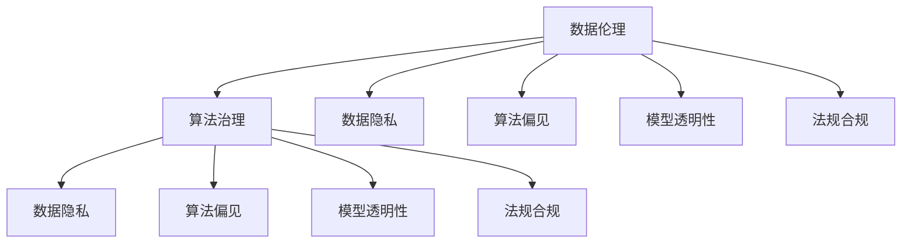

                 

# 数据伦理：算法治理与规范

> 关键词：数据伦理,算法治理,数据隐私,公平性,透明性,可解释性,法规合规,模型偏见

## 1. 背景介绍

### 1.1 问题由来

随着人工智能技术的飞速发展，机器学习和大数据在各行各业的应用越来越广泛。然而，数据伦理问题也随之而来，如数据隐私、算法偏见、模型解释性、法规合规等，成为制约AI发展的重要因素。特别是在医疗、金融、司法等关键领域，不当的数据使用和算法决策，可能对个人和社会造成重大损害。

### 1.2 问题核心关键点

数据伦理的核心在于确保数据和算法决策的公正性、透明性和合法性。具体而言，包括以下几个关键点：

- **数据隐私**：保护个人数据，避免未经授权的采集和滥用。
- **算法公平性**：确保算法对不同群体的影响是公平的，避免对某些群体的歧视。
- **模型透明性**：提高模型的可解释性，便于理解和调试。
- **法规合规**：确保数据和算法使用符合各国法律法规要求。
- **模型偏见**：识别和纠正算法中潜在的偏见，避免歧视性输出。

## 2. 核心概念与联系

### 2.1 核心概念概述

为更好地理解数据伦理和算法治理的原理，本节将介绍几个关键概念：

- **数据伦理**：指在数据采集、处理和应用过程中，遵循的一系列道德准则和规范，确保数据使用的公平性和合法性。
- **算法治理**：指在算法开发、部署和运营过程中，遵循的一系列管理规范和技术标准，确保算法的透明性、可解释性和公平性。
- **数据隐私**：指保护个人数据，防止未经授权的采集和使用，包括数据匿名化、加密、访问控制等。
- **算法偏见**：指算法在处理数据时，可能由于训练数据的偏差，导致对某些群体或特征的歧视性处理。
- **模型透明性**：指算法的决策过程和依据是可理解和可解释的，便于用户和监管机构的审查。
- **法规合规**：指确保算法的开发和应用符合各国法律法规要求，避免法律风险。

这些核心概念之间的逻辑关系可以通过以下Mermaid流程图来展示：



这个流程图展示了大数据和AI中的核心概念及其之间的关系：

1. 数据伦理是确保数据和算法使用符合道德准则的基础。
2. 算法治理是在数据伦理的基础上，进一步规范算法的开发和应用，确保其透明性、公平性和合法性。
3. 数据隐私和法规合规是确保数据使用符合道德和法律要求的两个重要方面。
4. 算法偏见和模型透明性是算法治理的难点和重点，需要通过技术和管理手段进行改善。

## 3. 核心算法原理 & 具体操作步骤
### 3.1 算法原理概述

数据伦理和算法治理的核心在于算法决策的公正性和透明性。这需要从数据处理和算法模型两个层面进行规范。

- **数据处理**：包括数据收集、清洗、标注和归因等环节。确保数据来源合法，处理过程透明，避免数据偏见。
- **算法模型**：包括模型训练、评估、部署和监控等环节。确保模型透明，决策公平，遵守法规。

### 3.2 算法步骤详解

以下以医疗领域为例，详细讲解数据伦理和算法治理的流程：

**Step 1: 数据收集与清洗**
- 数据来源：确保数据采集合法，不侵犯个人隐私。例如，通过医疗记录系统采集患者数据，需获得患者同意。
- 数据清洗：去除重复、错误、不完整的数据，确保数据质量。例如，使用K-means聚类发现异常值，并进行修正。

**Step 2: 数据标注与归因**
- 数据标注：标注数据以供机器学习模型训练。例如，对于医学影像，标注医生对影像的分析结果。
- 数据归因：记录数据的来源和处理过程，确保数据可追溯。例如，记录数据的采集时间、地点、处理人员等信息。

**Step 3: 算法训练与评估**
- 算法训练：在清洗后的数据上训练模型，确保模型性能。例如，使用随机森林进行疾病预测模型的训练。
- 算法评估：评估模型在公平性和透明性方面是否符合要求。例如，使用公平性指标评估模型对不同群体的影响。

**Step 4: 模型部署与监控**
- 模型部署：将训练好的模型部署到生产环境中。例如，将疾病预测模型部署到医疗系统的API中。
- 模型监控：实时监控模型性能和公平性，及时发现和纠正问题。例如，定期检查模型输出，发现偏差及时调整。

### 3.3 算法优缺点

数据伦理和算法治理的优点包括：

1. **提升数据质量**：通过严格的规范和流程，提高数据采集、清洗和标注的准确性，从而提升模型性能。
2. **保障数据公平**：通过数据标注和模型评估，确保算法决策对不同群体的影响是公平的，避免偏见。
3. **增强模型透明度**：通过记录数据来源和处理过程，确保算法的决策过程是透明的，便于审查和信任。
4. **降低法律风险**：通过符合法规要求的数据和算法使用，避免法律风险和合规问题。

然而，该方法也存在一些局限性：

1. **数据隐私保护**：在确保数据隐私的同时，可能面临数据匿名化难度大的问题。
2. **成本和时间**：严格的规范和流程可能导致开发和部署成本增加，时间延长。
3. **数据标注难度**：高质量的数据标注需要专业知识和大量时间，难以大规模实施。
4. **模型复杂性**：复杂的模型可能难以解释，影响透明性和公平性评估。

## 4. 数学模型和公式 & 详细讲解  
### 4.1 数学模型构建

在数据伦理和算法治理中，数学模型的构建主要涉及数据隐私保护、算法公平性和透明性评估。以下给出几个关键模型的构建公式。

- **数据隐私保护模型**：使用差分隐私算法（Differential Privacy）保护个体隐私。具体模型如下：
$$
\epsilon-\text{DP}(\mathcal{A},\epsilon) = \Pr[\mathcal{A}(D) \in \mathcal{R}|D] \leq e^{-\epsilon\delta}\Pr[\mathcal{A}(D') \in \mathcal{R}|D']
$$
其中，$\mathcal{A}$ 表示数据处理算法，$\epsilon$ 表示隐私保护强度，$\delta$ 表示近似误差。

- **算法公平性评估模型**：使用统计差异检验（如卡方检验、T-test）评估模型对不同群体的影响是否公平。具体模型如下：
$$
\chi^2 = \sum_{i=1}^n \frac{(O_i - E_i)^2}{E_i}
$$
其中，$O_i$ 表示实际观测值，$E_i$ 表示期望值。

- **模型透明性评估模型**：使用模型可解释性方法（如LIME、SHAP）评估模型的决策过程。具体模型如下：
$$
\text{SHAP}(X_i) = \sum_{j=1}^p \phi_j(\mathcal{F}(X_i, W))\tau_j
$$
其中，$\mathcal{F}$ 表示模型函数，$W$ 表示模型权重，$\phi_j$ 表示第 $j$ 个特征对模型的贡献。

### 4.2 公式推导过程

以下以卡方检验为例，推导算法公平性评估的公式。

假设有一个二分类问题，模型输出 $y \in \{0,1\}$，实际标签 $y' \in \{0,1\}$。我们希望评估模型在两个不同群体（如男性和女性）上的表现是否一致。

首先，定义每个群体的实际观测值和期望值。对于男性群体，实际观测值为 $O_{m1}$，期望值为 $E_{m1}$；对于女性群体，实际观测值为 $O_{f1}$，期望值为 $E_{f1}$。

使用卡方检验公式：

$$
\chi^2 = \frac{(O_{m1} - E_{m1})^2}{E_{m1}} + \frac{(O_{f1} - E_{f1})^2}{E_{f1}}
$$

如果 $\chi^2$ 值较小，说明两个群体上的表现差异不大，模型对不同群体的影响是公平的。

### 4.3 案例分析与讲解

以医疗领域的算法治理为例，分析数据伦理和算法治理的具体应用。

**案例场景**：某医院使用机器学习模型进行疾病预测，发现模型对老年人和年轻人的预测准确率存在显著差异。

**解决方案**：

1. **数据清洗与标注**：检查数据来源，确保数据采集合法，对异常数据进行清洗。对标注结果进行复核，确保标注准确。
2. **模型训练与评估**：调整模型训练数据分布，引入更多老年人和年轻人的数据。使用公平性评估模型，检测模型对不同年龄群体的影响是否公平。
3. **模型监控与调整**：定期检查模型输出，发现偏差及时调整模型参数或数据分布。确保模型决策过程透明，便于监管审查。

## 5. 项目实践：代码实例和详细解释说明
### 5.1 开发环境搭建

在进行数据伦理和算法治理的实践前，我们需要准备好开发环境。以下是使用Python进行TensorFlow开发的环境配置流程：

1. 安装Anaconda：从官网下载并安装Anaconda，用于创建独立的Python环境。

2. 创建并激活虚拟环境：
```bash
conda create -n tf-env python=3.8 
conda activate tf-env
```

3. 安装TensorFlow：根据CUDA版本，从官网获取对应的安装命令。例如：
```bash
conda install tensorflow tensorflow-gpu -c conda-forge
```

4. 安装各类工具包：
```bash
pip install numpy pandas scikit-learn matplotlib tqdm jupyter notebook ipython
```

完成上述步骤后，即可在`tf-env`环境中开始数据伦理和算法治理的实践。

### 5.2 源代码详细实现

这里我们以医疗领域的疾病预测任务为例，给出使用TensorFlow实现数据伦理和算法治理的代码实现。

首先，定义疾病预测的数据处理流程：

```python
import numpy as np
from tensorflow.keras.preprocessing import sequence
from tensorflow.keras.utils import to_categorical
from sklearn.model_selection import train_test_split
from sklearn.metrics import confusion_matrix

# 加载数据
data = np.load('data.npy')
labels = np.load('labels.npy')

# 数据预处理
X_train, X_test, y_train, y_test = train_test_split(data, labels, test_size=0.2, random_state=42)
X_train = sequence.pad_sequences(X_train, maxlen=100)
X_test = sequence.pad_sequences(X_test, maxlen=100)
y_train = to_categorical(y_train)
y_test = to_categorical(y_test)

# 训练模型
model = Sequential()
model.add(LSTM(64, input_shape=(100, 10)))
model.add(Dense(2, activation='softmax'))
model.compile(loss='categorical_crossentropy', optimizer='adam', metrics=['accuracy'])
model.fit(X_train, y_train, epochs=10, batch_size=64, validation_data=(X_test, y_test))

# 评估模型
y_pred = model.predict(X_test)
y_pred = np.argmax(y_pred, axis=1)
y_true = np.argmax(y_test, axis=1)
cm = confusion_matrix(y_true, y_pred)
print(cm)
```

然后，定义公平性评估函数：

```python
def fair_test(model, X, y, groups):
    y_pred = model.predict(X)
    y_pred = np.argmax(y_pred, axis=1)
    y_true = np.argmax(y, axis=1)
    cm = confusion_matrix(y_true, y_pred, labels=groups)
    return cm

# 使用公平性评估模型
groups = ['Young', 'Old']
cm = fair_test(model, X_test, y_test, groups)
print(cm)
```

最后，定义透明性评估函数：

```python
import shap

# 创建解释器
explainer = shap.TreeExplainer(model)

# 生成解释结果
shap_values = explainer.shap_values(X_train)
shap.summary_plot(shap_values, X_train)
```

### 5.3 代码解读与分析

让我们再详细解读一下关键代码的实现细节：

**疾病预测流程**：
- `data` 和 `labels` 表示加载的数据集。
- `train_test_split` 函数将数据集划分为训练集和测试集。
- `pad_sequences` 函数对序列数据进行填充，确保输入数据长度一致。
- `to_categorical` 函数将标签数据转换为独热编码。
- `Sequential` 和 `Dense` 函数定义神经网络模型。
- `compile` 和 `fit` 函数编译和训练模型。
- `predict` 函数对测试集进行预测。

**公平性评估**：
- `fair_test` 函数对模型在特定群体上的表现进行评估。
- `confusion_matrix` 函数计算混淆矩阵，评估模型在不同群体上的性能。

**透明性评估**：
- `shap` 库用于生成模型解释结果。
- `TreeExplainer` 函数创建解释器，`shap_values` 函数计算解释结果，`summary_plot` 函数可视化解释结果。

可以看到，TensorFlow提供了丰富的工具包，使得数据伦理和算法治理的代码实现变得简洁高效。开发者可以将更多精力放在数据处理、模型改进等高层逻辑上，而不必过多关注底层的实现细节。

## 6. 实际应用场景
### 6.1 金融风险管理

金融领域中的算法治理对于风险管理具有重要意义。传统金融风险管理主要依赖人工分析和经验，效率低、成本高。基于机器学习的算法治理，可以通过对历史数据的分析，构建更准确的风险评估模型。

在实践中，可以收集金融市场的各类数据，包括股票价格、交易量、政策法规等，并对其进行数据清洗和标注。在此基础上对预训练模型进行微调，使其能够自动预测金融市场的波动趋势，评估金融产品的风险等级。使用数据伦理和算法治理的规范，确保数据采集和使用合法合规，避免数据偏见和滥用，从而提升风险管理的效果。

### 6.2 医疗诊断系统

医疗领域的算法治理对于提高诊断系统的准确性和可靠性具有重要意义。传统医疗诊断主要依赖医生经验和经验丰富的专家，效率低、资源有限。基于机器学习的算法治理，可以通过对医疗数据的分析，构建更准确和高效的诊断模型。

在实践中，可以收集医疗影像、病历等数据，并对其进行数据清洗和标注。在此基础上对预训练模型进行微调，使其能够自动分析影像和病历，生成诊断报告。使用数据伦理和算法治理的规范，确保数据采集和使用合法合规，避免数据偏见和滥用，从而提升诊断系统的效果。

### 6.3 智能推荐系统

智能推荐系统是算法治理在电商和内容平台上的典型应用。传统推荐系统主要依赖用户行为数据，难以捕捉用户真实需求。基于机器学习的算法治理，可以通过对多模态数据的分析，构建更准确和个性化的推荐模型。

在实践中，可以收集用户浏览、点击、评论等行为数据，并对其进行数据清洗和标注。在此基础上对预训练模型进行微调，使其能够自动分析用户行为，推荐用户可能感兴趣的商品或内容。使用数据伦理和算法治理的规范，确保数据采集和使用合法合规，避免数据偏见和滥用，从而提升推荐系统的效果。

### 6.4 未来应用展望

随着算法治理技术的不断发展，基于微调的方法将在更多领域得到应用，为传统行业带来变革性影响。

在智慧医疗领域，基于算法治理的医疗诊断系统将提升医疗服务的智能化水平，辅助医生诊断，降低误诊率。

在智能推荐系统领域，基于算法治理的个性化推荐系统将提升电商和内容平台的用户体验，提高转化率。

在金融风险管理领域，基于算法治理的智能监控系统将提高金融市场的透明度和风险管理效率。

此外，在企业生产、社会治理、文娱传媒等众多领域，基于数据伦理和算法治理的人工智能应用也将不断涌现，为传统行业数字化转型升级提供新的技术路径。相信随着技术的日益成熟，算法治理将成为AI落地应用的重要保障，推动人工智能技术向更广阔的领域加速渗透。

## 7. 工具和资源推荐
### 7.1 学习资源推荐

为了帮助开发者系统掌握数据伦理和算法治理的理论基础和实践技巧，这里推荐一些优质的学习资源：

1. 《机器学习伦理与隐私保护》系列博文：由伦理学家和技术专家撰写，深入浅出地介绍了机器学习中的伦理问题和隐私保护技术。

2. 《数据治理：原则、策略与实践》课程：由数据治理专家开设的在线课程，涵盖数据治理的基本概念和实施方法。

3. 《公平性与可解释性：机器学习中的伦理与透明性》书籍：全面介绍了机器学习模型中的公平性和可解释性问题，提供了实践操作指南。

4. HuggingFace官方文档：机器学习库的官方文档，提供了海量预训练模型和详细的微调样例代码，是进行算法治理开发的必备资料。

5. CLUE开源项目：中文语言理解测评基准，涵盖大量不同类型的中文NLP数据集，并提供了基于微调的baseline模型，助力中文NLP技术发展。

通过对这些资源的学习实践，相信你一定能够快速掌握数据伦理和算法治理的精髓，并用于解决实际的AI问题。

### 7.2 开发工具推荐

高效的开发离不开优秀的工具支持。以下是几款用于数据伦理和算法治理开发的常用工具：

1. TensorFlow：基于Python的开源深度学习框架，灵活动态的计算图，适合快速迭代研究。大部分预训练语言模型都有TensorFlow版本的实现。

2. PyTorch：基于Python的开源深度学习框架，动态计算图，适合复杂模型的研究和部署。

3. Weights & Biases：模型训练的实验跟踪工具，可以记录和可视化模型训练过程中的各项指标，方便对比和调优。与主流深度学习框架无缝集成。

4. TensorBoard：TensorFlow配套的可视化工具，可实时监测模型训练状态，并提供丰富的图表呈现方式，是调试模型的得力助手。

5. Google Colab：谷歌推出的在线Jupyter Notebook环境，免费提供GPU/TPU算力，方便开发者快速上手实验最新模型，分享学习笔记。

合理利用这些工具，可以显著提升数据伦理和算法治理的开发效率，加快创新迭代的步伐。

### 7.3 相关论文推荐

数据伦理和算法治理的发展源于学界的持续研究。以下是几篇奠基性的相关论文，推荐阅读：

1. "Fairness, Accountability, and Transparency in Machine Learning"：由伦理学家和AI专家撰写，系统地介绍了机器学习中的伦理问题，提出了公平性、透明性和可解释性的关键指标。

2. "Differential Privacy: Privacy-Friendly Data Analysis"：介绍了差分隐私算法，用于保护个体隐私。

3. "The Moral Landscape: Toward a Philosophy of Ethics and Technology in the 21st Century"：由哲学家尼克·博斯特罗姆撰写，探讨了科技发展对伦理的影响，提出了伦理责任的框架。

4. "Interpretable Machine Learning: A Guide for Making Black Box Models Explainable"：全面介绍了机器学习模型的可解释性方法，提供了实践指南。

5. "Beyond Fairness: The Sociotechnical Context of Bias and Discrimination in Machine Learning"：探讨了机器学习中的偏见和歧视问题，提出了应对策略。

这些论文代表了大数据和AI中的伦理和治理领域的发展脉络。通过学习这些前沿成果，可以帮助研究者把握学科前进方向，激发更多的创新灵感。

## 8. 总结：未来发展趋势与挑战

### 8.1 总结

本文对数据伦理和算法治理的基本概念、核心原理和具体实践进行了全面系统的介绍。首先阐述了数据伦理和算法治理的研究背景和重要性，明确了伦理和治理在数据采集、处理和应用过程中的关键作用。其次，从原理到实践，详细讲解了数据隐私保护、算法公平性评估和模型透明性评估等关键技术，提供了具体的代码实现和解释。同时，本文还广泛探讨了数据伦理和算法治理在金融、医疗、推荐等众多领域的应用前景，展示了其广泛的应用价值。此外，本文精选了相关学习资源、开发工具和前沿论文，力求为读者提供全方位的技术指引。

通过本文的系统梳理，可以看到，数据伦理和算法治理技术在大数据和AI应用中的重要性。数据和算法的透明性、公平性和合法性，对于提升用户信任、降低法律风险、促进社会公平具有重要意义。未来，伴随大数据和AI技术的不断发展，数据伦理和算法治理将更加广泛地应用于各个行业，为构建公正、透明、可信的人工智能系统奠定坚实的基础。

### 8.2 未来发展趋势

展望未来，数据伦理和算法治理技术将呈现以下几个发展趋势：

1. **数据治理技术演进**：随着数据量的不断增长和数据类型的日益多样化，数据治理技术将不断演进，包括数据质量管理、数据生命周期管理、数据安全管理等。

2. **算法公平性提升**：算法的公平性评估将更加精细化和自动化，能够识别和纠正潜在的偏见，提升算法的公正性。

3. **模型透明性增强**：模型的可解释性技术将不断进步，能够提供更详细和可理解的解释，便于用户和监管机构的审查。

4. **法规合规技术发展**：法规合规技术将更加智能和自动化，能够实时监测和检测算法使用中的合规问题。

5. **跨领域数据伦理标准**：随着AI应用的不断拓展，不同领域的数据伦理标准将逐渐趋同，形成统一的伦理和治理框架。

以上趋势凸显了数据伦理和算法治理技术的广阔前景。这些方向的探索发展，必将进一步提升大数据和AI系统的性能和可信度，为社会发展和文明进步注入新的动力。

### 8.3 面临的挑战

尽管数据伦理和算法治理技术已经取得了显著进展，但在实际应用中仍面临诸多挑战：

1. **数据隐私保护**：在确保数据隐私的同时，如何平衡数据利用和隐私保护是一个重大挑战。

2. **算法偏见识别**：如何有效识别和纠正算法中的偏见，避免歧视性输出，仍然是一个重要问题。

3. **模型透明性挑战**：复杂的模型难以解释，如何提高模型的透明性和可解释性，是一个技术难题。

4. **法规合规难度**：各国法规各异，如何确保算法的开发和应用符合不同国家的法律法规要求，是一个复杂的法律问题。

5. **跨领域协同**：不同领域的数据和算法治理要求不同，如何在不同领域之间实现协同，是一个管理挑战。

这些挑战需要研究者、开发者、监管机构和用户共同努力，才能逐步解决。只有从数据采集、处理、应用等各个环节进行全面优化，才能构建公正、透明、可信的人工智能系统。

### 8.4 研究展望

面对数据伦理和算法治理所面临的挑战，未来的研究需要在以下几个方面寻求新的突破：

1. **跨学科研究**：结合伦理学、社会学、法律学等多学科知识，综合解决数据伦理和算法治理问题。

2. **技术创新**：开发更高效、更智能的数据治理和算法公平性评估方法，提升系统的性能和可解释性。

3. **政策制定**：制定更加全面、具体的数据伦理和算法治理政策，指导各行业的AI应用。

4. **公众参与**：提高公众对数据伦理和算法治理的认识，促进社会各界共同参与。

5. **国际合作**：各国和地区在数据伦理和算法治理方面进行合作，形成统一的伦理和治理框架。

这些研究方向的探索，必将引领数据伦理和算法治理技术迈向更高的台阶，为构建公正、透明、可信的人工智能系统提供强有力的保障。面向未来，数据伦理和算法治理技术还需要与其他人工智能技术进行更深入的融合，如知识表示、因果推理、强化学习等，多路径协同发力，共同推动自然语言理解和智能交互系统的进步。只有勇于创新、敢于突破，才能不断拓展数据伦理和算法治理的边界，让智能技术更好地造福人类社会。

## 9. 附录：常见问题与解答

**Q1：什么是数据伦理？**

A: 数据伦理是指在数据采集、处理和应用过程中，遵循的一系列道德准则和规范，确保数据使用的公平性和合法性。

**Q2：如何进行数据隐私保护？**

A: 数据隐私保护主要通过差分隐私算法（Differential Privacy）实现，通过引入噪声，使得个体数据的贡献难以被识别，从而保护隐私。

**Q3：如何评估算法的公平性？**

A: 算法公平性评估主要通过统计差异检验（如卡方检验、T-test）实现，评估模型对不同群体的影响是否公平。

**Q4：如何提升模型的透明性？**

A: 模型的透明性提升主要通过模型可解释性方法（如LIME、SHAP）实现，提供模型的决策依据和推理过程。

**Q5：如何实现法规合规？**

A: 法规合规主要通过模型合规检测和审计工具实现，实时监测和检测算法使用中的合规问题。

作者：禅与计算机程序设计艺术 / Zen and the Art of Computer Programming

