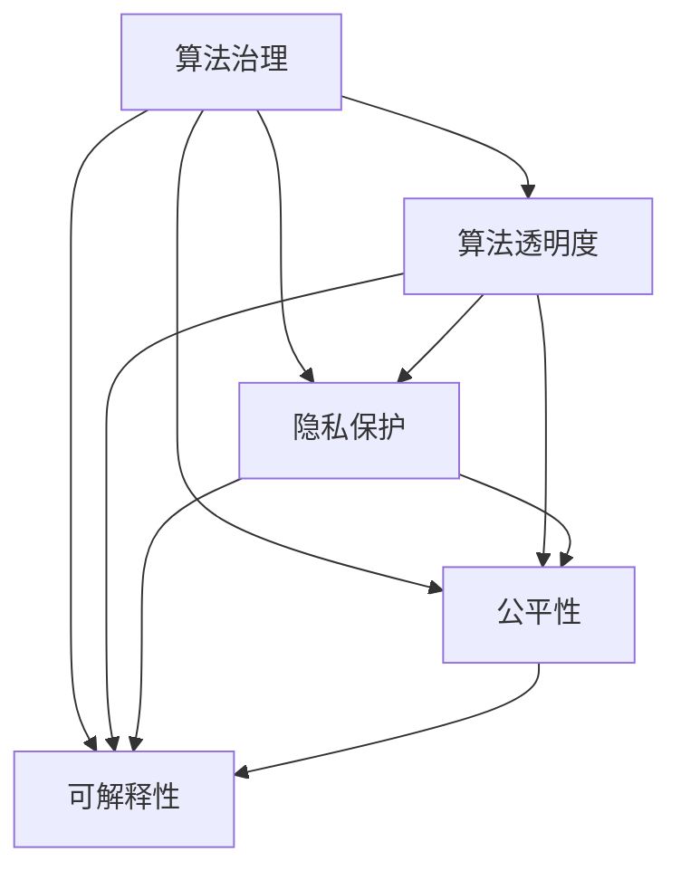

                 

# 数据伦理：算法治理与规范

> 关键词：数据伦理,算法治理,算法透明度,隐私保护,公平性,可解释性

## 1. 背景介绍

在人工智能(AI)领域，尤其是深度学习模型，算法决策的透明性、公平性、隐私保护等数据伦理问题日益引起关注。大数据、深度学习等技术的快速发展，为许多行业带来了巨大的变革和机遇，但也对数据伦理提出了新的挑战。从医疗、金融到交通，各个领域中算法决策的影响力越来越广泛，而公众对这些决策的可解释性、公正性和隐私保护等方面的期望也日益提高。

算法治理与规范是解决这些问题的关键。良好的算法治理机制不仅能确保AI技术的安全和可靠，还能提升公众信任，促进AI技术的公平透明使用。然而，目前在算法治理与规范方面，仍存在诸多挑战和争议。本文旨在从数据伦理的角度，深入探讨算法治理的现状、问题和未来趋势，为未来的算法治理提供有价值的参考和指导。

## 2. 核心概念与联系

### 2.1 核心概念概述

在讨论算法治理与规范之前，需要先理解几个关键概念：

- **算法治理(Algorithm Governance)**：指对算法的制定、使用、维护和监控进行全面管理和监管的过程，确保算法决策的公平性、透明性和可解释性。

- **算法透明度(Algorithm Transparency)**：指算法决策过程的可解释性和可视化程度，让用户能够理解算法的决策依据和结果。

- **隐私保护(Privacy Protection)**：指在算法使用过程中，对个人数据的收集、存储、使用和共享进行管理和保护，确保数据的安全和隐私。

- **公平性(Fairness)**：指算法决策在人群之间应该保持一致性，避免对特定群体产生歧视或偏见。

- **可解释性(Explainability)**：指算法决策的可解释程度，即用户能够理解算法是如何做出某个决定的。

这些概念紧密相关，共同构成了算法治理的核心内容。在实践中，良好的算法治理体系应兼顾这些方面，确保算法决策既准确又公正，同时保护数据隐私，获得公众信任。

### 2.2 核心概念原理和架构的 Mermaid 流程图(Mermaid 流程节点中不要有括号、逗号等特殊字符)



## 3. 核心算法原理 & 具体操作步骤

### 3.1 算法原理概述

算法治理与规范的核心在于确保算法决策的透明性、公平性和可解释性。这需要通过以下几个关键步骤来实现：

- **数据收集与预处理**：确保数据的多样性和代表性，避免数据偏见。
- **算法模型设计**：选择合适的模型架构和参数，确保模型公正和透明。
- **模型训练与验证**：通过交叉验证等技术确保模型泛化能力。
- **算法监控与反馈**：持续监控模型表现，并根据反馈进行调整优化。

### 3.2 算法步骤详解

算法治理的详细步骤包括：

1. **数据收集与预处理**：
   - 定义数据收集的来源和范围，确保数据的代表性。
   - 对数据进行清洗、去重、归一化等预处理，避免数据质量问题。
   - 识别和移除数据中的敏感信息，保护个人隐私。

2. **算法模型设计**：
   - 选择合适的算法模型，如线性回归、决策树、随机森林、神经网络等。
   - 确定模型的超参数，如学习率、正则化系数等，进行适当的调参。
   - 设计模型架构，确保模型能够处理多类别、多维数据等复杂情况。

3. **模型训练与验证**：
   - 使用训练集对模型进行训练，选择合适的损失函数和优化器。
   - 通过交叉验证等技术评估模型的泛化能力，确保模型在未见过的数据上也能表现良好。
   - 使用验证集对模型进行调优，避免过拟合。

4. **算法监控与反馈**：
   - 持续监控模型表现，记录模型在生产环境中的运行情况。
   - 收集用户反馈，评估模型在实际应用中的公平性和透明性。
   - 根据反馈调整模型参数和超参数，进行迭代优化。

### 3.3 算法优缺点

算法治理与规范的优势在于能够提升算法的透明性和公平性，增强用户信任。其缺点在于实施难度较大，需要大量资源和时间。

- **优点**：
  - 确保算法决策的公正性，避免偏见和歧视。
  - 提高算法透明度，增强用户对算法决策的信任。
  - 保护用户隐私，避免数据泄露和滥用。

- **缺点**：
  - 实施难度较大，需要大量资源和时间。
  - 可能引入额外复杂性，影响模型性能。
  - 无法完全消除数据偏见，需要持续监控和调整。

### 3.4 算法应用领域

算法治理与规范的应用领域非常广泛，涵盖金融、医疗、交通、教育等多个行业。

- **金融行业**：在信贷评估、反欺诈检测、客户服务等领域，算法治理能够确保决策的公正性和透明性，保护用户隐私。
- **医疗行业**：在疾病诊断、个性化治疗、医疗资源分配等领域，算法治理能够提升决策的准确性和公正性，保护患者隐私。
- **交通行业**：在自动驾驶、交通流量管理等领域，算法治理能够确保决策的可靠性和公平性，提升交通安全。
- **教育行业**：在在线教育、智能辅导等领域，算法治理能够提升教育公平性，保护学生隐私。

## 4. 数学模型和公式 & 详细讲解 & 举例说明

### 4.1 数学模型构建

在算法治理中，常用的数学模型包括决策树、随机森林、线性回归、神经网络等。这里以线性回归模型为例，讨论算法治理的应用。

**线性回归模型**：
\[ y = \beta_0 + \sum_{i=1}^n \beta_i x_i + \epsilon \]

其中，$y$ 为输出变量，$x_i$ 为输入变量，$\beta_i$ 为模型参数，$\epsilon$ 为误差项。

### 4.2 公式推导过程

线性回归模型的训练过程包括如下步骤：

1. **数据准备**：准备训练集 $(x_1, y_1), (x_2, y_2), \ldots, (x_n, y_n)$，其中 $x_i$ 为输入变量，$y_i$ 为输出变量。
2. **模型初始化**：初始化模型参数 $\beta_i$。
3. **损失函数计算**：计算损失函数 $J(\beta) = \frac{1}{2n} \sum_{i=1}^n (y_i - \hat{y}_i)^2$，其中 $\hat{y}_i$ 为模型预测值。
4. **梯度下降**：计算损失函数对模型参数的梯度 $\nabla_{\beta} J(\beta)$，使用梯度下降算法更新参数 $\beta$。
5. **模型验证**：在验证集上评估模型表现，确保模型泛化能力。
6. **模型应用**：将训练好的模型应用于新数据，进行预测和决策。

### 4.3 案例分析与讲解

以金融行业的信贷评估为例，分析算法治理的应用。

**数据收集**：收集历史贷款记录、用户基本信息、信用评分等数据。

**模型设计**：选择线性回归模型，设计模型参数，如截距、线性系数等。

**模型训练**：在训练集上训练模型，计算损失函数并更新参数。

**模型验证**：在验证集上评估模型表现，确保模型泛化能力。

**模型应用**：将训练好的模型应用于新贷款申请，进行信用评分和贷款决策。

## 5. 项目实践：代码实例和详细解释说明

### 5.1 开发环境搭建

**环境要求**：
- Python 3.7+，推荐使用虚拟环境（Virtual Environment）。
- 安装 NumPy、Pandas、Scikit-learn 等常用库。
- 安装 TensorFlow 或 PyTorch，用于深度学习模型训练。

**环境搭建**：
1. 创建虚拟环境：
\[ python -m venv myenv \]
2. 激活虚拟环境：
\[ source myenv/bin/activate \]
3. 安装依赖库：
\[ pip install numpy pandas scikit-learn tensorflow torch \]

### 5.2 源代码详细实现

**代码实现**：
1. 准备数据集：使用 Pandas 加载数据集，进行数据清洗和预处理。
2. 设计模型：选择线性回归模型，定义模型参数。
3. 训练模型：使用 Scikit-learn 的线性回归模块进行模型训练。
4. 验证模型：在验证集上评估模型表现，调整模型参数。
5. 应用模型：将训练好的模型应用于新数据，进行预测和决策。

**代码示例**：
```python
import numpy as np
import pandas as pd
from sklearn.linear_model import LinearRegression
from sklearn.model_selection import train_test_split

# 准备数据集
df = pd.read_csv('loan_data.csv')
X = df[['age', 'income', 'credit_score']]
y = df['loan_approved']
X_train, X_test, y_train, y_test = train_test_split(X, y, test_size=0.2, random_state=42)

# 设计模型
model = LinearRegression()

# 训练模型
model.fit(X_train, y_train)

# 验证模型
score = model.score(X_test, y_test)
print(f"验证集 R^2: {score}")

# 应用模型
new_loan = [[30, 50000, 700]]
predicted = model.predict(new_loan)
print(f"预测结果: {predicted}")
```

### 5.3 代码解读与分析

**数据处理**：使用 Pandas 库加载数据集，进行数据清洗和预处理。

**模型训练**：使用 Scikit-learn 的线性回归模块进行模型训练，并计算模型在训练集上的 R^2 分数。

**模型评估**：在验证集上评估模型表现，调整模型参数。

**模型应用**：将训练好的模型应用于新贷款申请，进行信用评分和贷款决策。

## 6. 实际应用场景

### 6.1 金融行业

**应用场景**：信贷评估、反欺诈检测、客户服务。

**案例**：某银行使用线性回归模型评估贷款申请人的信用风险，模型输入为年龄、收入、信用评分等，输出为贷款批准与否。通过算法治理，确保模型在各个年龄、收入和信用评分区间内的公平性，保护用户隐私。

### 6.2 医疗行业

**应用场景**：疾病诊断、个性化治疗、医疗资源分配。

**案例**：某医院使用深度学习模型预测病人是否患有某种疾病，模型输入为病人年龄、病史、生化指标等，输出为疾病诊断结果。通过算法治理，确保模型在各个年龄段、不同病史和生化指标组合下的公平性，保护患者隐私。

### 6.3 交通行业

**应用场景**：自动驾驶、交通流量管理。

**案例**：某自动驾驶公司使用深度学习模型预测车辆行驶轨迹，模型输入为车辆位置、速度、周围车辆信息等，输出为下一步行驶方向。通过算法治理，确保模型在各种交通状况下的公平性和透明性，提升交通安全性。

## 7. 工具和资源推荐

### 7.1 学习资源推荐

**在线课程**：
- Coursera 的机器学习课程：由斯坦福大学开设，系统讲解机器学习算法和实践。
- edX 的深度学习专项课程：由 MIT 开设，深入介绍深度学习模型的原理和应用。

**书籍**：
- 《Python机器学习》：通过实例讲解机器学习算法和实现。
- 《深度学习》：由 Ian Goodfellow 等专家撰写，全面介绍深度学习理论和方法。

**在线平台**：
- Kaggle：提供大量数据集和机器学习竞赛，适合实践和比赛。
- GitHub：提供开源机器学习项目，参考和学习。

### 7.2 开发工具推荐

**开发工具**：
- Jupyter Notebook：适合数据处理和模型训练，易于编写和共享代码。
- TensorFlow：强大的深度学习框架，支持分布式计算和模型部署。
- PyTorch：灵活的深度学习框架，适合研究和实验。

**监控工具**：
- TensorBoard：实时监控模型训练过程，可视化模型表现。
- Prometheus：监控和报警系统，记录和分析模型运行状态。

**部署工具**：
- Flask：简单易用的 Web 应用框架，适合快速部署模型服务。
- AWS SageMaker：基于云的机器学习平台，支持模型训练和部署。

### 7.3 相关论文推荐

**论文1**：
- 《Algorithmic Fairness through Preprocessing》：提出数据预处理技术，消除数据中的偏见，确保模型公平性。

**论文2**：
- 《Explainable AI: Interpreting and Visualizing Machine Learning》：介绍可解释性技术，通过可视化手段解释模型决策。

**论文3**：
- 《Differential Privacy in Machine Learning: Privacy or Utility?》：探讨差分隐私技术，保护用户隐私的同时确保模型性能。

## 8. 总结：未来发展趋势与挑战

### 8.1 研究成果总结

算法治理与规范是确保AI技术安全和可靠的重要手段，通过透明性、公平性和可解释性提升公众信任。当前在算法治理方面仍面临诸多挑战，如数据偏见、模型透明性、隐私保护等，需要进一步的研究和实践。

### 8.2 未来发展趋势

未来算法治理将呈现以下几个趋势：

- **数据治理**：加强数据治理，确保数据的多样性和代表性，减少数据偏见。
- **模型可解释性**：提升模型可解释性，增强用户对模型决策的理解和信任。
- **隐私保护**：采用差分隐私等技术，保护用户隐私，确保数据安全。
- **公平性**：设计公平性评估指标，确保模型在各个群体中的公正性。

### 8.3 面临的挑战

尽管算法治理已取得一定进展，但仍面临以下挑战：

- **数据偏见**：数据偏见可能导致模型决策不公平。
- **隐私保护**：数据泄露和滥用可能引发隐私问题。
- **可解释性**：模型决策难以解释，影响用户信任。
- **技术复杂性**：算法治理实施难度较大，需要专业知识和技能。

### 8.4 研究展望

未来算法治理的研究方向包括：

- **数据治理技术**：设计更加公平和透明的数据治理策略，消除数据偏见。
- **模型可解释性技术**：通过可视化、解释性技术提升模型可解释性。
- **隐私保护技术**：采用差分隐私、联邦学习等技术，保护用户隐私。
- **公平性评估指标**：设计公平性评估指标，确保模型在不同群体中的公正性。

## 9. 附录：常见问题与解答

**Q1: 数据偏见如何消除？**

A: 数据偏见是算法治理中的一个重要问题。消除数据偏见的方法包括：
- **数据收集**：确保数据收集的多样性和代表性，避免样本偏差。
- **数据清洗**：对数据进行清洗和去重，消除噪声和异常值。
- **特征选择**：选择对决策有重要影响的特征，避免引入无关特征。
- **模型设计**：使用公平性评估指标，确保模型在不同群体中的公正性。

**Q2: 如何提升模型可解释性？**

A: 提升模型可解释性的方法包括：
- **可视化技术**：使用可视化工具展示模型决策过程，帮助用户理解模型。
- **解释性模型**：使用可解释性模型，如决策树、线性回归等，减少模型黑盒性。
- **特征重要性分析**：分析模型中各特征对决策的影响，解释模型决策依据。

**Q3: 如何保护用户隐私？**

A: 保护用户隐私的方法包括：
- **差分隐私**：通过添加噪声等技术，保护用户数据不被泄露。
- **数据脱敏**：对敏感数据进行脱敏处理，保护用户隐私。
- **联邦学习**：采用联邦学习技术，在本地数据上进行模型训练，避免数据集中存储。

通过以上讨论，可以看出算法治理与规范是大数据和深度学习时代的必然要求。只有通过透明性、公平性和可解释性，才能确保算法的安全可靠，赢得公众信任。未来，算法治理将持续发展，为AI技术的应用注入新的动力，带来更加公平、透明、可信的社会。

---

作者：禅与计算机程序设计艺术 / Zen and the Art of Computer Programming

