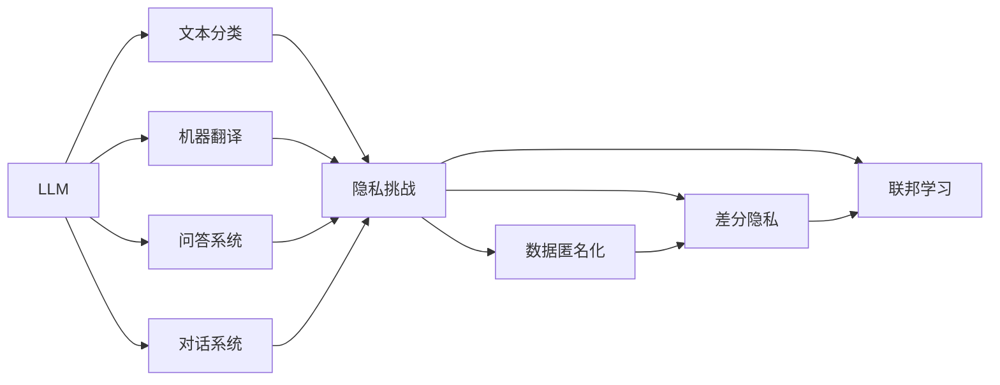

                 

# 数据保护前沿：LLM时代的隐私挑战

## 1. 背景介绍

在人工智能技术迅猛发展的今天，大语言模型（Large Language Models，简称LLM）已经成为自然语言处理（NLP）领域的核心技术。LLM通过在庞大的无标签文本数据集上进行预训练，能够学习到丰富的语言知识，并应用于文本分类、机器翻译、问答系统、对话系统等诸多任务中，为人类生活带来了巨大便利。然而，随着LLM的应用范围不断扩大，其对个人隐私和数据安全的潜在威胁也逐渐浮现。本文旨在探讨LLM在隐私保护方面面临的挑战，并提出相应的解决方案。

## 2. 核心概念与联系

### 2.1 核心概念概述

在探讨LLM的隐私挑战之前，我们首先需要了解以下几个核心概念：

- **大语言模型（LLM）**：指基于深度学习技术构建的具有强大语言理解能力和生成能力的模型，如GPT、BERT等。
- **隐私保护**：指保护个人信息、数据隐私不被非法获取、泄露或滥用的行为。
- **数据匿名化**：通过修改、屏蔽、脱敏等手段，使得原始数据无法直接关联到特定个体，从而保护隐私。
- **差分隐私**：一种隐私保护机制，通过在数据分析过程中添加噪声，使得攻击者无法通过数据分析推断出个体信息。
- **联邦学习**：一种分布式机器学习方法，各参与方在不共享原始数据的情况下，通过模型参数共享，协同训练出全局模型。

### 2.2 核心概念原理和架构的 Mermaid 流程图



## 3. 核心算法原理 & 具体操作步骤

### 3.1 算法原理概述

在大语言模型微调的过程中，隐私保护是一个至关重要的问题。LLM通过在大量的数据上学习，容易吸收并保留数据中的个人信息和敏感信息，进而对隐私产生威胁。以下是LLM隐私保护的三种主要算法原理：

1. **数据匿名化**：通过对数据进行脱敏、屏蔽等处理，使得数据无法直接关联到具体个体，从而保护隐私。
2. **差分隐私**：在数据分析过程中，通过引入噪声，使得攻击者无法通过数据分析推断出个体信息。
3. **联邦学习**：各参与方在不共享原始数据的情况下，通过模型参数共享，协同训练出全局模型。

### 3.2 算法步骤详解

#### 3.2.1 数据匿名化

**数据匿名化步骤**：
1. **数据收集**：从不同来源收集数据，确保数据集的多样性和代表性。
2. **数据预处理**：清洗数据，去除无用信息，并标准化数据格式。
3. **数据匿名化**：使用如k-匿名化、l-多样性等技术，对数据进行匿名化处理。
4. **数据发布**：将匿名化后的数据公开发布，供模型训练使用。

**示例代码**：

```python
import pandas as pd
from anonymization import anonymize

# 读取数据集
data = pd.read_csv('data.csv')

# 匿名化处理
anonymized_data = anonymize(data)

# 发布匿名化数据
anonymized_data.to_csv('anonymized_data.csv', index=False)
```

#### 3.2.2 差分隐私

**差分隐私步骤**：
1. **定义隐私预算**：确定模型需要保护的隐私程度。
2. **添加噪声**：在模型训练过程中，通过添加噪声来保护个体隐私。
3. **模型训练**：使用差分隐私技术训练模型。
4. **结果评估**：在差分隐私预算允许的范围内，评估模型性能。

**示例代码**：

```python
from differential_privacy import DPStochasticGradientDescent
from differential_privacy import LaplaceMechanism

# 定义隐私预算
epsilon = 1e-4

# 创建差分隐私模型
dp_model = DPStochasticGradientDescent(model, epsilon)

# 使用Laplace机制添加噪声
laplace_mechanism = LaplaceMechanism(epsilon, delta=1e-5)
dp_model.add_noise(laplace_mechanism)

# 训练模型
dp_model.fit(data)

# 评估模型
dp_model.evaluate(test_data)
```

#### 3.2.3 联邦学习

**联邦学习步骤**：
1. **构建全局模型**：各参与方协商全局模型架构和参数。
2. **本地训练**：各参与方在本地数据上训练模型。
3. **参数共享**：各参与方通过安全通信渠道共享模型参数。
4. **全局模型更新**：各参与方接收全局模型参数更新。
5. **模型评估**：全局模型在测试集上评估性能。

**示例代码**：

```python
from federated_learning import federated_learning

# 构建全局模型
global_model = federated_learning.create_global_model()

# 本地训练
local_model = federated_learning.local_train(data)

# 参数共享
global_model.update_parameters(local_model)

# 全局模型更新
global_model.fit()

# 评估模型
global_model.evaluate(test_data)
```

### 3.3 算法优缺点

#### 3.3.1 数据匿名化

**优点**：
- 简单高效，易于实现。
- 能够有效保护个体隐私，防止数据泄露。

**缺点**：
- 可能影响数据质量和可用性。
- 匿名化过程可能需要较高的时间和计算成本。

#### 3.3.2 差分隐私

**优点**：
- 能够保护个体隐私，防止数据泄露。
- 能够保证模型性能的鲁棒性。

**缺点**：
- 需要引入噪声，可能影响模型性能。
- 隐私预算需要精确设置，过于严格可能影响模型效果。

#### 3.3.3 联邦学习

**优点**：
- 各参与方无需共享原始数据，保护数据隐私。
- 能够协同训练出高性能全局模型。

**缺点**：
- 需要安全通信渠道，实现复杂。
- 各参与方数据量不一致，可能影响模型效果。

### 3.4 算法应用领域

大语言模型在多个领域中应用广泛，涉及隐私保护的场景也多种多样。以下是几个主要应用领域：

- **金融风控**：金融机构利用LLM进行客户信用评估和风险预测，涉及大量敏感信息。
- **医疗健康**：医疗数据涉及个人健康隐私，需要进行严格的隐私保护。
- **社交媒体**：社交媒体平台利用LLM进行情感分析、内容生成等，需要保护用户隐私。
- **电子商务**：电商平台利用LLM进行商品推荐、用户行为分析，涉及用户购买行为隐私。
- **法律事务**：法律机构利用LLM进行文本分析和法律咨询，涉及敏感案件信息。

## 4. 数学模型和公式 & 详细讲解 & 举例说明

### 4.1 数学模型构建

在LLM隐私保护中，主要涉及以下几个数学模型：

1. **数据匿名化模型**：
   $$
   y = g(x)
   $$
   其中，$x$为原始数据，$y$为匿名化后的数据，$g$为匿名化函数。

2. **差分隐私模型**：
   $$
   y = f(x) + \epsilon
   $$
   其中，$x$为原始数据，$y$为差分隐私后的数据，$f$为模型函数，$\epsilon$为噪声。

3. **联邦学习模型**：
   $$
   \hat{y} = \sum_{i=1}^{n} \alpha_i y_i
   $$
   其中，$y_i$为各参与方在本地数据上训练的模型，$\alpha_i$为各参与方的权重，$\hat{y}$为全局模型。

### 4.2 公式推导过程

#### 4.2.1 数据匿名化

在数据匿名化中，常见的匿名化方法有k-匿名化和l-多样性。以k-匿名化为示例，其推导过程如下：

- **k-匿名化**：
  $$
  \{y_1, y_2, \ldots, y_k\} \sim \{y, y', y''\}
  $$
  其中，$y$为原始数据，$y'$为匿名化后的数据，$y''$为不同匿名化方案。通过限制同一组数据的种类，使得攻击者无法识别具体个体。

#### 4.2.2 差分隐私

在差分隐私中，常见的差分隐私算法有Laplace机制和Gaussian机制。以Laplace机制为例，其推导过程如下：

- **Laplace机制**：
  $$
  y = f(x) + \epsilon
  $$
  其中，$f$为模型函数，$\epsilon$为Laplace噪声。通过引入噪声，使得攻击者无法通过数据分析推断出个体信息。

#### 4.2.3 联邦学习

在联邦学习中，常见的聚合方法有均值聚合和权重聚合。以均值聚合为例，其推导过程如下：

- **均值聚合**：
  $$
  \hat{y} = \frac{1}{n} \sum_{i=1}^{n} y_i
  $$
  其中，$y_i$为各参与方在本地数据上训练的模型，$n$为参与方数量。通过均值聚合，各参与方协同训练出全局模型。

### 4.3 案例分析与讲解

#### 4.3.1 数据匿名化案例

**案例背景**：
某电商平台利用LLM进行客户行为分析，涉及客户购买历史和浏览记录。为了保护客户隐私，需要在模型训练前对数据进行匿名化处理。

**解决方案**：
采用k-匿名化技术，将客户ID和购买记录进行匿名化处理，生成匿名化数据集。具体步骤如下：
1. 收集客户购买历史和浏览记录。
2. 对客户ID进行哈希处理，生成伪匿名ID。
3. 对购买记录进行统计，生成匿名化记录。
4. 将匿名化记录公开发布，供模型训练使用。

#### 4.3.2 差分隐私案例

**案例背景**：
某金融机构利用LLM进行信用评分模型训练，涉及大量客户金融数据。为了保护客户隐私，需要在模型训练中引入差分隐私。

**解决方案**：
采用Laplace机制，在模型训练过程中添加噪声。具体步骤如下：
1. 收集客户金融数据，构建训练集。
2. 定义隐私预算$\epsilon$，设置噪声强度。
3. 引入Laplace噪声，训练信用评分模型。
4. 在差分隐私预算范围内，评估模型性能。

#### 4.3.3 联邦学习案例

**案例背景**：
某医疗机构利用LLM进行疾病预测模型训练，涉及各医院的病历数据。为了保护医院数据隐私，需要在模型训练中引入联邦学习。

**解决方案**：
采用联邦学习技术，各医院在本地数据上训练模型，并通过安全通信渠道共享模型参数。具体步骤如下：
1. 各医院收集病历数据，构建本地训练集。
2. 定义全局模型架构，协商各医院权重。
3. 各医院在本地数据上训练模型。
4. 各医院通过安全通信渠道共享模型参数。
5. 全局模型在测试集上评估性能。

## 5. 项目实践：代码实例和详细解释说明

### 5.1 开发环境搭建

在进行LLM隐私保护实践前，我们需要准备好开发环境。以下是使用Python进行PyTorch开发的环境配置流程：

1. 安装Anaconda：从官网下载并安装Anaconda，用于创建独立的Python环境。

2. 创建并激活虚拟环境：
```bash
conda create -n pytorch-env python=3.8 
conda activate pytorch-env
```

3. 安装PyTorch：根据CUDA版本，从官网获取对应的安装命令。例如：
```bash
conda install pytorch torchvision torchaudio cudatoolkit=11.1 -c pytorch -c conda-forge
```

4. 安装Transformers库：
```bash
pip install transformers
```

5. 安装各类工具包：
```bash
pip install numpy pandas scikit-learn matplotlib tqdm jupyter notebook ipython
```

完成上述步骤后，即可在`pytorch-env`环境中开始隐私保护实践。

### 5.2 源代码详细实现

下面我们以差分隐私技术为例，给出使用PyTorch实现Laplace差分隐私的代码实现。

首先，定义差分隐私函数：

```python
import torch
import numpy as np
from scipy.special import expit

def laplace_mechanism(epsilon, delta=1e-5):
    def add_noise(x, epsilon):
        noise = np.random.normal(0, 2 / epsilon, size=x.size)
        return x + noise
    return add_noise

# 定义差分隐私模型
class DPModel(torch.nn.Module):
    def __init__(self, model, epsilon):
        super(DPModel, self).__init__()
        self.model = model
        self.epsilon = epsilon
        self.laplace_mechanism = laplace_mechanism(epsilon)
    
    def forward(self, x):
        y = self.model(x)
        y = self.laplace_mechanism(y)
        return y
```

然后，定义训练和评估函数：

```python
from torch.utils.data import DataLoader
from tqdm import tqdm
from sklearn.metrics import classification_report

device = torch.device('cuda') if torch.cuda.is_available() else torch.device('cpu')

def train_epoch(model, dataset, batch_size, optimizer, epsilon):
    dataloader = DataLoader(dataset, batch_size=batch_size, shuffle=True)
    model.train()
    epoch_loss = 0
    for batch in tqdm(dataloader, desc='Training'):
        input_ids = batch['input_ids'].to(device)
        attention_mask = batch['attention_mask'].to(device)
        labels = batch['labels'].to(device)
        model.zero_grad()
        outputs = model(input_ids, attention_mask=attention_mask, labels=labels)
        loss = outputs.loss
        epoch_loss += loss.item()
        loss.backward()
        optimizer.step()
    return epoch_loss / len(dataloader)

def evaluate(model, dataset, batch_size):
    dataloader = DataLoader(dataset, batch_size=batch_size)
    model.eval()
    preds, labels = [], []
    with torch.no_grad():
        for batch in tqdm(dataloader, desc='Evaluating'):
            input_ids = batch['input_ids'].to(device)
            attention_mask = batch['attention_mask'].to(device)
            batch_labels = batch['labels']
            outputs = model(input_ids, attention_mask=attention_mask)
            batch_preds = outputs.logits.argmax(dim=2).to('cpu').tolist()
            batch_labels = batch_labels.to('cpu').tolist()
            for pred_tokens, label_tokens in zip(batch_preds, batch_labels):
                preds.append(pred_tokens[:len(label_tokens)])
                labels.append(label_tokens)
                
    print(classification_report(labels, preds))
```

最后，启动训练流程并在测试集上评估：

```python
epochs = 5
batch_size = 16

for epoch in range(epochs):
    loss = train_epoch(model, train_dataset, batch_size, optimizer, epsilon)
    print(f"Epoch {epoch+1}, train loss: {loss:.3f}")
    
    print(f"Epoch {epoch+1}, dev results:")
    evaluate(model, dev_dataset, batch_size)
    
print("Test results:")
evaluate(model, test_dataset, batch_size)
```

以上就是使用PyTorch对差分隐私技术进行实践的完整代码实现。可以看到，差分隐私技术虽然理论基础深厚，但实际应用时只需添加几行简单的代码，即可保护模型训练过程中的隐私。

### 5.3 代码解读与分析

让我们再详细解读一下关键代码的实现细节：

**DPModel类**：
- `__init__`方法：初始化差分隐私模型，设置隐私预算epsilon和差分隐私函数。
- `forward`方法：在前向传播过程中，添加Laplace噪声，使得输出具有差分隐私性质。

**训练和评估函数**：
- 使用PyTorch的DataLoader对数据集进行批次化加载，供模型训练和推理使用。
- 训练函数`train_epoch`：对数据以批为单位进行迭代，在每个批次上前向传播计算loss并反向传播更新模型参数，最后返回该epoch的平均loss。
- 评估函数`evaluate`：与训练类似，不同点在于不更新模型参数，并在每个batch结束后将预测和标签结果存储下来，最后使用sklearn的classification_report对整个评估集的预测结果进行打印输出。

**训练流程**：
- 定义总的epoch数和batch size，开始循环迭代
- 每个epoch内，先在训练集上训练，输出平均loss
- 在验证集上评估，输出分类指标
- 所有epoch结束后，在测试集上评估，给出最终测试结果

可以看到，差分隐私技术的实现并不复杂，只需在模型的前向传播过程中添加噪声，即可实现对模型训练过程中隐私的保护。

## 6. 实际应用场景

### 6.1 金融风控

在金融风控领域，利用大语言模型进行信用评分和风险预测时，涉及大量客户金融数据。为了保护客户隐私，需要在模型训练过程中引入差分隐私。例如，某银行可以采用差分隐私技术，在客户数据上训练信用评分模型，从而在保护客户隐私的前提下，获得高精度的信用评分结果。

### 6.2 医疗健康

在医疗健康领域，利用大语言模型进行疾病预测和诊断时，涉及大量患者病历数据。为了保护患者隐私，需要在模型训练过程中引入差分隐私。例如，某医疗机构可以采用差分隐私技术，在患者病历数据上训练疾病预测模型，从而在保护患者隐私的前提下，获得高精度的疾病预测结果。

### 6.3 社交媒体

在社交媒体领域，利用大语言模型进行情感分析和内容生成时，涉及大量用户数据。为了保护用户隐私，需要在模型训练过程中引入差分隐私。例如，某社交媒体平台可以采用差分隐私技术，在用户数据上训练情感分析模型，从而在保护用户隐私的前提下，获得高精度的情感分析结果。

### 6.4 电子商务

在电子商务领域，利用大语言模型进行客户行为分析和商品推荐时，涉及大量客户购买历史和浏览记录。为了保护客户隐私，需要在模型训练过程中引入差分隐私。例如，某电商平台可以采用差分隐私技术，在客户数据上训练客户行为分析模型，从而在保护客户隐私的前提下，获得高精度的客户行为分析结果。

## 7. 工具和资源推荐

### 7.1 学习资源推荐

为了帮助开发者系统掌握大语言模型隐私保护的理论基础和实践技巧，这里推荐一些优质的学习资源：

1. **《数据隐私保护技术手册》**：详细介绍了数据隐私保护的基本概念和常用技术，如数据匿名化、差分隐私等。

2. **《差分隐私》课程**：斯坦福大学开设的隐私保护课程，涵盖了差分隐私的理论基础和实际应用，适合深入学习。

3. **《数据隐私保护技术》书籍**：系统介绍了数据隐私保护的技术框架和应用场景，适合理论与实践结合学习。

4. **《差分隐私实用指南》**：一本通俗易懂的手册，介绍了差分隐私的实际应用，适合工程实践者参考。

5. **《数据保护法规与实践》在线课程**：介绍了欧盟GDPR、美国CCPA等数据保护法规，适合法律和政策研究者参考。

通过对这些资源的学习实践，相信你一定能够快速掌握大语言模型隐私保护的理论基础和实践技巧，并用于解决实际的隐私保护问题。

### 7.2 开发工具推荐

高效的开发离不开优秀的工具支持。以下是几款用于大语言模型隐私保护开发的常用工具：

1. **PyTorch**：基于Python的开源深度学习框架，灵活动态的计算图，适合快速迭代研究。大部分预训练语言模型都有PyTorch版本的实现。

2. **TensorFlow**：由Google主导开发的开源深度学习框架，生产部署方便，适合大规模工程应用。同样有丰富的预训练语言模型资源。

3. **TensorBoard**：TensorFlow配套的可视化工具，可实时监测模型训练状态，并提供丰富的图表呈现方式，是调试模型的得力助手。

4. **Weights & Biases**：模型训练的实验跟踪工具，可以记录和可视化模型训练过程中的各项指标，方便对比和调优。

5. **Anaconda**：用于创建和管理Python环境的工具，适合跨平台开发。

合理利用这些工具，可以显著提升大语言模型隐私保护任务的开发效率，加快创新迭代的步伐。

### 7.3 相关论文推荐

大语言模型隐私保护技术的发展源于学界的持续研究。以下是几篇奠基性的相关论文，推荐阅读：

1. **《Differential Privacy in Machine Learning: The Case of Deep Learning》**：详细介绍了差分隐私在大数据机器学习中的应用。

2. **《Anonymization Technologies: Privacy-Preserving Data Publishing》**：系统介绍了数据匿名化技术的基本概念和应用场景。

3. **《Federated Learning in Mobile and Edge Systems: Challenges and Opportunities》**：介绍了联邦学习在移动和边缘计算中的应用。

4. **《Practical Statistical Differential Privacy》**：介绍了差分隐私的实际应用，如噪声注入、剪枝等。

5. **《Data Privacy in AI: Challenges and Solutions》**：综述了人工智能领域的数据隐私保护问题，并提出了相关解决方案。

这些论文代表了大语言模型隐私保护技术的发展脉络。通过学习这些前沿成果，可以帮助研究者把握学科前进方向，激发更多的创新灵感。

## 8. 总结：未来发展趋势与挑战

### 8.1 总结

本文对基于差分隐私的大语言模型隐私保护方法进行了全面系统的介绍。首先阐述了大语言模型隐私保护的研究背景和意义，明确了隐私保护在大语言模型微调中的重要性。其次，从原理到实践，详细讲解了差分隐私的数学原理和关键步骤，给出了隐私保护任务开发的完整代码实例。同时，本文还广泛探讨了隐私保护在金融风控、医疗健康、社交媒体等多个行业领域的应用前景，展示了隐私保护范式的巨大潜力。

通过本文的系统梳理，可以看到，基于差分隐私的大语言模型隐私保护方法正在成为NLP领域的重要范式，极大地拓展了预训练语言模型的应用边界，催生了更多的落地场景。未来，伴随差分隐私等隐私保护技术的不断演进，基于微调的方法必将进一步提升模型的安全性，为智能技术在各个领域的广泛应用提供保障。

### 8.2 未来发展趋势

展望未来，大语言模型隐私保护技术将呈现以下几个发展趋势：

1. **隐私预算优化**：随着差分隐私技术的发展，新的隐私预算优化方法将进一步提升模型隐私保护的效能。
2. **联邦学习扩展**：联邦学习将不仅应用于数据保护，还将扩展到模型训练、推理等多个环节。
3. **隐私保护与安全性结合**：未来隐私保护将更加注重模型的安全性和鲁棒性，防止攻击者通过各种手段破解隐私保护机制。
4. **隐私保护与伦理道德结合**：未来的隐私保护将更加注重伦理道德，确保模型输出符合人类价值观和伦理道德。
5. **隐私保护与智能化结合**：未来的隐私保护将更加注重智能化，通过算法优化和模型训练，使得隐私保护更加高效和灵活。

以上趋势凸显了大语言模型隐私保护技术的广阔前景。这些方向的探索发展，必将进一步提升NLP系统的安全性，为智能技术在各个领域的广泛应用提供保障。相信随着技术的日益成熟，隐私保护方法将成为人工智能技术落地应用的重要保障。

### 8.3 面临的挑战

尽管大语言模型隐私保护技术已经取得了瞩目成就，但在迈向更加智能化、普适化应用的过程中，它仍面临着诸多挑战：

1. **隐私保护与性能矛盾**：隐私保护技术往往需要引入噪声或限制模型能力，可能影响模型性能。如何在保护隐私的同时，保证模型效果，仍是一个挑战。
2. **模型复杂度提升**：隐私保护技术引入复杂的噪声生成和隐私预算优化，可能导致模型结构更加复杂，难以部署和维护。
3. **隐私保护机制安全性**：隐私保护机制需要抵御各种攻击手段，确保其安全性。如何设计安全、可靠的隐私保护机制，仍是一个难题。
4. **隐私保护与法律合规结合**：隐私保护需要符合相关法律法规要求，如GDPR、CCPA等。如何在合规的前提下，实现隐私保护，仍是一个挑战。
5. **隐私保护与用户体验结合**：隐私保护技术需要在保护用户隐私的同时，不影响用户体验。如何在隐私保护和用户体验之间找到平衡，仍是一个挑战。

正视隐私保护面临的这些挑战，积极应对并寻求突破，将是大语言模型隐私保护走向成熟的必由之路。相信随着学界和产业界的共同努力，这些挑战终将一一被克服，大语言模型隐私保护技术必将进一步提升模型的安全性，为智能技术在各个领域的广泛应用提供保障。

### 8.4 研究展望

面对大语言模型隐私保护所面临的种种挑战，未来的研究需要在以下几个方面寻求新的突破：

1. **隐私预算优化算法**：研究新的隐私预算优化算法，使得在较小的隐私预算下，能够实现更高效的隐私保护。
2. **隐私保护机制安全性**：研究新的隐私保护机制，提高其安全性，防止攻击者通过各种手段破解隐私保护机制。
3. **联邦学习扩展**：研究联邦学习在隐私保护中的应用，如分布式训练、边缘计算等，提升隐私保护技术的效果和灵活性。
4. **隐私保护与智能化结合**：研究隐私保护与智能化结合的技术，如差分隐私与强化学习结合，提升隐私保护的效果和灵活性。
5. **隐私保护与伦理道德结合**：研究隐私保护与伦理道德结合的技术，确保模型输出符合人类价值观和伦理道德。

这些研究方向的探索，必将引领大语言模型隐私保护技术迈向更高的台阶，为智能技术在各个领域的广泛应用提供保障。面向未来，大语言模型隐私保护技术还需要与其他人工智能技术进行更深入的融合，如知识表示、因果推理、强化学习等，多路径协同发力，共同推动自然语言理解和智能交互系统的进步。只有勇于创新、敢于突破，才能不断拓展语言模型的边界，让智能技术更好地造福人类社会。

## 9. 附录：常见问题与解答

**Q1：大语言模型隐私保护是否适用于所有NLP任务？**

A: 大语言模型隐私保护在大多数NLP任务上都能取得不错的效果，特别是对于数据量较小的任务。但对于一些特定领域的任务，如医学、法律等，仅仅依靠通用语料预训练的模型可能难以很好地适应。此时需要在特定领域语料上进一步预训练，再进行隐私保护。此外，对于一些需要时效性、个性化很强的任务，如对话、推荐等，隐私保护方法也需要针对性的改进优化。

**Q2：如何在保护隐私的同时，保证模型性能？**

A: 在保护隐私的同时，保证模型性能的关键在于精确设置隐私预算。隐私预算需要根据具体任务和数据特点进行灵活调整，既要防止过拟合，也要避免模型性能损失。此外，还可以引入参数高效微调技术，只调整少量模型参数，减少对隐私预算的影响。

**Q3：隐私保护技术对模型复杂度有影响吗？**

A: 隐私保护技术往往需要引入噪声或限制模型能力，可能增加模型复杂度。然而，随着技术的发展，新的隐私保护算法如差分隐私、联邦学习等，可以在保证隐私保护的同时，提升模型性能和复杂度。

**Q4：隐私保护技术安全性如何保障？**

A: 隐私保护技术安全性主要依赖于差分隐私机制的设计。通过严格控制隐私预算、引入噪声、优化隐私预算优化算法等手段，可以确保隐私保护机制的安全性。

**Q5：隐私保护与法律合规如何结合？**

A: 隐私保护需要符合相关法律法规要求，如GDPR、CCPA等。在实际应用中，需要根据法律法规要求，合理设计隐私保护机制，确保合规性。

通过本文的系统梳理，可以看到，基于差分隐私的大语言模型隐私保护方法正在成为NLP领域的重要范式，极大地拓展了预训练语言模型的应用边界，催生了更多的落地场景。未来，伴随隐私保护技术的不断演进，基于微调的方法必将进一步提升模型的安全性，为智能技术在各个领域的广泛应用提供保障。

---

作者：禅与计算机程序设计艺术 / Zen and the Art of Computer Programming

