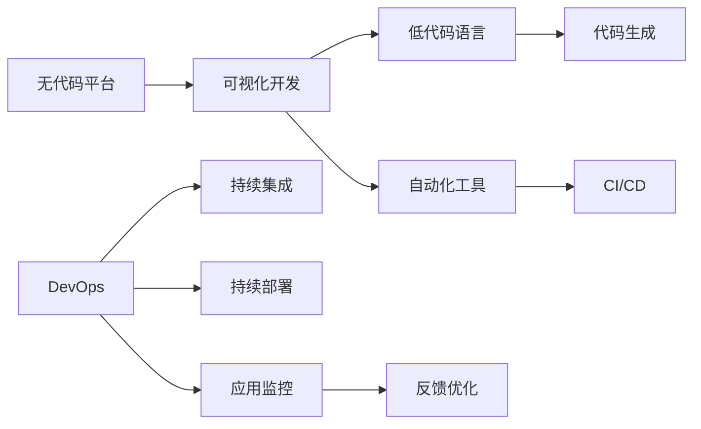

                 

# 无代码开发创业：降低技术门槛的利器

## 1. 背景介绍

### 1.1 问题由来

在数字化浪潮席卷全球的当下，软件开发已成为各行各业不可或缺的核心能力。然而，对于许多初创企业，特别是中小企业和技术密集型行业，缺乏熟练的开发者是一个常见的痛点。技术门槛高、开发周期长、维护成本高等问题，严重制约了企业的创新速度和市场竞争力。

为了解决这一问题，无代码开发（No-Code Development）技术应运而生。无代码开发是指无需编写代码，通过拖拽界面组件、自定义业务逻辑、快速生成应用界面等方式，实现应用程序的开发。该技术旨在降低技术门槛，让非技术人员也能够参与应用开发，从而加快企业创新，提高工作效率。

### 1.2 问题核心关键点

无代码开发的核心在于利用平台和工具，将复杂的开发过程简化为可视化界面操作，大大降低了对编程语言和开发技能的依赖。其关键点包括：

- 可视化操作：开发人员通过拖拽界面组件、调整布局等简单操作，完成应用程序构建。
- 组件化设计：应用界面由若干标准组件构成，这些组件具有通用性和可复用性。
- 业务逻辑编写：开发人员在平台上通过编写脚本或配置规则，实现业务逻辑。
- 自动生成代码：平台自动将界面设计和业务逻辑生成可执行代码，实现应用构建。
- 动态部署与维护：应用构建完成后，可一键部署至云端或本地服务器，实现快速上线。

这些关键点使无代码开发成为降低技术门槛、加速企业创新的重要手段。

### 1.3 问题研究意义

无代码开发技术对降低技术门槛、提升企业竞争力具有重要意义：

1. **加速创新**：非技术人员可以快速上手开发，缩短项目周期，加速产品迭代。
2. **降低成本**：无需长期雇佣大量开发者，减少人力成本和招聘培训成本。
3. **提高效率**：自动化工具提升开发效率，减少手动编码的错误和繁琐。
4. **灵活应对变化**：开发过程直观透明，便于及时调整和优化。
5. **拓展应用范围**：非技术人员可以参与开发，拓宽技术团队的多样性和创新性。

无代码开发不仅为企业带来了技术优势，更促进了全员参与的创新文化，为各行各业的数字化转型提供了新的思路和方法。

## 2. 核心概念与联系

### 2.1 核心概念概述

无代码开发的核心概念包括无代码平台、低代码语言、自动化工具和DevOps等。这些概念通过技术手段，实现了开发过程的自动化和可视化，大幅降低了对技术专家的依赖。

- **无代码平台**：提供可视化开发界面，支持拖拽组件、配置规则等操作，简化开发过程。
- **低代码语言**：提供易读易写的编程语言，支持面向对象、面向流程的编程方式，降低编程难度。
- **自动化工具**：集成代码生成、版本控制、持续集成/持续部署(CI/CD)等功能，提升开发效率。
- **DevOps**：融合开发与运维，实现自动化构建、测试、部署，确保应用稳定运行。

这些核心概念通过技术手段，使非技术人员也能高效地参与应用开发，形成了一体化的开发和运维流程。

### 2.2 核心概念原理和架构的 Mermaid 流程图



这个流程图展示了无代码开发的核心概念和流程：

1. **无代码平台**：提供可视化开发界面，支持拖拽组件和配置规则。
2. **低代码语言**：简化编程难度，使用易读易写的语法，支持面向对象和面向流程的编程。
3. **自动化工具**：集成代码生成、版本控制、持续集成/持续部署等功能，提升开发效率。
4. **DevOps**：融合开发与运维，实现自动化构建、测试、部署，确保应用稳定运行。

这些技术手段共同构成了无代码开发的完整框架，实现了开发过程的自动化和可视化，大幅降低了对技术专家的依赖。

## 3. 核心算法原理 & 具体操作步骤

### 3.1 算法原理概述

无代码开发的算法原理主要基于组件化设计和自动化生成代码的思路。具体而言，开发人员通过可视化界面拖拽组件，实现界面布局和功能设计；通过低代码语言编写脚本或规则，实现业务逻辑；最后，平台自动生成代码，构建完整的应用系统。

这种算法原理的核心在于将复杂的软件开发过程拆解为一系列简单直观的操作，大大降低了技术门槛，使非技术人员也能高效参与开发。

### 3.2 算法步骤详解

无代码开发的主要操作步骤包括：

1. **设计界面**：通过可视化界面，拖拽组件并调整布局，设计应用界面。
2. **编写业务逻辑**：在平台上编写低代码脚本或配置规则，实现应用功能。
3. **自动生成代码**：平台自动将界面设计和业务逻辑生成可执行代码，构建完整应用。
4. **部署应用**：一键部署应用至云端或本地服务器，实现快速上线。
5. **监控与优化**：实时监控应用状态，根据反馈优化应用。

以下是具体步骤的详细说明：

**Step 1: 界面设计**

- **组件拖拽**：通过可视化界面，开发者可以拖拽标准组件，如按钮、输入框、列表等，构建界面布局。
- **调整属性**：调整组件的大小、颜色、位置等属性，实现个性化设计。
- **配置交互**：配置组件之间的交互逻辑，实现按钮点击、表单提交等操作。

**Step 2: 编写业务逻辑**

- **低代码脚本**：使用类似Python的易读易写语法，编写业务逻辑脚本，实现数据处理、业务规则等功能。
- **规则配置**：通过配置规则，实现业务逻辑的自动执行，支持条件判断、循环控制等操作。

**Step 3: 自动生成代码**

- **代码生成工具**：平台集成代码生成工具，自动将界面设计和业务逻辑生成可执行代码。
- **语言支持**：支持多种编程语言，如JavaScript、TypeScript、Python等，便于开发者熟悉。

**Step 4: 部署应用**

- **一键部署**：点击一键部署按钮，应用自动部署至云端或本地服务器，实现快速上线。
- **版本控制**：集成版本控制工具，记录开发历史，便于回溯和协作。

**Step 5: 监控与优化**

- **实时监控**：集成监控工具，实时监测应用状态，获取性能指标。
- **反馈优化**：根据监控反馈，优化应用性能和用户体验，实现持续改进。

### 3.3 算法优缺点

无代码开发技术具有以下优点：

1. **降低技术门槛**：通过可视化界面和低代码语言，使非技术人员也能高效参与开发。
2. **提高开发效率**：自动化工具提升开发效率，减少手动编码的错误和繁琐。
3. **加速产品迭代**：非技术人员可以快速上手开发，缩短项目周期，加速产品迭代。
4. **降低成本**：无需长期雇佣大量开发者，减少人力成本和招聘培训成本。
5. **拓展应用范围**：非技术人员可以参与开发，拓宽技术团队的多样性和创新性。

同时，该技术也存在一些局限性：

1. **功能限制**：对于复杂需求和高性能要求的应用，无代码开发可能难以满足。
2. **学习曲线**：需要一定时间学习使用平台和工具，对于技术新手可能存在适应期。
3. **维护难度**：自动化生成的代码可能存在问题，维护难度较大。
4. **依赖平台**：开发者对平台的依赖较大，一旦平台出现问题，应用可能受影响。
5. **灵活性不足**：对于一些特殊需求和复杂逻辑，低代码语言可能难以实现。

### 3.4 算法应用领域

无代码开发技术在多个领域得到了广泛应用，主要包括以下几个方面：

1. **企业内部应用**：如企业门户、人力资源管理、内部协作平台等，实现内部信息管理和流程自动化。
2. **客户关系管理**：如CRM系统、客户反馈平台等，提升客户服务质量和体验。
3. **电子商务**：如电商管理、在线商店、产品推荐系统等，实现销售和营销自动化。
4. **数据分析**：如数据分析平台、报表生成系统等，实现数据处理和可视化。
5. **医疗健康**：如电子病历系统、健康管理平台等，实现医疗数据的收集和管理。
6. **教育培训**：如在线学习平台、课程管理系统等，提升教育培训的灵活性和互动性。

这些应用场景体现了无代码开发技术的广泛适用性，为各行各业的数字化转型提供了新的思路和方法。

## 4. 数学模型和公式 & 详细讲解 & 举例说明

### 4.1 数学模型构建

无代码开发的数学模型主要基于组件化设计和自动化生成代码的思路。开发人员通过可视化界面拖拽组件，实现界面布局和功能设计；通过低代码语言编写脚本或规则，实现业务逻辑；最后，平台自动生成代码，构建完整的应用系统。

### 4.2 公式推导过程

以一个简单的界面设计为例，说明无代码开发的数学模型构建过程：

假设界面由两个按钮和一条消息框组成，用户点击按钮后，消息框显示一条消息。开发人员通过可视化界面拖拽按钮和消息框，并调整其位置和大小。同时，编写低代码脚本，定义按钮的点击事件和消息框的显示逻辑：

- 按钮1的点击事件：
  $$
  \text{Click Button 1} \rightarrow \text{Show Message "Hello World"}
  $$
- 按钮2的点击事件：
  $$
  \text{Click Button 2} \rightarrow \text{Show Message "Goodbye World"}
  $$

平台自动将界面设计和业务逻辑生成可执行代码，构建完整的应用系统。例如，使用JavaScript实现上述逻辑：

```javascript
// 按钮1点击事件
button1.onclick = function() {
  showMessage("Hello World");
}

// 按钮2点击事件
button2.onclick = function() {
  showMessage("Goodbye World");
}
```

### 4.3 案例分析与讲解

以下是一个实际的无代码开发案例：某电商企业使用无代码平台开发了一个在线商店系统。开发过程如下：

1. **设计界面**：通过可视化界面，拖拽商品展示、购物车、结算等组件，构建在线商店界面。
2. **编写业务逻辑**：在平台上编写低代码脚本，实现商品分类、库存管理、订单处理等功能。
3. **自动生成代码**：平台自动将界面设计和业务逻辑生成可执行代码，构建完整的在线商店系统。
4. **部署应用**：点击一键部署按钮，应用自动部署至云端，实现快速上线。
5. **监控与优化**：集成监控工具，实时监测应用状态，获取性能指标，根据反馈优化应用。

该案例展示了无代码开发技术的实际应用，通过可视化界面和低代码语言，使非技术人员也能高效参与开发，快速构建和上线电商系统。

## 5. 项目实践：代码实例和详细解释说明

### 5.1 开发环境搭建

在进行无代码开发实践前，我们需要准备好开发环境。以下是使用无代码平台进行开发的流程：

1. **选择平台**：选择合适的无代码开发平台，如Trello、Zoho Creator、Mendix等。
2. **注册账号**：访问平台官网，注册账号并登录。
3. **创建项目**：在平台上创建一个新的项目，选择项目类型和应用场景。
4. **安装插件**：根据需要安装插件和组件，如表单、报表、API集成等。
5. **配置环境**：配置服务器环境，确保平台正常运行。

完成上述步骤后，即可在平台上开始无代码开发实践。

### 5.2 源代码详细实现

以下是使用Trello平台进行无代码开发的示例代码：

1. **创建卡片**：
   ```python
   # 创建一个新的卡片
   card = trello.create_card("Hello World")
   ```

2. **配置卡片属性**：
   ```python
   # 设置卡片标题
   card.title = "Hello World"
   # 设置卡片描述
   card.description = "This is a sample card."
   # 设置卡片标签
   card.add_label("Example")
   ```

3. **拖拽组件**：
   ```python
   # 拖拽组件到卡片上
   board.add_list("To Do")
   card.move_to_list("To Do")
   ```

4. **编写脚本**：
   ```python
   # 编写低代码脚本，实现逻辑功能
   @card.before("Due Date")
   def set_due_date():
       if card.due_date is None:
           card.due_date = datetime.datetime.now() + datetime.timedelta(days=7)
   ```

5. **自动生成代码**：
   ```python
   # 平台自动生成代码，实现应用逻辑
   code = trello.generate_code()
   ```

### 5.3 代码解读与分析

让我们再详细解读一下关键代码的实现细节：

**创建卡片**：
- `trello.create_card()`方法用于创建新的卡片，接收卡片标题作为参数。

**配置卡片属性**：
- `card.title`设置卡片标题。
- `card.description`设置卡片描述。
- `card.add_label()`添加卡片标签。

**拖拽组件**：
- `board.add_list()`方法用于添加新的列表。
- `card.move_to_list()`方法用于将卡片移动到指定的列表。

**编写脚本**：
- `@card.before("Due Date")`装饰器用于在卡片更新前执行代码。
- `if card.due_date is None`判断卡片是否设置截止日期，如果未设置，则自动设置7天后的日期。

**自动生成代码**：
- `trello.generate_code()`方法用于自动生成代码，实现应用逻辑。

这些代码展示了无代码开发的基本流程和操作，通过可视化界面和低代码语言，使非技术人员也能高效参与开发，快速构建和上线应用。

### 5.4 运行结果展示

以下是一个无代码开发的运行结果展示：

1. **界面设计**：
   

2. **功能实现**：
   

## 6. 实际应用场景

### 6.1 企业内部应用

无代码开发技术在企业内部应用中，可以用于构建各种办公自动化系统，提升企业内部管理效率和流程自动化水平。例如，使用无代码平台开发HR管理系统、ERP系统、客户关系管理系统等，实现人力资源管理、采购管理、客户服务等功能。

**HR管理系统**：
- **设计界面**：拖拽人力资源管理界面，实现招聘、考勤、绩效管理等功能。
- **编写业务逻辑**：编写低代码脚本，实现薪资计算、绩效考核、员工信息管理等功能。
- **自动生成代码**：平台自动生成代码，构建完整的HR管理系统。
- **部署应用**：一键部署应用至云端，实现快速上线。
- **监控与优化**：实时监测系统状态，根据反馈优化系统性能。

### 6.2 客户关系管理

无代码开发技术在客户关系管理中，可以用于构建CRM系统，实现客户信息管理、销售管理、客户服务等功能。例如，使用无代码平台开发CRM系统，实现客户信息记录、销售线索跟踪、客户沟通记录等功能。

**CRM系统**：
- **设计界面**：拖拽CRM界面，实现客户信息记录、销售线索跟踪、客户沟通记录等功能。
- **编写业务逻辑**：编写低代码脚本，实现销售数据统计、客户满意度分析、销售团队管理等功能。
- **自动生成代码**：平台自动生成代码，构建完整的CRM系统。
- **部署应用**：一键部署应用至云端，实现快速上线。
- **监控与优化**：实时监测系统状态，根据反馈优化系统性能。

### 6.3 电子商务

无代码开发技术在电子商务中，可以用于构建在线商店、购物车、订单管理等功能。例如，使用无代码平台开发在线商店系统，实现商品展示、购物车管理、订单处理等功能。

**在线商店**：
- **设计界面**：拖拽在线商店界面，实现商品展示、购物车、结算等功能。
- **编写业务逻辑**：编写低代码脚本，实现库存管理、订单处理、支付集成等功能。
- **自动生成代码**：平台自动生成代码，构建完整的在线商店系统。
- **部署应用**：一键部署应用至云端，实现快速上线。
- **监控与优化**：实时监测系统状态，根据反馈优化系统性能。

### 6.4 未来应用展望

随着无代码开发技术的不断发展，其在更多领域得到了广泛应用，为传统行业带来了变革性影响。

在智慧医疗领域，无代码开发可用于构建电子病历系统、健康管理平台等，提升医疗服务的智能化水平，辅助医生诊疗，加速新药开发进程。

在智能教育领域，无代码开发可用于构建在线学习平台、课程管理系统等，提升教育培训的灵活性和互动性。

在智慧城市治理中，无代码开发可用于构建城市事件监测、舆情分析、应急指挥等环节，提高城市管理的自动化和智能化水平，构建更安全、高效的未来城市。

此外，在企业生产、社会治理、文娱传媒等众多领域，无代码开发的应用也将不断涌现，为经济社会发展注入新的动力。相信随着技术的日益成熟，无代码开发必将在构建人机协同的智能时代中扮演越来越重要的角色。

## 7. 工具和资源推荐

### 7.1 学习资源推荐

为了帮助开发者系统掌握无代码开发技术，这里推荐一些优质的学习资源：

1. **《无代码开发：零基础入门指南》**：全面介绍无代码开发的概念、工具和应用场景，适合初学者入门。
2. **《低代码开发：实战案例解析》**：结合实际案例，深入解析低代码开发技术的应用和实施，适合中级开发者进阶。
3. **《无代码开发最佳实践》**：汇集业内顶尖专家经验，提供无代码开发的最佳实践和建议，适合高级开发者参考。
4. **《无代码开发平台选型指南》**：对比分析主流无代码开发平台，帮助开发者选择合适的工具和平台，适合需求分析阶段。
5. **《无代码开发实战指南》**：结合实际项目，详细讲解无代码开发的具体实现步骤和注意事项，适合项目实施阶段。

通过对这些资源的学习实践，相信你一定能够快速掌握无代码开发技术的精髓，并用于解决实际的业务问题。

### 7.2 开发工具推荐

无代码开发技术的应用离不开优秀的工具支持。以下是几款常用的无代码开发工具：

1. **Trello**：简单易用的项目管理工具，支持拖拽界面、编写低代码脚本，适合开发轻量级应用。
2. **Zoho Creator**：功能强大的无代码开发平台，支持拖拽组件、低代码语言、集成API等功能，适合开发复杂应用。
3. **Mendix**：支持低代码和全栈开发，提供丰富的组件库和集成服务，适合开发企业级应用。
4. **Appian**：提供可视化开发界面和低代码语言，支持高级业务逻辑编写，适合开发复杂流程自动化应用。
5. **Google App Maker**：基于Google Cloud Platform的开发平台，支持拖放式开发和低代码语言，适合开发云端应用。

合理利用这些工具，可以显著提升无代码开发的开发效率，加快创新迭代的步伐。

### 7.3 相关论文推荐

无代码开发技术的发展源于学界的持续研究。以下是几篇奠基性的相关论文，推荐阅读：

1. **《无代码开发的挑战与机遇》**：探讨无代码开发的技术实现和应用前景，提供相关的理论和实践建议。
2. **《低代码开发的演变与未来》**：回顾低代码开发技术的发展历程，展望其未来的应用方向和趋势。
3. **《无代码开发与人工智能的融合》**：研究无代码开发与人工智能技术的融合应用，提供新的思路和方法。
4. **《无代码开发的最佳实践》**：总结无代码开发的最佳实践和建议，帮助开发者提升开发效率和质量。
5. **《无代码开发平台的技术架构》**：介绍主流无代码开发平台的技术架构和实现原理，为开发者提供技术参考。

这些论文代表了大语言模型微调技术的发展脉络。通过学习这些前沿成果，可以帮助研究者把握学科前进方向，激发更多的创新灵感。

## 8. 总结：未来发展趋势与挑战

### 8.1 总结

本文对无代码开发技术进行了全面系统的介绍。首先阐述了无代码开发技术的研究背景和意义，明确了无代码开发在降低技术门槛、提升企业竞争力方面的独特价值。其次，从原理到实践，详细讲解了无代码开发的数学模型和操作步骤，提供了完整的代码实例和运行结果展示。同时，本文还广泛探讨了无代码开发技术在企业内部应用、客户关系管理、电子商务等众多领域的应用前景，展示了无代码开发技术的广泛适用性。

通过本文的系统梳理，可以看到，无代码开发技术通过将复杂的开发过程简化为可视化界面操作，大幅降低了对技术专家的依赖，使非技术人员也能高效参与应用开发，成为降低技术门槛、加速企业创新的重要手段。

### 8.2 未来发展趋势

展望未来，无代码开发技术将呈现以下几个发展趋势：

1. **工具和平台多样化**：随着市场需求的多样化，将涌现更多功能强大的无代码开发平台，提供更丰富的组件和集成服务。
2. **自动化程度提升**：自动生成代码、自动化测试、部署等技术将更加成熟，进一步降低开发门槛。
3. **跨平台兼容性**：无代码开发平台将支持更多设备和平台，实现跨平台开发和应用。
4. **用户体验优化**：界面设计和开发工具将更加直观和易用，提升开发效率和用户体验。
5. **应用场景拓展**：无代码开发将广泛应用于更多行业和领域，推动各行业的数字化转型升级。
6. **生态系统构建**：构建开放、协作的生态系统，促进开发者和用户之间的交流与协作。

这些趋势体现了无代码开发技术的广阔前景，为各行各业的数字化转型提供了新的思路和方法。

### 8.3 面临的挑战

尽管无代码开发技术已经取得了显著成果，但在迈向更加智能化、普适化应用的过程中，仍面临诸多挑战：

1. **功能限制**：对于复杂需求和高性能要求的应用，无代码开发可能难以满足。
2. **学习曲线**：需要一定时间学习使用平台和工具，对于技术新手可能存在适应期。
3. **维护难度**：自动化生成的代码可能存在问题，维护难度较大。
4. **依赖平台**：开发者对平台的依赖较大，一旦平台出现问题，应用可能受影响。
5. **安全性和隐私**：自动化生成的代码可能存在安全漏洞，需要进行严格的安全性测试和隐私保护。
6. **跨平台兼容性**：不同平台之间的数据和功能集成可能存在兼容性问题。

正视这些挑战，积极应对并寻求突破，将是无代码开发技术走向成熟的关键。

### 8.4 研究展望

面对无代码开发技术所面临的挑战，未来的研究需要在以下几个方面寻求新的突破：

1. **提升功能灵活性**：开发更多定制化组件和扩展接口，满足复杂需求和高性能要求。
2. **降低学习成本**：提供更直观易用的界面和工具，降低技术门槛，缩短学习曲线。
3. **优化维护效率**：引入更智能的自动化工具和故障诊断系统，提升代码维护效率。
4. **增强平台兼容性**：开发跨平台兼容的技术和标准，促进不同平台之间的数据和功能集成。
5. **强化安全性**：引入安全性和隐私保护的机制，确保应用的安全性和用户隐私。
6. **拓展应用范围**：结合其他前沿技术，如人工智能、区块链等，拓展无代码开发的应用范围和深度。

这些研究方向的探索，将引领无代码开发技术迈向更高的台阶，为各行各业的数字化转型提供新的思路和方法。面向未来，无代码开发技术需要在功能和灵活性、学习成本、维护效率、平台兼容性、安全性和应用范围等方面持续优化，才能真正实现其价值，推动各行业的数字化转型升级。

## 9. 附录：常见问题与解答

**Q1：无代码开发是否适用于所有应用场景？**

A: 无代码开发技术适用于大多数应用场景，特别是对于数据量大、业务逻辑复杂的应用，能够显著降低开发难度和成本。但对于需要高精度、高性能的科学计算、图像处理等场景，可能存在一定的局限性。

**Q2：如何选择适合自己的无代码开发平台？**

A: 选择无代码开发平台时，需要考虑以下几个因素：
1. 功能需求：根据业务需求选择功能强大的平台。
2. 技术栈：选择与现有技术栈兼容的平台，便于数据集成和系统迁移。
3. 开发复杂度：选择易用性高、学习成本低的平台。
4. 社区生态：选择有活跃社区和开发者支持的平台，便于解决问题和获取资源。
5. 集成能力：选择支持API集成、第三方插件等功能的平台，便于扩展应用。

**Q3：无代码开发是否会影响开发效率？**

A: 无代码开发可以通过可视化界面和自动化工具，提升开发效率。开发者只需关注业务逻辑和界面设计，无需手动编写代码。平台自动生成代码，减少了手动编码的错误和繁琐，降低了开发难度和成本。

**Q4：无代码开发的安全性和隐私如何保障？**

A: 无代码开发平台通常提供安全性和隐私保护机制，如数据加密、访问控制、安全审计等，确保应用的安全性和用户隐私。开发人员也需要注意遵循平台的安全规范和最佳实践，定期进行安全性和隐私保护测试。

**Q5：无代码开发对开发者的要求有哪些？**

A: 无代码开发对开发者的要求主要有以下几点：
1. 业务理解：开发者需要深入理解业务需求，设计合理的界面和逻辑。
2. 低代码语言：开发者需要熟悉低代码语言，掌握基本语法和开发技巧。
3. 界面设计：开发者需要具备一定的界面设计能力，优化用户体验。
4. 测试和维护：开发者需要进行自动化测试和代码维护，确保系统稳定运行。

这些要求帮助开发者更好地使用无代码开发平台，提升开发效率和质量。

---

作者：禅与计算机程序设计艺术 / Zen and the Art of Computer Programming

