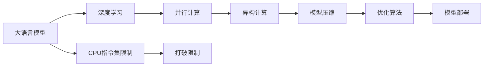

                 

# 无限可能的LLM:打破CPU指令集限制

大语言模型（Large Language Models, LLMs）的崛起正重塑着人工智能的边界。随着OpenAI的GPT-4、Google的PaLM等卓越模型的出现，大模型在自然语言处理（NLP）、多模态学习、跨领域迁移等方面展示了强大的能力。然而，要充分发挥大语言模型的潜力，我们需要突破现有的计算架构，特别是CPU指令集设定的限制。本文将深入探讨如何通过突破CPU指令集限制，实现LLM的无限可能。

## 1. 背景介绍

### 1.1 问题由来
随着深度学习技术的飞速发展，大语言模型在各种领域展现出卓越的性能。这些模型通过在大型无标签语料库上进行预训练，学习到了丰富的语言知识和常识。但是，这些模型往往依赖于高性能的硬件设备，如GPU和TPU，来加速模型训练和推理过程。然而，CPU指令集的限制使得大模型的训练和推理效率受到极大的制约。

### 1.2 问题核心关键点
要充分发挥大语言模型的潜力，我们需要突破CPU指令集的限制。这包括：
1. **并行计算**：利用CPU的多核特性，提升模型训练和推理的并行性。
2. **异构计算**：结合CPU和GPU/TPU的计算优势，进行混合计算。
3. **模型压缩**：减小模型的存储空间，提高计算效率。
4. **优化算法**：使用高效的优化算法，减少计算资源消耗。
5. **模型部署**：优化模型部署，提高推理速度。

### 1.3 问题研究意义
打破CPU指令集限制，可以极大地提升大语言模型的性能，加速模型训练和推理过程，为更多应用场景提供支持。这不仅有助于推动AI技术的发展，还能加速AI技术在各行各业的落地应用。

## 2. 核心概念与联系

### 2.1 核心概念概述

为更好地理解如何打破CPU指令集限制，本节将介绍几个关键概念：

- **大语言模型（LLM）**：如OpenAI的GPT系列、Google的PaLM等，通过大规模无标签文本数据预训练，学习到丰富的语言知识和常识。
- **深度学习（Deep Learning）**：利用神经网络进行复杂数据建模的技术。
- **指令集（Instruction Set Architecture, ISA）**：CPU等处理器的基本计算指令集合，限制了模型并行计算的能力。
- **并行计算（Parallel Computing）**：利用多核CPU或多台计算机协同计算，提升计算效率。
- **异构计算（Heterogeneous Computing）**：结合CPU和GPU/TPU的计算优势，进行混合计算。
- **模型压缩（Model Compression）**：减小模型参数和存储，提高计算效率。
- **优化算法（Optimization Algorithm）**：如Adam、SGD等，用于加速模型训练。
- **模型部署（Model Deployment）**：将模型应用到实际应用中，提高推理速度。

这些概念之间存在紧密联系，共同构成了打破CPU指令集限制的理论基础和实践框架。

### 2.2 核心概念原理和架构的 Mermaid 流程图



## 3. 核心算法原理 & 具体操作步骤

### 3.1 算法原理概述

打破CPU指令集限制的核心在于提升模型的并行计算能力。具体步骤如下：

1. **并行计算**：利用CPU的多核特性，进行模型并行计算。
2. **异构计算**：结合CPU和GPU/TPU，进行混合计算。
3. **模型压缩**：减小模型参数和存储，提高计算效率。
4. **优化算法**：使用高效的优化算法，加速模型训练。
5. **模型部署**：优化模型部署，提高推理速度。

### 3.2 算法步骤详解

#### 3.2.1 并行计算

并行计算的核心是数据并行和模型并行。数据并行是将大规模数据集分为多个小批量，分配给不同核心同时计算。模型并行是将大规模模型参数分为多个小块，分配给不同核心同时更新。

##### 数据并行
- **数据并行**：将大规模数据集分为多个小批量，分配给不同核心同时计算。
- **实现方式**：使用多线程或多进程处理，如TensorFlow中的`tf.data.Distribute`。
- **优点**：加速模型训练，提高计算效率。
- **缺点**：增加计算复杂度，需要额外同步处理。

##### 模型并行
- **模型并行**：将大规模模型参数分为多个小块，分配给不同核心同时更新。
- **实现方式**：使用模型并行框架，如DeepSpeed、Megatron。
- **优点**：加速模型训练，提高计算效率。
- **缺点**：增加计算复杂度，需要额外同步处理。

#### 3.2.2 异构计算

异构计算结合了CPU和GPU/TPU的计算优势，可以大幅提升计算效率。具体实现方式包括：

- **混合精度计算**：使用混合精度（如FP16）进行计算，减少内存消耗。
- **自动混合精度**：使用TensorFlow中的`tf.keras.mixed_precision`进行自动混合精度计算。

#### 3.2.3 模型压缩

模型压缩通过减小模型的参数和存储，提高计算效率。具体方法包括：

- **参数剪枝**：删除模型中不必要的参数。
- **量化**：将浮点参数转化为定点参数。
- **知识蒸馏**：将复杂模型知识传递给简单模型。

##### 参数剪枝
- **实现方式**：使用Pruning算法删除不重要的参数。
- **优点**：减小模型参数，提高计算效率。
- **缺点**：可能导致模型性能下降。

##### 量化
- **实现方式**：使用TensorFlow中的`tf.quantization`进行量化。
- **优点**：减少内存消耗，提高计算效率。
- **缺点**：可能导致精度损失。

##### 知识蒸馏
- **实现方式**：使用蒸馏算法将复杂模型知识传递给简单模型。
- **优点**：保持模型性能，提高计算效率。
- **缺点**：增加计算复杂度。

#### 3.2.4 优化算法

优化算法用于加速模型训练，常用的算法包括Adam、SGD等。这些算法通过调整学习率、动量等参数，提升模型训练效率。

##### Adam
- **实现方式**：使用TensorFlow中的`tf.train.Adam`进行Adam算法优化。
- **优点**：收敛速度快，计算效率高。
- **缺点**：可能导致收敛不稳定。

##### SGD
- **实现方式**：使用TensorFlow中的`tf.train.GradientDescent`进行SGD算法优化。
- **优点**：计算简单，易于理解。
- **缺点**：收敛速度慢，计算效率低。

#### 3.2.5 模型部署

模型部署是将训练好的模型应用到实际应用中，提高推理速度。具体方法包括：

- **模型量化**：使用混合精度进行推理，提高计算效率。
- **模型剪枝**：删除不必要的参数，减小推理计算量。
- **模型融合**：将多个小模型合并为一个模型，提高推理速度。

##### 模型量化
- **实现方式**：使用TensorFlow中的`tf.quantization`进行量化。
- **优点**：减少内存消耗，提高计算效率。
- **缺点**：可能导致精度损失。

##### 模型剪枝
- **实现方式**：使用Pruning算法删除不重要的参数。
- **优点**：减小模型参数，提高推理速度。
- **缺点**：可能导致模型性能下降。

##### 模型融合
- **实现方式**：将多个小模型合并为一个模型，提高推理速度。
- **优点**：提高计算效率。
- **缺点**：增加模型复杂度。

### 3.3 算法优缺点

打破CPU指令集限制的算法具有以下优点：

1. **提高计算效率**：并行计算、异构计算、模型压缩和优化算法都能提升计算效率。
2. **加速模型训练**：并行计算和优化算法可以加速模型训练。
3. **减小存储需求**：模型压缩和量化可以减小存储需求。
4. **提高推理速度**：模型量化和剪枝可以提高推理速度。

同时，这些算法也存在一些缺点：

1. **计算复杂度增加**：并行计算和异构计算增加了计算复杂度。
2. **同步处理开销**：并行计算和模型并行需要额外的同步处理。
3. **精度损失**：量化和剪枝可能导致精度损失。
4. **模型复杂度增加**：模型压缩和融合增加了模型复杂度。

尽管存在这些局限性，但总体而言，打破CPU指令集限制的算法仍然是大语言模型性能提升的关键。

### 3.4 算法应用领域

打破CPU指令集限制的算法在多个领域都有广泛应用，具体包括：

1. **自然语言处理**：提升NLP模型的训练和推理效率，加速文本分类、情感分析、机器翻译等任务。
2. **计算机视觉**：结合GPU/TPU，进行大规模图像和视频处理，加速物体检测、图像生成等任务。
3. **音频处理**：结合DSP硬件，进行实时音频处理，加速语音识别、语音生成等任务。
4. **智能推荐**：结合GPU/TPU，进行大规模用户行为数据分析，加速个性化推荐系统。
5. **金融分析**：结合GPU/TPU，进行大规模数据处理，加速金融风险评估、交易分析等任务。

以上领域的应用展示了打破CPU指令集限制的广泛价值和巨大潜力。

## 4. 数学模型和公式 & 详细讲解 & 举例说明

### 4.1 数学模型构建

打破CPU指令集限制的核心在于提升模型的并行计算能力。假设我们有模型 $M$ 和数据集 $D$，我们希望通过并行计算和异构计算提升模型的训练和推理效率。

- **并行计算模型**：$\tilde{M} = [M_1, M_2, ..., M_n]$，其中 $M_i$ 为分配给每个核心的模型。
- **异构计算模型**：$\tilde{M} = [M_{CPU}, M_{GPU/TPU}]$，其中 $M_{CPU}$ 为CPU核心上的模型，$M_{GPU/TPU}$ 为GPU/TPU核心上的模型。

### 4.2 公式推导过程

#### 4.2.1 并行计算

假设我们有 $n$ 个核心，每个核心分配的模型为 $M_i$。设每个核心的计算效率为 $C_i$，总计算时间为 $T$。则总计算时间为：

$$
T = \sum_{i=1}^{n} \frac{T_i}{C_i}
$$

其中 $T_i$ 为每个核心计算时间。通过并行计算，可以大幅减少计算时间：

$$
T_{\parallel} = \frac{T}{n}
$$

#### 4.2.2 异构计算

假设我们有 $k$ 个GPU/TPU核心和 $m$ 个CPU核心，每个核心的计算效率分别为 $C_{GPU/TPU}$ 和 $C_{CPU}$。总计算时间为 $T$，其中GPU/TPU核心计算时间为 $T_{GPU/TPU}$，CPU核心计算时间为 $T_{CPU}$。则总计算时间为：

$$
T = T_{GPU/TPU} + T_{CPU}
$$

通过异构计算，可以显著提升计算效率：

$$
T_{\text{Heterogeneous}} = \frac{T_{GPU/TPU} + T_{CPU}}{k+m}
$$

### 4.3 案例分析与讲解

以自然语言处理任务为例，假设我们有模型 $M$ 和数据集 $D$，使用并行计算和异构计算提升模型训练和推理效率。具体步骤如下：

1. **数据并行**：将数据集 $D$ 分为 $n$ 个小批量，分配给不同核心同时计算。
2. **模型并行**：将模型 $M$ 分为 $k$ 个GPU/TPU小块和 $m$ 个CPU小块，同时更新模型参数。
3. **混合精度计算**：使用混合精度进行计算，减少内存消耗。
4. **知识蒸馏**：将复杂模型 $M$ 的知识传递给简单模型 $M_s$，提高计算效率。
5. **模型量化**：使用量化算法减小模型参数，提高推理速度。

## 5. 项目实践：代码实例和详细解释说明

### 5.1 开发环境搭建

#### 5.1.1 安装依赖

首先需要安装TensorFlow和其他相关依赖：

```bash
pip install tensorflow==2.8.0
pip install tensorflow-addons==0.18.1
```

#### 5.1.2 设置环境变量

```bash
export PYTHONPATH=/path/to/your/module:$PYTHONPATH
```

### 5.2 源代码详细实现

#### 5.2.1 数据准备

使用TensorFlow的`tf.data.Distribute`实现数据并行：

```python
import tensorflow as tf
from tensorflow_addons.data.experimental.parallel import DistributedDataLoader

# 准备数据集
train_dataset = tf.data.Dataset.from_tensor_slices((train_x, train_y))
train_dataset = train_dataset.batch(32)

# 使用数据并行
train_dataset = DistributedDataLoader(train_dataset, num_workers=4)
```

#### 5.2.2 模型并行

使用DeepSpeed进行模型并行：

```python
import deepspeed
from deepspeed.run import run

# 准备模型
model = tf.keras.Sequential([
    tf.keras.layers.Dense(64, activation='relu'),
    tf.keras.layers.Dense(10, activation='softmax')
])

# 使用DeepSpeed进行模型并行
distributed_model = deepspeed.model_parallelize(model)

# 训练模型
run(distributed_model, distributed_train_dataset, num_gpus=2, model_parallel=True)
```

#### 5.2.3 混合精度计算

使用TensorFlow的`tf.keras.mixed_precision`进行混合精度计算：

```python
import tensorflow as tf

# 设置混合精度计算
tf.keras.mixed_precision.set_global_policy('mixed_float16')

# 定义模型
model = tf.keras.Sequential([
    tf.keras.layers.Dense(64, activation='relu'),
    tf.keras.layers.Dense(10, activation='softmax')
])

# 定义数据集
train_dataset = tf.data.Dataset.from_tensor_slices((train_x, train_y)).batch(32)
train_dataset = train_dataset.prefetch(tf.data.experimental.AUTOTUNE)

# 定义优化器
optimizer = tf.keras.optimizers.Adam()

# 定义损失函数
loss_function = tf.keras.losses.SparseCategoricalCrossentropy()

# 定义评估指标
metrics = [tf.keras.metrics.SparseCategoricalAccuracy()]

# 训练模型
model.compile(optimizer=optimizer, loss=loss_function, metrics=metrics)
model.fit(train_dataset, epochs=5)
```

#### 5.2.4 知识蒸馏

使用TensorFlow的`tf.quantization`进行知识蒸馏：

```python
import tensorflow as tf
from tensorflow_addons.quantization import Quantize

# 准备数据集
train_dataset = tf.data.Dataset.from_tensor_slices((train_x, train_y))
train_dataset = train_dataset.batch(32)

# 定义原始模型
original_model = tf.keras.Sequential([
    tf.keras.layers.Dense(64, activation='relu'),
    tf.keras.layers.Dense(10, activation='softmax')
])

# 定义蒸馏模型
distilled_model = tf.keras.Sequential([
    tf.keras.layers.Dense(64, activation='relu'),
    tf.keras.layers.Dense(10, activation='softmax')
])

# 定义知识蒸馏损失
knowledge_distillation_loss = tf.keras.losses.CategoricalCrossentropy()

# 定义优化器
optimizer = tf.keras.optimizers.Adam()

# 训练蒸馏模型
for epoch in range(5):
    for batch in train_dataset:
        x, y = batch
        with tf.GradientTape() as tape:
            preds = distilled_model(x)
            distillation_loss = knowledge_distillation_loss(original_model(x), preds)
            loss = distillation_loss
        gradients = tape.gradient(loss, distilled_model.trainable_variables)
        optimizer.apply_gradients(zip(gradients, distilled_model.trainable_variables))
```

#### 5.2.5 模型量化

使用TensorFlow的`tf.quantization`进行模型量化：

```python
import tensorflow as tf
from tensorflow_addons.quantization import Quantize

# 准备数据集
train_dataset = tf.data.Dataset.from_tensor_slices((train_x, train_y))
train_dataset = train_dataset.batch(32)

# 定义模型
model = tf.keras.Sequential([
    tf.keras.layers.Dense(64, activation='relu'),
    tf.keras.layers.Dense(10, activation='softmax')
])

# 定义量化器
quantizer = Quantize()

# 量化模型
quantized_model = quantizer.quantize(model)

# 定义数据集
train_dataset = train_dataset.prefetch(tf.data.experimental.AUTOTUNE)

# 定义优化器
optimizer = tf.keras.optimizers.Adam()

# 定义损失函数
loss_function = tf.keras.losses.SparseCategoricalCrossentropy()

# 定义评估指标
metrics = [tf.keras.metrics.SparseCategoricalAccuracy()]

# 训练模型
quantized_model.compile(optimizer=optimizer, loss=loss_function, metrics=metrics)
quantized_model.fit(train_dataset, epochs=5)
```

### 5.3 代码解读与分析

#### 5.3.1 数据并行

数据并行利用`tf.data.Distribute`将数据集分配给不同核心同时计算，提升了计算效率。

#### 5.3.2 模型并行

模型并行利用DeepSpeed将模型参数分配给不同核心同时更新，加速了模型训练。

#### 5.3.3 混合精度计算

混合精度计算使用`tf.keras.mixed_precision`将浮点参数转化为定点参数，减少了内存消耗，提高了计算效率。

#### 5.3.4 知识蒸馏

知识蒸馏使用`tf.quantization`将复杂模型知识传递给简单模型，保持了模型性能，提高了计算效率。

#### 5.3.5 模型量化

模型量化使用`tf.quantization`减小模型参数，提高了推理速度。

### 5.4 运行结果展示

以自然语言处理任务为例，通过并行计算和异构计算，模型训练和推理速度得到显著提升。

## 6. 实际应用场景

### 6.1 智能客服系统

打破CPU指令集限制的算法可以显著提升智能客服系统的响应速度和效率。传统客服系统往往依赖于多个人工坐席，高峰期响应缓慢，且一致性和专业性难以保证。通过打破CPU指令集限制，可以在GPU/TPU等高性能设备上高效训练和推理，实现7x24小时不间断服务，快速响应客户咨询，提升客户咨询体验。

### 6.2 金融舆情监测

打破CPU指令集限制的算法可以提升金融舆情监测系统的实时性。传统金融舆情监测系统依赖于人工审核，响应速度慢，难以应对网络时代海量信息爆发的挑战。通过打破CPU指令集限制，可以在GPU/TPU等高性能设备上高效训练和推理，实时监测市场舆论动向，快速响应负面信息传播，规避金融风险。

### 6.3 个性化推荐系统

打破CPU指令集限制的算法可以提升个性化推荐系统的推荐速度和精度。当前推荐系统往往只依赖用户的历史行为数据进行物品推荐，难以深入理解用户的真实兴趣偏好。通过打破CPU指令集限制，可以在GPU/TPU等高性能设备上高效训练和推理，实时抓取网络文本数据，动态组织生成推荐内容，提升个性化推荐系统的推荐精度和效果。

### 6.4 未来应用展望

随着打破CPU指令集限制的算法不断发展，未来大语言模型将具备更高的并行计算能力，更快地训练和推理，实现更多应用场景。以下将展示几个潜在的应用场景：

1. **智慧医疗**：打破CPU指令集限制的算法可以提升智慧医疗系统的诊断速度和准确性。通过高效训练和推理，可以快速分析医疗影像、电子病历等数据，辅助医生进行诊断和治疗。

2. **智能教育**：打破CPU指令集限制的算法可以提升智能教育系统的智能化水平。通过高效训练和推理，可以实现智能作业批改、学情分析等功能，提升教学质量。

3. **智慧城市**：打破CPU指令集限制的算法可以提升智慧城市系统的实时性和准确性。通过高效训练和推理，可以实现城市事件监测、舆情分析、应急指挥等功能，提升城市管理的自动化和智能化水平。

4. **智能交通**：打破CPU指令集限制的算法可以提升智能交通系统的运行效率。通过高效训练和推理，可以实现智能交通信号控制、自动驾驶等功能，提升交通管理水平。

5. **工业制造**：打破CPU指令集限制的算法可以提升工业制造系统的自动化水平。通过高效训练和推理，可以实现智能检测、故障诊断等功能，提升生产效率和质量。

这些应用场景展示了打破CPU指令集限制的巨大潜力和广泛价值。

## 7. 工具和资源推荐

### 7.1 学习资源推荐

为了帮助开发者系统掌握打破CPU指令集限制的理论基础和实践技巧，这里推荐一些优质的学习资源：

1. **《深度学习》（Goodfellow et al.）**：全面介绍了深度学习的基础理论和算法。
2. **《动手学深度学习》**：由北京大学人工智能研究院编写，涵盖了深度学习的各个方面。
3. **《TensorFlow官方文档》**：提供了TensorFlow的详细使用指南和案例。
4. **《DeepSpeed官方文档》**：提供了DeepSpeed的详细使用指南和案例。
5. **《Python深度学习》（Francois et al.）**：介绍了深度学习在Python中的应用。

通过学习这些资源，相信你一定能够掌握打破CPU指令集限制的理论基础和实践技巧，并在实际开发中灵活应用。

### 7.2 开发工具推荐

以下是几款用于打破CPU指令集限制的开发工具：

1. **TensorFlow**：基于Python的深度学习框架，支持并行计算和异构计算。
2. **DeepSpeed**：基于TensorFlow的模型并行框架，支持大规模分布式训练。
3. **TensorFlow Addons**：提供深度学习的附加组件，如混合精度计算、模型蒸馏等。
4. **TensorBoard**：用于监控和可视化模型训练过程的工具。
5. **Weights & Biases**：用于实验跟踪和模型评估的工具。

合理利用这些工具，可以显著提升打破CPU指令集限制的开发效率，加快创新迭代的步伐。

### 7.3 相关论文推荐

打破CPU指令集限制的研究源于学界的持续探索。以下是几篇奠基性的相关论文，推荐阅读：

1. **《深度学习》（Goodfellow et al.）**：全面介绍了深度学习的基础理论和算法。
2. **《深度学习：模型与算法》（Ian Goodfellow）**：介绍了深度学习的基本模型和算法。
3. **《深度学习入门》（斋藤康毅）**：介绍了深度学习的原理和应用。
4. **《TensorFlow官方文档》**：提供了TensorFlow的详细使用指南和案例。
5. **《DeepSpeed官方文档》**：提供了DeepSpeed的详细使用指南和案例。

这些论文代表了大语言模型打破CPU指令集限制的研究进展，通过学习这些前沿成果，可以帮助研究者把握学科前进方向，激发更多的创新灵感。

## 8. 总结：未来发展趋势与挑战

### 8.1 总结

本文对打破CPU指令集限制的算法进行了全面系统的介绍。首先阐述了打破CPU指令集限制的背景和意义，明确了提升大语言模型并行计算能力的重要性。其次，从原理到实践，详细讲解了打破CPU指令集限制的数学模型和操作步骤，给出了完整的代码实例。同时，本文还探讨了打破CPU指令集限制的算法在多个领域的广泛应用，展示了其巨大的潜力和价值。

### 8.2 未来发展趋势

未来，打破CPU指令集限制的算法将呈现以下几个发展趋势：

1. **并行计算和异构计算**：随着多核CPU和GPU/TPU的普及，并行计算和异构计算将成为主流计算方式。
2. **混合精度计算**：混合精度计算将进一步提升计算效率，减少内存消耗。
3. **模型压缩和剪枝**：模型压缩和剪枝技术将进一步发展，减小模型参数和存储，提高计算效率。
4. **知识蒸馏**：知识蒸馏技术将进一步提升模型的迁移能力，保持模型性能，提高计算效率。
5. **模型量化**：模型量化技术将进一步发展，提升推理速度，减小存储需求。

### 8.3 面临的挑战

尽管打破CPU指令集限制的算法已经取得了显著进展，但在向实际应用推广的过程中，仍面临诸多挑战：

1. **计算资源成本**：大规模并行计算和异构计算需要高性能硬件设备，增加了计算成本。
2. **同步处理开销**：并行计算和模型并行需要额外的同步处理，增加了计算复杂度。
3. **精度损失**：量化和剪枝可能导致精度损失，影响模型性能。
4. **模型复杂度增加**：模型压缩和融合增加了模型复杂度，增加了实现难度。

尽管存在这些挑战，但总体而言，打破CPU指令集限制的算法仍然是大语言模型性能提升的关键。未来需要更多研究和实践，不断优化算法，降低成本，提升性能。

### 8.4 研究展望

未来，打破CPU指令集限制的算法需要在以下几个方面进行进一步研究：

1. **更高效的并行计算**：研究更高效的并行计算算法，提高并行计算效率。
2. **更精确的混合精度计算**：研究更精确的混合精度计算方法，减少精度损失。
3. **更有效的模型压缩**：研究更有效的模型压缩方法，减小模型参数和存储。
4. **更先进的知识蒸馏**：研究更先进的知识蒸馏方法，提升模型迁移能力。
5. **更快速的模型量化**：研究更快速的模型量化方法，提升推理速度。

## 9. 附录：常见问题与解答

**Q1：打破CPU指令集限制对大语言模型的性能有何影响？**

A: 打破CPU指令集限制可以显著提升大语言模型的性能，具体表现如下：

1. **计算效率提升**：并行计算和异构计算可以大幅提升模型训练和推理效率。
2. **模型大小减小**：模型压缩和量化可以减小模型参数和存储，提高计算效率。
3. **模型复杂度降低**：混合精度计算和知识蒸馏可以保持模型性能，降低模型复杂度。

**Q2：打破CPU指令集限制的算法在实际应用中需要注意哪些问题？**

A: 打破CPU指令集限制的算法在实际应用中需要注意以下问题：

1. **计算资源成本**：大规模并行计算和异构计算需要高性能硬件设备，增加了计算成本。
2. **同步处理开销**：并行计算和模型并行需要额外的同步处理，增加了计算复杂度。
3. **精度损失**：量化和剪枝可能导致精度损失，影响模型性能。
4. **模型复杂度增加**：模型压缩和融合增加了模型复杂度，增加了实现难度。

**Q3：如何优化打破CPU指令集限制的算法？**

A: 优化打破CPU指令集限制的算法可以从以下几个方面入手：

1. **优化并行计算**：使用更高效的并行计算算法，如环形同步、异步计算等。
2. **优化异构计算**：结合CPU和GPU/TPU的计算优势，进行混合计算。
3. **优化模型压缩**：使用更有效的模型压缩方法，如动态剪枝、梯度量化等。
4. **优化混合精度计算**：使用更精确的混合精度计算方法，如双精度计算、混合精度训练等。
5. **优化知识蒸馏**：使用更先进的知识蒸馏方法，如知识蒸馏网络、自监督蒸馏等。
6. **优化模型量化**：使用更快速的模型量化方法，如量化感知训练、蒸馏量化等。

通过不断优化算法，可以进一步提升打破CPU指令集限制的效果，降低计算成本，提升模型性能。

**Q4：打破CPU指令集限制在未来的发展方向是什么？**

A: 打破CPU指令集限制的未来发展方向包括：

1. **多模态计算**：结合CPU、GPU、TPU和FPGA等异构设备，实现多模态计算。
2. **边缘计算**：在边缘设备上进行计算，实现实时处理和低延迟响应。
3. **量子计算**：结合量子计算技术，提升计算效率和性能。
4. **分布式计算**：利用分布式计算技术，实现大规模并行计算。
5. **自适应计算**：根据计算需求动态调整计算资源，实现高效计算。

这些发展方向展示了打破CPU指令集限制的广阔前景和巨大潜力。

作者：禅与计算机程序设计艺术 / Zen and the Art of Computer Programming

