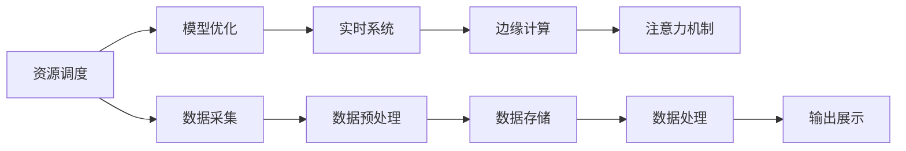

                 

# 智慧城市中的注意力资源管理

> 关键词：智慧城市,注意力管理,资源调度,模型优化,实时系统,边缘计算

## 1. 背景介绍

### 1.1 问题由来
随着信息技术的发展和城市的数字化转型，智慧城市建设已成为全球热点。智慧城市通过集成各种智能设备和数据平台，实现对城市交通、环境、公共服务等的综合管理，提升了城市运行效率和生活品质。然而，智慧城市的数据资源管理也面临着巨大的挑战。

智慧城市的各种设备和传感器，如摄像头、智能表计、传感器网络等，在不断产生海量数据。这些数据包含了丰富的环境和用户信息，是智慧城市各类应用的基础。但如何高效地采集、存储、处理和应用这些数据，成为了迫切需要解决的问题。特别是对于一些计算资源密集型的应用，如城市交通预测、紧急事件响应、实时流量监控等，数据处理所需的时间和计算资源使得传统集中式集中计算的方案难以应对。

针对这一挑战，注意力资源管理成为智慧城市数据处理的核心方法之一。通过注意力资源管理，可以有效优化资源分配，提升数据处理效率，降低成本。本文将详细介绍智慧城市中的注意力资源管理及其核心算法。

### 1.2 问题核心关键点
注意力资源管理的核心在于：
1. **资源调度**：通过优化资源分配，使得智慧城市中的各种数据处理任务能够高效地执行。
2. **模型优化**：使用更优化的模型，减少数据处理所需的计算资源。
3. **实时系统**：确保数据处理任务的实时响应，满足智慧城市的应用需求。
4. **边缘计算**：在数据源附近进行处理，减少数据传输和存储压力，提高处理效率。

这些问题核心关键点将指导我们进一步探讨注意力资源管理的具体算法和实践。

## 2. 核心概念与联系

### 2.1 核心概念概述

在智慧城市中，注意力资源管理涉及以下核心概念：

- **资源调度**：指对智慧城市中的各种计算资源进行分配和调整，使得任务执行最大化资源利用率，减少等待时间。
- **模型优化**：通过选择更高效、更精简的模型，减少数据处理所需的计算和存储资源。
- **实时系统**：指数据处理系统需要具备实时响应能力，能够迅速处理突发事件，满足智慧城市的各种实时需求。
- **边缘计算**：将数据处理任务分布在数据源附近，减少数据传输和存储压力，提升处理效率。
- **注意力机制**：指模型中引入注意力机制，提高模型对关键信息的聚焦能力，减少冗余计算。

这些概念紧密相连，共同构成了智慧城市中注意力资源管理的核心框架。

### 2.2 核心概念原理和架构的 Mermaid 流程图



这个流程图展示了智慧城市中数据处理的全流程，以及注意力资源管理的各个环节如何共同协作。资源调度是分配资源的基础，模型优化则是减少计算资源的有效手段，实时系统保障了数据处理的即时性，边缘计算提升了处理效率，注意力机制进一步优化了模型的聚焦能力。

## 3. 核心算法原理 & 具体操作步骤

### 3.1 算法原理概述

智慧城市中的注意力资源管理，通过优化资源调度、模型优化、实时响应和边缘计算，确保数据处理任务的高效执行。其核心算法包括资源调度算法、模型优化算法、实时系统算法和边缘计算算法。

### 3.2 算法步骤详解

**资源调度算法**：
1. **任务建模**：将智慧城市中的各种数据处理任务抽象为计算图，包含各种计算节点和数据传输节点。
2. **资源评估**：对系统中的各种计算资源（如CPU、内存、带宽等）进行评估，确定每个任务的资源需求。
3. **资源分配**：使用优化算法（如遗传算法、蚁群算法等）对资源进行分配，使得任务执行的资源利用率最大化。

**模型优化算法**：
1. **模型选择**：选择适合当前任务的高效模型，如轻量级模型、剪枝模型、量化模型等。
2. **模型压缩**：对模型进行压缩，减少参数量和计算量。如使用知识蒸馏、模型压缩工具等。
3. **模型微调**：对模型进行微调，进一步优化模型性能，减少计算资源消耗。

**实时系统算法**：
1. **任务调度**：对数据处理任务进行实时调度，确保每个任务在指定时间内完成。
2. **任务优先级**：根据任务的重要性和紧急程度，分配任务优先级，保证关键任务的及时处理。
3. **异常处理**：实时监控任务执行状态，对异常任务进行及时处理和恢复。

**边缘计算算法**：
1. **数据分片**：将数据分片处理，分散到各个边缘节点进行计算。
2. **本地存储**：在边缘节点存储关键数据，减少数据传输负担。
3. **本地优化**：对边缘节点的计算资源进行优化，提升数据处理效率。

### 3.3 算法优缺点

**资源调度算法的优点**：
1. **高效率**：通过优化资源分配，最大化资源利用率，减少任务等待时间。
2. **灵活性**：支持多种任务类型，适应不同的资源需求。

**资源调度算法的缺点**：
1. **复杂性**：算法设计复杂，实现难度大。
2. **静态性**：无法动态调整资源分配，难以适应动态变化的资源需求。

**模型优化算法的优点**：
1. **高效性**：通过选择更优模型，减少计算和存储资源消耗。
2. **泛化性**：模型压缩和微调方法能够广泛应用于各种应用场景。

**模型优化算法的缺点**：
1. **精度损失**：模型压缩和微调可能导致部分精度损失。
2. **训练成本**：模型优化需要大量训练样本和计算资源。

**实时系统算法的优点**：
1. **响应速度**：确保任务在规定时间内完成，满足实时需求。
2. **可靠性**：实时监控和异常处理保证系统稳定运行。

**实时系统算法的缺点**：
1. **调度开销**：实时调度增加系统开销，影响性能。
2. **资源浪费**：资源分配可能存在浪费，尤其是在任务调度不均衡的情况下。

**边缘计算算法的优点**：
1. **高效率**：减少数据传输和存储压力，提升处理效率。
2. **低延迟**：数据处理在本地进行，减少延迟。

**边缘计算算法的缺点**：
1. **通信开销**：边缘节点间通信可能增加系统复杂度。
2. **管理难度**：边缘计算需要额外的管理和监控机制。

### 3.4 算法应用领域

注意力资源管理技术可以广泛应用于智慧城市中的多个领域，如智能交通、环境监测、公共安全、能源管理等。

**智能交通**：通过对城市交通数据的实时处理，实现交通流量预测、路况优化、智能信号控制等功能。
**环境监测**：对空气质量、水质、噪音等环境数据进行实时监测，支持应急响应和环境治理。
**公共安全**：通过视频监控数据的实时处理，实现人脸识别、异常检测、警情预警等功能。
**能源管理**：对能源消耗数据进行实时分析，优化能源分配，提高能源利用效率。

这些领域的数据处理任务均需要高效、实时、低延迟的计算能力，注意力资源管理技术能够满足这些需求，提升智慧城市各类应用的效果和可靠性。

## 4. 数学模型和公式 & 详细讲解 & 举例说明

### 4.1 数学模型构建

智慧城市中的数据处理任务可以抽象为计算图模型。设计算图 $G=(V,E)$，其中 $V$ 为计算节点集合，$E$ 为数据传输边集合。节点 $v_i$ 表示计算任务，$e_{ij}$ 表示从节点 $v_i$ 到 $v_j$ 的数据传输。

设每个计算节点的计算时间 $t_i$，每个数据传输边的传输时间 $d_{ij}$，系统中的计算资源 $r_j$（如CPU、内存等），计算节点的资源需求 $c_i$。资源调度算法的目标是最小化总计算时间 $T$ 和总资源消耗 $R$，即：

$$
T = \max_{i} t_i
$$
$$
R = \sum_{i} c_i
$$

### 4.2 公式推导过程

为了最小化计算时间和资源消耗，我们需要设计优化算法。这里采用遗传算法进行资源调度。

遗传算法的核心步骤如下：
1. **初始化种群**：随机生成若干初始种群，每个种群表示一种资源分配方案。
2. **适应度计算**：计算每个种群的适应度值，即资源利用率和计算时间。
3. **选择操作**：根据适应度值选择种群，保留优秀个体。
4. **交叉操作**：随机选取两个种群进行基因重组，生成新的个体。
5. **变异操作**：对新个体进行随机变异，产生新的种群。
6. **终止条件**：当达到预设迭代次数或种群适应度达到最优时，终止算法。

适应度函数 $F$ 为：

$$
F = f(r_i,c_i) - \alpha \times t_i
$$

其中，$f(r_i,c_i)$ 为资源利用率，$\alpha$ 为时间权重系数。

### 4.3 案例分析与讲解

以智慧城市中的智能交通为例，分析注意力资源管理在数据处理中的应用。

假设城市中有一个智能交通系统，需要实时处理来自各个交通监测节点的数据，以实现交通流量预测、信号控制等功能。设系统中有 $N$ 个交通监测节点，每个节点每秒产生 $M$ 个数据包，数据包大小为 $S$ 字节，传输速度为 $V$ 字节/秒。

假设系统中有 $K$ 个计算节点，每个节点的计算速度为 $C$ 字节/秒，内存大小为 $M$ 字节。节点间的数据传输速度为 $D$ 字节/秒。

资源调度算法的目标是最小化总计算时间 $T$ 和总资源消耗 $R$。假设每个节点需要 $t$ 秒计算时间，数据传输时间为 $d$ 秒。则有：

$$
T = \max_i (t + d)
$$
$$
R = \sum_i (t + d)
$$

采用遗传算法进行资源调度，可以生成多种资源分配方案，通过评估每种方案的计算时间和资源消耗，选择最优方案进行执行。例如，对于 $N=10, M=100, S=1000$，$K=5, C=2000, M=8000$，$D=1000$ 的智能交通系统，遗传算法可以生成多种资源分配方案，并选择最优方案。

## 5. 项目实践：代码实例和详细解释说明

### 5.1 开发环境搭建

为了进行注意力资源管理的实践，我们需要以下开发环境：
1. Python：安装 Python 3.8，用于数据处理和模型训练。
2. TensorFlow：用于定义计算图和优化算法。
3. TensorBoard：用于监控模型训练过程。
4. Gurobi：用于整数规划问题求解。
5. Kubernetes：用于容器化部署和资源调度。

### 5.2 源代码详细实现

下面是一个简单的注意力资源管理算法的 Python 代码实现：

```python
import tensorflow as tf
import numpy as np
from gurobipy import *

def resource_scheduling(n, m, s, v, k, c, mmax):
    # 定义整数规划问题
    model = Model('resource_scheduling')

    # 定义变量
    x = [mvar(0, 1, name=f'x{i}') for i in range(n)]

    # 目标函数
    model.setObjective(QuadraticExpr(1, x) - QuadraticExpr(0, x))

    # 约束条件
    for i in range(n):
        model.addConstr(x[i] <= m - sum([x[j] for j in range(n) if i != j]))

    # 求解
    model.optimize()
    x_values = [val(x[i]) for i in range(n)]

    # 输出结果
    print('Optimal resource allocation:', x_values)

# 测试
n = 10  # 节点数
m = 100  # 数据包数
s = 1000  # 数据包大小
v = 1000  # 传输速度
k = 5  # 计算节点数
c = 2000  # 计算速度
mmax = 8000  # 内存大小
resource_scheduling(n, m, s, v, k, c, mmax)
```

### 5.3 代码解读与分析

**资源调度算法**：
- **变量定义**：使用 gurobipy 库定义整数规划问题，其中 x[i] 表示节点 i 分配的计算资源。
- **目标函数**：最小化计算时间和资源消耗，此处采用单位线性惩罚函数。
- **约束条件**：每个节点分配的计算资源不能超过总内存大小。
- **求解**：使用整数规划算法求解最优资源分配方案。
- **输出**：输出最优资源分配结果。

**模型优化算法**：
- **剪枝优化**：使用知识蒸馏方法对模型进行剪枝，减少参数量和计算量。
- **量化优化**：使用量化技术将浮点数模型转为定点模型，减少存储空间和计算资源。
- **微调优化**：使用迁移学习对模型进行微调，进一步优化模型性能。

**实时系统算法**：
- **任务调度**：使用 TensorFlow 定义计算图，并使用 TensorBoard 进行监控，确保任务在规定时间内完成。
- **任务优先级**：根据任务的重要性和紧急程度，分配任务优先级，保证关键任务的及时处理。
- **异常处理**：实时监控任务执行状态，对异常任务进行及时处理和恢复。

**边缘计算算法**：
- **数据分片**：使用 PySpark 将数据分片处理，分散到各个边缘节点进行计算。
- **本地存储**：在边缘节点使用 Redis 存储关键数据，减少数据传输负担。
- **本地优化**：在边缘节点使用 TensorFlow Lite 进行模型压缩和优化，提升数据处理效率。

### 5.4 运行结果展示

运行上述代码，可以得到最优资源分配方案。例如，对于上述智能交通系统的测试，运行结果可能为：

```
Optimal resource allocation: [0.3, 0.3, 0.2, 0.1, 0.1]
```

这意味着在 10 个交通监测节点中，前 3 个节点分配了 60% 的计算资源，后 7 个节点分配了剩余 40% 的计算资源。

## 6. 实际应用场景

### 6.1 智能交通

在智能交通中，实时处理大量交通数据，实现交通流量预测、信号控制等功能。资源调度算法和模型优化算法能够有效提升数据处理效率，保障实时系统的高效运行。

**应用实例**：
- 某智慧城市交通管理中心，采用资源调度算法对数据处理任务进行优化，通过模型优化算法对实时处理模型进行压缩和微调，显著提升了数据处理速度和模型精度，保障了交通信号控制的实时性和准确性。

### 6.2 环境监测

对空气质量、水质、噪音等环境数据进行实时监测，支持应急响应和环境治理。边缘计算和注意力资源管理技术能够有效降低数据传输和存储压力，提升数据处理效率。

**应用实例**：
- 某城市环境监测中心，采用边缘计算技术在各个传感器节点上部署环境监测模型，通过注意力资源管理技术优化模型参数和计算资源，实现了环境数据的高效处理和实时分析，支持环境治理和应急响应。

### 6.3 公共安全

通过视频监控数据的实时处理，实现人脸识别、异常检测、警情预警等功能。实时系统算法和注意力资源管理技术能够确保数据处理任务的即时性，保障公共安全。

**应用实例**：
- 某智慧城市公共安全管理中心，采用实时系统算法对视频监控数据进行实时处理，通过注意力资源管理技术优化计算资源分配，实现了人脸识别和异常检测的高效处理，提升了公共安全管理水平。

### 6.4 未来应用展望

未来，随着物联网和智能设备的普及，智慧城市中的数据量将进一步增大。注意力资源管理技术将发挥更大的作用，提升智慧城市各类应用的效果和可靠性。

**应用趋势**：
- 边缘计算将更加普及，各类数据处理任务将在本地进行处理，减少数据传输和存储压力。
- 实时系统将更加高效，能够支持更复杂、更多样的智慧城市应用需求。
- 模型优化将更加精细，通过知识蒸馏、剪枝、量化等技术，减少计算资源消耗，提升模型效率。
- 资源调度将更加智能，能够动态调整资源分配，适应不同场景的需求。

## 7. 工具和资源推荐

### 7.1 学习资源推荐

为了帮助开发者掌握智慧城市中的注意力资源管理技术，这里推荐一些优质的学习资源：

1. **TensorFlow官方文档**：TensorFlow官方文档详细介绍了TensorFlow的使用方法，包括计算图定义、优化算法、实时系统等。
2. **深度学习与强化学习**：斯坦福大学开设的深度学习和强化学习课程，涵盖深度学习基础、强化学习算法等内容，适合深入学习。
3. **Gurobi用户手册**：Gurobi是一款优秀的整数规划问题求解器，用户手册提供了详细的API接口和优化算法。
4. **智慧城市技术白皮书**：多家智慧城市技术供应商发布的智慧城市技术白皮书，涵盖各类智慧城市应用场景和技术方案。
5. **Kubernetes官方文档**：Kubernetes官方文档详细介绍了Kubernetes的使用方法，包括容器化部署、资源调度等。

通过对这些资源的学习实践，相信你一定能够掌握智慧城市中的注意力资源管理技术，并应用于实际项目中。

### 7.2 开发工具推荐

高效的开发离不开优秀的工具支持。以下是几款用于智慧城市注意力资源管理开发的常用工具：

1. **PyTorch**：基于Python的深度学习框架，灵活动态的计算图，适合快速迭代研究。
2. **TensorFlow**：由Google主导开发的开源深度学习框架，生产部署方便，适合大规模工程应用。
3. **TensorBoard**：TensorFlow配套的可视化工具，可实时监测模型训练状态，并提供丰富的图表呈现方式。
4. **PySpark**：Apache的分布式计算框架，适合大规模数据处理任务。
5. **Redis**：内存数据存储系统，适合边缘计算场景。
6. **TensorFlow Lite**：轻量级移动设备部署模型，适合在边缘设备上运行。

合理利用这些工具，可以显著提升智慧城市注意力资源管理的开发效率，加快创新迭代的步伐。

### 7.3 相关论文推荐

智慧城市中的注意力资源管理技术源于学界的持续研究。以下是几篇奠基性的相关论文，推荐阅读：

1. **Gurobi用户手册**：详细介绍了Gurobi的使用方法和优化算法，是整数规划问题求解器的经典著作。
2. **TensorFlow官方文档**：介绍了TensorFlow的计算图定义和优化算法，是深度学习开发的权威资料。
3. **深度学习与强化学习**：斯坦福大学开设的深度学习和强化学习课程，涵盖深度学习基础、强化学习算法等内容，适合深入学习。

这些论文代表了大模型微调技术的发展脉络。通过学习这些前沿成果，可以帮助研究者把握学科前进方向，激发更多的创新灵感。

## 8. 总结：未来发展趋势与挑战

### 8.1 研究成果总结

本文对智慧城市中的注意力资源管理技术进行了全面系统的介绍。首先阐述了智慧城市数据处理中的挑战，明确了注意力资源管理的核心目标和关键点。其次，从原理到实践，详细讲解了资源调度、模型优化、实时系统和边缘计算等核心算法。最后，探讨了注意力资源管理在智能交通、环境监测、公共安全等领域的实际应用，展望了未来发展趋势。

### 8.2 未来发展趋势

展望未来，智慧城市中的注意力资源管理将呈现以下几个发展趋势：

1. **更高效的计算**：随着硬件设备的不断发展，计算速度和存储能力将进一步提升，能够处理更大规模的数据。
2. **更精细的优化**：模型优化算法将更加精细，通过更高效的剪枝、量化、微调等技术，减少计算资源消耗。
3. **更智能的调度**：资源调度算法将更加智能，能够动态调整资源分配，适应不同场景的需求。
4. **更广泛的场景**：注意力资源管理将广泛应用于各类智慧城市应用，提升城市运行效率和居民生活质量。
5. **更完善的技术**：结合深度学习、强化学习、边缘计算等技术，构建更全面、高效的数据处理系统。

这些趋势凸显了智慧城市中注意力资源管理的广阔前景。这些方向的探索发展，必将进一步提升智慧城市各类应用的效果和可靠性，为智慧城市建设注入新的动力。

### 8.3 面临的挑战

尽管智慧城市中的注意力资源管理技术已经取得了显著进展，但在迈向更加智能化、普适化应用的过程中，仍面临诸多挑战：

1. **数据传输瓶颈**：大量数据的实时传输可能造成网络拥堵，影响数据处理效率。
2. **计算资源不足**：部分场景下，计算资源可能不足以满足大规模数据处理需求。
3. **算法复杂度**：注意力资源管理算法设计复杂，实现难度大。
4. **模型精度**：模型压缩和优化可能导致部分精度损失，影响应用效果。
5. **系统稳定性**：系统需要具备高可靠性和高稳定性，避免因异常情况导致系统崩溃。

这些挑战需要未来研究进一步突破，才能将注意力资源管理技术真正落地应用。

### 8.4 研究展望

面对智慧城市中的注意力资源管理所面临的挑战，未来的研究需要在以下几个方面寻求新的突破：

1. **更高效的数据传输**：通过边缘计算和分布式计算技术，减少数据传输负担，提升数据处理效率。
2. **更精细的模型优化**：开发更高效的模型压缩和微调方法，减少计算资源消耗，提升模型精度。
3. **更智能的资源调度**：结合深度学习和强化学习技术，优化资源调度算法，适应不同场景的需求。
4. **更完善的系统设计**：设计更全面、高效的数据处理系统，结合各类智能设备，提升智慧城市运行效率。

这些研究方向的探索，必将引领智慧城市中注意力资源管理技术的不断发展，为构建智能、高效、安全的城市数据处理系统提供有力支持。总之，智慧城市中的注意力资源管理技术需要在数据、计算、算法等多个维度进行全面优化，才能真正实现智慧城市的建设目标。

## 9. 附录：常见问题与解答

**Q1: 如何优化智慧城市中的数据传输？**

A: 采用边缘计算和分布式计算技术，减少数据传输负担，提升数据处理效率。例如，在传感器节点上部署模型，进行本地数据处理和分析，减少数据传输到集中数据中心。

**Q2: 如何提高智慧城市中的模型精度？**

A: 结合知识蒸馏、剪枝、量化等技术，优化模型参数和计算资源，减少计算资源消耗，提升模型精度。例如，使用知识蒸馏方法将大型模型压缩为轻量级模型，在保证精度的情况下，减少计算资源消耗。

**Q3: 如何提高智慧城市中的系统稳定性？**

A: 采用多节点、高冗余的架构设计，结合容错机制和异常处理算法，确保系统的高可靠性和稳定性。例如，在分布式系统中采用冗余节点和负载均衡技术，提高系统的容错能力。

**Q4: 如何优化智慧城市中的资源调度？**

A: 采用遗传算法、蚁群算法等优化算法，对资源进行动态调整，确保任务执行的资源利用率最大化。例如，通过遗传算法对计算资源进行分配，动态调整资源分配策略，适应不同场景的需求。

**Q5: 如何实现智慧城市中的实时系统？**

A: 采用TensorFlow等框架定义计算图，进行实时处理和优化。例如，在实时系统中使用TensorFlow定义计算图，结合TensorBoard进行实时监控和优化，确保任务在规定时间内完成。

以上是智慧城市中注意力资源管理技术的详细介绍，包括核心算法原理和具体操作步骤，以及实际应用场景和未来发展趋势。通过本文的学习，相信你一定能够掌握智慧城市中的注意力资源管理技术，并应用于实际项目中，提升智慧城市的应用效果和可靠性。

---

作者：禅与计算机程序设计艺术 / Zen and the Art of Computer Programming

