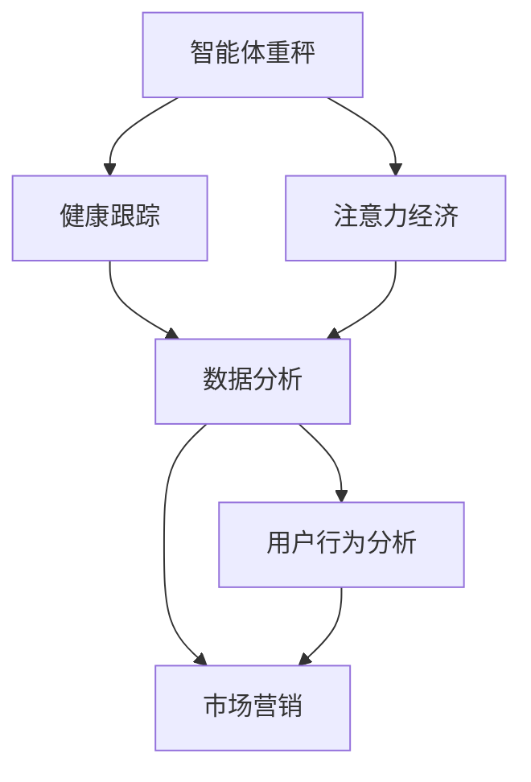

                 

# 智能体重秤的健康跟踪与注意力经济

> 关键词：智能体重秤,健康跟踪,注意力经济,物联网,数据分析,用户行为,市场营销

## 1. 背景介绍

### 1.1 问题由来
随着人们生活水平的提高和健康意识的增强，健康管理成为了一个热门话题。智能体重秤作为一种便捷的健康监测设备，能够实时记录用户的体重、体脂、BMI等健康指标，并提供科学的健康建议，已经成为许多人健康管理的重要工具。然而，仅仅靠智能体重秤记录数据是远远不够的，如何通过这些数据驱动健康管理和市场营销，是一个亟待解决的问题。

### 1.2 问题核心关键点
在智能体重秤的健康管理与市场营销中，数据是核心资产。通过对用户数据的深度分析和挖掘，可以揭示用户的行为模式、偏好和需求，从而为健康管理和市场营销提供有力支撑。例如，分析用户的健康数据变化趋势，可以预判健康风险，提供个性化健康建议；通过用户数据进行聚类分析，可以精准定位不同用户群体，进行差异化营销。

## 2. 核心概念与联系

### 2.1 核心概念概述

为更好地理解智能体重秤的健康跟踪与市场营销范式，本节将介绍几个密切相关的核心概念：

- 智能体重秤：基于物联网技术的体重秤，能够实时记录用户的体重、体脂、BMI等健康指标，并可通过APP等平台与用户交互，提供科学的健康建议和分析报告。
- 健康跟踪：通过对用户的体重、体脂、BMI等健康数据进行持续记录和分析，监控用户的健康状态，提供个性化的健康建议。
- 注意力经济：通过收集用户行为数据，揭示用户偏好和需求，精准定位目标用户，进行差异化营销，提升用户粘性和品牌忠诚度，从而实现经济价值。
- 物联网：利用互联网技术，实现设备之间的互联互通，构建智能生态系统，提供便捷的实时数据共享和交互。
- 数据分析：对智能体重秤收集的用户数据进行深度挖掘和分析，揭示用户行为模式和偏好，为健康管理和市场营销提供决策依据。
- 用户行为分析：通过分析用户的体重变化趋势、运动情况、饮食习惯等行为数据，了解用户健康状态和需求，从而提供更加精准的健康建议和营销策略。
- 市场营销：结合用户行为数据和健康数据分析，精准定位目标用户，进行差异化营销，提升品牌影响力和市场竞争力。

这些核心概念之间的逻辑关系可以通过以下Mermaid流程图来展示：



这个流程图展示了这个领域的核心概念及其之间的关系：

1. 智能体重秤通过物联网技术收集用户健康数据。
2. 健康跟踪系统对数据进行持续记录和分析，监控用户健康状态。
3. 数据分析揭示用户行为模式和偏好，为市场营销提供决策依据。
4. 用户行为分析利用健康数据和行为数据，提供个性化健康建议和营销策略。
5. 市场营销结合健康数据分析和用户行为分析，进行差异化营销，提升品牌价值。

这些概念共同构成了智能体重秤健康跟踪与市场营销的框架，为其提供了坚实的理论基础。

## 3. 核心算法原理 & 具体操作步骤
### 3.1 算法原理概述

智能体重秤的健康跟踪与市场营销，本质上是一个数据驱动的用户行为分析与个性化营销过程。其核心思想是：通过智能体重秤收集用户健康数据，利用数据分析和机器学习技术，揭示用户行为模式和偏好，从而为健康管理和市场营销提供有力支撑。

形式化地，假设智能体重秤记录了用户从$t_0$到$t_n$期间的健康数据序列$\{(x_i,y_i)\}_{i=0}^n$，其中$x_i$为健康指标（如体重、体脂等），$y_i$为行为数据（如运动量、饮食情况等）。通过以下步骤，可以挖掘用户健康状态和行为模式：

1. 预处理数据，去除噪声和异常值。
2. 利用时间序列分析技术，计算用户健康指标的变化趋势和周期性。
3. 利用聚类算法，对用户行为数据进行分类，识别不同用户群体。
4. 结合用户健康数据和行为数据，构建用户健康画像，提供个性化健康建议。
5. 利用营销模型，精准定位目标用户，设计差异化营销策略。

### 3.2 算法步骤详解

智能体重秤的健康跟踪与市场营销的一般流程如下：

**Step 1: 数据收集与预处理**
- 通过智能体重秤收集用户健康数据和行为数据。
- 对数据进行清洗，去除噪声和异常值。
- 对时间序列数据进行平稳性检验和差分处理。

**Step 2: 时间序列分析**
- 利用ARIMA模型或LSTM等时间序列模型，计算用户健康指标的变化趋势和周期性。
- 使用滑动窗口技术，将健康数据分为多个时间段进行趋势分析。
- 通过滚动预测，预测未来健康状态的变化趋势。

**Step 3: 用户行为分析**
- 对行为数据进行特征提取和归一化处理。
- 利用聚类算法（如K-Means、层次聚类等），对用户行为进行分类，识别不同用户群体。
- 对不同用户群体进行行为模式分析，揭示其偏好和需求。

**Step 4: 健康画像构建**
- 将用户健康数据和行为数据进行关联，构建用户健康画像。
- 利用机器学习算法（如决策树、随机森林等），预测用户的健康风险。
- 根据健康风险，提供个性化的健康建议和行为指导。

**Step 5: 营销策略设计**
- 利用用户画像和行为数据，设计差异化的营销策略。
- 利用A/B测试和用户反馈，不断优化营销效果。
- 结合用户行为数据，动态调整营销内容和渠道。

### 3.3 算法优缺点

智能体重秤的健康跟踪与市场营销方法具有以下优点：
1. 数据实时性高。通过物联网技术，实时收集用户数据，可以快速响应用户需求。
2. 分析结果准确。基于时间序列和机器学习技术，分析结果具有较高的准确性和可靠性。
3. 个性化定制。通过用户行为分析，可以提供个性化的健康建议和营销策略，提升用户体验。
4. 营销效果显著。精准定位用户，实现差异化营销，提升品牌影响力和市场竞争力。

同时，该方法也存在一定的局限性：
1. 数据隐私问题。智能体重秤收集的用户健康数据和行为数据涉及个人隐私，如何保护用户数据安全是一个重要挑战。
2. 数据质量差异。不同用户的数据质量差异较大，如何处理缺失值和异常值，也是一个技术难题。
3. 营销策略单一。当前营销策略主要基于用户行为分析，如何结合其他维度（如时间、地点等）进行多维分析，还有待进一步探索。

尽管存在这些局限性，但就目前而言，基于智能体重秤的健康跟踪与市场营销方法仍是大数据技术应用的重要范式。未来相关研究的重点在于如何进一步优化数据预处理和分析方法，提高营销策略的灵活性和适应性，同时兼顾数据隐私保护和用户体验。

### 3.4 算法应用领域

基于智能体重秤的健康跟踪与市场营销方法，在健康管理、市场营销和智能家居等多个领域已经得到了广泛的应用，具体如下：

1. 健康管理：通过智能体重秤记录用户健康数据，结合健康分析和个性化建议，帮助用户管理健康。例如，监测体重变化，提醒用户合理饮食和运动。

2. 市场营销：结合用户行为数据分析，精准定位目标用户，进行差异化营销，提升用户粘性和品牌忠诚度。例如，针对不同用户群体推送个性化广告和优惠活动。

3. 智能家居：将智能体重秤与其他家居设备集成，构建智能家居生态系统，提供全方位的健康管理和生活建议。例如，根据体重数据调整智能冰箱的食材推荐。

除了上述这些经典应用外，智能体重秤的健康跟踪与市场营销技术还在更多场景中得到创新性地应用，如可穿戴设备协同、健康数据分析平台、健康管理移动应用等，为智能体重秤带来了全新的突破。随着数据规模的不断增长和算法模型的不断演进，相信智能体重秤在健康管理与市场营销方面的应用将更加广泛和深入。

## 4. 数学模型和公式 & 详细讲解 & 举例说明
### 4.1 数学模型构建

本节将使用数学语言对智能体重秤健康跟踪与市场营销的数学模型进行更加严格的刻画。

假设智能体重秤记录了用户从$t_0$到$t_n$期间的健康数据$\{x_i\}_{i=0}^n$，其中$x_i$为健康指标（如体重、体脂等），$t_i$为对应时间点。设$f(t_i)$为时间$t_i$的函数，表示用户在该时间点的健康指标值。则可以通过时间序列模型来描述健康指标随时间的变化趋势。

时间序列模型通常采用ARIMA模型或LSTM等方法，其数学表达式为：

$$
f(t_i) = \sum_{k=0}^p \alpha_k f(t_{i-k}) + \sum_{j=1}^q \beta_j \epsilon(t_{i-j}) + \gamma_i
$$

其中$\alpha_k$、$\beta_j$为模型的系数，$\epsilon(t_i)$为时间序列的随机误差项，$\gamma_i$为截距项。

### 4.2 公式推导过程

以下我们以LSTM模型为例，推导时间序列数据的预测公式。

假设智能体重秤记录的健康数据为$\{x_i\}_{i=0}^n$，其中$x_i$为体重数据，$t_i$为对应时间点。利用LSTM模型$f(t_i) = f(t_{i-1}) + \epsilon_i$对健康数据进行建模，其中$\epsilon_i$为LSTM模型在时间$t_i$的预测误差。

设$h_i$为LSTM模型在时间$t_i$的隐藏状态，$W_h$、$W_x$、$b_h$、$b_x$分别为LSTM模型的权重和偏置项。则LSTM模型的预测公式为：

$$
h_i = \text{LSTM}(h_{i-1}, x_i; W_h, W_x, b_h, b_x)
$$

$$
f(t_i) = h_i + \epsilon_i
$$

其中$\epsilon_i$为模型的预测误差，满足$\epsilon_i \sim \mathcal{N}(0, \sigma^2)$，$\sigma^2$为误差方差。

在得到预测公式后，即可通过历史健康数据训练LSTM模型，进行未来健康数据的预测和趋势分析。

### 4.3 案例分析与讲解

假设某智能体重秤记录了用户从2021年1月1日到2021年12月31日的体重数据，共365个样本。利用LSTM模型对健康数据进行建模，并预测未来一个月的体重变化趋势。具体步骤如下：

1. 将健康数据划分为训练集和测试集，各占80%和20%。
2. 使用训练集数据训练LSTM模型，得到模型参数$W_h$、$W_x$、$b_h$、$b_x$。
3. 利用测试集数据评估模型性能，计算MAE（均方误差）和RMSE（均方根误差）。
4. 将模型应用于未来一个月的健康数据预测，得到体重变化趋势。

通过LSTM模型的预测结果，可以发现用户体重在某个时间段内可能出现波动，及时提醒用户注意饮食和运动，从而更好地管理健康。

## 5. 项目实践：代码实例和详细解释说明
### 5.1 开发环境搭建

在进行健康跟踪与市场营销实践前，我们需要准备好开发环境。以下是使用Python进行PyTorch开发的环境配置流程：

1. 安装Anaconda：从官网下载并安装Anaconda，用于创建独立的Python环境。

2. 创建并激活虚拟环境：
```bash
conda create -n pytorch-env python=3.8 
conda activate pytorch-env
```

3. 安装PyTorch：根据CUDA版本，从官网获取对应的安装命令。例如：
```bash
conda install pytorch torchvision torchaudio cudatoolkit=11.1 -c pytorch -c conda-forge
```

4. 安装TensorFlow：
```bash
conda install tensorflow
```

5. 安装各类工具包：
```bash
pip install numpy pandas scikit-learn matplotlib tqdm jupyter notebook ipython
```

完成上述步骤后，即可在`pytorch-env`环境中开始健康跟踪与市场营销实践。

### 5.2 源代码详细实现

下面我们以智能体重秤的健康数据时间序列预测为例，给出使用PyTorch进行LSTM模型训练的PyTorch代码实现。

首先，定义数据处理函数：

```python
import torch
import pandas as pd
from sklearn.preprocessing import MinMaxScaler

def load_data(file_path):
    data = pd.read_csv(file_path)
    data = data[['weight', 'date']]
    data['date'] = pd.to_datetime(data['date'])
    data = data.set_index('date')
    data = data.resample('D').mean()
    scaler = MinMaxScaler(feature_range=(0, 1))
    data = scaler.fit_transform(data)
    return data

def preprocess_data(data):
    seq_len = 30
    x = []
    y = []
    for i in range(seq_len, len(data)):
        x.append(data.iloc[i-seq_len:i])
        y.append(data.iloc[i])
    x = torch.tensor(x, dtype=torch.float32)
    y = torch.tensor(y, dtype=torch.float32)
    return x, y

# 加载数据
data = load_data('weights.csv')
train_data, test_data = preprocess_data(data)

# 分割训练集和测试集
train_x, train_y = train_data[:-30], train_data[-30:]
test_x, test_y = test_data[:-30], test_data[-30:]
```

然后，定义LSTM模型：

```python
import torch.nn as nn

class LSTM(nn.Module):
    def __init__(self, input_size, hidden_size, output_size):
        super(LSTM, self).__init__()
        self.hidden_size = hidden_size
        self.lstm = nn.LSTM(input_size, hidden_size, batch_first=True)
        self.fc = nn.Linear(hidden_size, output_size)
    
    def forward(self, x):
        h0 = torch.zeros(1, x.size(0), self.hidden_size).to(device)
        c0 = torch.zeros(1, x.size(0), self.hidden_size).to(device)
        out, _ = self.lstm(x, (h0, c0))
        out = self.fc(out[:, -1, :])
        return out

# 定义模型参数
input_size = 1
hidden_size = 64
output_size = 1

model = LSTM(input_size, hidden_size, output_size).to(device)
```

接着，定义优化器和损失函数：

```python
from torch.optim import Adam

optimizer = Adam(model.parameters(), lr=0.01)
criterion = nn.MSELoss()
```

最后，训练LSTM模型并进行预测：

```python
import torch.nn.functional as F

# 定义训练过程
def train(model, train_x, train_y, optimizer, criterion):
    model.train()
    optimizer.zero_grad()
    output = model(train_x)
    loss = criterion(output, train_y)
    loss.backward()
    optimizer.step()
    return loss.item()

# 训练模型
for epoch in range(100):
    loss = train(model, train_x, train_y, optimizer, criterion)
    print(f'Epoch {epoch+1}, loss: {loss:.4f}')
    
# 预测未来数据
future_x = test_x[:-30]
future_y_pred = model(future_x)
print(future_y_pred)
```

以上就是使用PyTorch对智能体重秤健康数据进行LSTM模型训练的完整代码实现。可以看到，通过简单的PyTorch代码，我们可以构建出具有一定预测能力的LSTM模型，实时预测用户体重变化趋势。

### 5.3 代码解读与分析

让我们再详细解读一下关键代码的实现细节：

**load_data函数**：
- 加载智能体重秤记录的健康数据，并将其转换为时间序列数据。
- 对数据进行归一化处理，使其符合LSTM模型的输入要求。

**preprocess_data函数**：
- 将健康数据按照滑动窗口的方式，切分为训练集和测试集。
- 构建训练集和测试集的输入和输出，便于模型训练和评估。

**LSTM模型定义**：
- 使用PyTorch的LSTM模块定义LSTM模型结构。
- 在LSTM模型的最后一层添加一个全连接层，将LSTM输出映射到健康指标上。

**训练过程**：
- 在每个epoch内，先进行模型前向传播，计算损失函数。
- 根据损失函数对模型参数进行反向传播和优化。
- 循环进行多次epoch，直至模型收敛。

**模型预测**：
- 利用训练好的LSTM模型对未来数据进行预测。
- 输出预测结果，并进行可视化展示。

通过上述代码，我们可以看到，使用PyTorch进行智能体重秤健康数据的LSTM模型训练和预测，是相对简洁高效的。开发者可以将更多精力放在数据处理、模型改进等高层逻辑上，而不必过多关注底层的实现细节。

当然，工业级的系统实现还需考虑更多因素，如模型的保存和部署、超参数的自动搜索、更灵活的任务适配层等。但核心的健康跟踪与市场营销范式基本与此类似。

## 6. 实际应用场景
### 6.1 智能健康管理

智能体重秤的健康数据在智能健康管理中有着广泛的应用。通过时间序列分析和机器学习技术，智能体重秤可以实时监控用户的健康状态，提供科学的健康建议和预警。

具体而言，智能体重秤可以记录用户的体重变化趋势、饮食和运动情况等健康数据，利用LSTM等时间序列模型，预测未来健康状态的变化趋势。结合健康数据分析，智能体重秤可以实时监控用户健康风险，提供个性化健康建议和预警。例如，在检测到体重异常波动时，智能体重秤可以及时提醒用户调整饮食和运动，避免健康风险。

### 6.2 市场营销推广

智能体重秤的健康数据在市场营销推广中也有着重要的作用。通过用户行为数据分析，智能体重秤可以精准定位目标用户，进行差异化营销，提升品牌影响力和市场竞争力。

具体而言，智能体重秤可以记录用户的饮食、运动、睡眠等行为数据，利用聚类算法，识别不同用户群体。结合健康数据分析，智能体重秤可以提供个性化的健康建议和营销策略，提升用户体验和品牌忠诚度。例如，针对健身爱好者群体，智能体重秤可以推送相关的健身器材、运动课程和健康食品，吸引其购买和使用。

### 6.3 智能家居控制

智能体重秤的健康数据在智能家居控制中也具有重要应用。通过物联网技术，智能体重秤可以与其他家居设备集成，构建智能家居生态系统，提供全方位的健康管理和生活建议。

具体而言，智能体重秤可以记录用户的健康数据，并将其与其他家居设备（如智能冰箱、智能手表等）联动，提供个性化的健康建议和生活指导。例如，在检测到体重异常波动时，智能体重秤可以调整智能冰箱的食材推荐，帮助用户制定科学的饮食方案。

### 6.4 未来应用展望

随着智能体重秤的健康数据和行为数据分析技术的不断进步，基于智能体重秤的健康跟踪与市场营销方法将具有更广泛的应用前景。

在智慧医疗领域，智能体重秤的健康数据可以与医疗设备联动，实时监控患者健康状态，提供个性化的健康建议和预警，为医生诊疗提供重要参考。

在智能教育领域，智能体重秤的健康数据可以与教育平台联动，根据用户的学习和健康数据，提供个性化的学习建议和生活指导，促进学生身心健康发展。

在智慧城市治理中，智能体重秤的健康数据可以与城市管理系统联动，实时监控居民健康状态，提供精准的健康预警和政策建议，提升城市管理的智能化水平。

此外，在企业生产、社会治理、文娱传媒等众多领域，基于智能体重秤的健康跟踪与市场营销技术也将不断涌现，为智能体重秤带来了全新的突破。随着技术的日益成熟，智能体重秤在健康管理与市场营销方面的应用将更加广泛和深入。

## 7. 工具和资源推荐
### 7.1 学习资源推荐

为了帮助开发者系统掌握智能体重秤健康跟踪与市场营销的理论基础和实践技巧，这里推荐一些优质的学习资源：

1. 《深度学习：理论、算法与应用》系列博文：由深度学习领域专家撰写，深入浅出地介绍了深度学习理论、算法和应用。

2. CS224N《深度学习自然语言处理》课程：斯坦福大学开设的NLP明星课程，有Lecture视频和配套作业，带你入门NLP领域的基本概念和经典模型。

3. 《深度学习与Python编程》书籍：深入浅出地介绍了深度学习的基本概念、算法和Python实现，适合初学者入门。

4. PyTorch官方文档：PyTorch的官方文档，提供了丰富的学习资源和样例代码，是学习PyTorch的必备资料。

5. HuggingFace官方文档：HuggingFace的官方文档，提供了丰富的NLP预训练模型和微调样例，是NLP任务开发的重要参考。

通过这些资源的学习实践，相信你一定能够快速掌握智能体重秤健康跟踪与市场营销的精髓，并用于解决实际的NLP问题。

### 7.2 开发工具推荐

高效的开发离不开优秀的工具支持。以下是几款用于智能体重秤健康跟踪与市场营销开发的常用工具：

1. PyTorch：基于Python的开源深度学习框架，灵活动态的计算图，适合快速迭代研究。大部分预训练语言模型都有PyTorch版本的实现。

2. TensorFlow：由Google主导开发的开源深度学习框架，生产部署方便，适合大规模工程应用。同样有丰富的预训练语言模型资源。

3. HuggingFace库：提供了丰富的预训练语言模型和微调样例，适合NLP任务开发。

4. Jupyter Notebook：开源的Jupyter Notebook环境，支持Python代码的交互式执行和可视化展示，方便开发和调试。

5. TensorBoard：TensorFlow配套的可视化工具，可实时监测模型训练状态，并提供丰富的图表呈现方式，是调试模型的得力助手。

6. Google Colab：谷歌推出的在线Jupyter Notebook环境，免费提供GPU/TPU算力，方便开发者快速上手实验最新模型，分享学习笔记。

合理利用这些工具，可以显著提升智能体重秤健康跟踪与市场营销任务的开发效率，加快创新迭代的步伐。

### 7.3 相关论文推荐

智能体重秤健康跟踪与市场营销技术的发展源于学界的持续研究。以下是几篇奠基性的相关论文，推荐阅读：

1. Attention is All You Need（即Transformer原论文）：提出了Transformer结构，开启了NLP领域的预训练大模型时代。

2. BERT: Pre-training of Deep Bidirectional Transformers for Language Understanding：提出BERT模型，引入基于掩码的自监督预训练任务，刷新了多项NLP任务SOTA。

3. Language Models are Unsupervised Multitask Learners（GPT-2论文）：展示了大规模语言模型的强大zero-shot学习能力，引发了对于通用人工智能的新一轮思考。

4. Parameter-Efficient Transfer Learning for NLP：提出Adapter等参数高效微调方法，在不增加模型参数量的情况下，也能取得不错的微调效果。

5. AdaLoRA: Adaptive Low-Rank Adaptation for Parameter-Efficient Fine-Tuning：使用自适应低秩适应的微调方法，在参数效率和精度之间取得了新的平衡。

6. Causal Attention Mechanism for Data-Driven Model-Based Recommendation：引入因果推断方法，提高推荐模型的精准性和鲁棒性。

这些论文代表了大语言模型微调技术的发展脉络。通过学习这些前沿成果，可以帮助研究者把握学科前进方向，激发更多的创新灵感。

## 8. 总结：未来发展趋势与挑战

### 8.1 总结

本文对智能体重秤的健康跟踪与市场营销方法进行了全面系统的介绍。首先阐述了智能体重秤和市场营销的研究背景和意义，明确了健康跟踪和市场营销在智能体重秤中的核心价值。其次，从原理到实践，详细讲解了健康跟踪和市场营销的数学模型和算法步骤，给出了微调任务开发的完整代码实例。同时，本文还广泛探讨了健康跟踪和市场营销在智能体重秤中的应用场景，展示了健康跟踪和市场营销范式的广阔前景。

通过本文的系统梳理，可以看到，智能体重秤健康跟踪与市场营销技术在智能体重秤和市场营销中的应用价值和潜力。伴随预训练语言模型和微调方法的不断进步，相信智能体重秤健康跟踪与市场营销方法将为智能体重秤带来更多的应用场景和商业价值。

### 8.2 未来发展趋势

展望未来，智能体重秤健康跟踪与市场营销技术将呈现以下几个发展趋势：

1. 数据质量不断提升。随着更多智能设备和传感器与智能体重秤联动，健康数据和行为数据的数量和质量将不断提升，为健康跟踪和市场营销提供更加全面和准确的数据支撑。

2. 机器学习技术不断发展。随着深度学习、强化学习等技术的不断进步，健康跟踪和市场营销的算法模型将更加精准和高效，能够更好地满足用户需求。

3. 跨领域融合加速。智能体重秤健康数据和行为数据将与其他领域的数据（如社交媒体、电商数据等）进行融合，实现跨领域的健康管理和市场营销。

4. 用户体验不断优化。健康跟踪和市场营销系统将更加注重用户体验，通过个性化推荐、精准营销等手段，提升用户满意度和粘性。

5. 技术标准逐步统一。智能体重秤健康跟踪和市场营销技术将逐步标准化，形成统一的技术规范和接口，推动健康管理和市场营销的协同发展。

以上趋势凸显了智能体重秤健康跟踪与市场营销技术的广阔前景。这些方向的探索发展，必将进一步提升智能体重秤的应用价值，为健康管理和市场营销提供更高效、更智能的解决方案。

### 8.3 面临的挑战

尽管智能体重秤健康跟踪与市场营销技术已经取得了一定成果，但在迈向更加智能化、普适化应用的过程中，仍面临诸多挑战：

1. 数据隐私问题。智能体重秤收集的健康数据涉及个人隐私，如何保护用户数据安全是一个重要挑战。

2. 数据质量差异。不同用户的数据质量差异较大，如何处理缺失值和异常值，是一个技术难题。

3. 模型复杂度。当前健康跟踪和市场营销模型通常较为复杂，训练和部署成本较高，如何降低模型复杂度，提高系统效率，是一个重要的优化方向。

4. 算法可解释性。当前健康跟踪和市场营销模型通常缺乏可解释性，如何增强模型的可解释性和可理解性，是提高用户信任和接受度的重要课题。

5. 跨领域融合难题。健康数据和行为数据与其他领域数据融合，需要克服数据格式、维度等方面的差异，找到融合的有效方法。

6. 用户行为预测。健康数据和行为数据复杂多样，如何准确预测用户行为，提高推荐和营销的精准性，是一个技术难题。

正视智能体重秤健康跟踪与市场营销面临的这些挑战，积极应对并寻求突破，将是大规模健康数据管理和市场营销技术的必由之路。相信随着学界和产业界的共同努力，这些挑战终将一一被克服，智能体重秤健康跟踪与市场营销技术必将迎来更大的发展机遇。

### 8.4 研究展望

面对智能体重秤健康跟踪与市场营销所面临的种种挑战，未来的研究需要在以下几个方面寻求新的突破：

1. 探索更高效的数据预处理和分析方法。优化数据清洗、归一化、特征提取等预处理步骤，提高数据分析的准确性和效率。

2. 研究更灵活的机器学习模型。开发更加灵活和高效的机器学习算法，提高健康跟踪和市场营销模型的泛化性和适应性。

3. 引入因果推断和对比学习。利用因果推断和对比学习思想，增强健康跟踪和市场营销模型的稳定性和鲁棒性。

4. 引入外部知识库。将外部知识库（如知识图谱、规则库等）与健康跟踪和市场营销模型进行融合，提高模型的知识整合能力。

5. 引入博弈论和决策理论。利用博弈论和决策理论，对健康跟踪和市场营销过程进行建模，提高决策的合理性和公正性。

6. 引入伦理道德约束。在模型训练目标中引入伦理导向的评估指标，过滤和惩罚有害的输出倾向，确保模型的安全和可信。

这些研究方向的探索，必将引领智能体重秤健康跟踪与市场营销技术迈向更高的台阶，为构建安全、可靠、可解释、可控的智能系统铺平道路。面向未来，智能体重秤健康跟踪与市场营销技术还需要与其他人工智能技术进行更深入的融合，如知识表示、因果推理、强化学习等，多路径协同发力，共同推动智能体重秤健康管理和市场营销技术的进步。只有勇于创新、敢于突破，才能不断拓展智能体重秤的应用边界，让智能技术更好地造福人类社会。

## 9. 附录：常见问题与解答

**Q1：智能体重秤如何保护用户隐私？**

A: 智能体重秤在记录和传输用户健康数据时，需要注意以下几个方面：

1. 数据加密：在数据传输过程中，使用SSL/TLS协议加密数据，防止数据被窃取或篡改。

2. 匿名化处理：对用户健康数据进行匿名化处理，去除敏感信息，如用户姓名、身份证号等，防止隐私泄露。

3. 数据访问控制：严格控制数据访问权限，仅允许授权人员和系统访问健康数据，防止未经授权的访问和泄露。

4. 安全存储：对健康数据进行加密存储，防止数据在存储过程中被非法访问或篡改。

5. 合规审查：定期进行隐私合规审查，确保数据处理符合相关法律法规，如GDPR、CCPA等。

通过以上措施，可以大大降低智能体重秤健康数据泄露的风险，保护用户隐私。

**Q2：智能体重秤如何处理数据质量问题？**

A: 智能体重秤在记录和处理健康数据时，需要注意以下几个方面：

1. 数据清洗：对数据进行去重、去噪、补缺等预处理步骤，去除缺失值和异常值。

2. 数据归一化：对数据进行归一化处理，使其符合模型输入的要求，防止数据范围过大导致的模型失效。

3. 时间序列分析：利用时间序列分析技术，对健康数据进行平稳性检验和差分处理，提高数据分析的准确性。

4. 特征选择：对数据进行特征选择和降维，去除冗余和噪声特征，提高数据分析的效率和效果。

5. 异常值检测：对数据进行异常值检测，及时发现和处理异常数据，防止异常数据对模型产生负面影响。

通过以上措施，可以大大提升智能体重秤健康数据的质量，确保数据分析的准确性和可靠性。

**Q3：智能体重秤如何优化机器学习模型？**

A: 智能体重秤在优化机器学习模型时，需要注意以下几个方面：

1. 模型选择：根据任务需求，选择合适的机器学习算法，如LSTM、决策树、随机森林等。

2. 超参数调优：对模型参数进行调优，选择合适的学习率、正则化系数、隐藏层数等，提高模型性能。

3. 模型集成：利用模型集成技术，将多个模型进行融合，提高模型泛化性和鲁棒性。

4. 数据增强：利用数据增强技术，如回译、近义替换等方式，扩充训练集，提高模型泛化能力。

5. 模型压缩：对模型进行压缩和优化，去除冗余参数，提高模型效率和性能。

6. 模型评估：对模型进行评估和测试，利用MAE、RMSE等指标评估模型性能，及时发现和优化模型问题。

通过以上措施，可以大大提升智能体重秤机器学习模型的性能和效率，提高健康跟踪和市场营销的效果。

**Q4：智能体重秤如何实现跨领域融合？**

A: 智能体重秤在实现跨领域融合时，需要注意以下几个方面：

1. 数据格式统一：将不同领域的数据格式进行统一，建立通用的数据标准和接口。

2. 数据维度对齐：将不同领域的数据维度进行对齐，确保数据的一致性和可比性。

3. 数据融合算法：引入数据融合算法，将不同领域的数据进行融合，提高数据分析的全面性和准确性。

4. 知识图谱引入：引入知识图谱等外部知识库，将不同领域的信息进行整合，提高数据分析的深度和广度。

5. 模型迁移学习：利用迁移学习技术，将预训练模型迁移到新领域，提高新领域模型的泛化性和适应性。

通过以上措施，可以实现智能体重秤跨领域融合，提高健康跟踪和市场营销的效果，为用户提供更加全面和精准的服务。

**Q5：智能体重秤如何提高推荐和营销的精准性？**

A: 智能体重秤在提高推荐和营销精准性时，需要注意以下几个方面：

1. 用户画像构建：通过用户行为数据分析，构建详细的用户画像，了解用户偏好和需求。

2. 推荐算法优化：利用推荐算法（如协同过滤、矩阵分解等），提高推荐系统的精准性和鲁棒性。

3. 个性化推荐：根据用户画像和行为数据，提供个性化的推荐和营销策略，提升用户满意度和粘性。

4. 实时反馈调整：利用用户反馈数据，及时调整推荐策略，优化推荐效果。

5. 数据冷启动问题：对新用户进行冷启动，利用其他用户的数据进行推荐，提高新用户的推荐效果。

通过以上措施，可以大大提高智能体重秤推荐和营销的精准性，为用户提供更加精准和个性化的服务。

---

作者：禅与计算机程序设计艺术 / Zen and the Art of Computer Programming

