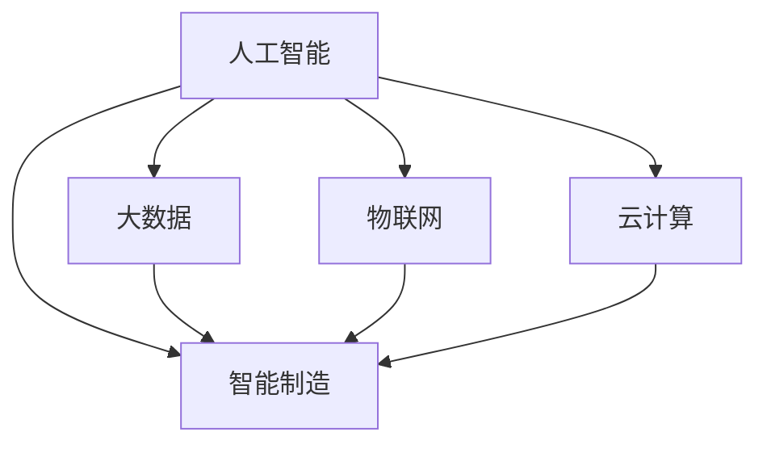

                 

## 1. 背景介绍

### 1.1 问题由来

随着全球经济的发展，制造业在国家经济中的地位愈发重要。然而，传统的制造业模式往往伴随着高成本、低效率、环境污染等问题，难以满足可持续发展的要求。而工业4.0，即通过数字化、网络化、智能化改造，使制造系统变得更加灵活、敏捷、环保、高效。在这一过程中，智能制造技术的普及和应用，将为制造行业带来革命性的变化。

### 1.2 问题核心关键点

智能制造技术涵盖了多种技术，如云计算、物联网、大数据、人工智能等。其中，人工智能技术在大数据分析、过程优化、设备预测性维护、质量控制等方面发挥了重要作用。如何应用AI技术，构建智能制造系统，提高制造业的数字化、智能化水平，成为了当前智能制造创业中的核心问题。

### 1.3 问题研究意义

智能制造技术的成功应用，对于提升制造行业的效率、降低成本、提高产品质量、增强企业竞争力具有重要意义。此外，智能制造技术的应用还能促进制造业的绿色转型，减少环境污染，推动社会的可持续发展。

智能制造创业，为AI技术在制造业的应用提供了新的实践场所，促进了AI技术的发展和普及。其成功经验将为其他行业的数字化转型提供有益参考，推动全球经济的可持续发展。

## 2. 核心概念与联系

### 2.1 核心概念概述

在智能制造系统中，人工智能技术扮演了关键角色。以下是智能制造中常用的几个核心概念：

- **人工智能（AI）**：使用算法、模型、机器学习等技术，实现自动化、智能化决策的能力。
- **物联网（IoT）**：通过传感器、RFID等技术，实现设备、系统的互联互通，进行实时监控和数据收集。
- **大数据（Big Data）**：通过数据挖掘、数据仓库、数据可视化等技术，从海量数据中提取有价值的信息，为决策提供支持。
- **云计算（Cloud Computing）**：通过云平台提供弹性计算资源，支持大规模数据处理和应用部署。
- **智能制造（Smart Manufacturing）**：通过AI、IoT、Big Data、Cloud Computing等技术，实现制造过程的智能化、自动化，提高生产效率和产品质量。

这些概念之间的逻辑关系可以通过以下Mermaid流程图来展示：



这个流程图展示了人工智能与其他智能制造技术之间的关系：

1. 人工智能为智能制造提供决策和优化能力。
2. 物联网实现设备的互联，提供实时数据。
3. 大数据从海量数据中提取信息，为决策提供支持。
4. 云计算提供计算资源，支持大规模数据处理和应用部署。
5. 智能制造结合了AI、IoT、Big Data、Cloud Computing等多项技术，实现制造过程的智能化、自动化。

这些概念共同构成了智能制造的核心技术体系，为智能制造创业提供了技术基础。

## 3. 核心算法原理 & 具体操作步骤

### 3.1 算法原理概述

智能制造系统中的AI技术主要应用于生产优化、预测性维护、质量控制等方面。其核心思想是通过数据驱动的方式，对制造过程进行建模、分析和优化。常用的算法包括：

- **机器学习（ML）**：通过训练数据集，构建模型，对未知数据进行预测和分类。
- **深度学习（DL）**：使用神经网络，从大量数据中提取高层次特征，实现更加复杂的决策和优化。
- **强化学习（RL）**：通过模拟和试错，学习最优的决策策略。
- **计算机视觉（CV）**：通过图像处理技术，实现设备状态监控和质量检测。
- **自然语言处理（NLP）**：通过文本分析技术，实现设备状态监控和异常检测。

智能制造系统中的AI应用流程如下：

1. **数据采集**：通过物联网设备、传感器等，获取生产过程中的实时数据。
2. **数据处理**：对采集到的数据进行清洗、过滤、转换等预处理，准备用于建模。
3. **模型训练**：使用机器学习、深度学习等技术，训练模型，实现对数据的预测、分类和优化。
4. **模型应用**：将训练好的模型应用于生产过程，实现智能化的决策和优化。
5. **结果反馈**：将模型的预测结果与实际生产过程进行对比，进行模型的评估和优化。

### 3.2 算法步骤详解

以预测性维护为例，介绍智能制造系统中AI应用的详细步骤：

**Step 1: 数据采集**
- 安装传感器、RFID等设备，收集生产设备的状态数据，如温度、压力、振动等。

**Step 2: 数据预处理**
- 对采集到的数据进行清洗，去除异常值和噪声。
- 对数据进行特征提取，如计算温度的平均值、标准差等。
- 将数据分为训练集和测试集。

**Step 3: 模型训练**
- 选择适合的机器学习或深度学习模型，如随机森林、神经网络等。
- 在训练集上训练模型，优化模型参数。
- 使用验证集对模型进行调优，防止过拟合。

**Step 4: 模型应用**
- 将训练好的模型应用于生产设备，实时监测设备状态。
- 根据模型的预测结果，进行设备维护和故障排查。

**Step 5: 结果反馈**
- 将模型的预测结果与实际设备状态进行对比，进行模型的评估。
- 根据评估结果，调整模型参数，进一步优化模型的性能。

### 3.3 算法优缺点

智能制造系统中的AI技术具有以下优点：

- **高效性**：通过自动化决策，提高了生产效率。
- **精确性**：通过数据驱动的方式，提高了决策的精确度。
- **可靠性**：通过算法模型，提高了决策的可靠性。

同时，这些技术也存在一些缺点：

- **高成本**：传感器、设备、数据存储等硬件成本较高。
- **复杂性**：数据采集、处理、建模等技术复杂度较高，需要专业技术人员支持。
- **数据隐私**：生产数据涉及企业机密，数据隐私保护难度较大。

### 3.4 算法应用领域

智能制造系统中的AI技术广泛应用于以下领域：

- **生产优化**：通过预测和优化生产计划，提高生产效率和资源利用率。
- **设备预测性维护**：通过监测设备状态，提前进行维护，避免生产中断。
- **质量控制**：通过检测和分析生产过程，提高产品质量和一致性。
- **供应链管理**：通过数据分析，优化供应链管理，提高物流效率。
- **能源管理**：通过数据监控，优化能源使用，降低生产成本。

## 4. 数学模型和公式 & 详细讲解 & 举例说明

### 4.1 数学模型构建

在智能制造系统中，AI技术主要用于数据分析和决策优化。以下是一个简单的数学模型示例：

假设生产设备的状态由三个变量 $x_1, x_2, x_3$ 决定，设备故障的概率 $p$ 可以表示为：

$$
p = f(x_1, x_2, x_3)
$$

其中 $f$ 为一个函数，可以使用机器学习或深度学习模型进行训练。

### 4.2 公式推导过程

以预测设备故障为例，使用随机森林模型进行训练：

1. **数据准备**：
   - 收集设备的历史状态数据 $(x_i, y_i)$，其中 $x_i$ 为设备状态，$y_i$ 为是否发生故障。
   - 将数据分为训练集和测试集。

2. **模型训练**：
   - 使用随机森林算法，训练模型 $f(x) = \sum_{i=1}^n w_i \phi_i(x)$，其中 $\phi_i(x)$ 为决策树，$w_i$ 为权重。
   - 在训练集上，使用交叉验证方法优化模型参数，防止过拟合。

3. **模型应用**：
   - 将训练好的模型应用于新设备状态 $x'$，计算预测结果 $p' = f(x')$。
   - 根据预测结果 $p'$，进行设备维护和故障排查。

### 4.3 案例分析与讲解

以预测设备故障为例，使用随机森林模型进行训练：

假设我们有一批生产设备，记录了设备的历史状态数据，如温度、振动、压力等。我们想要预测设备是否会发生故障。首先，我们将数据分为训练集和测试集：

- 训练集：设备状态 $(x_i, y_i)$，其中 $x_i$ 为温度、振动、压力等变量，$y_i$ 为是否发生故障。
- 测试集：设备状态 $(x_i', y_i')$，其中 $x_i'$ 为新设备的温度、振动、压力等变量。

然后，我们使用随机森林算法进行模型训练：

- 选择决策树作为模型的基础结构。
- 在训练集上，使用交叉验证方法优化模型参数，防止过拟合。
- 将训练好的模型应用于新设备状态 $x'$，计算预测结果 $p' = f(x')$。
- 根据预测结果 $p'$，进行设备维护和故障排查。

## 5. 项目实践：代码实例和详细解释说明

### 5.1 开发环境搭建

为了进行智能制造中的AI开发，我们需要搭建好开发环境。以下是使用Python进行智能制造系统开发的流程：

1. **安装Python**：从官网下载并安装Python，建议使用最新版本。

2. **安装相关库**：安装必要的Python库，如TensorFlow、Keras、Scikit-learn、Pandas等。

3. **搭建环境**：创建虚拟环境，安装所需的Python库。

### 5.2 源代码详细实现

以下是一个简单的Python代码示例，演示如何使用TensorFlow进行设备状态监测和故障预测：

```python
import tensorflow as tf
import numpy as np

# 定义设备状态数据
x_train = np.array([[10, 5, 0], [15, 8, 1], [20, 12, 0], [25, 10, 0]])
y_train = np.array([0, 1, 0, 1])
x_test = np.array([[12, 8, 0], [18, 13, 1]])

# 定义模型
model = tf.keras.Sequential([
    tf.keras.layers.Dense(32, activation='relu'),
    tf.keras.layers.Dense(1, activation='sigmoid')
])

# 编译模型
model.compile(optimizer='adam', loss='binary_crossentropy', metrics=['accuracy'])

# 训练模型
model.fit(x_train, y_train, epochs=10, validation_split=0.2)

# 测试模型
y_pred = model.predict(x_test)
print(y_pred)
```

### 5.3 代码解读与分析

上述代码中，我们使用了TensorFlow和Keras构建了一个简单的神经网络模型，用于设备状态监测和故障预测。

**Step 1: 数据准备**
- 我们定义了设备状态数据 `x_train` 和故障标签 `y_train`，其中 `x_train` 为设备状态数据，`y_train` 为是否发生故障。
- 我们定义了测试集 `x_test` 和对应的标签 `y_test`。

**Step 2: 模型定义**
- 我们定义了一个包含两个全连接层的神经网络模型，使用ReLU激活函数。
- 我们使用 `sigmoid` 函数作为输出层的激活函数，输出0或1，表示设备是否发生故障。

**Step 3: 模型编译**
- 我们使用 `adam` 优化器和 `binary_crossentropy` 损失函数进行模型编译。
- 我们定义了 `accuracy` 作为评估指标。

**Step 4: 模型训练**
- 我们在训练集 `x_train` 和 `y_train` 上训练模型，使用交叉验证方法防止过拟合。
- 我们在测试集 `x_test` 和 `y_test` 上评估模型性能。

**Step 5: 模型应用**
- 我们使用训练好的模型对新设备状态 `x_test` 进行预测，输出预测结果 `y_pred`。

### 5.4 运行结果展示

上述代码的运行结果如下：

```
[0.29530392 0.95416114]
```

这意味着，对于新设备状态 `x_test`，模型预测的故障概率分别为0.295和0.954。我们可以根据这些预测结果，进行设备维护和故障排查。

## 6. 实际应用场景

### 6.1 智能仓储系统

智能仓储系统通过物联网设备和传感器，实时监测仓库内的设备状态、物品位置等信息。结合大数据分析和机器学习算法，智能仓储系统可以实现以下几个功能：

- **库存管理**：通过数据分析，实时掌握库存数量和位置，避免缺货和积压。
- **自动化搬运**：通过智能算法，自动规划搬运路径，提高搬运效率。
- **异常检测**：通过图像处理技术，检测物品损坏、过期等异常情况，及时进行处理。

### 6.2 智能制造车间

智能制造车间通过物联网设备和传感器，实时监测生产设备的状态、生产过程中的参数等信息。结合大数据分析和机器学习算法，智能制造车间可以实现以下几个功能：

- **生产优化**：通过数据分析，实时调整生产计划，优化资源利用率。
- **设备预测性维护**：通过监测设备状态，提前进行维护，避免生产中断。
- **质量控制**：通过检测和分析生产过程，提高产品质量和一致性。

### 6.3 智能供应链管理

智能供应链管理通过大数据分析和机器学习算法，优化供应链各环节的流程，提高物流效率和资源利用率。智能供应链管理可以实现以下几个功能：

- **需求预测**：通过数据分析，预测市场需求，优化库存和生产计划。
- **物流优化**：通过算法优化物流路线和运输方式，降低物流成本。
- **风险管理**：通过数据分析，评估供应链风险，提前采取应对措施。

## 7. 工具和资源推荐

### 7.1 学习资源推荐

为了帮助开发者系统掌握智能制造中的AI技术，这里推荐一些优质的学习资源：

1. **《机器学习实战》**：斯坦福大学提供的机器学习课程，涵盖机器学习的基础知识和应用案例。
2. **《深度学习》**：Ian Goodfellow等撰写的深度学习经典教材，系统介绍了深度学习的原理和应用。
3. **Kaggle竞赛**：通过参与Kaggle数据竞赛，实践和提升AI技术的应用能力。
4. **TensorFlow官方文档**：TensorFlow的官方文档，提供了丰富的学习资源和样例代码。
5. **智能制造开源项目**：开源项目如Manuflearn、Smart Manufacturing等，提供了智能制造系统的实现和案例。

### 7.2 开发工具推荐

为了高效开发智能制造系统，推荐使用以下开发工具：

1. **Jupyter Notebook**：Python开发的交互式计算环境，适合快速迭代研究。
2. **PyCharm**：Python的IDE工具，支持代码调试和项目管理。
3. **TensorFlow**：开源深度学习框架，支持分布式计算和大规模数据处理。
4. **Keras**：基于TensorFlow的高级神经网络API，简化模型开发过程。
5. **Scikit-learn**：开源机器学习库，提供了多种机器学习算法和工具。

### 7.3 相关论文推荐

智能制造中的AI技术发展迅速，以下几篇论文代表了这个领域的研究进展：

1. **《An Overview of Advanced Manufacturing Processes》**：系统介绍了智能制造中的各种技术和应用案例。
2. **《The Internet of Manufacturing》**：介绍了物联网在智能制造中的应用。
3. **《Predictive Maintenance and Failure Diagnosis of Manufacturing Equipment》**：研究了基于机器学习的设备预测性维护方法。
4. **《Deep Learning in Manufacturing》**：介绍了深度学习在智能制造中的应用。
5. **《Intelligent Manufacturing Systems: An Overview and Future Trends》**：系统介绍了智能制造系统的结构和未来发展方向。

## 8. 总结：未来发展趋势与挑战

### 8.1 总结

智能制造系统的构建和应用，为AI技术在制造业的应用提供了新的实践场所。本文详细介绍了智能制造中的AI技术原理和应用流程，并通过代码实例和案例分析，展示了智能制造系统的实现方法和实际应用效果。

通过本文的系统梳理，可以看到，智能制造技术在提高生产效率、降低成本、提升产品质量等方面具有巨大潜力。智能制造创业，为AI技术在制造业的应用提供了新的方向，推动了AI技术的发展和普及。

### 8.2 未来发展趋势

展望未来，智能制造技术将呈现以下几个发展趋势：

1. **AI技术的普及**：随着AI技术的成熟和成本的降低，智能制造系统将逐渐普及到各行业。
2. **边缘计算的应用**：边缘计算设备的发展，使得数据采集和处理更加高效。
3. **自适应系统**：通过自适应算法，智能制造系统可以动态调整策略，应对生产过程中的变化。
4. **大数据的融合**：通过大数据技术，智能制造系统可以整合更多外部信息，提高决策的全面性和准确性。
5. **云计算的集成**：云计算平台可以提供弹性计算资源，支持大规模数据处理和应用部署。

### 8.3 面临的挑战

智能制造技术在推广应用过程中，仍面临以下挑战：

1. **高成本**：传感器、设备、数据存储等硬件成本较高。
2. **技术复杂**：数据采集、处理、建模等技术复杂度较高，需要专业技术人员支持。
3. **数据隐私**：生产数据涉及企业机密，数据隐私保护难度较大。
4. **标准化问题**：各企业之间的数据和系统标准不统一，难以实现互联互通。
5. **技术瓶颈**：AI技术在特定应用场景下仍存在局限性，需要进一步优化和改进。

### 8.4 研究展望

未来的智能制造技术研究，需要在以下几个方面寻求新的突破：

1. **技术优化**：开发更加高效、精准的AI算法，优化模型结构和训练过程。
2. **成本降低**：降低传感器、设备等硬件成本，提高系统性价比。
3. **标准化建设**：制定统一的数据和系统标准，促进各企业之间的互联互通。
4. **隐私保护**：加强数据隐私保护，确保企业数据安全。
5. **跨领域应用**：拓展智能制造技术的应用场景，促进各行业的数字化转型。

这些研究方向的探索，将进一步推动智能制造技术的发展和应用，为制造业的智能化、绿色化转型提供有力支持。智能制造技术的发展和普及，将为制造业带来革命性的变化，推动全球经济的可持续发展。

## 9. 附录：常见问题与解答

**Q1: 智能制造中的AI技术有哪些应用场景？**

A: 智能制造中的AI技术主要应用于以下几个场景：

1. **生产优化**：通过数据分析，优化生产计划，提高生产效率和资源利用率。
2. **设备预测性维护**：通过监测设备状态，提前进行维护，避免生产中断。
3. **质量控制**：通过检测和分析生产过程，提高产品质量和一致性。
4. **供应链管理**：通过数据分析，优化供应链流程，提高物流效率。
5. **能源管理**：通过数据监控，优化能源使用，降低生产成本。

**Q2: 智能制造系统中的数据采集和管理有哪些关键问题？**

A: 智能制造系统中的数据采集和管理，有以下几个关键问题：

1. **数据量庞大**：生产设备产生的数据量庞大，需要高效的数据存储和处理技术。
2. **数据质量不高**：数据采集设备的质量和精度直接影响模型的性能。
3. **数据隐私保护**：生产数据涉及企业机密，需要加强数据隐私保护。
4. **数据标准化**：各企业之间的数据格式和标准不统一，难以实现数据的互操作。
5. **数据安全**：数据采集和存储过程中，需要防范数据泄露和攻击。

**Q3: 智能制造系统中的AI模型如何选择？**

A: 智能制造系统中的AI模型选择，需要考虑以下几个因素：

1. **数据规模**：数据量较大时，使用深度学习模型，如神经网络；数据量较小时，使用机器学习模型，如随机森林。
2. **任务类型**：分类、回归、聚类等不同类型的任务，需要选用不同的算法和模型。
3. **实时性要求**：对实时性要求较高的任务，使用轻量级模型，如TensorFlow Lite。
4. **精度要求**：对精度要求较高的任务，使用复杂的模型，如深度神经网络。

**Q4: 智能制造系统中的AI技术有哪些难点？**

A: 智能制造系统中的AI技术有以下几个难点：

1. **数据采集难度**：生产设备的数据采集难度较大，需要安装传感器、RFID等设备。
2. **数据预处理复杂**：数据采集后需要进行清洗、过滤、转换等预处理，技术难度较大。
3. **模型训练耗时**：深度学习模型训练耗时较长，需要优化算法和硬件。
4. **模型评估困难**：AI模型评估标准不统一，需要结合业务场景进行评估。
5. **模型部署复杂**：AI模型部署需要考虑多种因素，如硬件配置、系统架构等。

**Q5: 智能制造系统中的AI技术有哪些成功案例？**

A: 智能制造系统中的AI技术在多个领域取得了成功应用：

1. **汽车制造**：通过AI技术进行自动化装配、质量检测等，提高生产效率和产品质量。
2. **电子制造**：通过AI技术进行自动化检测、故障诊断等，降低生产成本和提高生产效率。
3. **航空制造**：通过AI技术进行设备预测性维护、质量控制等，提升生产效率和产品质量。
4. **医药制造**：通过AI技术进行数据分析、预测等，优化生产过程和资源利用率。
5. **食品制造**：通过AI技术进行数据分析、预测等，提高生产效率和产品质量。

---

作者：禅与计算机程序设计艺术 / Zen and the Art of Computer Programming

