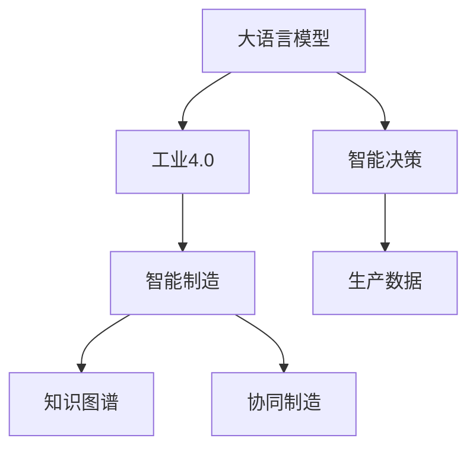

                 

# 智能制造新范式：LLM在工业4.0中的角色

> 关键词：工业4.0, 大语言模型, 智能制造, 自动化, 高效生产, 质量控制, 故障预测, 维护优化, 工业AI, 知识图谱, 协同制造

## 1. 背景介绍

### 1.1 问题由来

工业4.0（Industry 4.0），也称为智能制造或第四次工业革命，标志着制造业的数字化转型。这一转型旨在通过信息技术和物理系统的深度融合，实现生产的自动化、智能化和个性化。工业4.0的核心要素包括智能设备、云计算、物联网、大数据分析等，但其核心驱动仍然是人工智能技术的应用。

然而，当前的工业AI系统往往局限于单点应用，缺乏全局协同和知识管理，难以实现生产系统的综合优化和智能决策。例如，生产过程中的设备故障预测、质量控制、维护优化等环节，往往需要依赖人工经验，缺乏对全局数据的分析和综合决策能力。

### 1.2 问题核心关键点

实现智能制造的关键在于构建一个高度集成、智能化的生产体系，能够实时分析和管理海量生产数据，实现生产过程的预测、优化和控制。为了实现这一目标，需要构建一个智能的“神经系统”，这个神经系统不仅能够理解生产数据，还能通过知识图谱、专家系统等方法，实现基于数据的智能决策。

而大语言模型（Large Language Model, LLM）作为当前人工智能技术的前沿代表，其强大的语言理解和生成能力，能够处理和分析大量自然语言数据，通过与生产数据相结合，实现对生产系统的智能化管理和优化。因此，大语言模型在工业4.0中具有重要的应用前景。

### 1.3 问题研究意义

研究大语言模型在工业4.0中的应用，对于推动制造业智能化升级，提升生产效率和产品质量，降低生产成本，具有重要意义：

1. **提升生产效率**：通过大语言模型对生产过程的智能化管理，实现实时监控和预测，优化生产流程，降低停机时间。
2. **提高产品质量**：通过质量检测和故障预测，提前发现和修复问题，减少废品率。
3. **降低生产成本**：通过自动化的设备维护和故障诊断，减少人力成本，提升设备利用率。
4. **增强协同制造**：通过知识图谱和专家系统，实现生产过程中的信息共享和协同决策，提升企业竞争力。
5. **实现智能决策**：通过大语言模型对海量生产数据的综合分析，实现基于数据的智能决策，提升生产系统的全局优化能力。

## 2. 核心概念与联系

### 2.1 核心概念概述

为了更好地理解大语言模型在工业4.0中的应用，本节将介绍几个密切相关的核心概念：

- **大语言模型(Large Language Model, LLM)**：以自回归（如GPT）或自编码（如BERT）模型为代表的大规模预训练语言模型。通过在大规模无标签文本语料上进行预训练，学习通用的语言表示，具备强大的语言理解和生成能力。

- **工业4.0（Industry 4.0）**：工业4.0是指制造业的数字化转型，通过信息技术和物理系统的深度融合，实现生产的自动化、智能化和个性化。其核心要素包括智能设备、云计算、物联网、大数据分析等。

- **知识图谱(Knowledge Graph)**：一种语义化的知识表示方式，通过节点和边的关系，表示实体及其之间的联系。知识图谱能够有效整合各类数据，帮助大语言模型进行智能推理和决策。

- **智能制造(Smart Manufacturing)**：通过人工智能技术，实现生产过程的自动化、智能化和全局优化，提升生产效率和产品质量，降低生产成本。

- **协同制造(Collaborative Manufacturing)**：通过信息共享和协同决策，实现生产过程中的高度集成和智能管理，提升企业竞争力。

- **智能决策(Intelligent Decision Making)**：基于数据驱动的决策过程，通过人工智能技术实现对海量数据的分析和综合，实现生产系统的全局优化。

这些核心概念之间的逻辑关系可以通过以下Mermaid流程图来展示：



这个流程图展示了大语言模型在工业4.0中的应用路径：

1. 大语言模型通过处理生产数据，实现对生产过程的智能化管理。
2. 通过知识图谱整合各类数据，增强大语言模型的推理和决策能力。
3. 协同制造系统通过信息共享和协同决策，提升生产系统的综合优化能力。
4. 智能决策系统基于数据驱动的决策过程，实现生产系统的全局优化。

## 3. 核心算法原理 & 具体操作步骤
### 3.1 算法原理概述

大语言模型在工业4.0中的应用，主要体现在以下几个方面：

1. **生产数据的智能分析**：大语言模型能够处理和分析海量自然语言数据，通过与生产数据相结合，实现对生产过程的智能化管理。

2. **知识图谱的构建与整合**：通过大语言模型对生产数据中的实体关系进行分析，构建知识图谱，增强生产系统的知识管理能力。

3. **协同制造的智能决策**：大语言模型通过知识图谱和专家系统，实现基于数据的智能决策，提升生产系统的全局优化能力。

### 3.2 算法步骤详解

基于大语言模型的智能制造系统一般包括以下几个关键步骤：

**Step 1: 数据收集与预处理**
- 收集生产系统中的各类数据，包括设备状态、生产参数、质量检测结果等，并进行清洗和预处理，保证数据的质量和格式一致性。

**Step 2: 构建知识图谱**
- 利用大语言模型对生产数据中的实体关系进行分析，构建知识图谱，表示设备、物料、工艺等实体及其之间的关系。
- 利用自然语言处理技术，从生产文档、工艺手册、设备维护记录等文本数据中提取知识，丰富知识图谱。

**Step 3: 微调大语言模型**
- 选择合适的大语言模型作为初始化参数，如GPT、BERT等。
- 根据工业4.0中的特定任务，设计合适的输出层和损失函数。
- 使用标注数据对模型进行微调，使其能够理解工业场景中的自然语言描述。

**Step 4: 模型集成与部署**
- 将微调后的模型集成到生产系统中，进行实时监控和决策。
- 部署模型到云端或边缘设备，确保其高效性和可靠性。
- 建立可视化界面，方便用户查询和监控模型输出。

### 3.3 算法优缺点

基于大语言模型的智能制造系统具有以下优点：

1. **强大的数据处理能力**：大语言模型能够处理和分析海量自然语言数据，实现对生产系统的智能化管理。
2. **知识管理能力**：通过知识图谱的构建，大语言模型能够整合各类数据，增强生产系统的知识管理能力。
3. **智能决策能力**：利用大语言模型的推理和决策能力，实现基于数据的智能决策，提升生产系统的全局优化能力。

然而，该方法也存在一些局限性：

1. **数据依赖性**：大语言模型的性能很大程度上取决于标注数据的质量和数量，获取高质量标注数据的成本较高。
2. **泛化能力有限**：当目标任务与预训练数据的分布差异较大时，大语言模型的性能提升有限。
3. **部署复杂性**：大语言模型的推理速度较慢，对计算资源和部署环境要求较高。
4. **可解释性不足**：大语言模型决策过程缺乏可解释性，难以对其推理逻辑进行分析和调试。

尽管存在这些局限性，但就目前而言，大语言模型在工业4.0中的应用仍处于前沿研究阶段，具有巨大的发展潜力。

### 3.4 算法应用领域

大语言模型在工业4.0中的应用，主要集中在以下几个领域：

1. **设备故障预测与维护优化**：通过分析设备状态数据和维护记录，构建知识图谱，利用大语言模型进行故障预测和维护优化。
2. **生产过程监控与优化**：利用大语言模型对生产数据进行实时分析，实现生产过程的监控和优化。
3. **质量检测与控制**：通过大语言模型对产品质量检测结果进行综合分析，实现质量控制和改进。
4. **智能客服与交互**：通过大语言模型实现与操作人员的自然语言交互，提升生产系统的易用性和用户满意度。
5. **文档生成与分析**：利用大语言模型对生产文档进行生成和分析，提升生产系统的文档管理能力。

这些应用领域展示了大语言模型在工业4.0中巨大的应用潜力，为制造行业的智能化升级提供了新的技术路径。

## 4. 数学模型和公式 & 详细讲解 & 举例说明

### 4.1 数学模型构建

大语言模型在工业4.0中的应用，可以通过以下数学模型进行建模：

**Step 1: 数据收集与预处理**

假设生产系统中收集到的数据为 $D = \{d_i\}_{i=1}^N$，其中 $d_i$ 表示第 $i$ 个数据点，包含设备状态、生产参数、质量检测结果等。数据预处理的目的是将数据转换为标准格式，方便大语言模型的处理。

**Step 2: 构建知识图谱**

假设知识图谱由节点和边组成，其中节点表示实体，边表示实体之间的关系。知识图谱可以表示为 $G=(V,E)$，其中 $V$ 表示节点集合，$E$ 表示边集合。

**Step 3: 微调大语言模型**

假设选择大语言模型 $M_{\theta}$ 作为初始化参数，其中 $\theta$ 为模型参数。给定标注数据集 $D=\{(x_i,y_i)\}_{i=1}^N$，其中 $x_i$ 表示输入数据，$y_i$ 表示标签（如设备故障、生产参数等）。微调的目标是最小化损失函数 $\mathcal{L}(\theta)$，即：

$$
\hat{\theta}=\mathop{\arg\min}_{\theta} \mathcal{L}(M_{\theta},D)
$$

其中 $\mathcal{L}$ 为损失函数，用于衡量模型预测输出与真实标签之间的差异。常见的损失函数包括交叉熵损失、均方误差损失等。

### 4.2 公式推导过程

以设备故障预测为例，假设模型的输入为设备状态数据 $d_i$，输出为故障概率 $p$。假设故障数据集中包含 $n$ 个故障样本，每个样本包含 $m$ 个特征。则模型的训练数据集可以表示为 $D = \{(x_i,y_i)\}_{i=1}^n$，其中 $x_i$ 表示故障样本的特征向量，$y_i$ 表示故障概率。模型的预测输出为：

$$
p_i=M_{\theta}(d_i)
$$

损失函数 $\mathcal{L}$ 可以表示为：

$$
\mathcal{L}(\theta)=\frac{1}{n}\sum_{i=1}^n\ell(M_{\theta}(d_i),y_i)
$$

其中 $\ell$ 为损失函数，如交叉熵损失。微调过程的目标是最小化损失函数 $\mathcal{L}$，更新模型参数 $\theta$。微调过程的优化目标可以表示为：

$$
\hat{\theta}=\mathop{\arg\min}_{\theta} \mathcal{L}(M_{\theta},D)
$$

### 4.3 案例分析与讲解

以生产过程监控与优化为例，假设生产系统中包含多个设备，每个设备的状态数据可以表示为 $d_i$，其中 $i$ 表示设备编号。通过大语言模型对设备状态数据进行分析，可以识别出生产过程中的异常设备，进行故障预测和维护优化。

具体而言，假设大语言模型 $M_{\theta}$ 对设备状态数据 $d_i$ 进行预测，得到故障概率 $p_i$。将 $p_i$ 与预设阈值 $\alpha$ 比较，如果 $p_i>\alpha$，则表示该设备可能出现故障。此时，系统可以通过故障预测结果，及时进行维护和调整，避免生产过程中的停机损失。

## 5. 项目实践：代码实例和详细解释说明

### 5.1 开发环境搭建

在进行大语言模型在工业4.0中的应用实践前，我们需要准备好开发环境。以下是使用Python进行PyTorch开发的环境配置流程：

1. 安装Anaconda：从官网下载并安装Anaconda，用于创建独立的Python环境。

2. 创建并激活虚拟环境：
```bash
conda create -n pytorch-env python=3.8 
conda activate pytorch-env
```

3. 安装PyTorch：根据CUDA版本，从官网获取对应的安装命令。例如：
```bash
conda install pytorch torchvision torchaudio cudatoolkit=11.1 -c pytorch -c conda-forge
```

4. 安装Transformers库：
```bash
pip install transformers
```

5. 安装各类工具包：
```bash
pip install numpy pandas scikit-learn matplotlib tqdm jupyter notebook ipython
```

完成上述步骤后，即可在`pytorch-env`环境中开始微调实践。

### 5.2 源代码详细实现

下面我们以生产过程监控与优化任务为例，给出使用Transformers库对BERT模型进行微调的PyTorch代码实现。

首先，定义生产过程监控与优化任务的数据处理函数：

```python
from transformers import BertTokenizer
from torch.utils.data import Dataset
import torch

class ProcessMonitorDataset(Dataset):
    def __init__(self, data, tokenizer, max_len=128):
        self.data = data
        self.tokenizer = tokenizer
        self.max_len = max_len
        
    def __len__(self):
        return len(self.data)
    
    def __getitem__(self, item):
        data_point = self.data[item]
        
        encoding = self.tokenizer(data_point, return_tensors='pt', max_length=self.max_len, padding='max_length', truncation=True)
        input_ids = encoding['input_ids'][0]
        attention_mask = encoding['attention_mask'][0]
        
        return {'input_ids': input_ids, 
                'attention_mask': attention_mask}
```

然后，定义模型和优化器：

```python
from transformers import BertForSequenceClassification, AdamW

model = BertForSequenceClassification.from_pretrained('bert-base-cased', num_labels=2)

optimizer = AdamW(model.parameters(), lr=2e-5)
```

接着，定义训练和评估函数：

```python
from torch.utils.data import DataLoader
from tqdm import tqdm
from sklearn.metrics import classification_report

device = torch.device('cuda') if torch.cuda.is_available() else torch.device('cpu')
model.to(device)

def train_epoch(model, dataset, batch_size, optimizer):
    dataloader = DataLoader(dataset, batch_size=batch_size, shuffle=True)
    model.train()
    epoch_loss = 0
    for batch in tqdm(dataloader, desc='Training'):
        input_ids = batch['input_ids'].to(device)
        attention_mask = batch['attention_mask'].to(device)
        model.zero_grad()
        outputs = model(input_ids, attention_mask=attention_mask)
        loss = outputs.loss
        epoch_loss += loss.item()
        loss.backward()
        optimizer.step()
    return epoch_loss / len(dataloader)

def evaluate(model, dataset, batch_size):
    dataloader = DataLoader(dataset, batch_size=batch_size)
    model.eval()
    preds, labels = [], []
    with torch.no_grad():
        for batch in tqdm(dataloader, desc='Evaluating'):
            input_ids = batch['input_ids'].to(device)
            attention_mask = batch['attention_mask'].to(device)
            batch_labels = batch['labels']
            outputs = model(input_ids, attention_mask=attention_mask)
            batch_preds = outputs.logits.argmax(dim=2).to('cpu').tolist()
            batch_labels = batch_labels.to('cpu').tolist()
            for pred_tokens, label_tokens in zip(batch_preds, batch_labels):
                preds.append(pred_tokens[:len(label_tokens)])
                labels.append(label_tokens)
                
    print(classification_report(labels, preds))
```

最后，启动训练流程并在验证集上评估：

```python
epochs = 5
batch_size = 16

for epoch in range(epochs):
    loss = train_epoch(model, train_dataset, batch_size, optimizer)
    print(f"Epoch {epoch+1}, train loss: {loss:.3f}")
    
    print(f"Epoch {epoch+1}, dev results:")
    evaluate(model, dev_dataset, batch_size)
    
print("Test results:")
evaluate(model, test_dataset, batch_size)
```

以上就是使用PyTorch对BERT进行生产过程监控与优化任务微调的完整代码实现。可以看到，得益于Transformers库的强大封装，我们可以用相对简洁的代码完成BERT模型的加载和微调。

### 5.3 代码解读与分析

让我们再详细解读一下关键代码的实现细节：

**ProcessMonitorDataset类**：
- `__init__`方法：初始化训练数据、分词器等关键组件。
- `__len__`方法：返回数据集的样本数量。
- `__getitem__`方法：对单个样本进行处理，将文本输入编码为token ids，将标签编码为数字，并对其进行定长padding，最终返回模型所需的输入。

**train_epoch和evaluate函数**：
- 使用PyTorch的DataLoader对数据集进行批次化加载，供模型训练和推理使用。
- 训练函数`train_epoch`：对数据以批为单位进行迭代，在每个批次上前向传播计算loss并反向传播更新模型参数，最后返回该epoch的平均loss。
- 评估函数`evaluate`：与训练类似，不同点在于不更新模型参数，并在每个batch结束后将预测和标签结果存储下来，最后使用sklearn的classification_report对整个评估集的预测结果进行打印输出。

**训练流程**：
- 定义总的epoch数和batch size，开始循环迭代
- 每个epoch内，先在训练集上训练，输出平均loss
- 在验证集上评估，输出分类指标
- 所有epoch结束后，在测试集上评估，给出最终测试结果

可以看到，PyTorch配合Transformers库使得BERT微调的代码实现变得简洁高效。开发者可以将更多精力放在数据处理、模型改进等高层逻辑上，而不必过多关注底层的实现细节。

当然，工业级的系统实现还需考虑更多因素，如模型的保存和部署、超参数的自动搜索、更灵活的任务适配层等。但核心的微调范式基本与此类似。

## 6. 实际应用场景
### 6.1 智能工厂系统

智能工厂系统通过大语言模型实现对生产过程的智能化管理。智能工厂系统包含多种智能设备，能够实时采集生产数据，如设备状态、生产参数、质量检测结果等。通过大语言模型对生产数据进行分析，实现对生产过程的监控、优化和故障预测，提升生产系统的智能化水平。

具体而言，智能工厂系统通过大语言模型进行故障预测和维护优化。系统收集设备状态数据，通过大语言模型进行故障预测和故障诊断，提前发现和修复问题，减少生产过程中的停机时间和维护成本。同时，系统根据生产数据进行实时监控和优化，实现生产过程的智能调度和管理。

### 6.2 协同制造平台

协同制造平台通过大语言模型实现信息共享和协同决策，提升生产系统的综合优化能力。协同制造平台将多个生产系统集成在一起，通过大语言模型对各系统的生产数据进行综合分析，实现全局优化。

具体而言，协同制造平台通过大语言模型进行协同决策。系统收集各生产系统的生产数据，通过大语言模型进行综合分析，识别出生产中的瓶颈和优化机会，提出优化建议，帮助各生产系统进行协同决策和资源优化。同时，平台通过大语言模型进行文档生成和分析，提升生产系统的文档管理能力。

### 6.3 智能客服系统

智能客服系统通过大语言模型实现与操作人员的自然语言交互，提升生产系统的易用性和用户满意度。智能客服系统能够实时监控生产数据，通过大语言模型进行智能问答和问题解答，提升操作人员的生产效率和满意度。

具体而言，智能客服系统通过大语言模型进行智能问答。系统收集生产数据和操作人员的问题，通过大语言模型进行问答，提供相应的解决方案和建议，提升操作人员的生产效率。同时，系统通过大语言模型进行文档生成和分析，提升操作人员的文档管理能力。

### 6.4 未来应用展望

随着大语言模型和微调方法的不断发展，基于微调范式将在更多领域得到应用，为传统行业带来变革性影响。

在智慧医疗领域，基于大语言模型的智能医疗系统可以实现医疗问答、病历分析、药物研发等，提升医疗服务的智能化水平，辅助医生诊疗，加速新药开发进程。

在智能教育领域，微调技术可应用于作业批改、学情分析、知识推荐等方面，因材施教，促进教育公平，提高教学质量。

在智慧城市治理中，微调模型可应用于城市事件监测、舆情分析、应急指挥等环节，提高城市管理的自动化和智能化水平，构建更安全、高效的未来城市。

此外，在企业生产、社会治理、文娱传媒等众多领域，基于大模型微调的人工智能应用也将不断涌现，为NLP技术带来新的突破。相信随着技术的日益成熟，微调方法将成为人工智能落地应用的重要范式，推动人工智能技术向更广阔的领域加速渗透。

## 7. 工具和资源推荐
### 7.1 学习资源推荐

为了帮助开发者系统掌握大语言模型在工业4.0中的应用理论基础和实践技巧，这里推荐一些优质的学习资源：

1. 《工业4.0与人工智能》系列博文：由大模型技术专家撰写，深入浅出地介绍了工业4.0的背景、大语言模型的应用及其发展方向。

2. 《智能制造与人工智能》课程：斯坦福大学开设的工业4.0相关课程，有Lecture视频和配套作业，带你全面了解工业4.0及其与人工智能的深度融合。

3. 《大语言模型在工业4.0中的应用》书籍：详细介绍了大语言模型在工业4.0中的各种应用场景，如设备故障预测、生产过程监控、协同制造等，具有较高的理论性和实践指导意义。

4. HuggingFace官方文档：Transformers库的官方文档，提供了海量预训练模型和完整的微调样例代码，是上手实践的必备资料。

5. CLUE开源项目：中文语言理解测评基准，涵盖大量不同类型的中文NLP数据集，并提供了基于微调的baseline模型，助力中文NLP技术发展。

通过对这些资源的学习实践，相信你一定能够快速掌握大语言模型在工业4.0中的应用精髓，并用于解决实际的NLP问题。
###  7.2 开发工具推荐

高效的开发离不开优秀的工具支持。以下是几款用于大语言模型在工业4.0中应用开发的常用工具：

1. PyTorch：基于Python的开源深度学习框架，灵活动态的计算图，适合快速迭代研究。大部分预训练语言模型都有PyTorch版本的实现。

2. TensorFlow：由Google主导开发的开源深度学习框架，生产部署方便，适合大规模工程应用。同样有丰富的预训练语言模型资源。

3. Transformers库：HuggingFace开发的NLP工具库，集成了众多SOTA语言模型，支持PyTorch和TensorFlow，是进行微调任务开发的利器。

4. Weights & Biases：模型训练的实验跟踪工具，可以记录和可视化模型训练过程中的各项指标，方便对比和调优。与主流深度学习框架无缝集成。

5. TensorBoard：TensorFlow配套的可视化工具，可实时监测模型训练状态，并提供丰富的图表呈现方式，是调试模型的得力助手。

6. Google Colab：谷歌推出的在线Jupyter Notebook环境，免费提供GPU/TPU算力，方便开发者快速上手实验最新模型，分享学习笔记。

合理利用这些工具，可以显著提升大语言模型在工业4.0中应用的开发效率，加快创新迭代的步伐。

### 7.3 相关论文推荐

大语言模型和微调技术的发展源于学界的持续研究。以下是几篇奠基性的相关论文，推荐阅读：

1. Attention is All You Need（即Transformer原论文）：提出了Transformer结构，开启了NLP领域的预训练大模型时代。

2. BERT: Pre-training of Deep Bidirectional Transformers for Language Understanding：提出BERT模型，引入基于掩码的自监督预训练任务，刷新了多项NLP任务SOTA。

3. Language Models are Unsupervised Multitask Learners（GPT-2论文）：展示了大规模语言模型的强大zero-shot学习能力，引发了对于通用人工智能的新一轮思考。

4. Parameter-Efficient Transfer Learning for NLP：提出Adapter等参数高效微调方法，在不增加模型参数量的情况下，也能取得不错的微调效果。

5. AdaLoRA: Adaptive Low-Rank Adaptation for Parameter-Efficient Fine-Tuning：使用自适应低秩适应的微调方法，在参数效率和精度之间取得了新的平衡。

这些论文代表了大语言模型微调技术的发展脉络。通过学习这些前沿成果，可以帮助研究者把握学科前进方向，激发更多的创新灵感。

## 8. 总结：未来发展趋势与挑战

### 8.1 总结

本文对基于大语言模型的智能制造新范式进行了全面系统的介绍。首先阐述了大语言模型在工业4.0中的应用背景和意义，明确了工业4.0中智能制造和工业AI的发展方向。其次，从原理到实践，详细讲解了大语言模型在工业4.0中的核心算法原理和具体操作步骤，给出了微调任务开发的完整代码实例。同时，本文还广泛探讨了大语言模型在工业4.0中的实际应用场景，展示了其在设备故障预测、生产过程监控、协同制造等领域的巨大潜力。此外，本文精选了微调技术的各类学习资源，力求为读者提供全方位的技术指引。

通过本文的系统梳理，可以看到，基于大语言模型的智能制造新范式在工业4.0中具有广阔的应用前景。大语言模型通过处理和分析生产数据，实现对生产系统的智能化管理，显著提升了生产系统的效率和质量，降低了生产成本。未来，伴随大语言模型和微调方法的不断演进，基于微调范式将带来更多的创新应用，进一步推动制造业的智能化升级。

### 8.2 未来发展趋势

展望未来，大语言模型在工业4.0中的应用将呈现以下几个发展趋势：

1. **更高效的数据处理**：随着大语言模型的不断进化，其数据处理能力将进一步提升，能够处理更复杂、更庞大的生产数据。

2. **更智能的决策能力**：大语言模型将通过深度学习、知识图谱、专家系统等手段，实现更智能的决策过程，提升生产系统的全局优化能力。

3. **更灵活的微调方法**：未来将涌现更多参数高效、计算高效的微调方法，进一步降低微调成本，提升微调效果。

4. **更全面的知识管理**：知识图谱和专家系统的应用将进一步丰富，大语言模型将能够整合更多领域的知识，提升生产系统的知识管理能力。

5. **更广泛的协同制造**：通过大语言模型实现信息共享和协同决策，提升生产系统的综合优化能力，推动制造行业实现更广泛的协同制造。

6. **更深入的智能交互**：大语言模型将实现与操作人员的深度自然语言交互，提升生产系统的易用性和用户满意度。

以上趋势凸显了大语言模型在工业4.0中的巨大应用潜力。这些方向的探索发展，必将进一步提升生产系统的智能化水平，为制造业智能化升级提供新的技术路径。

### 8.3 面临的挑战

尽管大语言模型在工业4.0中的应用取得了显著进展，但在迈向更加智能化、普适化应用的过程中，它仍面临着诸多挑战：

1. **数据依赖性**：大语言模型的性能很大程度上取决于标注数据的质量和数量，获取高质量标注数据的成本较高。如何进一步降低微调对标注样本的依赖，将是一大难题。

2. **泛化能力不足**：当目标任务与预训练数据的分布差异较大时，大语言模型的性能提升有限。如何提高微调模型的泛化能力，增强其对不同场景的适应性，还需要更多理论和实践的积累。

3. **部署复杂性**：大语言模型的推理速度较慢，对计算资源和部署环境要求较高。如何实现高效、可靠、可扩展的部署，还需要进一步优化。

4. **可解释性不足**：大语言模型决策过程缺乏可解释性，难以对其推理逻辑进行分析和调试。如何赋予大语言模型更强的可解释性，将是亟待攻克的难题。

5. **安全性有待保障**：大语言模型可能学习到有害信息，传递到下游任务，造成负面影响。如何从数据和算法层面消除模型偏见，避免恶意用途，确保输出的安全性，也将是重要的研究课题。

6. **知识整合能力不足**：现有的微调模型往往局限于任务内数据，难以灵活吸收和运用更广泛的先验知识。如何让微调过程更好地与外部知识库、规则库等专家知识结合，形成更加全面、准确的信息整合能力，还有很大的想象空间。

正视微调面临的这些挑战，积极应对并寻求突破，将是大语言模型在工业4.0中走向成熟的必由之路。相信随着学界和产业界的共同努力，这些挑战终将一一被克服，大语言模型将进一步推动制造业智能化升级，带来深远的影响。

### 8.4 研究展望

面向未来，大语言模型在工业4.0中的应用研究需要在以下几个方面寻求新的突破：

1. **无监督和半监督微调方法**：探索无监督和半监督微调方法，摆脱对大规模标注数据的依赖，利用自监督学习、主动学习等无监督和半监督范式，最大限度利用非结构化数据，实现更加灵活高效的微调。

2. **参数高效和计算高效的微调范式**：开发更加参数高效、计算高效的微调方法，如Prefix-Tuning、LoRA等，在节省计算资源的同时也能保证微调精度。

3. **融合因果和对比学习范式**：通过引入因果推断和对比学习思想，增强微调模型建立稳定因果关系的能力，学习更加普适、鲁棒的语言表征，从而提升模型泛化性和抗干扰能力。

4. **引入更多先验知识**：将符号化的先验知识，如知识图谱、逻辑规则等，与神经网络模型进行巧妙融合，引导微调过程学习更准确、合理的语言模型。同时加强不同模态数据的整合，实现视觉、语音等多模态信息与文本信息的协同建模。

5. **结合因果分析和博弈论工具**：将因果分析方法引入微调模型，识别出模型决策的关键特征，增强输出解释的因果性和逻辑性。借助博弈论工具刻画人机交互过程，主动探索并规避模型的脆弱点，提高系统稳定性。

6. **纳入伦理道德约束**：在模型训练目标中引入伦理导向的评估指标，过滤和惩罚有偏见、有害的输出倾向。同时加强人工干预和审核，建立模型行为的监管机制，确保输出符合人类价值观和伦理道德。

这些研究方向的探索，必将引领大语言模型在工业4.0中走向更高的台阶，为制造业智能化升级带来新的技术路径。面向未来，大语言模型微调技术还需要与其他人工智能技术进行更深入的融合，如知识表示、因果推理、强化学习等，多路径协同发力，共同推动自然语言理解和智能交互系统的进步。只有勇于创新、敢于突破，才能不断拓展语言模型的边界，让智能技术更好地造福人类社会。

## 9. 附录：常见问题与解答

**Q1：大语言模型在工业4.0中的部署和维护有哪些难点？**

A: 大语言模型在工业4.0中的部署和维护存在以下几个难点：

1. **高计算资源需求**：大语言模型通常需要高性能GPU或TPU进行训练和推理，这对算力资源提出了较高要求。

2. **高存储需求**：大语言模型通常需要较大的模型参数，这会占用大量存储空间，尤其是在边缘设备上部署时。

3. **高通信开销**：在分布式系统中，大语言模型需要频繁进行数据通信，这会增加网络延迟和通信开销。

4. **高维护成本**：大语言模型需要持续维护和更新，以保证其性能和安全性。例如，需要定期更新模型参数、修复模型漏洞等。

5. **高易用性挑战**：大语言模型需要提供易用性较高的API接口，方便开发者和操作人员使用。同时，还需要具备良好的可扩展性，能够适应不同规模的生产系统。

6. **高可靠性要求**：大语言模型需要具备高可靠性，确保在生产过程中稳定运行，避免因模型故障导致生产停机。

**Q2：大语言模型在工业4.0中的应用场景有哪些？**

A: 大语言模型在工业4.0中具有广泛的应用场景，以下是几个典型的例子：

1. **设备故障预测与维护优化**：通过分析设备状态数据和维护记录，构建知识图谱，利用大语言模型进行故障预测和维护优化。

2. **生产过程监控与优化**：利用大语言模型对生产数据进行实时分析，实现生产过程的监控和优化。

3. **质量检测与控制**：通过大语言模型对产品质量检测结果进行综合分析，实现质量控制和改进。

4. **智能客服与交互**：通过大语言模型实现与操作人员的自然语言交互，提升生产系统的易用性和用户满意度。

5. **文档生成与分析**：利用大语言模型对生产文档进行生成和分析，提升生产系统的文档管理能力。

6. **协同制造与决策支持**：通过大语言模型实现信息共享和协同决策，提升生产系统的综合优化能力。

**Q3：大语言模型在工业4.0中如何进行参数高效微调？**

A: 大语言模型在工业4.0中进行参数高效微调，可以采用以下方法：

1. **Adapter微调**：只更新顶层分类器或解码器，保留大部分预训练参数不变。这样可以显著降低微调所需的计算资源，避免过拟合。

2. **Prefix-Tuning**：通过在输入文本中添加提示模板，引导大语言模型进行特定任务的推理和生成。这样可以减少微调参数，提高模型的少样本学习能力。

3. **LoRA微调**：通过低秩调整方式，只更新一小部分线性层参数，保留大部分预训练参数不变。这样可以提高微调效率，同时保持模型性能。

4. **混合微调**：将大语言模型分成多个部分，分别进行微调。这样可以降低单个部分的计算复杂度，提高微调效率。

**Q4：大语言模型在工业4.0中的数据处理有哪些难点？**

A: 大语言模型在工业4.0中的数据处理存在以下几个难点：

1. **数据多样性**：工业4.0中的生产数据通常具有高度多样性，包括设备状态、生产参数、质量检测结果等多种类型的数据。如何统一处理这些数据，是一个挑战。

2. **数据不一致性**：不同设备和生产环节的数据格式和内容可能不一致，需要进行数据清洗和格式转换。

3. **数据冗余性**：工业4.0中的生产数据可能存在大量冗余和噪声数据，如何有效清洗和筛选，提升数据质量，是一个难题。

4. **数据隐私保护**：工业4.0中的生产数据通常包含敏感信息，如何在保护数据隐私的前提下进行数据处理和分析，是一个重要问题。

5. **数据集成与共享**：不同生产系统和部门的数据可能存在集成和共享的困难，如何建立统一的数据集成和共享机制，是一个挑战。

**Q5：大语言模型在工业4.0中的知识图谱构建有哪些方法？**

A: 大语言模型在工业4.0中的知识图谱构建可以采用以下方法：

1. **基于规则的知识图谱构建**：通过专家知识库和规则，自动生成知识图谱。例如，基于工艺流程、设备参数等规则，构建设备故障诊断知识图谱。

2. **基于数据驱动的知识图谱构建**：通过分析生产数据，自动发现实体和关系，构建知识图谱。例如，通过分析设备状态数据，自动发现设备之间的关系和状态变化。

3. **基于深度学习的知识图谱构建**：通过训练深度学习模型，从生产数据中提取实体和关系，构建知识图谱。例如，使用BERT等模型对设备状态数据进行特征提取，然后训练关系抽取模型，构建设备故障诊断知识图谱。

4. **基于众包的知识图谱构建**：通过众包平台，收集专家知识和用户输入，构建知识图谱。例如，通过众包平台收集设备故障诊断知识，构建知识图谱。

5. **基于混合方法的知识图谱构建**：结合多种方法，综合利用专家知识、数据驱动和深度学习技术，构建更全面、准确的知识图谱。

作者：禅与计算机程序设计艺术 / Zen and the Art of Computer Programming

