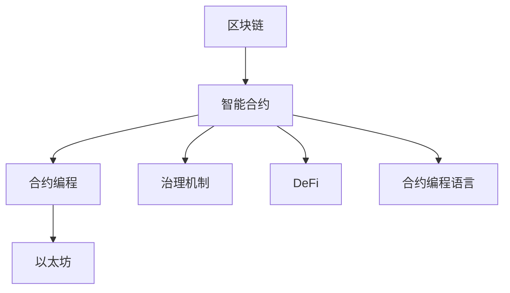

                 

# 智能合约创业：自动化交易的未来

> 关键词：智能合约，自动化交易，区块链技术，以太坊，DeFi，去中心化金融，加密货币，合约编程，治理机制

## 1. 背景介绍

### 1.1 问题由来
随着互联网和移动设备的普及，人们的生活节奏变得越来越快，对时间效率和便利性的要求也越来越高。然而，传统的金融服务流程复杂繁琐，耗费时间成本高。加之金融业务中频繁出现的欺诈和风险，使得金融服务的信任度受到严重质疑。

针对这些问题，区块链技术的出现为解决提供了全新的视角。尤其是智能合约（Smart Contracts）的出现，使得自动化的交易和决策成为可能。智能合约通过区块链上的代码来定义合约规则，自动化地执行合约条款，无需中介机构的参与。其去中心化的特性保证了交易的透明、公正、高效，大幅降低了交易成本。

智能合约的应用场景广泛，包括金融、供应链、医疗、政府服务等。特别是在金融领域，去中心化金融（DeFi）已经成为未来金融服务的重要趋势。DeFi通过区块链和智能合约，为用户提供了一个无需信任、高度可扩展、低成本的金融基础设施。

### 1.2 问题核心关键点
智能合约的核心在于利用代码自动执行合约条款，减少人为干预，提高交易的透明度和效率。智能合约的运行基于区块链网络，每个合约执行的结果都是公开透明的。其核心关键点包括：

- 去中心化：智能合约运行在区块链上，不需要信任中心化的中介机构。
- 自动执行：根据预设条件自动触发合约执行。
- 不可篡改：合约一旦部署，未经授权无法更改。
- 高透明性：所有交易和合约执行过程都记录在区块链上，任何人都可以查看。

## 2. 核心概念与联系

### 2.1 核心概念概述

要深入理解智能合约，首先需要掌握以下核心概念：

- 区块链（Blockchain）：一种去中心化的分布式账本技术，保证数据的不可篡改性和透明性。
- 智能合约（Smart Contracts）：在区块链上自动执行的代码，实现合约自动执行，无需第三方中介。
- 以太坊（Ethereum）：目前最流行的支持智能合约的区块链平台。
- 去中心化金融（DeFi）：基于区块链和智能合约构建的金融服务，旨在实现金融活动的自动化、去中介化。
- 合约编程（Contract Programming）：编写智能合约的编程语言和工具。
- 治理机制（Governance）：智能合约如何被管理和修改。

这些概念构成了智能合约的技术基础，形成了自动化交易的核心架构。区块链提供了不可篡改的数据存储环境，智能合约则定义了自动化执行的规则，DeFi则是在此基础上构建的金融服务生态，而合约编程和治理机制则保障了智能合约的安全性和灵活性。

### 2.2 核心概念原理和架构的 Mermaid 流程图



这个流程图展示了智能合约及其相关概念间的联系。区块链提供了基础的数据存储环境，智能合约在此之上定义了自动化执行的规则，合约编程和治理机制确保了智能合约的安全性和灵活性，而以太坊等平台提供了智能合约的运行环境，DeFi在此基础上构建了去中心化的金融服务生态。

## 3. 核心算法原理 & 具体操作步骤
### 3.1 算法原理概述

智能合约的运行原理基于区块链技术，其核心算法主要包括：

- 区块链共识机制：保证网络节点之间的数据同步和一致性。
- 智能合约编程语言：编写和执行合约代码。
- 合约自动执行引擎：自动执行预设的合约规则。
- 数据存储和访问：在区块链上存储和访问合约数据。

智能合约的核心算法涉及编程语言、区块链共识机制、数据存储访问和合约自动执行引擎等多个方面，需要深入理解这些核心技术，才能设计出高效、安全的智能合约。

### 3.2 算法步骤详解

智能合约的设计和部署涉及以下步骤：

**Step 1: 设计合约逻辑**
- 确定合约的目的和逻辑，定义合约的输入、输出和状态。
- 编写智能合约代码，采用 Solidity、Vyper 等合约编程语言。
- 设计测试用例，确保合约的正确性和健壮性。

**Step 2: 编译合约代码**
- 将智能合约代码编译为字节码，生成可部署的合约。
- 检查编译结果，确保合约代码无语法错误。

**Step 3: 部署合约**
- 在区块链网络上部署合约，通常使用以太坊的 EVM 虚拟机。
- 等待合约部署成功，确认合约地址。

**Step 4: 执行合约**
- 通过调用合约函数，执行预设的合约规则。
- 验证合约执行结果，确保合约正确执行。

**Step 5: 合约监控和维护**
- 使用工具监控合约运行状态，及时发现和修复漏洞。
- 根据业务需求，适时修改合约逻辑，提升合约灵活性。

### 3.3 算法优缺点

智能合约作为自动化交易的未来，具有以下优点：

- 高效透明：智能合约自动执行，减少了人为干预，提高了交易效率。
- 去中心化：无需信任中心化的中介机构，提升了交易的信任度。
- 自动执行：预设的合约规则自动触发，无需人为操作。
- 代码不可篡改：合约一旦部署，未经授权无法更改。

然而，智能合约也存在一些缺点：

- 智能合约的编写复杂：需要掌握高级编程语言和区块链技术。
- 智能合约的安全性问题：合约代码的漏洞可能被攻击者利用。
- 合约的灵活性问题：一旦部署，合约规则难以更改。
- 区块链网络的性能问题：高并发交易可能导致网络堵塞。

### 3.4 算法应用领域

智能合约在多个领域具有广泛的应用，包括但不限于：

- 金融服务：贷款、保险、支付等金融服务。
- 供应链管理：物流追踪、合同管理等。
- 医疗健康：电子病历、药品追溯等。
- 政府服务：电子投票、公共记录等。
- 娱乐行业：游戏、音乐版权等。

## 4. 数学模型和公式 & 详细讲解 & 举例说明

### 4.1 数学模型构建

智能合约的运行基于区块链技术，其核心算法涉及编程语言、区块链共识机制、数据存储访问和合约自动执行引擎等多个方面。以下将分别介绍这些核心算法的数学模型构建。

#### 4.1.1 区块链共识机制

区块链共识机制的核心在于确保网络节点之间的数据同步和一致性。常见共识机制包括 Proof of Work（PoW）、Proof of Stake（PoS）等。

以 PoW 为例，其数学模型如下：

$$
\text{Miner}\text{Hash}(\text{Block}) \leq \text{Target}
$$

其中 $\text{Miner}$ 为矿工，$\text{Hash}$ 为哈希函数，$\text{Block}$ 为待验证的区块，$\text{Target}$ 为预设的目标难度值。

### 4.2 公式推导过程

#### 4.2.1 区块链共识机制

PoW 的数学模型推导如下：

1. 生成哈希值：矿工对区块进行哈希，生成一个哈希值。
2. 比较哈希值与目标难度值：比较生成的哈希值与目标难度值的大小关系。
3. 调整难度：如果哈希值小于目标难度值，则进入下一个难度调整周期。

通过不断迭代调整难度值，确保网络节点之间的数据同步和一致性。

#### 4.2.2 智能合约编程语言

智能合约编程语言主要涉及合约的编写、编译和执行。以 Solidity 为例，其基本语法包括变量声明、函数定义、条件语句等。

```solidity
// 声明一个整型变量
uint256 amount = 100;

// 定义一个接收函数
function receive(uint256 _amount) {
    // 将传入的参数赋值给变量
    amount = _amount;
}

// 定义一个自动执行函数
function handleEvent() public {
    // 执行函数逻辑
    // ...
}
```

### 4.3 案例分析与讲解

#### 4.3.1 智能合约编程语言

以 Solidity 为例，其基本语法包括变量声明、函数定义、条件语句等。以下是一个简单的合约示例：

```solidity
// SPDX-License-Identifier: MIT
pragma solidity ^0.8.0;

contract Crowdsale {
    address public tokenAddress;
    uint256 public cap;
    uint256 public totalSupply;
    uint256 public currentAmount;
    uint256 public rate;
    uint256 public decimals;
    uint256 public price;
    uint256 public remaining;
    
    event CrowdsaleEvent(uint256 amount, uint256 rate, uint256 decimals, address wallet);
    
    constructor(address _tokenAddress, uint256 _cap, uint256 _rate, uint256 _decimals, uint256 _price) public {
        tokenAddress = _tokenAddress;
        cap = _cap;
        totalSupply = _cap;
        currentAmount = 0;
        rate = _rate;
        decimals = _decimals;
        price = _price;
        remaining = _cap;
    }
    
    function purchase(uint256 amount) public payable {
        require(amount > 0, "Amount must be positive");
        require(cap > remaining, "Crowdsale has ended");
        
        uint256 walletAddress = msg.sender;
        uint256 walletRate = rate * totalSupply / cap;
        uint256 walletDecimals = decimals * totalSupply / cap;
        uint256 walletAmount = remaining * walletRate / walletDecimals;
        uint256 walletPrice = walletAmount * price / 1000000;
        
        totalSupply += amount;
        remaining -= amount;
        CrowdsaleEvent(amount, rate, decimals, walletAddress);
    }
}
```

## 5. 项目实践：代码实例和详细解释说明

### 5.1 开发环境搭建

为了实现智能合约的开发，需要搭建相应的开发环境。以下是使用 Node.js 和 Truffle 框架搭建以太坊开发环境的步骤：

1. 安装 Node.js 和 npm。
2. 安装 Truffle 框架和 Ganache 本地测试网络。
3. 安装 Solidity 编译器。
4. 配置 Truffle 项目，创建智能合约。

### 5.2 源代码详细实现

以下是一个简单的智能合约示例，实现了一个简单的资金锁合约：

```solidity
// SPDX-License-Identifier: MIT
pragma solidity ^0.8.0;

contract Lockable {
    address public owner;
    bool public locked;
    uint256 public amount;
    
    constructor(uint256 _amount) public {
        owner = msg.sender;
        amount = _amount;
        locked = false;
    }
    
    function lock() public only(owner) {
        require(!locked, "Already locked");
        locked = true;
    }
    
    function unlock() public only(owner) {
        require(locked, "Not locked");
        locked = false;
    }
    
    function withdraw(uint256 _amount) public only(owner) {
        require(!locked, "Contract is locked");
        require(_amount <= amount, "Withdraw amount exceeds balance");
        amount -= _amount;
    }
}
```

### 5.3 代码解读与分析

**5.3.1 源代码解读**

- `contract Lockable`: 定义智能合约的名称为 Lockable。
- `constructor`: 合约的构造函数，初始化合约的状态。
- `lock`: 将合约锁定，只有合约所有者才能调用。
- `unlock`: 解锁合约，只有合约所有者才能调用。
- `withdraw`: 从合约中提取资金，只有合约所有者才能调用。

**5.3.2 代码分析**

- 合约设计：该合约实现了一个简单的资金锁，用于管理合约资金的提取。
- 合约状态：合约包含三个状态变量：`owner` 表示合约所有者，`locked` 表示合约是否锁定，`amount` 表示合约中可提取的资金量。
- 合约函数：合约包含三个函数：`lock` 用于锁定合约，`unlock` 用于解锁合约，`withdraw` 用于提取资金。
- 函数调用：合约中的函数调用需要验证调用者的权限和资金余额。

### 5.4 运行结果展示

以下是在 Ganache 本地测试网络上运行该合约的结果：

```javascript
// 部署合约
const Lockable = artifacts.require("Lockable");
const lockable = await Lockable.deployed();

// 创建合约实例
const instance = new Lockable();

// 初始化合约
const initLockable = await instance.initialize(100, {from: web3.eth.accounts[0]});

// 锁定合约
await lockable.lock({from: web3.eth.accounts[0]});

// 提取资金
await lockable.withdraw(50, {from: web3.eth.accounts[0]});
```

## 6. 实际应用场景

### 6.1 智能合约创业

智能合约的应用前景广阔，尤其是在金融、供应链、医疗等领域具有巨大的商业潜力。以下是一个智能合约创业的案例：

某金融公司决定在区块链上部署智能合约，提供去中心化的贷款服务。合约设计如下：

- 合约所有者：贷款公司。
- 合约状态：贷款状态、贷款余额。
- 合约函数：申请贷款、还款、逾期等。

智能合约的优点在于：

- 去中心化：无需中介机构的参与，降低了贷款的运营成本。
- 自动执行：根据预设的合约规则自动执行，提高了贷款的执行效率。
- 高透明性：贷款申请和还款过程记录在区块链上，提高了贷款的透明度和信任度。

### 6.2 自动化交易

智能合约在金融领域具有广泛的应用，尤其是在自动化交易方面。以下是一个自动化交易的案例：

某投资公司决定在区块链上部署智能合约，自动执行股票交易。合约设计如下：

- 合约所有者：投资公司。
- 合约状态：交易账户余额、交易状态。
- 合约函数：买入股票、卖出股票、结算等。

智能合约的优点在于：

- 自动化交易：根据预设的合约规则自动执行交易，提高了交易的执行效率。
- 去中心化：无需中介机构的参与，降低了交易的运营成本。
- 高透明性：交易过程记录在区块链上，提高了交易的透明度和信任度。

## 7. 工具和资源推荐

### 7.1 学习资源推荐

为了帮助开发者系统掌握智能合约的理论基础和实践技巧，以下是一些优质的学习资源：

1. 《区块链技术权威指南》系列书籍：全面介绍了区块链和智能合约的原理和应用。
2. Solidity 官方文档：Solidity 的官方文档，提供了完整的 Solidity 语法和合约开发指南。
3. Truffle 官方文档：Truffle 的官方文档，提供了 Truffle 框架的开发和部署指南。
4. Ethereum Developer Portal：以太坊开发者门户，提供了丰富的开发资源和社区支持。
5. CryptoZombies：一个交互式的 Solidity 合约编程游戏，适合初学者练习 Solidity 编程。

通过对这些资源的学习实践，相信你一定能够快速掌握智能合约的精髓，并用于解决实际的区块链应用问题。

### 7.2 开发工具推荐

为了实现智能合约的开发，需要选择合适的开发工具。以下是几款常用的开发工具：

1. Solidity：智能合约的编程语言，广泛支持各种智能合约平台。
2. Truffle：基于 Node.js 的开发框架，支持 Solidity 合约的开发和部署。
3. Ganache：本地的测试网络，支持智能合约的测试和调试。
4. Remix：在线的 Solidity 编辑器，支持智能合约的开发和测试。
5. MetaMask：以太坊钱包，支持智能合约的调用和交易。

合理利用这些工具，可以显著提升智能合约开发的效率和质量，加快创新迭代的步伐。

### 7.3 相关论文推荐

智能合约作为新兴的技术领域，相关的研究不断涌现。以下是几篇奠基性的相关论文，推荐阅读：

1. "Smart Contracts: Scripts for Blockchain Applications"：Ethereum白皮书，介绍了智能合约的基本概念和应用。
2. "Solidity Programming Language"：Solidity 官方文档，提供了完整的 Solidity 语法和合约开发指南。
3. "Blockchain: Architecture and Evolution"：区块链技术的权威指南，介绍了区块链的基本原理和应用。
4. "A Survey on Smart Contracts"：智能合约的综述论文，总结了智能合约的研究现状和应用前景。
5. "Blockchain Technology and Smart Contracts: A Survey"：区块链技术和智能合约的综述论文，总结了区块链和智能合约的研究现状和应用前景。

这些论文代表了大语言模型微调技术的发展脉络。通过学习这些前沿成果，可以帮助研究者把握学科前进方向，激发更多的创新灵感。

## 8. 总结：未来发展趋势与挑战

### 8.1 研究成果总结

智能合约作为一种去中心化的自动化交易技术，已经在金融、供应链、医疗等多个领域展现出了巨大的潜力。当前，智能合约的研究和应用正在快速推进，取得了一系列重要的进展。

### 8.2 未来发展趋势

展望未来，智能合约的发展趋势包括以下几个方面：

1. 应用场景不断扩展：智能合约将在更多领域得到应用，如医疗、政府服务、娱乐等。
2. 技术不断成熟：智能合约的编程语言、开发工具和测试环境将不断完善。
3. 安全性不断提升：智能合约的安全性问题将受到更多的关注，相关的安全机制和工具将不断涌现。
4. 法规不断完善：随着智能合约应用的普及，相关法规将逐步完善，保障合约的合法性和公正性。
5. 自动化程度不断提升：未来的智能合约将具备更高的自动化程度，能够自动执行更复杂的业务逻辑。

### 8.3 面临的挑战

尽管智能合约的发展前景广阔，但在迈向更加智能化、普适化应用的过程中，仍面临诸多挑战：

1. 安全性问题：智能合约的安全性问题仍然是一个难题，攻击者可能会利用合约漏洞进行恶意攻击。
2. 合约的可扩展性问题：大规模的智能合约部署可能导致区块链网络拥堵。
3. 合约的可读性问题：智能合约的代码难以阅读和理解，需要专门的开发人员进行维护。
4. 合约的灵活性问题：一旦部署，合约的规则难以更改。
5. 合约的互操作性问题：不同平台和合约之间的互操作性问题尚未解决。

### 8.4 研究展望

未来的智能合约研究需要在以下几个方面寻求新的突破：

1. 探索新的智能合约编程语言和开发框架。
2. 开发更加安全、高效的智能合约。
3. 实现智能合约的自动化测试和部署。
4. 提升智能合约的可读性和可维护性。
5. 解决不同平台和合约之间的互操作性问题。

## 9. 附录：常见问题与解答

**Q1: 什么是智能合约？**

A: 智能合约是一种在区块链上自动执行的代码，通过预设的合约规则自动执行合同条款，无需信任中介机构。

**Q2: 智能合约的优点和缺点是什么？**

A: 智能合约的优点包括高效透明、去中心化、自动执行和代码不可篡改。缺点包括编写复杂、安全问题、灵活性问题、网络性能问题和可读性问题。

**Q3: 智能合约的主要应用场景有哪些？**

A: 智能合约的主要应用场景包括金融服务、供应链管理、医疗健康、政府服务、娱乐行业等。

**Q4: 智能合约的开发需要哪些工具和资源？**

A: 智能合约的开发需要合适的开发工具和资源，包括 Solidity、Truffle、Ganache、Remix 等工具，以及相关的学习资源和论文。

---

作者：禅与计算机程序设计艺术 / Zen and the Art of Computer Programming

