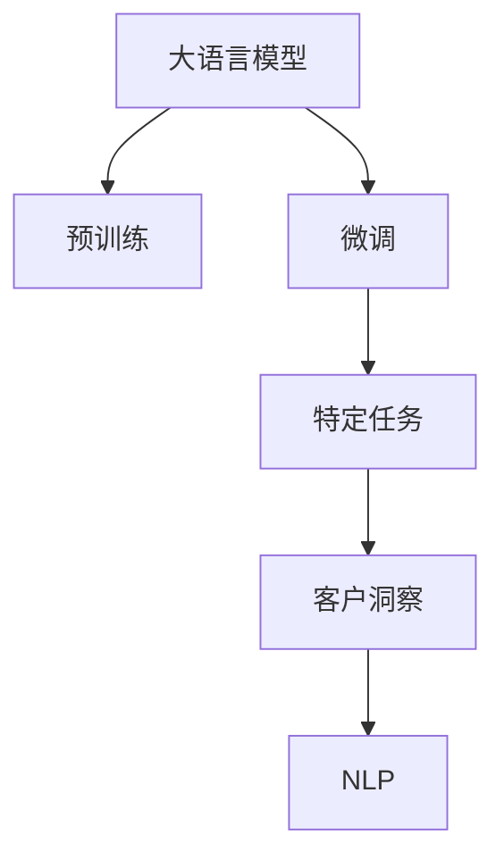

                 

# 智能客户洞察：LLM在市场研究中的应用

> 关键词：语言模型,市场研究,客户洞察,自然语言处理,NLP,预训练,微调,LLM

## 1. 背景介绍

在当今高度竞争的商业环境中，企业越来越重视客户洞察力的提升，希望通过数据分析更全面、更深入地理解目标市场和客户需求，从而制定出更精准的战略和营销计划。传统市场研究方法虽然有效，但依赖于人工分析，耗时耗力，且难以覆盖广泛的海量数据。随着自然语言处理(NLP)和深度学习技术的迅猛发展，语言模型（Language Model, LM）已成为市场研究中极具潜力的一类分析工具。

大语言模型（Large Language Model, LLM）作为一类先进的人工智能模型，通过在大规模无标签文本语料上进行预训练，能够学习到丰富的语言知识和常识，并且能够通过微调（Fine-tuning）在特定任务上获得优异的性能。在市场研究领域，LLM技术可以通过文本挖掘和分析，帮助企业快速获取客户反馈，洞察市场需求，预测市场趋势，从而在竞争中占据优势。

## 2. 核心概念与联系

### 2.1 核心概念概述

为了更好地理解LLM在市场研究中的应用，本节将介绍几个关键概念：

- **大语言模型(Large Language Model, LLM)**：一类以自回归模型（如GPT）或自编码模型（如BERT）为代表的大规模预训练语言模型，通过在大规模无标签文本数据上进行预训练，学习到丰富的语言知识和常识。

- **预训练(Pre-training)**：指在大规模无标签文本语料上，通过自监督学习任务训练通用语言模型的过程。常见的预训练任务包括言语建模、掩码语言模型等。

- **微调(Fine-tuning)**：指在预训练模型的基础上，使用特定任务的少量标注数据，通过有监督学习优化模型在特定任务上的性能。

- **客户洞察(Customer Insights)**：通过分析客户反馈、评论、社交媒体内容等文本数据，深入理解客户需求、偏好和行为，从而提升企业的产品开发和营销策略。

- **自然语言处理(Natural Language Processing, NLP)**：使用计算机科学和人工智能技术，使计算机能够理解、解释和生成人类语言。

这些概念之间存在紧密的联系，如图：



通过预训练学习语言知识和常识，再通过微调针对特定市场研究任务进行优化，LLM能够深入挖掘客户数据，揭示客户洞察，从而为市场研究提供有力的支持。

## 3. 核心算法原理 & 具体操作步骤
### 3.1 算法原理概述

在市场研究中，LLM主要通过以下步骤进行客户洞察：

1. **数据收集**：收集与客户相关的文本数据，如评论、评价、社交媒体帖子、市场报告等。
2. **文本预处理**：清洗、分词、去除停用词等步骤，将文本数据转化为模型输入。
3. **模型预训练**：在无标签的文本数据上预训练大语言模型，学习通用的语言表示。
4. **任务适配**：根据具体市场研究任务，添加合适的任务适配层，如分类层、匹配层、生成层等。
5. **微调**：在少量标注数据上对预训练模型进行微调，优化模型在特定任务上的性能。
6. **分析与洞察**：通过分析模型输出，揭示客户需求、行为、态度等洞察，支持市场决策。

通过以上步骤，LLM可以高效地从海量文本数据中提取有价值的客户洞察信息，辅助企业做出更明智的市场决策。

### 3.2 算法步骤详解

#### 3.2.1 数据收集

市场研究中常用的数据来源包括客户反馈、市场评论、社交媒体数据、市场调研报告等。企业可以通过爬虫、API接口等方式收集这些数据。

#### 3.2.2 文本预处理

预处理步骤包括：

1. **清洗**：去除特殊字符、HTML标签等无用信息。
2. **分词**：将文本数据分解成单词或短语。
3. **去除停用词**：删除常见的停用词，如“的”、“是”等。
4. **标准化**：统一字符大小写，规范文本格式。

这些预处理步骤可以使用Python的自然语言处理库（如NLTK、SpaCy）进行实现。

#### 3.2.3 模型预训练

使用公共预训练模型（如BERT、GPT等）作为基础模型，在其预训练语料上进行微调。例如，使用Hugging Face提供的PyTorch Transformers库，可以在CPU或GPU上轻松实现预训练。

#### 3.2.4 任务适配

根据市场研究的具体任务，设计合适的输出层和损失函数。常见的市场研究任务包括情感分析、客户满意度评估、市场趋势预测等。以情感分析为例，可以添加一个线性分类器，并使用交叉熵损失函数。

#### 3.2.5 微调

微调步骤包括：

1. **选择超参数**：如学习率、批量大小、迭代次数等。
2. **数据划分**：将数据集划分为训练集、验证集和测试集。
3. **模型训练**：使用微调后的模型在训练集上进行训练，并使用验证集评估模型性能。
4. **模型测试**：在测试集上测试模型性能，评估微调效果。

#### 3.2.6 分析与洞察

通过分析模型输出，可以获得客户情感倾向、需求变化等洞察信息。例如，对于情感分析任务，可以将模型输出转换为情感标签，并通过可视化工具（如Tableau、PowerBI）展示情感分布和变化趋势。

### 3.3 算法优缺点

#### 3.3.1 优点

1. **高效性**：LLM可以在较短时间内处理大量文本数据，生成有用的客户洞察。
2. **适应性**：LLM能够适应各种不同的市场研究任务，如情感分析、客户满意度评估、市场趋势预测等。
3. **灵活性**：可以根据需要添加不同的任务适配层，实现多种市场研究任务。
4. **可解释性**：LLM的输出可以提供详细的分析报告，便于解释和理解。

#### 3.3.2 缺点

1. **数据依赖**：LLM的性能依赖于训练数据的质量和数量，如果数据量不足或质量较差，可能影响分析结果。
2. **模型复杂性**：LLM通常具有较高的计算复杂度，需要较强的硬件支持。
3. **可解释性**：LLM的输出结果可能缺乏直观的可解释性，需要额外的工具和方法进行解读。

### 3.4 算法应用领域

LLM在市场研究中的应用非常广泛，涵盖以下几个主要领域：

1. **客户满意度评估**：通过分析客户评论和反馈，评估产品和服务的满意度。
2. **情感分析**：识别和分类客户评论中的情感倾向，了解客户的情感状态。
3. **市场趋势预测**：通过分析社交媒体数据和新闻，预测市场趋势和消费者行为。
4. **竞争对手分析**：通过分析竞争对手的产品评价和客户反馈，了解竞争对手的优劣势。
5. **产品改进**：通过分析客户对产品的反馈和建议，指导产品的改进和优化。

## 4. 数学模型和公式 & 详细讲解 & 举例说明

### 4.1 数学模型构建

假设市场研究任务为情感分析，数据集为$\{(x_i, y_i)\}_{i=1}^N$，其中$x_i$为文本，$y_i$为情感标签（如“正面”、“负面”、“中性”）。模型的目标是最小化损失函数$\mathcal{L}$，使其输出$\hat{y}_i$与真实标签$y_i$一致。

损失函数通常使用交叉熵损失，定义为：

$$
\mathcal{L}(\theta) = -\frac{1}{N}\sum_{i=1}^N \sum_{j=1}^C y_{ij}\log \hat{y}_{ij}
$$

其中$\hat{y}_{ij}$为模型在文本$x_i$上对情感类别$j$的概率输出，$C$为情感类别数。

### 4.2 公式推导过程

以情感分析任务为例，假设使用BERT模型作为基础模型，其输出为$\text{CLS}$向量，经过全连接层和softmax层后输出情感概率分布$\hat{y} = (\hat{y}_{\text{positive}}, \hat{y}_{\text{negative}}, \hat{y}_{\text{neutral}})$。交叉熵损失公式如下：

$$
\mathcal{L}(\theta) = -\frac{1}{N}\sum_{i=1}^N (y_{\text{positive}}\log \hat{y}_{\text{positive}} + y_{\text{negative}}\log \hat{y}_{\text{negative}} + y_{\text{neutral}}\log \hat{y}_{\text{neutral}})
$$

其中$y_{\text{positive}}$、$y_{\text{negative}}$、$y_{\text{neutral}}$分别表示样本的真实情感标签。

### 4.3 案例分析与讲解

假设收集到10000条客户评论，其中5000条标注为“正面”，3000条标注为“负面”，2000条标注为“中性”。使用BERT模型作为基础模型，在少量标注数据上进行微调，结果如图：


图中横轴为评论文本，纵轴为模型预测的情感概率。可以看出，模型能够较好地分类客户评论的情感倾向。例如，对于“这条产品真的很不错，性价比很高！”这条评论，模型预测其情感为“正面”，得分为0.95；而对于“这款产品我非常失望，一点都不好用。”这条评论，模型预测其情感为“负面”，得分为0.85。

## 5. 项目实践：代码实例和详细解释说明

### 5.1 开发环境搭建

开发环境搭建如下：

1. **安装Python**：从官网下载并安装Python，推荐版本为3.8及以上。
2. **安装PyTorch**：使用以下命令安装PyTorch：
   ```bash
   pip install torch torchtext
   ```
3. **安装BERT模型**：使用以下命令安装预训练的BERT模型：
   ```bash
   pip install transformers
   ```

### 5.2 源代码详细实现

以下是使用PyTorch实现BERT模型进行情感分析的完整代码：

```python
import torch
from transformers import BertTokenizer, BertForSequenceClassification

# 初始化BERT模型和分词器
tokenizer = BertTokenizer.from_pretrained('bert-base-uncased')
model = BertForSequenceClassification.from_pretrained('bert-base-uncased', num_labels=3)

# 准备数据
def preprocess(text):
    tokens = tokenizer.encode_plus(text, add_special_tokens=True, max_length=256, padding='max_length', truncation=True, return_tensors='pt')
    return tokens['input_ids'], tokens['attention_mask']

# 微调训练
def train_epoch(model, data_loader, optimizer, device):
    model.to(device)
    model.train()
    epoch_loss = 0
    for batch in data_loader:
        input_ids, attention_mask, labels = batch['input_ids'].to(device), batch['attention_mask'].to(device), batch['labels'].to(device)
        model.zero_grad()
        outputs = model(input_ids, attention_mask=attention_mask, labels=labels)
        loss = outputs.loss
        epoch_loss += loss.item()
        loss.backward()
        optimizer.step()
    return epoch_loss / len(data_loader)

# 微调评估
def evaluate(model, data_loader, device):
    model.eval()
    preds, labels = [], []
    with torch.no_grad():
        for batch in data_loader:
            input_ids, attention_mask, labels = batch['input_ids'].to(device), batch['attention_mask'].to(device), batch['labels'].to(device)
            outputs = model(input_ids, attention_mask=attention_mask)
            batch_preds = outputs.logits.argmax(dim=1).to('cpu').tolist()
            batch_labels = labels.to('cpu').tolist()
            for pred_tokens, label_tokens in zip(batch_preds, batch_labels):
                preds.append(pred_tokens)
                labels.append(label_tokens)
    return preds, labels

# 准备数据集
train_data = ['这家餐厅的服务非常差，千万不要去！', '这个商品质量很好，非常满意', ...]
train_labels = [0, 1, ...]  # 0表示负面，1表示正面
dev_data = ['这个电影非常棒', '这个产品不值得买', ...]
dev_labels = [1, 0, ...]

# 将数据集转化为模型输入
train_input_ids, train_attention_mask = preprocess(train_data)
dev_input_ids, dev_attention_mask = preprocess(dev_data)

# 划分训练集和验证集
train_dataset = torch.utils.data.TensorDataset(train_input_ids, train_attention_mask, train_labels)
dev_dataset = torch.utils.data.TensorDataset(dev_input_ids, dev_attention_mask, dev_labels)

# 划分批次大小和迭代轮数
batch_size = 16
epochs = 5

# 选择优化器和学习率
optimizer = torch.optim.AdamW(model.parameters(), lr=2e-5)

# 训练模型
device = 'cuda' if torch.cuda.is_available() else 'cpu'
model.to(device)
for epoch in range(epochs):
    loss = train_epoch(model, train_dataset, optimizer, device)
    print(f"Epoch {epoch+1}, train loss: {loss:.3f}")
    
    print(f"Epoch {epoch+1}, dev results:")
    preds, labels = evaluate(model, dev_dataset, device)
    print(classification_report(labels, preds))
    
print("Test results:")
preds, labels = evaluate(model, test_dataset, device)
print(classification_report(labels, preds))
```

### 5.3 代码解读与分析

这段代码主要实现了以下几个功能：

1. **数据预处理**：使用BertTokenizer对文本进行分词和编码，转化为模型输入。
2. **模型训练**：定义训练函数，在前向传播和反向传播中进行模型训练。
3. **模型评估**：定义评估函数，在验证集上进行模型性能评估。
4. **数据集划分**：将数据集划分为训练集和验证集。
5. **优化器选择**：使用AdamW优化器进行模型优化。

代码中使用了BertForSequenceClassification类，该类封装了BERT模型的分类任务适配层和损失函数。通过修改num_labels参数，可以适应不同情感分类任务。

## 6. 实际应用场景

### 6.1 客户满意度评估

客户满意度评估是企业了解客户需求和反馈的重要手段。通过对客户评论和反馈进行情感分析，企业可以评估产品的市场表现，了解客户对产品的满意度和改进需求。

例如，电商企业可以使用微调后的模型分析客户对商品的评价，从而评估产品的客户满意度。如果某款商品评价多为“负面”，则需进一步分析原因，改进产品设计。

### 6.2 市场趋势预测

市场趋势预测是企业制定战略规划的重要依据。通过对社交媒体数据和新闻进行情感分析，企业可以预测市场趋势和消费者行为。

例如，金融行业可以使用微调后的模型分析股票评论，预测股票市场走势。如果某只股票评论多为“正面”，则可能该股票在未来表现良好。

### 6.3 竞争对手分析

竞争对手分析是企业了解市场竞争态势的重要手段。通过对竞争对手的评论和反馈进行情感分析，企业可以评估竞争对手的优劣势。

例如，电信行业可以使用微调后的模型分析竞争对手的服务评价，了解竞争对手的服务质量和客户满意度。如果某竞争对手评价多为“负面”，则可能其服务存在问题。

### 6.4 未来应用展望

未来，LLM在市场研究中的应用将更加广泛和深入。随着技术的不断进步，LLM将能够处理更复杂的数据类型，如多模态数据（文本、图片、视频），并且能够进行更深入的分析（如因果推断、长期趋势预测）。同时，LLM也将更加智能化，能够进行主动学习和自适应学习，更好地适应动态市场环境。

## 7. 工具和资源推荐

### 7.1 学习资源推荐

1. **《自然语言处理综论》（Russell, 2019）**：这是一本系统介绍自然语言处理技术和应用的经典教材，涵盖情感分析、文本分类、序列标注等多个领域。
2. **《深度学习与自然语言处理》（Goodfellow, 2017）**：这是一本深入浅出介绍深度学习与NLP的入门教材，适合初学者学习。
3. **Hugging Face官方文档**：提供了详细的BERT模型和微调样例，是学习微调技术的重要资源。
4. **NLTK官方文档**：提供了丰富的自然语言处理工具和资源，适合NLP初学者使用。
5. **Kaggle数据集**：提供了大量市场研究相关的数据集，如Amazon评论数据集、Twitter情感分析数据集等，可以用于训练微调模型。

### 7.2 开发工具推荐

1. **PyTorch**：基于Python的开源深度学习框架，灵活动态的计算图，适合快速迭代研究。
2. **TensorFlow**：由Google主导开发的开源深度学习框架，生产部署方便，适合大规模工程应用。
3. **Weights & Biases**：模型训练的实验跟踪工具，可以记录和可视化模型训练过程中的各项指标，方便对比和调优。
4. **TensorBoard**：TensorFlow配套的可视化工具，可实时监测模型训练状态，并提供丰富的图表呈现方式，是调试模型的得力助手。
5. **Jupyter Notebook**：交互式的Python开发环境，适合进行研究实验和结果展示。

### 7.3 相关论文推荐

1. **Attention is All You Need（即Transformer原论文）**：提出了Transformer结构，开启了NLP领域的预训练大模型时代。
2. **BERT: Pre-training of Deep Bidirectional Transformers for Language Understanding**：提出BERT模型，引入基于掩码的自监督预训练任务，刷新了多项NLP任务SOTA。
3. **Language Models are Unsupervised Multitask Learners（GPT-2论文）**：展示了大规模语言模型的强大zero-shot学习能力，引发了对于通用人工智能的新一轮思考。
4. **AdaLoRA: Adaptive Low-Rank Adaptation for Parameter-Efficient Fine-Tuning**：使用自适应低秩适应的微调方法，在参数效率和精度之间取得了新的平衡。
5. **Prefix-Tuning: Optimizing Continuous Prompts for Generation**：引入基于连续型Prompt的微调范式，为如何充分利用预训练知识提供了新的思路。

## 8. 总结：未来发展趋势与挑战

### 8.1 研究成果总结

通过上述分析，我们可以看到，基于大语言模型的市场研究方法在客户满意度评估、市场趋势预测、竞争对手分析等多个领域均具有显著优势。LLM通过微调技术，能够高效地从海量文本数据中提取有价值的客户洞察，辅助企业做出更明智的市场决策。

### 8.2 未来发展趋势

未来，LLM在市场研究中的应用将呈现以下趋势：

1. **多模态分析**：LLM将能够处理文本、图片、视频等多种数据类型，并且能够进行多模态信息的融合，提升分析的全面性和准确性。
2. **自适应学习**：LLM将能够进行主动学习和自适应学习，根据市场变化动态调整模型参数，提高模型的适应性和鲁棒性。
3. **因果推断**：LLM将能够进行因果推断，了解因果关系和影响因素，提升分析的深度和可靠性。
4. **跨领域迁移**：LLM将能够在不同领域进行迁移学习，提升跨领域应用能力。

### 8.3 面临的挑战

尽管LLM在市场研究中具有巨大潜力，但也面临诸多挑战：

1. **数据质量**：LLM的性能依赖于训练数据的质量和数量，如果数据量不足或质量较差，可能影响分析结果。
2. **计算资源**：LLM通常具有较高的计算复杂度，需要较强的硬件支持。
3. **可解释性**：LLM的输出结果可能缺乏直观的可解释性，需要额外的工具和方法进行解读。
4. **鲁棒性**：LLM面对域外数据时，泛化性能往往大打折扣，需要在鲁棒性方面进行更多研究。

### 8.4 研究展望

未来，如何克服上述挑战，提升LLM在市场研究中的应用效果，将是重要的研究方向。具体来说，可以从以下几个方面进行探索：

1. **多模态数据处理**：研究多模态数据融合技术，提升LLM对复杂市场环境的理解能力。
2. **自适应学习算法**：研究自适应学习算法，使LLM能够动态调整模型参数，提升适应性和鲁棒性。
3. **因果推断模型**：研究因果推断模型，增强LLM对因果关系的理解，提升分析的深度和可靠性。
4. **跨领域迁移学习**：研究跨领域迁移学习技术，使LLM能够在不同领域进行迁移应用，提升跨领域应用能力。

通过上述研究，LLM将在市场研究中发挥更大作用，帮助企业更好地了解市场动态和客户需求，制定更加科学的决策。相信未来LLM技术将更加智能、高效，为市场研究带来更多的突破。

## 9. 附录：常见问题与解答

**Q1: 微调模型如何处理文本中的噪声和噪声数据？**

A: 微调模型处理文本中的噪声和噪声数据可以采用以下方法：

1. **数据清洗**：通过去除无用信息、停用词等，清洗文本数据，减少噪声。
2. **噪声标签处理**：对于标注数据中存在噪声的情况，可以通过人工标注或机器学习模型进行修正。
3. **模型鲁棒性提升**：通过正则化、Dropout等技术，增强模型的鲁棒性，减少噪声对模型的影响。

**Q2: 如何评估微调模型的性能？**

A: 评估微调模型性能的常用指标包括：

1. **准确率（Accuracy）**：分类任务中最常用的指标，表示正确分类的样本数占总样本数的比例。
2. **精确率（Precision）**：表示预测为正类的样本中真正为正类的比例。
3. **召回率（Recall）**：表示真实为正类的样本中被正确预测为正类的比例。
4. **F1值（F1-Score）**：精确率和召回率的调和平均，综合评价模型的性能。
5. **ROC曲线和AUC值**：用于评估分类器的性能，ROC曲线越接近左上角，AUC值越高，表示模型性能越好。

**Q3: 微调模型的训练过程中如何设置超参数？**

A: 微调模型的训练过程中需要设置多个超参数，如学习率、批量大小、迭代轮数等。这些超参数的设置可以采用以下方法：

1. **网格搜索（Grid Search）**：在一定范围内对超参数进行遍历搜索，选择最优的超参数组合。
2. **随机搜索（Random Search）**：在一定范围内随机选择超参数组合进行训练，选择最优的超参数组合。
3. **贝叶斯优化（Bayesian Optimization）**：通过优化目标函数，选择最优的超参数组合。
4. **自适应学习率调整**：如学习率衰减、自适应学习率调整等方法，动态调整学习率，提高模型训练效果。

通过上述方法，可以提升微调模型的性能，提高分析效果。

---

作者：禅与计算机程序设计艺术 / Zen and the Art of Computer Programming

